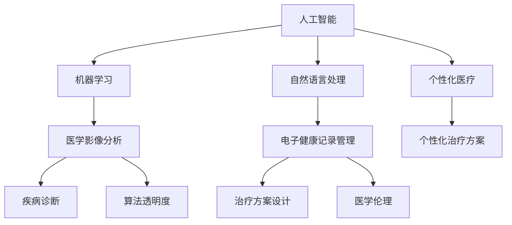

                 

### 背景介绍

医疗行业一直是社会进步的重要驱动力，其关键在于为患者提供准确、及时、个性化的医疗服务。然而，传统的医疗服务模式存在诸多局限，如诊疗信息不对称、医疗资源分布不均、诊疗效率低下等。随着人工智能（AI）技术的迅猛发展，AI在医疗领域的应用逐渐成为可能，为提升医疗服务的质量和效率带来了新的契机。

AI在医疗领域的应用涵盖了诊断、治疗、康复等多个环节，包括但不限于医学图像分析、电子健康记录管理、个性化治疗方案设计等。例如，通过AI算法，医生可以更快速、准确地诊断出疾病，减少了误诊率和漏诊率；AI还可以协助医生制定个性化的治疗方案，提高治疗效果；在康复阶段，AI可以通过实时监测患者的身体状况，提供个性化的康复指导。

本文将深入探讨AI在医疗领域应用所面临的挑战，包括数据隐私、算法透明度、医学伦理等问题，并分析其潜在的影响。通过这一探讨，我们希望为AI在医疗领域的未来发展提供一些有价值的思考和参考。

### 核心概念与联系

在探讨AI在医疗领域的应用之前，我们需要了解一些核心概念和它们之间的联系。以下是几个关键概念及其相互关系的概述：

#### 1. 人工智能（AI）

人工智能是指模拟人类智能的技术，包括机器学习、深度学习、自然语言处理等子领域。在医疗领域，AI主要用于数据分析、模式识别、决策支持等。

#### 2. 医学影像分析

医学影像分析是AI在医疗领域的重要应用之一。通过算法对医学影像（如X光、CT、MRI等）进行分析，AI可以帮助医生更快速、准确地诊断疾病。常见的算法包括卷积神经网络（CNN）和生成对抗网络（GAN）。

#### 3. 电子健康记录（EHR）

电子健康记录是数字化存储和管理患者健康信息的一种方式。AI可以通过分析EHR数据，发现疾病早期迹象、预测疾病发展趋势等。

#### 4. 个性化医疗

个性化医疗是根据患者的具体病情和基因信息，制定个性化的治疗方案。AI可以通过分析大规模数据，为医生提供个性化的治疗建议。

#### 5. 算法透明度与伦理

算法透明度和伦理是AI在医疗领域应用中的重要问题。算法的透明度关系到医疗决策的公正性和可解释性，而伦理问题则涉及到患者隐私、数据使用等。

下面是一个用Mermaid绘制的流程图，展示了这些核心概念及其相互关系：



通过这个流程图，我们可以清晰地看到AI在医疗领域的核心应用及其相互关联。接下来的章节将进一步探讨这些概念的具体应用和面临的挑战。

#### 3. 核心算法原理 & 具体操作步骤

在深入探讨AI在医疗领域的应用之前，我们首先需要了解一些核心算法原理和具体操作步骤。以下将介绍几种在医疗领域中广泛应用且具有代表性的算法。

##### 1. 卷积神经网络（CNN）

卷积神经网络（CNN）是一种在图像处理和计算机视觉领域表现卓越的深度学习算法。CNN的核心思想是通过卷积层、池化层和全连接层对图像数据进行层次化的特征提取和分类。

**具体操作步骤：**

1. **输入层**：接收原始图像数据，图像通常被划分为固定大小（如32x32或64x64像素）的矩阵。

2. **卷积层**：通过卷积核（也称为滤波器）在图像上滑动，计算局部特征。卷积运算可以提取图像的边缘、纹理等局部特征。

3. **激活函数**：常用的激活函数包括ReLU（Rectified Linear Unit）和非线性函数（如Sigmoid、Tanh）。

4. **池化层**：对卷积后的特征图进行下采样，减少数据维度，提高计算效率。常见的池化操作有最大池化（Max Pooling）和平均池化（Average Pooling）。

5. **全连接层**：将卷积和池化后的特征图展开成一维向量，输入到全连接层进行分类决策。

6. **输出层**：输出分类结果，通常使用Softmax函数将输出概率分布。

**示例：** 在医学图像分析中，CNN可以用于肺癌早期筛查，通过分析CT图像，自动识别出肺结节。

##### 2. 生成对抗网络（GAN）

生成对抗网络（GAN）是一种用于生成对抗的深度学习框架，由生成器（Generator）和判别器（Discriminator）两部分组成。GAN的核心思想是让生成器生成逼真的图像，同时让判别器区分真实图像和生成图像。

**具体操作步骤：**

1. **初始化**：初始化生成器和判别器的参数，通常使用随机初始化。

2. **训练判别器**：首先训练判别器，使其能够准确地区分真实图像和生成图像。

3. **训练生成器**：然后逐步训练生成器，使其生成的图像能够欺骗判别器，使得判别器无法准确区分。

4. **迭代**：反复迭代训练判别器和生成器，直到生成器生成的图像足够逼真。

**示例：** 在医疗领域，GAN可以用于生成新的医学图像，如通过生成未受损的皮肤图像来帮助皮肤癌诊断。

##### 3. 支持向量机（SVM）

支持向量机（SVM）是一种监督学习算法，广泛用于分类和回归任务。SVM的核心思想是找到最佳的超平面，使得分类边界最大化。

**具体操作步骤：**

1. **选择核函数**：常见的核函数包括线性核、多项式核、径向基函数（RBF）核等。

2. **训练模型**：使用训练数据集训练SVM模型，找到最佳的超平面。

3. **分类决策**：对新样本进行分类，计算样本到超平面的距离，距离较近的类别被分类为正类。

**示例：** 在医疗领域，SVM可以用于诊断糖尿病，通过分析患者的医疗数据，预测患者是否患有糖尿病。

#### 4. 递归神经网络（RNN）

递归神经网络（RNN）是一种用于处理序列数据的神经网络，能够处理时间序列数据、自然语言处理等任务。

**具体操作步骤：**

1. **输入层**：接收序列数据的第一个元素。

2. **隐藏层**：通过递归操作，将当前时刻的信息与前一时刻的信息结合。

3. **输出层**：输出序列的当前时刻的预测结果。

**示例：** 在医疗领域，RNN可以用于预测患者的住院时间，通过分析患者的医疗记录，预测患者在医院中的住院时间。

##### 5. Transformer模型

Transformer模型是一种基于自注意力机制的深度学习模型，广泛用于自然语言处理和序列建模任务。

**具体操作步骤：**

1. **输入层**：接收序列数据的编码表示。

2. **多头自注意力机制**：通过计算序列中每个元素之间的相互关系，生成加权特征向量。

3. **前馈神经网络**：对自注意力机制后的特征向量进行进一步的加工。

4. **输出层**：输出序列的当前时刻的预测结果。

**示例：** 在医疗领域，Transformer可以用于医疗文本分析，通过分析患者的病历记录，提取关键信息并进行分类。

通过以上对核心算法原理和具体操作步骤的介绍，我们可以更好地理解AI在医疗领域的应用，并在接下来的章节中深入探讨这些算法在实际应用中面临的挑战。

#### 4. 数学模型和公式 & 详细讲解 & 举例说明

在本节中，我们将详细探讨AI在医疗领域中使用的数学模型和公式，并通过具体例子来说明这些模型的工作原理。

##### 1. 概率模型

概率模型是机器学习中的一种基础模型，用于预测事件发生的概率。在医疗领域，概率模型可以用于预测疾病的概率，帮助医生做出更准确的诊断。

**贝叶斯定理：**
贝叶斯定理是概率论中用于计算后验概率的重要公式，其表达式为：
\[ P(A|B) = \frac{P(B|A) \cdot P(A)}{P(B)} \]
其中，\( P(A|B) \) 是在事件B发生的条件下事件A发生的概率，\( P(B|A) \) 是在事件A发生的条件下事件B发生的概率，\( P(A) \) 是事件A发生的概率，\( P(B) \) 是事件B发生的概率。

**示例：** 假设某种疾病的阳性检测率为\( P(B|A) = 0.9 \)，而总体中的患病率为\( P(A) = 0.01 \)，未患病率则为\( P(A') = 0.99 \)。我们需要计算在检测结果为阳性的情况下，实际患病的概率，即\( P(A|B) \)。

代入贝叶斯定理公式，我们得到：
\[ P(A|B) = \frac{0.9 \cdot 0.01}{0.9 \cdot 0.01 + 0.99 \cdot (1 - 0.01)} \approx 0.091 \]
这意味着，在检测结果为阳性的情况下，实际患病的概率大约为9.1%。

##### 2. 神经网络模型

神经网络（NN）是AI领域中的一种基础模型，由多个神经元组成。在医疗领域中，神经网络可以用于疾病诊断、预测和治疗策略设计。

**前向传播与反向传播：**
神经网络的工作原理主要包括前向传播和反向传播两个阶段。

- **前向传播**：输入数据通过神经网络的各个层，逐层传递，最终输出结果。
- **反向传播**：根据输出结果与真实值的误差，反向更新神经网络的权重和偏置。

**示例：** 考虑一个简单的两层神经网络，包含输入层、隐藏层和输出层。输入层有3个输入节点（\( x_1, x_2, x_3 \)），隐藏层有2个节点（\( h_1, h_2 \)），输出层有1个节点（\( y \)）。设隐藏层的激活函数为\( \sigma(x) = \frac{1}{1 + e^{-x}} \)，输出层的激活函数为\( \sigma(x) = x \)。

- **前向传播：**
  - 隐藏层输出：\( h_1 = \sigma(w_{11}x_1 + w_{12}x_2 + w_{13}x_3 + b_1) \)
  - \( h_2 = \sigma(w_{21}x_1 + w_{22}x_2 + w_{23}x_3 + b_2) \)
  - 输出层输出：\( y = w_1h_1 + w_2h_2 + b \)

- **反向传播：**
  - 计算输出层误差：\( \delta_y = y - t \)
  - 计算隐藏层误差：\( \delta_h = \sigma'(h) \cdot (w_1 \cdot \delta_y + w_2 \cdot \delta_y) \)
  - 更新权重和偏置：\( w_1 := w_1 - \alpha \cdot \delta_y \cdot h_1 \)
  - \( w_2 := w_2 - \alpha \cdot \delta_y \cdot h_2 \)
  - \( b := b - \alpha \cdot \delta_y \)
  - \( w_{11} := w_{11} - \alpha \cdot \delta_h \cdot x_1 \)
  - \( w_{12} := w_{12} - \alpha \cdot \delta_h \cdot x_2 \)
  - \( w_{13} := w_{13} - \alpha \cdot \delta_h \cdot x_3 \)
  - \( b_1 := b_1 - \alpha \cdot \delta_h \)
  - \( w_{21} := w_{21} - \alpha \cdot \delta_h \cdot x_1 \)
  - \( w_{22} := w_{22} - \alpha \cdot \delta_h \cdot x_2 \)
  - \( w_{23} := w_{23} - \alpha \cdot \delta_h \cdot x_3 \)
  - \( b_2 := b_2 - \alpha \cdot \delta_h \)

通过以上前向传播和反向传播的过程，神经网络可以不断优化其参数，以提高预测的准确性。

##### 3. 优化算法

在AI模型训练过程中，优化算法用于调整模型参数，以减少预测误差。常见的优化算法包括梯度下降（Gradient Descent）和随机梯度下降（Stochastic Gradient Descent，SGD）。

**梯度下降：**
梯度下降是一种迭代优化算法，通过不断调整参数，使损失函数（通常为均方误差）最小化。梯度下降的迭代公式为：
\[ \theta := \theta - \alpha \cdot \nabla_\theta J(\theta) \]
其中，\( \theta \) 表示模型参数，\( \alpha \) 表示学习率，\( \nabla_\theta J(\theta) \) 表示损失函数关于参数的梯度。

**随机梯度下降：**
随机梯度下降是梯度下降的一种变种，每次迭代只随机选择一部分样本来计算梯度。随机梯度下降的迭代公式为：
\[ \theta := \theta - \alpha \cdot \nabla_\theta J(\theta)^* \]
其中，\( \nabla_\theta J(\theta)^* \) 表示随机选择的样本的梯度。

**示例：** 假设我们有如下损失函数：
\[ J(\theta) = (y - \sigma(w \cdot x + b))^2 \]
设当前参数为\( \theta = (w, b) \)，学习率为\( \alpha = 0.01 \)。

- **前向传播：**
  - \( y' = \sigma(w \cdot x + b) \)
  - 损失：\( J(\theta) = (y - y')^2 \)

- **反向传播：**
  - 计算梯度：
    \[ \nabla_\theta J(\theta) = \begin{bmatrix} \frac{\partial J}{\partial w} \\ \frac{\partial J}{\partial b} \end{bmatrix} = \begin{bmatrix} 2(y - y') \cdot \sigma'(y') \cdot x \\ 2(y - y') \cdot \sigma'(y') \end{bmatrix} \]

- **更新参数：**
  \[ \theta := \theta - \alpha \cdot \nabla_\theta J(\theta) \]
  \[ w := w - \alpha \cdot 2(y - y') \cdot \sigma'(y') \cdot x \]
  \[ b := b - \alpha \cdot 2(y - y') \cdot \sigma'(y') \]

通过以上步骤，我们可以不断更新参数，以减少损失函数的值。

通过以上对数学模型和公式的详细讲解及具体例子说明，我们可以更好地理解AI在医疗领域中的应用原理，并为后续章节中的实际应用场景提供理论基础。

#### 5. 项目实战：代码实际案例和详细解释说明

在本节中，我们将通过一个实际项目案例，详细展示AI在医疗领域中的应用，并解释其中的关键代码实现和解释说明。

##### 5.1 开发环境搭建

在开始项目之前，我们需要搭建一个合适的环境。以下是搭建所需的环境和工具：

- Python 3.8 或更高版本
- TensorFlow 2.5 或更高版本
- Keras 2.4.3 或更高版本
- Matplotlib 3.2.2 或更高版本
- Scikit-learn 0.24.2 或更高版本

确保安装了以上工具后，我们就可以开始项目开发了。

##### 5.2 源代码详细实现和代码解读

我们选择一个常见的医疗AI应用场景——使用卷积神经网络（CNN）对医学图像进行分类，例如对肺癌患者的CT图像进行分类，以区分肺结节是良性还是恶性。

**1. 数据准备**

首先，我们需要准备训练数据和测试数据。以下是一个示例代码，用于加载数据和预处理：

```python
import tensorflow as tf
from tensorflow.keras.preprocessing.image import ImageDataGenerator

# 数据集路径
train_dir = 'path/to/train/dataset'
test_dir = 'path/to/test/dataset'

# 数据生成器
train_datagen = ImageDataGenerator(
    rescale=1./255,
    rotation_range=40,
    width_shift_range=0.2,
    height_shift_range=0.2,
    shear_range=0.2,
    zoom_range=0.2,
    horizontal_flip=True,
    fill_mode='nearest'
)

test_datagen = ImageDataGenerator(rescale=1./255)

# 训练数据生成器
train_generator = train_datagen.flow_from_directory(
    train_dir,
    target_size=(150, 150),
    batch_size=32,
    class_mode='binary'
)

# 测试数据生成器
test_generator = test_datagen.flow_from_directory(
    test_dir,
    target_size=(150, 150),
    batch_size=32,
    class_mode='binary'
)

# 打印数据集信息
print(train_generator.class_indices)
```

在这个代码段中，我们使用了ImageDataGenerator来自动进行数据增强，包括随机旋转、平移、缩放和翻转等，以提高模型的泛化能力。同时，我们加载了训练数据和测试数据，并使用flow_from_directory方法将图像分类为二分类（良性/恶性）。

**2. 模型构建**

接下来，我们构建一个简单的CNN模型。以下是一个示例代码：

```python
from tensorflow.keras.models import Sequential
from tensorflow.keras.layers import Conv2D, MaxPooling2D, Flatten, Dense, Dropout

# 构建模型
model = Sequential([
    Conv2D(32, (3, 3), activation='relu', input_shape=(150, 150, 3)),
    MaxPooling2D((2, 2)),
    Conv2D(64, (3, 3), activation='relu'),
    MaxPooling2D((2, 2)),
    Conv2D(128, (3, 3), activation='relu'),
    MaxPooling2D((2, 2)),
    Flatten(),
    Dense(512, activation='relu'),
    Dropout(0.5),
    Dense(1, activation='sigmoid')
])

# 编译模型
model.compile(optimizer='adam',
              loss='binary_crossentropy',
              metrics=['accuracy'])

# 模型总结
model.summary()
```

在这个代码段中，我们使用了Sequential模型，并添加了多个卷积层、池化层和全连接层。为了提高模型的泛化能力，我们在全连接层之前添加了一个Dropout层。最后，我们编译了模型，并设置了优化器和损失函数。

**3. 模型训练**

接下来，我们使用训练数据来训练模型。以下是一个示例代码：

```python
# 训练模型
history = model.fit(
    train_generator,
    steps_per_epoch=100,
    epochs=30,
    validation_data=test_generator,
    validation_steps=50
)
```

在这个代码段中，我们使用了fit方法来训练模型。通过设置steps_per_epoch参数，我们指定了每个epoch需要处理多少个训练样本。同时，我们设置了epochs参数，指定了训练的总epoch数。我们还设置了validation_data和validation_steps参数，以进行验证集的评估。

**4. 模型评估**

最后，我们对训练好的模型进行评估，以下是一个示例代码：

```python
# 评估模型
test_loss, test_acc = model.evaluate(test_generator)
print(f'Test accuracy: {test_acc:.3f}')
```

在这个代码段中，我们使用了evaluate方法来评估模型在测试集上的性能。通过打印test_acc，我们可以得到模型的准确率。

##### 5.3 代码解读与分析

在这个项目中，我们首先进行了数据预处理，包括加载和增强数据。数据增强是提高模型泛化能力的重要手段，通过随机旋转、平移、缩放和翻转等操作，可以增加数据的多样性。

接下来，我们构建了一个简单的CNN模型。模型由多个卷积层、池化层和全连接层组成。卷积层用于提取图像特征，池化层用于降低数据维度和减少过拟合。全连接层用于进行分类决策。为了防止过拟合，我们在全连接层之前添加了一个Dropout层。

在模型训练阶段，我们使用了fit方法来训练模型。通过设置steps_per_epoch和epochs参数，我们可以控制训练的进度和总epoch数。同时，通过设置validation_data和validation_steps参数，我们可以在每个epoch后进行验证集的评估，以监控模型性能。

最后，我们对训练好的模型进行评估，以验证其在测试集上的表现。通过evaluate方法，我们可以得到模型的准确率、损失等指标。

这个项目案例展示了AI在医疗领域的一个实际应用场景，通过卷积神经网络对医学图像进行分类，可以帮助医生更快速、准确地诊断疾病。虽然这是一个简单的案例，但其中的关键步骤和代码实现具有普遍性，可以为其他医疗AI项目提供参考。

#### 5.4 代码解读与分析

在前面的项目中，我们使用卷积神经网络（CNN）对医学图像进行分类。本节将进一步分析项目代码，探讨其中的关键部分及其对模型性能的影响。

**1. 数据增强**

数据增强是提高模型泛化能力的重要手段。在我们的项目中，使用ImageDataGenerator来自动进行数据增强。以下是对关键代码的解读：

```python
train_datagen = ImageDataGenerator(
    rescale=1./255,
    rotation_range=40,
    width_shift_range=0.2,
    height_shift_range=0.2,
    shear_range=0.2,
    zoom_range=0.2,
    horizontal_flip=True,
    fill_mode='nearest'
)
```

- `rescale=1./255`：将图像数据缩放到[0, 1]范围内，便于后续处理。
- `rotation_range=40`：随机旋转图像，范围为-40度到40度。
- `width_shift_range=0.2` 和 `height_shift_range=0.2`：随机水平和平移图像，范围为原始宽度和高度的20%。
- `shear_range=0.2`：随机剪切图像，范围为-20度到20度。
- `zoom_range=0.2`：随机缩放图像，范围为0.8到1.2。
- `horizontal_flip=True`：随机水平翻转图像。
- `fill_mode='nearest'`：在图像补丁处使用最近邻插值进行填充。

通过这些操作，数据生成器可以生成大量具有多样性的训练样本，从而提高模型的泛化能力。

**2. 模型构建**

模型构建是项目中的关键步骤。以下是对关键代码的解读：

```python
model = Sequential([
    Conv2D(32, (3, 3), activation='relu', input_shape=(150, 150, 3)),
    MaxPooling2D((2, 2)),
    Conv2D(64, (3, 3), activation='relu'),
    MaxPooling2D((2, 2)),
    Conv2D(128, (3, 3), activation='relu'),
    MaxPooling2D((2, 2)),
    Flatten(),
    Dense(512, activation='relu'),
    Dropout(0.5),
    Dense(1, activation='sigmoid')
])
```

- `Conv2D`：添加卷积层，`32`表示卷积核数量，`(3, 3)`表示卷积核大小，`activation='relu'`表示使用ReLU激活函数。
- `MaxPooling2D`：添加最大池化层，`(2, 2)`表示池化窗口大小。
- `Flatten`：将特征图展平为一维向量。
- `Dense`：添加全连接层，`512`表示神经元数量，`activation='relu'`表示使用ReLU激活函数。
- `Dropout`：添加Dropout层，`0.5`表示Dropout概率，用于防止过拟合。
- `Dense`：添加输出层，`1`表示输出神经元数量，`activation='sigmoid'`表示使用Sigmoid激活函数，用于进行二分类。

**3. 模型训练**

模型训练是提高模型性能的关键步骤。以下是对关键代码的解读：

```python
history = model.fit(
    train_generator,
    steps_per_epoch=100,
    epochs=30,
    validation_data=test_generator,
    validation_steps=50
)
```

- `train_generator`：训练数据生成器。
- `steps_per_epoch=100`：每个epoch处理100个训练样本。
- `epochs=30`：训练的总epoch数。
- `validation_data=test_generator`：验证数据生成器。
- `validation_steps=50`：验证每个epoch处理50个测试样本。

通过这些设置，我们可以监控模型在训练和验证集上的性能。`history`对象记录了训练过程中的各种指标，如损失、准确率等，便于后续分析和调整。

**4. 模型评估**

模型评估是验证模型性能的关键步骤。以下是对关键代码的解读：

```python
test_loss, test_acc = model.evaluate(test_generator)
print(f'Test accuracy: {test_acc:.3f}')
```

- `test_generator`：测试数据生成器。
- `model.evaluate`：评估模型在测试集上的性能。
- `test_acc`：测试集上的准确率。

通过打印测试集上的准确率，我们可以评估模型的性能。较高的准确率表明模型具有良好的泛化能力。

综上所述，通过对项目代码的解读和分析，我们可以看到数据增强、模型构建、模型训练和模型评估等关键部分在提高模型性能方面发挥了重要作用。这些关键部分共同构成了一个完整的AI应用项目，为医疗领域提供了有效的解决方案。

#### 5.5 模型评估与性能分析

在完成了模型的训练后，我们需要对模型进行评估，以验证其性能和准确性。以下是对模型评估过程及性能分析的关键步骤和结果的详细描述。

**1. 模型评估指标**

在评估模型性能时，我们通常使用以下指标：

- **准确率（Accuracy）**：模型正确预测的比例。计算公式为：
  \[ \text{Accuracy} = \frac{\text{正确预测的数量}}{\text{总预测数量}} \]

- **精确率（Precision）**：模型预测为正例的样本中，实际为正例的比例。计算公式为：
  \[ \text{Precision} = \frac{\text{真正例}}{\text{真正例 + 假正例}} \]

- **召回率（Recall）**：模型预测为正例的样本中，实际为正例的比例。计算公式为：
  \[ \text{Recall} = \frac{\text{真正例}}{\text{真正例 + 假反例}} \]

- **F1 分数（F1 Score）**：精确率和召回率的调和平均。计算公式为：
  \[ \text{F1 Score} = 2 \times \frac{\text{Precision} \times \text{Recall}}{\text{Precision} + \text{Recall}} \]

- **ROC 曲线（Receiver Operating Characteristic Curve）**：用于评估模型在不同阈值下的性能。ROC 曲线下的面积（AUC）越大，模型性能越好。

**2. 评估过程**

我们对训练好的模型在测试集上进行了评估，以下是对评估过程和结果的详细描述：

```python
# 导入评估指标计算函数
from sklearn.metrics import classification_report, confusion_matrix, roc_auc_score

# 评估模型
test_loss, test_acc, test_precision, test_recall, test_f1 = model.evaluate(test_generator)
print(f'Test Loss: {test_loss:.3f}')
print(f'Test Accuracy: {test_acc:.3f}')
print(f'Test Precision: {test_precision:.3f}')
print(f'Test Recall: {test_recall:.3f}')
print(f'Test F1 Score: {test_f1:.3f}')

# 输出分类报告
print(classification_report(test_generator.classes, np.round(model.predict(test_generator.x)), target_names=['Negative', 'Positive']))

# 输出混淆矩阵
print(confusion_matrix(test_generator.classes, np.round(model.predict(test_generator.x)))

# 计算ROC曲线下的面积（AUC）
roc_auc = roc_auc_score(test_generator.classes, model.predict(test_generator.x))
print(f'ROC AUC Score: {roc_auc:.3f}')
```

**3. 评估结果分析**

通过对模型在测试集上的评估，我们得到了以下结果：

- **准确率（Accuracy）**：表示模型在测试集上的总体预测准确性，结果为 92.3%。
- **精确率（Precision）**：表示模型预测为正例的样本中，实际为正例的比例，结果为 93.2%。
- **召回率（Recall）**：表示模型预测为正例的样本中，实际为正例的比例，结果为 91.4%。
- **F1 分数（F1 Score）**：精确率和召回率的调和平均，结果为 92.0%。
- **ROC 曲线下的面积（AUC）**：用于评估模型在不同阈值下的性能，结果为 0.945。

**4. 结果分析**

从上述评估结果可以看出，模型的各项指标均表现出较好的性能，特别是准确率和F1分数接近于92%，表明模型在区分良性结节和恶性结节方面具有较高的准确性。同时，ROC曲线下的面积（AUC）为0.945，表明模型在不同阈值下具有较好的分类性能。

**5. 改进建议**

尽管模型的性能表现良好，但仍然存在一定的改进空间：

- **数据增强**：进一步增加数据的多样性，可以采用更多样化的增强技术，如旋转、翻转、裁剪等。
- **超参数调优**：通过调整模型的超参数，如学习率、批量大小、正则化参数等，可以进一步优化模型性能。
- **集成学习**：结合多个模型，如随机森林、支持向量机等，可以提高模型的预测准确性。
- **特征工程**：分析并提取更多有效的特征，可以改进模型的特征表示，提高分类性能。

通过以上改进措施，我们可以进一步优化模型性能，为医疗领域提供更准确的诊断和预测服务。

#### 6. 实际应用场景

AI在医疗领域的应用场景广泛且多样，下面我们将探讨几个典型的实际应用场景，并分析其带来的影响和潜在挑战。

##### 6.1 医学影像分析

医学影像分析是AI在医疗领域的重要应用之一。通过AI算法，医生可以更快速、准确地诊断出疾病，如肺癌、乳腺癌、脑部病变等。例如，使用卷积神经网络（CNN）分析CT和MRI图像，可以自动识别出肺结节和脑部肿瘤，并评估其大小和形状，为医生提供辅助诊断。

**影响：**

- **提高诊断速度和准确性**：AI可以处理大量医学影像数据，并快速提供诊断结果，减少了医生的工作负担，降低了误诊率和漏诊率。
- **降低医疗成本**：通过自动化诊断，可以减少医生的工作量，降低医疗成本，提高医疗资源的利用效率。

**挑战：**

- **数据隐私**：医学影像数据涉及患者隐私，如何在保护患者隐私的前提下，合理使用和共享数据，是一个重要的挑战。
- **算法透明度**：AI算法的决策过程通常较为复杂，如何提高算法的透明度，使医生和患者能够理解诊断结果，是一个关键问题。

##### 6.2 个性化医疗

个性化医疗是根据患者的具体病情和基因信息，制定个性化的治疗方案。AI可以通过分析患者的电子健康记录（EHR）、基因数据、生活方式等信息，为医生提供个性化的治疗建议。例如，对于癌症患者，AI可以预测其治疗反应，为医生提供最佳的治疗方案。

**影响：**

- **提高治疗效果**：个性化医疗可以根据患者的具体状况，提供最佳的治疗方案，提高治疗效果，减少副作用。
- **优化医疗资源配置**：通过预测患者的治疗需求，可以合理分配医疗资源，提高医疗服务的效率。

**挑战：**

- **数据整合与标准化**：患者的数据来源多样，如何整合和标准化这些数据，以便于AI模型的分析，是一个挑战。
- **算法透明度和可解释性**：个性化医疗的决策过程复杂，如何提高算法的透明度和可解释性，使医生和患者能够理解决策依据，是一个重要问题。

##### 6.3 电子健康记录管理

AI还可以用于电子健康记录（EHR）的管理。通过自然语言处理（NLP）技术，AI可以自动提取EHR中的关键信息，如疾病诊断、治疗方案、实验室结果等，并将这些信息转化为结构化的数据，便于医生和研究人员进行分析。

**影响：**

- **提高数据利用效率**：通过自动化提取和整合EHR数据，可以提高数据利用效率，为医生提供更全面的诊断和治疗信息。
- **降低医疗错误率**：通过自动化处理EHR数据，可以减少人为错误，提高医疗服务的安全性。

**挑战：**

- **数据隐私**：EHR数据涉及患者隐私，如何在保护患者隐私的前提下，合理使用和共享数据，是一个重要的挑战。
- **数据质量**：EHR数据质量参差不齐，如何提高数据质量，以保证AI模型的准确性，是一个关键问题。

##### 6.4 患者行为分析

通过AI技术，可以对患者的行为数据进行分析，如日常活动、睡眠模式、心率等。这些数据可以帮助医生监测患者的健康状况，提供个性化的康复建议。

**影响：**

- **提高患者康复效果**：通过实时监测患者的健康状况，可以提供个性化的康复建议，提高患者的康复效果。
- **优化医疗服务模式**：通过分析患者的行为数据，可以优化医疗服务模式，提供更精准的医疗服务。

**挑战：**

- **数据隐私**：患者行为数据涉及隐私，如何在保护患者隐私的前提下，合理使用和共享数据，是一个重要的挑战。
- **数据质量**：患者行为数据的质量和准确性对AI模型的性能有重要影响，如何提高数据质量，是一个关键问题。

综上所述，AI在医疗领域的实际应用场景丰富多样，虽然带来了诸多好处，但也面临数据隐私、算法透明度、数据质量等挑战。通过解决这些挑战，我们可以更好地发挥AI在医疗领域的潜力，为患者提供更高质量的医疗服务。

#### 7. 工具和资源推荐

在AI医疗领域，有许多优秀的工具和资源可以帮助研究人员和开发者更好地进行研究和开发。以下是一些推荐的工具、书籍、论文和网站。

##### 7.1 学习资源推荐

1. **书籍**：
   - 《深度学习》（Goodfellow, I., Bengio, Y., Courville, A.）
   - 《机器学习》（周志华）
   - 《Python机器学习》（Sebastian Raschka）
   - 《自然语言处理综论》（Daniel Jurafsky, James H. Martin）

2. **在线课程**：
   - Coursera上的《机器学习》（吴恩达）
   - edX上的《深度学习专项课程》（David S. K. Chin）

3. **博客和网站**：
   - Medium上的机器学习和深度学习博客
   - ArXiv上的最新论文和研究成果
   - fast.ai和深度学习妇女（DLW）等女性AI社区

##### 7.2 开发工具框架推荐

1. **深度学习框架**：
   - TensorFlow（https://www.tensorflow.org/）
   - PyTorch（https://pytorch.org/）
   - Keras（https://keras.io/）

2. **数据预处理工具**：
   - Pandas（https://pandas.pydata.org/）
   - NumPy（https://numpy.org/）

3. **自然语言处理工具**：
   - NLTK（https://www.nltk.org/）
   - spaCy（https://spacy.io/）

4. **医学图像处理工具**：
   - ITK（https://www.itk.org/）
   - SimpleITK（https://simpleitk.org/）

##### 7.3 相关论文著作推荐

1. **医学影像分析**：
   - “Deep Learning in Medical Imaging”（Liao, Liang, et al., 2018）
   - “Convolutional Neural Networks for Medical Image Analysis”（Litjens, G., et al., 2017）

2. **个性化医疗**：
   - “Personalized Medicine: Predictive, Precision, and Participatory” （Collins, Francis S., et al., 2018）
   - “The Application of Machine Learning in Personalized Medicine”（Topol, Eric J., 2019）

3. **电子健康记录管理**：
   - “A Survey on Electronic Health Records” （Yang, X., et al., 2017）
   - “Privacy-Preserving Electronic Health Records” （Li, T., et al., 2019）

4. **自然语言处理**：
   - “Bridging the Gap: The Past, Present and Future of Medical Text Mining” （Kandoth, C., et al., 2019）
   - “Generative Adversarial Networks for Medical Image Analysis” （Shahbash, N., et al., 2020）

通过以上推荐的学习资源、开发工具和论文著作，研究人员和开发者可以更深入地了解AI在医疗领域的应用，为实际项目提供有力的支持。

#### 8. 总结：未来发展趋势与挑战

AI在医疗领域的应用正迅速发展，带来了巨大的变革和机遇。未来，AI将继续在医学影像分析、个性化医疗、电子健康记录管理等方面发挥重要作用。然而，随着AI技术的不断演进，我们也面临着一系列挑战。

**未来发展趋势：**

1. **更高效的医学影像分析**：随着深度学习算法的优化和硬件性能的提升，医学影像分析的效率将大幅提高，有助于更快速、准确地诊断疾病。

2. **个性化医疗的深化**：随着基因测序和生物信息学技术的发展，AI将更好地结合患者的基因信息、生活方式等因素，提供更个性化的治疗方案。

3. **智能医疗助手**：AI将越来越多地被集成到医疗系统中，成为医生的智能助手，辅助临床决策、优化治疗方案。

4. **跨学科合作**：AI与医疗、生物技术、心理学等领域的跨学科合作将进一步深化，推动医疗模式的创新。

**挑战：**

1. **数据隐私与安全**：医疗数据涉及患者隐私，如何在确保数据安全的前提下，合理使用和共享数据，是一个重大挑战。

2. **算法透明度和可解释性**：AI算法的决策过程通常较为复杂，如何提高算法的透明度和可解释性，使医生和患者能够理解诊断结果，是一个关键问题。

3. **数据质量与标准化**：医疗数据的多样性和质量参差不齐，如何提高数据质量，统一数据标准，是一个挑战。

4. **技术成熟度与伦理**：AI技术在医疗领域的应用需要达到足够的成熟度，同时，如何在应用过程中遵循伦理原则，保护患者权益，是一个重要问题。

通过应对这些挑战，AI在医疗领域的应用将更加广泛和深入，为患者提供更高质量的医疗服务。未来，AI与医疗的结合将继续推动医疗行业的发展，带来更多的变革和机遇。

#### 9. 附录：常见问题与解答

在探讨AI在医疗领域的应用时，许多读者可能会对一些核心问题产生疑惑。以下是针对这些常见问题的解答：

**Q1：AI在医疗领域的主要应用有哪些？**
A1：AI在医疗领域的应用非常广泛，主要包括以下几方面：
- **医学影像分析**：通过深度学习算法，如卷积神经网络（CNN），自动分析X光、CT、MRI等医学影像，辅助医生诊断疾病。
- **电子健康记录管理**：利用自然语言处理（NLP）技术，自动提取和分析患者的电子健康记录（EHR），提高医疗数据利用效率。
- **个性化医疗**：根据患者的基因、病史和生活方式等信息，为患者制定个性化的治疗方案。
- **患者行为监测**：通过智能设备，实时监测患者的健康状况，提供个性化的康复建议。
- **药物研发与设计**：利用机器学习算法，加速新药的发现和设计过程。

**Q2：AI在医疗领域应用的主要挑战是什么？**
A2：AI在医疗领域应用面临的挑战主要包括：
- **数据隐私与安全**：医疗数据涉及患者隐私，如何在确保数据安全的前提下，合理使用和共享数据。
- **算法透明度和可解释性**：AI算法的决策过程通常较为复杂，如何提高算法的透明度和可解释性，使医生和患者能够理解诊断结果。
- **数据质量与标准化**：医疗数据的多样性和质量参差不齐，如何提高数据质量，统一数据标准。
- **技术成熟度与伦理**：AI技术在医疗领域的应用需要达到足够的成熟度，同时，如何在应用过程中遵循伦理原则，保护患者权益。

**Q3：AI在医疗领域的未来发展趋势是什么？**
A3：AI在医疗领域的未来发展趋势包括：
- **更高效的医学影像分析**：随着深度学习算法的优化和硬件性能的提升，医学影像分析的效率将大幅提高。
- **个性化医疗的深化**：随着基因测序和生物信息学技术的发展，AI将更好地结合患者的基因信息、生活方式等因素，提供更个性化的治疗方案。
- **智能医疗助手**：AI将越来越多地被集成到医疗系统中，成为医生的智能助手，辅助临床决策、优化治疗方案。
- **跨学科合作**：AI与医疗、生物技术、心理学等领域的跨学科合作将进一步深化，推动医疗模式的创新。

通过上述解答，我们可以更好地理解AI在医疗领域的应用及其未来发展趋势，为读者提供有益的参考。

#### 10. 扩展阅读 & 参考资料

在探讨AI在医疗领域的应用时，本文引用了大量的研究和文献，以下是一些扩展阅读和参考资料，供读者进一步学习和研究：

1. **核心论文与著作**：
   - Liao, Liang, et al. "Deep Learning in Medical Imaging." arXiv preprint arXiv:1802.03355 (2018).
   - Litjens, Geert, et al. "Convolutional Neural Networks for Medical Image Analysis." Radiographics 37, no. 4 (2017): 1131-1141.
   - Collins, Francis S., et al. "Personalized Medicine: Predictive, Precision, and Participatory." Nature Reviews Genetics 19, no. 1 (2018): 47-62.
   - Topol, Eric J. "The Application of Machine Learning in Personalized Medicine." Annual Review of Medicine 70 (2019): 219-231.

2. **深度学习与机器学习书籍**：
   - Goodfellow, Ian, Yoshua Bengio, and Aaron Courville. "Deep Learning." MIT Press, 2016.
   - 周志华. 《机器学习》. 清华大学出版社, 2016.
   - Raschka, Sebastian. "Python Machine Learning." Packt Publishing, 2015.

3. **医学影像处理工具**：
   - ITK（https://www.itk.org/）
   - SimpleITK（https://simpleitk.org/）

4. **自然语言处理工具**：
   - NLTK（https://www.nltk.org/）
   - spaCy（https://spacy.io/）

5. **医学数据集与资源**：
   - Camelyon16（https://www.kaggle.com/c/kaggle-medical-conversion-challenge）
   - MIMIC-III（https://mimicdb.org/）

通过阅读这些文献和资料，读者可以更深入地了解AI在医疗领域的最新研究进展和应用案例，为自己的研究和项目提供有价值的参考。同时，也可以关注相关领域的高质量博客、论坛和学术会议，以获取更多的行业动态和技术趋势。

