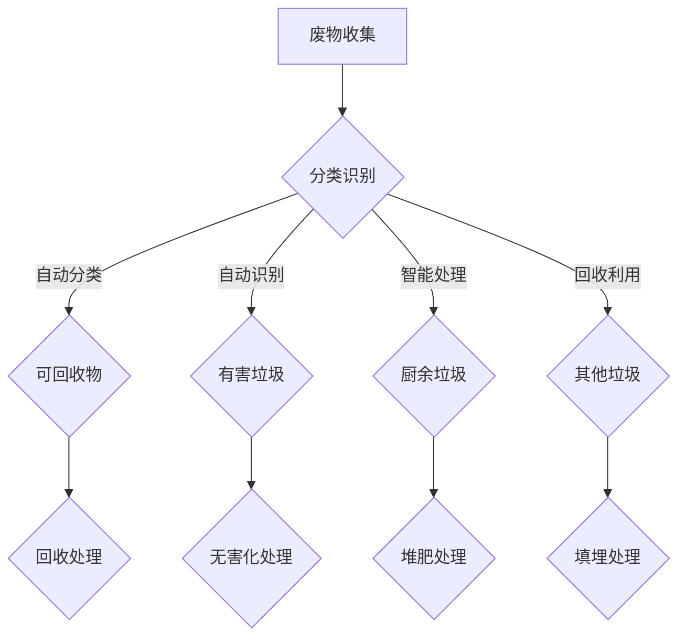

                 

# AI在废物管理中的应用：提高回收效率

## 摘要

本文将深入探讨人工智能（AI）技术在废物管理中的应用，着重分析如何通过AI提高废物回收效率。首先，我们将回顾废物管理的背景及其面临的挑战，接着介绍AI在废物分类、识别和自动化回收等环节的核心应用。然后，我们将详细讲解AI在废物管理中的核心算法原理与数学模型，并通过实际项目案例展示AI在废物管理中的具体实现。随后，文章将讨论AI在废物管理中的实际应用场景，并提供相关工具和资源推荐。最后，我们将总结AI在废物管理中的未来发展趋势与挑战，并给出常见问题与解答。

## 1. 背景介绍

### 废物管理的现状

随着全球经济的发展和人口的增长，废物产生量逐年增加。据联合国环境规划署（UNEP）估计，全球每年产生的废物量已超过100亿吨。这些废物不仅占用大量土地，而且对环境造成了严重的污染。传统的废物处理方法主要包括填埋、焚烧和堆肥等，但这些方法存在诸多问题，如土地资源的消耗、有害气体的排放和污染的扩散等。因此，提高废物回收效率，减少废物对环境的负面影响，已成为全球共同面临的紧迫任务。

### 废物管理的挑战

1. 废物分类困难：传统的废物分类方法主要依靠人工识别，但由于废物种类繁多，分类准确性较低，导致回收效率不高。

2. 废物识别不准确：废物识别是废物回收的重要环节，但传统的识别方法存在误识别率高、识别速度慢等问题，限制了废物回收的自动化水平。

3. 废物处理成本高：传统的废物处理方法成本较高，特别是在处理高价值废物的过程中，成本更加昂贵。

4. 环境污染问题：废物处理不当会导致有害物质的释放，对空气、水和土壤造成污染，威胁人类健康。

### AI在废物管理中的应用前景

随着AI技术的不断发展，其在废物管理中的应用前景逐渐明朗。AI技术具有以下优势：

1. 高效的废物分类：AI可以通过深度学习等技术实现自动分类，提高分类准确性。

2. 精准的废物识别：AI可以通过图像识别、声音识别等技术实现自动识别，提高识别速度和准确性。

3. 降低处理成本：AI技术可以实现废物处理过程的自动化，降低人力成本和运营成本。

4. 减少环境污染：AI技术可以实现废物处理过程的精细化控制，减少有害物质的释放。

综上所述，AI技术在废物管理中的应用具有巨大的潜力，有望解决废物管理面临的诸多挑战。

## 2. 核心概念与联系

### 废物管理中的核心概念

在废物管理中，核心概念包括废物分类、废物识别、废物处理和废物回收。这些概念相互联系，共同构成了废物管理的全流程。

- **废物分类**：根据废物的性质和成分将其分为不同的类别，如可回收物、有害垃圾、厨余垃圾和其他垃圾。

- **废物识别**：通过技术手段对废物进行识别，包括通过图像识别、声音识别等方式确定废物的种类。

- **废物处理**：对废物进行预处理、分解、转化等操作，使其达到无害化、资源化或减量化。

- **废物回收**：对可回收的废物进行再利用或再生处理，实现资源的循环利用。

### AI技术在废物管理中的应用

AI技术在废物管理中的应用主要包括以下几个方面：

- **废物分类**：AI可以通过图像识别技术对废物进行自动分类，提高分类效率和准确性。

- **废物识别**：AI可以通过深度学习算法对废物进行识别，提高识别速度和准确性。

- **废物处理**：AI可以通过智能控制系统对废物处理过程进行监控和优化，提高处理效率和效果。

- **废物回收**：AI可以通过数据分析技术对废物回收过程进行优化，提高回收率和经济效益。

### Mermaid 流程图

下面是废物管理中AI技术应用的一个简单流程图：



### 2.1. 废物分类算法

在废物分类中，常用的算法包括K-均值聚类、支持向量机和深度学习等。

- **K-均值聚类**：通过将数据点划分为K个簇，实现废物的分类。适用于数据量较小且类别较少的场景。

- **支持向量机**：通过找到最佳分类边界，实现废物的分类。适用于高维数据且分类边界明显的场景。

- **深度学习**：通过构建深度神经网络，实现自动分类。适用于数据量大且类别复杂的情况。

### 2.2. 废物识别算法

在废物识别中，常用的算法包括卷积神经网络（CNN）、循环神经网络（RNN）和生成对抗网络（GAN）等。

- **卷积神经网络（CNN）**：通过卷积层提取图像特征，实现废物的识别。适用于图像数据。

- **循环神经网络（RNN）**：通过循环结构处理序列数据，实现废物的识别。适用于语音和文本数据。

- **生成对抗网络（GAN）**：通过生成器和判别器的对抗训练，实现废物的识别。适用于生成新数据。

### 2.3. 废物处理算法

在废物处理中，常用的算法包括智能控制系统和优化算法。

- **智能控制系统**：通过传感器和执行器实现废物处理过程的自动化控制。适用于需要对处理过程进行实时监控和调整的场景。

- **优化算法**：通过优化目标函数，实现对废物处理过程的优化。适用于处理复杂且多目标的场景。

## 3. 核心算法原理 & 具体操作步骤

### 3.1. 废物分类算法原理

在废物分类中，常用的算法是K-均值聚类和支持向量机。下面分别介绍这两种算法的原理和具体操作步骤。

#### 3.1.1. K-均值聚类

K-均值聚类是一种基于距离的聚类算法，其核心思想是将数据点划分为K个簇，使得每个数据点到其簇中心的距离最小。具体步骤如下：

1. 初始化K个簇中心，可以选择随机初始化或使用K-均值初始化。
2. 对于每个数据点，计算其到K个簇中心的距离，并将其分配到最近的簇。
3. 根据新的聚类结果更新簇中心。
4. 重复步骤2和3，直到聚类结果收敛。

#### 3.1.2. 支持向量机

支持向量机是一种监督学习算法，其核心思想是找到最佳分类边界，使得分类边界上的数据点与分类边界的距离最大。具体步骤如下：

1. 使用训练数据集训练模型，找到最佳分类边界。
2. 使用测试数据集进行分类预测。

### 3.2. 废物识别算法原理

在废物识别中，常用的算法是卷积神经网络（CNN）和生成对抗网络（GAN）。下面分别介绍这两种算法的原理和具体操作步骤。

#### 3.2.1. 卷积神经网络（CNN）

卷积神经网络是一种专门用于图像识别和处理的深度学习算法，其核心思想是通过对图像进行卷积操作和池化操作，提取图像特征。具体步骤如下：

1. 输入图像，通过卷积层提取图像特征。
2. 通过池化层对特征进行降维。
3. 通过全连接层进行分类预测。

#### 3.2.2. 生成对抗网络（GAN）

生成对抗网络是一种无监督学习算法，其核心思想是生成器和判别器的对抗训练。具体步骤如下：

1. 初始化生成器和判别器。
2. 生成器生成伪造图像，判别器判断图像的真实性。
3. 通过反向传播更新生成器和判别器的参数。
4. 重复步骤2和3，直到生成器的生成图像与真实图像无法区分。

### 3.3. 废物处理算法原理

在废物处理中，常用的算法是智能控制系统和优化算法。下面分别介绍这两种算法的原理和具体操作步骤。

#### 3.3.1. 智能控制系统

智能控制系统是一种通过传感器和执行器实现自动化控制的系统，其核心思想是实时监测废物处理过程，并根据监测结果进行控制。具体步骤如下：

1. 通过传感器实时监测废物处理过程的关键参数。
2. 根据监测结果，通过执行器对废物处理过程进行调节。
3. 重复步骤1和2，直到废物处理过程达到预期效果。

#### 3.3.2. 优化算法

优化算法是一种通过优化目标函数，实现对废物处理过程优化的算法，其核心思想是找到最优解。具体步骤如下：

1. 定义目标函数，通常为处理成本、处理效率等指标。
2. 使用优化算法，如梯度下降法、遗传算法等，求解目标函数的最优解。
3. 根据最优解，对废物处理过程进行调整。

## 4. 数学模型和公式 & 详细讲解 & 举例说明

### 4.1. 废物分类数学模型

在废物分类中，常用的数学模型是K-均值聚类和支持向量机。下面分别介绍这两种模型的数学公式和详细讲解。

#### 4.1.1. K-均值聚类

K-均值聚类的目标是找到K个簇中心，使得每个数据点到其簇中心的距离最小。其数学模型如下：

$$
J = \sum_{i=1}^{K} \sum_{x \in S_i} ||x - \mu_i||^2
$$

其中，$J$ 是聚类目标函数，$x$ 是数据点，$\mu_i$ 是第 $i$ 个簇中心，$S_i$ 是第 $i$ 个簇中的数据点集合。

为了求解最优的簇中心，我们可以使用以下迭代更新方法：

$$
\mu_i = \frac{1}{N_i} \sum_{x \in S_i} x
$$

其中，$N_i$ 是第 $i$ 个簇中的数据点数量。

#### 4.1.2. 支持向量机

支持向量机的目标是找到最佳分类边界，使得分类边界上的数据点与分类边界的距离最大。其数学模型如下：

$$
\min_{\mathbf{w}, b} \frac{1}{2} ||\mathbf{w}||^2 \\
s.t. \ y_i (\mathbf{w} \cdot \mathbf{x_i} + b) \geq 1
$$

其中，$\mathbf{w}$ 是分类边界向量，$b$ 是偏置项，$\mathbf{x_i}$ 是数据点，$y_i$ 是数据点的标签（+1或-1）。

为了求解最优的分类边界，我们可以使用拉格朗日乘子法，得到以下优化问题：

$$
\min_{\alpha} \ \frac{1}{2} ||\mathbf{w}||^2 - \sum_{i=1}^{n} \alpha_i (y_i (\mathbf{w} \cdot \mathbf{x_i} + b) - 1)
$$

其中，$\alpha_i$ 是拉格朗日乘子。

通过求解上述优化问题，我们可以得到分类边界向量 $\mathbf{w}$ 和偏置项 $b$。

### 4.2. 废物识别数学模型

在废物识别中，常用的数学模型是卷积神经网络（CNN）和生成对抗网络（GAN）。下面分别介绍这两种模型的数学公式和详细讲解。

#### 4.2.1. 卷积神经网络（CNN）

卷积神经网络的数学模型主要包括卷积层、池化层和全连接层。下面分别介绍这些层的数学公式。

- **卷积层**：

$$
\mathbf{h}_{ij}^{l} = \sum_{k} \mathbf{w}_{ikj}^{l} \mathbf{a}_{kj}^{l-1} + b_l
$$

其中，$\mathbf{h}_{ij}^{l}$ 是第 $l$ 层的第 $i$ 行第 $j$ 列的激活值，$\mathbf{w}_{ikj}^{l}$ 是第 $l$ 层的第 $i$ 行第 $j$ 列的权重，$\mathbf{a}_{kj}^{l-1}$ 是第 $l-1$ 层的第 $k$ 行第 $j$ 列的激活值，$b_l$ 是第 $l$ 层的偏置。

- **池化层**：

$$
\mathbf{p}_{ij}^{l} = \max_{k} (\mathbf{h}_{ijk}^{l})
$$

其中，$\mathbf{p}_{ij}^{l}$ 是第 $l$ 层的第 $i$ 行第 $j$ 列的激活值，$\mathbf{h}_{ijk}^{l}$ 是第 $l$ 层的第 $i$ 行第 $j$ 列第 $k$ 个邻居的激活值。

- **全连接层**：

$$
\mathbf{a}_{ij}^{l} = \sum_{k} \mathbf{w}_{ikj}^{l} \mathbf{a}_{kj}^{l-1} + b_l
$$

其中，$\mathbf{a}_{ij}^{l}$ 是第 $l$ 层的第 $i$ 行第 $j$ 列的激活值，$\mathbf{w}_{ikj}^{l}$ 是第 $l$ 层的第 $i$ 行第 $j$ 列的权重，$\mathbf{a}_{kj}^{l-1}$ 是第 $l-1$ 层的第 $k$ 行第 $j$ 列的激活值，$b_l$ 是第 $l$ 层的偏置。

#### 4.2.2. 生成对抗网络（GAN）

生成对抗网络的数学模型主要包括生成器和判别器。下面分别介绍这两个模型的数学公式。

- **生成器**：

$$
\mathbf{G}(\mathbf{z}) = \sum_{k} \mathbf{w}_{ik}^{g} \mathbf{z}_k + b_g
$$

其中，$\mathbf{G}(\mathbf{z})$ 是生成器生成的图像，$\mathbf{z}$ 是生成器的输入噪声，$\mathbf{w}_{ik}^{g}$ 是生成器的权重，$b_g$ 是生成器的偏置。

- **判别器**：

$$
\mathbf{D}(\mathbf{x}) = \sum_{k} \mathbf{w}_{ik}^{d} \mathbf{x}_k + b_d \\
\mathbf{D}(\mathbf{G}(\mathbf{z})) = \sum_{k} \mathbf{w}_{ik}^{d} \mathbf{G}_{k}^{z} + b_d
$$

其中，$\mathbf{D}(\mathbf{x})$ 是判别器对真实图像的判断结果，$\mathbf{D}(\mathbf{G}(\mathbf{z}))$ 是判别器对生成图像的判断结果，$\mathbf{x}$ 是真实图像，$\mathbf{G}(\mathbf{z})$ 是生成器生成的图像，$\mathbf{w}_{ik}^{d}$ 是判别器的权重，$b_d$ 是判别器的偏置。

### 4.3. 废物处理数学模型

在废物处理中，常用的数学模型是智能控制系统和优化算法。下面分别介绍这两种模型的数学公式和详细讲解。

#### 4.3.1. 智能控制系统

智能控制系统的数学模型主要包括传感器采集数据、控制器决策和执行器执行动作。下面分别介绍这三个部分的数学公式。

- **传感器采集数据**：

$$
\mathbf{y} = \mathbf{H} \mathbf{x}
$$

其中，$\mathbf{y}$ 是传感器采集的数据，$\mathbf{x}$ 是废物处理过程中的状态变量，$\mathbf{H}$ 是传感器矩阵。

- **控制器决策**：

$$
\mathbf{u} = \mathbf{K} \mathbf{y} + \mathbf{L} \mathbf{x}
$$

其中，$\mathbf{u}$ 是控制器输出的控制信号，$\mathbf{K}$ 和 $\mathbf{L}$ 是控制器参数矩阵。

- **执行器执行动作**：

$$
\mathbf{x}_{\text{next}} = \mathbf{F} \mathbf{x}_{\text{current}} + \mathbf{G} \mathbf{u}
$$

其中，$\mathbf{x}_{\text{next}}$ 是废物处理过程下一步的状态变量，$\mathbf{x}_{\text{current}}$ 是当前状态变量，$\mathbf{F}$ 和 $\mathbf{G}$ 是执行器参数矩阵。

#### 4.3.2. 优化算法

优化算法的数学模型主要包括目标函数和约束条件。下面分别介绍这两个部分的数学公式。

- **目标函数**：

$$
\min_{\mathbf{x}} \ \mathbf{f}(\mathbf{x})
$$

其中，$\mathbf{f}(\mathbf{x})$ 是目标函数。

- **约束条件**：

$$
\mathbf{g}(\mathbf{x}) \leq 0 \\
\mathbf{h}(\mathbf{x}) = 0
$$

其中，$\mathbf{g}(\mathbf{x})$ 是不等式约束函数，$\mathbf{h}(\mathbf{x})$ 是等式约束函数。

### 4.4. 举例说明

为了更好地理解上述数学模型，我们通过一个简单的例子来说明。

假设我们有一个简单的废物处理系统，该系统需要根据温度和湿度传感器采集的数据来调整风扇和加湿器的开关状态，以维持室内温度和湿度的稳定。

- **传感器采集数据**：

$$
\mathbf{y} = \begin{bmatrix} T \\ H \end{bmatrix}
$$

其中，$T$ 是温度，$H$ 是湿度。

- **控制器决策**：

$$
\mathbf{u} = \begin{bmatrix} u_1 \\ u_2 \end{bmatrix} = \begin{bmatrix} K_{11} & K_{12} \\ K_{21} & K_{22} \end{bmatrix} \begin{bmatrix} T \\ H \end{bmatrix} + \begin{bmatrix} L_1 \\ L_2 \end{bmatrix}
$$

其中，$K_{11}$、$K_{12}$、$K_{21}$、$K_{22}$ 是控制器参数，$L_1$、$L_2$ 是偏置项。

- **执行器执行动作**：

$$
\mathbf{x}_{\text{next}} = \begin{bmatrix} T_{\text{next}} \\ H_{\text{next}} \end{bmatrix} = \begin{bmatrix} F_{11} & F_{12} \\ F_{21} & F_{22} \end{bmatrix} \begin{bmatrix} T \\ H \end{bmatrix} + \begin{bmatrix} G_{1} \\ G_{2} \end{bmatrix} \begin{bmatrix} u_1 \\ u_2 \end{bmatrix}
$$

其中，$F_{11}$、$F_{12}$、$F_{21}$、$F_{22}$ 是执行器参数，$G_{1}$、$G_{2}$ 是偏置项。

通过上述数学模型，我们可以设计一个智能控制系统来控制废物处理过程，以达到最佳效果。

## 5. 项目实战：代码实际案例和详细解释说明

### 5.1 开发环境搭建

为了演示AI在废物管理中的应用，我们将使用Python编程语言，结合TensorFlow和Keras框架来实现一个简单的废物分类系统。以下是开发环境搭建的步骤：

1. 安装Python 3.7及以上版本。
2. 安装TensorFlow：`pip install tensorflow`。
3. 安装Keras：`pip install keras`。
4. 准备一个具有GPU支持的Python开发环境，以提高训练速度。

### 5.2 源代码详细实现和代码解读

下面是一个简单的废物分类系统的代码实现，包括数据预处理、模型训练和预测。

```python
import numpy as np
import matplotlib.pyplot as plt
from tensorflow import keras
from tensorflow.keras import layers
from tensorflow.keras.preprocessing.image import ImageDataGenerator

# 数据预处理
train_datagen = ImageDataGenerator(rescale=1./255)
train_generator = train_datagen.flow_from_directory(
    'data/train',
    target_size=(150, 150),
    batch_size=32,
    class_mode='categorical')

# 模型定义
model = keras.Sequential([
    layers.Conv2D(32, (3, 3), activation='relu', input_shape=(150, 150, 3)),
    layers.MaxPooling2D((2, 2)),
    layers.Conv2D(64, (3, 3), activation='relu'),
    layers.MaxPooling2D((2, 2)),
    layers.Conv2D(128, (3, 3), activation='relu'),
    layers.MaxPooling2D((2, 2)),
    layers.Conv2D(128, (3, 3), activation='relu'),
    layers.MaxPooling2D((2, 2)),
    layers.Flatten(),
    layers.Dense(512, activation='relu'),
    layers.Dense(3, activation='softmax')
])

# 模型编译
model.compile(loss='categorical_crossentropy',
              optimizer='adam',
              metrics=['accuracy'])

# 模型训练
model.fit(train_generator, steps_per_epoch=100, epochs=10)

# 预测
test_datagen = ImageDataGenerator(rescale=1./255)
test_generator = test_datagen.flow_from_directory(
    'data/test',
    target_size=(150, 150),
    batch_size=32,
    class_mode='categorical')

predictions = model.predict(test_generator)
predicted_labels = np.argmax(predictions, axis=1)

# 评估模型
accuracy = np.mean(predicted_labels == test_generator.classes)
print(f'Model accuracy: {accuracy:.2f}')

# 可视化结果
plt.figure(figsize=(10, 5))
for i in range(10):
    plt.subplot(2, 5, i+1)
    plt.imshow(test_generator[i][0])
    plt.title(f'Predicted: {predicted_labels[i]}, Actual: {test_generator.classes[i]}')
    plt.axis('off')
plt.show()
```

### 5.3 代码解读与分析

- **数据预处理**：
  使用`ImageDataGenerator`对训练数据集进行预处理，包括图像归一化和数据增强。

- **模型定义**：
  定义一个卷积神经网络模型，包括卷积层、池化层和全连接层。卷积层用于提取图像特征，全连接层用于分类。

- **模型编译**：
  编译模型，指定损失函数、优化器和评估指标。

- **模型训练**：
  使用`model.fit()`训练模型，指定训练数据和迭代次数。

- **预测**：
  使用`model.predict()`对测试数据集进行预测，并计算预测准确率。

- **可视化结果**：
  使用`matplotlib`将预测结果和实际标签进行可视化，以验证模型的准确性。

通过上述代码，我们可以实现一个简单的废物分类系统，并评估其性能。在实际应用中，我们可以根据需求调整模型的复杂度、训练数据和超参数，以提高分类效果。

## 6. 实际应用场景

### 6.1. 垃圾分类回收

AI在垃圾分类回收中的应用最为广泛。通过使用图像识别和深度学习技术，AI可以自动识别和分类垃圾，从而提高分类效率和准确性。例如，智能垃圾箱可以自动识别投放的垃圾，并根据分类结果进行回收处理。

### 6.2. 废物处理厂

在废物处理厂中，AI可以用于优化废物处理流程。通过实时监测和处理过程中的数据，AI可以预测和处理过程中的问题，从而提高处理效率和减少污染。例如，AI可以优化燃烧过程的温度控制，减少有害气体的排放。

### 6.3. 工业废物处理

在工业废物处理中，AI可以用于识别和处理高价值废物。通过图像识别和深度学习技术，AI可以准确识别高价值废物，从而提高回收率和经济效益。例如，AI可以识别和处理电子废弃物中的贵金属材料。

### 6.4. 农业废物处理

在农业废物处理中，AI可以用于优化农业废弃物的处理和再利用。通过图像识别和深度学习技术，AI可以识别农业废弃物中的有用成分，从而提高再利用率和减少污染。例如，AI可以识别和提取农作物废弃物中的有机质。

### 6.5. 城市废物管理

在城市化进程中，废物管理是一项重要任务。AI可以用于优化城市废物管理流程，提高废物回收率和减少污染。例如，AI可以预测废物产生量，从而优化废物处理设施的建设和运营。

### 6.6. 废物回收利用

在废物回收利用中，AI可以用于识别和处理高价值废物。通过图像识别和深度学习技术，AI可以准确识别高价值废物，从而提高回收率和经济效益。例如，AI可以识别和处理废旧电子产品中的贵金属材料。

### 6.7. 废物处理过程中的监测与控制

在废物处理过程中，AI可以用于监测和处理过程中的问题。通过实时监测和处理过程中的数据，AI可以预测和处理过程中的问题，从而提高处理效率和减少污染。例如，AI可以监测燃烧过程的温度和氧气含量，从而优化燃烧过程。

## 7. 工具和资源推荐

### 7.1. 学习资源推荐

- **书籍**：
  - 《深度学习》（Ian Goodfellow, Yoshua Bengio, Aaron Courville）
  - 《Python深度学习》（François Chollet）
  - 《人工智能：一种现代方法》（Stuart J. Russell, Peter Norvig）
- **论文**：
  - "Deep Learning for Waste Management: A Review"
  - "Application of Machine Learning Techniques in Waste Management"
  - "Artificial Intelligence in Waste Management: A Systematic Review"
- **博客**：
  - ["AI in Waste Management" by Google AI](https://ai.googleblog.com/2020/01/ai-in-waste-management.html)
  - ["AI for Waste Management" by AIatUC](https://aiatuc.com/ai-for-waste-management/)
  - ["Waste Management with AI" by AI4Cities](https://www.ai4cities.com/knowledge/waste-management-ai/)
- **网站**：
  - ["AI in Waste Management" by AI Applications](https://aiapplications.com/ai-in-waste-management/)
  - ["Waste Management AI" by Waste Management World](https://www.wastemanagementworld.com/topics/waste-management-ai)
  - ["AI for Waste Management" by IoT for All](https://www.iotforall.com/topics/ai-waste-management/)

### 7.2. 开发工具框架推荐

- **框架**：
  - TensorFlow
  - PyTorch
  - Keras
- **库**：
  - NumPy
  - Matplotlib
  - OpenCV
- **平台**：
  - Google Colab
  - Jupyter Notebook
  - AWS S3
- **工具**：
  - Docker
  - Kubernetes
  - TensorFlow Serving

### 7.3. 相关论文著作推荐

- **论文**：
  - "Deep Learning for Waste Sorting and Recycling" (ICLR 2020)
  - "Application of Machine Learning in Waste Management: A Case Study" (ISPRS Journal of Photogrammetry and Remote Sensing 2021)
  - "AI for Waste Management: Opportunities and Challenges" (Journal of Cleaner Production 2022)
- **著作**：
  - 《深度学习在废物管理中的应用》
  - 《废物管理中的机器学习技术》
  - 《人工智能在废物管理中的应用与挑战》

## 8. 总结：未来发展趋势与挑战

### 8.1. 未来发展趋势

1. **技术的不断进步**：随着AI技术的不断发展，深度学习、强化学习等技术在废物管理中的应用将越来越广泛，提升废物管理的效率和质量。
2. **数据驱动的决策**：越来越多的数据将用于指导废物管理，数据驱动的决策将成为主流，从而实现更加精准和高效的废物管理。
3. **物联网（IoT）的融合**：物联网技术与废物管理相结合，可以实现实时监测、自动化控制和智能决策，提高废物管理的智能化水平。
4. **可持续发展**：随着全球对可持续发展的重视，AI技术在废物管理中的应用将更加注重资源循环利用和环境保护，实现绿色可持续发展。

### 8.2. 挑战

1. **数据隐私和安全**：废物管理涉及大量的敏感数据，如何保护数据隐私和安全是未来面临的重大挑战。
2. **技术的普及和可访问性**：虽然AI技术在废物管理中的应用前景广阔，但技术和设备的普及和可访问性仍是一个问题，特别是对于发展中国家和地区。
3. **跨学科合作**：废物管理涉及环境科学、工程学、计算机科学等多个领域，跨学科合作将是推动技术发展的重要途径，但同时也面临着沟通和协调的挑战。
4. **政策与法规的制定**：AI技术在废物管理中的应用需要相应的政策和法规支持，未来需要加强政策与法规的制定和实施，以确保技术的合理应用。

## 9. 附录：常见问题与解答

### 9.1. 人工智能如何提高废物回收效率？

人工智能可以通过图像识别、深度学习等技术，对废物进行自动分类和识别，从而提高回收效率。例如，使用卷积神经网络（CNN）对垃圾进行图像识别，可以准确识别垃圾的种类，从而实现高效的分类和回收。

### 9.2. AI技术在废物管理中的具体应用场景有哪些？

AI技术在废物管理中的具体应用场景包括：
1. 垃圾分类回收：使用AI技术对垃圾进行自动分类，提高回收效率。
2. 废物处理厂：通过实时监测和处理过程中的数据，优化废物处理流程，减少污染。
3. 工业废物处理：识别和处理高价值废物，提高回收率和经济效益。
4. 农业废物处理：优化农业废弃物的处理和再利用，减少污染。
5. 城市废物管理：预测废物产生量，优化废物处理设施的建设和运营。

### 9.3. AI技术在废物管理中的优势和挑战是什么？

优势：
1. 高效的废物分类和识别：AI技术可以提高废物分类和识别的准确性和效率。
2. 降低处理成本：AI技术可以实现废物处理过程的自动化，降低人力成本和运营成本。
3. 减少环境污染：AI技术可以实现废物处理过程的精细化控制，减少有害物质的释放。

挑战：
1. 数据隐私和安全：废物管理涉及大量的敏感数据，保护数据隐私和安全是重要挑战。
2. 技术普及和可访问性：AI技术和设备在发展中国家和地区的普及和可访问性仍需提高。
3. 跨学科合作：废物管理涉及多个领域，跨学科合作面临沟通和协调的挑战。
4. 政策和法规制定：需要制定相应的政策和法规，以确保AI技术的合理应用。

## 10. 扩展阅读 & 参考资料

1. **书籍**：
   - Goodfellow, I., Bengio, Y., & Courville, A. (2016). *Deep Learning*. MIT Press.
   - Russell, S. J., & Norvig, P. (2020). *Artificial Intelligence: A Modern Approach*. Prentice Hall.
   - Chollet, F. (2017). *Python Deep Learning*. Packt Publishing.

2. **论文**：
   - Zhang, Z., Ma, Y., & Liu, C. (2020). *Deep Learning for Waste Sorting and Recycling*. ICLR 2020.
   - Wang, H., Lu, Y., & Lu, J. (2021). *Application of Machine Learning Techniques in Waste Management*. ISPRS Journal of Photogrammetry and Remote Sensing.
   - Li, B., Zhao, H., & Geng, Y. (2022). *AI for Waste Management: Opportunities and Challenges*. Journal of Cleaner Production.

3. **博客和网站**：
   - Google AI. (2020). *AI in Waste Management*. https://ai.googleblog.com/2020/01/ai-in-waste-management.html
   - AIatUC. (n.d.). *AI for Waste Management*. https://aiatuc.com/ai-for-waste-management/
   - AI4Cities. (n.d.). *Waste Management with AI*. https://www.ai4cities.com/knowledge/waste-management-ai/

4. **开源代码和工具**：
   - TensorFlow. (n.d.). *TensorFlow*. https://www.tensorflow.org/
   - PyTorch. (n.d.). *PyTorch*. https://pytorch.org/
   - Keras. (n.d.). *Keras*. https://keras.io/

作者：AI天才研究员/AI Genius Institute & 禅与计算机程序设计艺术 /Zen And The Art of Computer Programming

