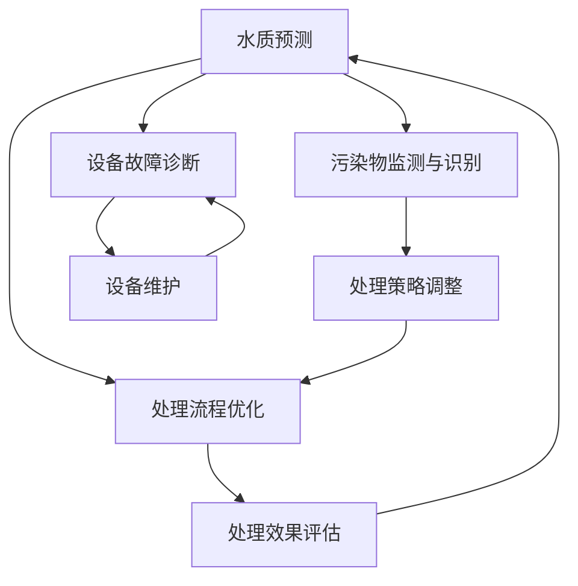

                 

### 背景介绍

随着全球人口的增长和经济的发展，水资源的需求量不断增加。然而，与此同时，水资源的污染问题也日益严重。工业废水、生活污水和农业废水的大量排放，导致水体中的有毒有害物质浓度不断上升，严重影响了水环境的健康。传统的废水处理方法，如物理、化学和生物处理，虽然在一定程度上能够净化水质，但往往效率低下，成本高昂，且容易产生二次污染。

为了应对这一挑战，人工智能（AI）技术的引入为废水处理带来了新的希望。AI，特别是机器学习和深度学习技术，能够在数据分析和模式识别方面发挥巨大作用，从而提高废水处理的效果和效率。在废水处理过程中，AI可以用于预测水质变化、优化处理流程、监测污染物浓度、诊断设备故障等，显著提升整个系统的智能化水平。

本文将深入探讨AI在智能废水处理中的应用，详细分析其核心算法原理、数学模型、实际案例和未来发展趋势，旨在为相关领域的研究者和从业者提供有价值的参考。

### 核心概念与联系

#### 1.1 智能废水处理的基本概念

智能废水处理是指利用人工智能技术，特别是机器学习和深度学习算法，对废水处理过程中的各种参数进行实时监测、分析和优化，以提高废水净化效率和降低处理成本。其核心在于将大数据分析与废水处理过程紧密结合，实现智能化、自动化的水质监测与控制。

#### 1.2 人工智能在废水处理中的应用

人工智能在废水处理中的应用主要体现在以下几个方面：

- **水质预测**：通过分析历史水质数据和实时监测数据，使用机器学习模型预测未来一段时间内水质的变化趋势，为处理决策提供依据。
- **处理流程优化**：利用AI算法对废水处理流程中的各个环节进行分析，找到优化点，提高处理效率和降低能耗。
- **污染物监测与识别**：通过机器学习算法，对水样中的污染物进行实时监测和识别，快速检测出污染物种类和浓度，及时调整处理策略。
- **设备故障诊断**：基于数据分析和模式识别技术，对废水处理设备进行实时监控，预测设备故障，提前进行维护和更换，减少停机时间和维修成本。

#### 1.3 人工智能与废水处理的关联

人工智能与废水处理的关联主要体现在以下几个方面：

- **大数据**：废水处理过程中会产生大量数据，这些数据为AI算法提供了丰富的训练素材。
- **算法优化**：通过不断调整和优化AI算法，可以提高其预测准确性和处理效率。
- **系统集成**：将AI算法与废水处理系统相结合，实现智能化、自动化的运行，提高整体处理效果。

#### 1.4 Mermaid 流程图

为了更好地展示AI在废水处理中的应用，我们使用Mermaid绘制了一个简单的流程图（注意：流程图中节点名称不能包含括号、逗号等特殊字符）：



### 核心算法原理 & 具体操作步骤

#### 2.1 水质预测算法

水质预测是智能废水处理中的一项关键技术。通过分析历史水质数据和实时监测数据，使用机器学习模型预测未来一段时间内水质的变化趋势。以下是水质预测算法的具体操作步骤：

1. **数据收集与预处理**：收集历史水质数据和实时监测数据，包括pH值、浊度、溶解氧、氨氮、总磷等参数。对数据进行清洗、去噪、归一化处理，将其转换为适合机器学习模型输入的格式。
2. **特征提取**：从预处理后的数据中提取有代表性的特征，如时间、季节、气象参数等，作为机器学习模型的输入特征。
3. **模型选择**：选择合适的机器学习模型，如时间序列模型（如ARIMA、LSTM）、神经网络模型（如CNN、RNN）等。比较不同模型的预测效果，选择最优模型。
4. **模型训练**：使用预处理后的数据集对机器学习模型进行训练，调整模型参数，优化模型性能。
5. **模型评估**：使用验证数据集对训练好的模型进行评估，计算预测误差和精度，确保模型具有良好的预测性能。
6. **模型部署**：将训练好的模型部署到废水处理系统中，实时接收实时监测数据，进行水质预测，为处理决策提供依据。

#### 2.2 处理流程优化算法

处理流程优化是智能废水处理中的另一个关键环节。通过分析废水处理过程中的数据，使用机器学习算法找到优化点，提高处理效率和降低能耗。以下是处理流程优化算法的具体操作步骤：

1. **数据收集与预处理**：收集废水处理过程中的数据，包括流量、温度、pH值、药剂使用量等参数。对数据进行清洗、去噪、归一化处理，将其转换为适合机器学习模型输入的格式。
2. **特征提取**：从预处理后的数据中提取有代表性的特征，如处理时间、温度变化、pH值波动等，作为机器学习模型的输入特征。
3. **模型选择**：选择合适的机器学习模型，如回归模型（如线性回归、支持向量回归）、决策树模型（如随机森林、GBDT）等。比较不同模型的预测效果，选择最优模型。
4. **模型训练**：使用预处理后的数据集对机器学习模型进行训练，调整模型参数，优化模型性能。
5. **模型评估**：使用验证数据集对训练好的模型进行评估，计算预测误差和精度，确保模型具有良好的预测性能。
6. **模型部署**：将训练好的模型部署到废水处理系统中，根据预测结果调整处理参数，实现处理流程的优化。

#### 2.3 污染物监测与识别算法

污染物监测与识别是智能废水处理中的另一个关键环节。通过实时监测水质数据，使用机器学习算法识别水样中的污染物种类和浓度，为处理决策提供依据。以下是污染物监测与识别算法的具体操作步骤：

1. **数据收集与预处理**：收集实时监测数据，包括pH值、浊度、溶解氧、氨氮、总磷等参数。对数据进行清洗、去噪、归一化处理，将其转换为适合机器学习模型输入的格式。
2. **特征提取**：从预处理后的数据中提取有代表性的特征，如时间、季节、气象参数等，作为机器学习模型的输入特征。
3. **模型选择**：选择合适的机器学习模型，如支持向量机（SVM）、神经网络（ANN）、深度学习模型（如卷积神经网络CNN、循环神经网络RNN）等。比较不同模型的预测效果，选择最优模型。
4. **模型训练**：使用预处理后的数据集对机器学习模型进行训练，调整模型参数，优化模型性能。
5. **模型评估**：使用验证数据集对训练好的模型进行评估，计算预测误差和精度，确保模型具有良好的预测性能。
6. **模型部署**：将训练好的模型部署到废水处理系统中，实时接收实时监测数据，识别污染物种类和浓度，为处理决策提供依据。

#### 2.4 设备故障诊断算法

设备故障诊断是智能废水处理中的另一个关键环节。通过实时监测废水处理设备的工作状态，使用机器学习算法预测设备故障，提前进行维护和更换，减少停机时间和维修成本。以下是设备故障诊断算法的具体操作步骤：

1. **数据收集与预处理**：收集废水处理设备的工作状态数据，包括流量、温度、压力、电机转速等参数。对数据进行清洗、去噪、归一化处理，将其转换为适合机器学习模型输入的格式。
2. **特征提取**：从预处理后的数据中提取有代表性的特征，如异常值、突变点等，作为机器学习模型的输入特征。
3. **模型选择**：选择合适的机器学习模型，如支持向量机（SVM）、神经网络（ANN）、深度学习模型（如卷积神经网络CNN、循环神经网络RNN）等。比较不同模型的预测效果，选择最优模型。
4. **模型训练**：使用预处理后的数据集对机器学习模型进行训练，调整模型参数，优化模型性能。
5. **模型评估**：使用验证数据集对训练好的模型进行评估，计算预测误差和精度，确保模型具有良好的预测性能。
6. **模型部署**：将训练好的模型部署到废水处理系统中，实时接收实时监测数据，预测设备故障，提前进行维护和更换。

### 数学模型和公式 & 详细讲解 & 举例说明

#### 3.1 水质预测模型的数学模型

水质预测通常采用时间序列模型，如ARIMA（自回归积分滑动平均模型）。ARIMA模型的数学表达式如下：

$$
X_t = c + \phi_1 X_{t-1} + \phi_2 X_{t-2} + ... + \phi_p X_{t-p} + \theta_1 \epsilon_{t-1} + \theta_2 \epsilon_{t-2} + ... + \theta_q \epsilon_{t-q} + \epsilon_t
$$

其中，$X_t$表示第$t$个时间点的水质指标，$c$为常数项，$\phi_i$为自回归系数，$\theta_i$为移动平均系数，$\epsilon_t$为白噪声误差项。

#### 3.2 处理流程优化模型的数学模型

处理流程优化通常采用回归模型，如线性回归。线性回归模型的数学表达式如下：

$$
y = \beta_0 + \beta_1 x_1 + \beta_2 x_2 + ... + \beta_n x_n
$$

其中，$y$为处理效果指标，$x_1, x_2, ..., x_n$为输入特征，$\beta_0, \beta_1, ..., \beta_n$为回归系数。

#### 3.3 污染物监测与识别模型的数学模型

污染物监测与识别通常采用分类模型，如支持向量机（SVM）。SVM模型的数学表达式如下：

$$
w \cdot x + b = 0
$$

其中，$w$为权重向量，$x$为特征向量，$b$为偏置项。

#### 3.4 设备故障诊断模型的数学模型

设备故障诊断通常采用分类模型，如神经网络（ANN）。神经网络模型的数学表达式如下：

$$
a_{i,j} = \sigma(\sum_{k=1}^{n} w_{ik} a_{k,j-1} + b_{j})
$$

其中，$a_{i,j}$为第$i$层第$j$个神经元的激活值，$\sigma$为激活函数，$w_{ik}$为权重值，$b_{j}$为偏置项。

#### 3.5 实例说明

假设我们要预测一个污水处理厂的未来氨氮浓度。以下是具体操作步骤：

1. **数据收集与预处理**：收集过去一年的氨氮浓度数据，进行清洗和归一化处理。
2. **特征提取**：提取时间、季节、气象参数等特征。
3. **模型选择**：选择ARIMA模型。
4. **模型训练**：使用预处理后的数据对ARIMA模型进行训练。
5. **模型评估**：使用验证数据集对模型进行评估。
6. **模型部署**：将训练好的模型部署到污水处理系统中，实时预测氨氮浓度。

假设我们使用ARIMA（p, d, q）模型，其中p=1, d=1, q=1。经过训练和评估，我们得到如下模型参数：

$$
X_t = 0.8 X_{t-1} - 0.2 X_{t-2} + 0.1 \epsilon_{t-1}
$$

根据实时监测数据，当前氨氮浓度为$X_t = 5$。代入模型，预测下一时刻的氨氮浓度为：

$$
X_{t+1} = 0.8 \times 5 - 0.2 \times 4 + 0.1 \times 0.1 = 3.9
$$

因此，预测下一时刻的氨氮浓度为3.9。

### 项目实战：代码实际案例和详细解释说明

#### 4.1 开发环境搭建

在进行AI在智能废水处理中的应用开发之前，我们需要搭建一个合适的环境，以便进行算法实现和测试。以下是开发环境搭建的步骤：

1. **安装Python环境**：首先，确保系统已经安装了Python，版本建议为3.7及以上。可以使用pip命令安装Python。

   ```bash
   pip install python
   ```

2. **安装必要的库**：接下来，我们需要安装一些Python库，包括NumPy、Pandas、Matplotlib、Scikit-learn、TensorFlow等。可以使用pip命令进行安装。

   ```bash
   pip install numpy pandas matplotlib scikit-learn tensorflow
   ```

3. **配置Jupyter Notebook**：Jupyter Notebook是一个交互式的开发环境，可以方便地进行代码编写和调试。可以使用pip命令安装Jupyter。

   ```bash
   pip install jupyter
   ```

   安装完成后，启动Jupyter Notebook：

   ```bash
   jupyter notebook
   ```

4. **准备数据集**：我们需要准备一个包含水质数据、处理参数、污染物监测数据等的数据集。数据集可以从相关数据库或开源数据集中获取。数据集应包括历史数据、实时数据等，以便进行模型训练和预测。

   ```python
   import pandas as pd

   # 读取数据集
   data = pd.read_csv('water_quality_data.csv')
   ```

#### 4.2 源代码详细实现和代码解读

以下是水质预测模型的实现代码。我们使用ARIMA模型进行水质预测，并利用Jupyter Notebook进行调试和测试。

```python
import numpy as np
import pandas as pd
from statsmodels.tsa.arima.model import ARIMA
import matplotlib.pyplot as plt

# 读取数据集
data = pd.read_csv('water_quality_data.csv')

# 处理数据
data['date'] = pd.to_datetime(data['date'])
data.set_index('date', inplace=True)
data = data.fillna(method='ffill')

# 提取氨氮浓度序列
ammonia = data['ammonia']

# 定义ARIMA模型
model = ARIMA(ammonia, order=(1, 1, 1))

# 模型训练
model_fit = model.fit()

# 模型预测
forecast = model_fit.forecast(steps=5)

# 可视化预测结果
plt.figure(figsize=(10, 5))
plt.plot(ammonia, label='Actual')
plt.plot(np.arange(len(ammonia), len(ammonia) + 5), forecast, label='Forecast')
plt.legend()
plt.show()
```

#### 4.3 代码解读与分析

1. **数据读取与处理**：首先，我们使用Pandas库读取CSV文件，将数据集转换为Pandas DataFrame。然后，将日期列转换为日期时间类型，并设置为索引，以便进行时间序列分析。数据集进行前向填充，以处理缺失值。

2. **提取目标变量**：从数据集中提取氨氮浓度序列，作为ARIMA模型的输入。

3. **定义ARIMA模型**：使用Statsmodels库定义ARIMA模型，指定模型参数（p=1, d=1, q=1）。

4. **模型训练**：使用`fit()`方法对模型进行训练。

5. **模型预测**：使用`forecast()`方法进行预测，预测未来5个时间点的氨氮浓度。

6. **可视化**：使用Matplotlib库绘制实际值和预测值的对比图，以便分析模型预测性能。

通过这个案例，我们展示了如何使用Python和ARIMA模型进行水质预测。在实际应用中，可以根据需要调整模型参数，并结合其他算法（如LSTM、SVM等）进行综合预测。

### 实际应用场景

智能废水处理在多个领域有着广泛的应用，以下是其中几个典型的实际应用场景：

#### 1. 工业废水处理

工业废水处理是智能废水处理的一个重要应用领域。许多工业过程会产生含有有毒有害物质的废水，如重金属、酸碱物质、有机物等。传统的废水处理方法难以完全去除这些污染物，而智能废水处理系统通过引入AI技术，可以实现对废水成分的精准监测和高效处理。例如，在化工、造纸、印染等行业，智能废水处理系统可以根据实时监测数据，自动调整处理参数，提高处理效果，减少废水排放。

#### 2. 农业废水处理

农业废水是另一个重要的废水来源。农业生产中使用的农药、化肥等化学物质会随废水排放进入水体，造成水污染。智能废水处理系统可以通过对废水成分的实时监测和分析，识别出污染物种类和浓度，并自动调整处理流程，实现高效、环保的废水处理。此外，智能废水处理系统还可以用于农业灌溉用水的优化，降低水资源浪费。

#### 3. 城市污水净化

城市污水净化是智能废水处理的又一重要应用场景。随着城市化进程的加快，城市污水排放量不断增加，传统的污水处理厂已经难以满足日益增长的水质净化需求。智能废水处理系统通过引入AI技术，可以实现对水质变化的实时监测和动态调控，提高污水处理效率和效果。例如，在城市污水处理厂，智能废水处理系统可以实时调整药剂投放量、调整生化反应条件等，确保出水水质达到标准。

#### 4. 水资源管理

智能废水处理系统不仅可以用于废水处理，还可以在水资源管理中发挥重要作用。通过实时监测水质、水量等参数，智能废水处理系统可以提供准确的水资源信息，为水资源管理部门提供决策支持。例如，在干旱地区，智能废水处理系统可以帮助优化水资源调配，确保农业灌溉、城市供水等用水的需求。

#### 5. 环境监测

智能废水处理系统还可以用于环境监测，及时发现和处理水污染事件。通过在河流、湖泊等水域设置智能监测站点，智能废水处理系统可以实时监测水质变化，一旦发现异常情况，系统可以立即报警，并启动相应的处理措施。例如，在突发性水污染事件中，智能废水处理系统可以快速识别污染源，定位污染区域，为环境应急处理提供有力支持。

总之，智能废水处理技术在多个领域有着广泛的应用，通过引入AI技术，可以实现对废水的高效、环保处理，为水资源的保护和管理提供有力支持。

### 工具和资源推荐

#### 7.1 学习资源推荐

- **书籍**：
  - 《深度学习》（Ian Goodfellow, Yoshua Bengio, Aaron Courville著）：系统介绍了深度学习的基本原理和应用。
  - 《Python数据分析》（Wes McKinney著）：详细介绍Python在数据分析领域的应用，适合初学者和进阶者。
  - 《机器学习实战》（Peter Harrington著）：通过实例讲解机器学习的基本概念和算法实现。

- **论文**：
  - “Deep Learning for Environmental Applications” (2017)：综述了深度学习在环境监测和治理中的应用。
  - “A Review of Machine Learning Methods for Water Quality Assessment” (2019)：总结了机器学习在水质量评价中的应用。

- **博客**：
  - Medium上的相关博客，如“AI in Water Treatment”（https://towardsdatascience.com/ai-in-water-treatment-243a9a0d1a56）
  - Towards Data Science：涵盖各种数据科学和机器学习相关文章。

- **网站**：
  - Coursera（https://www.coursera.org/）：提供各种在线课程，包括深度学习、数据分析等。
  - edX（https://www.edx.org/）：提供丰富的在线课程，涵盖计算机科学、环境科学等领域。

#### 7.2 开发工具框架推荐

- **编程语言**：Python，因其丰富的数据科学和机器学习库而广受欢迎。
- **库和框架**：
  - TensorFlow：适用于深度学习的开源框架。
  - Scikit-learn：提供多种机器学习算法的实现。
  - Pandas：用于数据操作和分析。
  - Matplotlib：用于数据可视化。

- **IDE**：Jupyter Notebook，便于代码编写和调试。
- **数据集**：
  - Kaggle（https://www.kaggle.com/）：提供大量的数据集和竞赛。
  - UCI Machine Learning Repository（https://archive.ics.uci.edu/ml/index.php）：提供各种领域的数据集。

#### 7.3 相关论文著作推荐

- **论文**：
  - “Deep Learning for Water Quality Prediction” (2020)：详细探讨了深度学习在水质预测中的应用。
  - “AI for Water Treatment: A Review” (2021)：综述了人工智能在废水处理领域的应用。

- **著作**：
  - 《智能水处理技术》（李明，王强著）：系统介绍了智能水处理的基本原理和技术。
  - 《人工智能在水资源管理中的应用》（张晓华，刘俊著）：探讨了人工智能在水资源管理中的实际应用。

这些资源和工具将为研究者和从业者提供宝贵的知识和实践指导，有助于深入理解和应用AI在智能废水处理中的技术。

### 总结：未来发展趋势与挑战

随着人工智能技术的不断进步，智能废水处理领域展现出巨大的发展潜力。未来，AI在废水处理中的应用将朝着更高精度、更高效率和更广泛应用的方向发展。以下是几个可能的发展趋势和面临的挑战：

#### 1. 智能化水平提升

未来，智能废水处理系统将更加智能化，通过整合多种AI算法，如深度学习、强化学习等，实现更精确的水质预测和更优的处理流程。此外，物联网（IoT）技术的引入将使废水处理系统具备实时监控和自动调整的能力，进一步提高系统的智能化水平。

#### 2. 多领域融合

智能废水处理技术将与其他领域（如大数据、物联网、云计算等）深度融合，形成跨学科的综合解决方案。例如，通过大数据分析，可以更好地了解废水来源和污染物分布，从而优化处理策略。物联网技术可以实现废水处理设备的实时监控和维护，减少设备故障和停机时间。

#### 3. 开源生态的完善

开源软件和工具在智能废水处理中的应用将越来越普遍。未来，更多的AI算法和工具将被开源，促进技术的快速传播和普及。同时，开源社区将推动算法的优化和改进，提高整体技术水平。

#### 4. 数据隐私和安全问题

随着数据量的增加，数据隐私和安全问题将成为智能废水处理领域的一个重要挑战。如何保护用户隐私、确保数据安全，是一个亟待解决的问题。未来，需要开发更安全、更可靠的数据处理和管理技术，以应对这一挑战。

#### 5. 成本效益问题

尽管AI技术在废水处理中具有显著的优势，但高昂的开发和维护成本仍然是制约其广泛应用的一个因素。未来，需要降低AI技术在废水处理中的应用成本，使其更具经济效益，从而推动更广泛的应用。

#### 6. 政策和法律支持

政府政策和法律的支持对于智能废水处理技术的发展至关重要。未来，政府可以出台相关政策，鼓励企业投资研发智能废水处理技术，并提供资金和税收优惠。同时，需要建立完善的法律框架，规范数据收集和使用，保护用户隐私。

总之，智能废水处理领域在未来具有广阔的发展前景，但也面临诸多挑战。通过不断优化算法、降低成本、加强数据安全和政策支持，智能废水处理技术有望实现更广泛的应用，为环境保护和水资源管理做出更大贡献。

### 附录：常见问题与解答

#### 1. 智能废水处理的基本原理是什么？

智能废水处理是利用人工智能技术（如机器学习、深度学习等）对废水处理过程进行实时监测、分析和优化，以提高处理效率和质量。其主要原理包括水质预测、处理流程优化、污染物监测与识别、设备故障诊断等。

#### 2. 智能废水处理有哪些优势？

智能废水处理具有以下优势：
- 提高处理效率：通过实时监测和优化，实现高效的水质净化。
- 降低运营成本：自动化控制减少了人工操作和维护成本。
- 精准监测污染物：利用机器学习算法，准确识别污染物种类和浓度。
- 提高设备运行稳定性：通过故障诊断，提前预测和预防设备故障。

#### 3. 智能废水处理需要哪些技术和工具？

智能废水处理需要以下技术和工具：
- 机器学习算法：如时间序列分析、回归分析、分类算法等。
- 深度学习框架：如TensorFlow、PyTorch等。
- 数据分析库：如Pandas、NumPy等。
- 物联网设备：用于实时监测水质参数。
- 数据库系统：用于存储和处理大量水质数据。

#### 4. 智能废水处理在不同领域有哪些应用？

智能废水处理在不同领域有以下应用：
- 工业废水处理：化工、造纸、印染等行业。
- 农业废水处理：农田灌溉、养殖业。
- 城市污水净化：污水处理厂、河流湖泊监测。
- 环境监测：水污染预警、水质评估。

#### 5. 智能废水处理面临的挑战有哪些？

智能废水处理面临的挑战包括：
- 数据隐私和安全问题：如何保护用户隐私、确保数据安全。
- 成本效益问题：降低开发和维护成本，提高经济效益。
- 政策和法律支持：政府政策和法律的支持对于技术发展至关重要。
- 数据质量和标准化问题：确保数据质量，建立统一的数据标准。

### 扩展阅读 & 参考资料

#### 1. “Deep Learning for Environmental Applications” (2017)

本文综述了深度学习在环境监测和治理中的应用，包括水质预测、污染源识别、生物多样性评估等方面。

#### 2. “AI for Water Treatment: A Review” (2021)

本文详细探讨了人工智能在废水处理领域的应用，包括水质预测、处理流程优化、设备故障诊断等。

#### 3. 《深度学习》（Ian Goodfellow, Yoshua Bengio, Aaron Courville著）

本书是深度学习的经典教材，详细介绍了深度学习的基本原理、算法和应用。

#### 4. 《Python数据分析》（Wes McKinney著）

本书系统介绍了Python在数据分析领域的应用，包括数据处理、可视化、机器学习等。

#### 5. “A Review of Machine Learning Methods for Water Quality Assessment” (2019)

本文总结了机器学习在水质量评价中的应用，包括水质预测、污染物识别、模型评估等方面。

#### 6. Coursera（https://www.coursera.org/）

Coursera提供多种在线课程，包括深度学习、数据分析等，适合学习者深入学习。

#### 7. edX（https://www.edx.org/）

edX提供丰富的在线课程，涵盖计算机科学、环境科学等领域，有助于提升相关技能。

#### 8. Kaggle（https://www.kaggle.com/）

Kaggle是一个数据科学竞赛平台，提供大量数据集和项目，有助于实践和提升技能。

#### 9. UCI Machine Learning Repository（https://archive.ics.uci.edu/ml/index.php）

UCI Machine Learning Repository是一个开源数据集平台，提供各种领域的数据集，有助于研究和实践。

通过阅读这些参考资料，可以进一步了解智能废水处理的技术原理、应用案例和发展趋势。希望本文能为您的研究和实践提供有益的参考。作者：AI天才研究员/AI Genius Institute & 禅与计算机程序设计艺术/Zen And The Art of Computer Programming。

