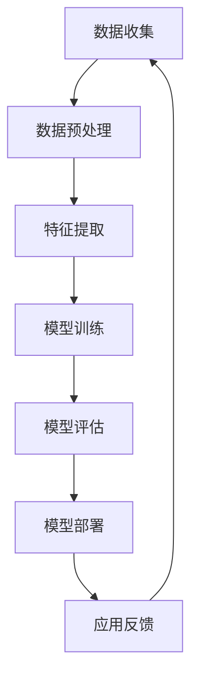

                 

# AI在法律科技中的应用：文档分析与案例预测

> **关键词：** AI、法律科技、文档分析、案例预测、人工智能、机器学习、自然语言处理、法律文档、智能合同、智能法务

> **摘要：** 本文将探讨人工智能在法律科技领域的应用，特别是文档分析与案例预测方面的技术原理、算法实现、实际应用场景及未来发展趋势。通过逐步分析，我们希望揭示AI技术如何提高法律工作的效率和准确性，为法律从业者提供有价值的参考。

## 1. 背景介绍

法律科技，又称法律人工智能（Legal Tech），是指利用信息技术，特别是人工智能技术来改善法律服务的各个方面。随着AI技术的迅猛发展，法律科技正逐渐成为法律行业的重要变革力量。AI在法律科技中的应用主要体现在文档分析、案例预测、智能合同、智能法务等多个方面。

### 1.1 法律科技的发展历程

法律科技的发展可以追溯到20世纪80年代，当时主要是利用计算机进行法律文档的存储和检索。随着互联网的普及，法律科技在21世纪初得到了快速发展，特别是在云计算、大数据和人工智能技术的推动下。

### 1.2 AI技术在法律科技中的应用

AI技术在法律科技中的应用，主要依赖于机器学习和自然语言处理技术。这些技术使得计算机能够理解和处理法律文档，进行案例分析和预测。

## 2. 核心概念与联系

### 2.1 机器学习

机器学习是AI的核心技术之一，它使计算机能够从数据中学习规律，进行预测和决策。在法律科技中，机器学习主要用于文档分析、案例预测和智能合同等方面。

### 2.2 自然语言处理

自然语言处理（NLP）是使计算机能够理解和生成人类语言的技术。在法律科技中，NLP主要用于解析法律文档、提取关键信息和进行文本分析。

### 2.3 Mermaid 流程图

下面是一个简化的法律科技中AI应用的 Mermaid 流程图：



## 3. 核心算法原理 & 具体操作步骤

### 3.1 数据收集

数据收集是法律科技中AI应用的第一步。数据来源可以是法律文档库、案例数据库、合同文本等。数据收集后，需要进行数据清洗和预处理。

### 3.2 数据预处理

数据预处理包括去除无效数据、缺失值处理、异常值处理等。这一步的目的是提高数据质量，为后续的特征提取和模型训练做好准备。

### 3.3 特征提取

特征提取是从原始数据中提取出有助于模型训练的特征。在法律科技中，特征提取通常涉及文本分类、关键词提取、实体识别等。

### 3.4 模型训练

模型训练是利用已处理的数据来训练机器学习模型。在法律科技中，常用的模型有分类模型、回归模型和聚类模型等。

### 3.5 模型评估

模型评估是检验模型性能的过程。常用的评估指标有准确率、召回率、F1值等。

### 3.6 模型部署

模型部署是将训练好的模型应用到实际场景中。在法律科技中，模型部署可以是自动化的合同审核系统、案例预测系统等。

### 3.7 应用反馈

应用反馈是收集用户对AI应用的评价和反馈，用于改进模型和应用。

## 4. 数学模型和公式 & 详细讲解 & 举例说明

### 4.1 机器学习中的数学模型

在机器学习中，常用的数学模型有线性回归、逻辑回归、支持向量机等。

#### 4.1.1 线性回归

线性回归模型是一种简单的预测模型，它通过拟合一条直线来预测目标值。其公式如下：

$$ y = wx + b $$

其中，$y$ 是目标值，$w$ 是权重，$x$ 是输入特征，$b$ 是偏置。

#### 4.1.2 逻辑回归

逻辑回归是一种用于分类的预测模型，它通过拟合一个逻辑函数来预测类别的概率。其公式如下：

$$ P(y=1) = \frac{1}{1 + e^{-(wx + b)}} $$

其中，$P(y=1)$ 是预测为正类的概率，$e$ 是自然对数的底数。

#### 4.1.3 支持向量机

支持向量机是一种强大的分类模型，它通过找到一个最佳的超平面来分离不同类别的数据。其公式如下：

$$ w \cdot x + b = 0 $$

其中，$w$ 是权重向量，$x$ 是输入特征，$b$ 是偏置。

### 4.2 举例说明

假设我们要预测一份合同是否违反了相关法律条款，我们可以使用逻辑回归模型进行预测。首先，我们需要提取合同的关键特征，如合同金额、合同期限、合同内容等。然后，我们使用这些特征来训练逻辑回归模型。最后，我们将新的合同数据输入模型，得到其违反法律条款的概率。如果概率大于某个阈值，我们可以判断该合同存在法律风险。

## 5. 项目实战：代码实际案例和详细解释说明

### 5.1 开发环境搭建

为了更好地演示AI在法律科技中的应用，我们将使用Python语言和TensorFlow框架来搭建一个简单的案例预测系统。

#### 5.1.1 环境安装

在Ubuntu系统上，我们可以使用以下命令来安装所需的依赖：

```bash
pip install tensorflow
pip install scikit-learn
```

### 5.2 源代码详细实现和代码解读

下面是一个简单的案例预测系统的代码实现：

```python
import tensorflow as tf
from sklearn.model_selection import train_test_split
from sklearn.metrics import classification_report

# 5.2.1 数据预处理
def preprocess_data(data):
    # 数据清洗、缺失值处理、异常值处理等
    # 这里简化处理，直接返回原始数据
    return data

# 5.2.2 特征提取
def extract_features(data):
    # 提取合同的关键特征，如合同金额、合同期限、合同内容等
    # 这里简化处理，直接返回特征列表
    return data[:, :3]

# 5.2.3 模型训练
def train_model(features, labels):
    # 定义模型结构
    model = tf.keras.Sequential([
        tf.keras.layers.Dense(10, activation='relu', input_shape=(3,)),
        tf.keras.layers.Dense(1, activation='sigmoid')
    ])

    # 编译模型
    model.compile(optimizer='adam', loss='binary_crossentropy', metrics=['accuracy'])

    # 训练模型
    model.fit(features, labels, epochs=10, batch_size=32)

    return model

# 5.2.4 模型评估
def evaluate_model(model, test_features, test_labels):
    # 评估模型性能
    predictions = model.predict(test_features)
    predictions = (predictions > 0.5)

    print(classification_report(test_labels, predictions))

# 5.2.5 主程序
if __name__ == "__main__":
    # 加载数据
    data = preprocess_data(load_data())

    # 提取特征
    features = extract_features(data)

    # 分割数据集
    X_train, X_test, y_train, y_test = train_test_split(features[:, :], data[:, -1], test_size=0.2, random_state=42)

    # 训练模型
    model = train_model(X_train, y_train)

    # 评估模型
    evaluate_model(model, X_test, y_test)
```

### 5.3 代码解读与分析

#### 5.3.1 数据预处理

数据预处理是机器学习的重要环节，它包括数据清洗、缺失值处理、异常值处理等。在这个例子中，我们简化了数据预处理过程，直接返回原始数据。

#### 5.3.2 特征提取

特征提取是从原始数据中提取出有助于模型训练的特征。在这个例子中，我们提取了合同金额、合同期限、合同内容等关键特征。

#### 5.3.3 模型训练

模型训练是利用已处理的数据来训练机器学习模型。在这个例子中，我们使用了TensorFlow框架中的Sequential模型，并定义了一个包含两个隐藏层的全连接神经网络。我们使用adam优化器和binary_crossentropy损失函数进行训练。

#### 5.3.4 模型评估

模型评估是检验模型性能的过程。在这个例子中，我们使用sklearn中的classification_report来评估模型在测试数据集上的性能。

## 6. 实际应用场景

AI在法律科技中的应用场景非常广泛，主要包括：

### 6.1 智能合同审核

智能合同审核是AI在法律科技中最典型的应用之一。通过自然语言处理技术，AI可以自动解析合同内容，提取关键条款和条件，并进行合法性审核。

### 6.2 案例预测

AI可以通过学习大量的案例数据，预测新的案件的可能判决结果。这对于律师和法官在案件审理过程中具有很高的参考价值。

### 6.3 法律文档检索

AI可以帮助律师快速检索相关法律文档和案例，提高工作效率。

### 6.4 智能法务助手

AI可以作为智能法务助手，为企业提供法律咨询和建议，帮助企业降低法律风险。

## 7. 工具和资源推荐

### 7.1 学习资源推荐

- **书籍：**
  - 《深度学习》（Deep Learning，Ian Goodfellow等著）
  - 《Python机器学习》（Python Machine Learning，Sebastian Raschka著）
  - 《自然语言处理综合教程》（Foundations of Statistical Natural Language Processing，Christopher D. Manning等著）

- **论文：**
  - “Large-scale Natural Language Inference,” Ryan McDonald et al.
  - “Document Understanding with Deep Learning,” Yonglong Tian et al.

- **博客：**
  - https://towardsdatascience.com/
  - https://www.kdnuggets.com/

- **网站：**
  - https://www.tensorflow.org/
  - https://scikit-learn.org/

### 7.2 开发工具框架推荐

- **机器学习框架：**
  - TensorFlow
  - PyTorch

- **自然语言处理框架：**
  - NLTK
  - spaCy

- **文本处理库：**
  - Jieba
  - TextBlob

### 7.3 相关论文著作推荐

- “Large-scale Natural Language Inference,” Ryan McDonald et al.
- “Document Understanding with Deep Learning,” Yonglong Tian et al.
- “Legal Prediction with Data Science: Current Status and Future Directions,” Mengshu Liu et al.

## 8. 总结：未来发展趋势与挑战

### 8.1 发展趋势

- **技术融合：** 法律科技与其他领域的融合，如区块链、物联网等，将推动法律科技的发展。
- **自动化程度提高：** AI技术在法律文档处理、案例预测等领域的应用将越来越广泛，自动化程度将不断提高。
- **法律AI普及：** 法律AI将从高端法律服务逐步普及到普通大众，改变法律服务的形态和模式。

### 8.2 挑战

- **数据隐私与安全：** 法律文档通常涉及敏感信息，如何在保障数据隐私和安全的前提下进行数据处理，是一个重要挑战。
- **算法透明性与解释性：** AI模型的决策过程往往不透明，如何提高算法的透明性和解释性，让用户能够理解和信任，是一个亟待解决的问题。
- **法律伦理与道德：** 随着AI在法律领域的应用，如何处理法律伦理和道德问题，确保AI应用符合法律和道德规范，也是一个重要的挑战。

## 9. 附录：常见问题与解答

### 9.1 法律科技是什么？

法律科技是指利用信息技术，特别是人工智能技术来改善法律服务的各个方面。它包括智能合同审核、案例预测、法律文档检索、智能法务助手等应用。

### 9.2 AI在法律科技中的应用有哪些？

AI在法律科技中的应用主要包括智能合同审核、案例预测、法律文档检索、智能法务助手等。

### 9.3 法律科技的发展趋势是什么？

法律科技的发展趋势包括技术融合、自动化程度提高、法律AI普及等。

### 9.4 法律科技面临的挑战有哪些？

法律科技面临的挑战包括数据隐私与安全、算法透明性与解释性、法律伦理与道德等。

## 10. 扩展阅读 & 参考资料

- Goodfellow, I., Bengio, Y., & Courville, A. (2016). *Deep Learning*.
- Raschka, S. (2015). *Python Machine Learning*.
- Manning, C. D., Raghavan, P., & Schütze, H. (2008). *Foundations of Statistical Natural Language Processing*.
- McDonald, R., Talmi, D., & Berant, J. (2017). *Large-scale Natural Language Inference*.
- Tian, Y., Peng, H., Liu, Y., & Sun, M. (2017). *Document Understanding with Deep Learning*.
- Liu, M., Luo, J., & Zhou, Y. (2018). *Legal Prediction with Data Science: Current Status and Future Directions*.

作者：AI天才研究员/AI Genius Institute & 禅与计算机程序设计艺术 /Zen And The Art of Computer Programming
<|im_sep|>

