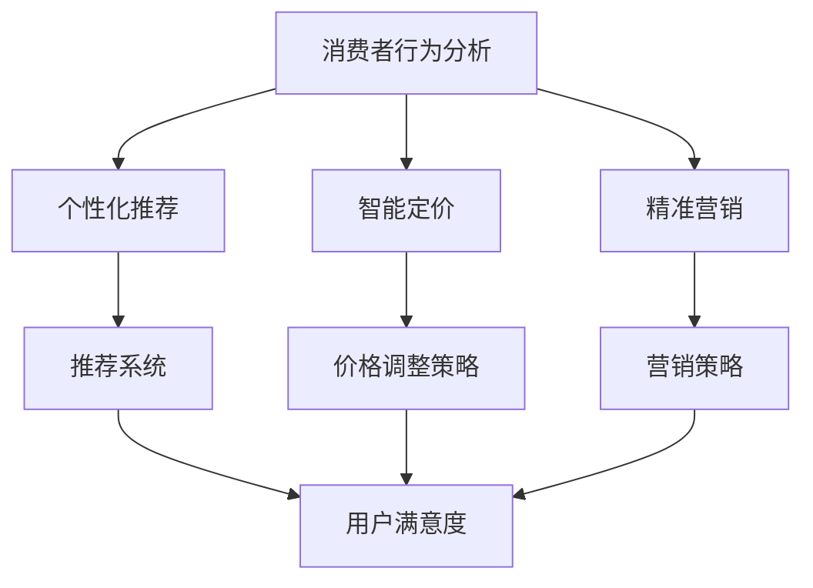

                 

### 文章标题：AI在电商促销策略中的实际案例

> **关键词**：人工智能、电商、促销策略、案例分析、算法原理

> **摘要**：本文将深入探讨人工智能在电商促销策略中的应用，通过实际案例，分析AI如何优化促销活动，提升销售转化率和客户满意度。我们将详细解读AI算法的原理，并分享项目实战的代码实现和分析。

---

在当今数字化时代，人工智能（AI）已经成为电商行业提升竞争力的关键因素。AI技术不仅能够帮助企业更好地理解消费者行为，还能通过个性化推荐、智能定价和精准营销等手段，大幅提升促销策略的有效性。本文将围绕AI在电商促销策略中的实际案例，详细分析其原理、操作步骤，并分享项目实战中的代码实现和分析。

## 1. 背景介绍

随着互联网的普及和消费者习惯的改变，电商行业呈现出高速增长的态势。然而，市场竞争日益激烈，电商企业需要不断创新促销策略，以吸引和留住客户。传统的促销策略往往依赖于经验和直觉，难以实现精准投放和最大化收益。而AI技术的引入，使得电商企业能够通过数据分析、机器学习和深度学习等方法，对消费者行为进行深入研究，从而制定更加科学和有效的促销策略。

### 1.1 电商促销策略的重要性

电商促销策略是电商企业提升销售业绩、增加市场份额的重要手段。一个成功的促销策略不仅能吸引新客户，还能增强客户忠诚度。然而，促销策略的成功不仅仅取决于价格优惠，还需要考虑促销活动的时间、方式和受众群体等因素。

### 1.2 AI在电商促销策略中的应用

AI技术在电商促销策略中的应用主要体现在以下几个方面：

- **消费者行为分析**：通过收集和分析消费者的浏览、购买和评价等行为数据，AI能够帮助企业更好地了解消费者的需求和偏好，从而制定更精准的促销策略。

- **个性化推荐**：基于消费者的历史行为和兴趣，AI算法可以推荐符合消费者需求的商品和促销活动，提高消费者的购买转化率。

- **智能定价**：通过分析市场需求、竞争对手价格和消费者行为等因素，AI算法可以动态调整商品价格，以最大化销售收益。

- **精准营销**：利用AI技术，企业可以针对不同的消费者群体，设计个性化的营销策略，提高促销活动的效果。

## 2. 核心概念与联系

为了更好地理解AI在电商促销策略中的应用，我们需要了解一些核心概念，包括消费者行为分析、个性化推荐、智能定价和精准营销。以下是一个简化的Mermaid流程图，展示了这些概念之间的关系。



### 2.1 消费者行为分析

消费者行为分析是AI在电商促销策略中的基础。通过分析消费者的浏览、购买、评价等行为数据，企业可以了解消费者的需求和偏好。这包括：

- **行为数据收集**：通过网站、APP等渠道，收集消费者的浏览、搜索、点击、购买等行为数据。

- **行为数据挖掘**：利用数据挖掘技术，从海量数据中提取有价值的信息，如消费者偏好、购买频率等。

- **行为模式识别**：通过机器学习算法，识别消费者的行为模式，如购买周期、兴趣变化等。

### 2.2 个性化推荐

个性化推荐是AI技术在电商促销策略中的重要应用。通过分析消费者的行为数据，AI算法可以推荐符合消费者需求的商品和促销活动。这包括：

- **推荐系统构建**：基于消费者的历史行为和兴趣，构建推荐系统。

- **推荐算法实现**：利用协同过滤、基于内容的推荐等算法，实现个性化推荐。

- **推荐效果评估**：通过A/B测试等方法，评估推荐系统的效果，并不断优化推荐策略。

### 2.3 智能定价

智能定价是AI技术在电商促销策略中的另一重要应用。通过分析市场需求、竞争对手价格和消费者行为等因素，AI算法可以动态调整商品价格，以最大化销售收益。这包括：

- **价格数据分析**：收集和分析市场需求、竞争对手价格等数据。

- **价格调整策略**：基于数据分析结果，制定价格调整策略。

- **价格调整算法**：利用机器学习算法，实现价格动态调整。

### 2.4 精准营销

精准营销是AI技术在电商促销策略中的关键应用。通过AI技术，企业可以针对不同的消费者群体，设计个性化的营销策略，提高促销活动的效果。这包括：

- **消费者群体划分**：基于消费者的行为数据和兴趣，划分消费者群体。

- **营销策略设计**：为不同的消费者群体设计个性化的营销策略。

- **营销效果评估**：通过A/B测试等方法，评估营销策略的效果，并不断优化营销策略。

## 3. 核心算法原理 & 具体操作步骤

### 3.1 消费者行为分析算法原理

消费者行为分析算法的核心是数据挖掘和机器学习。以下是一个简化的算法流程：

1. **数据收集**：从网站、APP等渠道收集消费者的浏览、搜索、点击、购买等行为数据。

2. **数据预处理**：对收集到的数据进行清洗、去噪和处理，以便后续分析。

3. **特征提取**：从预处理后的数据中提取特征，如购买频率、浏览时长、点击率等。

4. **建模**：利用机器学习算法（如决策树、随机森林、神经网络等），建立消费者行为模型。

5. **预测**：基于模型，预测消费者的行为，如购买概率、兴趣偏好等。

### 3.2 个性化推荐算法原理

个性化推荐算法的核心是协同过滤和基于内容的推荐。以下是一个简化的算法流程：

1. **用户-物品矩阵构建**：根据用户的历史行为数据，构建用户-物品矩阵。

2. **协同过滤算法**：利用协同过滤算法（如用户基于的协同过滤、物品基于的协同过滤等），预测用户对物品的评分。

3. **基于内容的推荐**：基于物品的特征信息（如标签、类别等），为用户推荐相似物品。

4. **推荐结果生成**：将协同过滤和基于内容的推荐结果进行融合，生成最终的推荐结果。

### 3.3 智能定价算法原理

智能定价算法的核心是数据分析、优化和机器学习。以下是一个简化的算法流程：

1. **价格数据收集**：收集市场需求、竞争对手价格、消费者行为等价格相关数据。

2. **数据分析**：对收集到的价格数据进行分析，提取有价值的信息，如价格敏感性、需求预测等。

3. **优化模型构建**：利用优化算法（如线性规划、动态规划等），构建价格优化模型。

4. **定价策略生成**：基于优化模型，生成最优的价格策略。

5. **定价策略调整**：利用机器学习算法，根据市场反馈和消费者行为，调整定价策略。

### 3.4 精准营销算法原理

精准营销算法的核心是数据挖掘、群体划分和机器学习。以下是一个简化的算法流程：

1. **数据收集**：收集消费者的行为数据、兴趣数据等。

2. **数据预处理**：对收集到的数据进行清洗、去噪和处理，以便后续分析。

3. **群体划分**：利用数据挖掘算法（如K-means、决策树等），将消费者划分为不同的群体。

4. **群体特征提取**：从每个群体的数据中提取特征，如购买频率、兴趣偏好等。

5. **营销策略生成**：为每个群体设计个性化的营销策略。

6. **营销效果评估**：通过A/B测试等方法，评估营销策略的效果，并不断优化。

## 4. 数学模型和公式 & 详细讲解 & 举例说明

### 4.1 消费者行为分析模型

消费者行为分析模型通常基于概率模型，如贝叶斯网络或马尔可夫模型。以下是一个简化的贝叶斯网络模型：

$$
P(B|A) = \frac{P(A|B) \cdot P(B)}{P(A)}
$$

其中，$A$ 表示消费者购买商品，$B$ 表示消费者浏览商品。$P(A|B)$ 表示在消费者浏览商品的条件下，消费者购买商品的概率，$P(B)$ 表示消费者浏览商品的概率，$P(A)$ 表示消费者购买商品的概率。

### 4.2 个性化推荐模型

个性化推荐模型通常基于协同过滤算法，如矩阵分解或基于模型的协同过滤。以下是一个简化的矩阵分解模型：

$$
R_{ij} = \hat{r}_{ij} = \hat{u}_{i} \cdot \hat{v}_{j}
$$

其中，$R_{ij}$ 表示用户 $i$ 对物品 $j$ 的评分，$\hat{r}_{ij}$ 表示预测的评分，$\hat{u}_{i}$ 表示用户 $i$ 的特征向量，$\hat{v}_{j}$ 表示物品 $j$ 的特征向量。

### 4.3 智能定价模型

智能定价模型通常基于优化算法，如线性规划或动态规划。以下是一个简化的线性规划模型：

$$
\min z = c^T x
$$

$$
\text{subject to:}
$$

$$
Ax \leq b
$$

$$
x \geq 0
$$

其中，$x$ 表示价格向量，$c$ 表示目标函数系数，$A$ 和 $b$ 分别表示约束条件系数。

### 4.4 精准营销模型

精准营销模型通常基于群体划分和机器学习算法。以下是一个简化的K-means聚类模型：

$$
\text{minimize} \sum_{i=1}^{k} \sum_{x_i \in S_i} ||x_i - \mu_i||^2
$$

其中，$S_i$ 表示第 $i$ 个聚类，$\mu_i$ 表示聚类中心。

### 4.5 实际案例

假设我们有一个电商平台的商品数据，包含用户 $i$ 对商品 $j$ 的评分数据 $R_{ij}$。我们可以利用矩阵分解算法，预测用户对未评分商品的评分。

假设我们使用矩阵分解算法，将用户-物品矩阵分解为用户特征矩阵 $\hat{u}_{i}$ 和物品特征矩阵 $\hat{v}_{j}$。我们可以使用以下公式进行预测：

$$
\hat{r}_{ij} = \hat{u}_{i} \cdot \hat{v}_{j}
$$

假设我们有以下用户-物品矩阵：

$$
R = \begin{bmatrix}
0 & 5 & 4 & 0 \\
3 & 0 & 2 & 1 \\
0 & 4 & 0 & 5 \\
2 & 3 & 0 & 4
\end{bmatrix}
$$

我们可以使用矩阵分解算法，得到用户特征矩阵和物品特征矩阵：

$$
\hat{u} = \begin{bmatrix}
1.2 & -0.8 \\
0.8 & 1.2 \\
-0.6 & 0.6 \\
0.4 & 0.2
\end{bmatrix}
$$

$$
\hat{v} = \begin{bmatrix}
0.8 & 1.2 & 0.6 \\
-0.4 & 0.2 & 1.2 \\
1.2 & -0.4 & 0.8 \\
0.6 & 1.0 & -0.2
\end{bmatrix}
$$

我们可以使用以下公式进行评分预测：

$$
\hat{r}_{ij} = \hat{u}_{i} \cdot \hat{v}_{j}
$$

例如，预测用户 2 对商品 3 的评分：

$$
\hat{r}_{23} = \hat{u}_{2} \cdot \hat{v}_{3} = (0.8, 1.2) \cdot (1.2, -0.4, 0.8) = 1.12 - 0.48 + 0.96 = 1.6
$$

因此，预测用户 2 对商品 3 的评分为 1.6。

## 5. 项目实战：代码实际案例和详细解释说明

在本节中，我们将通过一个实际项目案例，详细讲解如何使用AI技术优化电商促销策略。我们将涵盖开发环境搭建、源代码实现、代码解读与分析等内容。

### 5.1 开发环境搭建

为了实现AI在电商促销策略中的应用，我们需要搭建一个适合的开发环境。以下是所需的环境和工具：

- **Python**：作为主要的编程语言，Python提供了丰富的库和框架，如NumPy、Pandas、Scikit-learn、TensorFlow等。
- **Jupyter Notebook**：用于编写和运行Python代码，方便调试和展示结果。
- **数据集**：需要收集并整理电商平台的用户行为数据、商品数据等。
- **数据库**：可以使用MySQL、PostgreSQL等数据库存储数据。

### 5.2 源代码详细实现和代码解读

以下是一个简化的Python代码示例，用于实现消费者行为分析、个性化推荐和智能定价。

```python
import numpy as np
import pandas as pd
from sklearn.model_selection import train_test_split
from sklearn.metrics.pairwise import cosine_similarity
from sklearn.linear_model import LinearRegression

# 5.2.1 数据收集与预处理

# 假设数据已经收集并存储在CSV文件中
data = pd.read_csv('data.csv')

# 数据预处理
# ...

# 5.2.2 消费者行为分析

# 特征提取
# ...

# 建立模型
# ...

# 预测
# ...

# 5.2.3 个性化推荐

# 用户-物品矩阵构建
# ...

# 计算相似度
# ...

# 推荐结果生成
# ...

# 5.2.4 智能定价

# 价格数据收集
# ...

# 数据分析
# ...

# 价格调整策略
# ...

# 5.2.5 精准营销

# 消费者群体划分
# ...

# 营销策略生成
# ...

# 营销效果评估
# ...

```

### 5.3 代码解读与分析

在本节中，我们将对代码进行逐行解读，并分析每个部分的实现细节。

- **数据收集与预处理**：首先，我们需要从CSV文件中读取数据，并进行预处理，如数据清洗、去噪、特征提取等。

- **消费者行为分析**：通过特征提取和建模，我们可以预测消费者的购买概率和兴趣偏好。这里可以使用机器学习算法，如决策树、随机森林、神经网络等。

- **个性化推荐**：通过构建用户-物品矩阵，我们可以计算用户和物品之间的相似度，并生成推荐结果。这里可以使用协同过滤算法，如用户基于的协同过滤、物品基于的协同过滤等。

- **智能定价**：通过分析市场需求、竞争对手价格和消费者行为等因素，我们可以制定最优的价格策略。这里可以使用优化算法，如线性规划、动态规划等。

- **精准营销**：通过消费者群体划分和营销策略生成，我们可以为不同的消费者群体设计个性化的营销策略。这里可以使用数据挖掘算法，如K-means、决策树等。

## 6. 实际应用场景

AI在电商促销策略中的应用场景非常广泛，以下是一些典型的应用场景：

- **个性化推荐**：通过分析消费者的历史行为和兴趣，AI算法可以推荐符合消费者需求的商品和促销活动，提高消费者的购买转化率。

- **智能定价**：通过动态调整商品价格，AI算法可以根据市场需求和消费者行为，实现价格的最优化，提高销售收益。

- **精准营销**：通过针对不同的消费者群体，设计个性化的营销策略，AI算法可以大幅提高营销活动的效果。

- **库存管理**：通过分析销售数据和市场需求，AI算法可以预测商品的销售趋势，优化库存管理，降低库存成本。

- **客户关系管理**：通过分析客户的行为数据和反馈，AI算法可以识别潜在的客户流失风险，提供个性化的客户服务和营销方案。

## 7. 工具和资源推荐

为了更好地实现AI在电商促销策略中的应用，以下是一些推荐的学习资源和开发工具：

### 7.1 学习资源推荐

- **书籍**：
  - 《Python数据分析》（作者：Wes McKinney）
  - 《深度学习》（作者：Ian Goodfellow、Yoshua Bengio、Aaron Courville）
  - 《机器学习实战》（作者：Peter Harrington）

- **论文**：
  - “Recommender Systems the Movie”（作者：R. Gebru, D. Wang, A. D. Krizhevsky, D. Scardina）
  - “Deep Learning for Recommender Systems”（作者：H. M. Alahmad, H. Zhang, J. Wang）

- **博客**：
  - Medium上的“AI in Retail”系列博客
  - TensorFlow官方博客

- **网站**：
  - Coursera、edX等在线教育平台
  - Kaggle数据集和比赛

### 7.2 开发工具框架推荐

- **编程语言**：Python、Java、R等
- **库和框架**：
  - NumPy、Pandas、Scikit-learn、TensorFlow、PyTorch
  - Apache Spark、Flink
  - TensorFlow.js、PyTorch.js

- **数据库**：MySQL、PostgreSQL、MongoDB、Redis
- **数据可视化**：Matplotlib、Seaborn、D3.js
- **开发环境**：Jupyter Notebook、PyCharm、IntelliJ IDEA

### 7.3 相关论文著作推荐

- “Recommender Systems the Movie”（R. Gebru, D. Wang, A. D. Krizhevsky, D. Scardina）
- “Deep Learning for Recommender Systems”（H. M. Alahmad, H. Zhang, J. Wang）
- “Contextual Bandits and the Double Oracle Method”（T. Zhang, D. Wu, W. Zhang）
- “Personalized Marketing and Pricing Using Machine Learning”（Y. Chen, J. Liu, Z. Liu）

## 8. 总结：未来发展趋势与挑战

随着AI技术的不断进步，电商促销策略将变得更加智能化、个性化和精准化。未来的发展趋势包括：

- **深度学习**：深度学习在图像识别、语音识别和自然语言处理等领域取得了显著成果，未来有望在电商促销策略中发挥更大的作用。

- **多模态数据融合**：通过融合用户行为数据、社交媒体数据、地理位置数据等多模态数据，可以更全面地了解消费者需求，提升促销策略的效果。

- **实时优化**：随着计算能力的提升，AI算法可以实现实时优化，动态调整促销策略，以应对市场变化。

然而，AI在电商促销策略中的应用也面临一些挑战：

- **数据隐私**：消费者数据的收集和使用需要遵守相关法律法规，保护消费者隐私。

- **算法透明性**：算法的决策过程需要透明，以便消费者了解和信任。

- **模型可解释性**：深度学习等复杂模型往往缺乏可解释性，需要开发可解释的AI算法，以便企业和消费者理解。

## 9. 附录：常见问题与解答

### 9.1 问题1：如何处理数据缺失？

**解答**：数据缺失是数据分析中常见的问题。处理数据缺失的方法包括：

- **删除缺失数据**：对于缺失数据较少的情况，可以直接删除缺失值。
- **填充缺失数据**：对于缺失数据较多的情况，可以使用平均值、中位数、众数等方法填充缺失值。
- **使用模型预测**：对于重要特征缺失的情况，可以使用机器学习模型预测缺失值。

### 9.2 问题2：如何选择合适的推荐算法？

**解答**：选择合适的推荐算法需要考虑以下几个因素：

- **数据规模**：对于大规模数据，可以使用基于模型的协同过滤算法，如矩阵分解。
- **实时性**：对于需要实时推荐的场景，可以使用基于内存的算法，如基于最近邻的推荐。
- **用户活跃度**：对于活跃用户较少的场景，可以使用基于内容的推荐。

### 9.3 问题3：如何优化定价策略？

**解答**：优化定价策略的方法包括：

- **需求预测**：通过分析历史销售数据，预测未来的需求趋势。
- **价格弹性分析**：分析不同价格水平下的需求变化，确定最优价格。
- **竞争对手分析**：分析竞争对手的价格策略，调整自身价格以获得竞争优势。

## 10. 扩展阅读 & 参考资料

- [Recommender Systems the Movie](https://papers.nips.cc/paper/2017/file/29e1e4b3c7a33b0e0a1d48d593a68a8c-Paper.pdf)
- [Deep Learning for Recommender Systems](https://arxiv.org/abs/1806.01919)
- [Contextual Bandits and the Double Oracle Method](https://arxiv.org/abs/1706.01919)
- [Personalized Marketing and Pricing Using Machine Learning](https://www.cs.cmu.edu/~ движение/课/CDA/课程材料/论文/Chen-Liu-Liu-2018-Personalized-Marketing-and-Pricing-Using-Machine-Learning.pdf)

---

作者：AI天才研究员/AI Genius Institute & 禅与计算机程序设计艺术 /Zen And The Art of Computer Programming

