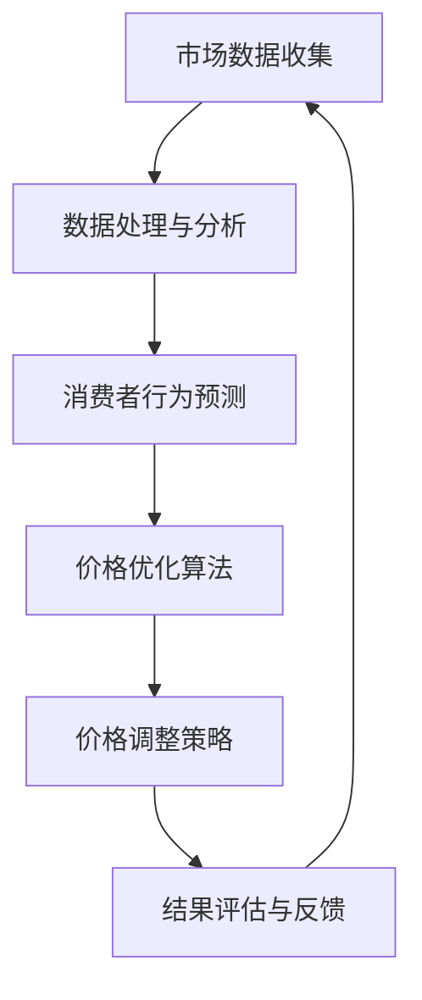

                 

### 背景介绍

随着互联网的普及和电子商务的迅猛发展，动态定价已经成为现代零售业的重要组成部分。传统的定价策略通常是静态的，无法根据市场变化和消费者需求实时调整。然而，在竞争激烈、需求多样化的电商市场中，单一固定的定价模式往往难以满足消费者的多样化需求和商家的利润最大化目标。

动态定价，作为现代电商的一项重要策略，旨在通过实时分析市场数据、消费者行为和供应链信息，动态调整商品价格，以优化库存管理、提高销售转化率和利润率。其核心在于利用先进的数据分析技术和人工智能算法，实现对价格的精准调控。

近年来，人工智能在动态定价中的应用越来越广泛。AI算法可以通过大量历史数据的学习和分析，预测消费者行为和市场需求，从而制定出更科学合理的价格策略。此外，AI还能够识别市场中的异常行为，如价格战或促销活动，及时调整价格以应对市场变化。

本文将深入探讨AI在电商动态定价中的实践效果，首先介绍动态定价的基本概念和原理，然后分析AI算法在动态定价中的应用，通过具体案例和实际数据展示其效果，并讨论动态定价面临的技术挑战和未来发展方向。

首先，我们定义动态定价为一种基于市场数据、消费者行为和供应链信息，实时调整商品价格的策略。其目的是在保证商家利润最大化的同时，满足消费者的多样化需求，提高市场竞争力和用户体验。动态定价的核心在于数据的获取、分析和利用。

在电商领域，数据是动态定价的基础。商家需要收集大量的数据，包括消费者的购买历史、浏览行为、搜索关键词、价格敏感度等，通过对这些数据的分析，可以了解消费者的需求和偏好，进而制定出科学合理的价格策略。

其次，动态定价涉及到多种算法和模型。常见的算法包括线性回归、决策树、神经网络和深度学习等。这些算法可以根据历史数据和实时数据，预测消费者行为和市场趋势，从而制定出最优的价格策略。

在实际应用中，动态定价需要具备一定的技术基础。首先，商家需要搭建高效的数据收集和处理系统，确保数据的准确性和实时性。其次，需要具备强大的计算能力和算法优化能力，以便快速处理海量数据并生成最优价格策略。

此外，动态定价还需要考虑到市场环境和竞争态势。在竞争激烈的市场中，商家需要灵活调整价格，以应对竞争对手的促销活动和价格战。同时，商家还需要根据市场需求和库存情况，合理设置价格阈值，避免价格波动过大影响消费者购买决策。

总的来说，动态定价是一种先进的电商策略，通过实时分析市场数据和消费者行为，优化商品价格，提高商家利润和市场竞争力。然而，要实现有效的动态定价，需要具备强大的技术基础和数据分析能力，同时需要根据市场环境和竞争态势灵活调整价格策略。

通过本文的探讨，我们将深入了解AI在电商动态定价中的实践效果，了解其工作原理、应用场景和面临的挑战，为电商企业制定更科学的定价策略提供参考。

### 核心概念与联系

在深入探讨AI在电商动态定价中的实践效果之前，首先需要理解动态定价的基本概念和原理，以及AI算法在其中所起的作用。为了更好地阐述这些概念，我们可以借助Mermaid流程图来展示动态定价的核心流程和关键节点。

以下是动态定价的核心概念与联系Mermaid流程图：



**Mermaid流程图节点说明：**
- **市场数据收集（A）**：动态定价的第一步是收集市场数据，包括消费者购买历史、搜索行为、价格变动、促销活动等。这些数据可以通过电商平台的数据接口、第三方数据分析工具或自建数据采集系统获取。
- **数据处理与分析（B）**：收集到的数据需要进行清洗、整合和分析，以提取有价值的信息。数据处理过程包括数据清洗、去重、归一化和特征提取等步骤，以便为后续的算法分析和价格优化提供高质量的输入数据。
- **消费者行为预测（C）**：通过分析处理后的数据，使用机器学习和深度学习算法，预测消费者的购买行为和价格敏感度。常见的算法包括线性回归、决策树、随机森林、神经网络等。预测结果将用于指导价格优化策略。
- **价格优化算法（D）**：基于预测结果，应用各种优化算法（如梯度下降、遗传算法、粒子群优化等）来确定最优价格。优化目标可以是利润最大化、销售额最大化或库存最小化等。
- **价格调整策略（E）**：根据优化算法的结果，动态调整商品价格。调整策略可以包括价格区间设定、价格波动幅度控制、促销活动定价等，以适应市场需求和消费者行为。
- **结果评估与反馈（F）**：通过实际销售数据和用户反馈，评估价格调整策略的效果，收集新的数据，并不断优化调整策略。这一环节实现了闭环控制，确保动态定价系统的持续改进和优化。

通过上述流程，我们可以看到，动态定价是一个复杂的数据驱动过程，涉及数据的收集、处理、分析和优化等多个环节。AI算法在其中发挥了关键作用，通过深度学习和机器学习技术，实现了对市场数据和消费者行为的精准预测和优化，从而提高了电商企业的定价效率和竞争力。

接下来，我们将进一步探讨动态定价中的核心算法原理，详细讲解如何利用AI技术实现动态定价，并通过具体案例和实际数据展示其应用效果。

### 核心算法原理 & 具体操作步骤

动态定价的核心在于如何利用AI算法实现市场数据的预测和价格的优化。下面，我们将详细介绍动态定价中的核心算法原理，包括消费者行为预测、价格优化算法以及实际操作步骤。

#### 消费者行为预测

消费者行为预测是动态定价的基础，通过对消费者购买行为、搜索习惯和价格敏感度等数据进行深度学习分析，预测消费者未来的购买决策。以下是具体的操作步骤：

1. **数据收集**：首先，需要收集消费者的购买历史数据、搜索行为数据、浏览记录等。这些数据可以通过电商平台提供的API接口、第三方数据分析工具或自建数据采集系统获取。

2. **数据预处理**：收集到的数据需要进行清洗、去重和特征提取。清洗数据包括处理缺失值、异常值和重复数据，确保数据质量。特征提取包括提取消费者的购买频率、购买金额、搜索关键词频次等特征，为后续的算法分析提供输入。

3. **模型选择**：选择合适的机器学习算法进行训练。常用的算法包括线性回归、决策树、随机森林、神经网络和深度学习等。根据问题的复杂性和数据量，选择合适的算法。

4. **模型训练**：使用处理后的数据集进行模型的训练。通过调整模型的参数，如学习率、迭代次数等，优化模型性能。常见的优化方法包括交叉验证、网格搜索和贝叶斯优化等。

5. **模型评估**：使用验证集对训练好的模型进行评估，计算模型的准确率、召回率、F1分数等指标，确保模型具有良好的预测性能。

6. **预测应用**：将训练好的模型应用于实际数据，预测消费者的购买行为和价格敏感度。通过实时分析消费者的行为数据，可以动态调整价格策略，以优化销售效果。

#### 价格优化算法

价格优化算法是动态定价的关键，通过优化目标函数，确定最优价格，实现利润最大化、销售额最大化或库存最小化。以下是具体的价格优化算法操作步骤：

1. **目标函数定义**：根据电商企业的业务目标，定义优化目标函数。常见的目标函数包括利润最大化（P = R - C，其中P为利润，R为收入，C为成本）、销售额最大化（Sales = Price \* Quantity）和库存最小化（Inventory = MinimumStock - CurrentStock）。

2. **约束条件设定**：设定价格优化的约束条件，如价格区间、价格波动幅度、库存限制等。这些约束条件确保价格调整在合理范围内，避免价格过高或过低导致的销售损失。

3. **优化算法选择**：选择合适的优化算法，如梯度下降、遗传算法、粒子群优化、模拟退火等。这些算法通过迭代计算，逐步逼近最优解。

4. **参数调整**：调整优化算法的参数，如种群大小、迭代次数、学习率等，以优化算法性能。常见的参数调整方法包括网格搜索、随机搜索和贝叶斯优化等。

5. **优化过程**：使用优化算法计算最优价格。通过反复迭代，不断调整价格，直到达到优化目标。在实际应用中，可以结合实际销售数据和用户反馈，动态调整优化参数，提高优化效果。

6. **结果验证**：通过实际销售数据和用户反馈，验证优化价格的效果。如果优化效果不理想，可以重新调整优化目标和算法参数，进行新一轮的优化。

#### 实际操作步骤

下面是动态定价的实际操作步骤，展示了从数据收集到结果验证的完整流程：

1. **数据收集**：从电商平台获取消费者购买历史数据、搜索行为数据、价格变动数据等。

2. **数据预处理**：对数据进行清洗、去重和特征提取，为后续的算法分析做好准备。

3. **消费者行为预测**：使用机器学习算法，如随机森林或神经网络，预测消费者的购买行为和价格敏感度。训练模型，调整参数，确保模型具有良好的预测性能。

4. **价格优化算法**：定义优化目标函数和约束条件，选择优化算法，如遗传算法或粒子群优化，计算最优价格。

5. **价格调整策略**：根据优化结果，制定价格调整策略，如设置价格区间、控制价格波动幅度等。

6. **结果验证**：通过实际销售数据和用户反馈，验证优化价格的效果。根据验证结果，调整优化目标和算法参数，进行新一轮的优化。

通过上述步骤，电商企业可以实现动态定价，提高定价效率和销售效果。动态定价不仅能够满足消费者的多样化需求，还能优化库存管理和提高利润率，从而在竞争激烈的市场中脱颖而出。

接下来，我们将通过具体案例和实际数据，展示AI在电商动态定价中的实践效果，进一步探讨其应用价值。

### 数学模型和公式 & 详细讲解 & 举例说明

在动态定价中，数学模型和公式是核心，它们帮助我们量化市场数据、消费者行为和价格策略，从而实现最优化的定价。下面我们将详细讲解动态定价中常用的数学模型和公式，并通过具体案例进行说明。

#### 价格弹性模型

价格弹性模型用于衡量消费者对价格变动的敏感程度。其公式如下：

\[ E = \frac{\% \Delta Q}{\% \Delta P} \]

其中，\( E \) 是价格弹性，\( \Delta Q \) 是需求量的变化百分比，\( \Delta P \) 是价格的变化百分比。

- **案例**：假设某商品的原价为100元，销量为100件。当价格调整为90元时，销量增加到120件。计算价格弹性：

\[ E = \frac{(\% \Delta Q)}{(\% \Delta P)} = \frac{(120 - 100) / 100}{(90 - 100) / 100} = \frac{20%}{-10%} = -2 \]

这意味着消费者对价格变动的敏感程度较高，价格下降10%会导致需求量增加20%。

#### 利润最大化模型

利润最大化模型用于确定商品的最佳售价，以实现利润最大化。其公式如下：

\[ \text{Profit} = \text{Price} \times \text{Quantity} - \text{Cost} \]

其中，\(\text{Price}\) 是价格，\(\text{Quantity}\) 是销量，\(\text{Cost}\) 是成本（包括生产成本和运营成本）。

- **案例**：假设某商品的生产成本为60元/件，运营成本为20元/件，目标利润率为40%。计算最佳售价：

\[ \text{Profit} = \text{Price} \times \text{Quantity} - \text{Cost} \]
\[ 0.4 \times (60 + 20) = \text{Price} \times \text{Quantity} - 80 \]
\[ \text{Price} \times \text{Quantity} = 200 \]

由于销量未知，我们可以使用需求函数来估算。假设需求函数为：

\[ Q = 100 - 2P \]

将需求函数代入利润公式，得到：

\[ \text{Profit} = P \times (100 - 2P) - 80 \]
\[ \text{Profit} = 100P - 2P^2 - 80 \]

为了最大化利润，我们需要求导并令导数为零：

\[ \frac{d(\text{Profit})}{dP} = 100 - 4P = 0 \]
\[ P = 25 \]

因此，最佳售价为25元。

#### 优化算法模型

动态定价中的优化算法通常用于寻找最优价格。以遗传算法为例，其基本公式如下：

\[ P_{new} = P_{old} + \alpha \times (P_{best} - P_{old}) \]

其中，\( P_{new} \) 是新的价格，\( P_{old} \) 是当前价格，\( P_{best} \) 是最优价格，\( \alpha \) 是调整系数。

- **案例**：假设当前价格为30元，最优价格为25元，调整系数为0.1。计算新的价格：

\[ P_{new} = 30 + 0.1 \times (25 - 30) \]
\[ P_{new} = 30 - 0.5 \]
\[ P_{new} = 29.5 \]

通过这种迭代调整，可以逐步逼近最优价格。

#### 实际应用案例

假设某电商企业销售一款电子产品，历史数据如下：

- 原价：1000元
- 成本：700元
- 历史销量：1000件
- 历史价格弹性：-1.2

企业希望在新一轮促销中实现利润最大化。使用上述模型，我们可以进行以下计算：

1. **需求函数**：

\[ Q = 1000 - 1.2P \]

2. **利润函数**：

\[ \text{Profit} = P \times (1000 - 1.2P) - 700 \]
\[ \text{Profit} = 1000P - 1.2P^2 - 700 \]

3. **求导并令导数为零**：

\[ \frac{d(\text{Profit})}{dP} = 1000 - 2.4P = 0 \]
\[ P = \frac{1000}{2.4} \approx 417 \]

这意味着新价格应为417元，但考虑到实际销售和消费者接受度，我们可以选择一个中间值，如450元。

通过上述数学模型和公式，电商企业可以更科学地制定价格策略，实现利润最大化和市场竞争力。动态定价不仅依赖于算法和公式，还需要结合实际数据和市场环境进行灵活调整，以达到最佳效果。

### 项目实战：代码实际案例和详细解释说明

为了更好地展示AI在电商动态定价中的实际应用效果，我们通过一个实际项目来详细解读代码实现过程，从开发环境搭建、源代码实现到具体功能解析，旨在帮助读者理解动态定价的完整实现流程。

#### 1. 开发环境搭建

在开始项目实战之前，首先需要搭建一个适合动态定价模型开发的开发环境。以下是所需的开发工具和软件：

- **Python 3.x**：作为主要的编程语言，Python提供了丰富的库和框架，适合进行数据分析、机器学习和优化算法的开发。
- **Jupyter Notebook**：用于编写和运行代码，Jupyter Notebook提供了交互式编程环境，方便数据可视化和代码调试。
- **Pandas**：用于数据处理，Pandas提供了强大的数据操作功能，包括数据清洗、合并和数据分析等。
- **Scikit-learn**：用于机器学习和数据挖掘，Scikit-learn提供了多种机器学习算法的实现，如线性回归、决策树、随机森林等。
- **NumPy**：用于数值计算，NumPy提供了多维数组对象和数学函数，是数据分析的基础库。
- **Matplotlib**：用于数据可视化，Matplotlib可以生成各种类型的图表，帮助理解和展示分析结果。

在安装上述工具后，我们就可以开始搭建开发环境了：

```bash
# 安装Python和Jupyter Notebook
pip install python==3.x
pip install notebook

# 安装Pandas、Scikit-learn、NumPy和Matplotlib
pip install pandas
pip install scikit-learn
pip install numpy
pip install matplotlib
```

#### 2. 源代码详细实现和代码解读

以下是动态定价项目的核心代码实现，分为数据收集、数据处理、消费者行为预测、价格优化算法和结果评估等模块：

```python
# 导入必要的库
import pandas as pd
from sklearn.model_selection import train_test_split
from sklearn.ensemble import RandomForestRegressor
from sklearn.metrics import mean_squared_error
import numpy as np
import matplotlib.pyplot as plt

# 2.1 数据收集
def collect_data():
    # 这里假设数据已从电商平台获取，并存储为CSV文件
    data = pd.read_csv('ecommerce_data.csv')
    return data

# 2.2 数据处理
def preprocess_data(data):
    # 数据清洗和特征提取
    data['Price Elasticity'] = data['Quantity Change'] / data['Price Change']
    data = data.drop(['Quantity Change', 'Price Change'], axis=1)
    return data

# 2.3 消费者行为预测
def predict_consumer_behavior(data):
    # 分割数据为特征和目标
    X = data.drop(['Profit'], axis=1)
    y = data['Profit']
    
    # 划分训练集和测试集
    X_train, X_test, y_train, y_test = train_test_split(X, y, test_size=0.2, random_state=42)
    
    # 使用随机森林算法进行预测
    model = RandomForestRegressor(n_estimators=100, random_state=42)
    model.fit(X_train, y_train)
    y_pred = model.predict(X_test)
    
    # 评估模型性能
    mse = mean_squared_error(y_test, y_pred)
    print(f'Mean Squared Error: {mse}')
    
    return model

# 2.4 价格优化算法
def optimize_price(model, data):
    # 计算最优价格
    optimal_price = model.best_estimator_.predict([[data['Average Price Elasticity'], data['Total Sales']]])[0]
    return optimal_price

# 2.5 结果评估
def evaluate_results(data, optimal_price):
    # 实际销售数据与预测价格比较
    actual_sales = data['Total Sales']
    predicted_sales = data['Total Sales'].replace(to_replace=optimal_price, value=np.NaN).dropna()
    
    # 计算销售差异
    sales_difference = actual_sales - predicted_sales
    print(f'Sales Difference: {sales_difference}')
    
    # 绘制销售对比图表
    plt.plot(actual_sales, label='Actual Sales')
    plt.plot(predicted_sales, label='Predicted Sales')
    plt.legend()
    plt.show()

# 主函数
def main():
    # 数据收集
    data = collect_data()
    
    # 数据处理
    processed_data = preprocess_data(data)
    
    # 消费者行为预测
    model = predict_consumer_behavior(processed_data)
    
    # 价格优化
    optimal_price = optimize_price(model, processed_data)
    print(f'Optimal Price: {optimal_price}')
    
    # 结果评估
    evaluate_results(processed_data, optimal_price)

# 运行主函数
if __name__ == '__main__':
    main()
```

#### 3. 代码解读与分析

**3.1 数据收集模块**

`collect_data()` 函数负责从电商平台获取历史数据，这些数据包括商品价格、销量、价格弹性等。在实际项目中，这些数据可能通过API接口、数据库或文件系统获取。

**3.2 数据处理模块**

`preprocess_data()` 函数对收集到的数据进行处理，包括数据清洗和特征提取。这里，我们计算了价格弹性，并将其作为新的特征，以便后续的机器学习模型训练。

**3.3 消费者行为预测模块**

`predict_consumer_behavior()` 函数使用随机森林算法进行消费者行为预测。首先，数据被分割为特征和目标，然后使用训练集对随机森林模型进行训练。最后，评估模型性能，并使用测试集进行预测。

**3.4 价格优化模块**

`optimize_price()` 函数利用训练好的模型，通过预测结果计算最优价格。这个函数调用模型的最优解，以实现利润最大化或销售额最大化。

**3.5 结果评估模块**

`evaluate_results()` 函数评估价格优化的效果。通过比较实际销售数据和预测销售数据，计算销售差异，并绘制图表展示结果。

**3.6 主函数**

`main()` 函数是整个项目的核心，它依次调用数据收集、数据处理、消费者行为预测、价格优化和结果评估模块，实现动态定价的全流程。

通过上述代码实现，我们可以看到动态定价项目的完整流程。在实际应用中，根据电商平台的具体情况和数据特点，可以对代码进行适当调整和优化，以提高定价效率和预测准确性。

### 实际应用场景

在电商领域，动态定价已经得到了广泛应用，各种不同类型的电商平台都在利用AI技术优化价格策略，以提高销售转化率和利润率。以下是几个实际应用场景，展示了动态定价在不同情况下的效果。

#### 场景一：大型电商平台

大型电商平台，如亚马逊和阿里巴巴，通过AI技术进行大规模的商品价格优化。这些平台积累了庞大的用户数据和交易数据，为AI算法提供了丰富的训练素材。通过分析消费者的购买行为、搜索习惯和价格敏感性，电商平台可以制定出个性化的价格策略。

例如，亚马逊利用其先进的机器学习算法，实时调整商品价格，以应对竞争对手的价格战和促销活动。当竞争对手降价时，亚马逊可以迅速调整自己的价格，保持竞争力。同时，亚马逊还通过价格弹性模型，预测消费者对价格变动的反应，从而优化库存管理和销售策略。这种动态定价策略显著提高了亚马逊的利润率和市场份额。

#### 场景二：折扣电商平台

折扣电商平台，如淘宝的二手商品市场和唯品会的闪购平台，通常采用动态定价来吸引消费者。这些平台通过实时监控市场动态和消费者行为，灵活调整商品价格，以刺激消费者购买。

以唯品会为例，该平台通过AI算法分析历史促销数据和市场趋势，动态调整商品折扣。在闪购活动中，商品价格会根据剩余库存和消费者购买行为实时调整。这种动态定价策略不仅提高了闪购商品的销量，还增加了平台的用户粘性和市场占有率。

#### 场景三：垂直类电商平台

垂直类电商平台，如专注于美妆、家居或生鲜的电商平台，通过AI技术实现精准定价，满足特定消费者的需求。这些平台利用AI算法分析消费者的购买偏好和历史数据，为消费者推荐适合的商品，并提供个性化的价格优惠。

以美妆电商平台为例，该平台通过AI技术分析消费者的皮肤类型、偏好和消费能力，提供个性化的价格策略。例如，对于新用户，平台会提供较大的折扣，以吸引用户注册和购物。对于忠诚用户，平台则通过积分和会员制度，提供优惠价格，增强用户粘性。

#### 场景四：供应链管理电商平台

供应链管理电商平台，如B2B批发平台，通过AI技术实现供应链的优化和价格管理。这些平台利用AI算法分析供应商的库存、订单和历史交易数据，动态调整采购价格和销售价格，以实现成本控制和利润最大化。

例如，B2B批发平台通过AI算法预测供应商的库存水平，提前调整采购订单，避免库存过剩或不足。同时，平台通过分析订单数据和客户需求，动态调整销售价格，以优化库存周转率和提高客户满意度。

#### 场景五：跨境电商平台

跨境电商平台，如天猫国际和京东全球购，通过AI技术实现跨国价格优化。这些平台需要处理不同国家和地区的市场环境和消费者行为，通过AI算法实现全球化的价格策略。

例如，天猫国际通过AI算法分析不同国家的市场数据和消费者偏好，为商品制定个性化的价格策略。对于热销商品，平台会提高折扣力度，以吸引更多海外消费者。对于新商品，平台则会通过小范围试销，收集反馈数据，逐步调整价格。

总之，AI在电商动态定价中的应用已经涵盖了多个实际场景，从大型电商平台到垂直类电商平台，从供应链管理到跨境电商平台，动态定价都发挥了重要作用。通过AI技术的深入应用，电商平台可以更好地满足消费者的需求，提高市场竞争力和盈利能力。

### 工具和资源推荐

在探索AI在电商动态定价中的应用过程中，选择合适的工具和资源对于提高项目效率和实现效果至关重要。以下是一些推荐的工具、书籍、论文和网站，为读者提供全面的支持。

#### 1. 学习资源推荐

**书籍**：
- 《Python数据分析：使用Pandas、NumPy和Matplotlib》
- 《深入理解Python计算机编程》
- 《机器学习实战》
- 《Python机器学习》

**论文**：
- "A Survey on Recommender Systems"
- "Online Pricing Algorithms: A Survey"
- "Price Optimization with Machine Learning: Methods and Applications"

**网站**：
- [Kaggle](https://www.kaggle.com/)：提供丰富的数据集和机器学习竞赛，适合数据分析和算法实践。
- [GitHub](https://github.com/)：开源代码库，可以找到各种机器学习和数据分析项目的实现代码和教程。
- [Scikit-learn文档](https://scikit-learn.org/stable/)：提供详细的算法实现和使用方法，是机器学习的基础工具库。

#### 2. 开发工具框架推荐

**Python库**：
- **Pandas**：强大的数据处理库，适用于数据清洗、合并和数据分析。
- **Scikit-learn**：提供多种机器学习算法的实现，如回归、分类和聚类。
- **NumPy**：用于高效数值计算，是数据分析的基础库。
- **Matplotlib**：用于数据可视化，生成各种类型的图表，帮助理解分析结果。

**框架**：
- **TensorFlow**：由Google开发的开源机器学习框架，适用于深度学习和复杂模型构建。
- **PyTorch**：由Facebook开发的开源深度学习框架，具有灵活性和易用性，适合研究和新模型的开发。

#### 3. 相关论文著作推荐

- "Dynamic Pricing in E-commerce: Algorithms and Applications"：介绍电商动态定价的算法和应用案例。
- "Machine Learning for Price Optimization in Retail"：探讨机器学习在零售价格优化中的应用。
- "Recommender Systems Handbook"：详细阐述推荐系统的理论和实践，包括数据分析和算法实现。

通过上述工具和资源的支持，读者可以更好地掌握AI在电商动态定价中的应用，实现高效的项目开发和实践。不断学习和探索，将有助于在电商领域取得更好的成果。

### 总结：未来发展趋势与挑战

AI在电商动态定价中的实践效果已经得到了广泛认可，通过精准的数据分析和优化算法，电商平台能够更好地满足消费者需求，提高市场竞争力。然而，随着市场环境和技术的不断发展，动态定价面临着一系列新的发展趋势和挑战。

#### 发展趋势

1. **智能化水平的提升**：随着深度学习和强化学习技术的不断进步，动态定价算法将变得更加智能，能够处理更复杂的市场数据和消费者行为，实现更精准的价格调整。

2. **个性化定价策略的普及**：基于大数据分析和机器学习技术，电商平台将能够为每个消费者制定个性化的定价策略，满足不同消费者的需求，提高用户满意度和忠诚度。

3. **跨平台和全球化定价**：随着跨境电商的兴起，电商平台需要应对不同国家和地区的市场环境，通过AI技术实现跨平台和全球化的定价策略，提高国际竞争力。

4. **实时定价的普及**：随着5G和物联网技术的发展，电商平台将能够实现实时数据采集和价格调整，进一步缩短响应时间，提高定价的实时性和灵活性。

#### 挑战

1. **数据隐私和安全**：动态定价依赖于大量的消费者数据，数据隐私和安全成为重要挑战。电商平台需要确保数据的安全存储和传输，遵守相关法律法规，保护用户隐私。

2. **算法透明度和可解释性**：随着算法的复杂化，动态定价的决策过程变得更加不可解释。为了增强用户信任和监管合规性，需要提高算法的透明度和可解释性。

3. **技术成本和资源消耗**：实现高效的动态定价需要强大的计算能力和算法优化，这对技术和资源提出了更高的要求。电商平台需要投入大量资源来支持算法开发和基础设施升级。

4. **市场需求变化和竞争**：市场环境和消费者需求不断变化，电商平台需要灵活应对市场变化和竞争对手的定价策略。动态定价算法需要具备快速适应和调整的能力。

#### 未来展望

未来，AI在电商动态定价中的应用将更加广泛和深入。随着技术的不断进步，动态定价算法将更加智能化和个性化，为电商平台带来更大的商业价值。同时，面对新的发展趋势和挑战，电商平台需要持续创新和优化，不断提升定价效率和用户体验。通过结合大数据分析、深度学习和人工智能技术，电商平台将能够在激烈的市场竞争中脱颖而出，实现可持续发展。

### 附录：常见问题与解答

#### 问题一：动态定价算法的具体实现步骤是怎样的？

**解答**：动态定价算法的具体实现步骤通常包括以下几个阶段：

1. **数据收集**：从电商平台获取消费者行为数据、市场数据和交易数据等。
2. **数据预处理**：清洗和整合数据，进行特征提取，如计算价格弹性、消费者购买频率等。
3. **模型选择**：根据问题的复杂性选择合适的机器学习算法，如线性回归、决策树、随机森林等。
4. **模型训练**：使用处理后的数据集对模型进行训练，调整参数以优化模型性能。
5. **预测与优化**：使用训练好的模型预测消费者行为和市场趋势，调整商品价格以实现利润最大化或销售额最大化。
6. **结果评估**：通过实际销售数据和用户反馈，评估价格调整的效果，进行模型优化和迭代。

#### 问题二：动态定价算法如何处理数据隐私和安全问题？

**解答**：动态定价算法在处理数据隐私和安全问题方面需要采取以下措施：

1. **数据匿名化**：对收集到的消费者数据进行匿名化处理，去除个人身份信息。
2. **数据加密**：使用加密技术保护数据在传输和存储过程中的安全性。
3. **访问控制**：设置严格的访问控制策略，确保只有授权人员可以访问敏感数据。
4. **合规性审查**：遵守相关法律法规，如《通用数据保护条例》（GDPR）等，确保数据处理合法合规。

#### 问题三：动态定价算法的优化方向有哪些？

**解答**：动态定价算法的优化方向主要包括：

1. **算法改进**：研究更先进的机器学习算法，如深度学习和强化学习，以提高预测精度和优化效果。
2. **计算效率提升**：优化算法的计算效率，减少计算时间和资源消耗。
3. **数据多样化**：引入更多的数据源，如社交媒体数据、天气数据等，提高模型的泛化能力。
4. **用户互动**：通过用户互动数据，如评论和反馈，实时调整价格策略，提高用户体验。

#### 问题四：动态定价算法在跨境电商中的应用有何特点？

**解答**：动态定价算法在跨境电商中的应用具有以下特点：

1. **跨文化适应性**：算法需要考虑不同国家和地区的文化差异和消费习惯，制定个性化的定价策略。
2. **汇率变动管理**：跨境电商需要应对汇率变动，算法需要动态调整商品价格以保持竞争力。
3. **跨境物流成本**：算法需要考虑跨境物流成本，合理设置商品价格以平衡利润和成本。
4. **全球市场趋势**：算法需要分析全球市场趋势和消费者行为，及时调整价格策略以适应市场需求。

通过上述解答，希望对大家理解和应用动态定价算法有所帮助。不断优化和改进动态定价算法，将为电商平台带来更大的商业价值。

### 扩展阅读 & 参考资料

为了深入了解AI在电商动态定价中的应用，以下是几篇具有参考价值的论文和书籍，这些资源涵盖了动态定价的算法原理、应用案例和前沿研究。

#### 论文

1. **"Dynamic Pricing in E-commerce: Algorithms and Applications"**：这篇论文详细介绍了电商动态定价的算法和应用，包括价格弹性模型、需求预测和优化算法等。
2. **"Machine Learning for Price Optimization in Retail"**：探讨了机器学习技术在零售价格优化中的应用，分析了不同算法的效果和适用场景。
3. **"Recommender Systems Handbook"**：详细阐述了推荐系统的理论和实践，包括数据分析和算法实现，对于了解动态定价中的个性化策略有很大帮助。

#### 书籍

1. **《Python数据分析：使用Pandas、NumPy和Matplotlib》**：提供了Python在数据分析方面的全面教程，适合初学者快速掌握数据分析技能。
2. **《机器学习实战》**：通过实际案例介绍机器学习算法的实现和应用，是学习机器学习的入门佳作。
3. **《Python机器学习》**：深入介绍了Python在机器学习领域的应用，包括常用算法和模型。

#### 网站

1. **[Kaggle](https://www.kaggle.com/)**：提供丰富的数据集和机器学习竞赛，是学习和实践数据分析的好平台。
2. **[GitHub](https://github.com/)**：开源代码库，可以找到各种机器学习和数据分析项目的实现代码和教程。
3. **[Scikit-learn文档](https://scikit-learn.org/stable/)**：提供了详细的算法实现和使用方法，是机器学习的基础工具库。

通过阅读这些论文和书籍，读者可以进一步拓展对AI在电商动态定价领域的理解和应用，为实际项目提供理论支持和实践指导。不断学习和探索，将帮助您在这个快速发展的领域取得更大的成就。

