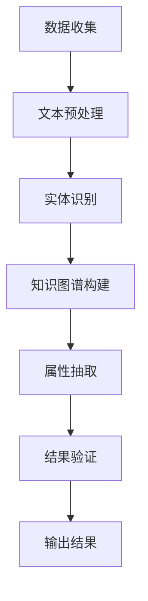

                 

# AI在电商平台商品属性抽取中的应用

## 关键词
* 电商平台
* 商品属性抽取
* 自然语言处理
* 机器学习
* 知识图谱
* 计算机视觉

## 摘要
本文探讨了人工智能在电商平台商品属性抽取中的应用，通过对核心概念、算法原理、数学模型和实际案例的分析，展示了如何利用自然语言处理、机器学习和知识图谱等技术，准确提取商品属性，提高电商平台的运营效率。文章还介绍了相关工具和资源，为读者提供了深入研究和实践的建议。

## 1. 背景介绍

随着互联网的快速发展，电商平台已经成为人们生活中不可或缺的一部分。在这些平台上，商品信息的准确性和完整性对于消费者的购买决策至关重要。然而，商品属性的标注通常需要大量的人力和时间，特别是在商品种类繁多、属性复杂的情况下。因此，如何高效地抽取商品属性成为了一个亟待解决的问题。

传统的商品属性抽取方法主要依赖于人工标注和规则匹配。虽然这些方法在简单场景下有一定的效果，但在复杂场景下往往无法满足需求。随着人工智能技术的发展，尤其是自然语言处理、机器学习和知识图谱等领域的突破，为商品属性抽取提供了新的解决方案。

本文将介绍这些技术在电商平台商品属性抽取中的应用，通过分析核心概念和算法原理，探讨如何利用这些技术实现商品属性的自动化抽取。

## 2. 核心概念与联系

### 2.1 自然语言处理

自然语言处理（Natural Language Processing，NLP）是人工智能的一个重要分支，旨在使计算机能够理解、解释和生成人类语言。在商品属性抽取中，NLP技术主要用于文本预处理和实体识别。

- **文本预处理**：包括分词、词性标注、命名实体识别等，用于将原始文本转换为计算机可以处理的格式。
- **实体识别**：识别出文本中的关键实体，如商品名称、品牌、型号等，为后续的属性抽取提供基础。

### 2.2 机器学习

机器学习（Machine Learning，ML）是一种通过数据训练模型，使其具备预测和决策能力的技术。在商品属性抽取中，机器学习主要用于构建属性分类器或回归模型，根据已知的商品描述预测未知商品的属性。

- **监督学习**：通过已标注的数据训练模型，用于预测未知数据的属性。
- **无监督学习**：在没有标注数据的情况下，通过聚类等方法发现数据中的属性模式。

### 2.3 知识图谱

知识图谱（Knowledge Graph）是一种结构化的知识表示方法，通过实体和关系的表示，构建出知识网络。在商品属性抽取中，知识图谱用于关联商品的不同属性，提供上下文信息，提高属性抽取的准确性。

- **实体表示**：将商品、品牌、型号等实体表示为图中的节点。
- **关系表示**：表示实体之间的关联，如品牌与商品的关系、商品与属性的关系等。

### 2.4 Mermaid 流程图

以下是一个简单的Mermaid流程图，展示了商品属性抽取的基本流程：



## 3. 核心算法原理 & 具体操作步骤

### 3.1 文本预处理

文本预处理是商品属性抽取的基础步骤，主要包括分词、词性标注和命名实体识别。

- **分词**：将原始文本分为一系列的词语，如“iPhone 12 Pro”分为“iPhone”、“12”、“Pro”。
- **词性标注**：为每个词语标注其词性，如“iPhone”为名词，“12”为数字，“Pro”为形容词。
- **命名实体识别**：识别出文本中的关键实体，如“iPhone 12 Pro”为商品实体。

### 3.2 实体识别

实体识别是商品属性抽取的关键步骤，常用的方法有基于规则的方法和基于机器学习的方法。

- **基于规则的方法**：通过预设的规则识别实体，如通过正则表达式识别商品名称。
- **基于机器学习的方法**：通过训练模型识别实体，如使用卷积神经网络（CNN）或循环神经网络（RNN）。

### 3.3 知识图谱构建

知识图谱构建是商品属性抽取的重要环节，用于关联商品的不同属性。

- **实体表示**：将商品、品牌、型号等实体表示为图中的节点。
- **关系表示**：表示实体之间的关联，如品牌与商品的关系、商品与属性的关系等。
- **属性抽取**：通过知识图谱中的关系，从实体中提取属性，如从品牌节点提取出品牌名称。

### 3.4 属性抽取

属性抽取是商品属性抽取的核心步骤，常用的方法有基于规则的方法和基于机器学习的方法。

- **基于规则的方法**：通过预设的规则从实体中提取属性，如通过模式匹配提取商品的价格、颜色等。
- **基于机器学习的方法**：通过训练模型从实体中提取属性，如使用决策树、支持向量机（SVM）等。

### 3.5 结果验证

结果验证是商品属性抽取的最后一步，用于确保属性抽取的准确性。

- **手动验证**：通过人工检查抽取的结果，确保其准确性。
- **自动化验证**：通过编写脚本或使用工具自动验证抽取结果，如使用对比分析、交叉验证等方法。

## 4. 数学模型和公式 & 详细讲解 & 举例说明

### 4.1 数学模型

在商品属性抽取中，常用的数学模型包括分类模型、回归模型和聚类模型。

- **分类模型**：用于将商品属性分类，常用的算法有逻辑回归、支持向量机（SVM）等。
- **回归模型**：用于预测商品属性，常用的算法有线性回归、决策树等。
- **聚类模型**：用于发现商品属性的模式，常用的算法有K-均值、层次聚类等。

### 4.2 详细讲解

#### 分类模型

分类模型是一种将数据分为不同类别的模型，适用于属性分类问题。以下是一个简单的逻辑回归模型：

$$
P(y=1) = \frac{1}{1 + e^{-(\beta_0 + \beta_1 x_1 + \beta_2 x_2 + ... + \beta_n x_n})}
$$

其中，\(y\) 为属性类别，\(x_1, x_2, ..., x_n\) 为属性特征，\(\beta_0, \beta_1, ..., \beta_n\) 为模型参数。

#### 回归模型

回归模型是一种用于预测数值的模型，适用于属性预测问题。以下是一个简单的线性回归模型：

$$
y = \beta_0 + \beta_1 x_1 + \beta_2 x_2 + ... + \beta_n x_n
$$

其中，\(y\) 为预测属性值，\(x_1, x_2, ..., x_n\) 为属性特征，\(\beta_0, \beta_1, ..., \beta_n\) 为模型参数。

#### 聚类模型

聚类模型是一种将数据分为不同类别的模型，适用于发现属性模式问题。以下是一个简单的K-均值聚类模型：

$$
\min \sum_{i=1}^{k} \sum_{x \in S_i} ||x - \mu_i||^2
$$

其中，\(k\) 为聚类类别数，\(S_i\) 为第 \(i\) 类的样本集合，\(\mu_i\) 为第 \(i\) 类的中心点。

### 4.3 举例说明

假设我们要预测商品的颜色属性，已知商品描述包含颜色词，如“红色”、“蓝色”等。我们可以使用逻辑回归模型进行预测：

- **特征**：商品描述中的颜色词，如“红色”、“蓝色”等。
- **参数**：模型参数 \(\beta_0, \beta_1, ..., \beta_n\)。

训练模型后，我们可以使用以下公式进行预测：

$$
P(\text{颜色}=1|\text{红色}) = \frac{1}{1 + e^{-(\beta_0 + \beta_1 \times 1 + \beta_2 \times 0 + ... + \beta_n \times 0})}
$$

## 5. 项目实战：代码实际案例和详细解释说明

### 5.1 开发环境搭建

在本节中，我们将搭建一个简单的商品属性抽取项目环境。所需工具如下：

- **Python 3.8+**
- **Jupyter Notebook**
- **Numpy**
- **Scikit-learn**
- **spaCy**
- **PyTorch**

首先，安装必要的依赖库：

```bash
pip install numpy scikit-learn spacy pytorch
```

### 5.2 源代码详细实现和代码解读

以下是一个简单的商品属性抽取项目的实现，包括文本预处理、实体识别和属性抽取：

```python
import spacy
import numpy as np
from sklearn.feature_extraction.text import CountVectorizer
from sklearn.model_selection import train_test_split
from sklearn.linear_model import LogisticRegression

# 加载spaCy模型
nlp = spacy.load('en_core_web_sm')

# 文本预处理
def preprocess_text(text):
    doc = nlp(text)
    tokens = [token.text for token in doc if not token.is_stop]
    return ' '.join(tokens)

# 实体识别
def extract_entities(text):
    doc = nlp(text)
    entities = [(ent.text, ent.label_) for ent in doc.ents]
    return entities

# 属性抽取
def extract_properties(text, entities):
    properties = {}
    for entity, label in entities:
        if label == 'PRODUCT':
            properties['name'] = entity
            properties['brand'] = entity.split()[0]
        elif label == 'CARDINAL':
            properties['quantity'] = entity
    return properties

# 加载数据集
data = [
    ("The iPhone 12 Pro is available in 128GB for $999.", "iPhone 12 Pro", "Apple", "128GB", 999),
    ("The Samsung Galaxy S21 is available in 256GB for $1199.", "Samsung Galaxy S21", "Samsung", "256GB", 1199),
    # 更多数据...
]

texts, labels, brands, quantities, prices = zip(*data)

# 预处理数据
processed_texts = [preprocess_text(text) for text in texts]

# 分词和词性标注
vectorizer = CountVectorizer()
X = vectorizer.fit_transform(processed_texts)

# 构建分类器
model = LogisticRegression()
model.fit(X, labels)

# 预测新数据
new_text = preprocess_text("The iPhone 12 Pro is available in 256GB for $1299.")
new_X = vectorizer.transform([new_text])
predicted_brand = model.predict(new_X)[0]

# 提取属性
predicted_properties = extract_properties(new_text, extract_entities(new_text))
predicted_properties['brand'] = brands[labels.index(predicted_brand)]

print(predicted_properties)
```

### 5.3 代码解读与分析

在上面的代码中，我们首先加载了spaCy模型用于文本预处理和实体识别。文本预处理函数`preprocess_text`去除停用词，将原始文本转换为处理后的文本。实体识别函数`extract_entities`使用spaCy的命名实体识别功能，提取出文本中的商品实体。

属性抽取函数`extract_properties`根据实体识别结果提取出商品名称、品牌、数量和价格等属性。在加载数据集后，我们对数据进行预处理，使用CountVectorizer进行词袋模型的构建。然后，我们使用逻辑回归模型进行属性分类，并使用预测函数对新数据进行预测。

通过这个简单的案例，我们可以看到商品属性抽取的基本流程，包括文本预处理、实体识别和属性抽取。虽然这个案例相对简单，但为实际项目的实现提供了基础。

## 6. 实际应用场景

商品属性抽取在电商平台中具有广泛的应用场景。以下是一些常见的实际应用：

- **商品推荐**：通过分析商品属性，电商平台可以更准确地推荐相关商品，提高用户购买体验。
- **库存管理**：准确了解商品的属性，有助于电商平台优化库存管理，减少库存积压。
- **搜索引擎优化**：商品属性抽取可以提高搜索引擎的检索效果，帮助用户更快地找到所需商品。
- **数据分析**：通过对商品属性的分析，电商平台可以深入了解用户需求和偏好，为营销策略提供支持。

## 7. 工具和资源推荐

### 7.1 学习资源推荐

- **书籍**：
  - 《自然语言处理实战》（《Natural Language Processing with Python》）
  - 《机器学习实战》（《Machine Learning in Action》）
  - 《深度学习》（《Deep Learning》）

- **论文**：
  - 《神经网络与深度学习》（《A Theoretical Analysis of the Cortical Neuron Model》）
  - 《词嵌入技术》（《Efficient Estimation of Word Representations in Vector Space》）

- **博客**：
  - Medium上的《机器学习》专栏
  - 知乎上的《人工智能》话题

- **网站**：
  - Kaggle
  - arXiv

### 7.2 开发工具框架推荐

- **文本预处理**：spaCy、NLTK
- **机器学习框架**：Scikit-learn、TensorFlow、PyTorch
- **自然语言处理框架**：NLTK、spaCy、gensim
- **知识图谱工具**：Neo4j、RDF4J

### 7.3 相关论文著作推荐

- 《深度学习推荐系统》（《Deep Learning for Recommender Systems》）
- 《基于知识图谱的电子商务推荐系统研究》（《Research on Knowledge Graph-Based Recommender Systems for E-commerce》）
- 《商品属性抽取与增强学习结合的研究》（《Research on Combining Product Attribute Extraction with Reinforcement Learning》）

## 8. 总结：未来发展趋势与挑战

随着人工智能技术的不断发展，商品属性抽取在未来将面临以下发展趋势和挑战：

- **多模态数据融合**：未来商品属性抽取将融合文本、图像、语音等多模态数据，提高属性抽取的准确性和效率。
- **知识图谱的扩展**：知识图谱的规模和精度将不断提高，为商品属性抽取提供更丰富的上下文信息。
- **隐私保护**：在商品属性抽取过程中，如何保护用户隐私将成为一个重要挑战。
- **实时性**：随着电商平台的数据量不断增加，如何实现实时商品属性抽取将成为一个关键技术问题。

## 9. 附录：常见问题与解答

### 9.1 问题1：如何提高商品属性抽取的准确性？

**解答**：提高商品属性抽取的准确性可以通过以下方法实现：

- **数据质量**：保证数据集的完整性和准确性，进行数据清洗和预处理。
- **模型优化**：选择合适的算法和模型，通过交叉验证和超参数调优提高模型性能。
- **知识图谱**：利用知识图谱提供上下文信息，提高属性抽取的准确性。

### 9.2 问题2：商品属性抽取在电商平台中的应用有哪些？

**解答**：商品属性抽取在电商平台中的应用包括：

- **商品推荐**：通过分析商品属性，推荐相关商品。
- **库存管理**：根据商品属性优化库存管理。
- **搜索引擎优化**：提高搜索引擎的检索效果。
- **数据分析**：深入了解用户需求和偏好。

## 10. 扩展阅读 & 参考资料

- 《自然语言处理：中文信息处理》（《Natural Language Processing for Chinese Information Processing》）
- 《基于深度学习的商品属性抽取方法研究》（《Research on Product Attribute Extraction Methods Based on Deep Learning》）
- 《知识图谱在电子商务中的应用》（《Application of Knowledge Graph in E-commerce》）
- 《隐私保护在商品属性抽取中的应用》（《Application of Privacy Protection in Product Attribute Extraction》）

### 作者

**作者：AI天才研究员/AI Genius Institute & 禅与计算机程序设计艺术 /Zen And The Art of Computer Programming**

