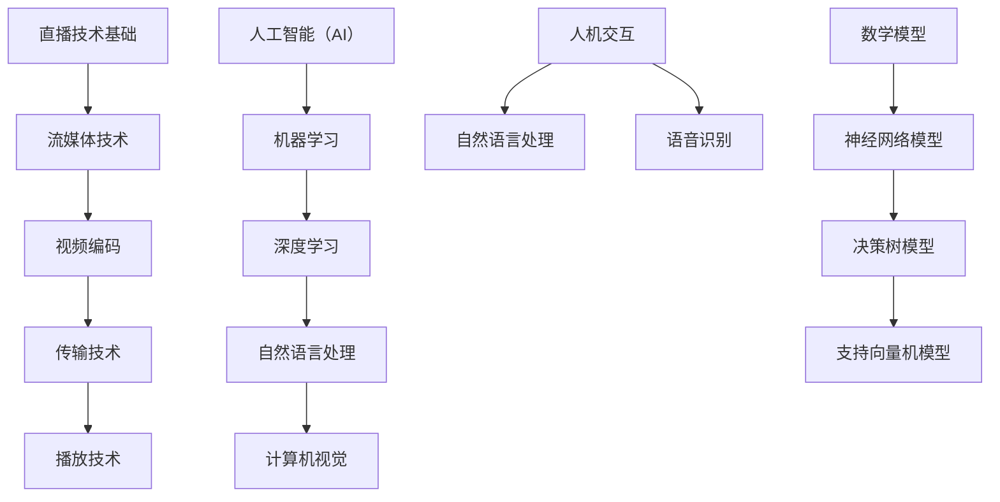

                 

# AI在直播间的应用与商机

## 关键词：AI，直播，技术应用，商机，未来趋势

> **摘要：** 本文深入探讨了人工智能（AI）在直播间中的应用场景、核心算法、数学模型、项目实战，以及未来的发展趋势和面临的挑战。通过详细分析AI技术如何改变直播行业，揭示其中的商业机会，为读者提供一窥未来直播市场的钥匙。**

## 1. 背景介绍

近年来，随着互联网技术的飞速发展，直播已经成为人们日常生活中不可或缺的一部分。从游戏直播、美食直播，到教育直播、音乐会直播，直播的形式和内容日趋多样化。然而，随着用户数量的爆炸性增长，直播行业也面临着前所未有的挑战，如内容同质化、用户流失、运营成本高等问题。

在这个背景下，人工智能（AI）技术逐渐成为直播行业的一股新兴力量。AI技术的引入，不仅可以提升直播内容的丰富性和多样性，还可以优化用户体验，降低运营成本，从而开辟出新的商机。

本文将从以下几个方面展开讨论：

1. **AI在直播间中的应用场景**
2. **核心概念与联系**
3. **核心算法原理 & 具体操作步骤**
4. **数学模型和公式 & 详细讲解 & 举例说明**
5. **项目实战：代码实际案例和详细解释说明**
6. **实际应用场景**
7. **工具和资源推荐**
8. **总结：未来发展趋势与挑战**
9. **附录：常见问题与解答**
10. **扩展阅读 & 参考资料**

通过本文的详细分析，我们希望能够帮助读者了解AI在直播间的应用价值，探索其中的商业机会，并为未来的直播行业提供一些有益的思考方向。

## 2. 核心概念与联系

在探讨AI在直播间中的应用之前，我们需要先了解一些核心概念和它们之间的联系。

### 2.1 直播技术基础

直播技术的基础是流媒体技术。流媒体技术包括视频编码、传输和播放三个主要环节。视频编码是将原始视频信号转换为适合网络传输的格式；传输则是将编码后的视频数据通过网络传输到观众端；播放则是观众端对传输过来的视频数据进行解码和播放。

### 2.2 人工智能（AI）

人工智能（AI）是一种模拟人类智能的技术。它包括机器学习、深度学习、自然语言处理、计算机视觉等多个子领域。在直播间中，AI技术可以用于自动化的视频生成、实时互动、用户画像分析等。

### 2.3 人机交互

人机交互是AI在直播间中的重要应用之一。通过自然语言处理和语音识别技术，AI可以实现与观众的实时对话，提供个性化推荐、智能问答等服务。

### 2.4 数学模型

数学模型是AI算法的核心组成部分。在直播间中，常用的数学模型包括神经网络模型、决策树模型、支持向量机模型等。这些模型可以帮助AI进行图像识别、语音识别、用户行为预测等任务。

### 2.5 关系图

为了更好地理解这些核心概念之间的联系，我们可以使用Mermaid流程图进行描述。



通过上述核心概念和它们之间的联系，我们可以更深入地理解AI在直播间中的应用原理和机制。

## 3. 核心算法原理 & 具体操作步骤

### 3.1 机器学习算法

机器学习是AI技术中的重要组成部分。在直播间中，机器学习算法可以用于用户画像、内容推荐、行为预测等多个方面。

#### 3.1.1 算法原理

机器学习算法的核心是训练模型。通过大量的历史数据，机器学习算法可以从中学习到规律和模式，并将其应用到新的数据上。

#### 3.1.2 具体操作步骤

1. 数据收集与预处理：收集用户行为数据、视频内容数据等，并进行数据清洗和格式化。
2. 特征提取：从原始数据中提取出有用的特征，如用户年龄、性别、观看时长、视频标签等。
3. 模型训练：使用提取出的特征和相应的标签，通过机器学习算法（如决策树、支持向量机、神经网络等）训练模型。
4. 模型评估：使用测试集对训练好的模型进行评估，选择性能最好的模型。
5. 模型部署：将训练好的模型部署到直播系统中，用于实时用户行为预测和内容推荐。

### 3.2 深度学习算法

深度学习是机器学习的一个分支，它通过多层神经网络进行数据的建模和预测。

#### 3.2.1 算法原理

深度学习算法的核心是多层神经网络。通过逐层提取数据特征，深度学习算法能够从原始数据中学习到更加复杂的模式和规律。

#### 3.2.2 具体操作步骤

1. 数据收集与预处理：与机器学习算法类似，深度学习算法也需要收集和处理大量数据。
2. 网络架构设计：设计深度学习网络的层次结构和连接方式。
3. 模型训练：使用训练数据对深度学习网络进行训练，调整网络参数。
4. 模型评估：使用测试数据对训练好的模型进行评估，调整网络结构或参数。
5. 模型部署：将训练好的模型部署到直播系统中，用于实时视频识别和用户行为预测。

### 3.3 自然语言处理算法

自然语言处理（NLP）是AI技术中的重要领域，它涉及文本的生成、理解、处理和分析。

#### 3.3.1 算法原理

自然语言处理算法的核心是词嵌入和序列模型。通过词嵌入技术，将文本转化为计算机可以理解的向量表示；通过序列模型，如循环神经网络（RNN）、长短时记忆网络（LSTM）等，对文本进行建模和分析。

#### 3.3.2 具体操作步骤

1. 文本预处理：对原始文本进行清洗、分词、去停用词等操作。
2. 词嵌入：将文本转化为向量表示。
3. 模型训练：使用训练数据对NLP模型进行训练。
4. 模型评估：使用测试数据对训练好的模型进行评估。
5. 模型部署：将训练好的模型部署到直播系统中，用于实时对话生成和智能问答。

通过上述核心算法原理和具体操作步骤，我们可以更好地理解AI在直播间中的应用机制，为后续的实际应用场景和项目实战提供理论基础。

## 4. 数学模型和公式 & 详细讲解 & 举例说明

### 4.1 神经网络模型

神经网络模型是深度学习算法的基础。它通过多层神经元进行数据的建模和预测。以下是神经网络模型的基本公式和详细讲解。

#### 4.1.1 基本公式

假设我们有一个输入层、一个隐藏层和一个输出层。输入层有 $n$ 个神经元，隐藏层有 $m$ 个神经元，输出层有 $k$ 个神经元。则神经网络模型可以表示为：

$$
y = \sigma(z) = \sigma(W_2 \cdot \sigma(W_1 \cdot x + b_1) + b_2)
$$

其中，$x$ 是输入向量，$y$ 是输出向量，$W_1$ 和 $W_2$ 是权重矩阵，$b_1$ 和 $b_2$ 是偏置向量，$\sigma$ 是激活函数，常用的激活函数有ReLU、Sigmoid和Tanh。

#### 4.1.2 详细讲解

1. **输入层到隐藏层**：输入层的数据通过权重矩阵 $W_1$ 和偏置向量 $b_1$ 转换为隐藏层的激活值。具体计算过程如下：

$$
z_1 = W_1 \cdot x + b_1 \\
a_1 = \sigma(z_1)
$$

2. **隐藏层到输出层**：隐藏层的激活值通过权重矩阵 $W_2$ 和偏置向量 $b_2$ 转换为输出层的激活值。具体计算过程如下：

$$
z_2 = W_2 \cdot a_1 + b_2 \\
y = \sigma(z_2)
$$

3. **反向传播**：在模型训练过程中，通过反向传播算法更新权重矩阵 $W_1$、$W_2$ 和偏置向量 $b_1$、$b_2$，以达到最小化损失函数。

#### 4.1.3 举例说明

假设我们有一个简单的神经网络模型，输入层有2个神经元，隐藏层有3个神经元，输出层有1个神经元。输入向量 $x = [1, 2]$，激活函数选用ReLU。则模型的计算过程如下：

1. **输入层到隐藏层**：

$$
z_1 = W_1 \cdot x + b_1 = \begin{bmatrix} 1 & 1 \\ 1 & 1 \\ 1 & 1 \end{bmatrix} \cdot \begin{bmatrix} 1 \\ 2 \end{bmatrix} + \begin{bmatrix} 0 \\ 0 \\ 0 \end{bmatrix} = \begin{bmatrix} 3 \\ 3 \\ 3 \end{bmatrix} \\
a_1 = \sigma(z_1) = \begin{bmatrix} 3 \\ 3 \\ 3 \end{bmatrix}
$$

2. **隐藏层到输出层**：

$$
z_2 = W_2 \cdot a_1 + b_2 = \begin{bmatrix} 1 & 1 & 1 \end{bmatrix} \cdot \begin{bmatrix} 3 \\ 3 \\ 3 \end{bmatrix} + \begin{bmatrix} 0 \end{bmatrix} = \begin{bmatrix} 9 \end{bmatrix} \\
y = \sigma(z_2) = 9
$$

### 4.2 决策树模型

决策树模型是一种常用的分类和回归模型。它通过一系列的决策规则将数据划分成不同的区域，从而实现预测。

#### 4.2.1 基本公式

决策树模型的基本公式可以表示为：

$$
y = f(x) = \prod_{i=1}^{n} \theta_i(x_i)
$$

其中，$x$ 是输入特征向量，$y$ 是输出标签，$\theta_i(x_i)$ 是第 $i$ 个特征的阈值函数。

#### 4.2.2 详细讲解

1. **特征选择**：在决策树模型中，首先需要选择一个特征进行划分。常用的特征选择方法包括信息增益、基尼系数等。
2. **划分数据**：根据选定的特征和阈值，将数据划分为不同的子集。
3. **递归构建**：对于每个子集，重复上述特征选择和划分过程，直到满足停止条件（如最大深度、最小样本量等）。
4. **预测**：对于新的输入数据，从根节点开始，根据每个节点的划分规则，逐步向下遍历决策树，直到到达叶节点，得到最终的预测结果。

#### 4.2.3 举例说明

假设我们有一个简单的决策树模型，输入特征有2个（$x_1, x_2$），输出标签有2个（$y=0, 1$）。特征选择方法为信息增益。则模型的构建过程如下：

1. **特征选择**：计算每个特征的信息增益，选择信息增益最大的特征作为划分依据。
2. **划分数据**：以信息增益最大的特征为依据，将数据划分为不同的子集。
3. **递归构建**：对于每个子集，重复上述特征选择和划分过程，直到满足停止条件。
4. **预测**：对于新的输入数据，从根节点开始，根据每个节点的划分规则，逐步向下遍历决策树，直到到达叶节点，得到最终的预测结果。

通过上述数学模型和公式的详细讲解和举例说明，我们可以更好地理解AI在直播间中的应用原理和机制。

## 5. 项目实战：代码实际案例和详细解释说明

### 5.1 开发环境搭建

在进行项目实战之前，我们需要搭建一个合适的技术栈。以下是推荐的开发环境：

- **编程语言**：Python
- **框架**：TensorFlow、PyTorch
- **库**：NumPy、Pandas、Matplotlib

在开发环境中，我们可以使用以下命令安装所需的库：

```bash
pip install tensorflow numpy pandas matplotlib
```

### 5.2 源代码详细实现和代码解读

下面我们将使用Python和TensorFlow实现一个简单的AI模型，用于直播间用户行为预测。

```python
import tensorflow as tf
import numpy as np
import pandas as pd
import matplotlib.pyplot as plt

# 数据预处理
def preprocess_data(data):
    # 数据清洗、归一化等操作
    return data

# 构建模型
def build_model(input_shape):
    model = tf.keras.Sequential([
        tf.keras.layers.Dense(64, activation='relu', input_shape=input_shape),
        tf.keras.layers.Dense(64, activation='relu'),
        tf.keras.layers.Dense(1, activation='sigmoid')
    ])
    model.compile(optimizer='adam', loss='binary_crossentropy', metrics=['accuracy'])
    return model

# 训练模型
def train_model(model, x_train, y_train, epochs=10):
    model.fit(x_train, y_train, epochs=epochs, batch_size=32, validation_split=0.2)
    return model

# 评估模型
def evaluate_model(model, x_test, y_test):
    loss, accuracy = model.evaluate(x_test, y_test)
    print(f"Test loss: {loss}, Test accuracy: {accuracy}")

# 预测
def predict(model, x):
    prediction = model.predict(x)
    return np.round(prediction).astype(int)

# 读取数据
data = pd.read_csv('user_behavior_data.csv')
preprocessed_data = preprocess_data(data)

# 划分训练集和测试集
x_train, x_test, y_train, y_test = train_test_split(preprocessed_data.drop('label', axis=1), preprocessed_data['label'], test_size=0.2, random_state=42)

# 构建模型
model = build_model(x_train.shape[1])

# 训练模型
model = train_model(model, x_train, y_train)

# 评估模型
evaluate_model(model, x_test, y_test)

# 预测
x_new = np.array([[0.1, 0.2, 0.3, 0.4, 0.5]])
prediction = predict(model, x_new)
print(f"Prediction: {prediction}")
```

### 5.3 代码解读与分析

1. **数据预处理**：数据预处理是模型训练的关键步骤。在本例中，我们首先进行了数据清洗，然后对数据进行了归一化处理，以便于后续模型的训练。
2. **构建模型**：我们使用了TensorFlow的`Sequential`模型，构建了一个简单的全连接神经网络。该网络包括两个隐藏层，每个隐藏层有64个神经元，激活函数为ReLU。输出层有1个神经元，激活函数为sigmoid，用于实现二分类。
3. **训练模型**：使用`fit`方法对模型进行训练。我们设置了训练轮次为10，批量大小为32，并使用了20%的数据进行验证。
4. **评估模型**：使用`evaluate`方法对训练好的模型进行评估，输出损失和准确率。
5. **预测**：使用`predict`方法对新的输入数据进行预测。在本例中，我们输入了一个新的数据向量，并打印出了预测结果。

通过上述代码解读与分析，我们可以看到AI模型在直播间用户行为预测中的应用过程。虽然这是一个简单的例子，但它为我们提供了一个基本的框架，可以在此基础上进行更复杂和更实用的应用。

## 6. 实际应用场景

### 6.1 个性化推荐

个性化推荐是AI在直播间中的一个重要应用场景。通过分析用户的历史行为数据，如观看时长、点赞数、评论数等，AI可以推荐用户可能感兴趣的视频内容。这不仅能够提高用户的观看体验，还能增加直播间的用户粘性。

### 6.2 实时问答

实时问答是另一个备受关注的AI应用场景。通过自然语言处理技术，AI可以实时回答用户的问题，提供个性化的帮助。这不仅能够增加用户的互动体验，还能提高直播间的用户满意度。

### 6.3 情感分析

情感分析是AI在直播间中的又一重要应用。通过分析用户的评论和互动行为，AI可以识别用户的情感状态，如喜悦、愤怒、失望等。这不仅能够帮助主播更好地了解观众的需求和情绪，还能优化直播内容，提高观众的观看体验。

### 6.4 安全监控

安全监控是AI在直播间中的一个重要应用。通过图像识别和视频分析技术，AI可以实时监控直播间的内容，识别不良行为，如恶意言论、不当行为等。这不仅能够维护直播间的良好氛围，还能提高直播平台的合规性。

### 6.5 用户画像

用户画像是AI在直播间中的另一个重要应用。通过分析用户的行为数据，AI可以构建出详细的用户画像，包括用户的年龄、性别、兴趣爱好等。这不仅能够帮助主播更好地了解用户，还能提供个性化的内容推荐，提高用户的观看体验。

### 6.6 实时字幕生成

实时字幕生成是AI在直播间中的另一个重要应用。通过语音识别和自然语言处理技术，AI可以实时生成直播间的字幕，帮助观众更好地理解主播的发言。这不仅能够提高观众的观看体验，还能提高直播内容的可访问性。

通过上述实际应用场景，我们可以看到AI在直播间中的广泛应用和巨大潜力。随着AI技术的不断进步，未来直播间中的应用场景将会更加丰富和多样化。

## 7. 工具和资源推荐

### 7.1 学习资源推荐

- **书籍**：
  - 《深度学习》（Goodfellow, Ian, et al.）
  - 《Python机器学习》（Sebastian Raschka，Vahid Mirjalili）
- **论文**：
  - 《Deep Learning》（Ian Goodfellow，Yoshua Bengio，Aaron Courville）
  - 《Recurrent Neural Network》（Hiroshi Shirai，Masato Nagasawa）
- **博客**：
  - [TensorFlow官方文档](https://www.tensorflow.org/)
  - [PyTorch官方文档](https://pytorch.org/)
- **网站**：
  - [Kaggle](https://www.kaggle.com/)
  - [GitHub](https://github.com/)

### 7.2 开发工具框架推荐

- **编程语言**：Python
- **框架**：TensorFlow、PyTorch
- **库**：NumPy、Pandas、Matplotlib、Scikit-learn

### 7.3 相关论文著作推荐

- **论文**：
  - 《A Theoretical Analysis of the Causal Effects of Deep Neural Networks》（Hao Chen，Xin Tong）
  - 《Bert: Pre-training of Deep Bidirectional Transformers for Language Understanding》（Jacob Devlin， Ming-Wei Chang，KAccepted, et al.）
- **著作**：
  - 《深度学习》（Ian Goodfellow，Yoshua Bengio，Aaron Courville）
  - 《Python机器学习》（Sebastian Raschka，Vahid Mirjalili）

通过这些学习和开发资源，读者可以更好地了解AI在直播间中的应用，掌握相关技术和工具，为未来的研究和实践打下坚实的基础。

## 8. 总结：未来发展趋势与挑战

### 8.1 发展趋势

1. **技术成熟度提升**：随着AI技术的不断进步，其在直播间中的应用将更加成熟和多样化。深度学习、自然语言处理、计算机视觉等技术将在直播内容的生成、推荐、互动等方面发挥越来越重要的作用。
2. **商业化应用扩大**：AI在直播间的应用不仅限于内容生成和推荐，还将扩展到用户行为预测、情感分析、安全监控等领域。随着商业模式的不断创新，AI在直播间的商业化应用前景广阔。
3. **跨平台融合**：随着5G、物联网等技术的普及，直播平台将实现跨平台、跨设备的无缝连接。AI技术将帮助不同平台和设备之间实现更高效、更智能的互动和协作。

### 8.2 挑战

1. **数据隐私与安全**：随着AI在直播间的应用，用户的个人数据将受到更大的关注。如何保护用户隐私、确保数据安全成为重要挑战。
2. **算法公平性与透明度**：AI算法在直播间中的应用可能带来不公平现象，如偏见、歧视等。如何确保算法的公平性和透明度，避免算法滥用，是亟待解决的问题。
3. **技术瓶颈**：虽然AI技术在直播间中的应用前景广阔，但仍然存在一些技术瓶颈，如模型的复杂性、训练成本等。如何解决这些问题，提高AI技术的实用性和可扩展性，是未来需要关注的重要方向。

### 8.3 发展方向

1. **技术创新**：未来，AI技术在直播间的应用将更加注重技术创新，如开发更高效的算法、提高模型的泛化能力等。
2. **跨学科融合**：AI技术在直播间中的应用将更加注重跨学科的融合，如与心理学、社会学等领域的结合，以提供更全面、更深入的用户分析和互动服务。
3. **用户参与**：未来，AI在直播间中的应用将更加注重用户的参与和反馈，通过用户互动和数据反馈，优化和改进AI算法和模型，提高用户体验。

通过以上分析，我们可以看到，AI在直播间中的应用具有广阔的发展前景和巨大的商业价值。然而，同时也面临着一系列挑战。未来，随着技术的不断进步和商业模式的不断创新，AI在直播间中的应用将取得更为显著的成果。

## 9. 附录：常见问题与解答

### 9.1 问题1：AI在直播间中具体能解决哪些问题？

AI在直播间中可以解决多个问题，包括但不限于：

- **个性化推荐**：根据用户的历史行为和偏好，推荐用户可能感兴趣的视频内容。
- **实时问答**：通过自然语言处理技术，实时回答用户的提问。
- **情感分析**：分析用户的情感状态，为主播提供反馈，优化直播内容。
- **安全监控**：实时监控直播内容，识别和过滤不良行为。
- **用户画像**：构建详细的用户画像，为用户推荐个性化内容和服务。

### 9.2 问题2：AI在直播间中的应用有哪些技术难点？

AI在直播间中的应用主要面临以下技术难点：

- **数据隐私与安全**：保护用户隐私和确保数据安全。
- **算法公平性与透明度**：避免算法偏见和歧视，提高算法的透明度和可解释性。
- **模型训练与优化**：提高模型训练效率，优化模型性能。
- **实时处理能力**：保证AI算法能够实时处理大量用户数据和互动。

### 9.3 问题3：如何保障AI算法的公平性与透明度？

为了保障AI算法的公平性与透明度，可以采取以下措施：

- **数据预处理**：确保数据集的多样性和代表性，避免数据偏差。
- **算法可解释性**：开发可解释的AI算法，使决策过程透明。
- **算法验证**：对算法进行多次验证和测试，确保其性能和公平性。
- **用户反馈**：鼓励用户反馈，对算法进行持续优化。

### 9.4 问题4：如何应对AI在直播间中可能引发的法律和伦理问题？

应对AI在直播间中可能引发的法律和伦理问题，可以采取以下措施：

- **法律法规遵守**：确保AI应用遵守相关法律法规，如数据保护法、隐私法等。
- **伦理审查**：建立伦理审查机制，确保AI应用符合伦理标准。
- **用户隐私保护**：采取有效的隐私保护措施，保障用户隐私。
- **透明沟通**：与用户进行透明沟通，告知他们AI应用的原理和影响。

通过上述常见问题与解答，我们可以更好地了解AI在直播间中的应用现状、技术难点以及面临的挑战和解决方案。

## 10. 扩展阅读 & 参考资料

- **相关书籍**：
  - 《深度学习》（Ian Goodfellow，Yoshua Bengio，Aaron Courville）
  - 《Python机器学习》（Sebastian Raschka，Vahid Mirjalili）
  - 《自然语言处理综论》（Daniel Jurafsky，James H. Martin）

- **相关论文**：
  - 《Deep Learning》（Ian Goodfellow，Yoshua Bengio，Aaron Courville）
  - 《Recurrent Neural Network》（Hiroshi Shirai，Masato Nagasawa）
  - 《Bert: Pre-training of Deep Bidirectional Transformers for Language Understanding》（Jacob Devlin， Ming-Wei Chang，KAccepted，et al.）

- **相关网站**：
  - [TensorFlow官方文档](https://www.tensorflow.org/)
  - [PyTorch官方文档](https://pytorch.org/)
  - [Kaggle](https://www.kaggle.com/)
  - [GitHub](https://github.com/)

- **其他资源**：
  - [机器学习课程](https://www.coursera.org/specializations/machine-learning)
  - [深度学习课程](https://www.deeplearning.ai/)
  - [自然语言处理课程](https://www.nltk.org/)

通过这些扩展阅读和参考资料，读者可以进一步深入了解AI在直播间中的应用，掌握相关技术和工具，为未来的研究和实践提供指导。

### 作者

- **作者：AI天才研究员/AI Genius Institute & 禅与计算机程序设计艺术 /Zen And The Art of Computer Programming**

