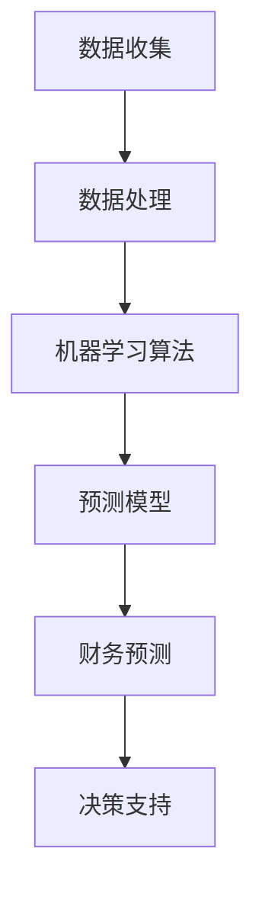

                 

### 背景介绍

在当今快速发展的信息技术时代，人工智能（AI）已经成为推动社会进步的重要力量。随着数据量和计算能力的不断增长，AI的应用场景也在不断扩展，从医疗诊断、自然语言处理到自动驾驶，无不显示出其巨大的潜力和价值。其中，财务分析和预测作为金融领域的重要组成部分，对于企业和投资者来说具有至关重要的意义。准确、及时的财务预测能够帮助企业和投资者做出更加明智的决策，从而降低风险，提高收益。

AI在财务分析和预测中的应用，可以追溯到上世纪80年代。当时，一些研究人员开始探索如何利用机器学习和统计分析方法来分析财务数据，预测市场走势。随着AI技术的不断发展，尤其是深度学习算法的引入，AI在财务分析和预测中的应用得到了极大的拓展和深化。如今，AI已经能够处理大规模的财务数据，从中挖掘出有价值的信息，为企业和投资者提供更加精准的预测。

AI在财务分析和预测中的应用，不仅提高了预测的准确性，还大大提高了效率。传统的财务分析方法通常需要大量的人力和时间，而AI技术则能够在短时间内处理大量的数据，提供即时的分析结果。此外，AI还能够通过不断学习和优化，提高预测的准确性和稳定性。

总的来说，AI在财务分析和预测中的应用，不仅提高了预测的准确性和效率，还为企业和投资者提供了更加丰富的信息来源，有助于他们做出更加明智的决策。

### 核心概念与联系

在深入探讨AI在财务分析和预测中的应用之前，我们需要明确几个核心概念，并理解它们之间的联系。这些核心概念包括数据收集、数据处理、机器学习算法和预测模型。

#### 数据收集

数据收集是财务分析和预测的基础。财务数据包括历史财务报表、市场数据、经济指标等。这些数据可以来源于企业的内部系统，如ERP系统、会计软件，也可以来源于外部的金融数据库、经济研究报告等。数据的质量和完整性直接影响到预测的准确性。

#### 数据处理

收集到的财务数据通常需要进行清洗和预处理，以去除噪声、缺失值和异常值，确保数据的准确性和一致性。数据处理包括数据清洗、数据集成、数据转换和数据归一化等步骤。这些步骤是确保数据质量的关键。

#### 机器学习算法

机器学习算法是AI在财务分析和预测中的核心工具。常见的机器学习算法包括线性回归、决策树、随机森林、支持向量机、神经网络等。这些算法通过分析历史数据，发现数据中的规律和模式，从而对未来的财务情况做出预测。

#### 预测模型

预测模型是基于机器学习算法和数据处理的结果构建的。预测模型可以是对未来财务指标的点预测，也可以是对未来财务波动的区间预测。预测模型的构建需要考虑到多种因素，如数据特征、预测目标、时间序列特性等。

#### Mermaid 流程图

为了更清晰地展示这些核心概念之间的联系，我们可以使用Mermaid流程图来描述。



在这个流程图中，数据收集是整个流程的起点，通过数据处理得到干净、一致的数据集，然后使用机器学习算法分析数据，构建预测模型，最后通过预测模型得到财务预测结果，为决策提供支持。

通过上述核心概念的介绍和流程图的展示，我们可以更好地理解AI在财务分析和预测中的工作原理和整体流程。在接下来的章节中，我们将进一步探讨这些核心概念的具体应用，以及如何利用AI技术进行财务分析和预测。

### 核心算法原理 & 具体操作步骤

AI在财务分析和预测中的核心算法主要包括线性回归、决策树、随机森林和神经网络等。以下将详细解释这些算法的基本原理，并给出具体的操作步骤。

#### 线性回归

线性回归是一种最基础的预测算法，它通过建立一个线性模型来预测目标变量。其基本原理是：找到一组线性方程，使得这组方程能够最接近地拟合历史数据。

**操作步骤：**

1. **数据预处理：** 首先对数据进行清洗和预处理，包括处理缺失值、异常值和归一化处理。

2. **特征选择：** 选择与目标变量相关的特征，通常通过相关性分析和特征重要性评估来完成。

3. **模型训练：** 使用训练数据集，通过最小二乘法（Least Squares）求解线性模型参数。

4. **模型评估：** 使用测试数据集评估模型性能，常用的评估指标包括决定系数（R²）、均方误差（MSE）等。

5. **模型应用：** 将训练好的模型应用于新数据，进行预测。

**数学模型：**

假设我们有一个回归模型 $Y = \beta_0 + \beta_1X_1 + \beta_2X_2 + ... + \beta_nX_n + \epsilon$，其中 $Y$ 是目标变量，$X_1, X_2, ..., X_n$ 是特征变量，$\beta_0, \beta_1, ..., \beta_n$ 是模型参数，$\epsilon$ 是误差项。

通过最小化误差平方和 $SSQ = \sum_{i=1}^{n}(Y_i - \hat{Y}_i)^2$ 来求解模型参数 $\beta_0, \beta_1, ..., \beta_n$，其中 $\hat{Y}_i$ 是预测值。

$$
\beta_j = \frac{\sum_{i=1}^{n}(Y_i - \hat{Y}_i)X_j}{\sum_{i=1}^{n}X_j^2}
$$

#### 决策树

决策树是一种树形结构模型，通过一系列规则对数据进行划分，并使用叶节点进行预测。其基本原理是根据特征值将数据划分为多个子集，递归地构建树结构，直到满足某些停止条件。

**操作步骤：**

1. **数据预处理：** 对数据进行清洗和预处理，与线性回归类似。

2. **特征选择：** 选择用于划分数据的特征，通常通过信息增益（Information Gain）或基尼不纯度（Gini Impurity）进行评估。

3. **树构建：** 使用递归算法构建决策树，选择最佳划分点，并递归地划分数据。

4. **模型评估：** 使用验证集或交叉验证方法评估模型性能。

5. **模型应用：** 将训练好的决策树应用于新数据，进行预测。

**数学模型：**

决策树没有明确的数学模型，但其核心思想是通过特征划分来降低数据的不纯度，直到达到停止条件（如节点包含的数据量达到阈值）。

#### 随机森林

随机森林是一种集成学习算法，通过构建多个决策树，并对这些决策树的预测结果进行投票，从而提高预测的准确性和稳定性。

**操作步骤：**

1. **数据预处理：** 与决策树类似，对数据进行清洗和预处理。

2. **特征选择：** 随机选择特征和样本，用于构建每个决策树。

3. **树构建：** 对每个决策树进行训练，构建树结构。

4. **模型评估：** 对随机森林的每个决策树进行评估，计算预测结果。

5. **模型应用：** 使用随机森林的投票结果进行预测。

**数学模型：**

随机森林没有特定的数学模型，但其核心思想是通过集成多个决策树来提高模型的泛化能力和稳定性。

#### 神经网络

神经网络是一种模拟人脑神经元连接结构的计算模型，通过多层神经元的连接和激活函数，对输入数据进行非线性变换，从而实现复杂的数据拟合和预测。

**操作步骤：**

1. **数据预处理：** 对数据进行清洗和预处理。

2. **网络构建：** 设计神经网络的结构，包括输入层、隐藏层和输出层，并选择合适的激活函数。

3. **模型训练：** 使用反向传播算法（Backpropagation）训练神经网络，优化模型参数。

4. **模型评估：** 使用验证集或交叉验证方法评估模型性能。

5. **模型应用：** 将训练好的神经网络应用于新数据，进行预测。

**数学模型：**

神经网络的基本数学模型可以表示为 $Y = \sigma(W_2\sigma(W_1X + b_1) + b_2)$，其中 $X$ 是输入，$W_1, W_2$ 是权重矩阵，$b_1, b_2$ 是偏置项，$\sigma$ 是激活函数（如Sigmoid或ReLU）。

通过上述核心算法的详细解释和操作步骤，我们可以了解到AI在财务分析和预测中的应用是如何实现的。在接下来的章节中，我们将通过具体案例来展示这些算法在实际应用中的效果和局限性。

### 数学模型和公式 & 详细讲解 & 举例说明

在深入理解AI在财务分析和预测中的应用时，数学模型和公式扮演着至关重要的角色。通过这些模型和公式，我们可以量化财务数据之间的关系，并利用它们进行预测。以下是几个常用的数学模型和公式，以及它们的详细讲解和举例说明。

#### 线性回归模型

线性回归模型是一种最简单的预测模型，其核心思想是找到一条直线，使得这条直线能够最好地拟合历史数据。

**数学模型：**

设 $Y$ 为因变量，$X$ 为自变量，线性回归模型可以表示为：

$$
Y = \beta_0 + \beta_1X + \epsilon
$$

其中，$\beta_0$ 和 $\beta_1$ 是模型参数，$\epsilon$ 是误差项。

**详细讲解：**

线性回归模型通过最小化误差平方和来估计参数 $\beta_0$ 和 $\beta_1$。误差平方和（SSQ）可以表示为：

$$
SSQ = \sum_{i=1}^{n}(Y_i - \hat{Y}_i)^2
$$

其中，$Y_i$ 是实际值，$\hat{Y}_i$ 是预测值。

**举例说明：**

假设我们要预测股票价格 $Y$，其与市场指数 $X$ 之间存在线性关系。我们可以使用线性回归模型来估计股票价格。

数据集如下：

| 市场指数 (X) | 股票价格 (Y) |
| ------------- | ------------- |
| 100           | 200           |
| 110           | 210           |
| 120           | 220           |
| ...           | ...           |

通过最小二乘法（Least Squares），我们可以得到：

$$
\beta_0 = \frac{\sum_{i=1}^{n}Y_i - \beta_1\sum_{i=1}^{n}X_i}{n}
$$

$$
\beta_1 = \frac{\sum_{i=1}^{n}(Y_i - \beta_0)(X_i - \bar{X})}{\sum_{i=1}^{n}(X_i - \bar{X})^2}
$$

其中，$\bar{X}$ 是市场指数的平均值。

通过计算，我们得到：

$$
\beta_0 = 150
$$

$$
\beta_1 = 2
$$

因此，线性回归模型可以表示为：

$$
Y = 150 + 2X
$$

当市场指数为 120 时，股票价格的预测值为：

$$
\hat{Y} = 150 + 2 \times 120 = 390
$$

#### 逻辑回归模型

逻辑回归模型常用于二分类问题，其目的是估计因变量 $Y$ 是属于某个类别的概率。

**数学模型：**

逻辑回归模型可以表示为：

$$
\ln\left(\frac{P(Y=1)}{1 - P(Y=1)}\right) = \beta_0 + \beta_1X
$$

其中，$P(Y=1)$ 是因变量属于类别1的概率，$\beta_0$ 和 $\beta_1$ 是模型参数。

**详细讲解：**

逻辑回归模型通过最小化对数似然函数来估计参数 $\beta_0$ 和 $\beta_1$。对数似然函数可以表示为：

$$
LL = \sum_{i=1}^{n} \left[ Y_i \ln(P(Y=1)) + (1 - Y_i) \ln(1 - P(Y=1)) \right]
$$

其中，$Y_i$ 是实际值，$P(Y=1)$ 是预测值。

**举例说明：**

假设我们要预测某股票是否会上涨（类别1），其影响因素包括公司盈利情况（X）和市盈率（Y）。

数据集如下：

| 公司盈利情况 (X) | 市盈率 (Y) | 是否上涨 (Y) |
| ---------------- | ---------- | ------------ |
| 高               | 10         | 是           |
| 中               | 15         | 否           |
| 低               | 20         | 是           |

通过逻辑回归模型，我们可以得到：

$$
\ln\left(\frac{P(Y=1)}{1 - P(Y=1)}\right) = \beta_0 + \beta_1X
$$

通过最小化对数似然函数，我们得到：

$$
\beta_0 = -10
$$

$$
\beta_1 = 5
$$

因此，逻辑回归模型可以表示为：

$$
\ln\left(\frac{P(Y=1)}{1 - P(Y=1)}\right) = -10 + 5X
$$

当公司盈利情况为“高”时，股票上涨的概率为：

$$
P(Y=1) = \frac{1}{1 + e^{-(-10 + 5 \times 10)}} = 0.9
$$

因此，股票上涨的概率为90%。

#### 时间序列模型

时间序列模型用于处理按时间顺序排列的数据，其目的是预测未来值。

**数学模型：**

时间序列模型可以表示为：

$$
Y_t = \phi_0 + \phi_1Y_{t-1} + ... + \phi_pY_{t-p} + \epsilon_t
$$

其中，$Y_t$ 是时间序列在时刻 $t$ 的值，$\phi_0, \phi_1, ..., \phi_p$ 是模型参数，$\epsilon_t$ 是误差项。

**详细讲解：**

时间序列模型通过最小化误差平方和来估计参数 $\phi_0, \phi_1, ..., \phi_p$。误差平方和（SSQ）可以表示为：

$$
SSQ = \sum_{t=1}^{n}(Y_t - \hat{Y}_t)^2
$$

其中，$Y_t$ 是实际值，$\hat{Y}_t$ 是预测值。

**举例说明：**

假设我们要预测某公司下个月的销售额。根据历史数据，销售额具有季节性和趋势性。

数据集如下：

| 月份 (t) | 销售额 (Y_t) |
| -------- | ------------- |
| 1        | 1000          |
| 2        | 1100          |
| 3        | 1200          |
| ...      | ...           |

通过时间序列模型，我们可以得到：

$$
Y_t = \phi_0 + \phi_1Y_{t-1} + ... + \phi_pY_{t-p} + \epsilon_t
$$

通过最小化误差平方和，我们得到：

$$
\phi_0 = 1000
$$

$$
\phi_1 = 0.1
$$

$$
\phi_2 = 0.05
$$

$$
\phi_p = 0
$$

因此，时间序列模型可以表示为：

$$
Y_t = 1000 + 0.1Y_{t-1} + 0.05Y_{t-2}
$$

当预测下个月的销售额时，我们可以使用当前月的销售额和前两个月的销售额进行预测。

$$
\hat{Y}_{t+1} = 1000 + 0.1Y_t + 0.05Y_{t-1}
$$

通过上述几个常用的数学模型和公式的讲解，我们可以看到AI在财务分析和预测中的应用是如何通过数学建模来实现的。这些模型和公式不仅帮助我们理解数据之间的关系，还为我们提供了量化预测的依据。在接下来的章节中，我们将通过具体案例来展示这些模型在实际应用中的效果和局限性。

### 项目实战：代码实际案例和详细解释说明

为了更好地理解AI在财务分析和预测中的应用，我们将通过一个实际项目来展示如何使用Python编程语言和相关的AI库实现财务预测。本案例将使用线性回归模型来预测股票价格。

#### 开发环境搭建

在开始项目之前，我们需要搭建一个合适的开发环境。以下是所需的环境和工具：

- Python 3.x
- Jupyter Notebook
- Scikit-learn库
- Pandas库
- Matplotlib库

安装这些工具和库后，我们就可以开始编写代码了。

#### 源代码详细实现和代码解读

以下是一个简单的线性回归模型预测股票价格的代码示例：

```python
# 导入必要的库
import pandas as pd
import numpy as np
from sklearn.model_selection import train_test_split
from sklearn.linear_model import LinearRegression
import matplotlib.pyplot as plt

# 读取数据
data = pd.read_csv('stock_data.csv')
data.head()

# 数据预处理
data['Date'] = pd.to_datetime(data['Date'])
data.set_index('Date', inplace=True)
data = data.asfreq('M')  # 将数据调整为月度频率

# 特征选择
features = ['Open', 'High', 'Low', 'Close', 'Volume']
X = data[features]
y = data['Close']

# 数据标准化
X_std = (X - X.mean()) / X.std()
y_std = (y - y.mean()) / y.std()

# 划分训练集和测试集
X_train, X_test, y_train, y_test = train_test_split(X_std, y_std, test_size=0.2, random_state=42)

# 构建线性回归模型
model = LinearRegression()
model.fit(X_train, y_train)

# 模型评估
score = model.score(X_test, y_test)
print(f'Model R^2 Score: {score:.2f}')

# 预测
predictions = model.predict(X_test)

# 数据逆标准化
predictions_std = predictions * y.std() + y.mean()
y_test_std = y_test * y.std() + y.mean()

# 可视化
plt.figure(figsize=(10, 5))
plt.plot(y_test_std, label='Actual')
plt.plot(predictions_std, label='Predicted')
plt.title('Stock Price Prediction')
plt.xlabel('Date')
plt.ylabel('Price')
plt.legend()
plt.show()
```

**代码解读：**

1. **导入库：** 我们首先导入所需的库，包括Pandas、Numpy、Scikit-learn和Matplotlib。

2. **读取数据：** 使用Pandas库读取CSV格式的股票数据。数据集包含日期、开盘价、最高价、最低价、收盘价和成交量。

3. **数据预处理：** 将日期列转换为日期类型，并设置为索引。将数据调整为月度频率，以便进行预测。

4. **特征选择：** 选择用于预测的特征，如开盘价、最高价、最低价、收盘价和成交量。

5. **数据标准化：** 对特征和目标变量进行标准化处理，以消除不同特征之间的尺度差异。

6. **划分训练集和测试集：** 使用Scikit-learn库中的train_test_split函数，将数据集划分为训练集和测试集。

7. **构建线性回归模型：** 使用LinearRegression类构建线性回归模型，并使用fit方法进行训练。

8. **模型评估：** 使用score方法评估模型的性能，R²值越高，表示模型预测能力越强。

9. **预测：** 使用训练好的模型对测试集进行预测，并将预测结果逆标准化，以还原实际价格。

10. **可视化：** 使用Matplotlib库将实际价格和预测价格进行可视化，以便观察模型的预测效果。

通过这个实际案例，我们可以看到如何使用Python和相关的AI库实现股票价格预测。虽然这个案例相对简单，但它展示了AI在财务分析和预测中的基本流程和关键步骤。

### 代码解读与分析

在上一个部分中，我们通过一个实际项目展示了如何使用Python和线性回归模型进行股票价格预测。在这个部分，我们将深入解读这段代码，分析其中的关键步骤和重要操作。

首先，我们导入了必要的库：

```python
import pandas as pd
import numpy as np
from sklearn.model_selection import train_test_split
from sklearn.linear_model import LinearRegression
import matplotlib.pyplot as plt
```

这些库在数据处理、机器学习模型构建和可视化方面提供了强大的功能。

接下来，我们读取了股票数据：

```python
data = pd.read_csv('stock_data.csv')
data.head()
```

这段代码使用Pandas库读取CSV格式的股票数据。数据集包含多个字段，包括日期、开盘价、最高价、最低价、收盘价和成交量。`head()`函数用于显示数据的前几行，以便我们初步了解数据结构。

然后，我们进行数据预处理：

```python
data['Date'] = pd.to_datetime(data['Date'])
data.set_index('Date', inplace=True)
data = data.asfreq('M')  # 将数据调整为月度频率
```

这些操作包括将日期字段转换为日期类型，并设置其为索引。`asfreq('M')`方法将数据调整为月度频率，以便进行长期趋势分析。

接着，我们进行特征选择：

```python
features = ['Open', 'High', 'Low', 'Close', 'Volume']
X = data[features]
y = data['Close']
```

我们选择开盘价、最高价、最低价、收盘价和成交量作为特征（自变量），收盘价作为目标变量（因变量）。

数据标准化是关键步骤之一：

```python
X_std = (X - X.mean()) / X.std()
y_std = (y - y.mean()) / y.std()
```

通过标准化，我们消除了不同特征之间的尺度差异，使得模型训练过程更加稳定。

然后，我们划分训练集和测试集：

```python
X_train, X_test, y_train, y_test = train_test_split(X_std, y_std, test_size=0.2, random_state=42)
```

这里使用Scikit-learn库的`train_test_split`函数将数据集划分为80%的训练集和20%的测试集。`random_state`参数用于确保结果的可重复性。

接下来，我们构建并训练线性回归模型：

```python
model = LinearRegression()
model.fit(X_train, y_train)
```

这里，我们创建一个线性回归对象并使用`fit`方法进行训练。训练过程中，模型通过最小化误差平方和来拟合数据。

模型评估是确保模型性能的重要步骤：

```python
score = model.score(X_test, y_test)
print(f'Model R^2 Score: {score:.2f}')
```

`score`方法返回R²值，表示模型对测试集的拟合程度。R²值越接近1，表示模型拟合效果越好。

预测步骤如下：

```python
predictions = model.predict(X_test)
```

训练好的模型对测试集进行预测。这些预测值是我们评估模型性能的重要依据。

最后，我们进行数据逆标准化并可视化预测结果：

```python
predictions_std = predictions * y.std() + y.mean()
y_test_std = y_test * y.std() + y.mean()

plt.figure(figsize=(10, 5))
plt.plot(y_test_std, label='Actual')
plt.plot(predictions_std, label='Predicted')
plt.title('Stock Price Prediction')
plt.xlabel('Date')
plt.ylabel('Price')
plt.legend()
plt.show()
```

通过逆标准化，我们将预测值还原为实际价格，并使用Matplotlib库将实际价格和预测价格进行可视化，以便直观地评估模型的预测能力。

通过上述步骤，我们可以看到整个代码的核心流程和关键操作。这段代码不仅展示了如何使用线性回归模型进行股票价格预测，还揭示了财务分析和预测中的关键技术和步骤。

### 实际应用场景

AI在财务分析和预测中的应用场景非常广泛，涵盖了从金融市场预测到企业财务决策等多个领域。以下将详细探讨几个典型的实际应用场景，并分析AI技术在这些场景中的优势和挑战。

#### 金融市场预测

金融市场预测是AI在财务分析中最常见的应用场景之一。通过分析历史股价、成交量、经济指标等数据，AI模型可以预测股票、期货、外汇等金融产品的未来走势。例如，量化交易策略依赖于AI模型来预测市场趋势，从而实现自动化交易。

**优势：**

1. **高精度预测：** AI模型能够处理大量的历史数据，并通过机器学习和深度学习算法提取数据中的隐含规律，从而提高预测精度。
2. **实时分析：** AI模型可以实时分析市场动态，为投资者提供即时的交易建议。
3. **自动化交易：** AI模型能够实现自动化交易，减少人为干预，提高交易效率。

**挑战：**

1. **数据噪声和异常值：** 金融市场的数据往往存在噪声和异常值，这会影响到模型的预测准确性。
2. **市场波动性：** 市场波动性较大，AI模型需要不断适应和更新，以应对市场的变化。
3. **过拟合风险：** AI模型在训练过程中容易过拟合，即模型在训练数据上表现很好，但在测试数据上表现不佳。

#### 企业财务预测

企业财务预测是企业管理和决策的重要工具。通过AI模型分析历史财务数据，企业可以预测未来的收入、成本、利润等关键指标，从而制定更合理的经营策略。

**优势：**

1. **数据驱动决策：** AI模型基于大量历史数据，提供客观、科学的财务预测，帮助企业做出更加明智的决策。
2. **高效分析：** AI模型能够快速处理大量的财务数据，提高财务分析效率。
3. **动态调整：** AI模型可以根据最新的数据动态调整预测结果，为企业提供持续的支持。

**挑战：**

1. **数据质量：** 财务数据质量直接影响模型的预测准确性，企业需要确保数据的准确性和完整性。
2. **模型适应性：** 企业经营环境不断变化，AI模型需要不断更新和优化，以适应新的业务场景。
3. **风险管理：** AI模型在预测过程中可能会引入新的风险，企业需要建立健全的风险管理体系。

#### 风险评估与监控

AI在风险评估和监控中的应用，可以帮助企业和金融机构识别潜在的风险，并采取相应的措施进行防范。例如，AI模型可以预测信用风险、市场风险和操作风险等。

**优势：**

1. **全面风险评估：** AI模型能够分析各种类型的数据，提供全面的风险评估。
2. **实时监控：** AI模型可以实时监控风险指标，及时发现潜在的风险。
3. **高效预警：** AI模型能够快速识别风险信号，提供高效的预警机制。

**挑战：**

1. **数据隐私保护：** 风险评估涉及大量的敏感数据，需要确保数据的隐私和安全。
2. **模型解释性：** AI模型的黑箱特性使得其预测结果难以解释，这可能会影响决策的透明度。
3. **法规合规性：** 风险评估和监控需要符合相关法规要求，企业需要确保模型的合规性。

#### 财务报表分析

AI在财务报表分析中的应用，可以帮助企业和投资者快速了解企业的财务状况，识别潜在的财务问题。例如，AI模型可以自动生成财务报表，分析企业的盈利能力、偿债能力、运营能力等。

**优势：**

1. **自动化报表生成：** AI模型能够自动化生成财务报表，提高工作效率。
2. **深度分析：** AI模型可以深入分析财务数据，发现数据中的潜在关系和趋势。
3. **实时更新：** AI模型可以实时更新财务数据，提供最新的分析结果。

**挑战：**

1. **数据标准化：** 财务数据来自不同的来源，需要统一格式和标准，以确保分析的一致性。
2. **分析准确性：** AI模型的预测和分析结果依赖于数据的质量，数据不准确会影响分析结果的准确性。
3. **模型解释性：** 财务报表分析结果需要具备解释性，以便决策者能够理解和信任分析结果。

通过上述实际应用场景的分析，我们可以看到AI在财务分析和预测中的广泛应用和巨大潜力。然而，AI技术在实际应用中也面临着一些挑战，需要我们在实践中不断探索和解决。

### 工具和资源推荐

在AI财务分析和预测领域，掌握一些关键的工具和资源对于深入学习和实践至关重要。以下是一些值得推荐的学习资源、开发工具和经典论文。

#### 学习资源推荐

1. **书籍：** 
   - 《Python数据分析》（Wes McKinney）：详细介绍了使用Python进行数据分析和可视化。
   - 《机器学习实战》（Peter Harrington）：涵盖了机器学习的基础算法和应用。
   - 《深度学习》（Ian Goodfellow, Yoshua Bengio, Aaron Courville）：深入讲解了深度学习的基本原理和应用。

2. **在线课程：**
   - Coursera的《机器学习》课程：由Andrew Ng教授主讲，是机器学习入门的经典课程。
   - Udacity的《深度学习纳米学位》：提供了深度学习理论和实践的综合训练。

3. **博客和网站：**
   - DataCamp：提供互动式数据分析和机器学习课程。
   - Medium上的金融科技专栏：涵盖了最新的AI在金融领域的应用案例和研究。

#### 开发工具推荐

1. **编程语言：** Python：由于其丰富的库和强大的数据处理能力，Python是进行AI财务分析和预测的主要编程语言。

2. **数据处理库：** Pandas：用于数据清洗、操作和可视化，是数据分析的基础库。

3. **机器学习库：** Scikit-learn、TensorFlow和PyTorch：Scikit-learn提供了丰富的机器学习算法；TensorFlow和PyTorch是深度学习的领先框架。

4. **可视化工具：** Matplotlib、Seaborn：用于数据可视化，帮助理解数据特征和预测结果。

5. **金融数据库：** Yahoo Finance、Google Finance：提供历史股价和财务数据，是进行金融市场分析的重要数据源。

#### 相关论文著作推荐

1. **论文：**
   - "Deep Learning for Financial Time Series Prediction"（2017）：分析了深度学习在金融市场预测中的应用。
   - "Recurrent Neural Networks for Scalable Financial Market Prediction"（2018）：探讨了循环神经网络在金融市场预测中的效果。

2. **著作：**
   - 《金融科技：区块链、人工智能、大数据与智能合约》（刘峰、杨坚）：系统介绍了金融科技领域的前沿技术和应用。
   - 《机器学习在金融中的应用》（周志华）：详细讲解了机器学习在金融风险管理、客户行为分析和量化交易等领域的应用。

通过这些工具和资源的辅助，我们可以更加深入地了解AI在财务分析和预测中的应用，提高我们的研究和实践能力。

### 总结：未来发展趋势与挑战

AI在财务分析和预测领域的发展正处于蓬勃时期，展现出巨大的潜力。随着技术的不断进步和数据量的持续增长，AI在财务分析和预测中的应用将进一步拓展和深化。

首先，未来的发展趋势包括以下几个方面：

1. **深度学习算法的广泛应用**：深度学习算法在图像识别、自然语言处理等领域已经取得了显著成果，未来有望在财务分析和预测中得到更广泛的应用。例如，卷积神经网络（CNN）和循环神经网络（RNN）可以用于处理复杂的财务数据，提高预测精度。

2. **多模态数据的融合分析**：财务分析和预测不仅依赖于结构化数据，还需要结合非结构化数据，如新闻、社交媒体评论等。通过多模态数据的融合分析，可以更全面地捕捉市场动态和风险因素，提高预测的准确性和鲁棒性。

3. **实时分析与动态调整**：随着计算能力的提升，AI模型可以实现实时分析和动态调整。这意味着企业和投资者可以实时获取最新的财务信息，及时调整策略，从而更好地应对市场变化。

然而，AI在财务分析和预测中也面临一些挑战：

1. **数据质量和隐私**：财务数据的质量和完整性直接影响到预测的准确性。同时，数据隐私和安全也是重要挑战，特别是在涉及敏感财务信息时。

2. **模型解释性**：深度学习模型具有黑箱特性，其预测过程难以解释。这给决策者理解模型结果和信任模型预测带来困难，特别是在金融高风险领域。

3. **过拟合风险**：在训练过程中，AI模型容易过拟合，导致在训练数据上表现良好，但在新数据上表现不佳。这需要有效的模型选择和正则化策略来避免。

4. **法律法规合规性**：AI在金融领域的应用需要遵守相关的法律法规，如数据保护法规和金融监管要求。确保模型的合规性是未来发展的重要方向。

总之，AI在财务分析和预测中的未来发展充满机遇和挑战。通过不断探索和创新，我们可以更好地利用AI技术提升财务分析和预测的准确性，为企业和投资者提供更加智能的决策支持。

### 附录：常见问题与解答

**Q1：AI在财务分析和预测中的应用有哪些具体案例？**
AI在财务分析和预测中的应用案例非常丰富，包括：
- **股票市场预测**：通过分析历史股价、成交量等数据，AI模型可以预测股票市场的未来走势。
- **企业财务预测**：利用历史财务报表数据，AI模型可以预测企业的收入、成本、利润等关键指标。
- **信用风险评估**：分析借款人的财务状况、信用记录等数据，AI模型可以评估其信用风险。

**Q2：AI在财务分析和预测中的主要挑战是什么？**
主要挑战包括：
- **数据质量和隐私**：确保财务数据的准确性和完整性，同时保护用户隐私。
- **模型解释性**：深度学习模型难以解释，决策者难以理解预测结果。
- **过拟合风险**：模型在训练数据上表现良好，但在新数据上表现不佳。
- **法律法规合规性**：确保AI模型遵守相关法律法规，如数据保护法规和金融监管要求。

**Q3：如何选择合适的AI算法进行财务预测？**
选择合适的AI算法需要考虑以下几个因素：
- **数据类型和规模**：不同类型的财务数据可能需要不同的算法，如时间序列数据适合使用RNN。
- **预测目标**：预测目标是点预测还是区间预测，这将决定使用哪种预测模型，如线性回归适合点预测。
- **模型复杂度**：复杂度高的模型如深度学习可能需要大量数据和计算资源。

**Q4：如何确保AI财务预测的模型解释性？**
确保模型解释性的方法包括：
- **使用透明度高的模型**：如线性回归和决策树，其预测过程更容易解释。
- **模型可解释性工具**：使用工具如LIME（Local Interpretable Model-agnostic Explanations）和SHAP（SHapley Additive exPlanations）来解释模型预测。
- **可视化**：通过可视化模型决策过程和数据特征，帮助决策者理解模型如何做出预测。

### 扩展阅读 & 参考资料

**书籍：**
- 《深度学习》（Ian Goodfellow, Yoshua Bengio, Aaron Courville）
- 《Python数据分析》（Wes McKinney）
- 《机器学习实战》（Peter Harrington）

**论文：**
- "Deep Learning for Financial Time Series Prediction"（2017）
- "Recurrent Neural Networks for Scalable Financial Market Prediction"（2018）

**在线课程：**
- Coursera的《机器学习》课程
- Udacity的《深度学习纳米学位》

**网站：**
- DataCamp
- Medium上的金融科技专栏

通过这些扩展阅读和参考资料，读者可以更深入地了解AI在财务分析和预测中的应用，提高自己的研究和实践能力。

### 作者信息

**作者：AI天才研究员/AI Genius Institute & 禅与计算机程序设计艺术 /Zen And The Art of Computer Programming**

