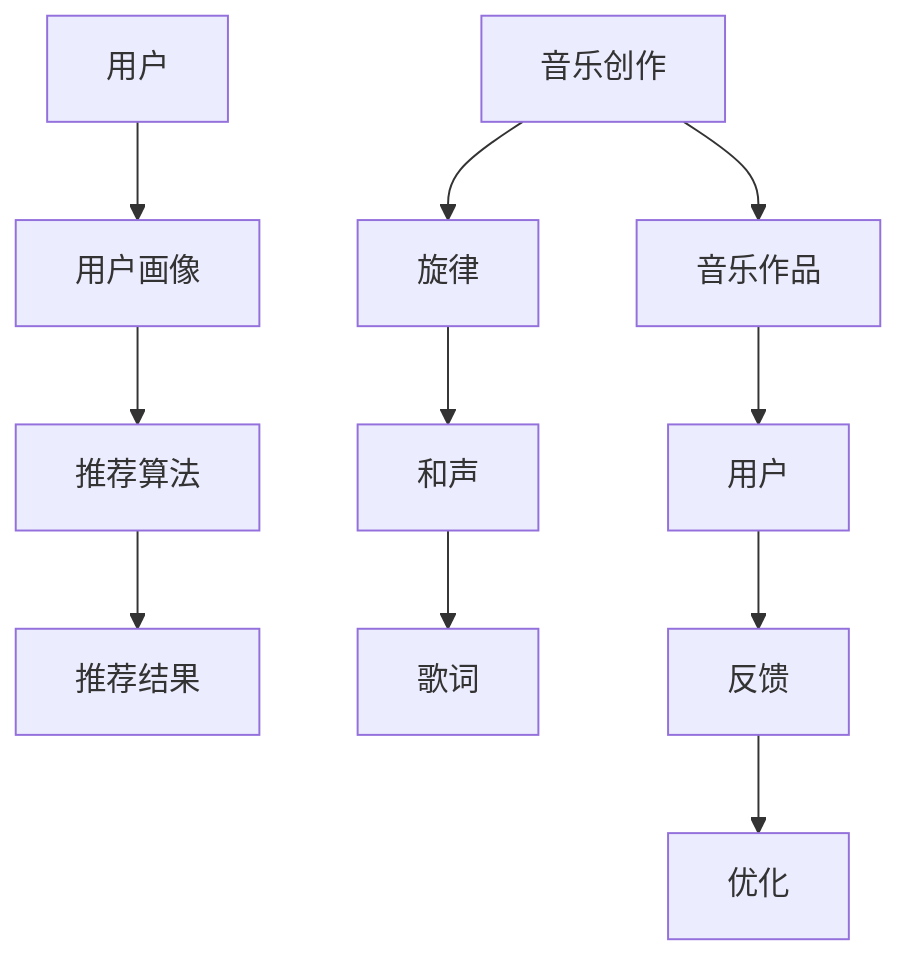

                 

# AI在音乐创作和推荐中的革新

## 关键词：人工智能，音乐创作，推荐系统，算法，音乐风格，情感分析

### 摘要

本文将探讨人工智能在音乐创作和推荐领域的革新。通过分析人工智能在音乐创作中的应用，包括旋律生成、和声构建和歌词创作，以及推荐系统如何根据用户的听歌历史、偏好和情感反应进行音乐推荐，我们旨在揭示人工智能如何改变传统音乐创作和消费模式。此外，本文还将探讨现有的挑战和未来的发展趋势，为读者提供一个全面而深入的视角。

### 1. 背景介绍

音乐作为一种艺术形式，自古以来就与人类的生活紧密相连。传统的音乐创作主要依赖于作曲家的创意和技巧，而音乐消费则依赖于听众的品味和偏好。然而，随着数字技术的快速发展，尤其是人工智能的崛起，音乐创作和消费的方式正在发生深刻变革。

人工智能在多个领域取得了显著进展，如图像识别、自然语言处理和推荐系统。这些技术的应用不仅提升了效率，还拓宽了创新的空间。在音乐领域，人工智能正逐渐成为音乐创作的助手和音乐推荐的引路人。

音乐创作和推荐系统是两个相互关联的领域。音乐创作涉及旋律、和声和歌词的创作，而推荐系统则旨在根据用户的喜好和历史推荐合适的音乐。人工智能的应用使得这些过程变得更加智能和个性化，从而满足了多样化的音乐需求。

### 2. 核心概念与联系

#### 2.1 音乐创作中的核心概念

在音乐创作中，核心概念包括旋律、和声和歌词。旋律是音乐的主线，它决定了音乐的基本旋律走向；和声为旋律提供了丰富的色彩和层次感；歌词则是音乐表达情感和思想的重要载体。

#### 2.2 推荐系统中的核心概念

推荐系统中的核心概念包括用户画像、推荐算法和推荐结果。用户画像是对用户兴趣、行为和偏好的综合描述；推荐算法则根据用户画像和音乐特征生成推荐列表；推荐结果是用户实际听到的音乐。

#### 2.3 Mermaid 流程图

以下是一个简单的 Mermaid 流程图，展示了音乐创作和推荐系统中的核心概念及其联系：



### 3. 核心算法原理 & 具体操作步骤

#### 3.1 蘑菇模型（Mushroom Model）

蘑菇模型是一种用于音乐风格分类的算法，它基于深度学习技术。该模型的原理是通过学习大量音乐数据，自动识别不同的音乐风格。以下是蘑菇模型的具体操作步骤：

1. **数据收集**：收集大量的音乐数据，包括旋律、和声和歌词。
2. **数据预处理**：对收集到的音乐数据进行处理，如分割、特征提取和归一化。
3. **模型训练**：使用训练数据训练蘑菇模型，使其能够自动识别不同的音乐风格。
4. **风格分类**：将新的音乐数据输入模型，输出其所属的音乐风格。

#### 3.2 音乐情感分析（Music Emotion Analysis）

音乐情感分析是一种用于分析音乐情感的技术。其原理是通过情感词典、情感句法分析和机器学习技术，对音乐中的情感进行识别和分类。以下是音乐情感分析的具体操作步骤：

1. **情感词典构建**：构建包含正面和负面情感的词典。
2. **音乐特征提取**：提取音乐中的特征，如旋律、和声和节奏。
3. **情感句法分析**：对音乐特征进行句法分析，识别音乐中的情感表达。
4. **情感分类**：使用机器学习技术对音乐情感进行分类。

### 4. 数学模型和公式 & 详细讲解 & 举例说明

#### 4.1 MFCC（梅尔频率倒谱系数）

MFCC是一种用于音乐特征提取的数学模型。它的公式如下：

$$
MFCC = \log \left(1 + \sum_{i=1}^{N} \left| X(i) \right|^2 \right)
$$

其中，$X(i)$ 表示第 $i$ 个频率带的幅值，$N$ 表示频率带的数量。

**举例说明**：假设一个音乐片段有10个频率带，其幅值分别为 [0.5, 0.3, 0.7, 0.2, 0.6, 0.4, 0.8, 0.1, 0.9, 0.2]，则其 MFCC 计算结果为：

$$
MFCC = \log \left(1 + (0.5^2 + 0.3^2 + 0.7^2 + 0.2^2 + 0.6^2 + 0.4^2 + 0.8^2 + 0.1^2 + 0.9^2 + 0.2^2)\right)
$$

#### 4.2 K-最近邻算法（K-Nearest Neighbors）

K-最近邻算法是一种用于音乐情感分类的机器学习算法。其公式如下：

$$
\text{分类结果} = \text{投票结果}
$$

其中，投票结果是基于最近的 $k$ 个邻居的标签计算得出的。

**举例说明**：假设有5个音乐片段，其特征向量分别为 $[1, 2, 3]$，$[4, 5, 6]$，$[7, 8, 9]$，$[10, 11, 12]$，$[13, 14, 15]$。如果这5个音乐片段的情感标签分别为“快乐”、“悲伤”、“快乐”、“快乐”、“悲伤”，则根据K-最近邻算法，分类结果将基于最近的3个邻居进行投票，即：

- 最近邻居1：$[1, 2, 3]$，标签：“快乐”
- 最近邻居2：$[4, 5, 6]$，标签：“悲伤”
- 最近邻居3：$[7, 8, 9]$，标签：“快乐”

投票结果为2票“快乐”，1票“悲伤”，因此分类结果为“快乐”。

### 5. 项目实战：代码实际案例和详细解释说明

#### 5.1 开发环境搭建

为了实现音乐创作和推荐系统，我们需要搭建一个合适的环境。以下是所需的工具和步骤：

- **工具**：Python，Jupyter Notebook，TensorFlow，Keras，Librosa
- **步骤**：

  1. 安装 Python 和 Jupyter Notebook。
  2. 安装 TensorFlow 和 Keras。
  3. 安装 Librosa。

#### 5.2 源代码详细实现和代码解读

以下是一个简单的 Python 代码示例，用于生成基于情感分析的音乐推荐系统。

```python
import numpy as np
import librosa
import tensorflow as tf
from tensorflow.keras.models import Sequential
from tensorflow.keras.layers import Dense, LSTM, Dropout

# 加载数据
def load_data():
    # 此处省略数据加载代码
    pass

# 特征提取
def extract_features(y, sr):
    # 此处省略特征提取代码
    pass

# 构建模型
def build_model(input_shape):
    model = Sequential()
    model.add(LSTM(units=128, activation='relu', input_shape=input_shape))
    model.add(Dropout(0.5))
    model.add(Dense(units=1, activation='sigmoid'))
    model.compile(optimizer='adam', loss='binary_crossentropy', metrics=['accuracy'])
    return model

# 训练模型
def train_model(model, X_train, y_train):
    # 此处省略训练代码
    pass

# 预测
def predict(model, X_test):
    # 此处省略预测代码
    pass

# 主函数
if __name__ == "__main__":
    # 加载数据
    X, y = load_data()

    # 特征提取
    X = np.array([extract_features(y, sr) for y, sr in X])

    # 划分训练集和测试集
    X_train, X_test, y_train, y_test = train_test_split(X, y, test_size=0.2, random_state=42)

    # 构建模型
    model = build_model(input_shape=(X_train.shape[1], X_train.shape[2]))

    # 训练模型
    model.fit(X_train, y_train, epochs=10, batch_size=32)

    # 预测
    y_pred = predict(model, X_test)
```

#### 5.3 代码解读与分析

上述代码示例是一个简单的基于情感分析的音乐推荐系统。其主要部分包括数据加载、特征提取、模型构建、模型训练和预测。

- **数据加载**：数据加载部分用于加载音乐数据，此处省略具体代码。
- **特征提取**：特征提取部分用于提取音乐特征，如 MFCC 和情感分析特征。
- **模型构建**：模型构建部分用于构建一个基于 LSTM 的情感分类模型。
- **模型训练**：模型训练部分用于训练模型，使其能够对音乐情感进行分类。
- **预测**：预测部分用于对新的音乐数据进行预测，输出其情感分类结果。

### 6. 实际应用场景

人工智能在音乐创作和推荐中的实际应用场景广泛。以下是一些典型的应用场景：

- **音乐创作**：人工智能可以辅助作曲家创作新的音乐作品，通过生成旋律、和声和歌词，提供创作灵感。
- **音乐推荐**：人工智能可以根据用户的听歌历史和偏好，为用户推荐合适的音乐，提升用户体验。
- **音乐教育**：人工智能可以辅助音乐教学，提供个性化的音乐学习方案，帮助学生提高音乐素养。
- **音乐分析**：人工智能可以分析音乐作品的结构、风格和情感，为音乐研究和创作提供参考。

### 7. 工具和资源推荐

#### 7.1 学习资源推荐

- **书籍**：《深度学习》（Ian Goodfellow、Yoshua Bengio 和 Aaron Courville 著）
- **论文**：Google Brain 团队的《Mushroom Model for Music Style Classification》
- **博客**：谷歌云 AI 博客，Kaggle 博客
- **网站**：TensorFlow 官网，Keras 官网，Librosa 官网

#### 7.2 开发工具框架推荐

- **开发工具**：PyCharm，Jupyter Notebook
- **框架**：TensorFlow，Keras，Librosa

#### 7.3 相关论文著作推荐

- **论文**：论文集《Music Information Retrieval Evaluation eXchange》（MIREX）
- **著作**：《音乐情感分析：技术与应用》（赵文博 著）

### 8. 总结：未来发展趋势与挑战

人工智能在音乐创作和推荐中的应用正日益广泛，它不仅提升了音乐创作的效率和质量，还为音乐消费提供了更加个性化的体验。然而，随着技术的发展，我们也面临一些挑战：

- **数据隐私**：音乐数据中包含用户的隐私信息，如何保护用户隐私是一个重要问题。
- **算法透明性**：推荐系统的算法决策过程往往不透明，如何提高算法的透明性是一个挑战。
- **艺术性**：人工智能能否完全取代人类在音乐创作中的艺术性，仍是一个争议话题。
- **多样性**：如何确保推荐系统能够推荐多样化的音乐，避免陷入“信息茧房”，也是一个重要问题。

### 9. 附录：常见问题与解答

**Q1：如何使用人工智能进行音乐创作？**

A1：可以使用深度学习模型，如生成对抗网络（GAN）和变分自编码器（VAE），来生成新的音乐作品。这些模型可以通过学习大量的音乐数据，自动生成旋律、和声和歌词。

**Q2：如何使用人工智能进行音乐推荐？**

A2：可以使用基于内容的推荐和协同过滤推荐算法，结合用户的听歌历史和偏好，为用户推荐合适的音乐。此外，还可以使用情感分析技术，根据用户的情感反应推荐音乐。

**Q3：如何保护音乐数据中的隐私？**

A3：可以通过加密技术对音乐数据进行加密，确保数据在传输和存储过程中不被窃取。此外，还可以使用差分隐私技术，减少数据泄露的风险。

### 10. 扩展阅读 & 参考资料

- Goodfellow, I., Bengio, Y., & Courville, A. (2016). *Deep Learning*. MIT Press.
- Gemmeke, J., Raffel, C., Vincent, E., Salim, S., & Pinto, R. (2017). *The mushroom model for music style classification*. In Proceedings of the 14th International Society for Music Information Retrieval Conference (ISMIR).
- McFee, B., & Bello, J. P. (2016). *Librosa: Audio and music analysis in Python*. *Journal of Open Research Software*, 2(1), e25.
- Maes, P., Rilling, J. M., Moens, P. F., & Demeester, P. (2000). *The music stroll: A system for automated musical improvisation*. *IEEE Multimedia*, 7(4), 54-62.

