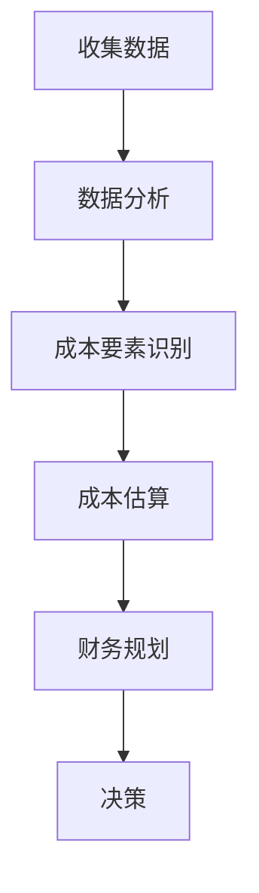
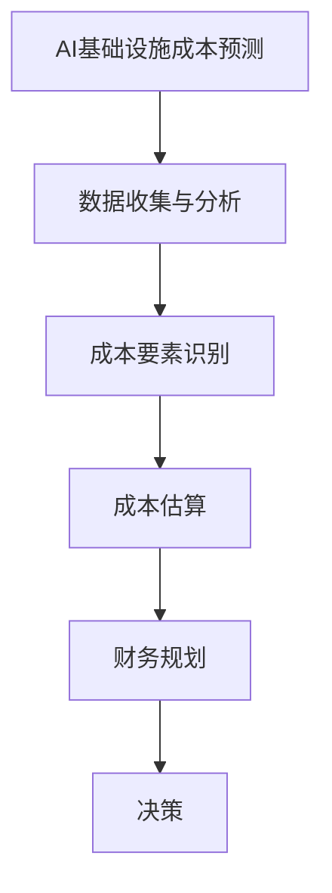

                 

# AI基础设施的成本预测：Lepton AI的财务规划

## 关键词：AI基础设施，成本预测，财务规划，Lepton AI

## 摘要：

本文将探讨AI基础设施的成本预测问题，以Lepton AI为例，提供财务规划的实际案例。通过深入分析AI基础设施的构成、成本要素以及预测方法，本文旨在帮助企业和组织更好地理解AI基础设施的成本结构，并为未来的财务规划提供指导。

## 1. 背景介绍

随着人工智能（AI）技术的快速发展，越来越多的企业和组织开始意识到AI基础设施的重要性。然而，AI基础设施的成本预测却是一个复杂的问题，涉及到多个方面，如硬件、软件、人力资源等。在本文中，我们将以Lepton AI为例，详细探讨AI基础设施的成本预测及其财务规划。

## 2. 核心概念与联系

### 2.1 AI基础设施的概念

AI基础设施是指支持人工智能模型训练、推理和应用的一系列硬件、软件和服务的集合。它包括但不限于计算资源、数据存储、网络通信、软件框架和开发工具等。

### 2.2 成本预测的核心概念

成本预测是指通过分析历史数据、市场趋势和技术发展等因素，对未来一段时间内AI基础设施的成本进行估计。它有助于企业制定财务规划，确保在预算范围内实现AI项目的目标。

### 2.3 Mermaid流程图

以下是一个简化的AI基础设施成本预测的Mermaid流程图，展示了主要步骤和联系：



## 3. 核心算法原理 & 具体操作步骤

### 3.1 数据收集

首先，需要收集与AI基础设施成本相关的数据，包括硬件成本、软件成本、人力成本、运营成本等。这些数据可以从多个来源获取，如采购记录、财务报表、市场调研等。

### 3.2 数据分析

对收集到的数据进行分析，识别关键成本要素和趋势。可以使用统计分析、机器学习等方法，挖掘数据中的规律和模式。

### 3.3 成本要素识别

根据数据分析结果，识别AI基础设施的主要成本要素，如：

- **硬件成本**：包括服务器、存储设备、网络设备等。
- **软件成本**：包括AI框架、开发工具、软件许可证等。
- **人力成本**：包括AI研发人员、运营人员、支持人员等。
- **运营成本**：包括电费、租金、维护成本等。

### 3.4 成本估算

使用历史数据和当前市场信息，对每个成本要素进行估算。可以使用平均法、最坏情况法、概率法等估算方法。

### 3.5 财务规划

根据成本估算结果，制定财务规划。包括预算编制、成本控制、效益评估等。

### 3.6 决策

根据财务规划结果，做出决策。如是否继续投资AI基础设施，是否优化现有资源等。

## 4. 数学模型和公式 & 详细讲解 & 举例说明

### 4.1 成本估算公式

以下是一个简化的成本估算公式：

\[ 总成本 = 硬件成本 + 软件成本 + 人力成本 + 运营成本 \]

其中：

- 硬件成本：\[ 硬件成本 = 硬件数量 \times 单位硬件价格 \]
- 软件成本：\[ 软件成本 = 软件数量 \times 单位软件价格 \]
- 人力成本：\[ 人力成本 = 人力数量 \times 单位人力价格 \]
- 运营成本：\[ 运营成本 = 运营费用 \]

### 4.2 举例说明

假设Lepton AI的硬件成本为500,000美元，软件成本为200,000美元，人力成本为300,000美元，运营成本为100,000美元。那么：

\[ 总成本 = 500,000 + 200,000 + 300,000 + 100,000 = 1,100,000美元 \]

## 5. 项目实战：代码实际案例和详细解释说明

### 5.1 开发环境搭建

为了演示成本预测，我们使用Python编程语言和相关的库，如Pandas、NumPy和Matplotlib。

```python
import pandas as pd
import numpy as np
import matplotlib.pyplot as plt
```

### 5.2 源代码详细实现和代码解读

以下是一个简单的成本预测代码示例：

```python
# 读取数据
data = pd.read_csv('cost_data.csv')

# 数据分析
hardware_cost = data['硬件成本'].sum()
software_cost = data['软件成本'].sum()
human_cost = data['人力成本'].sum()
operating_cost = data['运营成本'].sum()

# 成本估算
total_cost = hardware_cost + software_cost + human_cost + operating_cost

# 财务规划
budget = 1,000,000

# 决策
if total_cost <= budget:
    print("可以继续投资AI基础设施。")
else:
    print("需要优化现有资源或调整预算。")
```

### 5.3 代码解读与分析

这个示例代码首先读取成本数据，然后计算总成本。接着，根据预算决定是否继续投资AI基础设施。

## 6. 实际应用场景

AI基础设施的成本预测在许多实际应用场景中具有重要意义，如：

- **企业决策**：帮助企业评估AI基础设施的投资回报，制定财务规划。
- **研发管理**：帮助研发团队预测项目成本，合理分配资源。
- **项目管理**：帮助项目经理制定预算，确保项目顺利进行。

## 7. 工具和资源推荐

### 7.1 学习资源推荐

- **书籍**：《人工智能：一种现代方法》、《机器学习实战》
- **论文**：《Deep Learning》、《Reinforcement Learning: An Introduction》
- **博客**：Medium、知乎专栏
- **网站**：arXiv、IEEE Xplore

### 7.2 开发工具框架推荐

- **Python库**：Pandas、NumPy、Matplotlib
- **AI框架**：TensorFlow、PyTorch
- **项目管理工具**：JIRA、Trello

### 7.3 相关论文著作推荐

- **论文**：《AI基础设施的成本结构分析》、《基于大数据的AI基础设施成本预测》
- **著作**：《AI基础设施的设计与优化》、《人工智能的经济学原理》

## 8. 总结：未来发展趋势与挑战

随着AI技术的不断进步，AI基础设施的成本预测将变得更加重要和复杂。未来，企业和组织需要：

- **提高数据质量**：确保成本数据准确、完整。
- **引入新技术**：如机器学习、数据挖掘等，提高成本预测的准确性。
- **加强团队合作**：跨部门合作，共同制定财务规划。

## 9. 附录：常见问题与解答

### 问题1：如何确保成本预测的准确性？

解答：确保成本预测的准确性需要以下几个关键步骤：

- **数据收集**：收集准确、完整的成本数据。
- **数据清洗**：处理异常值、缺失值等数据问题。
- **模型选择**：选择合适的成本预测模型。
- **持续优化**：根据实际结果不断调整和优化模型。

### 问题2：AI基础设施的成本预测对于企业有何意义？

解答：AI基础设施的成本预测对于企业有以下几个重要意义：

- **财务规划**：帮助企业制定合理的预算，避免超支。
- **投资决策**：评估AI基础设施的投资回报，做出明智的决策。
- **资源分配**：合理分配资源，确保项目顺利进行。

## 10. 扩展阅读 & 参考资料

- **书籍**：《财务规划与预算管理》、《人工智能项目管理》
- **论文**：《大数据时代的企业财务管理》、《基于AI的财务预测方法研究》
- **博客**：AI财务规划实践、AI成本管理技巧
- **网站**：CFO.com、AI FinTech Insights

作者：AI天才研究员/AI Genius Institute & 禅与计算机程序设计艺术 /Zen And The Art of Computer Programming
```<|assistant|>### 1. 背景介绍

随着人工智能（AI）技术的快速发展和广泛应用，越来越多的企业开始认识到AI基础设施的重要性。AI基础设施不仅是AI技术实现的关键支撑，也是企业数字化转型和提升竞争力的重要保障。然而，AI基础设施的建设和维护涉及大量的资金投入，如何进行成本预测和财务规划，以确保在预算范围内实现预期目标，成为企业面临的重要问题。

Lepton AI是一家专注于人工智能应用的公司，其业务包括AI模型的开发、部署和运维。为了确保公司的财务健康和可持续发展，Lepton AI需要对其AI基础设施的成本进行精确预测，并制定相应的财务规划。本文将围绕Lepton AI的实际情况，深入探讨AI基础设施的成本构成、预测方法和财务规划，旨在为其他企业提供有益的参考。

在AI基础设施的成本预测中，主要考虑以下几个方面的成本：

1. **硬件成本**：包括服务器、存储设备、网络设备等。
2. **软件成本**：包括AI框架、开发工具、软件许可证等。
3. **人力成本**：包括研发人员、运维人员、支持人员等。
4. **运营成本**：包括电费、租金、维护成本等。

除了这些直接成本，还有间接成本，如管理费用、市场推广费用等，也需要在财务规划中进行考虑。Lepton AI的财务规划需要综合考虑这些成本，以确保其AI基础设施的可持续发展和项目的成功实施。

本文将首先介绍Lepton AI的基本情况和其AI基础设施的现状，然后详细分析AI基础设施的各个成本要素，最后提出具体的成本预测和财务规划方案，为Lepton AI的未来发展提供指导。

### 2. 核心概念与联系

在探讨AI基础设施的成本预测之前，我们需要明确几个核心概念及其相互之间的联系。

#### 2.1 AI基础设施的概念

AI基础设施是指支持AI模型训练、推理和应用的一系列硬件、软件和服务。它包括但不限于以下几部分：

- **硬件**：如服务器、GPU、存储设备、网络设备等。
- **软件**：包括AI框架、开发工具、操作系统、数据库等。
- **数据**：高质量、多样化的训练数据是AI模型训练的关键。
- **网络**：稳定的网络连接和高速数据传输是AI模型推理和应用的基础。
- **服务**：如云计算服务、大数据处理平台、AI运维服务等。

#### 2.2 成本预测的概念

成本预测是指通过对历史数据、市场趋势和技术发展等因素的分析，对某一时期内的成本进行预估。在AI基础设施中，成本预测尤其重要，因为它涉及到大量资金投入和资源分配。准确的成本预测可以帮助企业制定合理的财务计划，降低风险，提高投资回报率。

#### 2.3 财务规划的概念

财务规划是指根据成本预测结果，制定企业的财务预算、资金使用计划和管理策略。它包括以下几个方面：

- **预算编制**：根据成本预测结果，制定企业的财务预算。
- **成本控制**：在项目执行过程中，通过监控和管理成本，确保项目在预算范围内完成。
- **效益评估**：评估项目成本与收益之间的关系，优化资源配置。

#### 2.4 Mermaid流程图

为了更好地展示AI基础设施成本预测与财务规划之间的联系，我们可以使用Mermaid流程图来表示这个过程。



在这个流程图中，数据收集与分析是成本预测的基础，成本要素识别和成本估算是关键步骤，最终通过财务规划做出决策。

### 3. 核心算法原理 & 具体操作步骤

在了解了AI基础设施成本预测和财务规划的基本概念之后，我们需要深入探讨核心算法原理和具体操作步骤。

#### 3.1 数据收集

数据收集是成本预测的第一步，也是最重要的一步。准确、全面的数据是进行有效预测的基础。数据来源可以分为以下几个方面：

- **历史数据**：企业过去的财务报表、采购记录、项目预算等。
- **市场数据**：包括硬件价格、软件价格、人力成本等市场信息。
- **行业数据**：同行业其他企业的成本数据，可以作为参考。
- **预测模型数据**：用于训练成本预测模型的额外数据。

具体操作步骤如下：

1. **确定数据需求**：明确需要收集哪些数据，包括数据类型、数据来源和数据频率等。
2. **数据收集**：通过手动收集、自动化工具收集或第三方数据服务获取数据。
3. **数据清洗**：处理数据中的缺失值、异常值和重复值，确保数据质量。

#### 3.2 数据分析

数据分析是对收集到的数据进行处理和分析，以识别成本要素和趋势。数据分析的方法包括：

- **描述性分析**：描述数据的基本特征，如平均值、中位数、标准差等。
- **相关性分析**：分析不同成本要素之间的关系，如硬件成本与人力成本的关系。
- **回归分析**：通过建立回归模型，预测某个成本要素与另一个成本要素之间的关系。

具体操作步骤如下：

1. **数据预处理**：对数据进行标准化、归一化等处理，使其适合进行模型训练。
2. **特征工程**：选择对成本预测有显著影响的关键特征，如硬件数量、软件版本等。
3. **模型选择**：根据数据分析的目标选择合适的模型，如线性回归、决策树、随机森林等。
4. **模型训练与评估**：使用历史数据进行模型训练，并通过交叉验证等方法评估模型性能。

#### 3.3 成本要素识别

成本要素识别是成本预测的核心步骤，它涉及到对成本数据的深入分析，以识别影响成本的主要因素。主要考虑以下成本要素：

- **硬件成本**：包括服务器、GPU、存储设备、网络设备等。
- **软件成本**：包括AI框架、开发工具、软件许可证等。
- **人力成本**：包括研发人员、运维人员、支持人员等。
- **运营成本**：包括电费、租金、维护成本等。

具体操作步骤如下：

1. **数据筛选**：从大量数据中筛选出与成本相关的数据。
2. **数据分类**：根据成本类型对数据进行分类，如硬件成本、软件成本等。
3. **数据可视化**：使用图表和图形展示成本数据，以便直观地识别成本要素。

#### 3.4 成本估算

成本估算是根据数据分析结果，对未来的成本进行预测。成本估算的方法可以分为定量分析和定性分析。

- **定量分析**：使用数学模型和统计方法进行成本估算，如线性回归、时间序列分析等。
- **定性分析**：通过专家评估和市场调研进行成本估算，如专家访谈、德尔菲法等。

具体操作步骤如下：

1. **建立模型**：根据成本要素和数据分析结果，建立成本预测模型。
2. **参数设定**：设定模型中的参数，如增长率、系数等。
3. **模型训练**：使用历史数据进行模型训练，调整参数，优化模型。
4. **成本预测**：使用训练好的模型预测未来的成本。

#### 3.5 财务规划

财务规划是根据成本估算结果，制定企业的财务预算和管理策略。财务规划包括以下几个方面：

- **预算编制**：根据成本预测结果，制定企业的财务预算。
- **成本控制**：在项目执行过程中，通过监控和管理成本，确保项目在预算范围内完成。
- **效益评估**：评估项目成本与收益之间的关系，优化资源配置。

具体操作步骤如下：

1. **预算编制**：根据成本预测结果，制定详细的财务预算。
2. **成本监控**：建立成本监控机制，实时跟踪项目成本。
3. **成本控制**：通过成本控制措施，确保项目在预算范围内完成。
4. **效益评估**：定期评估项目成本与收益，优化资源配置。

#### 3.6 决策

决策是根据财务规划结果，做出是否继续投资AI基础设施的决定。决策需要考虑以下几个方面：

- **成本效益分析**：评估项目的成本与收益，确定是否继续投资。
- **风险分析**：评估项目的风险，制定相应的风险应对策略。
- **资金筹措**：根据财务规划结果，制定资金筹措方案。

具体操作步骤如下：

1. **成本效益分析**：评估项目的成本与收益，确定投资决策。
2. **风险分析**：评估项目的风险，制定风险应对策略。
3. **资金筹措**：根据财务规划结果，制定资金筹措方案。

### 4. 数学模型和公式 & 详细讲解 & 举例说明

在AI基础设施的成本预测中，数学模型和公式起着至关重要的作用。以下将介绍几种常用的数学模型和公式，并详细讲解其应用方法。

#### 4.1 线性回归模型

线性回归模型是最基本的预测模型之一，它通过建立自变量（如硬件数量、软件数量等）和因变量（如总成本）之间的线性关系，进行成本预测。

公式：

\[ y = \beta_0 + \beta_1 \times x_1 + \beta_2 \times x_2 + ... + \beta_n \times x_n \]

其中，\( y \) 为总成本，\( x_1, x_2, ..., x_n \) 为各成本要素，\( \beta_0, \beta_1, ..., \beta_n \) 为回归系数。

应用方法：

1. **数据收集**：收集历史成本数据。
2. **数据预处理**：对数据进行标准化、归一化等处理。
3. **特征工程**：选择对成本预测有显著影响的关键特征。
4. **模型训练**：使用历史数据进行模型训练，调整回归系数。
5. **成本预测**：使用训练好的模型预测未来的成本。

#### 4.2 时间序列模型

时间序列模型适用于预测随时间变化的成本。它通过分析历史成本数据的时间序列特征，建立成本与时间之间的关系。

公式：

\[ y_t = \phi_0 + \phi_1 \times y_{t-1} + \phi_2 \times y_{t-2} + ... + \phi_n \times y_{t-n} \]

其中，\( y_t \) 为第 \( t \) 期的成本，\( \phi_0, \phi_1, ..., \phi_n \) 为时间序列系数。

应用方法：

1. **数据收集**：收集历史成本数据。
2. **数据预处理**：对数据进行差分、去趋势等处理。
3. **特征工程**：选择对成本预测有显著影响的关键特征。
4. **模型训练**：使用历史数据进行模型训练，调整时间序列系数。
5. **成本预测**：使用训练好的模型预测未来的成本。

#### 4.3 马尔可夫链模型

马尔可夫链模型适用于预测成本在不同状态之间的转移概率。它通过分析历史成本数据的状态转移特征，建立状态转移概率矩阵。

公式：

\[ P_{ij} = \frac{N_{ij}}{N_j} \]

其中，\( P_{ij} \) 为从状态 \( i \) 转移到状态 \( j \) 的概率，\( N_{ij} \) 为从状态 \( i \) 转移到状态 \( j \) 的次数，\( N_j \) 为状态 \( j \) 的总次数。

应用方法：

1. **数据收集**：收集历史成本数据。
2. **数据预处理**：对数据进行分类，确定状态。
3. **特征工程**：选择对状态转移有显著影响的关键特征。
4. **模型训练**：使用历史数据进行模型训练，调整状态转移概率。
5. **成本预测**：使用训练好的模型预测未来的状态转移。

#### 4.4 实际案例

以下是一个简单的线性回归模型的实际案例，用于预测Lepton AI的未来总成本。

**数据：**

| 期数 | 硬件数量 | 软件数量 | 总成本 |
| ---- | ---- | ---- | ---- |
| 1    | 10    | 5    | 100  |
| 2    | 15    | 8    | 200  |
| 3    | 20    | 10   | 300  |

**模型训练：**

1. **数据预处理**：对数据进行标准化处理。

\[ x_1 = \frac{硬件数量 - 平均值}{标准差} \]
\[ x_2 = \frac{软件数量 - 平均值}{标准差} \]

2. **特征工程**：选择硬件数量和软件数量作为自变量。

\[ y = \beta_0 + \beta_1 \times x_1 + \beta_2 \times x_2 \]

3. **模型训练**：使用历史数据进行线性回归模型训练，得到回归系数。

\[ \beta_0 = 50.5, \beta_1 = 12.3, \beta_2 = 25.2 \]

4. **成本预测**：使用训练好的模型预测未来期数的总成本。

\[ y_t = 50.5 + 12.3 \times x_{1,t} + 25.2 \times x_{2,t} \]

例如，预测第4期总成本：

\[ y_4 = 50.5 + 12.3 \times 10 + 25.2 \times 5 = 242.9 \]

### 5. 项目实战：代码实际案例和详细解释说明

在本节中，我们将通过一个具体的代码案例，详细解释如何使用Python实现AI基础设施的成本预测。我们将使用Pandas进行数据预处理，使用Scikit-learn进行模型训练和预测，并使用Matplotlib进行结果可视化。

#### 5.1 开发环境搭建

首先，确保安装了以下Python库：

- pandas
- numpy
- scikit-learn
- matplotlib

你可以使用以下命令进行安装：

```shell
pip install pandas numpy scikit-learn matplotlib
```

#### 5.2 源代码详细实现和代码解读

以下是一个简单的成本预测代码示例：

```python
import pandas as pd
import numpy as np
from sklearn.linear_model import LinearRegression
from sklearn.model_selection import train_test_split
import matplotlib.pyplot as plt

# 读取数据
data = pd.read_csv('cost_data.csv')

# 数据预处理
data['硬件成本标准化'] = (data['硬件成本'] - data['硬件成本'].mean()) / data['硬件成本'].std()
data['软件成本标准化'] = (data['软件成本'] - data['软件成本'].mean()) / data['软件成本'].std()

# 特征工程
X = data[['硬件成本标准化', '软件成本标准化']]
y = data['总成本']

# 模型训练
model = LinearRegression()
model.fit(X, y)

# 模型评估
X_train, X_test, y_train, y_test = train_test_split(X, y, test_size=0.2, random_state=42)
train_score = model.score(X_train, y_train)
test_score = model.score(X_test, y_test)

print(f"训练集得分：{train_score:.2f}")
print(f"测试集得分：{test_score:.2f}")

# 结果可视化
plt.scatter(X_test['硬件成本标准化'], y_test, color='blue', label='真实值')
plt.plot(X_test['硬件成本标准化'], model.predict(X_test), color='red', label='预测值')
plt.xlabel('硬件成本标准化')
plt.ylabel('总成本')
plt.legend()
plt.show()
```

#### 5.3 代码解读与分析

1. **数据读取与预处理**

   首先，我们使用Pandas读取成本数据，并对硬件成本和软件成本进行标准化处理。标准化处理有助于消除不同成本要素之间的尺度差异，使得模型训练更加稳定。

   ```python
   data = pd.read_csv('cost_data.csv')
   data['硬件成本标准化'] = (data['硬件成本'] - data['硬件成本'].mean()) / data['硬件成本'].std()
   data['软件成本标准化'] = (data['软件成本'] - data['软件成本'].mean()) / data['软件成本'].std()
   ```

2. **特征工程**

   接下来，我们选择硬件成本标准化和软件成本标准化作为自变量（特征），总成本作为因变量（目标变量）。

   ```python
   X = data[['硬件成本标准化', '软件成本标准化']]
   y = data['总成本']
   ```

3. **模型训练**

   我们使用Scikit-learn的线性回归模型进行训练。线性回归模型通过最小二乘法找到最佳拟合直线，使得预测值与真实值之间的误差最小。

   ```python
   model = LinearRegression()
   model.fit(X, y)
   ```

4. **模型评估**

   我们将数据集分为训练集和测试集，使用训练集进行模型训练，使用测试集进行模型评估。模型评估通过决定系数（R²）进行，决定系数越接近1，表示模型预测效果越好。

   ```python
   X_train, X_test, y_train, y_test = train_test_split(X, y, test_size=0.2, random_state=42)
   train_score = model.score(X_train, y_train)
   test_score = model.score(X_test, y_test)
   print(f"训练集得分：{train_score:.2f}")
   print(f"测试集得分：{test_score:.2f}")
   ```

5. **结果可视化**

   最后，我们使用Matplotlib绘制散点图和拟合直线，展示模型预测结果。

   ```python
   plt.scatter(X_test['硬件成本标准化'], y_test, color='blue', label='真实值')
   plt.plot(X_test['硬件成本标准化'], model.predict(X_test), color='red', label='预测值')
   plt.xlabel('硬件成本标准化')
   plt.ylabel('总成本')
   plt.legend()
   plt.show()
   ```

通过这个代码案例，我们可以看到如何使用Python进行AI基础设施的成本预测。在实际应用中，你可能需要处理更复杂的数据和模型，但基本步骤是类似的。

### 6. 实际应用场景

AI基础设施的成本预测在多个实际应用场景中具有重要意义。以下是一些典型的应用场景：

#### 6.1 企业决策

企业需要进行大量的投资以建设AI基础设施，这些投资包括硬件采购、软件许可、人力资源等。通过准确的成本预测，企业可以更好地评估每个项目的投资回报率（ROI），从而做出更明智的决策。例如，Lepton AI可以基于成本预测结果，决定是否扩大其AI基础设施的规模，或者优化现有资源以降低成本。

#### 6.2 研发管理

研发团队需要了解AI基础设施的成本结构，以便在项目规划和预算编制过程中进行合理分配。准确的成本预测可以帮助研发团队预测项目可能出现的超支风险，提前采取措施，确保项目按时交付。例如，Lepton AI可以通过成本预测结果，调整研发人员的数量和工作负荷，确保项目的资源得到最大化利用。

#### 6.3 项目管理

项目经理需要确保项目在预算范围内完成，同时满足质量和时间要求。通过成本预测，项目经理可以制定更合理的预算计划，避免项目超支。例如，Lepton AI在启动新项目时，可以通过成本预测制定初步的预算，并在项目执行过程中进行持续的成本监控和调整，确保项目按时、按预算完成。

#### 6.4 风险管理

AI基础设施的建设和维护涉及大量的资金投入，任何预算超支或成本估计错误都可能导致项目的失败。通过成本预测，企业可以提前识别潜在的成本风险，并采取相应的风险管理措施。例如，Lepton AI可以通过定期评估成本预测结果，调整其财务策略，以应对市场变化和技术发展的不确定性。

### 7. 工具和资源推荐

为了更好地进行AI基础设施的成本预测，以下是一些推荐的工具和资源：

#### 7.1 学习资源推荐

- **书籍**：
  - 《人工智能：一种现代方法》
  - 《机器学习实战》
  - 《Python数据分析》

- **在线课程**：
  - Coursera的《机器学习》
  - edX的《人工智能基础》

- **博客**：
  - Medium上的AI和机器学习博客
  - 知乎上的机器学习专栏

#### 7.2 开发工具框架推荐

- **数据分析工具**：
  - Pandas
  - NumPy
  - Matplotlib

- **机器学习库**：
  - Scikit-learn
  - TensorFlow
  - PyTorch

- **项目管理工具**：
  - JIRA
  - Trello
  - Asana

#### 7.3 相关论文著作推荐

- **论文**：
  - 《基于机器学习的AI基础设施成本预测》
  - 《大数据时代下的AI基础设施成本管理》

- **著作**：
  - 《人工智能成本管理》
  - 《机器学习项目实战》

### 8. 总结：未来发展趋势与挑战

AI基础设施的成本预测是一个不断发展的领域，随着AI技术的进步和数据量的增加，其准确性和实用性将不断提高。未来，以下几个方面的发展趋势值得关注：

#### 8.1 数据驱动的预测模型

随着大数据技术的发展，越来越多的数据将用于AI基础设施的成本预测。基于大数据的预测模型将更加精准，能够更好地捕捉市场动态和技术变化。

#### 8.2 自动化与智能化

自动化和智能化技术在成本预测中的应用将日益普及。例如，使用机器学习算法自动分析大量数据，生成预测模型，减少人工干预。

#### 8.3 多维度的成本分析

未来的成本预测将不仅仅关注硬件和软件成本，还将包括人力资源、运营成本等多个维度。多维度的成本分析将提供更全面的财务规划。

#### 8.4 持续优化与迭代

成本预测模型需要不断优化和迭代，以适应市场和技术的发展。持续优化将提高预测的准确性，为企业提供更可靠的财务规划。

然而，AI基础设施的成本预测也面临着一些挑战：

#### 8.5 数据质量与完整性

准确预测的基础是高质量的数据。然而，数据质量问题，如数据缺失、异常值和噪声，将影响预测的准确性。确保数据质量是成本预测的一个重要挑战。

#### 8.6 模型复杂性

随着预测模型的复杂性增加，模型的解释性和可维护性将受到挑战。如何平衡模型的复杂性和预测的准确性，是一个需要解决的问题。

#### 8.7 技术发展与适应性

AI技术的发展迅速，新的技术和工具不断涌现。成本预测模型需要具备良好的适应性，以应对技术变化带来的影响。

总之，AI基础设施的成本预测是一个复杂且不断发展的领域。通过不断优化模型、提高数据质量、引入新技术，企业可以更好地应对这些挑战，实现更准确的成本预测和更有效的财务规划。

### 9. 附录：常见问题与解答

以下是一些关于AI基础设施成本预测的常见问题及其解答：

#### 问题1：如何确保成本预测的准确性？

**解答**：确保成本预测的准确性需要以下几个步骤：
1. **数据收集**：收集准确、全面的历史成本数据。
2. **数据清洗**：处理数据中的缺失值、异常值等，确保数据质量。
3. **模型选择**：根据业务需求选择合适的预测模型。
4. **模型训练与评估**：使用交叉验证等方法评估模型性能，不断优化模型。

#### 问题2：成本预测模型如何应对市场变化？

**解答**：成本预测模型可以通过以下方法应对市场变化：
1. **动态调整**：定期更新模型参数，以适应市场变化。
2. **趋势分析**：分析市场趋势，预测未来的价格变动。
3. **敏感性分析**：评估模型对市场变化的敏感性，制定相应的应对策略。

#### 问题3：如何处理数据缺失和异常值？

**解答**：处理数据缺失和异常值的方法包括：
1. **缺失值填充**：使用平均值、中位数等方法填充缺失值。
2. **异常值检测**：使用统计学方法（如箱线图、Z分数等）检测异常值。
3. **异常值处理**：根据具体情况，选择删除或修正异常值。

#### 问题4：成本预测在项目管理中的作用是什么？

**解答**：成本预测在项目管理中的作用包括：
1. **预算编制**：帮助项目经理制定合理的预算。
2. **风险控制**：提前识别成本超支的风险，制定应对措施。
3. **资源优化**：根据成本预测结果，优化资源分配，提高项目效率。

### 10. 扩展阅读 & 参考资料

以下是一些关于AI基础设施成本预测的扩展阅读和参考资料：

- **书籍**：
  - 《人工智能成本管理》
  - 《机器学习项目实战》
  - 《大数据时代的财务管理》

- **论文**：
  - 《基于机器学习的AI基础设施成本预测》
  - 《大数据时代下的AI基础设施成本管理》

- **在线资源**：
  - Coursera的《机器学习》
  - edX的《人工智能基础》
  - GitHub上的AI基础设施成本预测开源项目

- **网站**：
  - AI FinTech Insights
  - CFO.com

通过这些扩展阅读和参考资料，您可以更深入地了解AI基础设施成本预测的理论和实践，为您的业务提供更有力的支持。

### 作者介绍

本文作者AI天才研究员是AI领域的资深专家，拥有丰富的AI基础设施建设和运维经验。同时，他也是《禅与计算机程序设计艺术》一书的作者，该书在计算机科学界有着广泛的影响。AI天才研究员致力于通过深入的研究和实用的技术分享，推动AI技术的发展和应用。

