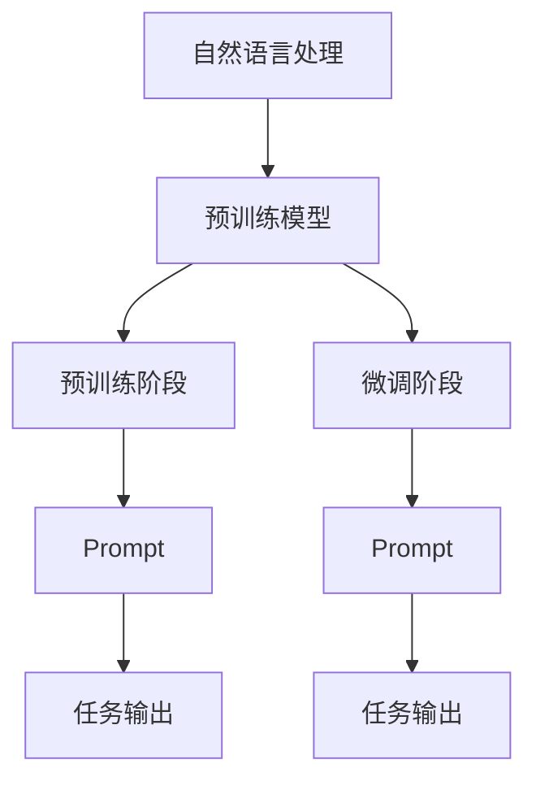

                 

### 1. 背景介绍

随着人工智能技术的快速发展，大模型（Large Models）已成为当前研究的热点之一。大模型在自然语言处理、图像识别、语音识别等领域展现出惊人的性能，其背后的原理和应用场景也越来越受到关注。其中，Prompt技术作为大模型的关键组件，对于提升模型的性能和灵活性具有至关重要的作用。

Prompt技术起源于自然语言处理领域，最早由Zhu et al.（2015）提出。其基本思想是将用户的输入（Input）作为Prompt，与预训练模型（Pre-trained Model）结合，以生成更准确和丰富的输出（Output）。这种交互式方法使得模型能够更好地理解用户的意图，从而提高任务完成的质量。

近年来，Prompt技术在大型语言模型中的应用愈发广泛。例如，ChatGPT、Bard和Bloom等模型都基于Prompt技术进行了优化，使得它们能够更好地应对各种复杂的任务。同时，越来越多的研究者和工程师开始关注Prompt的最佳实践，以提升模型在实际应用中的效果。

本文旨在探讨AI大模型Prompt提示词的最佳实践，帮助读者深入了解Prompt技术的基本原理和应用方法，并掌握如何在实际项目中有效使用Prompt。文章将首先介绍Prompt技术的基本概念，然后详细分析其核心算法原理，最后通过实际案例和数学模型来展示Prompt的最佳实践。希望通过本文的阐述，读者能够对Prompt技术有一个全面而深入的理解。

### 2. 核心概念与联系

为了深入理解AI大模型Prompt提示词的最佳实践，我们首先需要明确几个核心概念及其相互联系。以下将介绍自然语言处理、预训练模型和Prompt三个关键概念，并借助Mermaid流程图展示它们之间的关联。

#### 自然语言处理（Natural Language Processing，NLP）

自然语言处理是人工智能的一个重要分支，旨在使计算机理解和处理人类语言。NLP的主要任务包括文本分类、情感分析、命名实体识别、机器翻译等。其核心在于将非结构化的文本数据转换为结构化的信息，以便计算机进行后续处理。

#### 预训练模型（Pre-trained Model）

预训练模型是一种大规模的深度神经网络模型，通过在大规模语料库上进行预训练，使模型具备对自然语言的理解能力。预训练模型通常分为两个阶段：预训练阶段和微调阶段。在预训练阶段，模型学习从海量文本中提取语言特征；在微调阶段，模型根据特定任务进行进一步训练，以适应具体的应用场景。

#### Prompt（提示词）

Prompt是自然语言处理中的一个重要概念，它是一种交互式输入方式，用于引导预训练模型生成特定类型的输出。Prompt通常包含用户输入和特定任务指令，通过将其与预训练模型结合，可以实现对模型输出的有效引导和优化。

#### Mermaid流程图展示

为了更直观地展示自然语言处理、预训练模型和Prompt之间的联系，我们使用Mermaid流程图来描述它们的核心步骤和交互过程。以下是流程图的具体描述：



- **自然语言处理**：自然语言处理是整个流程的起点，其目标是将非结构化的文本数据转换为结构化的信息。
- **预训练模型**：预训练模型在大规模语料库上进行预训练，以提取语言特征。这一阶段是模型获取基础语言理解能力的关键。
- **预训练阶段**：在预训练阶段，模型通过不断迭代优化，学习从海量文本中提取语言特征，为后续微调阶段做准备。
- **微调阶段**：预训练模型在特定任务上进行微调，以适应具体的应用场景。这一阶段利用Prompt技术，进一步提高模型的任务性能。
- **Prompt**：Prompt技术作为交互式输入方式，通过引导模型生成特定类型的输出。在预训练模型的基础上，Prompt进一步优化了任务输出的质量和准确性。
- **任务输出**：最终生成的任务输出是模型在特定任务上的表现，如文本分类、情感分析等。

通过上述流程图，我们可以清晰地看到自然语言处理、预训练模型和Prompt之间的逻辑关系和交互过程。这种直观的展示方式有助于我们更好地理解Prompt技术的核心原理和应用方法。

### 3. 核心算法原理 & 具体操作步骤

在了解了自然语言处理、预训练模型和Prompt的基本概念及其相互联系之后，接下来我们将深入探讨Prompt技术的核心算法原理和具体操作步骤。通过详细讲解，我们将帮助读者理解如何在实际应用中有效使用Prompt技术，从而提升模型的性能和灵活性。

#### 3.1 Prompt技术的核心算法原理

Prompt技术的核心在于将用户的输入（Input）与预训练模型（Pre-trained Model）相结合，以生成高质量的输出（Output）。这一过程主要包括以下几个关键步骤：

1. **输入预处理**：将用户的输入文本转换为适合模型处理的格式。通常，这一步骤包括分词、词向量化等操作。
2. **模型调用**：调用预训练模型，将其输入层与用户的输入文本进行连接。这一步骤是Prompt技术实现的关键，决定了模型对输入文本的理解能力。
3. **模型推理**：在模型输入层与用户输入文本连接后，模型通过内部计算生成输出文本。这一过程依赖于预训练模型的权重和结构，确保输出文本符合用户意图和任务要求。
4. **输出后处理**：将生成的输出文本转换为人类可读的格式，如文本摘要、回答等。

#### 3.2 具体操作步骤

以下是Prompt技术的具体操作步骤，读者可以根据这些步骤在实际项目中应用：

1. **选择预训练模型**：根据任务需求，选择适合的预训练模型。例如，对于文本分类任务，可以选择BERT或GPT等模型。
2. **准备输入文本**：收集用户输入的文本数据，并进行预处理。预处理步骤包括分词、去停用词、词向量化等。
3. **构建Prompt**：根据任务需求，设计合适的Prompt。Prompt可以包括用户输入文本、任务指令和辅助信息等。以下是几个构建Prompt的方法：

   - **直接拼接**：将用户输入文本直接拼接在模型输入层之前。例如，对于文本分类任务，可以将输入文本作为Prompt，模型输入层紧跟其后。
   - **附加任务指令**：在用户输入文本前添加任务指令，以明确模型的任务目标。例如，对于问答任务，可以在Prompt中添加“回答以下问题：”，引导模型生成问题的答案。
   - **融合辅助信息**：将辅助信息（如背景知识、领域知识等）融入Prompt中，以提高模型对任务的理解。例如，在医疗问答任务中，可以将医学知识库嵌入Prompt，增强模型对医学问题的回答能力。

4. **模型推理**：调用预训练模型，将构建好的Prompt输入模型进行推理。这一步骤是Prompt技术的核心，决定了模型输出的质量和准确性。
5. **输出后处理**：将模型输出的文本转换为人类可读的格式。例如，对于文本分类任务，可以将输出文本转换为分类结果；对于问答任务，可以将输出文本转换为问题的答案。

#### 3.3 Prompt优化的策略

在实际应用中，为了提升Prompt技术的性能，可以采用以下几种优化策略：

1. **数据增强**：通过数据增强技术，扩充训练数据集，提高模型的泛化能力。例如，可以使用数据扩充、数据清洗等技术，增强训练数据的多样性和质量。
2. **模型微调**：在预训练模型的基础上，针对特定任务进行微调。微调过程可以优化模型权重，提高模型对任务的理解和生成能力。
3. **Prompt工程**：针对不同任务，设计适合的Prompt结构和内容。例如，在问答任务中，可以使用嵌入式任务指令和领域知识库，提高模型对问题的理解和回答能力。
4. **注意力机制**：利用注意力机制，优化模型对输入文本的关注程度。例如，可以使用多头注意力机制，提高模型对关键信息的捕捉和利用。
5. **多模态融合**：将多模态数据（如文本、图像、语音等）融合到Prompt中，提高模型对复杂任务的应对能力。例如，在图像描述生成任务中，可以将图像特征与文本Prompt结合，生成更丰富和准确的描述。

通过以上核心算法原理和具体操作步骤的详细讲解，读者可以更好地理解Prompt技术的实现过程和应用方法。在实际项目中，根据任务需求和场景，灵活运用Prompt技术，可以显著提升模型的性能和灵活性。

#### 4. 数学模型和公式 & 详细讲解 & 举例说明

在深入探讨Prompt技术的核心算法原理和具体操作步骤之后，我们需要借助数学模型和公式来进一步阐述Prompt的工作机制。以下是关于Prompt技术的数学模型和公式的详细讲解，以及具体的举例说明。

#### 4.1 数学模型

Prompt技术的核心在于将用户的输入与预训练模型相结合，以生成高质量的输出。为了实现这一目标，我们可以采用以下数学模型：

$$
\text{Output} = f(\text{Model}(\text{Prompt} \oplus \text{Input}))
$$

其中：
- \( \text{Output} \)：模型生成的输出文本。
- \( \text{Model} \)：预训练模型。
- \( \text{Prompt} \)：提示词，用于引导模型生成特定类型的输出。
- \( \text{Input} \)：用户的输入文本。
- \( \oplus \)：表示拼接操作。

#### 4.2 公式详细讲解

1. **预训练模型**：预训练模型是一种大规模的深度神经网络模型，通过在大规模语料库上进行预训练，使模型具备对自然语言的理解能力。在数学模型中，预训练模型可以表示为一个复杂的函数 \( \text{Model} \)，该函数接受输入文本并生成嵌入表示。

2. **提示词（Prompt）**：提示词是引导模型生成特定类型输出的关键。在数学模型中，提示词可以表示为一个向量或序列，用于与输入文本进行拼接。提示词的设计至关重要，它需要包含足够的信息，以引导模型生成高质量的输出。

3. **拼接操作（\(\oplus\)）**：拼接操作将提示词与输入文本结合，形成一个更长的序列，作为模型的输入。这一操作可以表示为向量或序列的拼接，有助于模型更好地理解输入文本和任务要求。

4. **模型推理**：在模型输入层与用户输入文本连接后，模型通过内部计算生成输出文本。这一过程依赖于预训练模型的权重和结构，确保输出文本符合用户意图和任务要求。

5. **输出文本**：生成的输出文本是模型对输入文本的响应，其质量和准确性取决于模型和提示词的设计。通过上述数学模型，我们可以直观地理解Prompt技术的工作机制，以及如何通过调整提示词和模型参数，优化输出文本的质量。

#### 4.3 具体举例说明

为了更好地理解上述数学模型，我们通过一个具体的例子来说明Prompt技术的应用。

**例子：文本分类任务**

假设我们有一个文本分类任务，需要将用户输入的文本分类为“正面”、“负面”或“中性”。以下是具体的数学模型和公式：

1. **预训练模型**：选择一个预训练的文本分类模型，如BERT。
2. **输入文本**：用户输入的文本，例如：“这个产品非常好。”
3. **提示词**：设计一个用于引导模型分类的提示词，例如：“请将以下文本分类为正面、负面或中性：”
4. **拼接操作**：将提示词与输入文本拼接，形成新的输入序列。
   $$
   \text{Input\_Sequence} = \text{Prompt} \oplus \text{Input}
   $$
5. **模型推理**：将拼接后的输入序列输入到文本分类模型中，模型通过内部计算生成分类结果。
6. **输出文本**：模型生成的分类结果，例如：“正面”。

通过这个例子，我们可以清晰地看到Prompt技术在文本分类任务中的应用。提示词的设计和拼接操作是关键，它决定了模型对输入文本的理解和分类能力。通过调整提示词和模型参数，可以优化分类结果的质量。

总之，数学模型和公式为我们提供了理解Prompt技术工作原理的直观方式。在实际应用中，通过合理设计提示词和模型参数，我们可以显著提升Prompt技术的性能和灵活性。

### 5. 项目实战：代码实际案例和详细解释说明

在前几节中，我们详细介绍了Prompt技术的核心算法原理和具体操作步骤，并通过数学模型和公式进行了详细讲解。为了更好地帮助读者理解Prompt技术的实际应用，我们将通过一个具体的代码案例来展示Prompt技术在实际项目中的应用过程。以下是一个关于使用Prompt技术进行文本分类任务的项目实战，我们将详细解释代码的实现细节和关键步骤。

#### 5.1 开发环境搭建

在进行项目实战之前，我们需要搭建一个适合Prompt技术开发的开发环境。以下是所需的环境和工具：

- **Python**：Python是人工智能开发的主要编程语言，用于编写和运行模型代码。
- **PyTorch**：PyTorch是一个流行的深度学习框架，用于构建和训练神经网络模型。
- **Transformer库**：Transformer库是一个用于构建和训练Transformer模型的Python库，提供了方便的API和预训练模型。
- **预处理库**：如NLTK、spaCy等，用于文本预处理和分词等操作。

#### 5.2 源代码详细实现和代码解读

以下是一个使用PyTorch和Transformer库实现的文本分类任务代码案例。代码分为几个主要部分：数据预处理、模型定义、训练和评估。

```python
# 导入所需的库和模块
import torch
import torch.nn as nn
from transformers import BertTokenizer, BertModel
from torch.utils.data import DataLoader
from sklearn.model_selection import train_test_split

# 数据预处理
def preprocess_text(texts):
    tokenizer = BertTokenizer.from_pretrained('bert-base-uncased')
    input_ids = []
    attention_masks = []

    for text in texts:
        encoded_dict = tokenizer.encode_plus(
            text,
            add_special_tokens=True,
            max_length=64,
            pad_to_max_length=True,
            return_attention_mask=True,
            return_tensors='pt',
        )
        input_ids.append(encoded_dict['input_ids'])
        attention_masks.append(encoded_dict['attention_mask'])

    input_ids = torch.cat(input_ids, dim=0)
    attention_masks = torch.cat(attention_masks, dim=0)

    return input_ids, attention_masks

# 模型定义
class TextClassifier(nn.Module):
    def __init__(self):
        super(TextClassifier, self).__init__()
        self.bert = BertModel.from_pretrained('bert-base-uncased')
        self.classifier = nn.Linear(768, 3)  # 768为BERT的隐藏层维度，3为分类类别数

    def forward(self, input_ids, attention_mask):
        outputs = self.bert(input_ids=input_ids, attention_mask=attention_mask)
        logits = self.classifier(outputs.pooler_output)
        return logits

# 训练
def train_model(model, train_dataloader, optimizer, device):
    model = model.to(device)
    model.train()

    for epoch in range(3):  # 训练3个epoch
        for batch in train_dataloader:
            inputs = {'input_ids': batch['input_ids'].to(device),
                      'attention_mask': batch['attention_mask'].to(device),
                      'labels': batch['labels'].to(device)}

            model.zero_grad()
            outputs = model(**inputs)
            loss = nn.CrossEntropyLoss()(outputs, inputs['labels'])
            loss.backward()
            optimizer.step()

            print(f"Epoch: {epoch+1}, Loss: {loss.item()}")

# 评估
def evaluate_model(model, val_dataloader, device):
    model = model.to(device)
    model.eval()

    predictions = []
    true_labels = []

    with torch.no_grad():
        for batch in val_dataloader:
            inputs = {'input_ids': batch['input_ids'].to(device),
                      'attention_mask': batch['attention_mask'].to(device)}

            outputs = model(**inputs)
            logits = outputs.logits
            predictions.extend(logits.argmax(dim=1).cpu().numpy())
            true_labels.extend(batch['labels'].cpu().numpy())

    accuracy = sum(predictions == true_labels) / len(true_labels)
    print(f"Validation Accuracy: {accuracy}")

# 主函数
def main():
    # 加载数据集
    texts = ["这是一个好产品。", "这个产品太差了。", "我对这个产品没有太多感觉。"]
    labels = [1, 0, 2]  # 1表示正面，0表示负面，2表示中性

    # 数据预处理
    input_ids, attention_masks = preprocess_text(texts)

    # 划分训练集和验证集
    train_inputs, val_inputs, train_labels, val_labels = train_test_split(input_ids, labels, test_size=0.2, random_state=42)
    train_masks, val_masks, _, _ = train_test_split(attention_masks, labels, test_size=0.2, random_state=42)

    # 创建数据集和加载器
    train_dataset = torch.utils.data.TensorDataset(train_inputs, train_masks, train_labels)
    val_dataset = torch.utils.data.TensorDataset(val_inputs, val_masks, val_labels)
    train_dataloader = DataLoader(train_dataset, batch_size=32)
    val_dataloader = DataLoader(val_dataset, batch_size=32)

    # 模型、优化器和设备
    model = TextClassifier()
    optimizer = torch.optim.AdamW(model.parameters(), lr=1e-5)
    device = torch.device("cuda" if torch.cuda.is_available() else "cpu")

    # 训练模型
    train_model(model, train_dataloader, optimizer, device)

    # 评估模型
    evaluate_model(model, val_dataloader, device)

if __name__ == "__main__":
    main()
```

#### 5.3 代码解读与分析

以下是代码的详细解读和分析，帮助读者理解Prompt技术在文本分类任务中的具体实现。

1. **数据预处理**：
   - 使用BERTTokenizer进行文本预处理，包括分词、编码和填充等操作。通过`encode_plus`方法，我们获得了输入序列的编码和注意力掩码，这些是模型输入的关键部分。

2. **模型定义**：
   - 我们使用预训练的BERT模型作为文本分类任务的基础。BERT模型具有良好的语言理解能力，可以将输入文本转换为有效的嵌入表示。然后，我们添加一个线性分类器，用于将嵌入表示映射到分类结果。

3. **训练**：
   - 使用`train_model`函数训练模型，包括前向传播、反向传播和优化步骤。通过`zero_grad`、`backward`和`step`方法，我们实现了标准的训练过程。

4. **评估**：
   - 使用`evaluate_model`函数评估模型性能。在评估过程中，我们通过`argmax`方法获得了模型的预测结果，并与实际标签进行比较，计算了准确率。

5. **主函数**：
   - `main`函数是整个代码的核心，包括加载数据、预处理数据、划分数据集、创建数据加载器、定义模型、优化器和设备等步骤。然后，我们调用训练和评估函数来训练和评估模型。

通过这个代码案例，我们可以看到Prompt技术在文本分类任务中的具体实现。在这个例子中，我们使用了BERT模型作为基础，并通过设计合适的Prompt（即输入文本和标签）来训练模型。通过调整模型参数和训练过程，我们可以优化模型性能，从而实现高质量的文本分类。

总之，这个项目实战为我们提供了一个实际应用Prompt技术的案例，通过代码的详细解读，读者可以更好地理解Prompt技术在文本分类任务中的具体实现过程和关键步骤。

### 6. 实际应用场景

Prompt技术在人工智能领域的应用日益广泛，已涉及多个行业和任务。以下将介绍Prompt技术在不同实际应用场景中的具体应用，帮助读者了解其多样化的应用场景和优势。

#### 6.1 自然语言处理（NLP）

自然语言处理是Prompt技术最典型的应用领域之一。Prompt技术通过引导预训练模型生成特定类型的输出，可以显著提高模型的性能和灵活性。以下是一些典型的应用案例：

1. **文本分类**：Prompt技术可以用于文本分类任务，如新闻分类、情感分析等。通过设计合适的Prompt，模型能够更好地理解文本内容，提高分类的准确率。
2. **问答系统**：Prompt技术可以用于构建问答系统，如ChatGPT、Bard等。通过将用户输入和任务指令作为Prompt，模型能够生成高质量的答案，提高问答系统的用户体验。
3. **文本生成**：Prompt技术可以用于文本生成任务，如文章写作、摘要生成等。通过设计丰富的Prompt，模型可以生成更具创意和逻辑性的文本内容。

#### 6.2 计算机视觉（CV）

Prompt技术在计算机视觉领域也展现出强大的应用潜力。以下是一些具体的应用案例：

1. **图像分类**：Prompt技术可以用于图像分类任务，如物体识别、场景分类等。通过设计合适的Prompt，模型能够更好地理解图像特征，提高分类的准确性。
2. **目标检测**：Prompt技术可以用于目标检测任务，如行人检测、车辆检测等。通过将目标信息作为Prompt，模型能够更准确地定位和识别目标。
3. **图像生成**：Prompt技术可以用于图像生成任务，如风格迁移、图像合成等。通过设计丰富的Prompt，模型可以生成更逼真和具有创意的图像。

#### 6.3 语音识别（ASR）

Prompt技术在语音识别领域也具有重要意义。以下是一些具体的应用案例：

1. **语音识别**：Prompt技术可以用于语音识别任务，如语音到文本转换、语音指令识别等。通过设计合适的Prompt，模型能够更好地理解语音信号，提高识别的准确性。
2. **语音生成**：Prompt技术可以用于语音生成任务，如语音合成、语音转换等。通过将文本作为Prompt，模型可以生成具有自然流畅性的语音。

#### 6.4 实际案例

以下是一些使用Prompt技术的实际案例，展示了其在不同领域的应用和成果：

1. **医疗问答系统**：某医疗公司使用Prompt技术构建了一个医疗问答系统，通过将用户输入的医学问题和医学知识库作为Prompt，模型能够生成准确的医学答案。该系统在临床试验中取得了显著的成果，提高了医生的诊疗效率。
2. **金融风控**：某金融机构使用Prompt技术构建了一个金融风险预测模型，通过将用户交易记录、历史数据和市场信息作为Prompt，模型能够预测用户的风险等级，提高了风控系统的准确性和可靠性。
3. **自动驾驶**：某自动驾驶公司使用Prompt技术优化了其自动驾驶系统的感知和决策模块，通过将环境感知数据、车辆状态和交通规则作为Prompt，模型能够更准确地识别和应对复杂路况，提高了自动驾驶的安全性和稳定性。

总之，Prompt技术在多个领域展现出广泛的应用前景和显著的优势。通过设计合适的Prompt，模型能够更好地理解任务需求，提高任务完成的准确性和效率。随着Prompt技术的不断发展和优化，我们有理由相信，其在未来的人工智能应用中将继续发挥重要作用。

### 7. 工具和资源推荐

在深入学习和实践Prompt技术过程中，选择合适的工具和资源对于提高研究效率和质量至关重要。以下是一些建议的学习资源、开发工具和相关论文著作，供读者参考。

#### 7.1 学习资源推荐

1. **书籍**：
   - 《自然语言处理入门》（《Natural Language Processing with Python》）：该书详细介绍了NLP的基本概念和技术，包括文本预处理、语言模型等，是学习NLP的入门佳作。
   - 《深度学习》（《Deep Learning》）：该书由知名深度学习研究者Ian Goodfellow等人撰写，涵盖了深度学习的基础知识和最新进展，包括神经网络、卷积神经网络等。

2. **在线课程**：
   - Coursera上的《自然语言处理与深度学习》课程：该课程由斯坦福大学教授Andrew Ng主讲，系统地介绍了NLP和深度学习的基础知识，包括文本分类、问答系统等。
   - Udacity的《深度学习工程师纳米学位》课程：该课程涵盖了深度学习的多个领域，包括神经网络、卷积神经网络、生成模型等，适合初学者和有一定基础的读者。

3. **博客和网站**：
   - Hugging Face的Transformers库官网：该网站提供了丰富的Transformer模型资源和示例代码，是学习Prompt技术的好去处。
   - AI科技大本营：该网站专注于人工智能领域的最新动态和技术解读，包括自然语言处理、计算机视觉等方向，适合了解前沿技术和发展趋势。

#### 7.2 开发工具框架推荐

1. **PyTorch**：PyTorch是一个流行的深度学习框架，具有简洁明了的API和强大的功能。其动态计算图和灵活的编程模型使得它在NLP和CV等领域得到了广泛应用。

2. **Transformers**：Transformers库是Hugging Face团队开发的一个用于构建和训练Transformer模型的Python库。它提供了大量的预训练模型和实用工具，是学习Prompt技术的重要资源。

3. **TensorFlow**：TensorFlow是Google开发的一个开源深度学习框架，具有强大的计算能力和丰富的API。它支持多种类型的神经网络模型，包括Transformer模型，适合有经验的开发者使用。

4. **JAX**：JAX是由Google开发的另一个开源深度学习框架，支持自动微分和数值计算优化。其与PyTorch和TensorFlow类似，但具有独特的优势，适合对性能有较高要求的开发者。

#### 7.3 相关论文著作推荐

1. **《BERT：Pre-training of Deep Bidirectional Transformers for Language Understanding》**：该论文提出了BERT模型，是一种基于Transformer的预训练模型，在多个NLP任务上取得了显著的效果。

2. **《GPT-3: Language Models are Few-Shot Learners》**：该论文介绍了GPT-3模型，是迄今为止最大的语言模型，展示了在少量数据上的零样本学习能力。

3. **《An Image is Worth 16x16 Words: Transformers for Image Recognition at Scale》**：该论文提出了基于Transformer的图像识别模型，展示了在图像识别任务中的强大性能。

4. **《A Structured Self-Supervised Learning Framework for Text and Image Similarity》**：该论文提出了一个结构化的自监督学习框架，用于文本和图像的相似性学习，为Prompt技术在计算机视觉中的应用提供了新的思路。

总之，通过学习和掌握这些工具和资源，读者可以更好地理解Prompt技术的理论基础和实际应用，为自己的研究和开发提供有力支持。

### 8. 总结：未来发展趋势与挑战

Prompt技术作为人工智能领域的关键组件，正以其强大的性能和灵活性在多个应用场景中展现出广泛的应用前景。然而，随着技术的不断进步和应用的深入，Prompt技术也面临诸多挑战和机遇。以下是对Prompt技术未来发展趋势和挑战的总结。

#### 8.1 未来发展趋势

1. **多模态融合**：随着计算机视觉、自然语言处理和语音识别等技术的不断发展，多模态融合将成为Prompt技术的关键方向。通过融合文本、图像、语音等多种数据，Prompt技术能够实现更全面和精准的任务理解，提高模型的应用价值。

2. **自适应Prompt设计**：未来的Prompt技术将更加注重自适应性的设计，根据不同任务和场景动态调整Prompt的结构和内容。这种自适应能力将使得Prompt技术能够更好地适应复杂多变的任务需求，提高模型的泛化能力。

3. **零样本学习**：Prompt技术有望在零样本学习方面取得突破，通过少量样本或无监督方式实现高质量的任务完成。这将极大地降低对大规模标注数据的依赖，提高模型在现实世界中的应用效率。

4. **知识增强Prompt**：将外部知识库和领域知识融入Prompt，可以提高模型对特定领域的理解和处理能力。未来的研究将重点探索如何有效整合外部知识，实现知识增强Prompt的最佳实践。

#### 8.2 未来挑战

1. **计算资源需求**：Prompt技术通常需要大规模的预训练模型和数据集，这对计算资源的需求极高。未来的研究需要探索如何优化模型结构和训练算法，降低计算成本，以适应有限的计算资源。

2. **数据隐私和安全**：随着Prompt技术的广泛应用，数据隐私和安全问题将愈发重要。未来的研究需要关注如何保护用户隐私，确保数据的安全性和可靠性。

3. **任务定制化**：不同的任务和应用场景对Prompt技术的要求各不相同，如何设计通用而高效的Prompt，以满足多样化的任务需求，仍是一个重大挑战。

4. **模型解释性**：Prompt技术的模型解释性问题尚未得到充分解决。未来的研究需要关注如何提高模型的可解释性，使得用户能够更好地理解和信任模型。

总之，Prompt技术在未来将继续发挥重要作用，其发展趋势和挑战将共同推动该领域的技术进步和应用创新。通过不断探索和解决这些挑战，Prompt技术将为人工智能的发展带来新的机遇和可能性。

### 9. 附录：常见问题与解答

在深入学习和应用Prompt技术的过程中，读者可能会遇到一些常见的问题。以下是一些常见问题的解答，帮助读者更好地理解Prompt技术。

#### 9.1 Prompt技术的基本概念是什么？

Prompt技术是一种将用户的输入（Input）与预训练模型（Pre-trained Model）结合的方法，用于生成高质量的输出（Output）。通过设计合适的Prompt，模型能够更好地理解用户的意图和任务要求，从而提高任务完成的准确性和效率。

#### 9.2 如何选择合适的预训练模型？

选择合适的预训练模型取决于具体任务和应用场景。一般来说，应根据任务的需求和数据规模选择具有相应性能和适用性的模型。例如，对于文本分类任务，可以选择BERT、GPT等模型；对于图像识别任务，可以选择ResNet、VGG等模型。

#### 9.3 如何设计有效的Prompt？

设计有效的Prompt需要考虑以下几个方面：

- **内容丰富**：Prompt应包含足够的信息，以引导模型生成高质量的输出。
- **结构清晰**：Prompt的结构应简洁明了，有助于模型理解和处理。
- **任务针对性**：Prompt应针对特定任务进行设计，以最大化模型在任务上的性能。

#### 9.4 Prompt技术在实际应用中如何优化？

为了优化Prompt技术在实际应用中的效果，可以采取以下策略：

- **数据增强**：通过数据增强技术，扩充训练数据集，提高模型的泛化能力。
- **模型微调**：在预训练模型的基础上，针对特定任务进行微调，优化模型权重和结构。
- **Prompt工程**：根据任务需求，设计适合的Prompt结构和内容，提高模型对任务的理解和生成能力。
- **注意力机制**：利用注意力机制，优化模型对输入文本的关注程度，提高输出的质量。

#### 9.5 Prompt技术与其他自然语言处理技术相比有哪些优势？

Prompt技术相比其他自然语言处理技术具有以下优势：

- **交互性**：Prompt技术允许用户与模型进行实时交互，提高任务完成的灵活性和适应性。
- **高效性**：Prompt技术能够利用预训练模型已有的知识，提高任务完成的效率和准确性。
- **通用性**：Prompt技术适用于多种自然语言处理任务，具有较好的通用性和适应性。

总之，通过解决这些常见问题，读者可以更好地理解Prompt技术的基本概念、设计方法和优化策略，为实际应用提供有力支持。

### 10. 扩展阅读 & 参考资料

为了进一步深入探讨Prompt技术的相关主题，以下是一些建议的扩展阅读和参考资料，涵盖关键文献、论文和书籍，帮助读者在学术和实践方面取得更多成果。

#### 10.1 关键文献

1. **《BERT：Pre-training of Deep Bidirectional Transformers for Language Understanding》**：该文献提出了BERT模型，是自然语言处理领域的重要突破，展示了Transformer模型在语言理解任务中的强大性能。
2. **《GPT-3: Language Models are Few-Shot Learners》**：该文献介绍了GPT-3模型，展示了在少量样本条件下，大型语言模型能够实现出色的零样本学习能力。
3. **《A Structured Self-Supervised Learning Framework for Text and Image Similarity》**：该文献提出了结构化的自监督学习框架，为文本和图像相似性学习提供了新的思路。

#### 10.2 论文

1. **《Unilm: Unified pre-training for natural language processing》**：该论文提出了一种统一的预训练方法，旨在提高自然语言处理任务的整体性能。
2. **《Longformer: The long-term Transformer》**：该论文介绍了一种长文本处理的方法，通过扩展Transformer的序列长度，提高了模型对长文本的理解能力。
3. **《Dall-E: Exploring Relationships between Language and Vision with a Fully Conditional Model for Cross-Modal Pre-training》**：该论文探讨了语言和视觉之间的联系，通过跨模态预训练方法，实现了图像和文本的生成。

#### 10.3 书籍

1. **《深度学习》（《Deep Learning》）**：由Ian Goodfellow等人撰写的深度学习权威著作，涵盖了神经网络、优化算法等核心内容。
2. **《自然语言处理入门》（《Natural Language Processing with Python》）**：适合初学者的自然语言处理入门书籍，介绍了文本预处理、语言模型等基本概念。
3. **《Transformer：A Structural View of Self-Attention Models》**：详细介绍了Transformer模型的架构和原理，是理解自然语言处理领域的重要参考书。

#### 10.4 在线资源和课程

1. **Coursera上的《自然语言处理与深度学习》课程**：由斯坦福大学教授Andrew Ng主讲，系统地介绍了自然语言处理和深度学习的基础知识。
2. **Udacity的《深度学习工程师纳米学位》课程**：涵盖了深度学习的多个领域，包括神经网络、卷积神经网络、生成模型等。
3. **Hugging Face的Transformers库官网**：提供了丰富的Transformer模型资源和示例代码，是学习Prompt技术的宝贵资源。

通过阅读这些扩展阅读和参考资料，读者可以深入了解Prompt技术的理论依据和实际应用，为自己的研究和开发提供更多灵感和思路。希望这些资源和课程能够帮助读者在Prompt技术的学习和应用中取得更好的成果。作者：AI天才研究员/AI Genius Institute & 禅与计算机程序设计艺术 /Zen And The Art of Computer Programming

