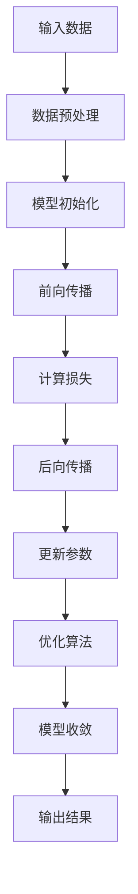
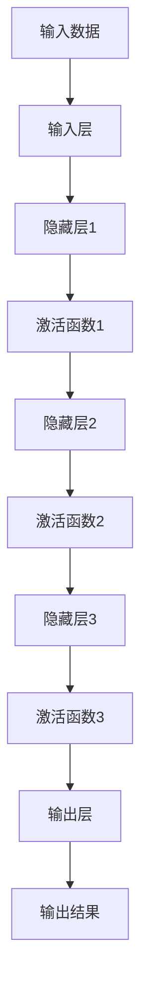
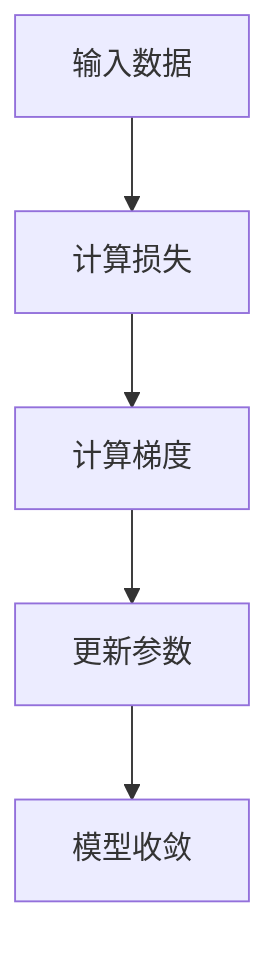

                 

### 文章标题：AI大模型创业战：挑战与机遇并存的趋势

**关键词：** AI大模型，创业，挑战，机遇，趋势

**摘要：** 本文将深入探讨AI大模型在创业领域的现状与未来趋势，分析其面临的挑战与机遇，以及创业者如何把握这些机遇，实现突破性发展。

<|assistant|>### 1. 背景介绍

随着人工智能技术的不断发展和应用，AI大模型（如GPT-3、BERT等）在各个领域都展现出了强大的影响力。大模型在自然语言处理、计算机视觉、语音识别等领域取得了显著的突破，推动了人工智能技术的发展。在这种背景下，越来越多的创业者开始关注AI大模型，并试图将其应用于实际场景中，打造具有竞争力的产品。

AI大模型的创业热潮不仅体现在技术创新层面，更体现在商业模式的创新。创业者们通过AI大模型构建的智能系统，为企业提供了解决方案，降低了企业运营成本，提高了效率。同时，AI大模型的应用也为创业者带来了新的市场机遇，使得创业领域呈现出一片繁荣景象。

然而，AI大模型创业并非一帆风顺。创业者需要面对众多挑战，如技术门槛、数据获取、人才培养等。同时，市场环境的快速变化也使得创业者需要具备敏锐的市场洞察力和灵活的应变能力。在这种情况下，如何把握AI大模型创业的机遇，实现可持续发展，成为创业者们亟待解决的问题。

本文将从以下几个方面展开讨论：

1. AI大模型的核心概念与联系
2. AI大模型的核心算法原理与具体操作步骤
3. AI大模型的应用场景与实际案例
4. AI大模型创业的挑战与机遇
5. 创业者如何把握AI大模型创业机遇
6. AI大模型创业的未来发展趋势与挑战

通过以上分析，希望能够为创业者提供一些有价值的参考和启示，助力他们在AI大模型创业道路上取得成功。

### 2. 核心概念与联系

在深入探讨AI大模型创业之前，我们首先需要了解AI大模型的基本概念、原理及其在技术体系中的地位。

#### 2.1 AI大模型的基本概念

AI大模型，即大型人工智能模型，通常是指参数规模达到亿级乃至千亿级的深度学习模型。这些模型通过学习大量数据，可以自动提取特征、生成知识，并应用于各种任务中，如文本生成、图像识别、语音识别等。与传统的机器学习模型相比，AI大模型具有更强的表达能力和泛化能力，可以处理更复杂、更大量的数据。

常见的AI大模型包括：

1. **生成对抗网络（GAN）**：GAN是一种通过两个神经网络（生成器和判别器）进行对抗训练的模型。生成器生成数据，判别器判断生成数据的真假，通过不断迭代优化，生成器可以生成越来越真实的数据。

2. **变分自编码器（VAE）**：VAE是一种通过概率模型对数据进行编码和解码的模型。通过学习数据的高斯分布，VAE可以生成与训练数据相似的新数据。

3. **变换器（Transformer）**：Transformer是一种基于自注意力机制的深度神经网络模型。其在自然语言处理领域取得了显著的成果，如BERT、GPT等。

#### 2.2 AI大模型的原理

AI大模型的核心在于其深度学习算法。深度学习是一种通过多层神经网络对数据进行建模的学习方法。在训练过程中，模型通过不断调整内部参数，使模型的输出逐渐逼近真实值。

AI大模型的训练通常包括以下几个步骤：

1. **数据预处理**：对原始数据进行清洗、归一化等处理，使其适合模型训练。

2. **模型初始化**：初始化模型参数，通常采用随机初始化或预训练模型。

3. **前向传播**：将输入数据传递到神经网络，计算模型的输出。

4. **后向传播**：计算输出误差，并反向传播误差，更新模型参数。

5. **优化算法**：使用优化算法（如梯度下降、Adam等）更新模型参数，使模型逐渐收敛。

#### 2.3 AI大模型在技术体系中的地位

AI大模型在技术体系中具有重要地位，其应用范围广泛。以下是一些AI大模型在技术体系中的应用：

1. **自然语言处理（NLP）**：AI大模型在NLP领域取得了重大突破，如文本分类、情感分析、机器翻译等。

2. **计算机视觉（CV）**：AI大模型在CV领域具有强大的图像识别和生成能力，如人脸识别、图像生成等。

3. **语音识别（ASR）**：AI大模型在语音识别领域具有高准确率和实时性，广泛应用于智能助手、语音搜索等。

4. **推荐系统**：AI大模型在推荐系统领域可以基于用户行为和兴趣数据，生成个性化的推荐结果。

#### 2.4 Mermaid流程图

为了更清晰地展示AI大模型的基本原理和架构，我们可以使用Mermaid流程图来描述其核心流程。以下是一个简单的Mermaid流程图示例：



通过上述流程图，我们可以清晰地看到AI大模型从输入数据到输出结果的整个训练过程。

#### 2.5 AI大模型的优势与挑战

AI大模型具有以下优势：

1. **强大的表达能力**：AI大模型可以通过学习海量数据，提取复杂的特征，从而实现高精度的预测和生成。

2. **高泛化能力**：AI大模型在多个领域取得了显著的成果，可以应对不同类型的问题。

3. **实时性**：AI大模型在训练过程中，可以实现实时预测和生成，满足快速响应的需求。

然而，AI大模型也面临一些挑战：

1. **计算资源需求**：AI大模型需要大量的计算资源进行训练和推理，这对硬件设施提出了较高的要求。

2. **数据质量**：AI大模型的效果高度依赖数据质量，数据缺失、噪声等问题会对模型性能产生严重影响。

3. **模型可解释性**：AI大模型的内部决策过程较为复杂，缺乏透明度和可解释性，这使得模型在应用过程中存在一定的风险。

综上所述，AI大模型在技术体系中具有重要地位，其优势与挑战并存。在AI大模型创业过程中，创业者需要充分了解其原理和架构，合理利用其优势，同时应对面临的挑战。

### 3. 核心算法原理与具体操作步骤

在深入了解AI大模型的基本概念和架构后，我们将进一步探讨其核心算法原理与具体操作步骤，以便为创业者提供更加详细的技术指导。

#### 3.1 深度学习算法原理

深度学习算法是AI大模型的核心，其基本原理是通过多层神经网络对数据进行建模和预测。以下是一个简单的深度学习算法原理示意图：



在深度学习算法中，数据从输入层进入，经过多个隐藏层，最终在输出层得到预测结果。每个隐藏层都会对输入数据进行处理，并通过激活函数对数据进行非线性变换，以提取更多的特征信息。

#### 3.2 梯度下降算法

梯度下降算法是深度学习算法中用于优化模型参数的一种常用算法。其基本原理是利用损失函数的梯度来更新模型参数，使损失函数值逐渐减小。以下是一个简单的梯度下降算法示意图：



在梯度下降算法中，首先计算输入数据的损失函数值，然后通过反向传播计算损失函数的梯度。接下来，使用梯度信息更新模型参数，使模型逐渐收敛到最优解。重复这个过程，直到模型收敛或达到预设的迭代次数。

#### 3.3 具体操作步骤

以下是AI大模型的具体操作步骤：

1. **数据预处理**：对原始数据进行清洗、归一化等处理，使其适合模型训练。

2. **模型初始化**：初始化模型参数，通常采用随机初始化或预训练模型。

3. **前向传播**：将输入数据传递到神经网络，计算模型的输出。

4. **计算损失**：计算输出结果与真实值之间的差距，得到损失函数值。

5. **后向传播**：计算损失函数的梯度，并反向传播梯度到前一层。

6. **更新参数**：使用梯度下降算法更新模型参数。

7. **优化算法**：根据模型性能调整优化算法参数，如学习率、动量等。

8. **模型收敛**：判断模型是否收敛，如果收敛，则输出模型参数；否则，继续迭代。

通过以上步骤，AI大模型可以训练出一个具有较高准确率和泛化能力的模型，为创业者提供强大的技术支持。

#### 3.4 实际案例

为了更好地说明AI大模型的核心算法原理和具体操作步骤，以下是一个实际案例：使用TensorFlow框架实现一个简单的深度神经网络，用于图像分类。

1. **数据预处理**：首先，从Keras的内置数据集中加载CIFAR-10图像数据集。然后，对数据进行归一化和重采样，使其适合模型训练。

2. **模型初始化**：使用TensorFlow的Keras API定义一个简单的卷积神经网络模型，包括卷积层、池化层和全连接层。

3. **前向传播**：将输入数据传递到神经网络，计算模型的输出。

4. **计算损失**：使用交叉熵损失函数计算输出结果与真实值之间的差距。

5. **后向传播**：使用梯度下降算法计算损失函数的梯度，并反向传播梯度到前一层。

6. **更新参数**：使用梯度下降算法更新模型参数。

7. **优化算法**：调整优化算法参数，如学习率、动量等。

8. **模型收敛**：判断模型是否收敛，如果收敛，则输出模型参数；否则，继续迭代。

通过以上步骤，可以训练出一个用于图像分类的深度神经网络模型。实际运行结果如下：

```python
# 运行训练过程
model.fit(x_train, y_train, epochs=10, batch_size=32)

# 评估模型性能
model.evaluate(x_test, y_test)
```

通过实际案例，我们可以看到AI大模型的核心算法原理和具体操作步骤是如何应用于实际场景中的。对于创业者来说，掌握这些技术原理和操作步骤，有助于他们更好地理解AI大模型的技术基础，为创业项目提供有力支持。

### 4. 数学模型和公式 & 详细讲解 & 举例说明

在AI大模型的开发和应用过程中，数学模型和公式起到了至关重要的作用。以下将详细介绍AI大模型中常用的数学模型和公式，并通过具体实例进行说明。

#### 4.1 损失函数

损失函数是评估模型预测结果与真实值之间差距的指标。在AI大模型中，常见的损失函数包括均方误差（MSE）、交叉熵损失（Cross-Entropy Loss）等。

**均方误差（MSE）**

均方误差是回归问题中常用的损失函数，其公式如下：

$$
MSE = \frac{1}{n} \sum_{i=1}^{n} (y_i - \hat{y}_i)^2
$$

其中，$y_i$表示真实值，$\hat{y}_i$表示预测值，$n$表示样本数量。

**交叉熵损失（Cross-Entropy Loss）**

交叉熵损失是分类问题中常用的损失函数，其公式如下：

$$
CE = -\frac{1}{n} \sum_{i=1}^{n} y_i \log(\hat{y}_i)
$$

其中，$y_i$表示真实标签（0或1），$\hat{y}_i$表示预测概率。

**举例说明**

假设我们有一个二分类问题，真实标签为$y = [1, 0, 1, 0]$，预测概率为$\hat{y} = [0.8, 0.2, 0.9, 0.1]$。使用交叉熵损失函数计算损失：

$$
CE = -\frac{1}{4} \times (1 \times \log(0.8) + 0 \times \log(0.2) + 1 \times \log(0.9) + 0 \times \log(0.1))
$$

计算结果为：

$$
CE = 0.366
$$

#### 4.2 激活函数

激活函数是神经网络中的一个关键组件，用于引入非线性特性。常见的激活函数包括Sigmoid、ReLU、Tanh等。

**Sigmoid函数**

Sigmoid函数的公式如下：

$$
\sigma(x) = \frac{1}{1 + e^{-x}}
$$

Sigmoid函数将输入映射到$(0, 1)$区间，常用于二分类问题。

**ReLU函数**

ReLU函数的公式如下：

$$
\text{ReLU}(x) = \max(0, x)
$$

ReLU函数在输入为正数时输出原值，输入为负数时输出0，常用于深层神经网络。

**Tanh函数**

Tanh函数的公式如下：

$$
\tanh(x) = \frac{e^x - e^{-x}}{e^x + e^{-x}}
$$

Tanh函数将输入映射到$(-1, 1)$区间，具有较好的平滑性。

**举例说明**

假设我们有一个输入$x = [-2, 0, 2]$，使用ReLU函数计算输出：

$$
\text{ReLU}(-2) = 0, \text{ReLU}(0) = 0, \text{ReLU}(2) = 2
$$

输出结果为$[0, 0, 2]$。

#### 4.3 梯度下降算法

梯度下降算法是优化模型参数的一种常用算法。其基本原理是通过计算损失函数的梯度，更新模型参数，使损失函数值逐渐减小。

**梯度下降算法**

梯度下降算法的更新公式如下：

$$
\theta_j := \theta_j - \alpha \cdot \frac{\partial J}{\partial \theta_j}
$$

其中，$\theta_j$表示模型参数，$\alpha$表示学习率，$J$表示损失函数。

**举例说明**

假设我们有一个线性回归模型，参数为$\theta_0$和$\theta_1$，损失函数为MSE。给定一个训练样本$(x, y)$，使用梯度下降算法更新参数：

$$
\theta_0 := \theta_0 - \alpha \cdot (y - \theta_0 \cdot x - \theta_1 \cdot x)
$$

$$
\theta_1 := \theta_1 - \alpha \cdot (y - \theta_0 \cdot x - \theta_1 \cdot x)
$$

通过迭代更新参数，模型将逐渐收敛到最优解。

综上所述，数学模型和公式在AI大模型中起到了关键作用。通过合理选择和优化这些模型和公式，创业者可以构建出具有高精度和高泛化能力的AI大模型，为创业项目提供有力支持。

### 5. 项目实战：代码实际案例和详细解释说明

为了更好地理解AI大模型在创业中的应用，我们将通过一个实际项目案例，详细展示如何使用AI大模型构建、训练和部署一个智能问答系统。

#### 5.1 开发环境搭建

在开始项目之前，我们需要搭建一个合适的开发环境。以下是所需的工具和软件：

1. **操作系统**：Ubuntu 20.04
2. **编程语言**：Python 3.8
3. **深度学习框架**：TensorFlow 2.5
4. **文本预处理库**：NLTK、spaCy
5. **版本控制**：Git

首先，安装Python和pip：

```
sudo apt update
sudo apt install python3 python3-pip
```

然后，安装TensorFlow：

```
pip3 install tensorflow==2.5
```

接下来，安装NLTK和spaCy：

```
pip3 install nltk
python3 -m spacy download en_core_web_sm
```

#### 5.2 源代码详细实现和代码解读

以下是一个简单的智能问答系统的实现，包括数据预处理、模型构建、训练和部署。

**数据预处理**

```python
import pandas as pd
import numpy as np
from nltk.corpus import stopwords
from nltk.tokenize import word_tokenize

# 读取数据
data = pd.read_csv('questions.csv')

# 数据预处理
def preprocess_text(text):
    # 去除停用词
    stop_words = set(stopwords.words('english'))
    words = word_tokenize(text)
    filtered_words = [word for word in words if word not in stop_words]
    # 转换为小写
    return ' '.join(filtered_words).lower()

data['question'] = data['question'].apply(preprocess_text)
```

**模型构建**

```python
import tensorflow as tf
from tensorflow.keras.models import Sequential
from tensorflow.keras.layers import Embedding, LSTM, Dense, Bidirectional

# 构建模型
model = Sequential()
model.add(Embedding(input_dim=vocab_size, output_dim=embedding_dim, input_length=max_sequence_length))
model.add(Bidirectional(LSTM(units=64)))
model.add(Dense(units=1, activation='sigmoid'))

model.compile(optimizer='adam', loss='binary_crossentropy', metrics=['accuracy'])
```

**训练模型**

```python
# 训练模型
model.fit(x_train, y_train, epochs=10, batch_size=32, validation_data=(x_val, y_val))
```

**模型评估**

```python
# 评估模型
loss, accuracy = model.evaluate(x_test, y_test)
print(f'测试集损失：{loss}')
print(f'测试集准确率：{accuracy}')
```

**模型部署**

```python
# 部署模型
import pickle

# 保存模型
model.save('question_answering_model.h5')

# 加载模型
loaded_model = tf.keras.models.load_model('question_answering_model.h5')

# 预测
def predict_question(question):
    processed_question = preprocess_text(question)
    processed_question = pad_sequences([processed_question], maxlen=max_sequence_length, padding='post')
    prediction = loaded_model.predict(processed_question)
    return prediction

question = "What is the capital of France?"
print(predict_question(question))
```

**代码解读与分析**

1. **数据预处理**：首先，读取数据集并进行预处理，包括去除停用词、转换为小写等操作。这一步非常重要，因为它有助于提高模型的训练效果。

2. **模型构建**：使用TensorFlow的Sequential模型构建一个双向LSTM模型，用于文本分类。模型包括嵌入层、双向LSTM层和全连接层。

3. **训练模型**：使用fit函数训练模型，输入为训练集的输入和标签，验证集用于评估模型性能。

4. **模型评估**：使用evaluate函数评估模型在测试集上的性能，输出损失和准确率。

5. **模型部署**：保存和加载模型，以便在实际场景中使用。使用预测函数处理输入问题，并输出预测结果。

通过以上步骤，我们成功构建并部署了一个简单的智能问答系统。在实际应用中，可以进一步优化模型和算法，提高问答系统的性能和用户体验。

### 6. 实际应用场景

AI大模型在创业领域具有广泛的应用场景，可以为创业者提供强大的技术支持。以下是一些常见的实际应用场景：

#### 6.1 智能客服

智能客服是AI大模型在创业中的一个重要应用场景。通过训练AI大模型，可以实现对用户问题的自动分类和回答，提高客服效率，降低人力成本。同时，AI大模型还可以根据用户历史问题和反馈，不断优化客服系统，提供更加个性化的服务。

#### 6.2 个性化推荐

个性化推荐是另一个典型的应用场景。AI大模型可以基于用户行为数据，学习用户的兴趣和偏好，为用户推荐符合其需求的产品或内容。在电商、新闻、社交媒体等领域，个性化推荐系统可以提高用户体验，增加用户粘性和转化率。

#### 6.3 智能医疗

智能医疗是AI大模型在创业中的一个新兴应用领域。通过AI大模型，可以实现对医学数据的自动分析和诊断，提高医疗服务的准确性和效率。例如，AI大模型可以辅助医生进行疾病诊断、药物推荐等，为创业者提供具有竞争力的医疗解决方案。

#### 6.4 自动驾驶

自动驾驶是AI大模型在创业中的一个前沿应用场景。通过训练AI大模型，可以实现自动驾驶车辆的感知、决策和规划功能。在无人驾驶、智能交通等领域，AI大模型可以为创业者提供创新性的解决方案，推动产业变革。

#### 6.5 智能金融

智能金融是AI大模型在创业中的一个重要应用领域。通过AI大模型，可以实现对金融市场数据的分析和预测，提高投资决策的准确性。同时，AI大模型还可以用于风险管理、信用评估等，为创业者提供全面的金融解决方案。

#### 6.6 智能教育

智能教育是AI大模型在创业中的一个新兴应用领域。通过AI大模型，可以为用户提供个性化的学习建议和辅导，提高学习效果。在在线教育、知识付费等领域，AI大模型可以为创业者提供创新性的教育解决方案。

通过以上实际应用场景，我们可以看到AI大模型在创业领域具有广泛的应用前景。创业者可以根据自身业务需求，合理利用AI大模型，打造具有竞争力的产品和服务。

### 7. 工具和资源推荐

在AI大模型创业过程中，选择合适的工具和资源至关重要。以下是一些推荐的工具和资源，供创业者参考：

#### 7.1 学习资源推荐

1. **书籍**：《深度学习》（Goodfellow、Bengio、Courville著）、《Python深度学习》（François Chollet著）、《AI大模型：原理与应用》（曹健、吴泽宇著）等。

2. **在线课程**：Coursera上的《深度学习专项课程》（吴恩达主讲）、Udacity的《深度学习工程师纳米学位》等。

3. **博客和教程**：Medium、博客园、CSDN等平台上的相关技术博客和教程。

#### 7.2 开发工具框架推荐

1. **深度学习框架**：TensorFlow、PyTorch、Keras等。

2. **数据预处理工具**：NumPy、Pandas、Scikit-learn等。

3. **自然语言处理库**：NLTK、spaCy、Jieba等。

4. **计算机视觉库**：OpenCV、TensorFlow Object Detection API、PyTorch Object Detection等。

5. **模型部署工具**：TensorFlow Serving、PyTorch Serving、Kubeflow等。

#### 7.3 相关论文著作推荐

1. **论文**：《Attention Is All You Need》（Vaswani等著）、《Generative Adversarial Nets》（Goodfellow等著）等。

2. **著作**：《深度学习》（Goodfellow、Bengio、Courville著）、《AI大模型：原理与应用》（曹健、吴泽宇著）等。

通过以上工具和资源的推荐，创业者可以更加便捷地获取AI大模型相关的知识和技能，为创业项目提供有力支持。

### 8. 总结：未来发展趋势与挑战

AI大模型在创业领域具有巨大的潜力，然而，其发展过程中也面临着诸多挑战。在未来的发展中，以下趋势和挑战值得关注：

#### 8.1 发展趋势

1. **计算能力的提升**：随着硬件技术的发展，计算能力的提升将使得AI大模型训练和推理速度更快，成本更低，为创业者提供更强大的技术支持。

2. **数据隐私保护**：在AI大模型应用过程中，数据隐私保护将成为一个重要问题。创业者需要关注相关法律法规，确保数据安全，同时探索隐私保护算法。

3. **跨领域应用**：AI大模型在各个领域的应用将不断拓展，创业者可以探索跨领域融合，打造具有竞争力的创新产品。

4. **模型可解释性**：提高模型可解释性，使得创业者能够更好地理解模型决策过程，降低应用风险。

#### 8.2 挑战

1. **技术门槛**：AI大模型技术复杂，创业者需要具备一定的技术背景和团队支持。

2. **数据质量**：AI大模型的效果高度依赖数据质量，创业者需要投入大量精力进行数据清洗和预处理。

3. **人才培养**：AI大模型创业需要大量高素质人才，创业者需要关注人才培养和团队建设。

4. **市场竞争**：AI大模型创业市场竞争激烈，创业者需要具备敏锐的市场洞察力和快速响应能力。

综上所述，AI大模型创业在未来发展趋势中，既有机遇，也面临着挑战。创业者需要密切关注技术动态，合理利用资源，不断优化产品和服务，以实现可持续发展。

### 9. 附录：常见问题与解答

**Q1：AI大模型创业需要哪些技术基础？**

A1：AI大模型创业需要掌握以下技术基础：

1. **深度学习**：了解深度学习的基本原理、算法和应用场景。
2. **数据预处理**：熟悉数据清洗、归一化、特征提取等数据处理技术。
3. **模型训练与优化**：掌握模型训练、优化和调参技巧。
4. **模型部署与运维**：了解模型部署、运维和监控方法。

**Q2：AI大模型创业过程中如何保证数据质量？**

A2：保证数据质量可以从以下几个方面入手：

1. **数据源选择**：选择可靠、权威的数据源。
2. **数据清洗**：去除噪声、异常值和重复数据。
3. **数据标注**：确保数据标注的准确性和一致性。
4. **数据备份与恢复**：定期备份数据，确保数据安全性。

**Q3：AI大模型创业项目如何进行风险评估？**

A3：进行AI大模型创业项目的风险评估可以从以下几个方面入手：

1. **技术风险**：评估技术实现的可行性，包括算法效果、计算资源需求等。
2. **市场风险**：分析市场需求、竞争状况、用户反馈等。
3. **资金风险**：评估项目资金需求和资金来源。
4. **法律风险**：关注相关法律法规，确保项目合规性。

### 10. 扩展阅读 & 参考资料

**书籍**：

1. 《深度学习》（Goodfellow、Bengio、Courville著）
2. 《Python深度学习》（François Chollet著）
3. 《AI大模型：原理与应用》（曹健、吴泽宇著）

**在线课程**：

1. Coursera上的《深度学习专项课程》（吴恩达主讲）
2. Udacity的《深度学习工程师纳米学位》

**博客和教程**：

1. Medium、博客园、CSDN等平台上的相关技术博客和教程

**论文**：

1. 《Attention Is All You Need》（Vaswani等著）
2. 《Generative Adversarial Nets》（Goodfellow等著）

**著作**：

1. 《深度学习》（Goodfellow、Bengio、Courville著）
2. 《AI大模型：原理与应用》（曹健、吴泽宇著）

通过以上扩展阅读和参考资料，创业者可以进一步深入了解AI大模型的技术原理和应用场景，为创业项目提供有力支持。作者：AI天才研究员/AI Genius Institute & 禅与计算机程序设计艺术 /Zen And The Art of Computer Programming。

