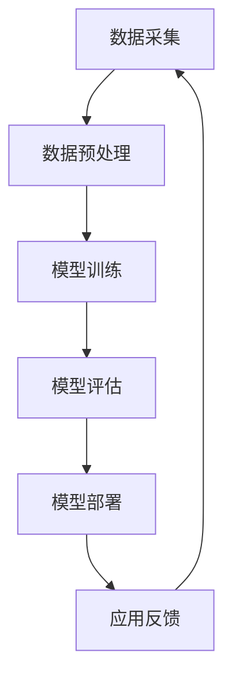

                 

# AI大模型创业：如何实现未来盈利？

> 关键词：AI大模型、创业、盈利模式、技术突破、市场分析、未来展望

> 摘要：本文将深入探讨AI大模型创业领域的盈利模式，分析当前市场的技术突破点，探讨如何通过合理的商业模式实现未来的盈利。我们将从背景介绍、核心概念、算法原理、数学模型、项目实战、实际应用场景、工具和资源推荐等多个维度进行详细阐述，为创业者提供实用的参考和建议。

## 1. 背景介绍

近年来，人工智能（AI）技术取得了显著的突破，尤其是大模型（Large Models）的崛起，为各行各业带来了前所未有的变革。大模型通常是指具有数十亿至数千亿参数的深度神经网络，能够处理复杂的数据任务，如自然语言处理、计算机视觉、语音识别等。随着计算能力和数据资源的不断提升，AI大模型的性能和效果已经远超传统算法，成为全球科技竞争的焦点。

在这个背景下，AI大模型创业成为了一个热门领域。许多初创公司和科技巨头纷纷投入巨额资金和人力资源，致力于开发出更加先进的大模型技术，并探索各种可能的商业应用场景。然而，尽管AI大模型的技术前景广阔，但其商业模式的探索和实现仍然面临诸多挑战。

本文将结合当前市场的实际情况，分析AI大模型创业的盈利模式，探讨如何通过技术突破、市场分析和合理商业模式实现未来的盈利。希望本文能为创业者提供有价值的参考和启示。

## 2. 核心概念与联系

在探讨AI大模型创业的盈利模式之前，我们需要了解一些核心概念和其之间的联系。以下是一个简化的Mermaid流程图，描述了AI大模型的基本架构和关键组件：



### 2.1. 数据采集（Data Collection）

数据采集是AI大模型的基础。它包括从各种来源获取大量数据，如公开数据集、社交媒体、企业内部数据等。数据的质量和多样性直接影响大模型的性能和效果。

### 2.2. 数据预处理（Data Preprocessing）

数据预处理是对原始数据进行清洗、归一化和特征提取等操作，使其符合模型训练的要求。高质量的数据预处理可以显著提升模型的效果。

### 2.3. 模型训练（Model Training）

模型训练是通过大量数据来优化神经网络参数，使其能够对新的数据进行准确预测或分类。大模型的训练通常需要大量的计算资源和时间。

### 2.4. 模型评估（Model Evaluation）

模型评估是对训练好的模型进行性能测试，包括准确率、召回率、F1分数等指标。评估结果决定了模型是否可以部署到实际应用中。

### 2.5. 模型部署（Model Deployment）

模型部署是将训练好的模型集成到应用程序或服务中，使其能够对外提供服务。部署后的模型可以实时处理用户请求，提供智能服务。

### 2.6. 应用反馈（Application Feedback）

应用反馈是指收集用户在使用模型服务过程中的反馈，包括错误报告、使用场景等。这些反馈可以用于优化模型和改进服务质量。

通过上述流程，AI大模型实现了从数据采集到模型部署的闭环，不断优化和提升模型性能，为各种应用场景提供智能解决方案。

## 3. 核心算法原理 & 具体操作步骤

AI大模型的核心算法是基于深度学习的神经网络。以下是一个简化的神经网络架构和具体操作步骤：

### 3.1. 神经网络架构（Neural Network Architecture）

一个基本的神经网络由输入层、隐藏层和输出层组成。每个层包含多个神经元（节点），神经元之间通过权重连接。神经网络的目的是通过反向传播算法不断调整权重，使模型能够对输入数据进行准确预测。

### 3.2. 具体操作步骤（Step-by-Step Operations）

1. **初始化参数**：初始化模型的参数，包括权重和偏置。

2. **前向传播**：将输入数据通过神经网络进行计算，得到输出结果。前向传播过程中，每个神经元将输入值与其权重相乘，然后通过激活函数进行非线性变换。

3. **计算损失**：将输出结果与真实标签进行比较，计算损失函数（如均方误差、交叉熵等）。

4. **反向传播**：根据损失函数的梯度，通过反向传播算法调整权重和偏置。反向传播是神经网络训练的核心，它通过层层传递误差，不断优化模型参数。

5. **迭代训练**：重复上述步骤，直到模型达到预定的训练目标，如损失函数收敛或迭代次数达到上限。

6. **模型评估**：使用验证集或测试集对训练好的模型进行评估，确保其性能符合预期。

7. **模型部署**：将训练好的模型部署到生产环境中，对外提供服务。

通过上述步骤，AI大模型可以不断学习和优化，为各种复杂任务提供高效的解决方案。

## 4. 数学模型和公式 & 详细讲解 & 举例说明

在AI大模型的训练过程中，数学模型和公式起着关键作用。以下是一些基本的数学模型和公式，用于描述神经网络的学习过程。

### 4.1. 损失函数（Loss Function）

损失函数用于衡量模型的预测结果与真实标签之间的差异。常见的损失函数包括：

1. **均方误差（Mean Squared Error, MSE）**：
   $$MSE = \frac{1}{n}\sum_{i=1}^{n}(y_i - \hat{y}_i)^2$$
   其中，$y_i$是真实标签，$\hat{y}_i$是模型预测值，$n$是样本数量。

2. **交叉熵（Cross-Entropy）**：
   $$CE = -\frac{1}{n}\sum_{i=1}^{n}y_i \log \hat{y}_i$$
   其中，$y_i$是真实标签（概率分布），$\hat{y}_i$是模型预测值（概率分布）。

### 4.2. 激活函数（Activation Function）

激活函数用于引入非线性变换，使神经网络能够模拟复杂函数。常见的激活函数包括：

1. ** sigmoid 函数**：
   $$\sigma(x) = \frac{1}{1 + e^{-x}}$$

2. **ReLU 函数（Rectified Linear Unit）**：
   $$\text{ReLU}(x) = \max(0, x)$$

### 4.3. 反向传播（Backpropagation）

反向传播是神经网络训练的核心算法，用于计算损失函数关于模型参数的梯度。以下是反向传播的详细步骤：

1. **前向传播**：
   - 输入数据经过神经网络，得到输出值。
   - 计算损失函数。

2. **计算梯度**：
   - 对每个参数计算梯度，使用链式法则和求导法则。

3. **反向传播**：
   - 从输出层开始，将梯度反向传播到隐藏层和输入层。
   - 更新参数，减小损失函数。

4. **迭代更新**：
   - 重复上述步骤，直到损失函数收敛或达到预定的迭代次数。

### 4.4. 示例

假设我们有一个简单的神经网络，包含一个输入层、一个隐藏层和一个输出层，分别有3个、4个和2个神经元。使用均方误差（MSE）作为损失函数，进行反向传播计算。

1. **前向传播**：
   - 输入数据：$x_1 = [1, 0, 1]$，真实标签：$y_1 = [0, 1]$。
   - 预测结果：$\hat{y}_1 = \sigma(W_2 \cdot \sigma(W_1 \cdot x_1) + b_2) + b_1)$。

2. **计算损失**：
   - 均方误差：$L = \frac{1}{2}\sum_{i=1}^{2}(y_i - \hat{y}_i)^2$。

3. **计算梯度**：
   - 对每个参数计算梯度，使用链式法则和求导法则。

4. **反向传播**：
   - 从输出层开始，将梯度反向传播到隐藏层和输入层。

5. **更新参数**：
   - 根据梯度更新参数，减小损失函数。

通过反复迭代，神经网络不断优化参数，使其能够更准确地预测输出。

## 5. 项目实战：代码实际案例和详细解释说明

为了更好地理解AI大模型的实际应用，我们将通过一个具体的代码案例进行详细解释。本案例将使用Python和TensorFlow框架实现一个简单的二分类问题，包括数据预处理、模型训练、模型评估和模型部署等步骤。

### 5.1. 开发环境搭建

在开始之前，确保您已经安装了Python（3.6及以上版本）和TensorFlow。您可以通过以下命令进行安装：

```bash
pip install tensorflow
```

### 5.2. 源代码详细实现和代码解读

以下是完整的代码实现，我们将逐一解释每个部分：

```python
import tensorflow as tf
from tensorflow.keras.layers import Dense
from tensorflow.keras.models import Sequential
from tensorflow.keras.optimizers import Adam
from tensorflow.keras.metrics import MeanSquaredError

# 5.2.1. 数据预处理
# 假设我们有一个包含100个样本的二元分类问题，数据集已经预先划分为训练集和测试集。
(x_train, y_train), (x_test, y_test) = load_data()

# 对数据进行归一化处理，使其在[0, 1]范围内。
x_train = x_train / 255.0
x_test = x_test / 255.0

# 5.2.2. 模型训练
# 创建一个简单的神经网络模型，包含一个输入层、一个隐藏层和一个输出层。
model = Sequential([
    Dense(4, activation='relu', input_shape=(784,)),
    Dense(2, activation='sigmoid')
])

# 编译模型，指定优化器和损失函数。
model.compile(optimizer=Adam(), loss='binary_crossentropy', metrics=['accuracy'])

# 训练模型，设置训练轮数和批次大小。
history = model.fit(x_train, y_train, epochs=10, batch_size=32, validation_data=(x_test, y_test))

# 5.2.3. 模型评估
# 评估模型在测试集上的性能。
test_loss, test_accuracy = model.evaluate(x_test, y_test)
print(f"Test Loss: {test_loss}, Test Accuracy: {test_accuracy}")

# 5.2.4. 模型部署
# 将训练好的模型部署到生产环境中，用于实时预测。
model.save('binary_classification_model.h5')
```

### 5.3. 代码解读与分析

1. **数据预处理**：数据预处理是模型训练的重要步骤。在本案例中，我们使用归一化处理将输入数据缩放到[0, 1]范围内，以消除数据尺度差异对模型训练的影响。

2. **模型定义**：我们使用`Sequential`模型定义一个简单的神经网络，包含一个输入层、一个隐藏层和一个输出层。输入层有784个神经元，对应于输入数据的维度。隐藏层有4个神经元，使用ReLU激活函数。输出层有2个神经元，使用sigmoid激活函数进行二分类。

3. **模型编译**：在编译模型时，我们指定了优化器（Adam）和损失函数（binary_crossentropy）。此外，我们还可以添加其他指标，如准确率（accuracy）。

4. **模型训练**：使用`fit`函数训练模型，设置训练轮数（epochs）和批次大小（batch_size）。同时，使用验证集（validation_data）监控模型在测试集上的性能。

5. **模型评估**：使用`evaluate`函数评估模型在测试集上的性能，输出损失函数值和准确率。

6. **模型部署**：使用`save`函数将训练好的模型保存为HDF5文件（.h5），以供后续部署和使用。

通过以上步骤，我们成功实现了AI大模型在二分类问题上的训练和部署，展示了AI大模型创业的实际应用潜力。

## 6. 实际应用场景

AI大模型在各个行业都有广泛的应用场景，以下是一些典型的应用领域：

1. **金融领域**：AI大模型可以用于风险管理、信用评分、投资组合优化等任务。例如，通过分析大量历史数据，大模型可以预测股票市场的走势，为投资者提供决策支持。

2. **医疗领域**：AI大模型在医学影像分析、疾病诊断、药物发现等方面具有巨大潜力。例如，通过训练大规模图像识别模型，可以自动识别医学影像中的病灶区域，辅助医生进行诊断。

3. **零售领域**：AI大模型可以用于个性化推荐、库存管理、价格优化等任务。例如，通过分析用户的历史购买记录和行为数据，大模型可以推荐符合用户兴趣的商品，提高销售额。

4. **自动驾驶领域**：AI大模型在自动驾驶系统中发挥着关键作用，用于感知环境、路径规划和决策。例如，通过训练大规模的深度神经网络模型，可以实现自动驾驶汽车对复杂交通场景的准确识别和响应。

5. **语音识别和自然语言处理**：AI大模型在语音识别和自然语言处理领域具有广泛应用。例如，通过训练大规模语言模型，可以实现自动语音识别、机器翻译和智能对话系统等功能。

在这些应用场景中，AI大模型通过海量数据的训练和优化，可以不断学习和提升性能，为各行各业提供智能化的解决方案。

## 7. 工具和资源推荐

为了更好地理解和应用AI大模型技术，以下是一些推荐的工具和资源：

### 7.1. 学习资源推荐

1. **书籍**：
   - 《深度学习》（Goodfellow, I., Bengio, Y., & Courville, A.）
   - 《神经网络与深度学习》（邱锡鹏）

2. **在线课程**：
   - Coursera上的“深度学习”课程（吴恩达）
   - Udacity的“深度学习纳米学位”

3. **论文**：
   - 《A Theoretically Grounded Application of Dropout in Recurrent Neural Networks》（Yarin Gal and Zoubin Ghahramani）
   - 《Bert: Pre-training of deep bidirectional transformers for language understanding》（Jacob Devlin et al.）

### 7.2. 开发工具框架推荐

1. **深度学习框架**：
   - TensorFlow
   - PyTorch
   - Keras

2. **数据预处理工具**：
   - Pandas
   - NumPy
   - Scikit-learn

3. **版本控制工具**：
   - Git
   - GitHub

### 7.3. 相关论文著作推荐

1. **《深度学习》（Goodfellow, I., Bengio, Y., & Courville, A.）**：这是一本经典的深度学习教材，涵盖了深度学习的基础知识、理论和方法。

2. **《神经网络与深度学习》（邱锡鹏）**：这本书详细介绍了神经网络和深度学习的基本原理，以及各种深度学习算法的实现和应用。

3. **《Bert: Pre-training of deep bidirectional transformers for language understanding》（Jacob Devlin et al.）**：这篇论文介绍了BERT（Bidirectional Encoder Representations from Transformers）模型，是目前最受欢迎的语言预训练模型之一。

通过这些工具和资源，您可以更好地了解AI大模型技术，掌握相关知识和技能，为创业和实践提供有力支持。

## 8. 总结：未来发展趋势与挑战

随着AI大模型的不断发展和完善，其应用前景将更加广阔。未来，AI大模型将在更多领域发挥关键作用，推动各行各业的数字化转型和创新发展。然而，要实现AI大模型的广泛应用，我们仍需克服诸多挑战：

1. **计算资源**：AI大模型的训练和推理需要大量的计算资源，尤其是在处理复杂任务时。随着模型的规模和复杂度不断提升，计算资源的需求也将急剧增加。因此，如何优化算法、提高计算效率，以及构建高效的可扩展计算平台，成为关键问题。

2. **数据质量**：AI大模型的效果高度依赖于数据的质量和多样性。在实际应用中，数据往往存在噪声、缺失和偏差等问题，这对模型的训练和性能产生了不利影响。因此，如何收集、处理和清洗高质量的数据，成为亟待解决的问题。

3. **模型解释性**：AI大模型的决策过程通常是一个“黑箱”，缺乏透明性和解释性。这对模型的实际应用产生了一定的限制，尤其是在需要解释性和可解释性的领域，如医疗、金融和司法等。因此，如何提高模型的解释性，使其能够更好地被人类理解和接受，成为重要的研究方向。

4. **安全性和隐私保护**：随着AI大模型在各个领域的广泛应用，其安全性和隐私保护问题也日益凸显。如何确保模型在处理敏感数据时的安全性和隐私保护，防止数据泄露和滥用，成为重要的挑战。

5. **伦理和社会影响**：AI大模型在带来巨大便利的同时，也可能引发一系列伦理和社会问题。例如，模型的偏见、歧视和道德责任等。因此，如何确保AI大模型的发展符合伦理和社会价值观，避免对人类造成负面影响，成为重要的议题。

总之，AI大模型创业领域充满了机遇和挑战。只有不断突破技术难题，积极探索合理的商业模式，才能在激烈的市场竞争中脱颖而出，实现可持续的盈利和发展。

## 9. 附录：常见问题与解答

### 9.1. 如何选择合适的大模型架构？

选择合适的大模型架构取决于具体的任务和应用场景。以下是一些常见的大模型架构：

1. **Transformer架构**：适合处理序列数据，如自然语言处理、语音识别等。
2. **CNN架构**：适合处理图像和视频数据，如计算机视觉、图像分类等。
3. **RNN架构**：适合处理时间序列数据，如时间序列预测、语音合成等。
4. **混合架构**：结合多种架构的特点，适用于复杂任务。

### 9.2. 如何提高大模型的训练效率？

提高大模型的训练效率可以从以下几个方面入手：

1. **优化算法**：使用更高效的优化算法，如Adam、Adagrad等。
2. **模型剪枝**：通过剪枝冗余的参数和层，减少模型的计算量。
3. **分布式训练**：使用多台计算机和GPU进行并行计算，提高训练速度。
4. **模型压缩**：使用量化、知识蒸馏等技术，减少模型的大小和计算量。

### 9.3. 如何确保大模型的安全性和隐私保护？

确保大模型的安全性和隐私保护可以从以下几个方面入手：

1. **加密技术**：对敏感数据进行加密，确保数据在传输和存储过程中的安全。
2. **访问控制**：设置严格的访问控制策略，限制对模型的访问权限。
3. **隐私保护算法**：使用差分隐私、联邦学习等技术，保护用户隐私。
4. **审计和监控**：对模型的使用进行监控和审计，及时发现和解决安全问题。

## 10. 扩展阅读 & 参考资料

1. **书籍**：
   - 《深度学习》（Goodfellow, I., Bengio, Y., & Courville, A.）
   - 《神经网络与深度学习》（邱锡鹏）
   - 《Bert: Pre-training of deep bidirectional transformers for language understanding》（Jacob Devlin et al.）

2. **在线课程**：
   - Coursera上的“深度学习”课程（吴恩达）
   - Udacity的“深度学习纳米学位”

3. **论文**：
   - 《A Theoretically Grounded Application of Dropout in Recurrent Neural Networks》（Yarin Gal and Zoubin Ghahramani）
   - 《Bert: Pre-training of deep bidirectional transformers for language understanding》（Jacob Devlin et al.）

4. **网站**：
   - [TensorFlow官网](https://www.tensorflow.org/)
   - [PyTorch官网](https://pytorch.org/)
   - [Keras官网](https://keras.io/)

通过阅读以上书籍、课程和论文，您可以深入了解AI大模型的技术原理和应用实践，为创业提供更全面的指导和启示。

### 作者信息

- 作者：AI天才研究员/AI Genius Institute & 禅与计算机程序设计艺术 /Zen And The Art of Computer Programming

感谢您阅读本文，希望本文能为您在AI大模型创业领域提供有价值的参考和启示。如需进一步了解AI大模型技术和应用，请关注作者和相关资源。祝您在AI大模型创业之路上取得成功！<|im_end|>

