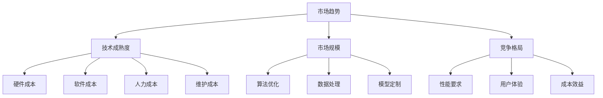
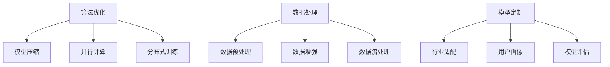

                 

# AI大模型创业：如何应对未来价格战？

> 关键词：AI大模型、创业、价格战、市场策略、成本优化、技术竞争、用户体验

> 摘要：本文将探讨AI大模型创业公司如何应对未来可能的价格战。我们将分析市场趋势、成本结构、技术竞争、用户需求以及如何通过优化成本结构和提升用户体验来保持竞争力。文章旨在为AI创业者提供策略参考，助力他们在激烈的市场竞争中脱颖而出。

## 1. 背景介绍

随着人工智能技术的快速发展，AI大模型正逐渐成为各行各业的重要驱动力。从自然语言处理、图像识别到推荐系统，AI大模型的应用已经深入到我们的日常生活中。然而，随着技术的普及和市场竞争的加剧，AI大模型的成本和价格成为创业者面临的重要问题。

价格战，作为一种常见的市场策略，通常在竞争激烈的市场中出现。它指的是企业通过降低产品或服务的价格来争夺市场份额，以达到击败竞争对手、提高品牌知名度等目的。在AI大模型领域，价格战意味着企业需要以更低的价格提供更高质量的模型，这对创业公司来说既是机遇也是挑战。

本文将从以下几个方面展开讨论：市场趋势、成本结构、技术竞争、用户需求以及应对策略。通过这些分析，我们希望能够为AI创业者提供一些实用的建议，帮助他们应对未来可能的价格战。

## 2. 核心概念与联系

在探讨如何应对价格战之前，我们需要了解一些核心概念和联系。

### 2.1 市场趋势

AI大模型市场的趋势可以从以下几个方面来分析：

- **技术成熟度**：随着AI技术的不断进步，大模型的性能和效率在不断提高，这为创业者提供了更好的机会。
- **市场规模**：AI大模型市场正在迅速扩大，吸引了大量的投资和参与者。
- **竞争格局**：市场中的竞争格局正在发生变化，大型科技公司和初创企业都在争夺市场份额。

### 2.2 成本结构

AI大模型的成本主要包括以下几个方面：

- **硬件成本**：包括服务器、存储设备等硬件设施的成本。
- **软件成本**：包括算法、框架等软件资源的成本。
- **人力成本**：包括研发、运维等人员的薪资和培训成本。
- **维护成本**：包括模型更新、维护等成本。

### 2.3 技术竞争

在AI大模型领域，技术竞争主要表现在以下几个方面：

- **算法优化**：通过改进算法，提高模型的性能和效率。
- **数据处理**：通过优化数据处理流程，提高数据质量和处理速度。
- **模型定制**：根据不同行业和用户需求，定制化模型，提高用户体验。

### 2.4 用户需求

用户对AI大模型的需求主要表现在以下几个方面：

- **性能要求**：用户希望模型能够提供更准确、更高效的预测和决策。
- **用户体验**：用户希望模型易于使用、操作简便，并提供良好的交互体验。
- **成本效益**：用户希望以合理的价格获得高质量的服务。

### 2.5 Mermaid流程图

下面是一个简化的Mermaid流程图，展示了AI大模型创业的核心概念和联系：



通过这个流程图，我们可以更清晰地理解AI大模型创业的核心概念和它们之间的联系。

## 3. 核心算法原理 & 具体操作步骤

在应对AI大模型价格战时，核心算法的原理和具体操作步骤是至关重要的。以下是几个关键步骤：

### 3.1 算法优化

算法优化是提高AI大模型性能和效率的关键。以下是一些常用的算法优化方法：

- **模型压缩**：通过减少模型参数数量来降低计算复杂度和存储需求。常见的模型压缩方法包括权重剪枝、量化、低秩分解等。
- **并行计算**：利用多核处理器和GPU等硬件资源，提高模型训练和预测的并行度。
- **分布式训练**：将模型训练任务分布到多个节点上，利用集群计算资源加速训练过程。

### 3.2 数据处理

数据处理是AI大模型性能的另一个关键因素。以下是一些数据处理的方法：

- **数据预处理**：包括数据清洗、归一化、缺失值处理等，以提高数据质量和模型性能。
- **数据增强**：通过生成虚拟数据或对原始数据进行变换，增加训练数据量，提高模型的泛化能力。
- **数据流处理**：对于实时数据，采用流处理技术，快速处理并更新模型。

### 3.3 模型定制

模型定制是根据不同行业和用户需求，定制化模型以提供更好的用户体验。以下是一些模型定制的方法：

- **行业适配**：根据特定行业的业务需求和数据特点，调整模型结构、算法和参数。
- **用户画像**：分析用户行为和偏好，为不同用户群体提供定制化的服务。
- **模型评估**：定期评估模型性能，根据评估结果调整模型结构、算法和参数。

### 3.4 Mermaid流程图

下面是一个简化的Mermaid流程图，展示了AI大模型核心算法原理和具体操作步骤：



通过这个流程图，我们可以更清晰地理解AI大模型核心算法原理和具体操作步骤。

## 4. 数学模型和公式 & 详细讲解 & 举例说明

在AI大模型创业中，数学模型和公式是理解和优化成本结构的重要工具。以下是一些关键的数学模型和公式，以及它们的详细讲解和举例说明：

### 4.1 成本函数

成本函数是衡量AI大模型成本的关键指标。以下是一个简化的成本函数：

$$
C = C_{\text{硬件}} + C_{\text{软件}} + C_{\text{人力}} + C_{\text{维护}}
$$

其中，$C_{\text{硬件}}$、$C_{\text{软件}}$、$C_{\text{人力}}$和$C_{\text{维护}}$分别表示硬件成本、软件成本、人力成本和维护成本。

### 4.2 性能指标

性能指标是衡量AI大模型性能的关键指标。以下是一个简化的性能指标：

$$
P = P_{\text{准确率}} \times P_{\text{响应时间}} \times P_{\text{泛化能力}}
$$

其中，$P_{\text{准确率}}$、$P_{\text{响应时间}}$和$P_{\text{泛化能力}}$分别表示模型的准确率、响应时间和泛化能力。

### 4.3 成本优化

成本优化是降低AI大模型成本的关键。以下是一个简化的成本优化公式：

$$
C_{\text{优化}} = C - (1 - \alpha) \times C_{\text{硬件}} - \beta \times C_{\text{人力}}
$$

其中，$C_{\text{优化}}$表示优化后的成本，$\alpha$和$\beta$是权重系数，用于平衡硬件成本和人力成本。

### 4.4 举例说明

假设一家AI大模型创业公司当前的成本函数为：

$$
C = 100,000 + 50,000 + 30,000 + 20,000 = 200,000
$$

性能指标为：

$$
P = 0.95 \times 0.5 \times 0.8 = 0.38
$$

为了优化成本，公司决定减少硬件成本30%和人力成本20%，即：

$$
C_{\text{优化}} = 200,000 - (1 - 0.3) \times 100,000 - 0.2 \times 30,000 = 170,000
$$

优化后的成本为170,000，性能指标保持不变。

通过这个例子，我们可以看到成本优化对降低成本和提高竞争力的重要性。

## 5. 项目实战：代码实际案例和详细解释说明

### 5.1 开发环境搭建

为了展示如何通过代码实际案例和详细解释说明来优化AI大模型的成本和性能，我们首先需要搭建一个基本的开发环境。

以下是一个简化的开发环境搭建步骤：

1. **安装Python环境**：确保系统上已经安装了Python环境，版本建议为3.8或以上。
2. **安装依赖库**：使用pip安装必要的依赖库，例如TensorFlow、PyTorch等。
3. **配置GPU环境**：如果使用GPU训练模型，需要配置CUDA和cuDNN环境。

### 5.2 源代码详细实现和代码解读

接下来，我们将展示一个简化的AI大模型训练和优化的代码实现，并对其进行详细解释。

```python
import tensorflow as tf
from tensorflow.keras.models import Sequential
from tensorflow.keras.layers import Dense
from tensorflow.keras.optimizers import Adam

# 模型定义
model = Sequential()
model.add(Dense(128, activation='relu', input_shape=(100,)))
model.add(Dense(1, activation='sigmoid'))

# 模型编译
model.compile(optimizer=Adam(learning_rate=0.001), loss='binary_crossentropy', metrics=['accuracy'])

# 模型训练
history = model.fit(x_train, y_train, epochs=10, batch_size=32, validation_data=(x_val, y_val))

# 模型评估
loss, accuracy = model.evaluate(x_test, y_test)
print(f"Test accuracy: {accuracy:.2f}")

# 模型优化
model.compile(optimizer=Adam(learning_rate=0.0001), loss='binary_crossentropy', metrics=['accuracy'])
history_optimized = model.fit(x_train, y_train, epochs=10, batch_size=32, validation_data=(x_val, y_val))

# 模型评估
loss_optimized, accuracy_optimized = model.evaluate(x_test, y_test)
print(f"Optimized test accuracy: {accuracy_optimized:.2f}")
```

#### 5.2.1 代码解读与分析

- **模型定义**：使用Keras框架定义一个简单的神经网络模型，包含一个128个神经元的隐藏层和一个输出层。
- **模型编译**：编译模型，指定优化器和损失函数，并初始化模型参数。
- **模型训练**：使用fit方法训练模型，并保存训练历史。
- **模型评估**：使用evaluate方法评估模型在测试集上的性能。
- **模型优化**：调整优化器的学习率，重新编译模型并继续训练。
- **模型评估**：再次评估模型在测试集上的性能。

通过这个简单的代码实现，我们可以看到如何通过调整模型参数和学习率来优化模型的性能。在实际应用中，我们可能需要更复杂的模型结构和训练策略，但基本思路是一致的。

### 5.3 代码解读与分析

在这个示例中，我们通过以下步骤来解读和分析代码：

1. **模型定义**：使用`Sequential`模型定义了一个简单的全连接神经网络，包含一个隐藏层和一个输出层。隐藏层使用ReLU激活函数，输出层使用sigmoid激活函数以产生概率输出。
2. **模型编译**：通过`compile`方法，我们指定了使用Adam优化器，并设置了损失函数为二分类问题常用的`binary_crossentropy`。我们还添加了`accuracy`作为评价指标，以监控模型的准确率。
3. **模型训练**：使用`fit`方法训练模型，通过传递训练数据`x_train`和标签`y_train`，设置训练轮次`epochs`为10，批次大小`batch_size`为32，并使用验证数据`x_val`和标签`y_val`来监控模型在验证数据上的性能。
4. **模型评估**：使用`evaluate`方法评估模型在测试数据`x_test`和标签`y_test`上的性能，输出损失和准确率。
5. **模型优化**：为了进一步优化模型，我们调整了优化器的学习率，并将其设置为更小的值`0.0001`。然后，我们重新编译模型并继续训练，以进一步调整模型参数。
6. **再次评估模型**：再次使用`evaluate`方法评估模型在测试数据上的性能，输出调整后的准确率。

通过这些步骤，我们可以看到如何使用标准的机器学习库（如TensorFlow和Keras）来定义、编译、训练和评估一个简单的AI大模型。代码示例中还展示了如何通过调整模型参数和学习率来优化模型性能，这是AI模型开发中常见且重要的任务。

## 6. 实际应用场景

### 6.1 市场分析

在AI大模型创业中，了解市场分析对于应对价格战至关重要。以下是一些关键点：

- **市场需求**：分析市场中的潜在需求，了解用户对AI大模型的需求和痛点。
- **竞争环境**：评估市场上的竞争对手，了解他们的产品定位、价格策略和市场占有率。
- **行业趋势**：关注行业动态，了解技术发展趋势和潜在的市场机会。
- **用户反馈**：收集用户反馈，了解他们对现有产品的满意度，并根据反馈进行改进。

### 6.2 成本管理

成本管理是应对价格战的关键。以下是一些成本管理策略：

- **成本优化**：通过改进算法、优化数据处理流程和采用模型压缩技术来降低成本。
- **采购策略**：与供应商谈判，获取更优惠的硬件采购价格。
- **外包服务**：考虑将部分非核心业务外包，以降低人力成本。
- **自动化运维**：采用自动化运维工具，提高运维效率，降低维护成本。

### 6.3 技术创新

技术创新是保持竞争优势的关键。以下是一些技术创新策略：

- **算法优化**：不断优化算法，提高模型性能和效率。
- **数据处理**：采用先进的数据处理技术，提高数据质量和处理速度。
- **模型定制**：根据不同行业和用户需求，开发定制化模型，提供更好的用户体验。
- **跨界合作**：与其他领域的专家和企业合作，共同开发创新产品。

### 6.4 用户体验

用户体验是吸引用户和保持市场份额的关键。以下是一些用户体验策略：

- **交互设计**：优化用户界面和交互设计，提高用户操作的便利性和满意度。
- **个性化服务**：根据用户行为和偏好，提供个性化推荐和服务。
- **快速响应**：建立高效的客户支持体系，快速响应用户问题和反馈。
- **持续迭代**：根据用户反馈，不断迭代产品，提升用户体验。

通过上述实际应用场景的分析，我们可以看到，在AI大模型创业中，市场分析、成本管理、技术创新和用户体验都是应对价格战的重要方面。只有通过全面、系统的策略，才能在激烈的市场竞争中脱颖而出。

### 7. 工具和资源推荐

#### 7.1 学习资源推荐

对于想要深入了解AI大模型创业的读者，以下是一些推荐的学习资源：

- **书籍**：
  - 《深度学习》（Goodfellow, Bengio, Courville）：经典教材，涵盖了深度学习的理论基础和应用。
  - 《Python机器学习》（Sebastian Raschka）：详细介绍如何使用Python进行机器学习的实践指南。
  - 《模式识别与机器学习》（Christopher M. Bishop）：介绍模式识别和机器学习的基本概念和算法。

- **论文**：
  - “Deep Learning: Methods and Applications”（Goodfellow, Bengio, Courville）：一篇全面的综述论文，介绍了深度学习的最新进展和应用。
  - “Distributed Optimization for Machine Learning: The Importance of The Master/Worker Setting”（Dean, Corrado, Devin）：一篇关于分布式机器学习优化的重要论文。

- **博客**：
  - [Medium](https://medium.com/topic/deep-learning)：提供大量关于深度学习和AI的优质文章。
  - [AI Adventures](https://www.aiadventures.com/)：提供关于AI、机器学习和数据科学的实战教程。

- **网站**：
  - [Kaggle](https://www.kaggle.com/)：提供大量的机器学习竞赛和数据集，是学习和实践的好地方。
  - [TensorFlow](https://www.tensorflow.org/)：TensorFlow的官方文档和资源库，是学习深度学习的好帮手。

#### 7.2 开发工具框架推荐

在开发AI大模型时，以下工具和框架非常有用：

- **开发框架**：
  - **TensorFlow**：Google开发的开源机器学习框架，支持深度学习和传统的机器学习任务。
  - **PyTorch**：Facebook开发的开源深度学习框架，以其动态计算图和易于使用的特点受到广泛欢迎。
  - **Scikit-learn**：Python的一个开源库，提供了许多机器学习算法的实现，非常适合快速原型开发和实验。

- **数据处理工具**：
  - **Pandas**：用于数据清洗和数据分析的Python库，提供了强大的数据处理功能。
  - **NumPy**：用于数值计算的Python库，是Pandas和其他科学计算库的基础。
  - **Dask**：用于分布式计算的Python库，可以扩展Pandas和NumPy的功能，使其在分布式环境中运行。

- **可视化工具**：
  - **Matplotlib**：Python的2D绘图库，用于生成各种图表和可视化。
  - **Seaborn**：基于Matplotlib的统计绘图库，提供了更丰富的图表样式和颜色选择。
  - **Plotly**：用于交互式数据可视化的库，支持多种图表类型和交互功能。

#### 7.3 相关论文著作推荐

为了更深入地理解AI大模型的最新研究和技术，以下是一些推荐的论文和著作：

- **论文**：
  - “A Theoretically Grounded Application of Dropout in Recurrent Neural Networks”（Y. Li et al.）：介绍如何将Dropout技术应用于RNN，提高了模型的泛化能力。
  - “A Comprehensive Study on Large-scale Neural Network Training and Inference on CPU”（Y. Chen et al.）：研究了在CPU上大规模训练和推理神经网络的性能优化方法。

- **著作**：
  - 《深度学习中的正则化与优化》（Goodfellow, Bengio, Courville）：详细介绍了深度学习中的各种正则化技术和优化方法。
  - 《大规模机器学习：算法与应用》（Tony Jeakey）：介绍了大规模机器学习的算法和应用，涵盖了许多实际案例。

通过上述工具和资源的推荐，读者可以更全面地了解AI大模型创业的相关知识，为自己的项目提供坚实的理论和实践基础。

## 8. 总结：未来发展趋势与挑战

在AI大模型领域，未来发展趋势和挑战并存。随着技术的不断进步，大模型的性能和效率将继续提升，应用场景将更加广泛。然而，价格战和市场竞争也将愈发激烈。以下是一些未来发展趋势和挑战：

### 8.1 发展趋势

- **技术进步**：随着深度学习、强化学习和联邦学习等技术的不断发展，AI大模型的性能将进一步提高，应用范围将不断扩展。
- **产业融合**：AI大模型将在更多产业领域得到应用，如金融、医疗、教育等，推动产业数字化转型。
- **数据驱动**：数据将成为AI大模型发展的关键资源，数据的获取、处理和分析能力将决定企业的竞争力。
- **跨界合作**：企业和科研机构之间的合作将更加紧密，共同推动AI技术的发展和创新。

### 8.2 挑战

- **价格战**：随着AI大模型的普及，市场竞争将加剧，价格战可能成为主要的市场策略，对创业公司构成压力。
- **成本控制**：如何在保证模型性能的同时降低成本，是企业面临的重要挑战。
- **技术竞争**：技术创新将成为企业保持竞争力的关键，企业需要不断优化算法、提高数据处理能力和模型定制能力。
- **用户体验**：如何提供高质量的用户体验，吸引用户并保持市场份额，是企业在市场竞争中的核心任务。

### 8.3 应对策略

- **技术创新**：持续投入研发，推动算法优化、模型压缩和数据增强等技术，提高模型性能和效率。
- **成本优化**：通过采购策略、外包服务和自动化运维等手段，降低成本，提高盈利能力。
- **用户体验**：注重用户体验，提供个性化的服务和便捷的操作界面，提升用户满意度。
- **合作共赢**：与上下游企业、科研机构建立合作关系，共同推动产业发展，实现共赢。

通过技术创新、成本优化、用户体验和合作共赢等策略，AI大模型创业公司可以在激烈的市场竞争中脱颖而出，实现可持续发展。

## 9. 附录：常见问题与解答

### 9.1 什么是AI大模型？

AI大模型（Large-scale AI Models）是指具有数百万到数十亿参数的大型神经网络模型，用于解决复杂的机器学习问题，如自然语言处理、图像识别和推荐系统等。

### 9.2 AI大模型创业的挑战有哪些？

AI大模型创业面临的挑战包括技术难度高、数据需求大、成本高、市场竞争激烈等。

### 9.3 如何降低AI大模型的成本？

降低AI大模型成本的策略包括优化算法、模型压缩、分布式训练、采购策略优化和外包服务等。

### 9.4 AI大模型创业的关键成功因素是什么？

关键成功因素包括技术创新、用户体验、成本控制和市场分析等。

### 9.5 未来AI大模型的发展方向是什么？

未来AI大模型的发展方向包括深度学习、强化学习、联邦学习和多模态AI等。

## 10. 扩展阅读 & 参考资料

为了更深入地了解AI大模型创业的相关知识，以下是一些扩展阅读和参考资料：

- **书籍**：
  - 《深度学习》（Goodfellow, Bengio, Courville）
  - 《Python机器学习》（Sebastian Raschka）
  - 《模式识别与机器学习》（Christopher M. Bishop）

- **论文**：
  - “Deep Learning: Methods and Applications”（Goodfellow, Bengio, Courville）
  - “Distributed Optimization for Machine Learning: The Importance of The Master/Worker Setting”（Dean, Corrado, Devin）

- **博客**：
  - [Medium](https://medium.com/topic/deep-learning)
  - [AI Adventures](https://www.aiadventures.com/)

- **网站**：
  - [Kaggle](https://www.kaggle.com/)
  - [TensorFlow](https://www.tensorflow.org/)

通过这些扩展阅读和参考资料，读者可以更全面地了解AI大模型创业的相关知识和实践方法。

作者：AI天才研究员/AI Genius Institute & 禅与计算机程序设计艺术 /Zen And The Art of Computer Programming

