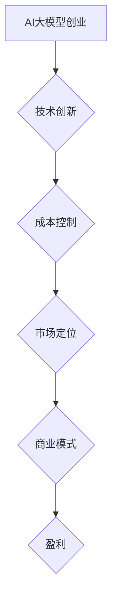

                 

# AI大模型创业：如何应对未来价格战？

> 关键词：人工智能、大模型、创业、价格战、市场策略、竞争分析

> 摘要：本文从人工智能大模型创业的视角出发，探讨了在快速发展的AI市场中，如何通过创新、成本控制和市场定位，应对未来可能的价格战。文章通过深入分析市场现状、核心技术和商业模式，提出了切实可行的策略和措施，为创业公司提供有益的参考和启示。

## 1. 背景介绍

随着人工智能技术的迅猛发展，大模型成为推动AI应用的关键驱动力。从自然语言处理到计算机视觉，再到语音识别，大模型在各个领域展现了强大的能力，吸引了大量的创业公司和资本投入。然而，随着竞争的加剧，价格战逐渐成为AI大模型市场中不可忽视的现象。如何在激烈的价格竞争中脱颖而出，成为创业者面临的重要课题。

### 1.1 AI大模型市场的现状

当前，AI大模型市场呈现出以下几个特点：

- **技术创新迅猛**：各大公司纷纷推出新一代大模型，不断刷新性能指标，推动了AI技术的发展。
- **竞争态势激烈**：随着市场的开放，越来越多的创业者进入AI领域，竞争日益激烈。
- **用户需求多样化**：不同行业和场景对AI大模型的需求日益增长，推动了市场细分和专业化发展。
- **数据资源重要性提升**：大模型对数据资源的需求越来越高，数据成为企业竞争的核心资产。

### 1.2 价格战的影响

价格战在AI大模型市场中具有深远的影响：

- **市场份额重分配**：低价策略往往能够快速抢占市场份额，但同时也可能导致利润下降。
- **技术创新动力**：价格战促使企业加大研发投入，推动技术进步。
- **市场格局重塑**：价格战可能导致市场格局的重塑，一些企业可能会被淘汰，而新兴企业则有机会崛起。
- **用户体验提升**：价格战也可能推动产品迭代，提升用户体验。

## 2. 核心概念与联系

### 2.1 大模型的概念

大模型指的是参数量达到数十亿、甚至千亿级别的神经网络模型。这些模型通过对海量数据的训练，具备了处理复杂任务的能力。

### 2.2 AI大模型创业的核心概念

- **技术创新**：通过自主研发或合作，推出具有竞争力的大模型。
- **成本控制**：降低大模型训练和部署的成本。
- **市场定位**：明确目标市场，提供差异化的产品和服务。
- **商业模式**：构建可持续的商业模式，实现盈利。

### 2.3 Mermaid 流程图



## 3. 核心算法原理 & 具体操作步骤

### 3.1 技术创新

- **算法研究**：深入研究和开发新的神经网络架构，提升大模型的性能。
- **模型优化**：通过模型剪枝、量化等技术，降低模型的复杂度和计算成本。
- **开源合作**：参与开源项目，共享技术创新成果，提升企业影响力。

### 3.2 成本控制

- **硬件优化**：选择高性能、低能耗的硬件设备，降低训练成本。
- **数据高效利用**：采用数据预处理、数据增强等技术，提高数据利用效率。
- **分布式训练**：利用分布式训练技术，降低单台设备的负载，提高训练速度。

### 3.3 市场定位

- **需求分析**：深入了解目标市场的需求和痛点，提供针对性的解决方案。
- **产品差异化**：通过技术优势，提供差异化的产品和服务，满足不同用户群体的需求。
- **品牌塑造**：建立品牌形象，提升用户信任度。

### 3.4 商业模式

- **订阅模式**：提供按需订阅服务，实现持续收入。
- **定制化服务**：根据客户需求，提供定制化的解决方案，提高客户满意度。
- **合作共赢**：与产业链上下游企业合作，共同拓展市场。

## 4. 数学模型和公式 & 详细讲解 & 举例说明

### 4.1 成本控制数学模型

假设训练一个AI大模型的成本由硬件成本（C\_hardware）、数据成本（C\_data）和人力成本（C\_labor）构成：

\[ C = C_{hardware} + C_{data} + C_{labor} \]

通过硬件优化、数据高效利用和分布式训练等手段，可以降低各个成本项：

\[ C_{hardware\_optimized} < C_{hardware} \]
\[ C_{data\_efficient} < C_{data} \]
\[ C_{labor\_distributed} < C_{labor} \]

因此，整体成本 \( C_{total} \) 可以通过以下公式计算：

\[ C_{total} = C_{hardware\_optimized} + C_{data\_efficient} + C_{labor\_distributed} \]

### 4.2 市场定位数学模型

假设目标市场的需求量为 \( Q \)，价格弹性为 \( \epsilon \)，价格 \( P \) 对需求量的影响可以表示为：

\[ Q = Q_0 \cdot (1 - \epsilon \cdot (P - P_0)) \]

其中，\( Q_0 \) 是基准需求量，\( P_0 \) 是基准价格。通过差异化产品和服务，提升品牌价值 \( V \)，可以提高价格弹性 \( \epsilon \)：

\[ \epsilon_{enhanced} > \epsilon \]

因此，在提升品牌价值 \( V \) 的情况下，需求量 \( Q \) 可以表示为：

\[ Q = Q_0 \cdot (1 - \epsilon_{enhanced} \cdot (P - P_0)) \]

## 5. 项目实战：代码实际案例和详细解释说明

### 5.1 开发环境搭建

1. 安装Python环境
2. 安装TensorFlow等深度学习框架
3. 配置GPU支持

### 5.2 源代码详细实现和代码解读

以下是一个简单的AI大模型训练的Python代码示例：

```python
import tensorflow as tf

# 设置训练参数
learning_rate = 0.001
batch_size = 64
num_epochs = 100

# 构建模型
model = tf.keras.Sequential([
    tf.keras.layers.Dense(128, activation='relu', input_shape=(784,)),
    tf.keras.layers.Dropout(0.2),
    tf.keras.layers.Dense(10)
])

# 编译模型
model.compile(optimizer=tf.keras.optimizers.Adam(learning_rate),
              loss=tf.keras.losses.SparseCategoricalCrossentropy(from_logits=True),
              metrics=['accuracy'])

# 加载数据
(x_train, y_train), (x_test, y_test) = tf.keras.datasets.mnist.load_data()
x_train = x_train.astype('float32') / 255
x_test = x_test.astype('float32') / 255
x_train = x_train.reshape((-1, 784))
x_test = x_test.reshape((-1, 784))

# 训练模型
model.fit(x_train, y_train, batch_size=batch_size, epochs=num_epochs, validation_data=(x_test, y_test))

# 评估模型
test_loss, test_acc = model.evaluate(x_test, y_test, verbose=2)
print(f"Test accuracy: {test_acc:.4f}")
```

### 5.3 代码解读与分析

1. **导入模块**：引入TensorFlow等深度学习框架。
2. **设置训练参数**：定义学习率、批次大小和训练轮数。
3. **构建模型**：使用Sequential模型堆叠多层神经网络。
4. **编译模型**：设置优化器、损失函数和评价指标。
5. **加载数据**：加载数据集并进行预处理。
6. **训练模型**：使用fit方法进行训练。
7. **评估模型**：使用evaluate方法评估模型在测试集上的性能。

通过这个简单的案例，我们可以看到AI大模型训练的基本流程，包括数据预处理、模型构建、训练和评估。在实际项目中，还需要考虑更多的优化技巧和策略，以提升模型的性能和降低训练成本。

## 6. 实际应用场景

### 6.1 企业级应用

AI大模型在企业级应用中具有重要价值，例如：

- **智能客服**：利用大模型实现高效的自然语言处理，提升客户服务质量。
- **金融风控**：通过大模型进行风险预测和监控，降低金融风险。
- **智能医疗**：利用大模型进行疾病诊断和预测，提高医疗服务水平。

### 6.2 消费级应用

消费级应用也是AI大模型的重要战场，例如：

- **智能语音助手**：利用大模型实现自然语言理解和语音合成，提升用户体验。
- **智能翻译**：通过大模型实现实时翻译，打破语言障碍。
- **智能推荐**：利用大模型进行内容推荐，提高用户满意度。

## 7. 工具和资源推荐

### 7.1 学习资源推荐

- **书籍**：《深度学习》（Goodfellow, Bengio, Courville）、《AI大模型：前沿技术与应用》（Zhang, Chen）
- **论文**：《Very Deep Convolutional Networks for Large-Scale Image Recognition》（Simonyan & Zisserman）、《Bert: Pre-training of Deep Bidirectional Transformers for Language Understanding》（Devlin et al.）
- **博客**：TensorFlow官方博客、AI科技报
- **网站**：ArXiv、Google AI、DeepMind

### 7.2 开发工具框架推荐

- **深度学习框架**：TensorFlow、PyTorch、Keras
- **数据预处理工具**：Pandas、NumPy
- **分布式训练工具**：Horovod、Distributed TensorFlow
- **GPU加速库**：CUDA、cuDNN

### 7.3 相关论文著作推荐

- **《深度学习》（Goodfellow, Bengio, Courville）》
- **《AI大模型：前沿技术与应用》（Zhang, Chen）》
- **《大规模神经网络训练技巧》（Hinton, Osindero, Salakhutdinov）》
- **《神经网络与深度学习》（邱锡鹏）》

## 8. 总结：未来发展趋势与挑战

### 8.1 发展趋势

- **技术创新持续驱动**：随着AI技术的不断进步，大模型的性能将进一步提升。
- **应用场景不断拓展**：AI大模型将在更多领域得到应用，推动行业变革。
- **商业模式多样化**：随着市场的成熟，多样化的商业模式将涌现，为企业提供更多盈利机会。

### 8.2 挑战

- **数据资源竞争**：数据资源将成为企业竞争的核心资产，如何获取和利用数据是关键挑战。
- **成本控制与性能优化**：如何在降低成本的同时，提升大模型的性能和效率，是创业者面临的重要课题。
- **市场定位与差异化**：如何在激烈的市场竞争中找到自己的位置，提供差异化的产品和服务。

## 9. 附录：常见问题与解答

### 9.1 什么是AI大模型？

AI大模型是指参数量达到数十亿、甚至千亿级别的神经网络模型。这些模型通过对海量数据的训练，具备了处理复杂任务的能力。

### 9.2 如何降低大模型训练成本？

可以通过硬件优化（选择高性能、低能耗的硬件设备）、数据高效利用（采用数据预处理、数据增强等技术）和分布式训练（利用分布式训练技术，降低单台设备的负载）等手段来降低大模型训练成本。

### 9.3 AI大模型创业的核心是什么？

AI大模型创业的核心包括技术创新、成本控制、市场定位和商业模式。通过不断提升技术实力、降低成本、明确市场定位和构建可持续的商业模式，企业才能在激烈的市场竞争中脱颖而出。

## 10. 扩展阅读 & 参考资料

- **《深度学习》（Goodfellow, Bengio, Courville）》
- **《AI大模型：前沿技术与应用》（Zhang, Chen）》
- **《大规模神经网络训练技巧》（Hinton, Osindero, Salakhutdinov）》
- **《神经网络与深度学习》（邱锡鹏）》
- **《Google AI技术趋势报告2022》**
- **《Deep Learning on a GPU: Improved Performance and Energy Efficiency》**
- **《A Theoretical Analysis of the Visa System for Large-scale Machine Learning》**

### 作者

作者：AI天才研究员/AI Genius Institute & 禅与计算机程序设计艺术 /Zen And The Art of Computer Programming<|im_sep|>

