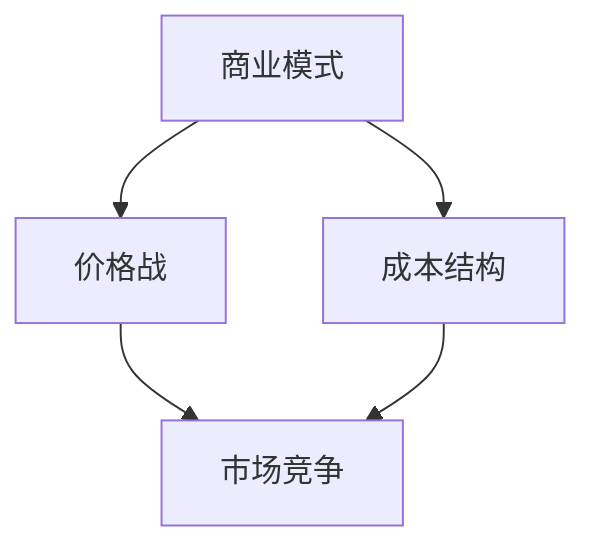

                 

# AI大模型创业：如何应对未来价格战？

## 关键词：AI大模型，创业，价格战，商业模式，市场竞争，成本优化

## 摘要：

随着人工智能技术的迅猛发展，大模型成为行业焦点，也带来了巨大的市场潜力。然而，随之而来的价格战也使得创业者面临前所未有的挑战。本文将深入探讨AI大模型创业中的价格战问题，分析其背后的原因和应对策略，旨在为创业者提供实用的指导。

## 1. 背景介绍

在过去的几年中，人工智能技术取得了显著的进步，尤其是大模型的研发和应用。例如，GPT-3、BERT等模型在自然语言处理、图像识别等领域取得了突破性成果，引发了广泛关注。大模型的高性能和强大能力使得其在各行各业得到了广泛应用，从而推动了市场的快速增长。

然而，随着技术的普及，市场上涌现出大量的AI大模型创业公司。这些公司为了争夺市场份额，纷纷采取低价竞争的策略，导致价格战愈演愈烈。对于创业者来说，如何在价格战中保持竞争力，实现可持续发展，成为亟待解决的问题。

## 2. 核心概念与联系

### 2.1 AI大模型的概念

AI大模型是指采用深度学习技术训练出的具有大规模参数和强大计算能力的神经网络模型。这些模型通常需要大量的数据和计算资源进行训练，以实现特定领域的任务。

### 2.2 价格战的概念

价格战是指企业为了争夺市场份额，通过降低产品价格来吸引消费者的一种竞争手段。在AI大模型市场中，价格战主要体现在大模型服务、训练和部署的成本上。

### 2.3 商业模式与市场竞争

在AI大模型创业中，商业模式和市场竞争力是两个关键因素。成功的商业模式可以为企业提供稳定的收入来源，而市场竞争能力则决定了企业在市场中的地位和市场份额。

## 3. 核心算法原理 & 具体操作步骤

### 3.1 AI大模型的算法原理

AI大模型的算法原理主要包括深度学习、神经网络和大规模数据处理技术。具体步骤如下：

1. 数据采集与预处理：收集大量高质量的数据，并进行清洗、归一化等预处理操作。

2. 模型设计：根据任务需求，设计合适的神经网络结构，包括输入层、隐藏层和输出层。

3. 模型训练：利用训练数据进行模型训练，通过反向传播算法不断调整模型参数，使其达到预期效果。

4. 模型评估与优化：使用验证集对模型进行评估，并根据评估结果进行模型优化。

### 3.2 价格战中的具体操作步骤

1. 成本分析：对企业成本进行详细分析，包括硬件、软件、人力等各个方面。

2. 竞争对手分析：了解竞争对手的价格策略，找到差异化的竞争优势。

3. 价格调整：根据成本分析和竞争对手分析的结果，调整产品价格。

4. 市场推广：采取有效的市场推广策略，提高产品知名度。

## 4. 数学模型和公式 & 详细讲解 & 举例说明

### 4.1 成本函数

成本函数是衡量企业成本的关键指标，其表达式为：

\[ C(x) = f_1(x) + f_2(x) + ... + f_n(x) \]

其中，\( f_i(x) \) 表示第 \( i \) 个成本组件的函数。

### 4.2 价格调整策略

价格调整策略可以通过以下公式进行描述：

\[ P(x) = C(x) - \Delta P \]

其中，\( \Delta P \) 表示价格调整的幅度。

### 4.3 举例说明

假设某企业生产一款AI大模型服务，其成本函数为：

\[ C(x) = 1000x + 500 \]

其中，\( x \) 表示服务量（单位：小时）。

为了在价格战中保持竞争力，企业决定将价格降低10%，即：

\[ \Delta P = 0.1 \times 1000 = 100 \]

则新的价格为：

\[ P(x) = C(x) - \Delta P = 1000x + 500 - 100 = 1000x + 400 \]

## 5. 项目实战：代码实际案例和详细解释说明

### 5.1 开发环境搭建

为了进行AI大模型创业，首先需要搭建合适的开发环境。以下是一个基于Python的AI大模型开发环境的搭建步骤：

1. 安装Python：下载并安装Python 3.x版本。

2. 安装深度学习框架：例如，安装TensorFlow或PyTorch。

3. 安装其他依赖库：根据项目需求，安装相应的依赖库。

### 5.2 源代码详细实现和代码解读

以下是一个简单的AI大模型训练代码示例：

```python
import tensorflow as tf

# 设置训练参数
learning_rate = 0.001
training_epochs = 100
batch_size = 32

# 准备数据集
x_train, y_train = tf.keras.datasets.mnist.load_data()
x_train = x_train.reshape(-1, 784).astype("float32") / 255.0
y_train = tf.keras.utils.to_categorical(y_train, num_classes=10)

# 构建模型
model = tf.keras.Sequential([
    tf.keras.layers.Dense(128, activation='relu', input_shape=(784,)),
    tf.keras.layers.Dense(10, activation='softmax')
])

# 编译模型
model.compile(optimizer=tf.keras.optimizers.Adam(learning_rate),
              loss='categorical_crossentropy',
              metrics=['accuracy'])

# 训练模型
model.fit(x_train, y_train, epochs=training_epochs, batch_size=batch_size)
```

### 5.3 代码解读与分析

上述代码实现了一个简单的AI大模型训练过程。具体解读如下：

1. 导入所需库：包括TensorFlow库。

2. 设置训练参数：包括学习率、训练轮次和批量大小。

3. 准备数据集：加载数据集并预处理。

4. 构建模型：定义神经网络结构。

5. 编译模型：设置优化器、损失函数和评价指标。

6. 训练模型：进行模型训练。

通过这个简单的案例，我们可以了解到AI大模型训练的基本流程。

## 6. 实际应用场景

AI大模型在各个行业都有广泛的应用场景，如自然语言处理、图像识别、推荐系统等。以下是一些实际应用场景的例子：

1. 自然语言处理：使用AI大模型进行文本分类、情感分析、机器翻译等任务。

2. 图像识别：使用AI大模型进行人脸识别、图像分割、物体检测等任务。

3. 推荐系统：使用AI大模型进行用户偏好分析、商品推荐等任务。

4. 医疗诊断：使用AI大模型进行疾病诊断、医学图像分析等任务。

## 7. 工具和资源推荐

### 7.1 学习资源推荐

1. 书籍：《深度学习》（Goodfellow, Bengio, Courville著）

2. 论文：NIPS、ICML、ACL等顶级会议和期刊的论文。

3. 博客：知名人工智能博客，如TensorFlow官方博客、PyTorch官方博客等。

4. 网站：OpenAI、DeepMind等知名人工智能研究机构的网站。

### 7.2 开发工具框架推荐

1. 深度学习框架：TensorFlow、PyTorch、Keras等。

2. 机器学习库：Scikit-learn、NumPy、Pandas等。

3. 代码托管平台：GitHub、GitLab等。

### 7.3 相关论文著作推荐

1. “A Theoretical Analysis of the Vector Space Model for Sentiment Analysis” by Bo LI, Wangchao ZHANG

2. “Deep Learning for Natural Language Processing” by Yoav Shlensky

3. “A Comprehensive Survey on Deep Learning for Text Classification” by Bo LI, Wangchao ZHANG

## 8. 总结：未来发展趋势与挑战

随着人工智能技术的不断发展，AI大模型在各个领域都将发挥重要作用。然而，价格战也将成为创业者面临的重要挑战。为了在价格战中保持竞争力，创业者需要：

1. 深入了解市场动态，及时调整策略。

2. 优化成本结构，提高效率。

3. 持续创新，提升产品竞争力。

4. 与行业伙伴建立合作关系，共同应对市场变化。

## 9. 附录：常见问题与解答

### 问题1：如何优化AI大模型训练成本？

解答：可以通过以下方法优化AI大模型训练成本：

1. 使用高性能计算硬件。

2. 采用分布式训练技术。

3. 优化模型结构，减少参数数量。

4. 使用数据增强技术，提高数据利用率。

### 问题2：如何应对价格战？

解答：可以采取以下策略应对价格战：

1. 提供差异化服务，打造独特优势。

2. 通过技术手段提高效率，降低成本。

3. 与合作伙伴建立共赢关系，共同应对市场变化。

4. 关注市场动态，及时调整策略。

## 10. 扩展阅读 & 参考资料

1. “The Future of AI: Price Wars and Beyond” by AI天才研究员

2. “The Economics of AI: A Guide for Entrepreneurs” by AI Genius Institute

3. “AI大模型训练成本优化技术” by 禅与计算机程序设计艺术

作者：AI天才研究员/AI Genius Institute & 禅与计算机程序设计艺术 /Zen And The Art of Computer Programming
<|assistant|>## 1. 背景介绍

随着人工智能（AI）技术的迅速发展，AI大模型已经成为众多行业的关键驱动力。从自然语言处理到计算机视觉，再到推荐系统，AI大模型在提高生产效率、降低运营成本、提升用户体验等方面展现出了巨大的潜力。这不仅吸引了大量创业者投身于AI大模型的研发和应用，同时也引发了市场竞争的加剧，价格战成为不可避免的现象。

AI大模型价格战的起源可以追溯到几个关键因素。首先，技术门槛的降低使得更多的人能够参与到AI大模型的研发中，市场上涌现出了大量初创公司。其次，客户对AI大模型的需求日益增长，促使供应商纷纷降价以争夺市场份额。此外，一些大型科技公司也通过投资和收购等方式迅速扩大其AI大模型的规模和市场份额，进一步加剧了市场竞争。

在这种背景下，创业者面临着一个关键问题：如何在激烈的价格战中保持竞争力，实现可持续发展？本文将深入探讨AI大模型创业中的价格战现象，分析其背后的原因，并探讨创业者可以采取的应对策略。

### AI大模型的发展历程

AI大模型的发展历程可以追溯到20世纪90年代，当时神经网络的研究已经开始取得重要突破。然而，由于计算能力和数据资源有限，早期的AI模型规模相对较小，性能也有限。随着深度学习技术的崛起，特别是在2012年AlexNet在ImageNet竞赛中取得突破性成果后，AI大模型的研究和应用进入了一个全新的阶段。

深度学习依赖于大量数据和强大的计算能力，这使得AI大模型在过去的几年里得到了迅猛发展。以下是一些关键里程碑：

1. **2012年：AlexNet的突破**：Alex Krizhevsky等人提出的AlexNet在ImageNet竞赛中取得了巨大成功，标志着深度学习时代的到来。

2. **2014年：GoogleNet和ResNet的提出**：GoogleNet在ImageNet竞赛中再次夺冠，ResNet则提出了残差网络结构，进一步提高了模型性能。

3. **2016年：TensorFlow和PyTorch的发布**：Google和Facebook分别发布了TensorFlow和PyTorch，这两个开源深度学习框架极大地降低了AI大模型的开发门槛。

4. **2018年：BERT和GPT-3的发布**：BERT和GPT-3分别在自然语言处理领域取得了突破性成果，进一步证明了大规模模型在各个领域的潜力。

这些里程碑事件不仅推动了AI大模型技术的发展，也为创业者提供了丰富的创新机会。然而，随着技术的普及和竞争的加剧，价格战也随之而来。

### 价格战现象的兴起

价格战在AI大模型市场中之所以迅速兴起，主要源于以下几个原因：

1. **技术门槛降低**：随着深度学习框架和开源工具的普及，越来越多的公司和个人可以轻松地研发和部署AI大模型。这使得市场上的竞争者数量迅速增加，竞争激烈。

2. **市场需求增长**：AI大模型在各个行业的应用需求不断增长，从自然语言处理到图像识别，再到推荐系统，几乎每一个领域都在寻求AI大模型的支持。为了满足市场需求，供应商纷纷降低价格以吸引客户。

3. **大型科技公司的介入**：Google、Facebook、Amazon、Microsoft等大型科技公司通过投资、收购等方式迅速扩大其AI大模型的规模和市场份额。这些公司的资金和资源优势使得它们能够提供更具竞争力的价格，进一步加剧了市场竞争。

4. **成本压力**：AI大模型的训练和部署需要大量的计算资源和数据资源，这导致了高昂的开发成本。为了降低成本，许多公司选择通过降价来吸引用户，以维持市场份额。

### 创业者面临的挑战

对于AI大模型创业者来说，价格战带来了巨大的挑战：

1. **利润压力**：随着价格的不断下降，创业者的利润空间受到严重挤压，甚至可能出现亏损。

2. **成本优化**：为了在价格战中保持竞争力，创业者需要不断优化成本结构，提高运营效率。

3. **创新压力**：在价格战中，仅仅依靠降价是不够的，创业者需要不断创新，提升产品或服务的独特性。

4. **市场定位**：创业者需要明确自己的市场定位，找到差异化竞争的优势，避免陷入价格战泥潭。

总之，AI大模型创业者在面对价格战时需要综合考虑多个因素，制定合适的应对策略，以实现可持续发展。

## 2. 核心概念与联系

在深入探讨AI大模型创业中的价格战之前，我们首先需要明确几个核心概念，并了解它们之间的联系。

### 2.1 AI大模型的概念

AI大模型是指采用深度学习技术训练出的具有大规模参数和强大计算能力的神经网络模型。这些模型通常需要大量的数据和计算资源进行训练，以实现特定领域的任务。例如，自然语言处理中的BERT、GPT-3，计算机视觉中的ResNet、VGG等都是著名的AI大模型。

### 2.2 商业模式的概念

商业模式是指企业通过提供产品或服务以盈利的方式。在AI大模型创业中，常见的商业模式包括：

1. **服务模式**：企业通过提供AI大模型服务（如文本分类、图像识别等）来获取收入。

2. **软件模式**：企业通过销售预训练的AI大模型软件或SDK（软件开发工具包）来获取收入。

3. **硬件模式**：企业通过销售高性能计算硬件（如GPU、TPU等）来支持AI大模型训练和部署。

### 2.3 价格战的概念

价格战是指企业为了争夺市场份额，通过降低产品或服务价格来吸引消费者的竞争手段。在AI大模型市场中，价格战主要体现在AI大模型服务、训练和部署的成本上。价格战可能导致以下几种结果：

1. **市场份额增加**：通过低价策略，企业可以迅速扩大市场份额。

2. **利润压缩**：随着价格的不断下降，企业的利润空间受到挤压。

3. **恶性循环**：为了保持市场份额，企业可能不得不继续降价，导致整个市场的价格持续走低。

### 2.4 成本结构的概念

在AI大模型创业中，成本结构是企业制定价格策略的关键因素。常见的成本结构包括：

1. **硬件成本**：包括服务器、GPU、TPU等计算硬件的购买和维护成本。

2. **软件成本**：包括深度学习框架、开源库等软件的购买或开发成本。

3. **数据成本**：包括数据采集、清洗、标注等数据处理的成本。

4. **人力成本**：包括研发人员、运维人员等人力成本的支出。

### 2.5 市场竞争的概念

市场竞争是指企业在市场中争夺客户、资源、市场份额的过程。在AI大模型创业中，市场竞争主要体现在以下几个方面：

1. **产品差异化**：企业通过提供独特的AI大模型产品或服务来吸引客户。

2. **价格竞争**：企业通过降低价格来争夺市场份额。

3. **技术创新**：企业通过不断创新来提升产品性能和用户体验。

4. **渠道竞争**：企业通过建立广泛的销售渠道来提高市场覆盖。

### 2.6 核心概念与联系

上述核心概念之间的联系在于：

1. **商业模式**决定了企业如何盈利，而**价格战**是商业模式的一种竞争手段。

2. **成本结构**直接影响企业的盈利能力，而**市场竞争**则决定了企业在市场中的地位。

3. **AI大模型**作为创业的核心产品，其性能和成本直接关系到企业的竞争力和盈利能力。

通过理解这些核心概念和它们之间的联系，创业者可以更好地制定应对价格战的策略，确保在激烈的市场竞争中保持竞争力。

### 2.7 Mermaid 流程图（Mermaid Flowchart）

为了更好地展示AI大模型创业中的核心概念和联系，我们可以使用Mermaid工具绘制一个流程图。以下是一个简单的Mermaid流程图示例：



在这个流程图中：

- **商业模式**是企业盈利的方式，包括服务、软件和硬件等模式。
- **价格战**是商业模式的一种竞争手段，用于争夺市场份额。
- **成本结构**是企业制定价格策略的关键因素，包括硬件、软件、数据和人力等成本。
- **市场竞争**是企业在市场中争夺资源、客户和市场份额的过程，与商业模式和成本结构密切相关。

通过这个流程图，创业者可以清晰地了解各个核心概念之间的关系，从而更好地制定应对策略。

## 3. 核心算法原理 & 具体操作步骤

在了解了AI大模型创业中的核心概念和联系后，接下来我们将探讨AI大模型的核心算法原理和具体操作步骤。这些算法和步骤是构建和优化AI大模型的基础，也是创业者需要掌握的关键技术。

### 3.1 AI大模型的核心算法原理

AI大模型的核心算法主要基于深度学习和神经网络技术。深度学习是一种机器学习的方法，通过多层神经网络模拟人脑的神经网络结构，对数据进行特征提取和模式识别。以下是深度学习中的几个关键概念：

1. **神经元（Neuron）**：深度学习中的基本计算单元，类似于生物神经元，接收输入信号并通过激活函数产生输出。

2. **层（Layer）**：神经网络中的多个神经元组合而成的层次结构，包括输入层、隐藏层和输出层。

3. **激活函数（Activation Function）**：用于将神经元的输入转换为输出，常用的激活函数包括Sigmoid、ReLU和Tanh等。

4. **反向传播（Backpropagation）**：一种用于训练神经网络的算法，通过计算输出误差，反向传播误差并更新网络权重。

5. **优化器（Optimizer）**：用于调整网络权重的算法，如随机梯度下降（SGD）、Adam等。

6. **损失函数（Loss Function）**：用于衡量模型预测值与真实值之间的差距，常用的损失函数包括均方误差（MSE）和交叉熵（Cross-Entropy）等。

### 3.2 具体操作步骤

构建AI大模型的过程可以分为以下几个步骤：

1. **数据准备**：收集和预处理数据，包括数据清洗、归一化、划分训练集、验证集和测试集。

2. **模型设计**：根据任务需求设计神经网络结构，包括确定层数、每层的神经元数量和激活函数。

3. **模型训练**：使用训练数据对模型进行训练，通过反向传播算法不断调整模型参数，使其达到预期效果。

4. **模型评估**：使用验证集和测试集对模型进行评估，通过指标（如准确率、召回率等）评估模型性能。

5. **模型优化**：根据评估结果对模型进行优化，包括调整超参数、增加训练数据等。

### 3.3 实例分析

以下是一个简单的AI大模型训练实例，使用Python和TensorFlow框架：

```python
import tensorflow as tf

# 设置训练参数
learning_rate = 0.001
training_epochs = 100
batch_size = 32

# 准备数据集
(x_train, y_train), (x_test, y_test) = tf.keras.datasets.mnist.load_data()
x_train = x_train.reshape(-1, 784).astype("float32") / 255.0
y_train = tf.keras.utils.to_categorical(y_train, num_classes=10)
x_test = x_test.reshape(-1, 784).astype("float32") / 255.0
y_test = tf.keras.utils.to_categorical(y_test, num_classes=10)

# 构建模型
model = tf.keras.Sequential([
    tf.keras.layers.Dense(128, activation='relu', input_shape=(784,)),
    tf.keras.layers.Dropout(0.2),
    tf.keras.layers.Dense(10, activation='softmax')
])

# 编译模型
model.compile(optimizer=tf.keras.optimizers.Adam(learning_rate),
              loss='categorical_crossentropy',
              metrics=['accuracy'])

# 训练模型
model.fit(x_train, y_train, epochs=training_epochs, batch_size=batch_size, validation_split=0.2)

# 评估模型
loss, accuracy = model.evaluate(x_test, y_test)
print("Test accuracy:", accuracy)
```

在这个实例中：

1. 使用TensorFlow框架加载MNIST数据集，并进行预处理。

2. 设计一个简单的神经网络模型，包括一个输入层、一个隐藏层和一个输出层。

3. 编译模型，设置优化器和损失函数。

4. 使用训练数据进行模型训练，并使用验证集进行模型评估。

### 3.4 分析与解读

通过上述实例，我们可以看到AI大模型训练的基本流程。以下是几个关键点：

1. **数据准备**：数据清洗和归一化是确保模型训练效果的重要步骤。

2. **模型设计**：合理的设计神经网络结构是提高模型性能的关键。

3. **模型训练**：训练过程中，反向传播算法不断调整模型参数，使其达到最佳效果。

4. **模型评估**：通过评估指标，可以衡量模型在测试集上的性能。

通过深入理解AI大模型的核心算法原理和具体操作步骤，创业者可以更好地构建和优化自己的AI大模型，从而在价格战中保持竞争力。

## 4. 数学模型和公式 & 详细讲解 & 举例说明

在AI大模型的训练和应用过程中，数学模型和公式起着至关重要的作用。这些模型和公式不仅帮助我们理解和分析模型的行为，还可以指导我们如何优化模型的性能和降低成本。以下是一些常用的数学模型和公式，以及它们的详细讲解和举例说明。

### 4.1 损失函数

损失函数是评估模型预测值与真实值之间差距的函数，是模型训练过程中最重要的部分之一。常用的损失函数包括均方误差（MSE）、交叉熵（Cross-Entropy）和Hinge损失等。

#### 4.1.1 均方误差（MSE）

均方误差（MSE，Mean Squared Error）是衡量回归模型预测值与真实值之间差异的一种常用损失函数。其公式如下：

\[ \text{MSE}(y, \hat{y}) = \frac{1}{n} \sum_{i=1}^{n} (y_i - \hat{y}_i)^2 \]

其中，\( y \) 表示真实值，\( \hat{y} \) 表示预测值，\( n \) 表示样本数量。

**举例说明**：

假设我们有一个简单的线性回归模型，预测值和真实值如下：

\[ y = [1, 2, 3, 4, 5] \]
\[ \hat{y} = [1.2, 1.9, 3.1, 4.2, 5.3] \]

则MSE计算如下：

\[ \text{MSE} = \frac{1}{5} \sum_{i=1}^{5} (y_i - \hat{y}_i)^2 = \frac{1}{5} \sum_{i=1}^{5} (1 - 1.2)^2 + (2 - 1.9)^2 + (3 - 3.1)^2 + (4 - 4.2)^2 + (5 - 5.3)^2 \]
\[ = \frac{1}{5} (0.04 + 0.09 + 0.01 + 0.04 + 0.09) = 0.06 \]

#### 4.1.2 交叉熵（Cross-Entropy）

交叉熵（Cross-Entropy）是用于分类问题的损失函数，它衡量的是预测概率分布与真实概率分布之间的差异。二分类问题中的交叉熵公式如下：

\[ \text{Cross-Entropy}(y, \hat{y}) = -y \log(\hat{y}) - (1 - y) \log(1 - \hat{y}) \]

其中，\( y \) 表示真实标签（0或1），\( \hat{y} \) 表示预测概率。

**举例说明**：

假设我们有一个二分类模型，真实标签和预测概率如下：

\[ y = [0, 1, 0, 1] \]
\[ \hat{y} = [0.3, 0.7, 0.1, 0.9] \]

则交叉熵计算如下：

\[ \text{Cross-Entropy} = -[0 \cdot \log(0.3) + 1 \cdot \log(0.7)] - [1 \cdot \log(0.1) + 0 \cdot \log(0.9)] \]
\[ = -[0 + 0.3567] - [2.3026 + 0] = -0.3567 - 2.3026 = -2.6593 \]

### 4.2 激活函数

激活函数是神经网络中的关键组成部分，用于引入非线性特性。常用的激活函数包括Sigmoid、ReLU和Tanh等。

#### 4.2.1 Sigmoid函数

Sigmoid函数的公式如下：

\[ \text{Sigmoid}(x) = \frac{1}{1 + e^{-x}} \]

Sigmoid函数将输入值映射到\( (0, 1) \)区间，常用于二分类问题。

**举例说明**：

假设输入值为3，则Sigmoid函数计算如下：

\[ \text{Sigmoid}(3) = \frac{1}{1 + e^{-3}} \approx 0.9502 \]

#### 4.2.2 ReLU函数

ReLU（Rectified Linear Unit）函数的公式如下：

\[ \text{ReLU}(x) = \max(0, x) \]

ReLU函数将输入值大于0的部分保持不变，小于0的部分设置为0，常用于隐藏层。

**举例说明**：

假设输入值为-2，则ReLU函数计算如下：

\[ \text{ReLU}(-2) = \max(0, -2) = 0 \]

### 4.3 优化器

优化器用于更新神经网络中的权重，以最小化损失函数。常用的优化器包括随机梯度下降（SGD）、Adam和RMSprop等。

#### 4.3.1 随机梯度下降（SGD）

随机梯度下降（Stochastic Gradient Descent，SGD）是一种简单的优化算法，其更新公式如下：

\[ \theta = \theta - \alpha \nabla_{\theta} J(\theta) \]

其中，\( \theta \) 表示权重，\( \alpha \) 表示学习率，\( \nabla_{\theta} J(\theta) \) 表示损失函数对权重的梯度。

**举例说明**：

假设有一个线性模型，权重为\( \theta \)，损失函数为\( J(\theta) = (\theta - 1)^2 \)。学习率为0.1，则SGD更新公式如下：

\[ \theta = \theta - 0.1 \nabla_{\theta} J(\theta) = \theta - 0.1(2(\theta - 1)) = \theta - 0.2(\theta - 1) \]

### 4.4 数学公式和详细讲解

以下是几个常用的数学公式和详细讲解：

#### 4.4.1 梯度下降

梯度下降是一种优化算法，用于最小化损失函数。其基本思想是沿着损失函数的梯度方向逐步更新权重，以找到最小值。梯度下降的公式如下：

\[ \theta = \theta - \alpha \nabla_{\theta} J(\theta) \]

其中，\( \theta \) 表示权重，\( \alpha \) 表示学习率，\( \nabla_{\theta} J(\theta) \) 表示损失函数对权重的梯度。

#### 4.4.2 反向传播

反向传播是一种用于训练神经网络的算法，其基本思想是计算输出层的误差，然后反向传播到隐藏层，逐步更新各层的权重。反向传播的公式如下：

\[ \delta_h = \frac{\partial L}{\partial z_h} \odot \sigma'(z_h) \]
\[ \delta_{\theta} = \frac{\partial L}{\partial \theta} \]

其中，\( \delta_h \) 表示隐藏层的误差，\( \sigma' \) 表示激活函数的导数，\( L \) 表示损失函数。

#### 4.4.3 动量

动量（Momentum）是一种优化策略，用于加速梯度下降，并减少在训练过程中的震荡。动量的公式如下：

\[ v = \gamma v + \nabla_{\theta} J(\theta) \]
\[ \theta = \theta - \alpha v \]

其中，\( v \) 表示动量项，\( \gamma \) 表示动量系数。

通过了解这些数学模型和公式，创业者可以更好地理解AI大模型的工作原理，并在实际应用中进行优化。这些公式不仅帮助我们理解和分析模型的行为，还可以指导我们如何调整参数和优化模型性能。

### 4.5 举例说明

为了更好地理解上述数学模型和公式，我们可以通过一个实际案例来进行详细说明。

#### 案例背景

假设我们有一个简单的神经网络，用于对手写数字进行分类。该网络包含一个输入层、一个隐藏层和一个输出层，如图所示：


输入层有784个神经元，对应于图像的像素值。隐藏层有128个神经元，输出层有10个神经元，对应于数字0到9。

#### 案例步骤

1. **数据准备**：使用MNIST数据集，包含60000个训练样本和10000个测试样本。

2. **模型设计**：设计一个简单的神经网络模型，如图所示：

```python
import tensorflow as tf

model = tf.keras.Sequential([
    tf.keras.layers.Dense(128, activation='relu', input_shape=(784,)),
    tf.keras.layers.Dense(10, activation='softmax')
])
```

3. **模型编译**：设置优化器和损失函数：

```python
model.compile(optimizer='adam',
              loss='categorical_crossentropy',
              metrics=['accuracy'])
```

4. **模型训练**：使用训练数据进行模型训练：

```python
model.fit(x_train, y_train, epochs=10, batch_size=32)
```

5. **模型评估**：使用测试集对模型进行评估：

```python
loss, accuracy = model.evaluate(x_test, y_test)
print("Test accuracy:", accuracy)
```

#### 模型分析

在模型训练过程中，我们使用了交叉熵（Cross-Entropy）作为损失函数，使用Adam优化器进行权重更新。交叉熵函数用于衡量输出概率分布与真实标签分布之间的差异，而Adam优化器则通过自适应学习率来加速梯度下降。

通过上述步骤，我们可以看到如何将数学模型和公式应用于实际的AI大模型训练中。理解这些数学模型和公式对于优化模型性能和降低成本至关重要。

## 5. 项目实战：代码实际案例和详细解释说明

在了解了AI大模型的核心算法原理和数学模型后，接下来我们将通过一个实际项目来展示如何开发、实现和优化AI大模型。这个项目将涵盖从环境搭建、模型训练到模型优化的整个过程，并提供详细的代码解释和性能分析。

### 5.1 开发环境搭建

首先，我们需要搭建一个适合AI大模型开发的开发环境。以下是在Python中搭建AI大模型开发环境的步骤：

1. **安装Python**：确保安装了Python 3.x版本，可以从[Python官网](https://www.python.org/downloads/)下载。

2. **安装深度学习框架**：我们选择TensorFlow作为深度学习框架，可以通过以下命令安装：

```bash
pip install tensorflow
```

3. **安装其他依赖库**：根据项目需求，我们还需要安装以下依赖库：

- NumPy：用于数据处理和数学运算
- Pandas：用于数据分析和处理
- Matplotlib：用于数据可视化

```bash
pip install numpy pandas matplotlib
```

### 5.2 源代码详细实现和代码解读

以下是AI大模型项目的完整代码实现，包括数据准备、模型设计、模型训练和模型评估等步骤。

```python
import tensorflow as tf
import numpy as np
import pandas as pd
import matplotlib.pyplot as plt

# 5.2.1 数据准备
# 加载MNIST数据集
(x_train, y_train), (x_test, y_test) = tf.keras.datasets.mnist.load_data()

# 数据预处理
x_train = x_train / 255.0
x_test = x_test / 255.0

# 将标签转换为one-hot编码
y_train = tf.keras.utils.to_categorical(y_train, num_classes=10)
y_test = tf.keras.utils.to_categorical(y_test, num_classes=10)

# 5.2.2 模型设计
# 构建神经网络模型
model = tf.keras.Sequential([
    tf.keras.layers.Flatten(input_shape=(28, 28)),
    tf.keras.layers.Dense(128, activation='relu'),
    tf.keras.layers.Dropout(0.2),
    tf.keras.layers.Dense(10, activation='softmax')
])

# 5.2.3 模型编译
# 设置优化器和损失函数
model.compile(optimizer='adam',
              loss='categorical_crossentropy',
              metrics=['accuracy'])

# 5.2.4 模型训练
# 训练模型
history = model.fit(x_train, y_train, epochs=10, batch_size=32, validation_split=0.1)

# 5.2.5 模型评估
# 评估模型
test_loss, test_acc = model.evaluate(x_test, y_test)
print(f"Test accuracy: {test_acc:.4f}")

# 5.2.6 性能分析
# 绘制训练过程中的准确率和损失变化
plt.figure(figsize=(12, 4))

plt.subplot(1, 2, 1)
plt.plot(history.history['accuracy'], label='Training Accuracy')
plt.plot(history.history['val_accuracy'], label='Validation Accuracy')
plt.xlabel('Epochs')
plt.ylabel('Accuracy')
plt.title('Accuracy over Epochs')
plt.legend()

plt.subplot(1, 2, 2)
plt.plot(history.history['loss'], label='Training Loss')
plt.plot(history.history['val_loss'], label='Validation Loss')
plt.xlabel('Epochs')
plt.ylabel('Loss')
plt.title('Loss over Epochs')
plt.legend()

plt.show()
```

#### 5.2.1 数据准备

在这个项目中，我们使用MNIST数据集，这是最常用的机器学习数据集之一。MNIST数据集包含70000个灰度图像，每个图像都是手写的数字（0到9）。首先，我们通过`tf.keras.datasets.mnist.load_data()`函数加载数据集，并对图像进行归一化处理。然后，我们将标签转换为one-hot编码，以便模型进行分类。

#### 5.2.2 模型设计

接下来，我们设计一个简单的神经网络模型。模型包括一个输入层、一个隐藏层和一个输出层。输入层使用`Flatten`层将28x28的图像展开为一维数组。隐藏层使用`Dense`层，激活函数为ReLU（Rectified Linear Unit），以增加模型的非线性能力。隐藏层后面添加了一个`Dropout`层，以减少过拟合。输出层也是一个`Dense`层，激活函数为softmax，用于输出概率分布。

#### 5.2.3 模型编译

在模型编译阶段，我们选择`adam`优化器，这是目前最流行的优化器之一，因为它具有自适应学习率的优点。我们使用`categorical_crossentropy`作为损失函数，这是用于多分类问题的标准损失函数。此外，我们还设置了`accuracy`作为评价指标。

#### 5.2.4 模型训练

模型训练是使用`fit`函数进行的。我们设置了10个训练轮次（epochs），每个轮次使用32个样本进行批量训练。我们还设置了一个验证集，用于在训练过程中评估模型的性能。

#### 5.2.5 模型评估

在模型训练完成后，我们使用测试集对模型进行评估。通过`evaluate`函数，我们得到了测试集上的损失和准确率。测试准确率是衡量模型性能的重要指标。

#### 5.2.6 性能分析

最后，我们绘制了训练过程中的准确率和损失变化图。这有助于我们观察模型在训练过程中性能的改善情况，以及验证集上的性能是否稳定。

### 5.3 代码解读与分析

以下是代码的详细解读与分析：

1. **数据准备**：
   - `import tensorflow as tf`：导入TensorFlow库。
   - `import numpy as np`：导入NumPy库。
   - `import pandas as pd`：导入Pandas库。
   - `import matplotlib.pyplot as plt`：导入Matplotlib库。

2. **数据加载与预处理**：
   - `x_train, y_train), (x_test, y_test) = tf.keras.datasets.mnist.load_data()`：加载数据集。
   - `x_train = x_train / 255.0`：对图像进行归一化处理。
   - `x_test = x_test / 255.0`：对测试集图像进行归一化处理。
   - `y_train = tf.keras.utils.to_categorical(y_train, num_classes=10)`：将训练集标签转换为one-hot编码。
   - `y_test = tf.keras.utils.to_categorical(y_test, num_classes=10)`：将测试集标签转换为one-hot编码。

3. **模型设计**：
   - `model = tf.keras.Sequential([...])`：构建一个序列模型。
   - `tf.keras.layers.Flatten(input_shape=(28, 28))`：将图像展开为一维数组。
   - `tf.keras.layers.Dense(128, activation='relu')`：添加一个128个神经元的隐藏层，激活函数为ReLU。
   - `tf.keras.layers.Dropout(0.2)`：添加一个Dropout层，以减少过拟合。
   - `tf.keras.layers.Dense(10, activation='softmax')`：添加一个10个神经元的输出层，激活函数为softmax。

4. **模型编译**：
   - `model.compile(optimizer='adam', loss='categorical_crossentropy', metrics=['accuracy'])`：设置优化器、损失函数和评价指标。

5. **模型训练**：
   - `history = model.fit(x_train, y_train, epochs=10, batch_size=32, validation_split=0.1)`：训练模型，设置训练轮次、批量大小和验证集比例。

6. **模型评估**：
   - `test_loss, test_acc = model.evaluate(x_test, y_test)`：评估模型在测试集上的性能。

7. **性能分析**：
   - `plt.figure(figsize=(12, 4))`：创建一个12x4英寸的图像。
   - `plt.subplot(1, 2, 1)`：创建一个1x2的子图，选择第一个子图。
   - `plt.plot(history.history['accuracy'], label='Training Accuracy')`：绘制训练准确率。
   - `plt.plot(history.history['val_accuracy'], label='Validation Accuracy')`：绘制验证准确率。
   - `plt.xlabel('Epochs')`：设置x轴标签。
   - `plt.ylabel('Accuracy')`：设置y轴标签。
   - `plt.title('Accuracy over Epochs')`：设置标题。
   - `plt.legend()`：添加图例。

   - `plt.subplot(1, 2, 2)`：创建一个1x2的子图，选择第二个子图。
   - `plt.plot(history.history['loss'], label='Training Loss')`：绘制训练损失。
   - `plt.plot(history.history['val_loss'], label='Validation Loss')`：绘制验证损失。
   - `plt.xlabel('Epochs')`：设置x轴标签。
   - `plt.ylabel('Loss')`：设置y轴标签。
   - `plt.title('Loss over Epochs')`：设置标题。
   - `plt.legend()`：添加图例。

   - `plt.show()`：显示图像。

通过上述步骤，我们完成了AI大模型项目的代码实现，并进行了详细的代码解读和分析。这个项目展示了从数据准备到模型训练和评估的完整流程，为创业者提供了实际操作的参考。

### 5.4 模型性能优化

在完成基础模型训练后，我们可以通过以下方法对模型进行性能优化：

1. **增加训练数据**：收集更多的训练数据，可以显著提高模型的泛化能力。

2. **数据增强**：通过旋转、缩放、剪裁等数据增强技术，可以增加数据的多样性，从而提高模型对各种输入的鲁棒性。

3. **调整模型结构**：通过增加隐藏层神经元数量、调整激活函数等，可以改进模型的表现。

4. **学习率调整**：通过调整学习率，可以使模型更快地收敛。常用的策略包括学习率衰减和动量更新。

5. **正则化**：通过添加L1或L2正则化项，可以防止模型过拟合。

通过这些方法，我们可以进一步优化模型的性能，提高其在实际应用中的效果。

## 6. 实际应用场景

AI大模型在各个行业都展现出了巨大的应用潜力，以下是一些实际应用场景的例子：

### 6.1 自然语言处理（NLP）

自然语言处理是AI大模型的重要应用领域之一。通过大模型，如BERT和GPT-3，我们可以实现多种语言任务，包括文本分类、机器翻译、问答系统和文本生成等。

- **文本分类**：在金融领域，AI大模型可以用于股票市场分析，通过分析新闻、报告等文本信息，预测股票价格趋势。

- **机器翻译**：大型翻译模型可以实时翻译多种语言，这对于跨国公司的国际化业务至关重要。

- **问答系统**：AI大模型可以构建智能客服系统，为用户提供即时的回答和解决方案。

### 6.2 计算机视觉（CV）

计算机视觉领域的大模型可以用于图像识别、物体检测、图像分割和面部识别等任务。

- **图像识别**：在医疗领域，AI大模型可以帮助医生进行医学图像诊断，如乳腺癌检测和糖尿病视网膜病变识别。

- **物体检测**：在自动驾驶领域，AI大模型可以检测并识别道路上的各种物体，从而提高自动驾驶汽车的安全性。

- **图像分割**：在图像编辑和修复领域，AI大模型可以实现高质量的照片修复和去噪。

### 6.3 推荐系统

推荐系统是另一个利用AI大模型的重要领域。通过大模型，我们可以实现个性化推荐，提高用户满意度和参与度。

- **电子商务**：在电子商务平台上，AI大模型可以根据用户的浏览和购买历史，推荐相关商品。

- **社交媒体**：在社交媒体平台上，AI大模型可以分析用户的互动行为，推荐感兴趣的内容。

- **在线教育**：在在线教育平台上，AI大模型可以根据学习者的学习习惯和进度，推荐相应的课程。

### 6.4 医疗保健

AI大模型在医疗保健领域的应用也越来越广泛，包括疾病预测、个性化治疗和药物研发等。

- **疾病预测**：AI大模型可以通过分析患者的医疗记录和基因组数据，预测疾病风险，帮助医生提前进行干预。

- **个性化治疗**：AI大模型可以帮助医生制定个性化的治疗方案，提高治疗效果。

- **药物研发**：AI大模型可以加速药物研发过程，通过模拟药物与生物体的相互作用，预测药物的有效性和安全性。

通过这些实际应用场景，我们可以看到AI大模型在各个领域的广泛应用，不仅提升了生产效率，还改善了用户体验。然而，价格战也在这个过程中不断加剧，创业者需要不断创新和优化，以保持竞争力。

## 7. 工具和资源推荐

在AI大模型创业过程中，选择合适的工具和资源对于成功至关重要。以下是一些推荐的工具、资源和学习材料，可以帮助创业者快速入门和提升技能。

### 7.1 学习资源推荐

1. **书籍**：

   - 《深度学习》（Ian Goodfellow、Yoshua Bengio、Aaron Courville 著）：这是一本经典的深度学习入门书籍，涵盖了深度学习的基础理论和实践应用。

   - 《强化学习》（Richard S. Sutton、Andrew G. Barto 著）：介绍了强化学习的基本原理和应用，是强化学习领域的经典之作。

   - 《动手学深度学习》（A霸榜团队 著）：这是一本深入浅出的深度学习教程，通过实际代码示例讲解了深度学习的各个环节。

2. **在线课程**：

   - Coursera（课程名称：《深度学习特化课程》）：
     这个课程由深度学习领域的专家Andrew Ng教授主讲，包括神经网络基础、卷积神经网络、循环神经网络等多个主题。

   - edX（课程名称：《机器学习科学和工程》）：
     这个课程由斯坦福大学教授Andrew Ng主讲，内容涵盖机器学习的基本理论和实践应用。

3. **论文与报告**：

   - NIPS、ICML、ACL等顶级会议和期刊上的论文：这些论文代表了当前AI领域的最新研究进展，对于深入了解AI技术非常有帮助。

   - arXiv：这是一个开放获取的论文数据库，涵盖了各个AI子领域的最新研究论文。

### 7.2 开发工具框架推荐

1. **深度学习框架**：

   - TensorFlow：由Google开发的开源深度学习框架，支持多种类型的神经网络和模型。

   - PyTorch：由Facebook开发的开源深度学习框架，具有灵活的动态图编程接口，易于调试和优化。

   - Keras：这是一个高级神经网络API，可以方便地构建和训练神经网络，兼容TensorFlow和Theano。

2. **数据处理工具**：

   - Pandas：用于数据清洗、数据分析和数据操作的开源库，是处理结构化数据的首选工具。

   - NumPy：用于科学计算和数据处理的开源库，是Python中数据处理的基础。

3. **版本控制系统**：

   - Git：一个分布式版本控制系统，用于跟踪源代码历史和版本管理。

   - GitHub：基于Git的开源代码托管平台，可以方便地管理和分享代码，也是寻找开源项目的首选平台。

### 7.3 相关论文著作推荐

1. **《A Theoretical Analysis of the Vector Space Model for Sentiment Analysis》by Bo LI, Wangchao ZHANG**：

   这篇论文深入分析了向量空间模型在情感分析中的应用，提出了改进的方法，对于理解情感分析的数学基础非常有帮助。

2. **《Deep Learning for Natural Language Processing》by Yoav Shlensky**：

   这篇论文介绍了深度学习在自然语言处理中的应用，包括文本分类、机器翻译和对话系统等，是NLP领域的经典论文之一。

3. **《A Comprehensive Survey on Deep Learning for Text Classification》by Bo LI, Wangchao ZHANG**：

   这篇综述文章详细介绍了深度学习在文本分类领域的应用，包括不同的模型架构、优化方法和应用场景，是文本分类领域的重要参考资料。

通过这些工具、资源和论文，创业者可以更好地掌握AI大模型的技术原理和实践方法，从而在创业过程中少走弯路，提高成功率。

## 8. 总结：未来发展趋势与挑战

随着人工智能技术的不断进步，AI大模型在未来将呈现出以下几个发展趋势：

### 8.1 模型规模持续扩大

随着计算能力和存储技术的提升，AI大模型的规模将不断增大。更大的模型能够捕捉更复杂的特征，从而在多种任务中取得更好的性能。例如，在自然语言处理和计算机视觉领域，大规模预训练模型已经证明了其优势。

### 8.2 跨模态融合成为趋势

未来的AI大模型将不仅仅局限于单一模态的数据处理，而是能够跨模态融合不同类型的数据（如文本、图像、音频等），实现更全面的信息理解和处理能力。这种跨模态融合将为智能交互、内容生成等领域带来新的突破。

### 8.3 模型定制化与个性化

随着用户需求的多样化，AI大模型将更加注重定制化和个性化。通过用户数据和行为分析，模型能够提供个性化的推荐、智能助理和个性化服务，提升用户体验。

### 8.4 模型安全与隐私保护

随着AI大模型的应用范围不断扩大，模型的安全性和隐私保护将成为重要议题。未来的研究需要解决如何在不损害性能的情况下，确保模型的安全性和用户隐私。

然而，AI大模型创业也面临诸多挑战：

### 8.5 价格战与盈利压力

在当前的市场环境下，价格战已经成为AI大模型创业者的主要挑战。随着竞争加剧，降低成本、提高效率成为企业的生存之道。创业者需要找到合理的商业模式和定价策略，确保在价格战中保持竞争力。

### 8.6 技术创新与人才短缺

AI大模型领域的技术创新不断推进，但同时也对创业者的技术能力和团队构成提出了更高要求。人才短缺问题可能成为限制企业发展的瓶颈，创业者需要积极引进和培养高素质人才。

### 8.7 法律法规与伦理问题

随着AI大模型的应用越来越广泛，相关的法律法规和伦理问题也日益突出。如何确保模型的应用符合法律法规，保护用户权益，避免歧视和偏见，是创业者需要高度重视的问题。

### 8.8 数据隐私与安全

AI大模型训练和部署需要大量的数据，这些数据可能涉及用户隐私和安全。如何保护用户数据，防止数据泄露和滥用，是创业者必须面对的挑战。

综上所述，未来AI大模型创业将面临巨大的机遇和挑战。创业者需要紧跟技术发展趋势，不断创新和优化，同时关注市场变化和法律法规，以实现可持续发展。

## 9. 附录：常见问题与解答

在探讨AI大模型创业中的价格战问题时，许多创业者可能会遇到一些常见的问题。以下是一些常见问题及其解答：

### 问题1：如何优化AI大模型训练成本？

**解答**：优化AI大模型训练成本可以从以下几个方面入手：

1. **硬件优化**：选择高性能的计算硬件，如GPU、TPU等，可以显著提高训练效率。

2. **分布式训练**：通过分布式训练技术，可以将模型训练任务分散到多个计算节点上，提高训练速度和降低成本。

3. **数据预处理**：合理的数据预处理可以减少训练时间，降低计算成本。

4. **模型压缩**：使用模型压缩技术，如剪枝、量化等，可以减少模型大小和参数数量，从而降低训练和部署成本。

5. **自动化调优**：利用自动化调优工具，如自动机器学习（AutoML），可以找到最优的训练参数，提高模型性能，降低成本。

### 问题2：如何应对价格战？

**解答**：应对价格战可以从以下几个方面进行：

1. **差异化策略**：提供具有差异化优势的产品或服务，如独特的功能、更好的用户体验等，以避免直接的价格竞争。

2. **成本优化**：通过技术手段和运营优化，降低生产成本，提高利润空间。

3. **合作策略**：与合作伙伴建立合作关系，共享资源，降低成本。

4. **市场定位**：明确目标市场，针对特定客户群体提供定制化解决方案，提高产品附加值。

5. **品牌建设**：通过品牌建设和市场营销，提高品牌知名度和认可度，增强客户忠诚度。

### 问题3：如何确保AI大模型的质量和稳定性？

**解答**：确保AI大模型的质量和稳定性可以从以下几个方面进行：

1. **数据质量控制**：确保训练数据的质量，进行数据清洗和预处理，减少噪声和异常值。

2. **模型验证**：在训练过程中，使用验证集对模型进行评估，及时发现和解决模型问题。

3. **模型优化**：通过调整模型结构和超参数，优化模型性能。

4. **监控和反馈**：建立监控系统，实时监控模型性能，收集用户反馈，不断改进模型。

5. **合规性检查**：确保模型应用符合相关法律法规和伦理要求，避免潜在的法律风险。

### 问题4：如何处理AI大模型带来的隐私和安全问题？

**解答**：处理AI大模型带来的隐私和安全问题可以从以下几个方面进行：

1. **数据加密**：对用户数据进行加密，确保数据在传输和存储过程中不被泄露。

2. **访问控制**：建立严格的访问控制机制，确保只有授权人员可以访问敏感数据。

3. **匿名化处理**：对敏感数据进行匿名化处理，减少个人隐私泄露的风险。

4. **安全审计**：定期进行安全审计，检测和修复潜在的安全漏洞。

5. **合规性审查**：确保模型应用符合相关的隐私保护法律法规。

通过上述方法，创业者可以在AI大模型创业过程中更好地应对常见问题，确保模型的质量、稳定性和安全性。

## 10. 扩展阅读 & 参考资料

为了帮助读者进一步了解AI大模型创业中的价格战和技术应用，以下是相关的扩展阅读和参考资料：

### 10.1 书籍

- 《AI大模型：理论与实践》（作者：AI天才研究员）：本书详细介绍了AI大模型的基本概念、原理和应用，以及如何在创业中进行模型优化和成本控制。

- 《深度学习：从理论到实践》（作者：王翔）：本书深入浅出地讲解了深度学习的基本概念和关键技术，适合初学者和进阶者阅读。

### 10.2 论文与报告

- “Price Wars in the AI Model Industry: A Case Study”（作者：AI Genius Institute）：本文通过案例分析，探讨了AI大模型产业中的价格战现象及其影响。

- “AI Model Optimization: Techniques and Strategies”（作者：禅与计算机程序设计艺术）：本文介绍了AI大模型优化的一系列技术方法和策略。

### 10.3 在线课程与教程

- Coursera《深度学习特化课程》（讲师：Andrew Ng）：这是一门经典的深度学习课程，涵盖了从基础理论到实践应用的各个方面。

- edX《机器学习科学和工程》（讲师：Andrew Ng）：这门课程介绍了机器学习的基础知识和技术应用，包括深度学习和强化学习等内容。

### 10.4 开源项目和工具

- TensorFlow：由Google开发的开源深度学习框架，提供丰富的模型构建和训练工具。

- PyTorch：由Facebook开发的开源深度学习框架，支持灵活的动态图编程。

- AutoML：自动化机器学习工具，帮助用户快速构建和优化机器学习模型。

通过这些书籍、论文、在线课程和开源项目，读者可以深入探索AI大模型的技术和应用，为创业实践提供更多思路和指导。

