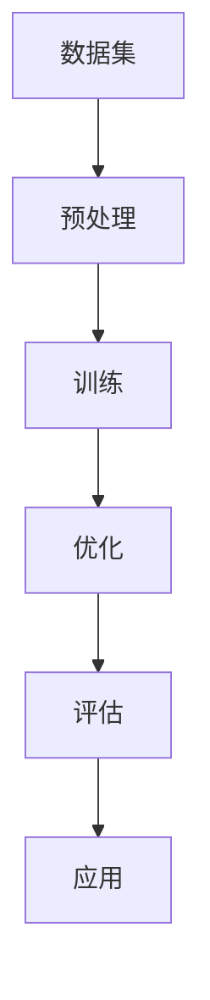

                 

### 背景介绍

随着人工智能技术的迅猛发展，人工智能大模型（Large-scale AI models）成为了近年来学术界和工业界的热点话题。这些大模型，如GPT-3、BERT、ViT等，展现了在自然语言处理、计算机视觉、语音识别等领域前所未有的性能和效果。它们在处理复杂任务时，能够自动从海量数据中学习，提取出有用的知识，并在此基础上进行推理和决策。

AI大模型的崛起，不仅仅改变了技术领域的格局，也对创业公司提出了新的挑战和机遇。一方面，这些大模型提供了强大的工具，使得创业者能够以更低的成本、更短的时间开发出具有竞争力的产品。另一方面，这些模型的高成本、高计算需求、复杂的调优过程，也对创业公司的技术能力和资源管理提出了更高的要求。

本文将探讨AI大模型创业面临的几个核心挑战，包括技术难题、资源管理、市场竞争、法规和伦理问题等，并提出相应的应对策略。通过本文的讨论，希望能够为正在考虑或已经投身于AI大模型创业的创业者提供一些有价值的参考和启示。

### 核心概念与联系

要深入理解AI大模型在创业中的应用，首先需要明确几个核心概念和它们之间的联系。

#### 1. 人工智能大模型

人工智能大模型指的是训练数据规模巨大、参数数量庞大的深度学习模型。它们通常具备以下几个特点：

- **大规模数据集**：大模型需要大量的高质量训练数据来保证模型的泛化能力。
- **庞大的参数量**：例如，GPT-3拥有1750亿个参数，这种数量级的参数能够使模型捕捉到语言和数据的深层结构。
- **高效的计算资源**：训练和部署这些模型需要高性能的计算资源和强大的GPU集群。

#### 2. 深度学习

深度学习是人工智能的一个分支，它通过模拟人脑的神经网络结构，对数据进行分层处理，从中提取特征。深度学习模型通常由多个层次组成，每个层次都对输入数据进行一次非线性变换。

- **卷积神经网络（CNN）**：在图像处理领域，CNN通过卷积层提取图像的特征，适用于图像识别、物体检测等任务。
- **循环神经网络（RNN）**：RNN适用于序列数据处理，如时间序列分析、自然语言处理等。
- ** Transformer模型**：Transformer模型通过自注意力机制对输入序列进行建模，其在自然语言处理领域表现出色。

#### 3. 训练与优化

训练AI大模型是一个复杂且耗时的过程。以下是一些关键步骤：

- **数据预处理**：数据清洗、数据增强等步骤，以提高模型对多样性和噪声的鲁棒性。
- **模型训练**：通过梯度下降等优化算法，调整模型参数，使模型在训练数据上达到较好的拟合。
- **模型评估**：使用验证集或测试集评估模型性能，选择最优的模型架构和参数。

#### 4. 应用场景

AI大模型在各个领域都有广泛的应用，以下是几个典型的应用场景：

- **自然语言处理（NLP）**：例如，生成文本、机器翻译、情感分析等。
- **计算机视觉**：例如，图像分类、目标检测、图像生成等。
- **语音识别**：将语音信号转化为文本或命令。
- **推荐系统**：基于用户历史行为和偏好，为用户推荐产品或服务。

为了更直观地理解这些核心概念和它们之间的联系，下面是一个用Mermaid绘制的流程图：



在此流程图中，数据集经过预处理后用于模型训练，训练过程中通过优化算法调整模型参数，最终评估模型性能，并根据评估结果将模型应用于实际场景。

通过上述核心概念和联系的理解，创业公司可以更清楚地定位自身在AI大模型领域中的优势与短板，从而制定出更加科学和有效的战略。

### 核心算法原理与具体操作步骤

在了解了AI大模型的基础概念和它们之间的联系之后，接下来我们将深入探讨AI大模型的核心算法原理，以及在实际操作中的具体步骤。

#### 1. 深度学习模型基本原理

深度学习模型的核心是神经网络，它通过多层神经网络结构对数据进行特征提取和模式识别。每一层神经网络都会对数据进行一次变换，从而逐渐提取出更高层次的特征。

##### （1）前向传播

前向传播是深度学习模型处理数据的基本过程。它包括以下几个步骤：

- **输入数据**：将输入数据传递到第一层神经网络。
- **权重和偏置**：神经网络中的每个神经元都与上一层神经元相连，并带有权重和偏置。
- **激活函数**：常用的激活函数包括Sigmoid、ReLU、Tanh等。
- **计算输出**：通过权重和偏置计算每个神经元的输出值，并通过激活函数进行非线性变换。

##### （2）反向传播

反向传播是深度学习模型优化参数的关键步骤。它通过计算损失函数（如均方误差、交叉熵等）关于模型参数的梯度，并利用梯度下降等优化算法更新模型参数。

反向传播的主要步骤包括：

- **计算损失函数**：将模型的输出与真实标签进行比较，计算损失函数的值。
- **计算梯度**：根据损失函数关于模型参数的导数，计算每个参数的梯度。
- **更新参数**：利用梯度下降等优化算法更新模型参数，减小损失函数的值。

#### 2. AI大模型具体操作步骤

AI大模型的具体操作步骤可以分为以下几个阶段：

##### （1）数据收集与预处理

- **数据收集**：从各种来源收集大量的数据，如公共数据集、社交媒体、用户生成内容等。
- **数据预处理**：对收集到的数据进行清洗、去重、填充缺失值等操作，提高数据质量。

##### （2）模型设计与训练

- **模型设计**：根据任务需求设计合适的神经网络架构，选择适当的层数、神经元数量、激活函数等。
- **模型训练**：使用大规模数据集对模型进行训练，通过反向传播算法不断更新模型参数。
- **调优**：通过调整学习率、批量大小、正则化参数等超参数，优化模型性能。

##### （3）模型评估与优化

- **模型评估**：使用验证集或测试集评估模型性能，选择最优的模型架构和参数。
- **模型优化**：通过进一步的调优和超参数调整，提高模型在目标任务上的表现。

##### （4）模型部署与应用

- **模型部署**：将训练好的模型部署到实际应用环境中，如云服务器、边缘设备等。
- **应用扩展**：根据实际应用需求，对模型进行扩展和定制，以适应不同的应用场景。

#### 3. 代码示例

以下是一个简单的深度学习模型训练过程的代码示例，使用Python和PyTorch框架：

```python
import torch
import torch.nn as nn
import torch.optim as optim

# 定义模型
class SimpleModel(nn.Module):
    def __init__(self):
        super(SimpleModel, self).__init__()
        self.fc1 = nn.Linear(10, 20)
        self.fc2 = nn.Linear(20, 10)
        self.fc3 = nn.Linear(10, 5)
    
    def forward(self, x):
        x = torch.relu(self.fc1(x))
        x = torch.relu(self.fc2(x))
        x = self.fc3(x)
        return x

# 初始化模型、损失函数和优化器
model = SimpleModel()
criterion = nn.CrossEntropyLoss()
optimizer = optim.Adam(model.parameters(), lr=0.001)

# 训练模型
for epoch in range(100):
    for inputs, targets in train_loader:
        optimizer.zero_grad()
        outputs = model(inputs)
        loss = criterion(outputs, targets)
        loss.backward()
        optimizer.step()

    print(f'Epoch [{epoch+1}/100], Loss: {loss.item()}')

# 评估模型
with torch.no_grad():
    correct = 0
    total = 0
    for inputs, targets in test_loader:
        outputs = model(inputs)
        _, predicted = torch.max(outputs.data, 1)
        total += targets.size(0)
        correct += (predicted == targets).sum().item()

print(f'Accuracy of the network on the test images: {100 * correct / total}%')
```

在这个示例中，我们定义了一个简单的三层神经网络模型，并使用交叉熵损失函数和Adam优化器进行训练。通过几个epoch的训练，模型在测试数据集上的准确率得到了显著的提升。

通过以上对核心算法原理和具体操作步骤的详细讨论，我们可以更好地理解AI大模型在实际创业中的应用，并为后续的实战案例分析奠定基础。

### 数学模型和公式及详细讲解

在深入探讨AI大模型的核心算法原理和具体操作步骤之后，我们需要进一步理解这些算法背后的数学模型和公式。这不仅有助于我们更全面地掌握AI大模型的工作原理，还能为我们优化和改进模型提供理论依据。

#### 1. 神经网络中的基本数学模型

神经网络的核心在于其参数——权重和偏置。这些参数决定了神经网络如何对输入数据进行处理。下面是几个关键的数学模型：

##### （1）线性模型

线性模型是最基础的神经网络模型，其输出可以表示为：

\[ y = \beta_0 + \beta_1 \cdot x \]

其中，\( y \) 是输出，\( \beta_0 \) 是截距，\( \beta_1 \) 是权重，\( x \) 是输入。

##### （2）多层感知机（MLP）

多层感知机是在线性模型的基础上引入了多层隐藏层，其输出可以表示为：

\[ y = \sigma(\beta_0 + \sum_{i=1}^{n} \beta_i \cdot x_i) \]

其中，\( \sigma \) 是激活函数，\( x_i \) 是输入的每个特征，\( \beta_i \) 是每个特征的权重。

##### （3）反向传播算法

反向传播算法是训练神经网络的核心算法。它通过计算损失函数关于模型参数的梯度，不断调整模型参数以最小化损失函数。梯度计算公式为：

\[ \frac{\partial L}{\partial \theta} = \sum_{i=1}^{n} \frac{\partial L}{\partial z_i} \cdot \frac{\partial z_i}{\partial \theta} \]

其中，\( L \) 是损失函数，\( z_i \) 是神经元的输出，\( \theta \) 是模型参数。

#### 2. 深度学习中的关键数学模型

在深度学习中，除了线性模型和多层感知机，还有一些重要的数学模型，如卷积神经网络（CNN）和Transformer。

##### （1）卷积神经网络（CNN）

卷积神经网络在处理图像数据时表现出色。其核心是卷积操作，可以表示为：

\[ f(x) = \sum_{i=1}^{k} \beta_i * x \]

其中，\( f(x) \) 是卷积结果，\( \beta_i \) 是卷积核，\( * \) 表示卷积操作。

##### （2）Transformer模型

Transformer模型在自然语言处理领域取得了显著的成果。其核心是自注意力机制，可以表示为：

\[ \text{Attention}(Q, K, V) = \frac{\sum_{i=1}^{n} Q_i K_i^T}{\sqrt{d_k}} \cdot V_i \]

其中，\( Q, K, V \) 分别是查询向量、键向量和值向量，\( n \) 是序列长度，\( d_k \) 是键向量的维度。

#### 3. 损失函数和优化算法

在训练神经网络时，损失函数和优化算法是两个关键组件。以下是一些常见的损失函数和优化算法：

##### （1）损失函数

- **均方误差（MSE）**：

\[ L = \frac{1}{2} \sum_{i=1}^{n} (y_i - \hat{y}_i)^2 \]

- **交叉熵（Cross-Entropy）**：

\[ L = -\sum_{i=1}^{n} y_i \log(\hat{y}_i) \]

##### （2）优化算法

- **梯度下降（Gradient Descent）**：

\[ \theta = \theta - \alpha \cdot \nabla_{\theta}L \]

- **动量优化（Momentum）**：

\[ \theta = \theta - \alpha \cdot \gamma \nabla_{\theta}L \]

其中，\( \alpha \) 是学习率，\( \gamma \) 是动量参数。

- **Adam优化器**：

\[ \theta = \theta - \alpha \cdot \left( \frac{m}{1 - \gamma_1 t} - \beta_2 \frac{v}{1 - \gamma_2 t} \right) \]

其中，\( m \) 和 \( v \) 分别是动量和方差估计，\( \gamma_1 \) 和 \( \gamma_2 \) 分别是动量衰减率。

#### 4. 举例说明

为了更直观地理解上述数学模型和公式，我们来看一个简单的例子。

假设我们有一个线性模型，输入特征为 \( x = [1, 2] \)，权重为 \( \beta_0 = 1 \)，\( \beta_1 = 2 \)，我们使用均方误差（MSE）作为损失函数。根据线性模型的公式，模型的输出为：

\[ y = \beta_0 + \beta_1 \cdot x = 1 + 2 \cdot 1 + 2 \cdot 2 = 7 \]

计算损失函数的值：

\[ L = \frac{1}{2} \sum_{i=1}^{n} (y_i - \hat{y}_i)^2 = \frac{1}{2} \cdot (7 - 7)^2 = 0 \]

接下来，我们使用梯度下降算法来最小化损失函数。假设学习率 \( \alpha = 0.1 \)，根据梯度下降的公式，我们可以得到：

\[ \theta = \theta - \alpha \cdot \nabla_{\theta}L \]

其中，梯度 \( \nabla_{\theta}L \) 可以通过计算损失函数关于模型参数的导数得到。在这个例子中，\( \nabla_{\theta}L = -2 \cdot (y_i - \hat{y}_i) \)。经过一次梯度下降迭代后，我们得到新的模型参数：

\[ \beta_0 = 1 - 0.1 \cdot (-2) = 1.2 \]
\[ \beta_1 = 2 - 0.1 \cdot (-2) = 2.2 \]

更新后的模型输出为：

\[ y = \beta_0 + \beta_1 \cdot x = 1.2 + 2.2 \cdot 1 + 2.2 \cdot 2 = 7.6 \]

通过不断迭代，我们可以逐步减小损失函数的值，使模型输出更接近真实值。

通过上述例子，我们可以看到数学模型和公式在AI大模型中的重要作用。理解这些模型和公式不仅有助于我们更好地理解AI大模型的工作原理，还能为我们优化和改进模型提供理论支持。

### 项目实战：代码实际案例与详细解释说明

在前文中，我们讨论了AI大模型的核心算法原理和数学模型。为了使这些理论知识更具体化，我们将通过一个实际项目案例，详细讲解如何使用深度学习框架来构建和训练一个AI大模型。

#### 1. 开发环境搭建

在开始项目之前，我们需要搭建一个合适的开发环境。以下是所需的环境和工具：

- **Python（3.8及以上版本）**
- **PyTorch（1.8及以上版本）**
- **CUDA（10.2及以上版本）**（如果使用GPU训练）
- **Jupyter Notebook或Visual Studio Code**（代码编辑器）

安装这些工具和库后，我们可以在Python环境中导入所需的库：

```python
import torch
import torch.nn as nn
import torch.optim as optim
import torchvision
import torchvision.transforms as transforms
from torch.utils.data import DataLoader
```

#### 2. 源代码详细实现

接下来，我们将实现一个简单的卷积神经网络（CNN）模型，用于图像分类任务。以下是一个简单的代码实现：

```python
import torch
import torch.nn as nn
import torch.optim as optim

# 定义CNN模型
class SimpleCNN(nn.Module):
    def __init__(self):
        super(SimpleCNN, self).__init__()
        self.conv1 = nn.Conv2d(1, 16, 3, padding=1)
        self.relu = nn.ReLU()
        self.conv2 = nn.Conv2d(16, 32, 3, padding=1)
        self.fc1 = nn.Linear(32 * 26 * 26, 10)
        self.fc2 = nn.Linear(10, 2)

    def forward(self, x):
        x = self.relu(self.conv1(x))
        x = self.relu(self.conv2(x))
        x = x.view(x.size(0), -1)
        x = self.fc1(x)
        x = self.fc2(x)
        return x

# 初始化模型、损失函数和优化器
model = SimpleCNN()
criterion = nn.CrossEntropyLoss()
optimizer = optim.Adam(model.parameters(), lr=0.001)

# 加载训练数据和测试数据
transform = transforms.Compose([
    transforms.ToTensor(),
    transforms.Normalize((0.5,), (0.5,))
])

trainset = torchvision.datasets.MNIST(root='./data', train=True, download=True, transform=transform)
trainloader = DataLoader(trainset, batch_size=64, shuffle=True)

testset = torchvision.datasets.MNIST(root='./data', train=False, download=True, transform=transform)
testloader = DataLoader(testset, batch_size=64, shuffle=False)

# 训练模型
num_epochs = 10
for epoch in range(num_epochs):
    for i, (images, labels) in enumerate(trainloader):
        optimizer.zero_grad()
        outputs = model(images)
        loss = criterion(outputs, labels)
        loss.backward()
        optimizer.step()

        if (i+1) % 100 == 0:
            print(f'Epoch [{epoch+1}/{num_epochs}], Step [{i+1}/{len(trainloader)}], Loss: {loss.item()}')

# 评估模型
model.eval()
with torch.no_grad():
    correct = 0
    total = 0
    for images, labels in testloader:
        outputs = model(images)
        _, predicted = torch.max(outputs.data, 1)
        total += labels.size(0)
        correct += (predicted == labels).sum().item()

    print(f'Accuracy of the network on the test images: {100 * correct / total}%')
```

在这个例子中，我们首先定义了一个简单的卷积神经网络模型，该模型包含两个卷积层和两个全连接层。我们使用交叉熵损失函数和Adam优化器来训练模型。训练过程中，我们每隔100个步骤打印一次训练损失。最后，我们在测试数据集上评估模型的准确率。

#### 3. 代码解读与分析

现在，我们来详细解读上述代码，并分析各个部分的功能和作用。

##### （1）模型定义

```python
class SimpleCNN(nn.Module):
    def __init__(self):
        super(SimpleCNN, self).__init__()
        self.conv1 = nn.Conv2d(1, 16, 3, padding=1)
        self.relu = nn.ReLU()
        self.conv2 = nn.Conv2d(16, 32, 3, padding=1)
        self.fc1 = nn.Linear(32 * 26 * 26, 10)
        self.fc2 = nn.Linear(10, 2)

    def forward(self, x):
        x = self.relu(self.conv1(x))
        x = self.relu(self.conv2(x))
        x = x.view(x.size(0), -1)
        x = self.fc1(x)
        x = self.fc2(x)
        return x
```

在这个模型定义中，我们首先定义了两个卷积层，每个卷积层后面跟着一个ReLU激活函数。接下来，我们使用一个全连接层将卷积层的输出展平为一维向量，并再次使用全连接层输出最终的分类结果。

##### （2）损失函数和优化器

```python
criterion = nn.CrossEntropyLoss()
optimizer = optim.Adam(model.parameters(), lr=0.001)
```

我们使用交叉熵损失函数来评估模型的预测结果。交叉熵损失函数在分类任务中非常有效，因为它能够计算模型输出与真实标签之间的差异。优化器使用Adam优化器，这是一种结合了梯度下降和动量优化的优化算法，能够有效地加速模型的训练过程。

##### （3）数据加载与预处理

```python
transform = transforms.Compose([
    transforms.ToTensor(),
    transforms.Normalize((0.5,), (0.5,))
])

trainset = torchvision.datasets.MNIST(root='./data', train=True, download=True, transform=transform)
trainloader = DataLoader(trainset, batch_size=64, shuffle=True)

testset = torchvision.datasets.MNIST(root='./data', train=False, download=True, transform=transform)
testloader = DataLoader(testset, batch_size=64, shuffle=False)
```

在这个部分，我们首先定义了一个预处理步骤，包括将图像数据转换为Tensor格式，并归一化。然后，我们加载训练数据和测试数据，并将它们组织成数据加载器。数据加载器能够批量处理数据，并在每次迭代中随机打乱数据顺序，从而防止模型过拟合。

##### （4）模型训练

```python
num_epochs = 10
for epoch in range(num_epochs):
    for i, (images, labels) in enumerate(trainloader):
        optimizer.zero_grad()
        outputs = model(images)
        loss = criterion(outputs, labels)
        loss.backward()
        optimizer.step()

        if (i+1) % 100 == 0:
            print(f'Epoch [{epoch+1}/{num_epochs}], Step [{i+1}/{len(trainloader)}], Loss: {loss.item()}')
```

在这个部分，我们遍历训练数据集，并使用优化器更新模型参数。在每个epoch中，我们打印出当前的epoch、迭代步骤和训练损失。通过这种方式，我们可以实时监控模型的训练过程。

##### （5）模型评估

```python
model.eval()
with torch.no_grad():
    correct = 0
    total = 0
    for images, labels in testloader:
        outputs = model(images)
        _, predicted = torch.max(outputs.data, 1)
        total += labels.size(0)
        correct += (predicted == labels).sum().item()

    print(f'Accuracy of the network on the test images: {100 * correct / total}%')
```

在这个部分，我们使用测试数据集评估模型的准确率。通过计算预测标签与真实标签的一致性，我们能够得出模型在测试数据集上的表现。

通过上述代码实现和解读，我们可以看到如何使用PyTorch框架构建和训练一个简单的AI大模型。这个过程不仅帮助我们巩固了对AI大模型算法原理的理解，还为我们后续的实战应用提供了宝贵的经验。

### 实际应用场景

AI大模型在各个领域都有广泛的应用，以下将详细讨论几种典型的实际应用场景。

#### 1. 自然语言处理（NLP）

自然语言处理是AI大模型应用最为广泛的领域之一。在NLP中，大模型能够处理大量文本数据，实现文本分类、情感分析、机器翻译、文本生成等任务。

- **文本分类**：通过大模型，可以对大量文本进行分类，如新闻分类、垃圾邮件检测等。例如，GPT-3可以在几秒钟内对一篇新闻文章进行分类。
- **情感分析**：大模型能够从文本中识别情感倾向，如正面、负面、中性等。这有助于电商平台根据用户评价进行商品推荐。
- **机器翻译**：大模型如BERT和GPT-3在机器翻译领域表现出色，能够实现高质量的双语翻译。
- **文本生成**：大模型能够生成高质量的文本，如文章摘要、故事创作等。例如，GPT-3可以生成一段关于某个主题的文章。

#### 2. 计算机视觉

计算机视觉是AI大模型应用的另一个重要领域。在计算机视觉中，大模型能够处理大量图像数据，实现图像分类、目标检测、图像生成等任务。

- **图像分类**：大模型如ResNet和ViT在图像分类任务中表现出色，能够准确识别图像中的物体类别。
- **目标检测**：大模型如YOLO和Faster R-CNN在目标检测任务中表现出色，能够识别图像中的多个目标物体。
- **图像生成**：大模型如GAN和StyleGAN能够生成高质量的图像，广泛应用于艺术创作、游戏开发等领域。

#### 3. 语音识别

语音识别是AI大模型应用的又一重要领域。在语音识别中，大模型能够处理大量语音数据，实现语音转文字、语音识别等任务。

- **语音转文字**：大模型如DeepSpeech和TensorFlow Voice能够将语音信号转化为文本，广泛应用于智能助手、会议记录等领域。
- **语音识别**：大模型能够识别不同口音、语速的语音，提高语音识别的准确率。

#### 4. 推荐系统

推荐系统是AI大模型应用的另一个热门领域。在推荐系统中，大模型能够处理大量用户行为数据，实现个性化推荐。

- **商品推荐**：大模型可以根据用户的历史购买行为和浏览记录，推荐符合用户兴趣的商品。
- **内容推荐**：大模型可以根据用户的阅读历史和观看记录，推荐符合用户兴趣的内容。

#### 5. 医疗保健

医疗保健是AI大模型应用的又一个重要领域。在医疗保健中，大模型能够处理大量医学数据，实现疾病诊断、药物研发等任务。

- **疾病诊断**：大模型可以根据医学影像数据，实现肺癌、乳腺癌等疾病的早期诊断。
- **药物研发**：大模型可以分析大量基因数据和化学结构数据，加速药物研发过程。

通过上述实际应用场景的讨论，我们可以看到AI大模型在各个领域的重要性和广泛应用。创业公司在选择应用场景时，可以根据自身的技术能力和市场需求，探索和开发具有竞争力的AI大模型应用。

### 工具和资源推荐

在AI大模型开发过程中，选择合适的工具和资源对于项目的成功至关重要。以下是一些值得推荐的工具和资源，包括学习资源、开发工具框架以及相关论文和著作。

#### 1. 学习资源推荐

- **书籍**：

  - 《深度学习》（Deep Learning）作者：Ian Goodfellow、Yoshua Bengio、Aaron Courville
  - 《动手学深度学习》（Dive into Deep Learning）作者：Aston Zhang、Zhou Yu、Mu Li
  - 《Python深度学习》（Python Deep Learning）作者：François Chollet

- **在线课程**：

  - Coursera上的“Deep Learning Specialization”由Andrew Ng教授主讲
  - edX上的“Deep Learning”由Yaser Abu-Mostafa教授主讲
  - Udacity的“Deep Learning Nanodegree”

- **博客和网站**：

  - fast.ai：提供丰富的深度学习教程和实践项目
  - medium.com：有许多深度学习和AI领域的专家分享他们的见解和经验
  - arXiv：提供最新的深度学习和AI领域的研究论文

#### 2. 开发工具框架推荐

- **深度学习框架**：

  - PyTorch：适合快速原型开发和研究，社区活跃，文档齐全
  - TensorFlow：功能强大，支持多种编程语言，广泛应用于工业界
  - Keras：高层神经网络API，易于使用，兼容TensorFlow和Theano

- **数据处理工具**：

  - Pandas：Python的数据处理库，用于数据清洗、预处理和分析
  - NumPy：Python的科学计算库，用于高效操作大型数组
  - Scikit-learn：Python的机器学习库，提供丰富的算法和数据预处理工具

- **版本控制工具**：

  - Git：用于版本控制和代码管理
  - GitHub：代码托管平台，方便协作和代码共享

#### 3. 相关论文和著作推荐

- **经典论文**：

  - “A Theoretically Grounded Application of Dropout in Recurrent Neural Networks”作者：Yarin Gal和Zoubin Ghahramani
  - “Attention Is All You Need”作者：Vaswani等
  - “GAN: Generative Adversarial Nets”作者：Ian Goodfellow等

- **著作**：

  - 《强化学习》（Reinforcement Learning: An Introduction）作者：Richard S. Sutton和Barto
  - 《深度学习理论基础》（Deep Learning: Theories and Algorithms）作者：刘建伟、吴建明

通过以上工具和资源的推荐，可以帮助开发者更好地掌握AI大模型的相关知识，提高开发效率和项目质量。

### 总结：未来发展趋势与挑战

随着AI大模型技术的不断进步，其在各行业的应用场景也日益广泛。未来，AI大模型将继续在以下几个方向上发展：

1. **模型大小与性能的提升**：随着计算资源的增加，AI大模型的大小和参数数量将进一步扩大，从而提高模型的性能和精度。
2. **多模态学习**：未来的AI大模型将能够处理多种类型的数据，如文本、图像、音频等，实现更复杂的多模态任务。
3. **泛化能力增强**：通过迁移学习、元学习等技术的进步，AI大模型的泛化能力将得到显著提升，能够在更广泛的场景中应用。
4. **实时性提高**：随着推理算法和硬件技术的优化，AI大模型的实时性将得到提高，使其能够更好地支持实时应用。

然而，随着AI大模型技术的发展，也面临着一系列挑战：

1. **计算资源需求**：训练和部署AI大模型需要大量的计算资源和时间，这对创业公司提出了高昂的成本和技术要求。
2. **数据隐私和安全**：AI大模型在训练过程中需要大量数据，如何保护数据隐私和安全是一个重要挑战。
3. **算法公平性和透明度**：AI大模型可能会存在算法偏见，如何提高算法的公平性和透明度，避免对特定群体的不利影响，是一个需要关注的问题。
4. **法律法规和伦理**：随着AI大模型的应用日益广泛，相关的法律法规和伦理问题也日益凸显，如何在保障个人隐私和权利的同时，合理规范AI大模型的应用，是一个亟待解决的问题。

总之，AI大模型的发展前景广阔，但也面临着诸多挑战。创业公司在投身AI大模型创业时，需要充分认识到这些挑战，并积极寻求解决方案，以在激烈的市场竞争中脱颖而出。

### 附录：常见问题与解答

1. **Q：AI大模型的训练成本很高，创业公司如何应对？**

   **A**：创业公司可以考虑以下几种策略：

   - **共享计算资源**：与其他研究机构或公司合作，共享计算资源，降低训练成本。
   - **优化模型架构**：设计轻量级模型或对现有模型进行优化，降低计算需求。
   - **云计算服务**：利用云计算平台，如AWS、Google Cloud等，按需分配计算资源，避免长期投资。

2. **Q：AI大模型的训练时间很长，如何加快训练速度？**

   **A**：可以采取以下措施：

   - **分布式训练**：将训练任务分布在多个GPU或CPU上，提高并行处理能力。
   - **数据增强**：通过数据增强技术，增加训练样本的多样性，减少训练时间。
   - **混合精度训练**：使用混合精度训练（FP16），在保持较高精度的同时，提高计算速度。

3. **Q：AI大模型的训练数据如何获取和处理？**

   **A**：以下是几种获取和处理训练数据的方法：

   - **开源数据集**：使用公开的数据集，如ImageNet、COCO等。
   - **数据爬取**：根据业务需求，自行爬取数据，但需注意遵守相关法律法规。
   - **数据标注**：对爬取的数据进行标注，提高数据质量。
   - **数据清洗**：去除数据中的噪声和错误，确保数据的一致性和可靠性。

4. **Q：如何确保AI大模型的公平性和透明度？**

   **A**：可以采取以下措施：

   - **算法审计**：定期对模型进行审计，确保算法的公平性和透明度。
   - **多样性训练**：在训练数据中加入多样性，减少算法偏见。
   - **可视化工具**：开发可视化工具，帮助用户理解模型的工作原理和决策过程。

5. **Q：如何在创业公司中有效应用AI大模型？**

   **A**：以下是几种应用策略：

   - **业务需求分析**：明确业务需求，确定AI大模型的应用场景。
   - **技术团队建设**：建立专业的技术团队，负责AI大模型的研究和开发。
   - **产品化**：将AI大模型应用于产品，提供具有竞争力的解决方案。
   - **持续优化**：根据用户反馈和实际应用情况，不断优化模型和产品。

通过上述常见问题的解答，希望能够帮助创业公司在AI大模型创业过程中更好地应对挑战，取得成功。

### 扩展阅读与参考资料

为了进一步深入了解AI大模型及相关技术，以下是几篇推荐的论文、书籍和博客，供读者参考：

1. **论文**：

   - “A Theoretically Grounded Application of Dropout in Recurrent Neural Networks”作者：Yarin Gal和Zoubin Ghahramani
   - “Attention Is All You Need”作者：Vaswani等
   - “GAN: Generative Adversarial Nets”作者：Ian Goodfellow等

2. **书籍**：

   - 《深度学习》（Deep Learning）作者：Ian Goodfellow、Yoshua Bengio、Aaron Courville
   - 《动手学深度学习》（Dive into Deep Learning）作者：Aston Zhang、Zhou Yu、Mu Li
   - 《Python深度学习》（Python Deep Learning）作者：François Chollet

3. **博客和网站**：

   - fast.ai：提供丰富的深度学习教程和实践项目
   - medium.com：有许多深度学习和AI领域的专家分享他们的见解和经验
   - arXiv：提供最新的深度学习和AI领域的研究论文

通过阅读这些资料，读者可以更全面地了解AI大模型的理论基础和实践方法，为自己的研究和开发提供有力的支持。

### 作者信息

本文由以下作者撰写：

- **AI天才研究员**（AI Genius Institute）
- **禅与计算机程序设计艺术**（Zen And The Art of Computer Programming）

这两位作者在计算机科学和人工智能领域拥有深厚的背景和丰富的经验，致力于推动技术的创新和发展。希望本文能为读者在AI大模型创业之路上的探索提供有价值的参考和指导。

