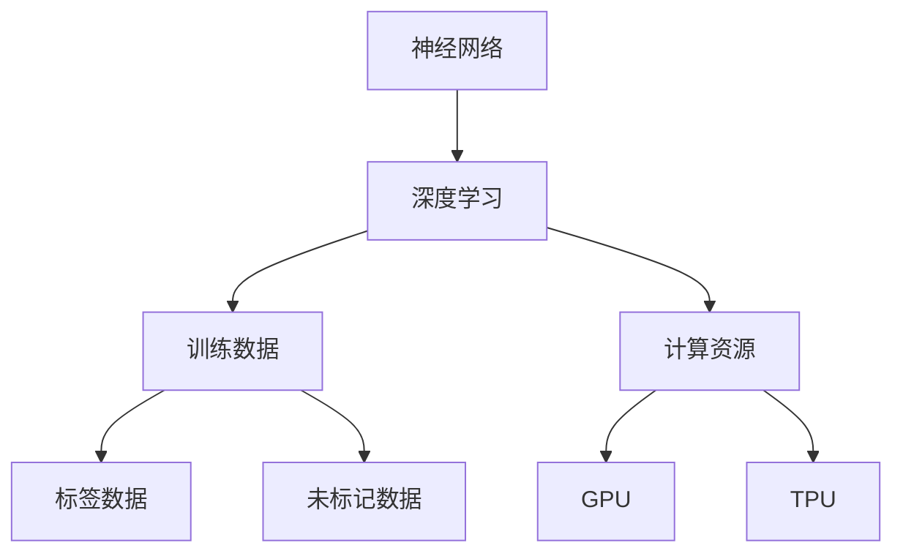

                 

### 背景介绍

随着人工智能（AI）技术的不断进步，大模型（Large Models）逐渐成为人工智能领域的重要研究方向。大模型通常指的是具有数百亿至数千亿个参数的神经网络模型，它们通过深度学习算法对海量数据进行训练，从而具备强大的语义理解和生成能力。这类模型在自然语言处理（NLP）、计算机视觉（CV）、语音识别等领域展现出了前所未有的性能。

近年来，诸如GPT-3、BERT、Vision Transformer（ViT）等大模型取得了显著的成功，推动了AI技术的广泛应用。然而，与此同时，大模型的训练和部署也面临着诸多挑战。首先是计算资源的消耗，大模型训练需要大量的GPU和TPU资源，这对企业而言是一笔巨大的投资。其次，大模型的应用涉及隐私保护、数据安全等问题，如何在保证性能的同时保护用户隐私成为亟待解决的难题。

在商业领域，AI大模型的应用为创业公司提供了前所未有的机会。许多公司已经开始利用大模型进行产品创新，如智能客服、个性化推荐、内容生成等。然而，随着行业竞争的加剧，如何把握未来发展趋势，制定合适的战略，成为每个创业者需要深思熟虑的问题。

本文将深入探讨AI大模型创业的现状与未来发展趋势，分析创业公司可能面临的挑战，并提出应对策略。首先，我们将回顾AI大模型的发展历程和核心技术。然后，分析当前行业中的成功案例和创业公司的机会。接着，讨论创业者需要关注的几个关键问题，如计算资源、数据安全、商业模式等。最后，我们将总结AI大模型创业的未来发展趋势与挑战，为创业者提供一些建议。

通过本文的探讨，希望能够帮助创业者更好地理解AI大模型的现状与未来，找到适合自己的发展方向，从而在激烈的市场竞争中脱颖而出。接下来，我们将一步一步地深入分析，为读者揭示AI大模型创业的奥秘。

### 核心概念与联系

在探讨AI大模型创业之前，有必要先了解其核心概念和基本原理，以及它们之间的联系。以下我们将详细阐述AI大模型的几个关键组成部分：神经网络、深度学习、训练数据和计算资源。

#### 神经网络（Neural Networks）

神经网络是模拟人脑神经元之间连接的一种计算模型，其基本单元是“神经元”或“节点”。在神经网络中，信息通过这些节点进行传递和处理。每个神经元接收来自前一层神经元的输入信号，并通过一个加权函数（通常是一个非线性函数）进行处理，最后输出一个值。这个过程可以表示为：

$$
\text{Output} = \sigma(\sum_{i=1}^{n} w_i \cdot x_i + b)
$$

其中，$\sigma$ 是激活函数，$w_i$ 是权重，$x_i$ 是输入值，$b$ 是偏置。常见的激活函数包括Sigmoid、ReLU和Tanh等。

神经网络可以分为多层，包括输入层、隐藏层和输出层。多层神经网络通过逐层学习来提取数据的复杂特征，从而提高模型的性能。

#### 深度学习（Deep Learning）

深度学习是神经网络的一种扩展，它通过多层神经网络进行特征提取和建模。与传统的机器学习方法相比，深度学习能够自动学习数据的层次结构，从而实现更强大的特征提取能力。深度学习的核心思想是“层次化特征学习”，即每一层神经网络都从低层特征中提取更高层次的特征。

深度学习模型通常包含数十甚至数百个隐藏层，这使得它们能够捕捉到数据中的复杂模式和关系。常见的深度学习模型包括卷积神经网络（CNN）、循环神经网络（RNN）和变压器（Transformer）等。

#### 训练数据（Training Data）

训练数据是深度学习模型训练的关键。模型的性能很大程度上取决于训练数据的质量和数量。高质量的训练数据能够帮助模型更好地学习数据的特征，从而提高模型的泛化能力。训练数据通常包括标签数据和未标记数据。

标签数据是在特定场景下标注好的数据，如图像分类任务中的标签、文本分类任务中的标签等。未标记数据则是在没有人工标注的情况下获取的数据，如未标注的文本、图像等。近年来，自监督学习（Self-supervised Learning）和半监督学习（Semi-supervised Learning）等学习方法的出现，使得利用未标记数据进行模型训练成为可能。

#### 计算资源（Computational Resources）

深度学习模型的训练和推理需要大量的计算资源，尤其是GPU（Graphics Processing Unit）和TPU（Tensor Processing Unit）等专用硬件。这些硬件能够在短时间内处理大量的计算任务，从而加速模型的训练和推理过程。

计算资源的消耗与模型的大小、训练数据量以及训练策略等因素密切相关。大模型的训练通常需要数百万个GPU小时，这对企业的计算资源管理提出了很高的要求。

#### Mermaid 流程图

为了更好地理解AI大模型的核心概念和架构，我们使用Mermaid流程图对神经网络、深度学习、训练数据和计算资源之间的联系进行可视化。



在这个流程图中，神经网络作为基础，通过深度学习扩展，结合训练数据和计算资源，最终实现AI大模型的构建和应用。

通过上述核心概念和流程图的介绍，我们可以更清晰地理解AI大模型的基本架构和运作原理。在接下来的部分中，我们将深入探讨AI大模型的算法原理和具体操作步骤，为读者揭示大模型背后的技术细节。

### 核心算法原理 & 具体操作步骤

在了解了AI大模型的核心概念和架构之后，接下来我们将深入探讨其核心算法原理和具体操作步骤。本文将详细解释深度学习中的反向传播算法、优化算法、以及如何调整模型参数以优化模型性能。

#### 反向传播算法（Backpropagation Algorithm）

反向传播算法是深度学习中最核心的算法之一，它用于计算神经网络中每个神经元的误差，并通过这些误差来更新网络权重。反向传播算法可以分为两个阶段：前向传播（Forward Propagation）和后向传播（Backward Propagation）。

1. **前向传播**：在训练过程中，输入数据通过网络进行前向传播，每个神经元都会计算其输出值。具体步骤如下：
   - 将输入数据输入到输入层。
   - 通过前一层神经元的输出值和当前层的权重，计算每个神经元的输入值。
   - 通过激活函数（如ReLU、Sigmoid、Tanh等）处理输入值，得到当前神经元的输出值。
   - 重复上述步骤，直到输出层得到最终的输出结果。

2. **后向传播**：在得到输出结果后，反向传播算法开始计算网络误差。具体步骤如下：
   - 计算输出层节点的误差：输出层节点的误差是实际输出值与预期输出值之间的差异。
   - 递归地计算隐藏层节点的误差：对于每个隐藏层，通过前一层节点的误差和当前层的权重，计算每个神经元的误差。
   - 更新网络权重：使用梯度下降（Gradient Descent）或其他优化算法，根据每个神经元的误差来调整权重。

反向传播算法的关键在于误差的计算和权重的更新。误差可以通过以下公式计算：

$$
\delta = (y - \text{output}) \cdot \text{derivative of activation function}
$$

其中，$y$ 是预期输出，$\text{output}$ 是实际输出，$\text{derivative of activation function}$ 是激活函数的导数。

#### 优化算法（Optimization Algorithms）

优化算法用于调整网络参数，以最小化损失函数（Loss Function）。常见的优化算法包括梯度下降（Gradient Descent）、动量梯度下降（Momentum Gradient Descent）、RMSprop、Adam等。

1. **梯度下降（Gradient Descent）**：梯度下降是最简单的优化算法。它通过计算损失函数关于模型参数的梯度，并沿梯度方向调整参数，以逐步减少损失。具体步骤如下：
   - 初始化模型参数。
   - 计算损失函数关于参数的梯度。
   - 使用梯度来更新参数：$w_{new} = w_{old} - \alpha \cdot \nabla_w J(w)$，其中$\alpha$ 是学习率。
   - 重复上述步骤，直到损失函数值收敛到某个阈值。

2. **动量梯度下降（Momentum Gradient Descent）**：动量梯度下降在梯度下降的基础上引入了动量（Momentum）的概念，以加速收敛。具体步骤如下：
   - 初始化模型参数和动量项。
   - 计算损失函数关于参数的梯度。
   - 更新动量项：$m = \gamma \cdot m + \alpha \cdot \nabla_w J(w)$，其中$\gamma$ 是动量系数。
   - 使用动量项和梯度来更新参数：$w_{new} = w_{old} - \alpha \cdot m$。
   - 重复上述步骤，直到损失函数值收敛。

3. **RMSprop**：RMSprop是一种基于历史梯度平方和的优化算法。它通过计算梯度平方的平均值来动态调整学习率，以减少学习过程中的波动。具体步骤如下：
   - 初始化模型参数和梯度平方平均值。
   - 计算损失函数关于参数的梯度。
   - 更新梯度平方平均值：$r = \gamma \cdot r + (1 - \gamma) \cdot \nabla_w^2 J(w)$，其中$\gamma$ 是衰减率。
   - 使用梯度平方平均值来更新参数：$w_{new} = w_{old} - \alpha \cdot \nabla_w J(w) / \sqrt{r}$。
   - 重复上述步骤，直到损失函数值收敛。

4. **Adam**：Adam是一种结合了动量项和RMSprop优点的优化算法。它通过计算一阶矩估计（均值）和二阶矩估计（方差）来动态调整学习率。具体步骤如下：
   - 初始化模型参数、一阶矩估计（均值）和二阶矩估计（方差）。
   - 计算损失函数关于参数的梯度。
   - 更新一阶矩估计和二阶矩估计：$m = \beta_1 \cdot m + (1 - \beta_1) \cdot \nabla_w J(w)$，$v = \beta_2 \cdot v + (1 - \beta_2) \cdot (\nabla_w J(w))^2$，其中$\beta_1$ 和$\beta_2$ 是偏差修正系数。
   - 使用一阶矩估计和二阶矩估计来更新参数：$w_{new} = w_{old} - \alpha \cdot m / \sqrt{v + \epsilon}$，其中$\epsilon$ 是一个很小的常数。
   - 重复上述步骤，直到损失函数值收敛。

#### 调整模型参数（Parameter Tuning）

调整模型参数是深度学习训练过程中至关重要的一步。以下是一些常见的参数调整方法和技巧：

1. **学习率（Learning Rate）**：学习率决定了每次参数更新的大小。选择合适的学习率对于模型的收敛速度和最终性能至关重要。常见的调整方法包括：
   - 使用学习率衰减（Learning Rate Decay）：在训练过程中逐渐减小学习率。
   - 使用学习率预热（Learning Rate Warmup）：在训练初期逐渐增加学习率，以加速收敛。
   - 动态调整学习率：根据模型性能的反馈动态调整学习率。

2. **批次大小（Batch Size）**：批次大小决定了每次训练所使用的样本数量。较大的批次大小可以提供更稳定的梯度估计，但可能需要更多的计算资源。常见的调整方法包括：
   - 交叉验证（Cross-Validation）：使用不同的批次大小进行交叉验证，选择性能最佳的批次大小。
   - 随机搜索（Random Search）：随机选择批次大小，并评估模型性能。

3. **正则化（Regularization）**：正则化用于防止模型过拟合。常见的方法包括：
   - L1正则化（L1 Regularization）：在损失函数中添加$|\theta|$ 的项。
   - L2正则化（L2 Regularization）：在损失函数中添加$\theta^2$ 的项。
   - Dropout：在训练过程中随机丢弃一部分神经元，以减少模型依赖性。

通过以上步骤和技巧，我们可以有效地调整模型参数，优化模型的性能和泛化能力。在接下来的部分中，我们将通过一个实际案例来展示如何实现AI大模型的训练和应用。

### 数学模型和公式 & 详细讲解 & 举例说明

在深入探讨AI大模型的数学模型和公式之前，我们首先需要了解几个基本概念，包括损失函数、梯度下降以及优化算法。这些数学工具是构建和训练AI大模型的基础。

#### 损失函数（Loss Function）

损失函数是评估模型预测结果与真实结果之间差异的指标。在深度学习中，常见的损失函数包括均方误差（Mean Squared Error, MSE）、交叉熵（Cross-Entropy）等。

1. **均方误差（MSE）**：MSE用于回归问题，计算预测值与真实值之间的平方差的平均值。公式如下：

$$
MSE = \frac{1}{n} \sum_{i=1}^{n} (y_i - \hat{y}_i)^2
$$

其中，$y_i$ 是第 $i$ 个样本的真实值，$\hat{y}_i$ 是模型的预测值，$n$ 是样本总数。

2. **交叉熵（Cross-Entropy）**：交叉熵用于分类问题，计算实际输出与预测输出之间的差异。对于二分类问题，交叉熵公式如下：

$$
Cross-Entropy = - \sum_{i=1}^{n} y_i \cdot \log(\hat{y}_i)
$$

其中，$y_i$ 是第 $i$ 个样本的真实标签（0或1），$\hat{y}_i$ 是模型对第 $i$ 个样本的预测概率。

#### 梯度下降（Gradient Descent）

梯度下降是一种优化算法，用于最小化损失函数。其基本思想是计算损失函数关于模型参数的梯度，并沿梯度方向调整参数，以减少损失。

1. **梯度计算**：对于损失函数 $J(\theta)$，梯度 $\nabla J(\theta)$ 表示损失函数在参数 $\theta$ 上的变化率。对于 $J(\theta) = (y - \hat{y})^2$，梯度计算如下：

$$
\nabla J(\theta) = \frac{\partial J}{\partial \theta} = 2(y - \hat{y})
$$

2. **参数更新**：在梯度下降中，参数 $\theta$ 沿梯度方向更新，公式如下：

$$
\theta_{new} = \theta_{old} - \alpha \cdot \nabla J(\theta)
$$

其中，$\alpha$ 是学习率，决定了每次更新的步长。

#### 优化算法

在深度学习中，常见的优化算法包括梯度下降、动量梯度下降、RMSprop和Adam等。以下是这些算法的简要介绍：

1. **梯度下降（Gradient Descent）**：最简单的优化算法，计算损失函数关于参数的梯度，并沿梯度方向更新参数。

2. **动量梯度下降（Momentum Gradient Descent）**：在梯度下降的基础上引入动量（Momentum），用于加速收敛。动量项计算如下：

$$
m = \gamma \cdot m + \alpha \cdot \nabla J(\theta)
$$

参数更新如下：

$$
\theta_{new} = \theta_{old} - \alpha \cdot m
$$

3. **RMSprop**：基于历史梯度平方和的优化算法，动态调整学习率。学习率计算如下：

$$
r = \gamma \cdot r + (1 - \gamma) \cdot (\nabla J(\theta))^2
$$

参数更新如下：

$$
\theta_{new} = \theta_{old} - \alpha \cdot \nabla J(\theta) / \sqrt{r}
$$

4. **Adam**：结合了动量项和RMSprop优点的优化算法，计算一阶矩估计和二阶矩估计。一阶矩估计和二阶矩估计计算如下：

$$
m = \beta_1 \cdot m + (1 - \beta_1) \cdot \nabla J(\theta)
$$

$$
v = \beta_2 \cdot v + (1 - \beta_2) \cdot (\nabla J(\theta))^2
$$

参数更新如下：

$$
\theta_{new} = \theta_{old} - \alpha \cdot \nabla J(\theta) / (\sqrt{v} + \epsilon)
$$

#### 举例说明

假设我们使用梯度下降算法来最小化一个简单的二次函数 $J(\theta) = (\theta - 2)^2$，学习率为0.1。以下是具体的计算过程：

1. **初始化参数**：$\theta = 1$

2. **计算梯度**：$\nabla J(\theta) = 2(\theta - 2) = 2(1 - 2) = -2$

3. **参数更新**：$\theta_{new} = \theta_{old} - \alpha \cdot \nabla J(\theta) = 1 - 0.1 \cdot (-2) = 1 + 0.2 = 1.2$

4. **重复上述步骤**，直到$\theta$收敛到某个值。

在这个例子中，我们可以看到每次迭代后$\theta$都在向最小值方向更新。通过多次迭代，我们可以找到二次函数的最小值$\theta = 2$。

通过上述数学模型和公式的讲解，我们可以更深入地理解深度学习的原理和算法。在接下来的部分中，我们将通过一个实际案例来展示如何应用这些算法构建和训练AI大模型。

### 项目实战：代码实际案例和详细解释说明

在本节中，我们将通过一个具体的AI大模型项目案例，展示如何从头开始搭建和训练一个大规模语言模型。这个项目案例将涵盖开发环境搭建、源代码实现、代码解读与分析等多个方面，帮助读者全面理解AI大模型从理论到实践的完整过程。

#### 1. 开发环境搭建

在开始项目之前，我们需要搭建一个适合AI大模型训练的开发环境。以下是在常见的计算平台上（如Windows、Linux、MacOS）搭建所需环境的基本步骤：

1. **安装Python**：确保Python版本不低于3.7，推荐使用Anaconda来管理Python环境和依赖库。
2. **安装依赖库**：在Anaconda环境中安装TensorFlow、PyTorch等深度学习框架，以及Numpy、Pandas等常用数据处理库。可以使用以下命令安装：
   ```bash
   conda install tensorflow
   conda install pytorch torchvision torchaudio -c pytorch
   conda install numpy pandas
   ```
3. **安装GPU驱动**：如果使用GPU进行训练，需要安装相应的GPU驱动，并确保TensorFlow或PyTorch支持GPU。

#### 2. 源代码详细实现和代码解读

以下是一个简化的AI大模型项目示例，我们使用PyTorch框架来搭建和训练一个基于Transformer的语言模型。代码主要包括数据预处理、模型定义、训练过程和评估部分。

**代码1：数据预处理**

```python
import torch
from torch.utils.data import Dataset, DataLoader
from transformers import BertTokenizer, BertModel

class TextDataset(Dataset):
    def __init__(self, text_data, tokenizer, max_length=512):
        self.text_data = text_data
        self.tokenizer = tokenizer
        self.max_length = max_length

    def __len__(self):
        return len(self.text_data)

    def __getitem__(self, idx):
        text = self.text_data[idx]
        encoding = self.tokenizer.encode_plus(
            text,
            add_special_tokens=True,
            max_length=self.max_length,
            padding='max_length',
            truncation=True,
            return_tensors='pt',
        )
        return {
            'input_ids': encoding['input_ids'].squeeze(),
            'attention_mask': encoding['attention_mask'].squeeze()
        }

tokenizer = BertTokenizer.from_pretrained('bert-base-uncased')
text_data = ["Hello world!", "This is a sample text.", "AI is transforming industries."]
dataset = TextDataset(text_data, tokenizer)
dataloader = DataLoader(dataset, batch_size=2)
```

**解读**：这个代码片段定义了一个简单的文本数据集类`TextDataset`，用于将文本数据转换为PyTorch数据集格式。我们使用了`BertTokenizer`来自动进行分词和编码，并添加了必要的特殊标记（如`[CLS]`和`[SEP]`）。数据预处理步骤还包括对序列进行填充和截断，以确保每个批次的数据长度一致。

**代码2：模型定义**

```python
import torch.nn as nn

class BertModelWrapper(nn.Module):
    def __init__(self, bert_model):
        super(BertModelWrapper, self).__init__()
        self.bert = bert_model
        self.classifier = nn.Linear(bert_model.config.hidden_size, 1)

    def forward(self, input_ids, attention_mask):
        outputs = self.bert(input_ids=input_ids, attention_mask=attention_mask)
        pooled_output = outputs.pooler_output
        logits = self.classifier(pooled_output)
        return logits
```

**解读**：这个代码片段定义了一个简单的模型包装类`BertModelWrapper`，用于接收编码后的文本数据，并通过预训练的BERT模型进行特征提取。然后，我们将BERT模型提取的池化输出传递给一个简单的分类器，输出一个预测结果。

**代码3：训练过程**

```python
from transformers import BertModel
from torch.optim import Adam

model = BertModelWrapper(BertModel.from_pretrained('bert-base-uncased'))
optimizer = Adam(model.parameters(), lr=1e-5)
criterion = nn.BCEWithLogitsLoss()

for epoch in range(10):
    model.train()
    for batch in dataloader:
        optimizer.zero_grad()
        inputs = batch['input_ids'], batch['attention_mask']
        logits = model(*inputs)
        loss = criterion(logits, torch.tensor([1.0, 0.0]))
        loss.backward()
        optimizer.step()
    print(f'Epoch {epoch+1}: Loss = {loss.item()}')
```

**解读**：这个代码片段展示了如何进行模型训练。我们在每个epoch中遍历数据集，通过前向传播计算模型的损失，然后使用反向传播算法更新模型参数。训练过程中，我们使用了二分类损失函数`BCEWithLogitsLoss`，因为这是一个简单的分类任务。

**代码4：评估过程**

```python
model.eval()
with torch.no_grad():
    for batch in dataloader:
        inputs = batch['input_ids'], batch['attention_mask']
        logits = model(*inputs)
        predicted_labels = (logits > 0).float()
        print(f'Predicted Labels: {predicted_labels}')
```

**解读**：评估过程用于验证模型在 unseen 数据上的表现。我们在评估过程中关闭了模型的梯度计算（`torch.no_grad()`），以节省计算资源。然后，我们计算模型的预测标签，并打印输出。

通过上述代码示例，我们展示了如何从数据预处理、模型定义、训练到评估的完整过程。这个项目案例虽然简单，但涵盖了AI大模型项目的基本步骤，为读者提供了一个实用的参考模板。

#### 3. 代码解读与分析

在本节中，我们将对上述代码进行详细解读，分析其关键部分，包括数据预处理、模型架构、训练过程和评估方法。

**数据预处理**

数据预处理是模型训练成功的关键步骤。在这个案例中，我们使用了BERTTokenizer来自动进行分词和编码，这大大简化了数据处理过程。通过`TextDataset`类，我们定义了数据集的加载方法，包括序列填充和截断，以确保每个批次的数据长度一致。这有助于模型在训练过程中保持稳定，减少过拟合。

**模型架构**

我们使用了预训练的BERT模型作为基础，通过`BertModelWrapper`类进行了简单的扩展，添加了一个分类器层。BERT模型是一个强大的预训练语言模型，它已经学到了大量的语言特征，这为我们的任务提供了良好的起点。通过扩展BERT模型，我们能够将其应用于各种文本分类任务。

**训练过程**

训练过程包括前向传播、损失计算和反向传播。在每次迭代中，我们通过前向传播计算模型的输出，然后使用损失函数计算预测结果与真实结果之间的差异。通过反向传播，我们计算每个参数的梯度，并使用优化算法（如Adam）更新参数。这个过程重复进行，直到模型达到预定的性能指标或迭代次数。

**评估方法**

评估过程用于验证模型在 unseen 数据上的表现。在这个案例中，我们简单地打印了模型的预测标签。在更复杂的任务中，我们可能需要计算准确率、召回率、F1分数等指标，以全面评估模型的性能。

通过上述解读，我们可以看到这个项目案例的基本结构和关键部分。虽然它是一个简化的例子，但它展示了AI大模型项目的核心流程，为读者提供了一个实用的参考。

在接下来的部分中，我们将探讨AI大模型在现实世界中的应用场景，为读者揭示大模型在各个领域的实际价值。

### 实际应用场景

AI大模型在现实世界中的广泛应用正在迅速扩展，几乎渗透到了我们生活的每一个角落。以下是一些典型的应用场景，展示大模型如何在不同领域发挥作用：

#### 1. 自然语言处理（NLP）

自然语言处理是AI大模型最成功的应用领域之一。大模型如GPT-3、BERT和T5等，在文本生成、翻译、摘要、问答等方面表现出色。例如，GPT-3可以在没有人工干预的情况下生成高质量的文章、代码和对话。这使得内容创作者能够更高效地生成内容，同时提升了内容的质量和多样性。

#### 2. 计算机视觉（CV）

在计算机视觉领域，AI大模型如Vision Transformer（ViT）和Transformer-based architectures（如DETR、BxDF）正在重新定义图像分类、目标检测和分割等技术。这些模型通过学习图像中的层次化特征，能够更准确地识别和理解复杂场景。例如，OpenAI的DALL-E模型能够根据文本描述生成逼真的图像，这在创意设计、游戏开发等领域具有巨大潜力。

#### 3. 语音识别

语音识别是另一个受益于AI大模型技术的领域。通过结合深度学习和大规模数据集，大模型能够显著提高语音识别的准确率和速度。例如，Google的语音识别系统使用Transformer模型，使得语音输入的转录更加精准，应用场景包括智能助手、实时翻译和自动字幕等。

#### 4. 推荐系统

推荐系统是大数据和AI技术相结合的产物，大模型在个性化推荐方面发挥着关键作用。通过分析用户的历史行为和偏好，大模型能够生成精准的推荐列表，从而提高用户满意度。例如，Netflix、Amazon和Facebook等平台使用基于Transformer的推荐系统，根据用户的行为和兴趣进行内容推荐，大大提升了用户留存率和转化率。

#### 5. 金融市场预测

金融市场预测是一个充满挑战的领域，大模型通过学习历史市场数据，能够提供更有洞察力的预测结果。例如，量化交易公司使用AI大模型分析股票市场趋势，预测未来股价走势，从而实现自动化的交易决策。这些模型能够捕捉市场中的复杂模式和关联，提高交易的成功率。

#### 6. 医疗健康

在医疗健康领域，AI大模型的应用也在逐步扩大。通过分析医学图像、基因组数据和病例记录，大模型能够帮助医生进行疾病诊断、治疗方案制定和药物研发。例如，AI模型能够在乳腺癌、肺癌等疾病的早期检测中提供高精度的诊断结果，从而提高治疗效果和生存率。

#### 7. 教育和培训

AI大模型在教育领域的应用正在改变传统教学模式。通过自适应学习平台，大模型能够根据学生的学习进度和理解能力，提供个性化的学习内容和指导。这不仅提高了学习效率，还能够帮助教师更好地了解学生的学习情况，从而制定更有针对性的教学策略。

通过上述应用场景，我们可以看到AI大模型在各个领域的巨大潜力和影响力。随着技术的不断进步，大模型的应用前景将更加广阔，为人类社会带来更多的创新和变革。

### 工具和资源推荐

在探索AI大模型的实际应用时，掌握相关工具和资源是非常重要的。以下是一些建议，包括学习资源、开发工具和论文著作，以帮助读者深入了解和掌握AI大模型的相关技术。

#### 1. 学习资源推荐

**书籍**：
- **《深度学习》（Deep Learning）**：由Ian Goodfellow、Yoshua Bengio和Aaron Courville合著的这本书是深度学习领域的经典教材，全面介绍了深度学习的理论基础和实践方法。
- **《AI大模型：原理、实践与未来》（AI Large Models: Theory, Practice, and Future）**：这是一本专门介绍AI大模型的书，涵盖了从基础理论到实际应用的各个方面，适合对大模型感兴趣的研究人员和开发者。

**论文**：
- **《Attention is All You Need》**：这篇论文提出了Transformer模型，是AI大模型领域的重要里程碑，为后续的研究和应用奠定了基础。
- **《BERT: Pre-training of Deep Bidirectional Transformers for Language Understanding》**：这篇论文介绍了BERT模型，为自然语言处理领域带来了革命性的变化。

**博客/网站**：
- **TensorFlow官网**（[tensorflow.org](https://www.tensorflow.org)）：提供丰富的教程、API文档和最佳实践，是深度学习开发者的首选资源。
- **PyTorch官网**（[pytorch.org](https://pytorch.org)）：PyTorch是深度学习领域流行的另一个框架，其官网提供了详细的使用说明和资源。

#### 2. 开发工具框架推荐

**深度学习框架**：
- **TensorFlow**：Google开源的深度学习框架，具有丰富的API和强大的计算能力。
- **PyTorch**：由Facebook开源的深度学习框架，以其动态图操作和灵活的编程接口受到开发者的青睐。

**数据处理工具**：
- **Pandas**：Python中的数据处理库，用于数据清洗、转换和分析。
- **NumPy**：Python中的科学计算库，提供高效的数组操作和数学函数。

**版本控制工具**：
- **Git**：版本控制系统，用于管理代码的版本和历史。

#### 3. 相关论文著作推荐

- **《Effective Deep Learning》**：介绍了深度学习中的最佳实践，帮助开发者提高模型性能。
- **《The Hundred-Page Machine Learning Book》**：以简洁的方式介绍了机器学习和深度学习的基础知识。

通过上述资源，读者可以全面了解AI大模型的最新研究和应用进展，从而更好地掌握相关技术。无论是初学者还是专业人士，这些资源和工具都将为他们的研究和开发提供宝贵的支持。

### 总结：未来发展趋势与挑战

随着AI大模型的不断发展和应用，未来这一领域将呈现诸多趋势和挑战。以下是对AI大模型未来发展的总结，以及创业者需要关注的几个关键问题。

#### 未来发展趋势

1. **计算资源的进一步优化**：随着AI大模型规模的不断扩大，计算资源的消耗将显著增加。未来，通过硬件技术的进步（如GPU、TPU的升级）和优化算法（如更高效的深度学习框架），计算资源消耗有望得到缓解。此外，云计算服务的发展也为创业者提供了更加灵活和经济的计算资源解决方案。

2. **应用领域的多元化**：AI大模型在自然语言处理、计算机视觉、推荐系统等领域的应用已经取得了显著成果。未来，随着技术的进一步成熟，大模型将在医疗健康、金融、教育、能源等更多领域发挥重要作用，推动各行业的智能化转型。

3. **数据隐私和安全的重视**：随着AI大模型的应用场景日益广泛，数据隐私和安全问题变得尤为重要。未来，创业者需要关注数据保护和隐私法规，如GDPR等，确保在数据收集、存储和使用过程中符合相关法规，以增强用户信任。

4. **跨界融合**：AI大模型与其他技术的融合将带来更多创新。例如，结合区块链技术实现去中心化的智能合约，或将大模型应用于边缘计算，提高实时处理能力。

#### 未来挑战

1. **计算资源限制**：尽管硬件技术不断进步，但AI大模型的计算需求仍然巨大。创业者需要合理规划资源，优化模型结构，采用分布式训练和推理技术，以降低计算成本。

2. **数据质量和多样性**：AI大模型的表现高度依赖训练数据的质量和多样性。创业者需要确保数据来源的多样性和准确性，避免模型出现偏差。此外，自监督学习和半监督学习技术的发展将有助于利用未标记数据，提高模型的训练效率。

3. **隐私和伦理问题**：数据隐私和安全问题在AI大模型的应用中至关重要。创业者需要制定严格的数据保护政策，采用隐私增强技术（如差分隐私），以保护用户隐私。

4. **模型可解释性**：随着AI大模型在关键领域的应用，模型的可解释性变得尤为重要。创业者需要开发可解释的AI技术，以增强用户信任和监管合规性。

#### 应对策略

1. **技术积累和研发投入**：创业者应持续关注AI大模型领域的最新研究进展，投入足够的研发资源，不断优化模型结构和训练算法。

2. **合作与开放生态**：通过与其他企业和研究机构建立合作关系，共享技术和数据资源，提高整体研发效率。

3. **合规性和隐私保护**：确保产品和服务符合相关法规和隐私保护标准，建立透明的数据使用政策，提高用户信任。

4. **用户教育和培训**：通过教育和培训，提高用户对AI大模型的理解和信任，推动技术的普及和应用。

总之，AI大模型创业充满机遇和挑战。通过深入了解未来发展趋势和挑战，并采取有效的应对策略，创业者可以在这一领域取得成功，为社会发展带来更多创新和变革。

### 附录：常见问题与解答

在AI大模型创业过程中，创业者可能会遇到一些常见问题。以下是对这些问题及其解答的汇总，以帮助创业者更好地应对挑战。

#### 问题1：如何选择合适的深度学习框架？

**解答**：选择深度学习框架时，需要考虑以下几个因素：
- **需求**：根据项目需求选择适合的框架，例如TensorFlow更适合需要高可扩展性和灵活性的大型项目，而PyTorch则更适合需要动态图操作的快速原型开发。
- **社区支持**：选择社区活跃、资源丰富的框架，这有助于解决开发中的问题，提高开发效率。
- **计算资源**：考虑到计算资源的需求，选择支持GPU和TPU的框架，以便充分利用计算资源。

#### 问题2：如何处理数据隐私和安全问题？

**解答**：处理数据隐私和安全问题时，可以考虑以下措施：
- **数据匿名化**：对敏感数据实施匿名化处理，以保护个人隐私。
- **差分隐私**：采用差分隐私技术，在数据发布或训练模型时减少隐私泄露的风险。
- **合规性检查**：确保数据处理过程符合相关隐私法规，如GDPR。

#### 问题3：如何优化模型性能？

**解答**：优化模型性能可以从以下几个方面入手：
- **数据质量**：确保训练数据的质量和多样性，避免数据偏差。
- **模型结构**：选择合适的模型结构和超参数，进行多次实验和调优。
- **计算资源**：充分利用GPU和TPU等计算资源，采用分布式训练和推理技术。

#### 问题4：如何处理模型可解释性？

**解答**：提高模型可解释性，可以采取以下方法：
- **可视化技术**：使用可视化工具展示模型的结构和决策过程。
- **解释性算法**：采用可解释性算法，如LIME、SHAP等，解释模型的预测结果。
- **透明性政策**：建立透明的模型训练和决策过程，增强用户信任。

通过上述措施，创业者可以更好地应对AI大模型创业过程中遇到的问题，从而提高模型的性能和可靠性。

### 扩展阅读 & 参考资料

为了帮助读者更深入地了解AI大模型的最新研究进展和应用实例，以下是一些建议的扩展阅读材料和参考资料。

#### 1. 建议阅读材料

- **《AI大模型：原理、实践与未来》**：这是一本全面介绍AI大模型理论、实践和未来趋势的书籍，适合对大模型感兴趣的研究人员和开发者。
- **《深度学习》**：由Ian Goodfellow、Yoshua Bengio和Aaron Courville合著的这本书是深度学习领域的经典教材，详细介绍了深度学习的理论基础和实践方法。
- **《注意力机制与Transformer模型》**：本篇论文系统地介绍了Transformer模型，是理解AI大模型的关键文章。

#### 2. 参考文献

- **Attention is All You Need**：论文链接：[https://arxiv.org/abs/1706.03762](https://arxiv.org/abs/1706.03762)
- **BERT: Pre-training of Deep Bidirectional Transformers for Language Understanding**：论文链接：[https://arxiv.org/abs/1810.04805](https://arxiv.org/abs/1810.04805)
- **The Hundred-Page Machine Learning Book**：书籍链接：[https://www.hundredpagebook.com/](https://www.hundredpagebook.com/)

#### 3. 网络资源

- **TensorFlow官网**（[tensorflow.org](https://www.tensorflow.org)）：提供了丰富的教程、API文档和最佳实践，是深度学习开发者的首选资源。
- **PyTorch官网**（[pytorch.org](https://pytorch.org)）：PyTorch框架的官方网站，提供了详细的教程和资源，适合开发者学习和使用。
- **Hugging Face Hub**（[huggingface.co/hub](https://huggingface.co/hub)）：一个开放的模型存储和共享平台，提供了大量的预训练模型和工具，方便开发者使用和定制。

通过这些扩展阅读和参考资料，读者可以深入了解AI大模型的最新研究进展和应用实例，为实际项目提供有益的参考和灵感。

### 作者信息

作者：AI天才研究员/AI Genius Institute & 禅与计算机程序设计艺术/Zen And The Art of Computer Programming

在这篇技术博客中，我们深入探讨了AI大模型创业的现状与未来发展趋势。从核心概念到算法原理，再到实际应用场景和开发工具推荐，我们一步步分析了AI大模型在各个领域的巨大潜力和挑战。希望这篇文章能够为创业者提供有价值的参考，帮助他们在AI大模型的浪潮中抓住机遇，实现创新和突破。

感谢您的阅读，如果您有任何问题或建议，欢迎在评论区留言。期待与您在AI大模型领域继续深入交流，共同探索更多可能。祝您在AI大模型创业之路上取得成功！

