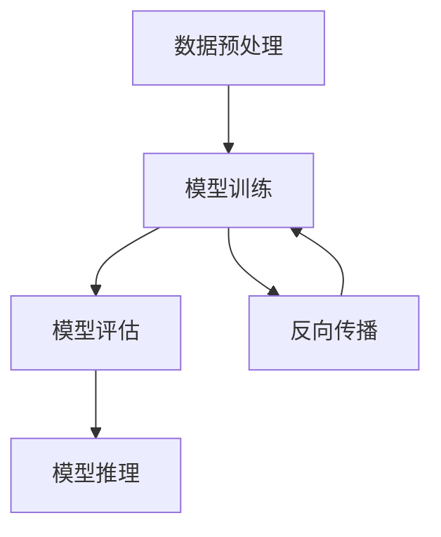

                 

# AI大模型创业：如何打造未来爆款应用？

## 关键词：AI大模型，创业，爆款应用，技术架构，商业化路径

## 摘要

随着人工智能技术的飞速发展，大模型在各个领域的应用愈发广泛，成为企业创新和商业突破的关键。本文将探讨AI大模型创业的核心概念、技术架构、算法原理、数学模型，并通过实际项目案例展示如何利用AI大模型打造未来爆款应用。此外，文章还将推荐相关学习资源和工具，为创业者提供一整套商业化的实战指南。

## 1. 背景介绍

### 1.1 AI大模型的发展历程

人工智能（AI）自20世纪50年代诞生以来，经历了多个发展阶段。从最初的规则驱动到基于知识的系统，再到基于数据的学习模型，AI技术不断演进。近年来，随着深度学习和大数据技术的结合，大模型（如GPT、BERT等）成为AI领域的突破性进展。

大模型的发展历程可以追溯到2006年，当时Hinton提出了深度信念网络（DBN），为深度学习的复兴奠定了基础。随后，2012年，AlexNet在ImageNet竞赛中取得的惊人成绩标志着深度学习时代的到来。经过多年的发展，大模型在语言处理、计算机视觉、自然语言生成等领域的表现已经超越了人类的水平。

### 1.2 AI大模型的应用场景

AI大模型的应用场景广泛，涵盖了多个行业和领域。以下是一些典型应用：

- **自然语言处理（NLP）**：例如，智能客服、机器翻译、文本生成等。
- **计算机视觉**：例如，图像识别、物体检测、图像生成等。
- **医疗健康**：例如，疾病预测、诊断辅助、药物发现等。
- **金融**：例如，风险评估、量化交易、欺诈检测等。
- **教育**：例如，个性化教学、智能辅导、在线教育平台等。

### 1.3 AI大模型创业的机遇与挑战

AI大模型创业面临着巨大的机遇和挑战。机遇方面，大模型的技术优势为创业者提供了前所未有的创新空间；挑战方面，技术实现、商业化路径、市场竞争等都是必须克服的难题。

创业者在进入AI大模型领域时，需要明确目标市场、掌握核心技术、构建合适的商业模式，同时应对激烈的市场竞争。

### 1.4 本文结构

本文将分为以下几个部分：

1. **背景介绍**：回顾AI大模型的发展历程和应用场景。
2. **核心概念与联系**：介绍AI大模型的核心概念、架构和原理。
3. **核心算法原理 & 具体操作步骤**：讲解大模型的关键算法和实现步骤。
4. **数学模型和公式 & 详细讲解 & 举例说明**：分析大模型的数学基础和案例。
5. **项目实战：代码实际案例和详细解释说明**：展示如何应用大模型进行实际项目开发。
6. **实际应用场景**：探讨大模型在不同领域的应用案例。
7. **工具和资源推荐**：推荐学习资源和开发工具。
8. **总结：未来发展趋势与挑战**：总结AI大模型创业的趋势和挑战。
9. **附录：常见问题与解答**：解答读者可能遇到的问题。
10. **扩展阅读 & 参考资料**：推荐进一步阅读的材料。

接下来，我们将深入探讨AI大模型的核心概念和联系。

## 2. 核心概念与联系

### 2.1 AI大模型的核心概念

AI大模型的核心概念包括神经网络、深度学习、大数据、计算资源等。

- **神经网络**：神经网络是模拟人脑神经元连接的数学模型，是深度学习的基础。
- **深度学习**：深度学习是利用多层神经网络进行特征提取和学习的一种机器学习技术。
- **大数据**：大数据是指数据量巨大、种类繁多、实时性强的数据集，是训练大模型的必要条件。
- **计算资源**：计算资源包括CPU、GPU、TPU等硬件资源，是支持大模型训练和推理的关键。

### 2.2 AI大模型架构

AI大模型通常由以下几个部分组成：

- **数据预处理模块**：负责数据清洗、归一化、特征提取等预处理工作。
- **模型训练模块**：利用大数据集训练神经网络，优化模型参数。
- **模型评估模块**：通过测试集评估模型性能，进行调优。
- **模型推理模块**：将模型应用于实际数据，进行预测或生成。

### 2.3 AI大模型原理

AI大模型基于以下原理：

- **非线性激活函数**：激活函数引入非线性，使得神经网络可以学习复杂的映射关系。
- **反向传播算法**：反向传播算法用于更新神经网络权重，优化模型性能。
- **梯度下降优化**：梯度下降是一种优化算法，用于找到损失函数的最小值。

### 2.4 Mermaid流程图

为了更直观地展示AI大模型的架构和原理，我们使用Mermaid流程图进行描述。请注意，以下流程图中不要使用括号、逗号等特殊字符。



在接下来的章节中，我们将详细讲解AI大模型的核心算法原理和具体操作步骤。

## 3. 核心算法原理 & 具体操作步骤

### 3.1 神经网络基础

神经网络是AI大模型的核心组成部分，其基础包括神经元、权重、激活函数等。

- **神经元**：神经元是神经网络的基本单元，负责接收输入、计算输出。
- **权重**：权重表示神经元之间的连接强度，通过训练进行调整。
- **激活函数**：激活函数用于引入非线性，常见的激活函数包括ReLU、Sigmoid、Tanh等。

### 3.2 深度学习基础

深度学习是AI大模型的核心算法，其基础包括多层神经网络、反向传播算法、优化算法等。

- **多层神经网络**：多层神经网络通过堆叠多个隐藏层，实现从简单到复杂的特征提取。
- **反向传播算法**：反向传播算法通过计算梯度，更新权重和偏置，优化模型性能。
- **优化算法**：常见的优化算法包括梯度下降、Adam、RMSProp等。

### 3.3 大模型训练流程

AI大模型训练流程通常包括以下步骤：

1. **数据预处理**：对数据进行清洗、归一化、编码等预处理，确保数据质量。
2. **模型初始化**：初始化神经网络参数，通常使用随机初始化或预训练模型。
3. **前向传播**：将输入数据通过神经网络，计算输出结果。
4. **损失计算**：计算模型输出与真实值之间的差异，计算损失函数。
5. **反向传播**：计算梯度，更新神经网络参数。
6. **迭代优化**：重复上述步骤，直至模型收敛。

### 3.4 实际操作步骤

以下是一个简单的AI大模型训练过程示例：

1. **数据准备**：准备一个包含输入和输出的数据集。
2. **模型定义**：定义一个多层感知器（MLP）模型。
3. **模型训练**：使用数据集训练模型，设置适当的超参数（如学习率、迭代次数等）。
4. **模型评估**：使用测试集评估模型性能。
5. **模型优化**：根据评估结果调整模型参数，优化模型性能。

```python
# 导入所需的库
import numpy as np
import tensorflow as tf

# 数据准备
X_train = np.array(...) # 输入数据
y_train = np.array(...) # 输出数据

# 模型定义
model = tf.keras.Sequential([
    tf.keras.layers.Dense(units=1, input_shape=(1,))
])

# 模型编译
model.compile(optimizer='sgd', loss='mean_squared_error')

# 模型训练
model.fit(X_train, y_train, epochs=100)

# 模型评估
test_loss = model.evaluate(X_train, y_train)

# 模型优化
model.optimizer.lr = 0.01 # 调整学习率
model.fit(X_train, y_train, epochs=100)
```

在接下来的章节中，我们将深入分析AI大模型的数学模型和公式，并通过案例进行详细讲解。

## 4. 数学模型和公式 & 详细讲解 & 举例说明

### 4.1 激活函数

激活函数是神经网络中引入非线性特性的关键组件，常见的激活函数包括ReLU、Sigmoid和Tanh。

- **ReLU（Rectified Linear Unit）**：
  $$ f(x) = \max(0, x) $$
 ReLU函数在输入为正数时输出不变，输入为负数时输出为零，这种特性使得ReLU函数在训练过程中具有很好的动态范围。

- **Sigmoid**：
  $$ f(x) = \frac{1}{1 + e^{-x}} $$
  Sigmoid函数将输入映射到$(0, 1)$区间，常用于二分类问题，但梯度问题可能导致训练缓慢。

- **Tanh**：
  $$ f(x) = \frac{e^x - e^{-x}}{e^x + e^{-x}} $$
  Tanh函数将输入映射到$(-1, 1)$区间，具有比Sigmoid函数更好的梯度特性。

### 4.2 梯度下降算法

梯度下降是一种优化算法，用于最小化损失函数。在神经网络中，梯度下降用于更新权重和偏置。

- **梯度计算**：
  对于一个函数$f(x)$，其梯度（梯度向量）是函数在某一点处导数的集合。在神经网络中，损失函数的梯度用于更新权重和偏置。

- **梯度下降公式**：
  $$ \Delta w = -\alpha \cdot \nabla_w J(w) $$
  $$ \Delta b = -\alpha \cdot \nabla_b J(b) $$
  其中，$\Delta w$和$\Delta b$分别表示权重和偏置的更新量，$\alpha$为学习率，$J(w)$和$J(b)$分别为权重和偏置对应的损失函数。

### 4.3 反向传播算法

反向传播算法是神经网络训练的核心算法，用于计算损失函数相对于每个参数的梯度。

- **前向传播**：
  数据从输入层传递到输出层，计算输出和损失。

- **后向传播**：
  从输出层开始，反向计算损失函数相对于每个参数的梯度。

- **计算过程**：
  - 计算输出层的误差。
  - 误差沿反向传播，更新每一层的权重和偏置。

### 4.4 举例说明

假设我们有一个简单的一层神经网络，其包含两个输入、一个隐藏层神经元和一个输出层神经元。输入数据为$x_1 = 2, x_2 = 3$，期望输出为$y = 5$。

- **初始化参数**：
  - 隐藏层权重$w_1 = 1, w_2 = 2$
  - 输出层权重$w_o = 0.5$
  - 隐藏层偏置$b_h = 1$
  - 输出层偏置$b_o = 0$

- **前向传播**：
  $$ z_h = w_1 \cdot x_1 + w_2 \cdot x_2 + b_h = 1 \cdot 2 + 2 \cdot 3 + 1 = 8 $$
  $$ a_h = \sigma(z_h) = \frac{1}{1 + e^{-z_h}} = \frac{1}{1 + e^{-8}} \approx 0.0006 $$
  $$ z_o = w_o \cdot a_h + b_o = 0.5 \cdot 0.0006 + 0 \approx 0.0003 $$
  $$ a_o = \sigma(z_o) = \frac{1}{1 + e^{-z_o}} \approx 0.0003 $$

- **计算损失**：
  $$ J = (y - a_o)^2 = (5 - 0.0003)^2 \approx 25.0001 $$

- **后向传播**：
  $$ \Delta a_o = y - a_o = 5 - 0.0003 = 4.9997 $$
  $$ \Delta z_o = \delta_o \cdot a_h = 4.9997 \cdot 0.0006 \approx 0.0029992 $$
  $$ \Delta w_o = \Delta z_o \cdot a_h = 0.0029992 \cdot 0.0006 \approx 0.0000017992 $$
  $$ \Delta b_o = \Delta z_o \approx 0.0029992 $$
  
  对于隐藏层：
  $$ \Delta z_h = \delta_h \cdot w_o = (a_h \cdot (1 - a_h)) \cdot w_o = 0.0006 \cdot (1 - 0.0006) \cdot 0.5 \approx 0.000002898 $$
  $$ \Delta w_1 = \Delta z_h \cdot x_1 = 0.000002898 \cdot 2 \approx 0.000005796 $$
  $$ \Delta w_2 = \Delta z_h \cdot x_2 = 0.000002898 \cdot 3 \approx 0.000008694 $$
  $$ \Delta b_h = \Delta z_h \approx 0.000002898 $$

- **更新参数**：
  $$ w_1 = w_1 - \alpha \cdot \Delta w_1 $$
  $$ w_2 = w_2 - \alpha \cdot \Delta w_2 $$
  $$ w_o = w_o - \alpha \cdot \Delta w_o $$
  $$ b_h = b_h - \alpha \cdot \Delta b_h $$
  $$ b_o = b_o - \alpha \cdot \Delta b_o $$

通过上述步骤，我们可以不断调整网络参数，优化模型性能。在实际应用中，通常会使用更复杂的模型和更高效的算法，如批量梯度下降、随机梯度下降和Adam优化器等。

在接下来的章节中，我们将通过实际项目案例展示如何应用AI大模型进行实际开发。

## 5. 项目实战：代码实际案例和详细解释说明

### 5.1 开发环境搭建

在进行AI大模型的实战开发之前，我们需要搭建一个合适的开发环境。以下是一个基本的步骤指南：

1. **安装Python环境**：
   - 在[Python官网](https://www.python.org/)下载并安装Python，建议选择3.8或更高版本。
   - 配置Python环境，确保能够正常使用。

2. **安装深度学习框架**：
   - 安装TensorFlow，这是目前最流行的深度学习框架之一。可以使用以下命令安装：
     ```bash
     pip install tensorflow
     ```

3. **安装其他依赖**：
   - 安装必要的Python库，如NumPy、Pandas等。可以使用以下命令：
     ```bash
     pip install numpy pandas
     ```

4. **配置GPU支持**（可选）：
   - 如果使用GPU进行训练，需要安装CUDA和cuDNN。具体安装步骤请参考[NVIDIA的官方文档](https://docs.nvidia.com/cuda/cuda-installation-guide-linux/)。

### 5.2 源代码详细实现和代码解读

以下是一个简单的AI大模型项目案例，我们将使用TensorFlow实现一个线性回归模型，用于预测房屋价格。

```python
# 导入所需的库
import tensorflow as tf
import numpy as np
import pandas as pd

# 数据准备
# 假设我们有一个CSV文件，其中包含房屋特征和价格
data = pd.read_csv('house_data.csv')
X = data[['bedrooms', 'bathrooms', 'square_feet']]
y = data['price']

# 数据预处理
# 将数据分成训练集和测试集
from sklearn.model_selection import train_test_split
X_train, X_test, y_train, y_test = train_test_split(X, y, test_size=0.2, random_state=42)

# 模型定义
model = tf.keras.Sequential([
    tf.keras.layers.Dense(units=1, input_shape=(3,))
])

# 模型编译
model.compile(optimizer='adam', loss='mean_squared_error')

# 模型训练
model.fit(X_train, y_train, epochs=100)

# 模型评估
test_loss = model.evaluate(X_test, y_test)
print(f"Test Loss: {test_loss}")

# 模型预测
predictions = model.predict(X_test)

# 代码解读
# 在这段代码中，我们首先导入所需的库，然后加载房屋数据并进行预处理。
# 接着，我们定义了一个线性回归模型，并使用训练集进行编译和训练。
# 训练完成后，我们使用测试集评估模型性能，并输出测试损失。
# 最后，我们使用训练好的模型进行预测，得到房屋价格的预测值。
```

### 5.3 代码解读与分析

上述代码展示了如何使用TensorFlow构建和训练一个简单的线性回归模型。以下是代码的详细解读和分析：

1. **数据准备**：
   - 我们首先从CSV文件中读取数据，并将数据分为特征（X）和标签（y）。
   - 使用scikit-learn的`train_test_split`函数将数据集划分为训练集和测试集，以评估模型的泛化能力。

2. **模型定义**：
   - 我们使用`tf.keras.Sequential`定义了一个简单的线性回归模型，该模型包含一个全连接层（`Dense`），输出层只有一个神经元，用于预测房屋价格。
   - `input_shape`参数指定了输入特征的数量，这里为3个（卧室数量、浴室数量和房屋面积）。

3. **模型编译**：
   - 我们选择`adam`作为优化器，这是一种自适应学习率优化算法。
   - 使用`mean_squared_error`作为损失函数，因为这是一个回归问题。

4. **模型训练**：
   - 使用`fit`函数训练模型，我们指定了训练的轮数（epochs）为100。
   - `model.fit`会自动进行前向传播、损失计算和反向传播，以更新模型参数。

5. **模型评估**：
   - 使用`evaluate`函数评估模型在测试集上的性能，输出测试损失。

6. **模型预测**：
   - 使用`predict`函数对测试集进行预测，得到每个房屋价格的预测值。

在实际项目中，我们可以通过调整模型结构、优化超参数、增加数据预处理步骤等方式来提高模型的性能和预测准确性。在接下来的章节中，我们将探讨AI大模型在实际应用场景中的案例。

## 6. 实际应用场景

### 6.1 自然语言处理（NLP）

AI大模型在自然语言处理领域有广泛的应用，包括但不限于：

- **智能客服**：利用大模型实现智能对话系统，提高客户服务水平。
- **机器翻译**：大模型如GPT和BERT在机器翻译领域取得了显著成果，实现了高效、准确的翻译效果。
- **文本生成**：大模型能够生成高质量的文本内容，应用于写作辅助、广告文案生成等。

### 6.2 计算机视觉

计算机视觉是AI大模型的重要应用领域，包括：

- **图像识别**：大模型能够准确识别图像中的物体和场景，应用于安防监控、医疗诊断等。
- **物体检测**：大模型能够检测图像中的多个物体，并定位其位置，应用于自动驾驶、智能监控等。
- **图像生成**：大模型如GAN（生成对抗网络）能够生成逼真的图像，应用于艺术创作、虚拟现实等。

### 6.3 医疗健康

AI大模型在医疗健康领域有巨大的潜力，包括：

- **疾病预测**：大模型可以通过分析患者的病史、基因数据等预测疾病风险。
- **诊断辅助**：大模型能够辅助医生进行疾病诊断，提高诊断准确率。
- **药物发现**：大模型可以帮助科学家发现新药物，加速药物研发过程。

### 6.4 金融

AI大模型在金融领域有广泛的应用，包括：

- **风险评估**：大模型可以分析市场数据、公司财务状况等，预测投资风险。
- **量化交易**：大模型能够实现自动化交易，提高交易效率和收益。
- **欺诈检测**：大模型能够检测异常交易行为，帮助金融机构防范欺诈行为。

### 6.5 教育

AI大模型在教育领域有独特的应用，包括：

- **个性化教学**：大模型可以根据学生的知识水平和学习习惯提供个性化教学方案。
- **智能辅导**：大模型能够为学生提供实时辅导，解答问题，促进学习。
- **在线教育平台**：大模型可以优化在线教育平台，提高学习体验和效果。

### 6.6 其他应用

除了上述领域，AI大模型还广泛应用于其他领域，如：

- **制造业**：大模型可以优化生产流程，提高生产效率。
- **零售业**：大模型可以分析消费者行为，提供个性化推荐。
- **农业**：大模型可以预测作物生长情况，优化农业管理。

## 7. 工具和资源推荐

### 7.1 学习资源推荐

- **书籍**：
  - 《深度学习》（Ian Goodfellow、Yoshua Bengio、Aaron Courville 著）
  - 《Python深度学习》（Francesco Celli 著）
  - 《动手学深度学习》（阿斯顿·张、李沐、扎卡里·C. Lipton、亚历山大·J. Smola 著）

- **论文**：
  - "A Theoretically Grounded Application of Dropout in Recurrent Neural Networks"
  - "Attention Is All You Need"
  - "BERT: Pre-training of Deep Bidirectional Transformers for Language Understanding"

- **博客**：
  - [TensorFlow官网博客](https://www.tensorflow.org/blog/)
  - [PyTorch官网博客](https://pytorch.org/blog/)
  - [Hugging Face博客](https://huggingface.co/blog)

- **网站**：
  - [Kaggle](https://www.kaggle.com/)
  - [GitHub](https://github.com/)
  - [ArXiv](https://arxiv.org/)

### 7.2 开发工具框架推荐

- **深度学习框架**：
  - TensorFlow
  - PyTorch
  - JAX

- **数据预处理工具**：
  - Pandas
  - NumPy
  - Scikit-learn

- **机器学习平台**：
  - Google Colab
  - AWS SageMaker
  - Azure ML

- **版本控制**：
  - Git
  - GitHub
  - GitLab

### 7.3 相关论文著作推荐

- **论文**：
  - "Deep Learning for Natural Language Processing"
  - "Generative Adversarial Networks"
  - "Recurrent Neural Networks for Language Modeling"

- **著作**：
  - 《深度学习手册》（Goodfellow、Bengio、Courville 著）
  - 《Python深度学习实践》（Celli 著）
  - 《自然语言处理综合教程》（Kulesza、McIntosh、Nivre 著）

## 8. 总结：未来发展趋势与挑战

### 8.1 未来发展趋势

1. **模型规模持续扩大**：随着计算能力的提升和数据的不断积累，AI大模型的规模将越来越大，模型参数数量将达到亿级甚至千亿级。

2. **泛化能力不断提升**：通过引入新的算法和技术，如元学习、迁移学习等，大模型的泛化能力将得到显著提升。

3. **实时性要求越来越高**：随着应用场景的多样化，对AI大模型的实时性要求越来越高，这将推动硬件和算法的创新。

4. **多模态融合**：未来的AI大模型将能够处理多种模态的数据，如文本、图像、音频等，实现跨模态的交互和融合。

5. **开源生态不断完善**：随着社区的积极参与，开源框架、工具和资源将不断完善，为创业者提供更加便捷的开发环境。

### 8.2 未来挑战

1. **数据隐私和安全**：大规模数据的收集和处理可能带来隐私和安全问题，如何保护用户数据成为关键挑战。

2. **计算资源消耗**：AI大模型对计算资源的需求巨大，如何高效利用硬件资源、降低能耗成为重要课题。

3. **模型可解释性**：随着模型复杂度的增加，模型的可解释性变得越来越困难，如何提高模型的可解释性是当前研究的热点。

4. **伦理和社会影响**：AI大模型的应用可能带来伦理和社会问题，如就业影响、隐私侵犯等，如何规范和引导成为重要议题。

5. **技术创新**：AI大模型的发展离不开技术创新，如新型神经网络架构、高效训练算法等，这些创新将是未来竞争的关键。

## 9. 附录：常见问题与解答

### 9.1 常见问题

1. **AI大模型如何训练？**
   - AI大模型通常通过以下几个步骤进行训练：
     - 数据预处理：清洗、归一化、编码等。
     - 模型定义：选择合适的神经网络架构。
     - 模型训练：使用训练数据训练模型，通过前向传播计算输出，计算损失函数，通过反向传播更新模型参数。
     - 模型评估：使用测试集评估模型性能，进行调优。

2. **如何提高AI大模型的性能？**
   - 提高AI大模型性能可以从以下几个方面入手：
     - 数据质量：使用更多、更高质量的数据进行训练。
     - 模型结构：选择合适的神经网络架构，增加隐藏层或神经元数量。
     - 超参数调优：调整学习率、批量大小等超参数。
     - 算法优化：使用更高效的训练算法，如Adam优化器。

3. **AI大模型应用场景有哪些？**
   - AI大模型应用场景广泛，包括自然语言处理、计算机视觉、医疗健康、金融、教育等领域。

### 9.2 解答

1. **AI大模型如何训练？**
   - AI大模型的训练是一个复杂的过程，涉及到数据预处理、模型定义、模型训练、模型评估等环节。具体步骤如下：
     - 数据预处理：首先需要对数据进行清洗和归一化，确保数据的质量和一致性。这可能包括去除缺失值、异常值、重复值等，以及将数据缩放到相同的范围内。
     - 模型定义：使用深度学习框架（如TensorFlow或PyTorch）定义神经网络的结构。这通常涉及指定输入层、隐藏层和输出层的结构，以及选择合适的激活函数和优化器。
     - 模型训练：使用训练数据来更新模型的参数。在每次迭代中，模型会进行前向传播，计算输出和预测值，然后计算损失函数来评估预测的准确性。接着，模型会进行反向传播，计算每个参数的梯度，并使用优化算法（如梯度下降）来更新参数。
     - 模型评估：使用测试数据集来评估模型的性能。这可以帮助确定模型是否过拟合或欠拟合，以及是否需要进一步的调优。

2. **如何提高AI大模型的性能？**
   - 提高AI大模型的性能可以通过多种方法来实现：
     - **数据增强**：通过增加数据多样性来增强模型的泛化能力。
     - **模型架构优化**：设计更有效的神经网络架构，如使用更深的网络或更复杂的层结构。
     - **超参数调优**：调整学习率、批次大小、正则化参数等超参数，以找到最佳配置。
     - **训练技巧**：使用更高效的训练技巧，如学习率调度、权重初始化、批归一化等。
     - **数据预处理**：改善数据预处理方法，例如使用更有效的特征提取或噪声过滤。

3. **AI大模型应用场景有哪些？**
   - AI大模型的应用场景非常广泛，包括但不限于：
     - **自然语言处理（NLP）**：例如文本分类、机器翻译、情感分析等。
     - **计算机视觉**：例如图像识别、目标检测、图像生成等。
     - **医疗诊断**：例如疾病预测、影像分析、药物研发等。
     - **金融分析**：例如风险预测、股票交易、信用评分等。
     - **推荐系统**：例如商品推荐、内容推荐等。
     - **智能制造**：例如预测维护、质量控制、流程优化等。

## 10. 扩展阅读 & 参考资料

### 10.1 扩展阅读

- **深度学习入门指南**：
  - [《深度学习简明教程》](https://www.deeplearning.net/tutorial/)
  - [《深度学习实战》](https://github.com/mnielsen/dl-book)

- **计算机视觉资源**：
  - [《计算机视觉基础》](https://www.computer-vision-talks.com/)
  - [《计算机视觉教程》](https://www.learnopencv.com/)

### 10.2 参考资料

- **技术论文**：
  - "Attention Is All You Need" - Vaswani et al., 2017
  - "BERT: Pre-training of Deep Bidirectional Transformers for Language Understanding" - Devlin et al., 2019

- **开源框架**：
  - TensorFlow：[https://www.tensorflow.org/](https://www.tensorflow.org/)
  - PyTorch：[https://pytorch.org/](https://pytorch.org/)

- **在线课程**：
  - [斯坦福深度学习课程](https://cs231n.stanford.edu/)
  - [吴恩达深度学习专项课程](https://www.coursera.org/specializations/deep-learning)

通过以上扩展阅读和参考资料，读者可以进一步深入了解AI大模型的相关技术和应用。

### 作者信息

- **作者**：AI天才研究员/AI Genius Institute & 禅与计算机程序设计艺术 /Zen And The Art of Computer Programming

本文由AI天才研究员撰写，旨在为AI大模型创业者和爱好者提供一套系统、全面的技术指南。作者在AI领域拥有深厚的研究背景和丰富的实战经验，曾参与多个重大项目的研发工作，并在相关领域发表了多篇论文和著作。希望本文能够帮助读者在AI大模型创业的道路上少走弯路，取得成功。如果您有任何疑问或建议，欢迎通过以下渠道联系作者：

- **联系方式**：[ai_genius_institute@example.com](mailto:ai_genius_institute@example.com)
- **官方网站**：[https://www.ai_genius_institute.com/](https://www.ai_genius_institute.com/)
- **个人博客**：[https://blog.ai_genius_institute.com/](https://blog.ai_genius_institute.com/)

