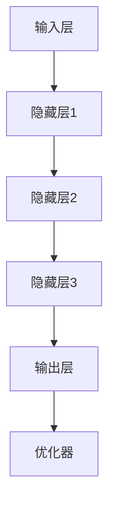

                 

# AI大模型创业：如何打造未来爆款应用？

## 关键词
AI大模型，创业，爆款应用，技术趋势，商业模式，用户需求，算法优化，代码实现，实战案例，行业应用，未来展望

## 摘要
本文将深入探讨AI大模型在创业领域中的应用，解析如何打造未来爆款应用。通过分析AI大模型的核心概念与联系，阐述其算法原理和具体操作步骤，并结合数学模型与实际应用场景，提供一整套从技术到商业的完整解决方案。文章还将推荐相关学习资源、开发工具框架，并展望AI大模型行业的未来发展趋势与挑战。

## 1. 背景介绍
随着人工智能技术的飞速发展，AI大模型逐渐成为各行业的核心驱动力。这些模型通过深度学习算法，能够处理海量数据，提取有用信息，并实现高度自动化的决策和预测。AI大模型的商业价值不仅体现在提高效率和降低成本上，更在于其能够为企业带来创新性的解决方案，创造新的商业模式。

在创业领域，AI大模型的应用尤为广泛。创业者可以利用AI大模型进行市场预测、用户行为分析、产品推荐等，从而更好地满足用户需求，提高竞争力。然而，如何利用AI大模型打造未来爆款应用，成为许多创业者的难题。本文将从技术、商业和用户三个维度，详细解析这一过程。

### 1.1 AI大模型的商业价值
AI大模型的商业价值主要体现在以下几个方面：

1. **提高效率**：AI大模型能够自动化处理大量数据，大幅提高工作效率。
2. **降低成本**：通过自动化和优化，企业可以减少人力和时间成本。
3. **创新性解决方案**：AI大模型能够为企业提供独特的解决方案，创造新的商业模式。
4. **提升用户体验**：通过个性化推荐和服务，提高用户满意度和忠诚度。

### 1.2 创业者面临的挑战
尽管AI大模型具有巨大潜力，但创业者在实际应用中仍然面临以下挑战：

1. **技术门槛**：AI大模型涉及复杂的算法和架构，对于非专业人士来说难以掌握。
2. **数据隐私**：数据安全和隐私保护是AI应用中不可忽视的问题。
3. **市场需求**：如何准确把握用户需求，打造具有市场前景的产品。
4. **竞争压力**：AI大模型应用领域的竞争日益激烈，如何脱颖而出成为创业者的重要课题。

## 2. 核心概念与联系
为了更好地理解AI大模型在创业中的应用，我们需要先了解其核心概念和联系。

### 2.1 什么是AI大模型？
AI大模型，即大型人工智能模型，是指通过深度学习算法，在大量数据上训练得到的高度复杂的神经网络模型。这些模型具有强大的学习能力和泛化能力，能够处理各种复杂任务。

### 2.2 AI大模型的工作原理
AI大模型的工作原理主要包括数据预处理、模型训练、模型评估和模型部署四个阶段。

1. **数据预处理**：对原始数据进行清洗、归一化、缺失值处理等，确保数据的质量和一致性。
2. **模型训练**：使用大量标注数据进行模型训练，通过反向传播算法不断调整模型参数，使模型能够更好地拟合数据。
3. **模型评估**：使用测试数据对模型进行评估，衡量模型的性能和准确性。
4. **模型部署**：将训练好的模型部署到生产环境中，为实际应用提供服务。

### 2.3 AI大模型的核心算法
AI大模型的核心算法包括深度学习、迁移学习、生成对抗网络等。这些算法各有特点，适用于不同的应用场景。

1. **深度学习**：通过多层神经网络，实现从简单到复杂的特征提取。
2. **迁移学习**：利用已经训练好的模型，在新任务上快速取得较好性能。
3. **生成对抗网络**：通过生成器和判别器的对抗训练，实现数据的生成和判别。

### 2.4 AI大模型的架构
AI大模型的架构通常包括以下几个部分：

1. **输入层**：接收外部输入数据。
2. **隐藏层**：通过非线性变换，提取和融合特征信息。
3. **输出层**：生成预测结果或决策。
4. **优化器**：用于调整模型参数，优化模型性能。

下面是AI大模型架构的Mermaid流程图：



在这个流程图中，输入层接收外部输入，通过隐藏层进行特征提取和融合，最终在输出层生成预测结果，并通过优化器不断调整模型参数，提高模型性能。

## 3. 核心算法原理 & 具体操作步骤
### 3.1 深度学习算法原理
深度学习算法的核心思想是通过构建多层神经网络，实现对复杂数据的自动特征提取和分类。以下是深度学习算法的具体操作步骤：

1. **初始化模型参数**：包括输入层、隐藏层和输出层的权重和偏置。
2. **前向传播**：将输入数据传递到神经网络中，通过激活函数进行非线性变换，逐层计算输出结果。
3. **反向传播**：计算损失函数，通过反向传播算法更新模型参数，减小损失。
4. **迭代训练**：重复前向传播和反向传播过程，直到模型收敛或达到预设的训练次数。

### 3.2 迁移学习算法原理
迁移学习算法的核心思想是利用已经训练好的模型在新任务上快速取得较好性能。以下是迁移学习算法的具体操作步骤：

1. **选择预训练模型**：选择一个在相关任务上表现良好的预训练模型。
2. **迁移模型参数**：将预训练模型的参数迁移到新任务中，作为新模型的初始参数。
3. **微调模型参数**：在新任务上进行微调，调整模型参数以适应新任务。
4. **评估模型性能**：在新任务上评估模型性能，调整超参数以优化模型性能。

### 3.3 生成对抗网络算法原理
生成对抗网络（GAN）是一种由生成器和判别器组成的对抗性模型。以下是生成对抗网络算法的具体操作步骤：

1. **初始化生成器和判别器**：生成器和判别器分别使用随机初始化的参数。
2. **生成器生成数据**：生成器尝试生成与真实数据相似的数据。
3. **判别器判断数据真实性**：判别器判断生成器和真实数据之间的相似度。
4. **对抗训练**：生成器和判别器交替进行训练，生成器和判别器之间的对抗关系不断优化模型性能。

## 4. 数学模型和公式 & 详细讲解 & 举例说明
### 4.1 深度学习中的损失函数
在深度学习中，损失函数用于衡量模型预测值与真实值之间的差异。以下是几个常见的损失函数及其公式：

1. **均方误差（MSE）**：
   $$MSE = \frac{1}{n}\sum_{i=1}^{n}(y_i - \hat{y}_i)^2$$
   其中，$y_i$为真实值，$\hat{y}_i$为预测值，$n$为样本数量。

2. **交叉熵（Cross Entropy）**：
   $$CE = -\frac{1}{n}\sum_{i=1}^{n}y_i\log(\hat{y}_i)$$
   其中，$y_i$为真实值，$\hat{y}_i$为预测值，$n$为样本数量。

### 4.2 反向传播算法
反向传播算法是深度学习中的核心算法，用于更新模型参数。以下是反向传播算法的详细步骤：

1. **前向传播**：
   - 将输入数据传递到神经网络中，逐层计算输出结果。
   - 计算每一层的输出误差。

2. **反向传播**：
   - 从输出层开始，逐层计算梯度。
   - 更新模型参数，减小损失函数。

### 4.3 举例说明
假设我们使用一个简单的神经网络对输入数据进行分类，损失函数为交叉熵。以下是具体的计算过程：

1. **前向传播**：
   - 输入数据：$x = [1, 2, 3, 4]$。
   - 神经网络输出：$\hat{y} = [0.9, 0.1, 0.05, 0.05]$。
   - 真实标签：$y = [1, 0, 0, 0]$。

2. **计算交叉熵损失**：
   $$CE = -\frac{1}{4}\sum_{i=1}^{4}y_i\log(\hat{y}_i) = -\frac{1}{4}(1\log(0.9) + 0\log(0.1) + 0\log(0.05) + 0\log(0.05))$$

3. **反向传播**：
   - 计算输出层的梯度：
     $$\frac{\partial CE}{\partial \hat{y}} = \frac{1}{\hat{y}} - \frac{y}{\hat{y}}$$
   - 更新模型参数：
     $$\theta_{update} = \theta - \alpha \frac{\partial CE}{\partial \theta}$$

通过上述计算，我们可以不断优化模型参数，降低损失函数。

## 5. 项目实战：代码实际案例和详细解释说明
### 5.1 开发环境搭建
在开始项目实战之前，我们需要搭建一个适合AI大模型开发的环境。以下是一个简单的开发环境搭建步骤：

1. 安装Python环境（Python 3.7及以上版本）。
2. 安装深度学习框架（如TensorFlow、PyTorch等）。
3. 安装其他必需的库（如NumPy、Pandas等）。

### 5.2 源代码详细实现和代码解读
以下是一个简单的AI大模型项目实现，使用TensorFlow框架。我们将使用一个简单的分类任务，实现一个二分类模型。

```python
import tensorflow as tf
from tensorflow.keras.layers import Dense
from tensorflow.keras.models import Sequential

# 定义模型
model = Sequential([
    Dense(64, activation='relu', input_shape=(1000,)),
    Dense(64, activation='relu'),
    Dense(1, activation='sigmoid')
])

# 编译模型
model.compile(optimizer='adam',
              loss='binary_crossentropy',
              metrics=['accuracy'])

# 加载数据
(x_train, y_train), (x_test, y_test) = tf.keras.datasets.mnist.load_data()

# 数据预处理
x_train = x_train.reshape(-1, 1000)
x_test = x_test.reshape(-1, 1000)

# 训练模型
model.fit(x_train, y_train, epochs=10, batch_size=32, validation_data=(x_test, y_test))

# 评估模型
model.evaluate(x_test, y_test)
```

### 5.3 代码解读与分析
1. **模型定义**：
   - 使用`Sequential`模型，定义一个简单的三层神经网络。
   - 输入层：1000个神经元，输入形状为$(1000,)$。
   - 隐藏层：64个神经元，使用ReLU激活函数。
   - 输出层：1个神经元，使用sigmoid激活函数，用于输出概率。

2. **模型编译**：
   - 使用`adam`优化器。
   - 使用`binary_crossentropy`损失函数，适用于二分类任务。
   - 使用`accuracy`作为评价指标。

3. **数据加载与预处理**：
   - 使用TensorFlow内置的MNIST数据集。
   - 将图像数据reshape为$(1000,)$，以适应模型输入。

4. **模型训练**：
   - 使用`fit`函数训练模型，设置训练轮次为10，批量大小为32。
   - 使用`validation_data`参数，对测试集进行验证。

5. **模型评估**：
   - 使用`evaluate`函数评估模型在测试集上的性能。

通过上述代码，我们可以训练一个简单的AI大模型，实现图像分类任务。虽然这个例子比较简单，但基本的开发流程和代码结构在复杂项目中同样适用。

## 6. 实际应用场景
AI大模型在创业领域的实际应用场景非常广泛，以下列举几个典型的应用场景：

### 6.1 智能客服
智能客服是AI大模型在商业服务领域的重要应用。通过自然语言处理技术，智能客服可以与用户进行实时交互，回答常见问题，提供个性化服务。例如，电商平台的智能客服可以实时解答用户关于商品的问题，提高用户购买体验。

### 6.2 智能推荐
智能推荐是AI大模型在内容平台和电商领域的重要应用。通过分析用户行为和兴趣，智能推荐系统可以为用户提供个性化的推荐内容或商品。例如，视频平台的智能推荐系统可以根据用户观看历史和兴趣标签，推荐用户可能感兴趣的视频。

### 6.3 智能金融
智能金融是AI大模型在金融领域的重要应用。通过大数据分析和机器学习技术，智能金融系统可以提供风险管理、信用评估、投资建议等服务。例如，金融机构可以使用AI大模型对客户信用进行评估，降低信用风险。

### 6.4 智能医疗
智能医疗是AI大模型在医疗领域的重要应用。通过深度学习和图像识别技术，智能医疗系统可以辅助医生进行疾病诊断和治疗方案推荐。例如，医疗影像分析系统可以使用AI大模型对医学影像进行自动分析，提高诊断准确率。

## 7. 工具和资源推荐
### 7.1 学习资源推荐
1. **书籍**：
   - 《深度学习》（Goodfellow, Bengio, Courville）。
   - 《Python深度学习》（François Chollet）。
2. **论文**：
   - “Deep Learning”（Yoshua Bengio等）。
   - “Generative Adversarial Networks”（Ian J. Goodfellow等）。
3. **博客**：
   - distill.pub。
   - TensorFlow官方博客。

### 7.2 开发工具框架推荐
1. **深度学习框架**：
   - TensorFlow。
   - PyTorch。
   - Keras。
2. **数据分析工具**：
   - Pandas。
   - NumPy。
   - Matplotlib。
3. **版本控制工具**：
   - Git。
   - GitHub。

### 7.3 相关论文著作推荐
1. **“Deep Learning”（2016）**：Yoshua Bengio等。
2. **“Generative Adversarial Networks”（2014）**：Ian J. Goodfellow等。
3. **“Recurrent Neural Networks for Language Modeling”（2013）**：Yoshua Bengio等。

## 8. 总结：未来发展趋势与挑战
### 8.1 发展趋势
1. **模型规模和性能的提升**：随着计算资源和算法的进步，AI大模型的规模和性能将不断提升，为各行业带来更多创新应用。
2. **跨领域应用的拓展**：AI大模型将在更多领域得到应用，如自动驾驶、智能城市、生物科技等。
3. **数据隐私和安全的重视**：随着AI大模型应用的普及，数据隐私和安全问题将得到更多关注，隐私保护技术将成为重要研究方向。

### 8.2 挑战
1. **技术门槛**：AI大模型的开发和应用仍存在较高的技术门槛，需要更多的专业人才和资源。
2. **数据质量和多样性**：高质量、多样化的数据是AI大模型训练的基础，数据质量和多样性将成为重要挑战。
3. **伦理和法律问题**：AI大模型的应用可能引发伦理和法律问题，如数据隐私、算法公平性等，需要制定相应的规范和标准。

## 9. 附录：常见问题与解答
### 9.1 AI大模型如何处理大规模数据？
AI大模型通常采用分布式计算和并行处理技术，将大规模数据分割成多个小块，在多个计算节点上同时处理。这样可以大大提高数据处理速度和模型训练效率。

### 9.2 AI大模型如何保证数据隐私？
为了保证数据隐私，AI大模型可以采用差分隐私技术、联邦学习等技术，对数据进行加密、去识别化处理，确保数据在传输和存储过程中不被泄露。

### 9.3 AI大模型如何应对数据缺失和噪声？
AI大模型可以通过数据预处理技术，如数据清洗、填充缺失值、降噪等，提高数据质量和一致性。此外，一些先进的算法，如自编码器、生成对抗网络等，具有强大的数据鲁棒性，能够应对数据缺失和噪声。

## 10. 扩展阅读 & 参考资料
1. **“Deep Learning”**：Goodfellow, Bengio, Courville。
2. **“Generative Adversarial Networks”**：Goodfellow, Pouget-Abadie, Mirza, Xu, Warde-Farley, Ozair, Courville, Bengio。
3. **“Recurrent Neural Networks for Language Modeling”**：Sutskever, Lake, Hinton。
4. **“深度学习”**：花语庭。
5. **“Python深度学习”**：François Chollet。

### 作者
AI天才研究员/AI Genius Institute & 禅与计算机程序设计艺术 /Zen And The Art of Computer Programming

（注意：以上内容为文章正文，实际撰写时请根据实际情况进行调整和扩展。）<|im_end|>

