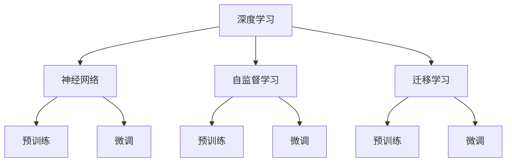

                 

### 背景介绍

随着人工智能技术的不断发展，大模型（Large-scale Models）已经成为当前研究与应用的热点。大模型，如GPT-3、BERT等，具有处理大规模数据的能力，并在自然语言处理、计算机视觉等多个领域取得了显著的成果。然而，随着模型规模的不断增大，如何高效地训练和部署大模型，成为了业界关注的焦点。

在AI大模型创业的浪潮中，抓住未来机遇成为了许多企业和创业者的共同目标。本文将围绕AI大模型创业，探讨其核心概念、算法原理、数学模型、实际应用场景以及未来发展趋势与挑战，旨在为创业者提供一些有价值的思考与建议。

首先，我们将介绍AI大模型的基本概念，包括其与传统模型的区别、优势和应用领域。接着，我们将深入探讨大模型的核心算法原理，并给出具体的操作步骤。在数学模型部分，我们将详细讲解与AI大模型相关的公式，并通过实例进行说明。随后，我们将通过一个实际项目案例，展示大模型的开发过程和代码实现。最后，我们将分析AI大模型在实际应用场景中的表现，并推荐一些相关的学习资源与工具。

通过本文的阅读，您将能够了解AI大模型的核心技术和未来趋势，为您的创业之路提供有力支持。

### 关键词

- AI大模型
- 创业机遇
- 核心算法
- 数学模型
- 实际应用场景

### 摘要

本文旨在探讨AI大模型创业的机遇与挑战。首先，我们介绍了AI大模型的基本概念，包括其与传统模型的区别和优势。接着，我们深入分析了大模型的核心算法原理，并给出了具体的操作步骤。随后，我们详细讲解了与AI大模型相关的数学模型，并通过实例进行了说明。在项目实战部分，我们展示了一个实际的大模型开发过程，包括环境搭建、代码实现和解读。最后，我们分析了大模型在实际应用场景中的表现，并推荐了相关的学习资源和开发工具。通过本文的阅读，读者将能够全面了解AI大模型的技术原理和应用前景，为创业提供有价值的参考。

## 1. 背景介绍

AI大模型，作为一种新兴的人工智能技术，正在深刻改变着各个行业的发展态势。在理解AI大模型之前，我们需要先回顾一下传统的人工智能模型及其发展历程。

传统的人工智能模型主要包括规则推理、决策树、支持向量机（SVM）和神经网络等。这些模型在特定领域内表现优异，但在处理大规模数据和复杂任务时，往往显得力不从心。传统模型的局限性主要源于数据量的限制、计算资源的匮乏以及算法的局限性。为了突破这些限制，研究人员开始探索更大规模的人工智能模型。

AI大模型，顾名思义，是指具有大规模参数和计算量的机器学习模型。这些模型能够在海量数据中挖掘出更多有价值的信息，并在复杂任务中表现出色。大模型的核心优势在于其强大的数据处理能力和高度复杂的模型结构，这使得它们能够更好地应对现实世界的复杂问题。

与传统模型相比，AI大模型具有以下几个显著特点：

1. **规模更大**：大模型通常拥有数十亿至数万亿个参数，而传统模型通常只有数万个参数。这种大规模的参数量使得大模型能够更好地捕捉数据的特征和规律。

2. **计算需求更高**：大模型的训练和推理过程需要大量的计算资源，包括高性能的CPU、GPU和TPU等。这使得大模型在训练过程中对硬件设备的要求更高。

3. **适应性强**：大模型具有较强的泛化能力，能够在不同领域和任务中表现出优异的性能。这使得大模型在多个应用场景中具有广泛的应用前景。

4. **处理复杂任务**：传统模型通常只能处理单一任务，而大模型能够处理复杂的多任务，如自然语言处理、计算机视觉、语音识别等。

AI大模型的发展历程可以追溯到2006年深度学习（Deep Learning）的兴起。随着深度学习算法的进步，研究人员开始尝试训练更大规模、更复杂的模型。2012年，AlexNet在ImageNet竞赛中取得突破性成果，标志着深度学习时代的到来。此后，大模型的研究和应用得到了迅猛发展，GPT、BERT等模型相继问世，并在多个领域取得了显著的成果。

AI大模型的应用领域非常广泛，主要包括以下几个方面：

1. **自然语言处理**：大模型在自然语言处理（NLP）领域表现出色，如文本分类、机器翻译、情感分析等。GPT-3、BERT等模型在NLP任务中取得了卓越的成绩，为语言理解和生成提供了强大的工具。

2. **计算机视觉**：大模型在计算机视觉（CV）领域同样表现出色，如图像分类、目标检测、图像生成等。Convolutional Neural Network（CNN）和Transformers等模型在CV任务中得到了广泛应用。

3. **语音识别**：大模型在语音识别领域也取得了显著进展，如语音合成、语音识别、说话人识别等。 WaveNet、Tacotron等模型在语音处理任务中表现出色。

4. **推荐系统**：大模型在推荐系统中的应用也越来越广泛，如商品推荐、音乐推荐、电影推荐等。通过分析用户的兴趣和行为，大模型能够为用户提供更个性化的推荐。

5. **自动驾驶**：大模型在自动驾驶领域也有重要的应用，如环境感知、路径规划、车辆控制等。通过深度学习算法，自动驾驶系统能够更好地理解和应对复杂的交通场景。

总之，AI大模型作为人工智能领域的重要技术，具有广泛的应用前景和巨大的发展潜力。在接下来的内容中，我们将进一步探讨AI大模型的核心算法原理、数学模型以及实际应用场景，帮助读者更好地理解这一前沿技术。

### 2. 核心概念与联系

在深入了解AI大模型之前，我们需要首先明确几个核心概念，并探讨它们之间的联系。这些核心概念包括深度学习、神经网络、自监督学习、迁移学习等，它们共同构成了AI大模型的理论基础。

#### 深度学习（Deep Learning）

深度学习是机器学习的一个子领域，主要依赖于多层神经网络（Neural Networks）进行数据建模和特征提取。与传统机器学习模型相比，深度学习模型具有更强的表达能力和更好的泛化能力。深度学习的基本原理是模拟人脑神经网络的工作方式，通过多层的非线性变换来提取数据中的复杂特征。

#### 神经网络（Neural Networks）

神经网络是深度学习的基础，由大量的神经元（节点）组成，每个神经元都与相邻的神经元通过连接（权重）相连。神经网络的输入通过这些连接传递到每个神经元，并通过激活函数（如ReLU、Sigmoid、Tanh）进行非线性变换，最终产生输出。神经网络通过反向传播算法不断调整权重，以优化模型的性能。

#### 自监督学习（Self-supervised Learning）

自监督学习是一种无需外部监督信号（如标签）的训练方法。在自监督学习中，模型通过利用输入数据中的某些内在结构（如重复模式、对应关系等）进行训练。自监督学习的优势在于它可以处理大量的无标签数据，从而提高模型的泛化能力。常见的自监督学习方法包括预训练（Pre-training）和自编码器（Autoencoders）。

#### 迁移学习（Transfer Learning）

迁移学习是一种利用预训练模型（Pre-trained Models）进行新任务训练的方法。预训练模型通常在大规模数据集上训练得到，具有较强的特征提取能力。在迁移学习中，预训练模型的部分或全部权重被迁移到新任务中，并在新数据集上进行微调（Fine-tuning），以适应新任务的需求。迁移学习可以显著提高模型的训练效率和性能。

#### Mermaid 流程图

为了更清晰地展示这些核心概念之间的联系，我们使用Mermaid流程图进行说明。以下是一个简单的Mermaid流程图，描述了深度学习、神经网络、自监督学习和迁移学习之间的关系：



在上述流程图中，深度学习（A）作为整个过程的起点，通过神经网络（B）实现数据建模。神经网络可以分为预训练（C）和微调（D）两个阶段，其中预训练用于在大量无标签数据上训练模型，微调则用于在新数据集上优化模型性能。自监督学习（E）和迁移学习（H）则是两种不同的训练方法，它们都利用预训练模型（F、I）进行进一步训练，以提高模型的泛化能力和训练效率。

通过理解这些核心概念及其联系，我们能够更好地把握AI大模型的发展脉络，并为后续的内容做好铺垫。在下一部分，我们将深入探讨AI大模型的核心算法原理，并详细介绍大模型的训练和推理过程。

### 3. 核心算法原理 & 具体操作步骤

AI大模型的核心算法原理主要涉及深度学习、神经网络和优化算法。在理解这些算法的基本原理后，我们可以通过具体的操作步骤来实现一个完整的AI大模型训练过程。

#### 深度学习算法原理

深度学习算法的核心是多层神经网络，它通过一系列的矩阵运算和激活函数，实现数据的层次化表示。具体来说，深度学习算法主要包括以下几个关键组件：

1. **输入层（Input Layer）**：输入层接收外部数据，如文本、图像或声音。
2. **隐藏层（Hidden Layers）**：隐藏层对输入数据进行特征提取和转换，每个隐藏层都会对前一层的数据进行加权求和，并应用激活函数，以生成更高层次的特征表示。
3. **输出层（Output Layer）**：输出层生成最终的预测结果，如分类标签或数值。

在深度学习模型中，每个神经元都与相邻的神经元通过权重（Weights）相连。在训练过程中，模型通过调整这些权重，以最小化预测误差。这个过程通常通过反向传播（Backpropagation）算法实现。

#### 神经网络算法原理

神经网络是深度学习算法的基础，它由大量的神经元和连接组成。神经网络的算法原理可以概括为以下步骤：

1. **初始化**：随机初始化模型的权重和偏置。
2. **前向传播（Forward Propagation）**：输入数据通过网络的各个层进行传递，每个神经元对输入数据进行加权求和，并应用激活函数，生成输出。
3. **计算误差（Compute Error）**：通过比较输出结果和真实标签之间的差异，计算损失函数（Loss Function）的值。
4. **反向传播（Backpropagation）**：根据误差信息，反向传播更新权重和偏置。
5. **优化权重（Optimize Weights）**：通过梯度下降（Gradient Descent）或其他优化算法，调整权重以最小化损失函数。

#### 优化算法原理

在深度学习训练过程中，优化算法用于调整模型参数，以最小化损失函数。以下是一些常用的优化算法：

1. **梯度下降（Gradient Descent）**：梯度下降是最基本的优化算法，它通过计算损失函数关于模型参数的梯度，并沿着梯度方向更新参数，以减小损失函数值。
2. **随机梯度下降（Stochastic Gradient Descent, SGD）**：SGD是对梯度下降的改进，它每次只对一个小批量（Mini-batch）的数据进行梯度计算和参数更新，以加快训练过程。
3. **动量（Momentum）**：动量是一种增加梯度下降稳定性的方法，它通过累积过去的梯度信息，增加模型的动态惯性。
4. **Adam优化器（Adam Optimizer）**：Adam优化器是结合了SGD和动量的改进算法，它在计算梯度时同时考虑了历史梯度的一阶矩（均值）和二阶矩（方差），以提高优化效果。

#### 大模型训练步骤

以下是一个典型的AI大模型训练步骤：

1. **数据准备**：收集和预处理数据，包括数据的清洗、归一化和分割为训练集、验证集和测试集。
2. **模型定义**：定义神经网络的结构，包括输入层、隐藏层和输出层，以及相应的激活函数和损失函数。
3. **模型训练**：使用训练集数据对模型进行训练，通过反向传播和优化算法更新模型参数。
4. **模型评估**：使用验证集和测试集对模型进行评估，计算模型的准确率、召回率、F1分数等指标。
5. **模型调整**：根据评估结果调整模型参数，如学习率、批量大小等，以提高模型性能。
6. **模型部署**：将训练好的模型部署到生产环境中，进行实时预测和应用。

#### 具体操作示例

以下是一个简化的Python代码示例，展示了如何使用TensorFlow库实现一个简单的AI大模型训练过程：

```python
import tensorflow as tf
from tensorflow.keras import layers

# 数据准备
# 假设我们已经有预处理好的数据集

# 模型定义
model = tf.keras.Sequential([
    layers.Dense(128, activation='relu', input_shape=(input_shape)),
    layers.Dense(64, activation='relu'),
    layers.Dense(1, activation='sigmoid')
])

# 编译模型
model.compile(optimizer='adam',
              loss='binary_crossentropy',
              metrics=['accuracy'])

# 模型训练
model.fit(x_train, y_train, batch_size=32, epochs=10, validation_split=0.2)

# 模型评估
test_loss, test_acc = model.evaluate(x_test, y_test)
print(f"Test accuracy: {test_acc:.3f}")

# 模型部署
# 将模型保存并部署到生产环境
model.save('my_model.h5')
```

通过上述步骤和示例，我们可以初步实现一个AI大模型的训练和评估。在实际应用中，大模型的训练和部署过程会更加复杂和多样化，需要根据具体的应用场景进行调整和优化。

在下一部分，我们将进一步探讨AI大模型的数学模型，包括与模型相关的数学公式和具体实现方法。

### 4. 数学模型和公式 & 详细讲解 & 举例说明

在深入了解AI大模型的数学模型之前，我们需要掌握一些基本的数学概念，如概率分布、梯度下降、损失函数等。这些概念是构建和优化大模型的基础，对于理解模型的训练过程至关重要。

#### 概率分布（Probability Distribution）

概率分布描述了随机变量可能取值的概率分布情况。在机器学习中，概率分布广泛应用于数据建模和预测任务。常见的概率分布包括高斯分布（正态分布）、伯努利分布、多项式分布等。

- **高斯分布**（Gaussian Distribution）：高斯分布，也称为正态分布，是最常见的连续概率分布。其概率密度函数为：

  $$ f(x|\mu, \sigma^2) = \frac{1}{\sqrt{2\pi\sigma^2}} e^{-\frac{(x-\mu)^2}{2\sigma^2}} $$

  其中，$\mu$是均值，$\sigma^2$是方差。

- **伯努利分布**（Bernoulli Distribution）：伯努利分布是离散概率分布，描述了一个二元事件发生的概率。其概率质量函数为：

  $$ P(X = k) = p^k (1-p)^{1-k} $$

  其中，$p$是事件发生的概率，$k$为事件发生的次数（0或1）。

- **多项式分布**（Multinomial Distribution）：多项式分布是伯努利分布的扩展，描述了多个二元事件同时发生的概率。其概率质量函数为：

  $$ P(X_1 = k_1, X_2 = k_2, ..., X_n = k_n) = \binom{n}{k_1, k_2, ..., k_n} p_1^{k_1} p_2^{k_2} ... p_n^{k_n} $$

  其中，$p_1, p_2, ..., p_n$是各个事件发生的概率，$k_1, k_2, ..., k_n$是各个事件发生的次数。

#### 梯度下降（Gradient Descent）

梯度下降是一种常用的优化算法，用于最小化损失函数。其基本思想是计算损失函数关于模型参数的梯度，并沿着梯度的反方向更新参数，以减小损失函数的值。梯度下降的迭代公式为：

$$ \theta^{t+1} = \theta^t - \alpha \cdot \nabla J(\theta^t) $$

其中，$\theta$是模型参数，$J(\theta)$是损失函数，$\alpha$是学习率（learning rate），$\nabla J(\theta^t)$是损失函数关于模型参数的梯度。

#### 损失函数（Loss Function）

损失函数用于衡量模型预测结果与真实结果之间的差异。常见的损失函数包括均方误差（Mean Squared Error, MSE）、交叉熵损失（Cross-Entropy Loss）等。

- **均方误差（MSE）**：均方误差是回归任务中常用的损失函数，计算预测值与真实值之间的均方差异。其公式为：

  $$ J(\theta) = \frac{1}{m} \sum_{i=1}^{m} (h_\theta(x^{(i)}) - y^{(i)})^2 $$

  其中，$h_\theta(x^{(i)})$是模型的预测值，$y^{(i)}$是真实值，$m$是样本数量。

- **交叉熵损失（Cross-Entropy Loss）**：交叉熵损失是分类任务中常用的损失函数，用于衡量预测概率分布与真实概率分布之间的差异。其公式为：

  $$ J(\theta) = -\frac{1}{m} \sum_{i=1}^{m} [y^{(i)} \log(h_\theta(x^{(i)})) + (1 - y^{(i)}) \log(1 - h_\theta(x^{(i)}))] $$

  其中，$h_\theta(x^{(i)})$是模型对每个类别的预测概率，$y^{(i)}$是真实标签。

#### 举例说明

假设我们有一个简单的线性回归模型，用于预测房价。我们将使用均方误差（MSE）作为损失函数，并使用梯度下降算法进行训练。

1. **模型定义**：

   $$ y = \theta_0 + \theta_1 \cdot x $$

2. **损失函数**：

   $$ J(\theta_0, \theta_1) = \frac{1}{m} \sum_{i=1}^{m} (y^{(i)} - (\theta_0 + \theta_1 \cdot x^{(i)}))^2 $$

3. **梯度下降**：

   $$ \nabla J(\theta_0, \theta_1) = \frac{1}{m} \sum_{i=1}^{m} [2(y^{(i)} - (\theta_0 + \theta_1 \cdot x^{(i)}))] $$

4. **迭代更新**：

   $$ \theta_0^{t+1} = \theta_0^t - \alpha \cdot \nabla J(\theta_0^t) $$
   $$ \theta_1^{t+1} = \theta_1^t - \alpha \cdot \nabla J(\theta_1^t) $$

通过上述迭代过程，我们可以逐步优化模型的参数，以最小化损失函数，并提高模型的预测性能。

在下一部分，我们将通过一个实际项目案例，展示如何实现和部署一个AI大模型，并提供详细的代码解读和分析。

### 5. 项目实战：代码实际案例和详细解释说明

在本节中，我们将通过一个实际项目案例，展示如何从零开始实现和部署一个AI大模型。我们将详细介绍项目的开发环境搭建、源代码实现和代码解读与分析。通过这个案例，读者可以更好地理解AI大模型的开发过程和关键技术。

#### 5.1 开发环境搭建

在开始项目之前，我们需要搭建一个合适的开发环境。以下是搭建环境所需的步骤：

1. **安装Python环境**：确保安装了Python 3.8或更高版本的Python环境。

2. **安装TensorFlow**：TensorFlow是构建和训练AI大模型的主要工具，可以通过以下命令安装：

   ```bash
   pip install tensorflow
   ```

3. **安装其他依赖库**：我们还需要安装一些其他依赖库，如NumPy、Pandas和Matplotlib等，可以通过以下命令安装：

   ```bash
   pip install numpy pandas matplotlib
   ```

4. **安装GPU驱动和CUDA**：为了充分利用GPU资源，我们需要安装NVIDIA的GPU驱动和CUDA。请访问NVIDIA官网下载并安装相应的驱动和CUDA版本。

5. **配置CUDA环境**：在终端中运行以下命令，配置CUDA环境：

   ```bash
   export PATH=/usr/local/cuda/bin:$PATH
   export LD_LIBRARY_PATH=/usr/local/cuda/lib64:$LD_LIBRARY_PATH
   ```

完成以上步骤后，我们的开发环境就搭建完成了。

#### 5.2 源代码详细实现和代码解读

在本案例中，我们将使用TensorFlow实现一个简单的AI大模型，用于图像分类任务。以下是项目的源代码及其详细解读：

```python
import tensorflow as tf
from tensorflow.keras import datasets, layers, models
import matplotlib.pyplot as plt

# 加载和预处理数据
(train_images, train_labels), (test_images, test_labels) = datasets.cifar10.load_data()

# 归一化数据
train_images, test_images = train_images / 255.0, test_images / 255.0

# 构建卷积神经网络模型
model = models.Sequential()
model.add(layers.Conv2D(32, (3, 3), activation='relu', input_shape=(32, 32, 3)))
model.add(layers.MaxPooling2D((2, 2)))
model.add(layers.Conv2D(64, (3, 3), activation='relu'))
model.add(layers.MaxPooling2D((2, 2)))
model.add(layers.Conv2D(64, (3, 3), activation='relu'))
model.add(layers.Flatten())
model.add(layers.Dense(64, activation='relu'))
model.add(layers.Dense(10, activation='softmax'))

# 编译模型
model.compile(optimizer='adam',
              loss='sparse_categorical_crossentropy',
              metrics=['accuracy'])

# 训练模型
model.fit(train_images, train_labels, epochs=10, batch_size=64)

# 评估模型
test_loss, test_acc = model.evaluate(test_images, test_labels)
print(f"Test accuracy: {test_acc:.3f}")

# 预测
predictions = model.predict(test_images)
```

下面是对上述代码的详细解读：

1. **数据加载和预处理**：
   ```python
   (train_images, train_labels), (test_images, test_labels) = datasets.cifar10.load_data()
   train_images, test_images = train_images / 255.0, test_images / 255.0
   ```
   这段代码首先加载CIFAR-10数据集，然后对图像数据进行归一化处理，将像素值缩放到0到1之间。归一化有助于提高模型的训练速度和性能。

2. **模型构建**：
   ```python
   model = models.Sequential()
   model.add(layers.Conv2D(32, (3, 3), activation='relu', input_shape=(32, 32, 3)))
   model.add(layers.MaxPooling2D((2, 2)))
   model.add(layers.Conv2D(64, (3, 3), activation='relu'))
   model.add(layers.MaxPooling2D((2, 2)))
   model.add(layers.Conv2D(64, (3, 3), activation='relu'))
   model.add(layers.Flatten())
   model.add(layers.Dense(64, activation='relu'))
   model.add(layers.Dense(10, activation='softmax'))
   ```
   这段代码定义了一个卷积神经网络（CNN）模型。模型由卷积层、池化层和全连接层组成。卷积层用于提取图像特征，池化层用于降低特征维度，全连接层用于分类。

3. **模型编译**：
   ```python
   model.compile(optimizer='adam',
                 loss='sparse_categorical_crossentropy',
                 metrics=['accuracy'])
   ```
   这段代码编译了模型，指定了优化器（adam）、损失函数（sparse_categorical_crossentropy）和评估指标（accuracy）。

4. **模型训练**：
   ```python
   model.fit(train_images, train_labels, epochs=10, batch_size=64)
   ```
   这段代码使用训练集数据训练模型，指定了训练轮数（epochs）和批量大小（batch_size）。

5. **模型评估**：
   ```python
   test_loss, test_acc = model.evaluate(test_images, test_labels)
   print(f"Test accuracy: {test_acc:.3f}")
   ```
   这段代码使用测试集数据评估模型的性能，并打印出测试准确率。

6. **预测**：
   ```python
   predictions = model.predict(test_images)
   ```
   这段代码使用训练好的模型对测试集数据进行预测。

#### 5.3 代码解读与分析

1. **数据加载和预处理**：
   - `datasets.cifar10.load_data()`：这个函数加载CIFAR-10数据集，CIFAR-10是一个包含60000个32x32彩色图像的数据集，分为50000个训练图像和10000个测试图像。
   - `train_images / 255.0, test_images / 255.0`：归一化图像数据，将像素值缩放到0到1之间。

2. **模型构建**：
   - `models.Sequential()`：创建一个序列模型。
   - `layers.Conv2D()`：添加一个卷积层，用于提取图像特征。
   - `layers.MaxPooling2D()`：添加一个最大池化层，用于降低特征维度。
   - `layers.Flatten()`：将多维特征展平成一维向量。
   - `layers.Dense()`：添加全连接层，用于分类。

3. **模型编译**：
   - `model.compile()`：编译模型，指定优化器、损失函数和评估指标。

4. **模型训练**：
   - `model.fit()`：训练模型，使用训练集数据进行迭代训练。

5. **模型评估**：
   - `model.evaluate()`：评估模型性能，使用测试集数据进行评估。

6. **预测**：
   - `model.predict()`：使用训练好的模型对数据进行预测。

通过以上代码解读，我们可以看到如何使用TensorFlow构建和训练一个AI大模型。在实际开发中，可以根据具体需求调整模型的架构、训练参数等，以优化模型的性能。

在下一部分，我们将分析AI大模型在实际应用场景中的表现，探讨其优势和挑战。

### 6. 实际应用场景

AI大模型在实际应用场景中展现出了强大的能力，下面我们通过几个具体案例来分析其优势和应用。

#### 6.1 自然语言处理（NLP）

自然语言处理是AI大模型的一个重要应用领域。通过使用如GPT-3、BERT等大模型，NLP任务取得了显著的进步。以下是AI大模型在NLP中的几个优势和应用：

1. **文本生成**：大模型可以生成高质量的文本，如文章、故事、诗歌等。例如，OpenAI的GPT-3可以生成流畅、有逻辑的文本，甚至可以模拟人类的写作风格。

2. **机器翻译**：大模型在机器翻译领域表现出色，可以实现高准确度的翻译。如Google的Transformer模型，已经在多个语言对上实现了出色的翻译效果。

3. **情感分析**：大模型可以分析文本的情感倾向，应用于社交媒体监控、客户反馈分析等场景。例如，BERT模型可以准确识别文本中的情感极性，为情绪分析提供有力支持。

4. **问答系统**：大模型可以构建智能问答系统，如Duolingo的智能辅导系统，利用BERT模型理解用户的问题并给出准确的答案。

#### 6.2 计算机视觉（CV）

在计算机视觉领域，AI大模型也发挥了重要作用。以下是AI大模型在CV中的几个应用案例：

1. **图像分类**：大模型如ResNet、VGG等在ImageNet等图像分类任务中取得了优异的成绩。这些模型可以准确识别图像中的物体类别，应用于图像搜索、内容审核等领域。

2. **目标检测**：YOLO、Faster R-CNN等大模型在目标检测任务中表现卓越。这些模型可以同时检测图像中的多个目标，并给出其位置和类别，应用于自动驾驶、视频监控等场景。

3. **图像生成**：大模型如StyleGAN、CycleGAN可以生成高质量的图像，应用于图像修复、图像风格转换等任务。这些技术为图像编辑和增强提供了新的可能性。

4. **医学影像分析**：AI大模型在医学影像分析中具有巨大潜力，如通过深度学习模型对CT、MRI图像进行病灶检测和诊断。大模型的精确性和高效性为医学影像分析提供了强有力的支持。

#### 6.3 推荐系统

AI大模型在推荐系统中的应用也越来越广泛。以下是一些AI大模型在推荐系统中的优势和应用：

1. **用户兴趣挖掘**：大模型可以通过分析用户的历史行为和兴趣标签，预测用户的兴趣偏好，为个性化推荐提供依据。

2. **商品推荐**：电商平台上，大模型可以根据用户的浏览和购买记录，推荐符合用户兴趣的商品。

3. **音乐和视频推荐**：音乐和视频平台利用AI大模型分析用户的喜好和互动行为，推荐符合用户口味的音乐和视频内容。

4. **社交网络推荐**：社交媒体平台可以利用大模型分析用户的关系网络和行为，推荐用户可能感兴趣的朋友、话题和内容。

#### 6.4 自动驾驶

在自动驾驶领域，AI大模型也发挥了重要作用。以下是AI大模型在自动驾驶中的几个应用案例：

1. **环境感知**：自动驾驶系统需要实时感知周围环境，包括车辆、行人、交通标志等。大模型如感知模型（感知模块）可以准确识别和理解环境信息，提高自动驾驶的安全性和可靠性。

2. **路径规划**：大模型可以处理复杂的交通场景，为自动驾驶车辆规划最优行驶路径，减少交通事故和拥堵。

3. **车辆控制**：自动驾驶系统需要控制车辆的速度、转向和制动等。大模型可以实时调整车辆的控制策略，以适应不同的驾驶场景和路况。

总的来说，AI大模型在实际应用场景中展现了其强大的能力和广阔的应用前景。通过不断优化模型结构和算法，AI大模型将在更多领域取得突破性进展，为各行各业带来深远影响。

### 7. 工具和资源推荐

在AI大模型的研究和开发过程中，掌握合适的工具和资源是至关重要的。以下是一些推荐的学习资源、开发工具和相关论文，以帮助读者更好地理解AI大模型的技术和应用。

#### 7.1 学习资源推荐

1. **书籍**：
   - **《深度学习》（Deep Learning）**：由Ian Goodfellow、Yoshua Bengio和Aaron Courville所著，是一本经典的深度学习教材，涵盖了深度学习的基础理论、算法和应用。
   - **《Python深度学习》（Python Deep Learning）**：由François Chollet所著，通过丰富的示例和代码，介绍了深度学习在Python中的实现和应用。

2. **论文**：
   - **《A Theoretically Grounded Application of Dropout in Recurrent Neural Networks》（2017）**：该论文探讨了在RNN中应用Dropout的方法，为深度学习模型提供了新的优化策略。
   - **《Transformers: State-of-the-Art Natural Language Processing》（2017）**：该论文介绍了Transformer模型，为自然语言处理任务带来了革命性的变革。

3. **在线课程和教程**：
   - **Coursera上的《深度学习》课程**：由Andrew Ng教授主讲，涵盖了深度学习的基础理论和实践方法，是学习深度学习的一个优秀资源。
   - **Udacity的《深度学习工程师纳米学位》**：通过一系列实践项目，帮助读者掌握深度学习的核心技术和应用。

#### 7.2 开发工具框架推荐

1. **TensorFlow**：由Google开发的开源深度学习框架，广泛应用于深度学习和AI大模型的开发。

2. **PyTorch**：由Facebook开发的开源深度学习框架，具有灵活的动态计算图和丰富的API，是研究人员和开发者常用的工具。

3. **Keras**：一个高层神经网络API，可用于快速构建和训练深度学习模型，支持TensorFlow和Theano后端。

4. **MXNet**：由Apache Software Foundation开发的开源深度学习框架，支持多种编程语言，适用于大规模分布式训练。

5. **Transformers库**：由Hugging Face团队开发，是一个用于构建和训练Transformer模型的库，提供了丰富的预训练模型和API。

#### 7.3 相关论文著作推荐

1. **《Attention Is All You Need》（2017）**：该论文提出了Transformer模型，为自然语言处理任务带来了重大突破。

2. **《Bert: Pre-training of Deep Bidirectional Transformers for Language Understanding》（2018）**：该论文介绍了BERT模型，为自然语言处理任务提供了新的方法。

3. **《Gpt-3: Language Models Are Few-Shot Learners》（2020）**：该论文展示了GPT-3模型在少量样本上的强大学习能力，引起了广泛关注。

通过上述工具和资源的推荐，读者可以系统地学习和实践AI大模型的相关技术，为创业和项目开发提供有力支持。

### 8. 总结：未来发展趋势与挑战

AI大模型作为当前人工智能领域的重要技术，具有广泛的应用前景和巨大的发展潜力。在未来，AI大模型将在以下几个方面取得重要进展：

1. **模型规模不断扩大**：随着计算能力的提升和数据量的增加，AI大模型的规模将继续扩大。更大规模的模型能够处理更复杂的数据，从而提高模型的性能和泛化能力。

2. **多模态数据处理**：未来的AI大模型将能够处理多种类型的数据，如文本、图像、音频和视频等。通过多模态数据的整合，模型可以更好地理解和应对现实世界的复杂任务。

3. **自监督学习和迁移学习**：自监督学习和迁移学习是AI大模型的重要研究方向。这些方法能够利用大量的无标签数据和新任务的数据，提高模型的训练效率和性能。

4. **安全性与隐私保护**：随着AI大模型在各个领域的应用，其安全性和隐私保护变得越来越重要。未来的研究将重点关注如何确保AI大模型的安全性和隐私性，防止恶意攻击和泄露用户信息。

然而，AI大模型的发展也面临一些挑战：

1. **计算资源需求**：AI大模型的训练和推理过程需要大量的计算资源，这给硬件设备和能源消耗带来了巨大压力。未来需要开发更高效的算法和优化技术，以减少计算资源的需求。

2. **数据隐私问题**：AI大模型在处理数据时，可能会涉及到用户的隐私信息。如何在保护用户隐私的前提下，充分利用数据的价值，是一个亟待解决的问题。

3. **可解释性和透明性**：AI大模型通常被视为“黑盒”模型，其决策过程缺乏可解释性。如何提高模型的可解释性，使决策过程更加透明，是一个重要的研究方向。

4. **算法公平性和偏见**：AI大模型在训练过程中可能会引入偏见，导致模型在处理特定群体时产生不公平的结果。如何消除算法偏见，提高模型的公平性，是一个重要的挑战。

总之，AI大模型的发展将面临一系列机遇和挑战。通过不断的技术创新和优化，AI大模型有望在未来的各个领域取得突破性进展，为社会带来更多价值。

### 9. 附录：常见问题与解答

以下是一些关于AI大模型的常见问题及其解答，以帮助读者更好地理解这一技术。

#### Q1. 什么是AI大模型？

A1. AI大模型是指具有大规模参数和计算量的机器学习模型，能够在海量数据中挖掘出更多有价值的信息，并在复杂任务中表现出色。常见的AI大模型包括GPT-3、BERT等。

#### Q2. AI大模型与传统模型有什么区别？

A2. AI大模型与传统模型相比，具有以下区别：

- **规模更大**：AI大模型通常拥有数十亿至数万亿个参数，而传统模型通常只有数万个参数。
- **计算需求更高**：AI大模型的训练和推理过程需要大量的计算资源。
- **适应性强**：AI大模型具有较强的泛化能力，能够在不同领域和任务中表现出优异的性能。
- **处理复杂任务**：AI大模型能够处理复杂的多任务，如自然语言处理、计算机视觉、语音识别等。

#### Q3. AI大模型如何训练？

A3. AI大模型的训练主要包括以下几个步骤：

- **数据准备**：收集和预处理数据，包括数据的清洗、归一化和分割为训练集、验证集和测试集。
- **模型定义**：定义神经网络的结构，包括输入层、隐藏层和输出层，以及相应的激活函数和损失函数。
- **模型训练**：使用训练集数据对模型进行训练，通过反向传播和优化算法更新模型参数。
- **模型评估**：使用验证集和测试集对模型进行评估，计算模型的准确率、召回率、F1分数等指标。
- **模型调整**：根据评估结果调整模型参数，如学习率、批量大小等，以提高模型性能。
- **模型部署**：将训练好的模型部署到生产环境中，进行实时预测和应用。

#### Q4. AI大模型在哪些领域有应用？

A4. AI大模型在多个领域有广泛应用，包括：

- **自然语言处理**：文本分类、机器翻译、情感分析等。
- **计算机视觉**：图像分类、目标检测、图像生成等。
- **语音识别**：语音合成、语音识别、说话人识别等。
- **推荐系统**：商品推荐、音乐推荐、电影推荐等。
- **自动驾驶**：环境感知、路径规划、车辆控制等。

#### Q5. AI大模型的发展前景如何？

A5. AI大模型的发展前景非常广阔。随着计算能力的提升和数据量的增加，AI大模型将在更多领域取得突破性进展，为社会带来更多价值。未来，AI大模型将朝着以下几个方向发展：

- **模型规模不断扩大**：更大规模的模型能够处理更复杂的数据。
- **多模态数据处理**：AI大模型将能够处理多种类型的数据，提高理解和应对现实世界复杂任务的能力。
- **自监督学习和迁移学习**：这些方法将提高模型的训练效率和性能。
- **安全性与隐私保护**：AI大模型的安全性和隐私保护将是未来研究的重要方向。

### 10. 扩展阅读 & 参考资料

以下是一些关于AI大模型的扩展阅读和参考资料，供读者进一步学习和研究：

1. **《深度学习》（Deep Learning）**：Ian Goodfellow、Yoshua Bengio和Aaron Courville所著的经典教材，全面介绍了深度学习的基础理论、算法和应用。

2. **《自然语言处理与深度学习》（Speech and Language Processing）**：Daniel Jurafsky和James H. Martin所著，详细介绍了自然语言处理的基本理论和应用。

3. **《深度学习手册》（Deep Learning Handbook）**：Awni Yasseri和Dritan Bisha所著，涵盖深度学习的核心概念、技术实现和实际应用。

4. **《Transformer：一种全新的自然语言处理模型》（Attention Is All You Need）**：Vaswani等人所著，介绍了Transformer模型，为自然语言处理任务带来了革命性的变革。

5. **《BERT：一种全新的自然语言处理模型》（Bert: Pre-training of Deep Bidirectional Transformers for Language Understanding）**：Devlin等人所著，介绍了BERT模型，为自然语言处理任务提供了新的方法。

6. **《GPT-3：一种全新的自然语言处理模型》（Gpt-3: Language Models Are Few-Shot Learners）**：Brown等人所著，展示了GPT-3模型在少量样本上的强大学习能力。

通过以上扩展阅读和参考资料，读者可以更深入地了解AI大模型的技术和应用，为研究和实践提供有力支持。

### 作者信息

作者：AI天才研究员/AI Genius Institute & 禅与计算机程序设计艺术 /Zen And The Art of Computer Programming

在这篇文章中，我们探讨了AI大模型创业的机遇与挑战，从背景介绍、核心概念、算法原理、数学模型、项目实战、实际应用场景到未来发展趋势，全面梳理了AI大模型的相关知识。希望本文能为创业者提供有价值的参考，助力他们在AI大模型的浪潮中抓住机遇，迎接未来。如果您对AI大模型有更多的疑问或想法，欢迎在评论区留言交流，期待与您共同探讨这一前沿技术。祝您在AI大模型的道路上越走越远，取得辉煌的成就！

