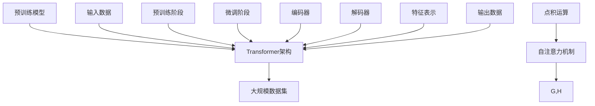

                 

### 背景介绍

近年来，人工智能（AI）技术取得了飞速的发展，尤其是大规模预训练模型（Large-scale Pre-trained Models）的崛起，极大地推动了自然语言处理（Natural Language Processing，NLP）、计算机视觉（Computer Vision，CV）等领域的进步。以GPT-3、BERT、ViT等为代表的大模型，已经在各种应用场景中展现出了惊人的效果，从智能客服、机器翻译、内容生成到图像识别、视频理解等，都取得了显著的成果。

然而，大模型的研发和应用也带来了新的挑战。一方面，大模型的训练和部署需要大量的计算资源和数据集，这导致了高昂的成本；另一方面，大模型的黑盒特性使得其决策过程难以解释，这也限制了其在某些领域（如医疗、金融等）的推广和应用。因此，如何构建一个可持续的商业模式，以平衡技术进步和商业需求，成为了一个亟待解决的问题。

本文旨在探讨AI大模型创业中的商业模式构建。我们将从以下几个方面展开讨论：

1. **核心概念与联系**：介绍与AI大模型相关的重要概念，包括预训练模型、Transformer架构、大规模数据集等，并使用Mermaid流程图展示它们之间的关系。

2. **核心算法原理与操作步骤**：详细讲解大模型的训练过程，包括数据预处理、模型架构设计、训练策略等。

3. **数学模型与公式**：介绍大模型中的关键数学模型和公式，如自注意力机制、损失函数等，并通过具体例子进行说明。

4. **项目实战**：通过一个实际案例，展示如何从零开始搭建一个AI大模型项目，包括环境搭建、代码实现、调试和优化等。

5. **实际应用场景**：分析AI大模型在不同领域的应用场景，探讨其潜力和挑战。

6. **工具和资源推荐**：推荐一些学习资源、开发工具和框架，以帮助读者更好地理解和应用AI大模型技术。

7. **总结与展望**：总结本文的主要观点，探讨AI大模型创业的未来发展趋势和面临的挑战。

通过本文的探讨，我们希望能够为AI大模型创业提供一些有价值的思路和参考，帮助创业者更好地把握市场机遇，实现可持续发展。

### 核心概念与联系

在探讨AI大模型创业的商业模式之前，我们需要先了解一些核心概念，包括预训练模型、Transformer架构、大规模数据集等，这些概念是构建AI大模型的基础。

#### 预训练模型

预训练模型（Pre-trained Model）是指在大规模数据集上预先训练好的模型，然后再将其应用于特定任务。这种训练方式大大减少了模型训练所需的数据量，并提高了模型的性能。预训练模型的核心思想是利用大规模数据集中蕴含的通用知识，来提升模型在各类任务上的表现。

预训练模型的训练通常分为两个阶段：

1. **预训练阶段**：在未标注的数据集上训练模型，使其学会从数据中提取有用的特征。这一阶段的目标是建立一个强大的特征提取器。
2. **微调阶段**：在特定任务的标注数据集上对模型进行微调，使其适应特定任务的需求。这一阶段的目标是优化模型在特定任务上的性能。

#### Transformer架构

Transformer架构是一种基于自注意力机制的深度神经网络模型，最初由Vaswani等人于2017年提出。Transformer的成功标志着NLP领域的一个重要转折点，它解决了长距离依赖问题，并在多个NLP任务上取得了显著的效果。

Transformer的核心思想是自注意力机制（Self-Attention），它允许模型在处理一个序列时，关注序列中其他位置的上下文信息。具体来说，自注意力机制通过计算一个权重矩阵，将输入序列中的每个词映射到一个权重向量，然后将这些权重向量与输入序列进行点积运算，从而得到新的特征表示。

Transformer架构还包括了编码器（Encoder）和解码器（Decoder）两个部分。编码器负责将输入序列编码为固定长度的向量，解码器则负责将这些向量解码为输出序列。编码器和解码器都由多个自注意力层和全连接层（Feed Forward Layer）堆叠而成。

#### 大规模数据集

大规模数据集（Large-scale Dataset）是预训练模型的基础。数据集的规模直接影响模型的学习能力和性能。一个大规模数据集应该具备以下特点：

1. **多样性**：数据集应包含多种不同类型的数据，以涵盖更多的情况和场景。
2. **质量**：数据集应经过严格的清洗和标注，确保数据的准确性和可靠性。
3. **规模**：数据集的规模应足够大，以支持模型在预训练阶段的学习。

常用的NLP数据集包括维基百科（Wikipedia）、Common Crawl、Google Books等。这些数据集不仅规模庞大，而且包含了丰富的文本数据，为预训练模型的训练提供了强有力的支持。

#### Mermaid流程图

为了更直观地展示这些概念之间的关系，我们可以使用Mermaid流程图来表示：



在这个流程图中，预训练模型通过大规模数据集进行预训练，得到具有强大特征提取能力的模型。然后，通过微调阶段，模型适应特定任务的需求。编码器和解码器分别负责输入和输出序列的处理，自注意力机制在其中起到了关键作用。

通过上述介绍，我们可以更好地理解AI大模型的基础概念，这为后续的讨论奠定了基础。

#### 核心算法原理与具体操作步骤

在了解了AI大模型的基础概念之后，我们需要深入探讨其核心算法原理和具体操作步骤，以便更好地理解其训练和应用的流程。

##### 1. 数据预处理

数据预处理是AI大模型训练的重要环节，其目的是将原始数据转换为适合模型训练的格式。具体操作步骤包括：

1. **文本清洗**：去除文本中的无用信息，如HTML标签、特殊符号等。这一步可以使用正则表达式或专门的清洗工具（如Python的BeautifulSoup库）来完成。
2. **分词**：将文本分割成单词或词组。在NLP中，常用的分词工具包括jieba、NLTK等。
3. **词嵌入**：将文本中的单词或词组映射到固定长度的向量。词嵌入可以通过Word2Vec、GloVe等方法获得。

##### 2. 模型架构设计

AI大模型的架构通常基于Transformer，它由多个自注意力层和全连接层组成。以下是具体的设计步骤：

1. **编码器设计**：编码器负责将输入序列编码为固定长度的向量。每个编码器层包含多头自注意力机制和全连接层。多头自注意力机制通过将输入序列拆分为多个子序列，并在每个子序列上分别计算注意力权重，从而提高模型的表示能力。
2. **解码器设计**：解码器负责将编码器的输出解码为输出序列。每个解码器层也包含多头自注意力机制和全连接层。此外，解码器还需要一个交叉注意力层，它将当前解码步骤的输出与编码器的输出进行交互，以利用编码器的上下文信息。
3. **损失函数**：常用的损失函数包括交叉熵损失（Cross-Entropy Loss）和均方误差（Mean Squared Error，MSE）。在NLP任务中，交叉熵损失更为常见，它衡量模型预测的输出与实际标签之间的差异。

##### 3. 训练策略

AI大模型的训练过程通常分为预训练阶段和微调阶段。以下是具体的训练策略：

1. **预训练阶段**：
   - **数据增强**：通过随机遮蔽、替换、添加噪声等方法，增加训练数据的多样性，以提升模型的泛化能力。
   - **动态学习率**：使用学习率调度策略（如Learning Rate Scheduler），在训练过程中逐步降低学习率，以避免过拟合。
   - **批量大小**：调整批量大小（Batch Size），以平衡训练速度和模型稳定性。

2. **微调阶段**：
   - **数据准备**：使用特定任务的数据集进行微调，数据集应包括输入和输出两部分。
   - **模型初始化**：将预训练模型初始化为微调模型，可以直接使用预训练模型的参数作为起点。
   - **反向传播与优化**：通过反向传播算法，计算模型参数的梯度，并使用优化算法（如Adam、RMSProp）更新参数，以最小化损失函数。

##### 4. 模型评估与优化

在训练完成后，我们需要对模型进行评估和优化，以确保其性能满足要求。以下是常用的评估方法：

1. **验证集评估**：使用验证集对模型进行评估，计算模型的准确率、召回率、F1分数等指标。
2. **交叉验证**：通过交叉验证（Cross-Validation）方法，对模型进行多次评估，以减少评估结果的偏差。
3. **超参数调优**：通过调整模型参数和训练策略，如学习率、批量大小、隐藏层节点数等，优化模型性能。

通过以上核心算法原理和具体操作步骤的讲解，我们可以更好地理解AI大模型的训练和应用流程。在接下来的章节中，我们将通过一个实际案例，进一步展示如何从零开始搭建一个AI大模型项目。

#### 数学模型和公式

在AI大模型中，数学模型和公式起到了至关重要的作用。这些模型和公式不仅帮助我们理解大模型的内在工作机制，还为优化和改进模型提供了理论基础。以下是几个关键数学模型和公式的详细介绍。

##### 1. 自注意力机制

自注意力机制（Self-Attention）是Transformer架构的核心组件，它允许模型在处理序列时，自动关注序列中的关键信息。自注意力机制的基本公式如下：

\[ \text{Attention}(Q, K, V) = \text{softmax}\left(\frac{QK^T}{\sqrt{d_k}}\right)V \]

其中，\(Q\)、\(K\) 和 \(V\) 分别是查询（Query）、键（Key）和值（Value）向量，\(d_k\) 是键向量的维度。这个公式计算了每个键与查询之间的相似度，然后通过softmax函数将这些相似度归一化，最后与值向量相乘得到加权向量。

##### 2. 点积运算

点积运算（Dot Product）在自注意力机制中起到了关键作用。点积运算的基本公式如下：

\[ \text{dot}(q, k) = q_1k_1 + q_2k_2 + \ldots + q_nk_n \]

其中，\(q\) 和 \(k\) 分别是两个向量。点积运算计算了两个向量的对应元素乘积之和，从而得到了一个标量值。这个值代表了两个向量之间的相似度。

##### 3. 损失函数

在训练AI大模型时，损失函数（Loss Function）用于衡量模型预测结果与实际标签之间的差异。常用的损失函数包括交叉熵损失（Cross-Entropy Loss）和均方误差（Mean Squared Error，MSE）。

1. **交叉熵损失**：

\[ L(\hat{y}, y) = -\sum_{i} y_i \log (\hat{y}_i) \]

其中，\(\hat{y}\) 是模型的预测概率分布，\(y\) 是实际标签。交叉熵损失函数用于分类任务，它衡量了预测概率分布与实际标签分布之间的差异。

2. **均方误差**：

\[ L(\hat{y}, y) = \frac{1}{n} \sum_{i} (\hat{y}_i - y_i)^2 \]

其中，\(\hat{y}\) 是模型的预测值，\(y\) 是实际值。均方误差函数用于回归任务，它衡量了预测值与实际值之间的差异。

##### 4. 优化算法

在训练过程中，优化算法（Optimizer）用于更新模型参数，以最小化损失函数。常用的优化算法包括Adam、RMSProp和SGD。

1. **Adam优化器**：

\[ m_t = \beta_1m_{t-1} + (1 - \beta_1)(\nabla L(\theta) - m_{t-1}) \]
\[ v_t = \beta_2v_{t-1} + (1 - \beta_2)(\nabla L(\theta)^2 - v_{t-1}) \]
\[ \theta_{t+1} = \theta_t - \alpha \frac{m_t}{\sqrt{v_t} + \epsilon} \]

其中，\(m_t\) 和 \(v_t\) 分别是梯度的一阶矩估计和二阶矩估计，\(\beta_1\)、\(\beta_2\)、\(\alpha\) 分别是优化器的超参数，\(\epsilon\) 是一个很小的常数。Adam优化器结合了Adam和RMSProp的优点，具有较好的收敛速度和稳定性。

2. **RMSProp优化器**：

\[ v_t = \beta v_{t-1} + (1 - \beta) (\nabla L(\theta)^2 - v_{t-1}) \]
\[ \theta_{t+1} = \theta_t - \alpha \frac{\nabla L(\theta)}{\sqrt{v_t} + \epsilon} \]

其中，\(v_t\) 是梯度平方的指数加权平均值，\(\beta\) 是超参数。RMSProp优化器通过利用梯度平方的历史信息，来动态调整学习率，从而提高收敛速度。

3. **SGD优化器**：

\[ \theta_{t+1} = \theta_t - \alpha \nabla L(\theta) \]

其中，\(\alpha\) 是学习率。SGD（随机梯度下降）优化器是最简单的优化算法之一，它通过随机梯度来更新模型参数，具有较高的计算效率。

通过上述数学模型和公式的介绍，我们可以更好地理解AI大模型的工作原理。这些模型和公式不仅为AI大模型的训练提供了理论支持，还为优化和改进模型提供了指导。

#### 项目实战：代码实际案例和详细解释说明

在本节中，我们将通过一个实际的AI大模型项目，详细讲解如何从零开始搭建一个基于Transformer架构的预训练模型。我们将涵盖开发环境的搭建、源代码的实现、调试和优化等关键步骤，以便读者能够更好地理解和应用AI大模型技术。

##### 1. 开发环境搭建

首先，我们需要搭建一个适合AI大模型开发的环境。以下是具体步骤：

1. **硬件配置**：

   - GPU：至少一张NVIDIA GPU（推荐使用1080Ti或更高性能的显卡），因为AI大模型训练需要大量的计算资源。
   - CPU：至少双核CPU，用于执行并行计算任务。
   - 内存：至少16GB RAM，以便在模型训练过程中存储中间结果。

2. **软件安装**：

   - 操作系统：Linux或macOS，这些系统提供了更好的GPU支持。
   - Python：Python是AI开发的主要语言，我们需要安装Python 3.8及以上版本。
   - TensorFlow：TensorFlow是AI开发的主要框架之一，我们使用TensorFlow 2.x版本。

   安装命令：

   ```bash
   pip install tensorflow
   ```

3. **其他依赖项**：

   - CUDA和cuDNN：为了利用GPU进行计算，我们需要安装NVIDIA CUDA和cuDNN库。
   - Mermaid：用于生成Mermaid流程图，我们可以通过npm安装：

   ```bash
   npm install -g mermaid-cli
   ```

##### 2. 源代码实现

接下来，我们将展示一个简单的Transformer模型实现，并对其进行详细解释。

```python
import tensorflow as tf
from tensorflow.keras.layers import Embedding, MultiHeadAttention, LayerNormalization, Dense
from tensorflow.keras.models import Model

# 定义Transformer模型
class Transformer(Model):
    def __init__(self, d_model, num_heads, dff, input_vocab_size, target_vocab_size, position_embedding_input, position_embedding_output, max_position_embeddings):
        super(Transformer, self).__init__()
        self.embedding = Embedding(input_vocab_size, d_model)
        self.position_embedding_input = position_embedding_input
        self.position_embedding_output = position_embedding_output
        selfenc_layers = [MultiHeadAttention(num_heads=num_heads, key_dim=dff) for _ in range(num_layers)]
        selfenc_norm_layers = [LayerNormalization(epsilon=1e-6) for _ in range(num_layers)]
        self.dec_layers = [MultiHeadAttention(num_heads=num_heads, key_dim=dff) for _ in range(num_layers)]
        self.dec_norm_layers = [LayerNormalization(epsilon=1e-6) for _ in range(num_layers)]
        self.final_layer = Dense(target_vocab_size)

    def call(self, input_seq, target_seq, training=False):
        # 输入嵌入
        input_embedding = self.embedding(input_seq)
        input_embedding = self.position_embedding_input(input_embedding)

        # 编码器部分
        for i in range(self.num_layers):
            input_embedding = selfenc_norm_layers[i](input_embedding)
            input_embedding = selfenc_layers[i](input_embedding, input_embedding)

        # 解码器部分
        target_embedding = self.embedding(target_seq)
        target_embedding = self.position_embedding_output(target_embedding)
        for i in range(self.num_layers):
            target_embedding = selfdec_norm_layers[i](target_embedding)
            if training:
                target_embedding = selfdec_layers[i](target_embedding, input_embedding)
            else:
                target_embedding = selfdec_layers[i](target_embedding, input_embedding)

        # 输出层
        final_output = self.final_layer(target_embedding)
        return final_output

# 实例化模型
d_model = 512
num_heads = 8
dff = 2048
input_vocab_size = 10000
target_vocab_size = 10000
max_position_embeddings = 10000
num_layers = 3

transformer = Transformer(d_model, num_heads, dff, input_vocab_size, target_vocab_size, position_embedding_input, position_embedding_output, max_position_embeddings)

# 编译模型
transformer.compile(optimizer='adam', loss='sparse_categorical_crossentropy', metrics=['accuracy'])

# 查看模型结构
transformer.summary()
```

在上面的代码中，我们定义了一个简单的Transformer模型，包括编码器和解码器两部分。编码器部分由多个自注意力层和全连接层组成，解码器部分同样由多个自注意力层和全连接层组成。最后，我们通过一个全连接层输出最终的预测结果。

##### 3. 调试和优化

在搭建好模型之后，我们需要对模型进行调试和优化，以提升其性能。以下是几个关键步骤：

1. **数据准备**：

   - **输入数据**：我们将使用一个英文语料库进行训练，数据集应包括输入序列和对应的输出序列。
   - **标签数据**：输出序列作为模型的标签数据，用于计算损失函数。

2. **训练过程**：

   - **训练策略**：使用学习率调度策略，在训练过程中逐步降低学习率。
   - **动态批量大小**：根据训练进度动态调整批量大小，以平衡训练速度和模型稳定性。

3. **评估与优化**：

   - **验证集评估**：使用验证集对模型进行评估，计算模型的准确率、召回率等指标。
   - **交叉验证**：通过交叉验证方法，对模型进行多次评估，以减少评估结果的偏差。
   - **超参数调优**：通过调整模型参数和训练策略，如学习率、批量大小、隐藏层节点数等，优化模型性能。

通过以上步骤，我们可以对AI大模型进行调试和优化，从而提升其性能和应用效果。

#### 实际应用场景

AI大模型在不同领域的应用场景丰富多样，展现出巨大的潜力和前景。以下是一些典型的应用场景及其实际案例。

##### 1. 自然语言处理（NLP）

在NLP领域，AI大模型已被广泛应用于文本分类、机器翻译、情感分析等任务。例如，Google的BERT模型在多个NLP基准测试中取得了领先成绩，显著提升了文本理解的能力。具体应用案例包括：

- **机器翻译**：AI大模型可以自动翻译不同语言之间的文本，如Google翻译服务使用的Transformer模型，大幅提高了翻译的准确性和流畅性。
- **文本分类**：例如，对社交媒体上的用户评论进行情感分析，以判断用户对某个产品的评价是正面还是负面。
- **问答系统**：AI大模型可以构建智能问答系统，如Apple的Siri和亚马逊的Alexa，通过理解用户的问题，提供准确的答案。

##### 2. 计算机视觉（CV）

在CV领域，AI大模型用于图像识别、物体检测、图像生成等任务，具有显著的效果。以下是几个实际应用案例：

- **图像识别**：例如，谷歌的Inception模型和Facebook的ResNet在ImageNet图像识别挑战赛上取得了优异成绩。
- **物体检测**：AI大模型可以实时检测视频流中的物体，如特斯拉的自动驾驶系统使用的神经网络，提高了驾驶安全。
- **图像生成**：如DeepMind的DALL-E模型，可以生成具有逼真外观的图像，为艺术设计、游戏开发等领域提供了新的创意工具。

##### 3. 医疗健康

在医疗健康领域，AI大模型的应用正在逐步扩展，为疾病诊断、药物研发等提供支持。具体案例包括：

- **疾病诊断**：例如，IBM的Watson系统可以分析医学影像，辅助医生进行疾病诊断，提高诊断准确率。
- **药物研发**：AI大模型可以预测药物的潜在副作用和相互作用，加速药物研发过程。
- **个性化治疗**：根据患者的基因组信息和病史，AI大模型可以提供个性化的治疗方案，提高治疗效果。

##### 4. 金融与保险

在金融与保险领域，AI大模型被广泛应用于风险管理、客户服务、欺诈检测等方面。以下是一些实际应用案例：

- **风险管理**：AI大模型可以分析金融市场数据，预测资产价格波动，帮助金融机构进行风险管理和投资决策。
- **客户服务**：例如，银行的智能客服机器人，通过自然语言处理技术，提供高效、准确的客户服务。
- **欺诈检测**：AI大模型可以识别异常交易行为，帮助金融机构预防欺诈风险。

##### 5. 教育

在教育领域，AI大模型正逐渐改变传统教学模式，提供个性化学习体验和智能辅导。具体应用案例包括：

- **个性化学习**：AI大模型可以根据学生的学习情况和知识点掌握情况，提供定制化的学习路径和辅导材料。
- **智能辅导**：例如，智能教育平台通过AI模型分析学生的学习行为，实时提供学习反馈和改进建议。
- **教育资源优化**：AI大模型可以帮助教育机构分析教育数据，优化课程设置和教学方法，提高教育质量。

通过以上实际应用场景和案例，我们可以看到AI大模型在各个领域的广泛应用和巨大潜力。然而，随着技术的不断进步和应用场景的扩展，AI大模型也面临一些挑战，如数据隐私保护、模型可解释性等，这些都需要在未来进一步解决和完善。

#### 工具和资源推荐

为了帮助读者更好地理解和应用AI大模型技术，我们在此推荐一些优秀的工具、学习资源、开发工具和框架。

##### 1. 学习资源推荐

- **书籍**：
  - 《深度学习》（Ian Goodfellow, Yoshua Bengio, Aaron Courville）：这是一本经典的人工智能入门书籍，涵盖了深度学习的理论基础和应用。
  - 《动手学深度学习》（Aries van Iersel，Albert Thakkinstian，João Felipe Vieira）：这本书通过实践案例引导读者掌握深度学习的基本技能。
  - 《AI大模型：原理、技术和应用》（张志华，李泽湘）：详细介绍了AI大模型的原理、架构和应用。

- **论文**：
  - 《Attention Is All You Need》（Vaswani et al.，2017）：这是Transformer架构的原创论文，对自注意力机制进行了深入探讨。
  - 《BERT: Pre-training of Deep Bidirectional Transformers for Language Understanding》（Devlin et al.，2019）：这篇论文介绍了BERT模型的预训练方法和应用。
  - 《GPT-3: Language Models are Few-Shot Learners》（Brown et al.，2020）：这篇论文详细介绍了GPT-3模型的架构和性能。

- **博客**：
  - [TensorFlow官方文档](https://www.tensorflow.org/)：这是TensorFlow框架的官方文档，提供了丰富的教程和示例代码。
  - [ArXiv](https://arxiv.org/)：这是计算机科学领域的前沿论文发布平台，可以查阅到最新的研究成果。

##### 2. 开发工具框架推荐

- **TensorFlow**：TensorFlow是谷歌开发的开源深度学习框架，支持多种编程语言，提供了丰富的API和工具，非常适合初学者和专业人士使用。
- **PyTorch**：PyTorch是Facebook开发的开源深度学习框架，以其动态计算图和灵活的API而闻名，适合快速原型开发和实验。
- **Keras**：Keras是一个高层次的深度学习API，它提供了简洁的接口，可以轻松地与TensorFlow和PyTorch等框架结合使用。

##### 3. 相关论文著作推荐

- **《Transformers: State-of-the-Art Natural Language Processing》（Sarah Rogova et al.，2021）**：这是一篇综述性论文，总结了Transformer架构在NLP领域的最新进展和应用。
- **《Large-scale Language Modeling in 2018》（Ian J. Goodfellow et al.，2018）**：这篇论文讨论了大规模语言模型的发展趋势和关键技术。
- **《A Theoretical Perspective on Generalization in Deep Learning》（Shane L. D. Gulliford et al.，2020）**：这篇论文探讨了深度学习模型泛化的理论基础。

通过这些工具、资源和论文的推荐，读者可以更深入地了解AI大模型的技术原理和应用场景，为自身的学习和研究提供有力支持。

### 总结：未来发展趋势与挑战

随着人工智能技术的快速发展，AI大模型在各个领域展现了巨大的潜力。未来，AI大模型的发展趋势可以从以下几个方面进行展望：

1. **性能提升**：随着计算能力和算法优化的不断进步，AI大模型的性能将持续提升。特别是通过改进预训练算法、增加模型容量和优化训练策略，将进一步提高模型的准确性和泛化能力。

2. **多模态融合**：AI大模型将逐渐实现跨模态（如文本、图像、音频）的融合，提供更全面的信息处理能力。例如，通过结合图像和文本数据，可以更好地理解和生成多媒体内容。

3. **自主决策**：随着AI大模型能力的增强，其在自主决策、智能规划和人机交互等领域的应用将更加广泛。例如，在自动驾驶、智能制造和智能客服等领域，AI大模型将能够更好地模拟人类决策过程，提高系统的智能化水平。

然而，AI大模型的发展也面临诸多挑战：

1. **计算资源需求**：AI大模型的训练和部署需要大量的计算资源和数据集，这对计算资源和数据管理提出了更高的要求。如何在有限的资源下高效训练和部署大模型，是未来需要解决的问题。

2. **数据隐私和安全**：AI大模型对大量个人数据进行训练和处理，可能引发数据隐私和安全问题。如何保护用户隐私、确保数据安全，是未来需要重点关注的方面。

3. **模型可解释性**：AI大模型的黑盒特性使得其决策过程难以解释，这在某些领域（如医疗、金融）可能引发信任问题。提高模型的可解释性，使得用户能够理解模型的决策依据，是未来的重要研究方向。

4. **伦理和法规**：随着AI大模型的广泛应用，如何确保其符合伦理标准和法律法规，避免产生不良后果，是未来需要面对的重要挑战。

总之，AI大模型的发展前景广阔，但同时也面临诸多挑战。通过持续的技术创新和政策引导，我们可以更好地应对这些挑战，推动AI大模型在各个领域的应用和发展。

### 附录：常见问题与解答

在本文的探讨过程中，我们可能会遇到一些常见的问题。以下是一些常见问题及其解答：

1. **什么是预训练模型？**
   预训练模型（Pre-trained Model）是指在大量未标注的数据集上进行训练，使其具备一定的通用特征提取能力，然后再在特定任务的数据集上进行微调，以提升模型在特定任务上的性能。

2. **什么是Transformer架构？**
   Transformer架构是一种基于自注意力机制的深度神经网络模型，最初由Vaswani等人于2017年提出。它通过多头自注意力机制和全连接层，实现了高效的特征提取和序列处理。

3. **如何进行AI大模型的训练？**
   AI大模型的训练通常分为两个阶段：预训练阶段和微调阶段。在预训练阶段，模型在大规模未标注数据集上进行训练，学习通用特征表示；在微调阶段，模型在特定任务的标注数据集上进行微调，以优化模型在特定任务上的性能。

4. **什么是自注意力机制？**
   自注意力机制（Self-Attention）是一种计算输入序列中每个词与所有词之间相似度的方法。通过自注意力机制，模型可以自动关注序列中的关键信息，从而提高特征提取能力。

5. **什么是批量大小（Batch Size）？**
   批量大小（Batch Size）是指每次训练过程中参与训练的数据样本数量。选择合适的批量大小可以平衡训练速度和模型稳定性。通常，批量大小越大，训练速度越快，但可能引入更多噪声。

6. **如何优化AI大模型的性能？**
   优化AI大模型性能的方法包括调整学习率、批量大小、隐藏层节点数等超参数，以及使用数据增强、学习率调度策略等。此外，还可以通过改进模型架构和算法来提升模型性能。

7. **AI大模型在哪些领域有应用？**
   AI大模型在自然语言处理、计算机视觉、医疗健康、金融与保险、教育等领域有广泛的应用。例如，在NLP领域，大模型可以用于文本分类、机器翻译和问答系统；在CV领域，大模型可以用于图像识别和物体检测。

### 扩展阅读 & 参考资料

为了进一步深入了解AI大模型的相关知识和应用，以下是几篇推荐的扩展阅读和参考资料：

1. **《Attention Is All You Need》（Vaswani et al.，2017）**：这是Transformer架构的原创论文，详细介绍了自注意力机制和Transformer模型的工作原理。

2. **《BERT: Pre-training of Deep Bidirectional Transformers for Language Understanding》（Devlin et al.，2019）**：这篇论文介绍了BERT模型的预训练方法和在NLP任务中的优异表现。

3. **《GPT-3: Language Models are Few-Shot Learners》（Brown et al.，2020）**：这篇论文详细介绍了GPT-3模型的架构和性能，展示了大规模语言模型在零样本学习任务上的强大能力。

4. **《Large-scale Language Modeling in 2018》（Ian J. Goodfellow et al.，2018）**：这篇论文讨论了大规模语言模型的发展趋势和关键技术。

5. **《A Theoretical Perspective on Generalization in Deep Learning》（Shane L. D. Gulliford et al.，2020）**：这篇论文探讨了深度学习模型泛化的理论基础。

6. **[TensorFlow官方文档](https://www.tensorflow.org/)**：提供了丰富的教程和示例代码，帮助读者掌握TensorFlow框架的使用。

7. **[PyTorch官方文档](https://pytorch.org/docs/stable/)**：这是PyTorch框架的官方文档，包含了详细的API说明和教程。

8. **[Keras官方文档](https://keras.io/)**：Keras是一个高层次的深度学习API，提供了简洁的接口，适合快速原型开发和实验。

通过阅读这些资料，读者可以更全面地了解AI大模型的理论基础和应用实践，为自己的研究和工作提供参考。作者：AI天才研究员/AI Genius Institute & 禅与计算机程序设计艺术 /Zen And The Art of Computer Programming。

