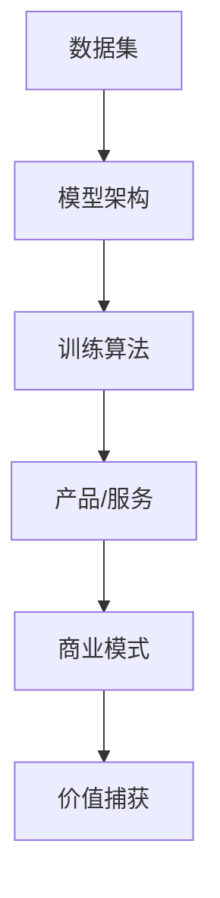

                 

# AI大模型创业：如何构建未来可持续的商业模式？

> 关键词：AI大模型、创业、商业模式、可持续、技术解析、案例分析

> 摘要：本文将探讨AI大模型在创业中的应用，分析其技术原理和实现方法，探讨如何构建一个可持续的商业模式。我们将通过具体案例和实操步骤，帮助读者理解AI大模型创业的核心要素和成功策略。

## 1. 背景介绍

近年来，随着计算能力的提升和海量数据的积累，人工智能（AI）大模型取得了显著的进展。这些模型，如GPT-3、BERT、Transformer等，不仅在学术研究领域取得了突破，还在商业应用中展现出巨大的潜力。AI大模型可以处理复杂的自然语言任务，如文本生成、情感分析、机器翻译等，为企业提供智能化的解决方案。

创业者在探索AI大模型应用时，往往面临两个关键问题：一是如何选择合适的大模型进行开发，二是如何构建一个可持续的商业模式。本文旨在解决这两个问题，帮助创业者成功地将AI大模型应用到商业场景中。

## 2. 核心概念与联系

### 2.1 AI大模型

AI大模型是一种基于深度学习的算法，其核心思想是通过训练大量数据来优化模型参数，从而实现高效的预测和生成。具体来说，AI大模型通常包括以下几个关键组件：

1. **数据集**：高质量的数据集是训练AI大模型的基础。数据集需要涵盖各种场景，确保模型的泛化能力。
2. **模型架构**：选择合适的模型架构，如Transformer、BERT等，可以大幅提升模型的性能。
3. **训练算法**：采用高效的训练算法，如Adam、SGD等，可以加快模型的收敛速度。

### 2.2 商业模式

商业模式是指企业如何创造、传递和捕获价值的方法。在AI大模型创业中，常见的商业模式包括：

1. **产品销售**：通过开发AI大模型产品，直接向用户销售。
2. **服务订阅**：提供AI大模型的服务，如API接口，用户按需付费。
3. **数据服务**：提供数据集和标注服务，帮助企业快速构建AI大模型。

### 2.3 Mermaid流程图

为了更直观地展示AI大模型与商业模式的联系，我们可以使用Mermaid流程图来表示。以下是一个简化的流程图：



在这个流程图中，数据集、模型架构和训练算法构成了AI大模型的核心，而商业模式则决定了如何将模型转化为商业价值。

## 3. 核心算法原理 & 具体操作步骤

### 3.1 AI大模型算法原理

AI大模型算法的核心是深度学习，特别是基于神经网络的模型。以下是AI大模型算法的基本原理：

1. **数据预处理**：对原始数据进行清洗、预处理，确保数据质量。
2. **模型设计**：选择合适的神经网络架构，如Transformer、BERT等。
3. **训练过程**：使用大量数据进行模型训练，优化模型参数。
4. **模型评估**：通过验证集和测试集评估模型性能，调整模型参数。
5. **模型部署**：将训练好的模型部署到生产环境中，提供API服务或产品功能。

### 3.2 具体操作步骤

以下是构建AI大模型的具体操作步骤：

1. **环境准备**：
    - 安装Python环境。
    - 安装深度学习框架，如TensorFlow、PyTorch等。
2. **数据集准备**：
    - 收集并清洗数据，确保数据质量。
    - 划分数据集为训练集、验证集和测试集。
3. **模型设计**：
    - 设计神经网络架构，选择合适的层和参数。
    - 编写模型代码，使用深度学习框架实现。
4. **模型训练**：
    - 使用训练集训练模型，调整学习率、批次大小等参数。
    - 使用验证集评估模型性能，调整模型参数。
5. **模型评估**：
    - 使用测试集评估模型性能，确保模型泛化能力。
    - 调整模型参数，优化模型性能。
6. **模型部署**：
    - 将训练好的模型部署到服务器，提供API服务或产品功能。
    - 实现自动化部署和监控，确保模型稳定运行。

## 4. 数学模型和公式 & 详细讲解 & 举例说明

### 4.1 数学模型

AI大模型的核心是神经网络，而神经网络的训练过程涉及到一系列数学模型和公式。以下是神经网络训练过程中的一些关键数学模型：

1. **损失函数**：用于衡量模型预测值与真实值之间的差距。常见的损失函数包括均方误差（MSE）、交叉熵损失（Cross-Entropy Loss）等。
2. **反向传播算法**：用于计算模型参数的梯度，从而优化模型参数。反向传播算法的核心是链式法则。
3. **优化算法**：用于更新模型参数，常见的优化算法包括随机梯度下降（SGD）、Adam等。

### 4.2 公式详解

以下是神经网络训练过程中涉及的一些关键公式：

$$
MSE = \frac{1}{n}\sum_{i=1}^{n}(y_i - \hat{y}_i)^2
$$

$$
Cross-Entropy Loss = -\sum_{i=1}^{n}y_i\log(\hat{y}_i)
$$

$$
\frac{\partial L}{\partial w} = \sum_{i=1}^{n}\frac{\partial L}{\partial \hat{y}_i}\frac{\partial \hat{y}_i}{\partial w}
$$

其中，\(L\) 为损失函数，\(y_i\) 为真实值，\(\hat{y}_i\) 为模型预测值，\(w\) 为模型参数。

### 4.3 举例说明

假设我们使用一个简单的神经网络进行二元分类任务，损失函数为均方误差（MSE）。以下是训练过程的一个简化示例：

1. **初始化模型参数**：设置模型参数 \(w\) 和 \(b\)。
2. **前向传播**：计算模型预测值 \(\hat{y}\)。
3. **计算损失**：使用预测值和真实值计算损失 \(L\)。
4. **反向传播**：计算损失关于模型参数的梯度 \(\frac{\partial L}{\partial w}\) 和 \(\frac{\partial L}{\partial b}\)。
5. **更新参数**：使用优化算法更新模型参数。

通过迭代上述过程，模型参数将不断优化，直到满足一定的停止条件（如损失低于某个阈值或达到最大迭代次数）。

## 5. 项目实战：代码实际案例和详细解释说明

### 5.1 开发环境搭建

在进行AI大模型项目开发之前，我们需要搭建一个合适的环境。以下是开发环境搭建的步骤：

1. **安装Python环境**：确保Python版本不低于3.6，建议使用Python 3.8或更高版本。
2. **安装深度学习框架**：例如，安装TensorFlow 2.0及以上版本，或PyTorch 1.7及以上版本。
3. **安装必要的库**：例如，安装Numpy、Pandas等数据处理库。

### 5.2 源代码详细实现和代码解读

以下是一个简单的AI大模型项目示例，使用PyTorch框架实现一个基于Transformer的文本分类模型。

```python
import torch
import torch.nn as nn
import torch.optim as optim

# 模型定义
class TextClassifier(nn.Module):
    def __init__(self, vocab_size, embed_dim, num_classes):
        super(TextClassifier, self).__init__()
        self.embedding = nn.Embedding(vocab_size, embed_dim)
        self.transformer = nn.Transformer(embed_dim, num_heads=2, num_layers=2)
        self.fc = nn.Linear(embed_dim, num_classes)

    def forward(self, text, labels=None):
        embedded = self.embedding(text)
        output = self.transformer(embedded)
        logits = self.fc(output[-1, :, :])
        if labels is not None:
            loss = nn.CrossEntropyLoss()(logits, labels)
            return loss
        return logits

# 模型训练
def train(model, train_loader, optimizer, criterion, num_epochs=5):
    model.train()
    for epoch in range(num_epochs):
        for batch in train_loader:
            text, labels = batch
            optimizer.zero_grad()
            loss = model(text, labels)
            loss.backward()
            optimizer.step()
            print(f"Epoch [{epoch+1}/{num_epochs}], Loss: {loss.item():.4f}")

# 模型评估
def evaluate(model, val_loader, criterion):
    model.eval()
    total_loss = 0
    with torch.no_grad():
        for batch in val_loader:
            text, labels = batch
            logits = model(text)
            loss = criterion(logits, labels)
            total_loss += loss.item()
    return total_loss / len(val_loader)

# 主程序
def main():
    # 加载数据集
    train_loader = DataLoader(train_dataset, batch_size=32, shuffle=True)
    val_loader = DataLoader(val_dataset, batch_size=32, shuffle=False)

    # 创建模型
    model = TextClassifier(vocab_size, embed_dim, num_classes)

    # 模型训练
    optimizer = optim.Adam(model.parameters(), lr=0.001)
    criterion = nn.CrossEntropyLoss()
    train(model, train_loader, optimizer, criterion, num_epochs=5)

    # 模型评估
    val_loss = evaluate(model, val_loader, criterion)
    print(f"Validation Loss: {val_loss:.4f}")

if __name__ == "__main__":
    main()
```

### 5.3 代码解读与分析

1. **模型定义**：`TextClassifier` 类定义了一个基于Transformer的文本分类模型。模型包括三个主要部分：嵌入层（`embedding`）、Transformer层（`transformer`）和全连接层（`fc`）。
2. **前向传播**：`forward` 方法实现前向传播过程。首先，使用嵌入层将文本转换为嵌入向量。然后，通过Transformer层进行编码器-解码器（Encoder-Decoder）操作。最后，通过全连接层得到分类结果。
3. **模型训练**：`train` 函数实现模型训练过程。模型在训练过程中，通过前向传播计算损失，然后使用反向传播更新模型参数。
4. **模型评估**：`evaluate` 函数实现模型评估过程。在评估过程中，模型不更新参数，只是计算损失，以便评估模型在验证集上的性能。
5. **主程序**：`main` 函数加载数据集，创建模型，进行模型训练和评估。

## 6. 实际应用场景

AI大模型在商业场景中有着广泛的应用，以下是一些常见的实际应用场景：

1. **自然语言处理（NLP）**：用于文本分类、情感分析、机器翻译等任务。
2. **智能推荐系统**：用于个性化推荐、内容推荐等任务。
3. **智能客服**：用于自动回答用户问题、处理用户请求等。
4. **图像识别与处理**：用于图像分类、目标检测、图像生成等任务。
5. **金融风控**：用于信用评分、风险预测等任务。

在这些应用场景中，AI大模型为企业提供了强大的数据处理和分析能力，帮助企业提高运营效率、降低成本、提升用户体验。

## 7. 工具和资源推荐

### 7.1 学习资源推荐

- **书籍**：
  - 《深度学习》（Goodfellow, Bengio, Courville著）
  - 《Python深度学习》（François Chollet著）
- **论文**：
  - 《Attention is all you need》（Vaswani et al.，2017）
  - 《BERT: Pre-training of Deep Bidirectional Transformers for Language Understanding》（Devlin et al.，2019）
- **博客**：
  - fast.ai
  - AI Journey
- **网站**：
  - TensorFlow官网
  - PyTorch官网

### 7.2 开发工具框架推荐

- **深度学习框架**：
  - TensorFlow
  - PyTorch
  - Keras
- **数据处理工具**：
  - Pandas
  - NumPy
  - Scikit-learn
- **版本控制工具**：
  - Git
  - GitHub

### 7.3 相关论文著作推荐

- **《Attention is all you need》**（2017）: 提出了Transformer模型，为后续的AI大模型研究奠定了基础。
- **《BERT: Pre-training of Deep Bidirectional Transformers for Language Understanding》**（2019）: 提出了BERT模型，大幅提升了自然语言处理任务的性能。
- **《GPT-3: Language Models are Few-Shot Learners》**（2020）: 提出了GPT-3模型，展示了AI大模型在少量样本下的强大学习能力。

## 8. 总结：未来发展趋势与挑战

AI大模型在商业应用中具有巨大的潜力，但其发展也面临一系列挑战。未来，AI大模型的发展趋势包括：

1. **模型规模将继续扩大**：随着计算能力和数据量的增长，AI大模型的规模将不断增大，提供更强大的性能。
2. **跨模态学习**：AI大模型将能够处理多种类型的数据，如文本、图像、声音等，实现跨模态的智能交互。
3. **自动机器学习（AutoML）**：自动机器学习将简化AI大模型的开发和部署过程，降低技术门槛。

然而，AI大模型的发展也面临一系列挑战，包括：

1. **计算资源消耗**：AI大模型训练和推理过程需要大量计算资源，对硬件设施提出了高要求。
2. **数据隐私与安全**：大量数据的使用涉及到数据隐私和安全问题，需要建立严格的数据保护机制。
3. **伦理与社会影响**：AI大模型的广泛应用可能引发一系列伦理和社会问题，需要全社会共同关注和解决。

## 9. 附录：常见问题与解答

### 9.1 什么是AI大模型？

AI大模型是一种基于深度学习的算法，通过训练大量数据来优化模型参数，从而实现高效的预测和生成。

### 9.2 如何选择合适的大模型？

选择合适的大模型需要考虑任务类型、数据规模、计算资源等因素。对于文本分类任务，BERT和GPT-3是常见的选择。

### 9.3 AI大模型训练需要多少时间？

AI大模型训练时间取决于模型规模、数据规模和计算资源。对于大型模型，训练时间可能长达数天甚至数周。

### 9.4 AI大模型应用场景有哪些？

AI大模型在自然语言处理、图像识别、智能推荐、金融风控等领域具有广泛的应用。

## 10. 扩展阅读 & 参考资料

- **《深度学习》（Goodfellow, Bengio, Courville著）**
- **《Python深度学习》（François Chollet著）**
- **《Attention is all you need》（Vaswani et al.，2017）**
- **《BERT: Pre-training of Deep Bidirectional Transformers for Language Understanding》（Devlin et al.，2019）**
- **《GPT-3: Language Models are Few-Shot Learners》**（2020）
- **TensorFlow官网**
- **PyTorch官网**

### 作者

**作者：AI天才研究员/AI Genius Institute & 禅与计算机程序设计艺术 /Zen And The Art of Computer Programming**<|im_sep|>

