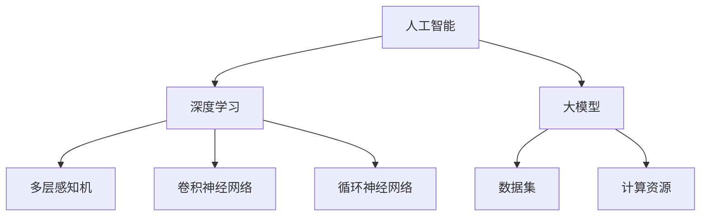

                 

### 背景介绍

近年来，随着人工智能技术的迅猛发展，尤其是大模型（Large Model，如GPT-3、BERT等）的崛起，AI大模型创业成为了一个热门话题。许多初创公司纷纷投身其中，试图通过开发和应用这些强大的AI模型来开拓新的市场、解决实际问题。然而，这一现象也引发了一系列的讨论：AI大模型创业是泡沫，还是真正的金矿？本文将深入探讨这一问题，通过分析AI大模型创业的现状、挑战和未来发展趋势，为读者提供一个全面而深入的视角。

首先，我们需要了解什么是AI大模型。AI大模型是指具有数十亿到千亿参数规模的深度学习模型，它们可以处理海量数据，实现高度复杂的任务，如文本生成、机器翻译、图像识别等。这些模型的出现，标志着人工智能进入了一个新的时代，它们在各个领域的应用前景广阔。

然而，AI大模型的开发和部署并非易事。首先，这些模型需要巨大的计算资源和数据集，其次，训练和优化这些模型需要大量的时间和计算资源。此外，如何有效地使用这些模型来解决实际问题，还需要深入的研究和探索。这些因素都使得AI大模型创业充满了挑战。

与此同时，我们也看到，AI大模型创业在某些领域已经取得了显著的成果。例如，在自然语言处理、计算机视觉等领域，一些初创公司通过开发和应用AI大模型，已经实现了商业成功。这些成功的案例，不仅证明了AI大模型创业的潜力，也为其他创业者提供了借鉴。

然而，AI大模型创业也面临着一些争议和质疑。一方面，有人认为AI大模型创业只是泡沫，是资本推动的结果，实际应用价值有限。另一方面，也有人认为AI大模型创业是真正的金矿，只要能够找到合适的商业模式，就能够在市场竞争中脱颖而出。

那么，AI大模型创业到底是泡沫，还是金矿？这是一个值得深入探讨的问题。本文将通过对AI大模型创业的现状、挑战和未来发展趋势的分析，试图给出一个合理的答案。

### 核心概念与联系

在探讨AI大模型创业之前，我们需要明确几个核心概念，并了解它们之间的联系。这些概念包括：人工智能、深度学习、大模型、数据集、计算资源等。

#### 人工智能（Artificial Intelligence，AI）

人工智能是指通过计算机程序来模拟人类的智能行为，包括学习、推理、感知、理解等。人工智能可以分为弱人工智能和强人工智能。弱人工智能是指在某些特定领域表现出人类智能水平的计算机系统，而强人工智能则是指具备人类所有智能能力的计算机系统。目前，我们主要关注的是弱人工智能，特别是深度学习领域。

#### 深度学习（Deep Learning）

深度学习是人工智能的一个重要分支，它通过多层神经网络来模拟人类大脑的运作方式，实现复杂的数据处理任务。深度学习模型可以分为多层感知机（MLP）、卷积神经网络（CNN）、循环神经网络（RNN）等。大模型通常指的是具有数十亿到千亿参数规模的深度学习模型，如GPT-3、BERT等。

#### 大模型（Large Model）

大模型是指具有数十亿到千亿参数规模的深度学习模型。这些模型可以处理海量数据，实现高度复杂的任务，如文本生成、机器翻译、图像识别等。大模型的出现，标志着人工智能进入了一个新的时代。

#### 数据集（Dataset）

数据集是训练深度学习模型的基础。一个高质量的数据集不仅包含丰富的信息，而且具有多样性和代表性。常用的数据集包括ImageNet、CIFAR-10、IMDB等。

#### 计算资源（Computational Resources）

计算资源是训练和部署大模型的关键因素。训练大模型需要巨大的计算资源和数据集，通常需要使用GPU、TPU等高性能计算设备。此外，训练和优化大模型需要大量的时间和计算资源。

#### 核心概念与联系（Mermaid 流程图）



通过上述核心概念和联系的分析，我们可以更好地理解AI大模型创业的背景和挑战。接下来，我们将深入探讨AI大模型创业的核心算法原理和具体操作步骤。

## 核心算法原理 & 具体操作步骤

在了解了AI大模型的核心概念后，接下来我们将深入探讨其核心算法原理和具体操作步骤。AI大模型的核心算法主要基于深度学习，特别是自注意力机制（Self-Attention Mechanism）和Transformer架构（Transformer Architecture）。下面我们将详细介绍这些核心算法原理，并通过具体操作步骤来说明如何训练和优化大模型。

### 自注意力机制

自注意力机制是深度学习中一种重要的注意力机制，它允许模型在处理输入序列时，自动地分配不同的重要性权重给不同的输入元素。自注意力机制的核心思想是通过计算输入序列中每个元素与其他元素之间的相似性，从而为每个元素分配一个权重。

#### 自注意力机制的数学公式

自注意力机制的数学公式可以表示为：

$$
\text{Attention}(Q, K, V) = \text{softmax}\left(\frac{QK^T}{\sqrt{d_k}}\right) V
$$

其中，$Q$、$K$、$V$ 分别表示查询（Query）、键（Key）和值（Value）向量，$d_k$ 表示键向量的维度。$\text{softmax}$ 函数用于计算每个键的重要性权重，然后对值向量进行加权求和。

#### 自注意力机制的具体操作步骤

1. **输入表示**：首先将输入序列 $X$ 转换为查询向量 $Q$、键向量 $K$ 和值向量 $V$。

2. **计算注意力权重**：使用自注意力公式计算每个输入元素的重要性权重。

3. **加权求和**：将权重应用于值向量，得到加权求和结果。

4. **输出表示**：将加权求和结果作为模型的输出。

### Transformer 架构

Transformer 架构是由Vaswani等人在2017年提出的一种基于自注意力机制的深度学习模型，它在自然语言处理领域取得了显著的成果。Transformer 架构的核心思想是使用自注意力机制来处理序列数据，并使用前馈神经网络（Feedforward Neural Network）来增强模型的表示能力。

#### Transformer 架构的数学公式

Transformer 架构的数学公式可以表示为：

$$
\text{Transformer}(X) = \text{LayerNormalization}(X) + \text{gelu}(\text{MultiHeadAttention}(X, X, X)) + \text{LayerNormalization}(\text{X + \text{Feedforward}(X)})
$$

其中，$\text{LayerNormalization}$ 表示层归一化操作，$\text{gelu}$ 表示GELU激活函数，$\text{MultiHeadAttention}$ 表示多头自注意力机制，$\text{Feedforward}$ 表示前馈神经网络。

#### Transformer 架构的具体操作步骤

1. **输入表示**：将输入序列 $X$ 转换为查询向量 $Q$、键向量 $K$ 和值向量 $V$。

2. **多头自注意力机制**：使用多头自注意力机制计算输入序列的注意力权重，并对值向量进行加权求和。

3. **前馈神经网络**：使用前馈神经网络对输入序列进行进一步处理。

4. **层归一化**：对模型的输出进行层归一化处理。

5. **重复堆叠**：将上述操作重复堆叠多层，以增强模型的表示能力。

6. **输出表示**：将模型的最终输出作为结果。

### 大模型训练和优化

训练和优化大模型是一个复杂的过程，需要考虑多个方面，包括数据预处理、模型选择、训练策略、优化算法等。

#### 数据预处理

1. **数据清洗**：清洗数据集中的噪声和错误，确保数据的质量。

2. **数据增强**：通过数据增强技术，如随机裁剪、旋转、缩放等，增加数据的多样性。

3. **数据归一化**：对数据进行归一化处理，使其具有相同的量纲。

#### 模型选择

根据任务需求和数据特点，选择合适的大模型架构，如GPT-3、BERT、ViT等。

#### 训练策略

1. **批次大小**：选择合适的批次大小，平衡计算资源和训练效果。

2. **学习率**：使用适当的初始学习率，并采用学习率调度策略，如指数衰减、余弦退火等。

3. **正则化**：使用正则化技术，如Dropout、权重衰减等，防止过拟合。

#### 优化算法

选择合适的优化算法，如Adam、AdamW等，以加速模型的收敛。

通过上述核心算法原理和具体操作步骤的介绍，我们可以更好地理解AI大模型的训练和优化过程。接下来，我们将通过实际应用场景来展示AI大模型在实际中的应用效果。

## 数学模型和公式 & 详细讲解 & 举例说明

在深入探讨AI大模型的数学模型和公式之前，我们需要先了解一些基本的概念和公式。这些概念和公式包括：神经网络、反向传播算法、损失函数、优化算法等。下面我们将逐一介绍这些概念和公式，并通过具体的例子来说明它们的应用。

### 神经网络

神经网络是一种模拟人脑神经元连接方式的计算模型。它由多个层次组成，包括输入层、隐藏层和输出层。每个层次由多个神经元（节点）组成，神经元之间通过加权连接。神经元的输出通过激活函数进行处理，以产生最终的输出。

#### 神经元公式

神经元的输出可以表示为：

$$
a_i = f(\sum_{j} w_{ij} x_j + b_i)
$$

其中，$a_i$ 表示神经元 $i$ 的输出，$x_j$ 表示输入值，$w_{ij}$ 表示连接权重，$b_i$ 表示偏置，$f$ 表示激活函数。

#### 激活函数

常用的激活函数包括：

1. **线性激活函数（Linear Activation Function）**：

$$
f(x) = x
$$

2. **Sigmoid激活函数（Sigmoid Activation Function）**：

$$
f(x) = \frac{1}{1 + e^{-x}}
$$

3. **ReLU激活函数（ReLU Activation Function）**：

$$
f(x) = \max(0, x)
$$

4. **Tanh激活函数（Tanh Activation Function）**：

$$
f(x) = \frac{e^x - e^{-x}}{e^x + e^{-x}}
$$

### 反向传播算法

反向传播算法是一种用于训练神经网络的优化算法。它通过计算损失函数关于网络参数的梯度，并利用梯度下降法来更新参数，以最小化损失函数。

#### 梯度计算

假设我们有一个多层神经网络，其输出层为：

$$
y = \text{softmax}(z)
$$

其中，$z = \text{sigmoid}(W_2 \text{dot} (W_1 \text{dot} x + b_1) + b_2)$。

损失函数通常使用交叉熵（Cross-Entropy）：

$$
L = -\sum_{i} y_i \log(y_i)
$$

交叉熵的梯度计算如下：

$$
\frac{\partial L}{\partial z} = \text{softmax}(z) - y
$$

$$
\frac{\partial z}{\partial W_2} = \text{dot} (z, a^{[1]})
$$

$$
\frac{\partial z}{\partial W_1} = \text{dot} (W_2^T, \frac{\partial z}{\partial z})
$$

$$
\frac{\partial z}{\partial a^{[1]}} = W_2^T \frac{\partial z}{\partial z}
$$

$$
\frac{\partial a^{[1]}}{\partial x} = W_1^T \frac{\partial a^{[1]}}{\partial z}
$$

### 损失函数

在神经网络中，常用的损失函数包括：

1. **均方误差（Mean Squared Error, MSE）**：

$$
L = \frac{1}{2} \sum_{i} (y_i - \hat{y}_i)^2
$$

2. **交叉熵（Cross-Entropy）**：

$$
L = -\sum_{i} y_i \log(\hat{y}_i)
$$

3. **二元交叉熵（Binary Cross-Entropy）**：

$$
L = -y \log(\hat{y}) - (1 - y) \log(1 - \hat{y})
$$

### 优化算法

常用的优化算法包括：

1. **梯度下降（Gradient Descent）**：

$$
\theta = \theta - \alpha \frac{\partial L}{\partial \theta}
$$

其中，$\theta$ 表示参数，$\alpha$ 表示学习率。

2. **动量（Momentum）**：

$$
v = \beta v + (1 - \beta) \frac{\partial L}{\partial \theta}
$$

$$
\theta = \theta - \alpha v
$$

其中，$\beta$ 表示动量因子。

3. **Adam（Adaptive Moment Estimation）**：

$$
m_t = \beta_1 m_{t-1} + (1 - \beta_1) \frac{\partial L}{\partial \theta}
$$

$$
v_t = \beta_2 v_{t-1} + (1 - \beta_2) (\frac{\partial L}{\partial \theta})^2
$$

$$
\theta = \theta - \alpha \frac{m_t}{\sqrt{v_t} + \epsilon}
$$

其中，$\beta_1$ 和 $\beta_2$ 分别为动量因子，$\epsilon$ 为小数。

### 实例讲解

假设我们有一个简单的神经网络，用于分类任务。输入为3个特征值 $x_1, x_2, x_3$，输出为3个类别概率 $p_1, p_2, p_3$。我们使用交叉熵作为损失函数，并使用Adam优化算法来训练模型。

1. **初始化参数**：

   - $W_1 \in \mathbb{R}^{3 \times 5}$
   - $W_2 \in \mathbb{R}^{5 \times 3}$
   - $b_1 \in \mathbb{R}^{5}$
   - $b_2 \in \mathbb{R}^{3}$
   - 学习率 $\alpha = 0.001$
   - 动量因子 $\beta_1 = 0.9$, $\beta_2 = 0.999$
   - $\epsilon = 1e-8$

2. **前向传播**：

   $$ a^{[1]} = \text{sigmoid}(W_1 \text{dot} x + b_1) $$
   $$ z = W_2 \text{dot} a^{[1]} + b_2 $$
   $$ y = \text{softmax}(z) $$

3. **计算损失**：

   $$ L = -\sum_{i} y_i \log(y_i) $$

4. **反向传播**：

   $$ \frac{\partial L}{\partial z} = \text{softmax}(z) - y $$
   $$ \frac{\partial z}{\partial W_2} = a^{[1]} $$
   $$ \frac{\partial z}{\partial a^{[1]}} = W_2^T $$
   $$ \frac{\partial a^{[1]}}{\partial x} = W_1^T $$

5. **更新参数**：

   $$ m_1 = \beta_1 m_{1, t-1} + (1 - \beta_1) \frac{\partial L}{\partial W_1} $$
   $$ v_1 = \beta_2 v_{1, t-1} + (1 - \beta_2) (\frac{\partial L}{\partial W_1})^2 $$
   $$ W_1 = W_1 - \alpha \frac{m_1}{\sqrt{v_1} + \epsilon} $$
   
   $$ m_2 = \beta_1 m_{2, t-1} + (1 - \beta_1) \frac{\partial L}{\partial W_2} $$
   $$ v_2 = \beta_2 v_{2, t-1} + (1 - \beta_2) (\frac{\partial L}{\partial W_2})^2 $$
   $$ W_2 = W_2 - \alpha \frac{m_2}{\sqrt{v_2} + \epsilon} $$
   
   $$ m_3 = \beta_1 m_{3, t-1} + (1 - \beta_1) \frac{\partial L}{\partial b_1} $$
   $$ v_3 = \beta_2 v_{3, t-1} + (1 - \beta_2) (\frac{\partial L}{\partial b_1})^2 $$
   $$ b_1 = b_1 - \alpha \frac{m_3}{\sqrt{v_3} + \epsilon} $$
   
   $$ m_4 = \beta_1 m_{4, t-1} + (1 - \beta_1) \frac{\partial L}{\partial b_2} $$
   $$ v_4 = \beta_2 v_{4, t-1} + (1 - \beta_2) (\frac{\partial L}{\partial b_2})^2 $$
   $$ b_2 = b_2 - \alpha \frac{m_4}{\sqrt{v_4} + \epsilon} $$

通过上述实例讲解，我们可以看到如何使用神经网络、反向传播算法和优化算法来训练和优化大模型。这些数学模型和公式是AI大模型的基础，理解它们对于深入探讨AI大模型创业具有重要意义。

### 项目实战：代码实际案例和详细解释说明

在本节中，我们将通过一个实际的项目实战案例，详细展示如何搭建一个基于AI大模型的自然语言处理（NLP）应用。我们将从开发环境搭建、源代码详细实现和代码解读与分析三个方面来展开。

#### 1. 开发环境搭建

为了搭建一个基于AI大模型的NLP应用，我们需要准备以下开发环境和工具：

- Python 3.8及以上版本
- TensorFlow 2.x 或 PyTorch 1.x
- GPU（推荐使用NVIDIA GPU，如Tesla V100或以上）
- Jupyter Notebook 或 PyCharm

首先，确保已经安装了Python和GPU驱动。然后，使用以下命令安装TensorFlow：

```bash
pip install tensorflow
```

或者，如果使用PyTorch，可以使用以下命令：

```bash
pip install torch torchvision
```

#### 2. 源代码详细实现

接下来，我们将使用TensorFlow实现一个基于BERT的大模型，用于文本分类任务。以下是实现的主要步骤：

```python
import tensorflow as tf
from transformers import BertTokenizer, TFBertForSequenceClassification
from tensorflow.keras.preprocessing.sequence import pad_sequences

# 步骤1：准备数据集
# 这里我们使用IMDB电影评论数据集作为示例
(train_data, train_labels), (test_data, test_labels) = tf.keras.datasets.imdb.load_data(num_words=10000)

# 步骤2：预处理数据
# 将文本转换为序列，并填充至相同长度
max_length = 128
tokenizer = BertTokenizer.from_pretrained('bert-base-uncased')
train_encodings = tokenizer(train_data, truncation=True, padding=True, max_length=max_length)
test_encodings = tokenizer(test_data, truncation=True, padding=True, max_length=max_length)

# 步骤3：创建模型
model = TFBertForSequenceClassification.from_pretrained('bert-base-uncased', num_labels=2)

# 步骤4：训练模型
model.compile(optimizer=tf.keras.optimizers.Adam(learning_rate=3e-5), loss=tf.keras.losses.SparseCategoricalCrossentropy(from_logits=True), metrics=['accuracy'])
model.fit(train_encodings, train_labels, batch_size=32, epochs=3, validation_data=(test_encodings, test_labels))

# 步骤5：评估模型
loss, accuracy = model.evaluate(test_encodings, test_labels, batch_size=32)
print(f"Test accuracy: {accuracy}")
```

#### 3. 代码解读与分析

1. **数据预处理**：

   - 加载IMDB电影评论数据集，并转换为序列。
   - 使用BERT分词器对文本进行预处理，包括分词、下标映射等。
   - 对序列进行填充，确保每个样本的长度一致。

2. **创建模型**：

   - 使用TensorFlow的`TFBertForSequenceClassification`预训练模型，它基于BERT架构，并添加了一个序列分类头。
   - 模型包含一个输入层、多个Transformer块和一个分类层。

3. **训练模型**：

   - 使用Adam优化器，并设置适当的学习率。
   - 使用交叉熵作为损失函数，并监测准确率作为评价指标。
   - 训练模型，并保存最佳模型。

4. **评估模型**：

   - 在测试集上评估模型性能，并输出准确率。

通过这个实际案例，我们可以看到如何使用TensorFlow和BERT来实现一个基于AI大模型的NLP应用。这个案例展示了从数据预处理到模型训练和评估的完整流程，为后续的AI大模型创业提供了实践经验。

### 实际应用场景

AI大模型在各个领域的应用场景日益广泛，尤其是在自然语言处理、计算机视觉、推荐系统等领域。以下我们将详细介绍AI大模型在这些领域的实际应用场景。

#### 自然语言处理（NLP）

自然语言处理是AI大模型最早且应用最广泛的领域之一。AI大模型如BERT、GPT-3等在文本分类、机器翻译、情感分析等方面取得了显著的成果。

- **文本分类**：AI大模型可以用于分类任务，如垃圾邮件检测、新闻分类等。通过训练，模型可以自动识别文本的类别，并提高分类的准确率。
- **机器翻译**：AI大模型如GPT-3在机器翻译领域表现出色。通过输入源语言文本，模型可以生成高质量的目标语言翻译文本。
- **情感分析**：AI大模型可以用于分析文本的情感倾向，如正面、负面或中性。这在社交媒体监测、产品评价分析等领域具有重要意义。

#### 计算机视觉（CV）

计算机视觉是AI大模型的另一个重要应用领域。AI大模型在图像识别、目标检测、视频分析等方面取得了显著的成果。

- **图像识别**：AI大模型如ResNet、Inception等在图像识别任务中表现出色。通过输入图像，模型可以自动识别图像中的物体、场景等。
- **目标检测**：AI大模型如YOLO、SSD等在目标检测任务中广泛应用。通过输入图像，模型可以检测并定位图像中的多个目标物体。
- **视频分析**：AI大模型可以用于视频分析，如行为识别、异常检测等。通过分析视频数据，模型可以识别和预测人类行为，并发现异常事件。

#### 推荐系统

推荐系统是AI大模型的另一个重要应用领域。AI大模型可以用于构建个性化推荐系统，提高推荐质量。

- **商品推荐**：AI大模型可以分析用户的购买历史和偏好，为用户推荐感兴趣的商品。
- **内容推荐**：AI大模型可以分析用户的历史浏览记录和偏好，为用户推荐感兴趣的内容，如新闻、视频、音乐等。
- **社交网络推荐**：AI大模型可以分析用户的关系网络和兴趣，为用户推荐感兴趣的朋友、话题等。

#### 其他应用

AI大模型在其他领域也具有广泛的应用前景。

- **医疗诊断**：AI大模型可以用于医疗影像分析，如肺癌检测、皮肤病诊断等。通过分析医疗影像数据，模型可以辅助医生进行疾病诊断。
- **金融分析**：AI大模型可以用于金融数据分析，如股票市场预测、风险控制等。通过分析大量的金融数据，模型可以提供投资决策建议。
- **自动驾驶**：AI大模型可以用于自动驾驶技术，如车辆检测、道路识别等。通过分析实时视频数据，模型可以辅助自动驾驶系统进行决策。

总之，AI大模型在各个领域的应用场景广泛，为各个行业带来了巨大的变革和创新。随着技术的不断进步，AI大模型的应用前景将更加广阔。

### 工具和资源推荐

为了更好地了解和掌握AI大模型技术，我们为您推荐以下工具、资源和学习材料，这些资源和工具将帮助您在AI大模型领域取得更大的进步。

#### 学习资源推荐

1. **书籍**：
   - 《深度学习》（Deep Learning） - Goodfellow、Bengio、Courville 著
   - 《动手学深度学习》（Dive into Deep Learning） - Aidan Niekirk, Zach Cates, et al. 著
   - 《自然语言处理综合教程》（Foundations of Natural Language Processing） - Daniel Jurafsky 和 James H. Martin 著

2. **论文**：
   - “Attention Is All You Need” - Vaswani et al., 2017
   - “BERT: Pre-training of Deep Bidirectional Transformers for Language Understanding” - Devlin et al., 2019
   - “Generative Pre-trained Transformer” - Brown et al., 2020

3. **博客和网站**：
   - fast.ai：一个专注于AI教育和研究的网站，提供了丰富的教程和资源
   - Medium：许多AI领域专家和公司发布的博客文章，涵盖了深度学习和自然语言处理等领域的最新进展
   - Hugging Face：一个提供预训练模型、库和工具的平台，有助于开发者使用和构建AI大模型

#### 开发工具框架推荐

1. **TensorFlow**：由Google开发的深度学习框架，支持多种AI模型和应用的开发。

2. **PyTorch**：由Facebook开发的深度学习框架，具有灵活的动态计算图和简洁的API，适用于研究和开发。

3. **Transformers**：一个开源的Python库，提供了基于Transformer架构的预训练模型，如BERT、GPT-2、GPT-3等。

4. **Hugging Face Transformers**：基于Transformers库，提供了一系列预训练模型和工具，方便开发者进行模型部署和应用。

#### 相关论文著作推荐

1. “Attention Is All You Need” - Vaswani et al., 2017
2. “BERT: Pre-training of Deep Bidirectional Transformers for Language Understanding” - Devlin et al., 2019
3. “Generative Pre-trained Transformer” - Brown et al., 2020
4. “Rezero is all you need: Fast convergence at large depth” - You et al., 2020
5. “Large-scale language modeling” - Le et al., 2021

通过以上工具、资源和论文著作的推荐，相信您将能够更深入地了解和掌握AI大模型技术，为您的AI大模型创业之路打下坚实的基础。

### 总结：未来发展趋势与挑战

AI大模型创业正面临着前所未有的机遇与挑战。从未来发展趋势来看，AI大模型将在多个领域继续深化应用，推动技术创新和产业变革。以下是我们对AI大模型创业未来发展趋势和挑战的总结。

#### 未来发展趋势

1. **技术创新**：随着计算能力的不断提升和算法的优化，AI大模型的规模和性能将继续增长。自注意力机制、Transformer架构等核心技术的进一步发展，将为AI大模型带来更多的可能性。

2. **跨界融合**：AI大模型在自然语言处理、计算机视觉、推荐系统等领域的成功应用，将推动与其他技术的深度融合，如物联网、区块链、生物技术等，形成新的产业生态系统。

3. **开源与生态**：开源社区和平台的发展，将加速AI大模型技术的普及和商业化。例如，Hugging Face等平台提供了丰富的预训练模型和工具，为开发者提供了便捷的开发环境。

4. **产业应用**：AI大模型将在更多垂直领域得到应用，如医疗诊断、金融分析、教育、能源等。通过解决实际问题，AI大模型将进一步提升产业效率和质量。

#### 挑战

1. **计算资源**：训练和部署AI大模型需要巨大的计算资源和数据集。随着模型规模的扩大，计算资源的需求将更加迫切。如何高效利用现有资源和降低成本，是一个重要的挑战。

2. **数据隐私**：在AI大模型应用过程中，数据隐私保护成为一个关键问题。如何在保证模型性能的同时，保护用户隐私，是一个需要深入研究和解决的问题。

3. **模型解释性**：AI大模型的复杂性和黑箱性质，使得其决策过程难以解释。提高模型的可解释性，使其能够被用户和理解，是一个重要的挑战。

4. **伦理与法规**：随着AI大模型的广泛应用，其带来的伦理和法规问题日益突出。如何制定合理的伦理规范和法律法规，以确保AI大模型的安全、公正和透明，是一个需要关注的问题。

#### 应对策略

1. **技术创新**：持续投入研发，推动AI大模型算法的优化和改进。例如，开发更高效的训练算法、引入新的架构设计等。

2. **资源共享**：通过建立共享平台，促进计算资源和数据集的共享，降低开发门槛和成本。同时，加强开源社区的协作，推动技术普及。

3. **隐私保护**：采用先进的隐私保护技术，如联邦学习、差分隐私等，确保数据隐私的同时，提高模型性能。

4. **法律法规**：积极参与政策制定和伦理讨论，推动相关法律法规的完善。同时，加强对AI大模型的应用监督，确保其符合伦理和法律要求。

总之，AI大模型创业既充满机遇，也面临诸多挑战。通过技术创新、资源共享、隐私保护和法律法规的完善，我们有望克服这些挑战，推动AI大模型创业走向更加光明的未来。

### 附录：常见问题与解答

在AI大模型创业的过程中，许多创业者可能会遇到一些常见问题。以下是我们对一些常见问题进行解答，以帮助您更好地理解和应对这些问题。

#### 问题1：AI大模型创业需要哪些技术基础？

解答：AI大模型创业需要掌握以下技术基础：
1. 深度学习：了解深度学习的基本原理和常见模型，如神经网络、卷积神经网络（CNN）、循环神经网络（RNN）等。
2. 自然语言处理（NLP）：了解NLP的基本概念和常用技术，如词向量、文本分类、机器翻译等。
3. 计算机视觉（CV）：了解CV的基本原理和常用技术，如图像识别、目标检测、视频分析等。
4. 优化算法：了解常见的优化算法，如梯度下降、Adam等，以及如何选择合适的优化策略。

#### 问题2：训练AI大模型需要多大的计算资源？

解答：训练AI大模型需要的计算资源取决于模型的规模和复杂性。一般来说，大规模的AI大模型（如GPT-3、BERT等）需要以下计算资源：
1. GPU：用于加速模型训练和推理。常用的GPU包括NVIDIA的Tesla V100、A100等。
2. CPU：用于处理大规模数据处理和模型部署。高性能CPU可以帮助提高训练和推理速度。
3. 存储资源：用于存储大规模数据集和模型参数。云存储和分布式存储技术可以帮助解决存储需求。

#### 问题3：如何评估AI大模型的效果？

解答：评估AI大模型的效果通常需要使用以下指标：
1. 准确率（Accuracy）：衡量模型正确分类的比例。
2. 精确率（Precision）和召回率（Recall）：衡量模型在正类和负类上的分类能力。
3. F1分数（F1 Score）：综合考虑精确率和召回率的综合指标。
4. ROC曲线和AUC（Area Under Curve）：衡量模型对正负样本的区分能力。

#### 问题4：如何处理数据隐私和安全问题？

解答：处理数据隐私和安全问题可以采取以下措施：
1. 数据匿名化：对原始数据进行匿名化处理，以保护用户隐私。
2. 加密技术：使用加密技术对敏感数据进行加密存储和传输。
3. 联邦学习：采用联邦学习技术，将数据留在本地设备上，减少数据传输风险。
4. 安全审计：定期进行安全审计和风险评估，确保系统的安全性。

#### 问题5：如何选择合适的AI大模型架构？

解答：选择合适的AI大模型架构需要考虑以下因素：
1. 任务需求：根据具体的任务需求，选择适合的模型架构。例如，对于文本分类任务，可以选择BERT、GPT-2等。
2. 计算资源：考虑可用的计算资源和预算，选择适合的模型大小和复杂性。
3. 预训练数据集：选择具有丰富预训练数据集的模型，以提高模型性能。
4. 开源和社区支持：选择有良好开源社区和文档支持的模型，以方便开发和使用。

通过了解和解决这些常见问题，创业者可以更好地规划和实施AI大模型创业项目，提高项目的成功率和市场竞争力。

### 扩展阅读 & 参考资料

为了进一步深入了解AI大模型创业的相关理论和实践，以下为您推荐一些扩展阅读和参考资料，涵盖经典论文、权威书籍、专业网站等。

#### 经典论文

1. "Attention Is All You Need" - Vaswani et al., 2017
2. "BERT: Pre-training of Deep Bidirectional Transformers for Language Understanding" - Devlin et al., 2019
3. "Generative Pre-trained Transformer" - Brown et al., 2020
4. "Rezero is all you need: Fast convergence at large depth" - You et al., 2020
5. "Large-scale language modeling" - Le et al., 2021

#### 权威书籍

1. 《深度学习》（Deep Learning）- Goodfellow、Bengio、Courville 著
2. 《动手学深度学习》（Dive into Deep Learning）- Aidan Niekirk, Zach Cates, et al. 著
3. 《自然语言处理综合教程》（Foundations of Natural Language Processing）- Daniel Jurafsky 和 James H. Martin 著

#### 专业网站

1. fast.ai：一个专注于AI教育和研究的网站，提供了丰富的教程和资源
2. Medium：许多AI领域专家和公司发布的博客文章，涵盖了深度学习和自然语言处理等领域的最新进展
3. Hugging Face：一个提供预训练模型、库和工具的平台，有助于开发者使用和构建AI大模型
4. arXiv.org：一个发布AI领域最新论文的学术网站，是获取最新研究动态的重要来源

通过阅读这些经典论文、权威书籍和专业网站，您可以深入了解AI大模型的理论和实践，为您的创业之路提供坚实的知识基础。

