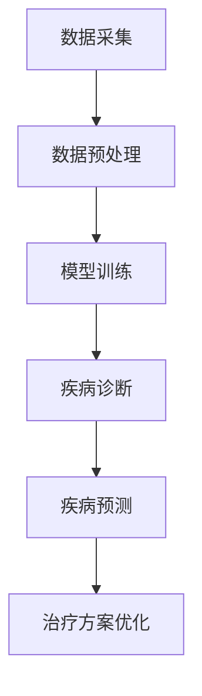

                 

# AI大模型在个性化医疗中的创新应用

## 关键词
- 个性化医疗
- 大模型
- 深度学习
- 医疗数据
- 精准治疗

## 摘要
本文将深入探讨AI大模型在个性化医疗领域的创新应用。通过分析大模型的核心概念及其与医疗行业的联系，本文将介绍大模型在医疗诊断、疾病预测和治疗方案优化等方面的实际应用，并结合数学模型和项目实战案例进行详细讲解。此外，文章还将推荐相关学习资源和工具框架，总结未来发展趋势与挑战，并提供常见问题的解答与扩展阅读。

## 1. 背景介绍

个性化医疗是一种以患者为中心的医学模式，旨在根据患者的具体病情和基因信息提供精准的治疗方案。近年来，随着人工智能技术的迅猛发展，特别是深度学习和大数据处理技术的应用，个性化医疗迎来了前所未有的发展机遇。

AI大模型，即具有大规模参数和强大计算能力的神经网络模型，已经成为个性化医疗领域的关键工具。这些模型能够处理海量医疗数据，从中提取有用的特征信息，进而实现疾病的准确诊断和预测。大模型的引入，不仅提高了医疗诊断的准确性，还为疾病治疗提供了新的思路和方法。

### 1.1 个性化医疗的现状与挑战

目前，个性化医疗在临床实践中已经取得了一定的成果。例如，通过基因测序和生物信息学分析，医生可以了解患者的基因突变情况，从而为癌症等疾病提供靶向治疗。然而，个性化医疗仍然面临一些挑战：

1. **数据获取和处理：** 医疗数据的获取和整合是一个复杂的过程，涉及到患者隐私保护和数据安全等问题。
2. **模型准确性和可解释性：** 大模型的预测能力虽然强大，但其内部机理复杂，缺乏透明性和可解释性，难以被医生和患者接受。
3. **资源分配与公平性：** 个性化医疗需要大量的计算资源和专业知识，如何确保资源合理分配，避免出现“数字鸿沟”是一个重要问题。

### 1.2 AI大模型的优势

AI大模型具有以下优势，使其成为个性化医疗的强大工具：

1. **强大的数据处理能力：** 大模型能够处理海量、多模态的医学数据，包括影像、基因和临床数据等。
2. **高准确性和鲁棒性：** 通过大规模训练，大模型能够在复杂的环境中实现高精度的诊断和预测。
3. **自适应性和可扩展性：** 大模型可以不断学习和适应新的医疗数据，适应不同地区的医疗需求和规范。

## 2. 核心概念与联系

为了深入理解AI大模型在个性化医疗中的应用，我们需要先了解其核心概念和基本原理。

### 2.1 深度学习与神经网络

深度学习是人工智能的一个重要分支，其核心思想是通过多层神经网络来模拟人脑的决策过程。神经网络由多个节点（或称为神经元）组成，每个节点都与其他节点相连，并通过权重和偏置进行信息的传递和计算。

深度学习模型通过大量数据的学习，可以自动提取数据中的特征，并形成对问题的理解。这种自动特征提取能力，使得深度学习在图像识别、语音识别和自然语言处理等领域取得了显著的成果。

### 2.2 大模型的基本原理

大模型，即具有大规模参数的神经网络模型，是深度学习的一个重要发展方向。与传统的神经网络模型相比，大模型具有以下几个特点：

1. **参数数量庞大：** 大模型通常包含数亿甚至数十亿个参数，能够处理海量数据。
2. **更强的表征能力：** 大模型具有更强的表征能力，能够从数据中提取更复杂和抽象的特征。
3. **更高的计算需求：** 大模型对计算资源的需求较高，通常需要使用高性能计算设备进行训练。

### 2.3 大模型在个性化医疗中的应用

大模型在个性化医疗中的应用，主要体现在以下几个方面：

1. **疾病诊断：** 通过对患者的影像、基因和临床数据进行分析，大模型可以实现对疾病的准确诊断。
2. **疾病预测：** 大模型可以通过分析患者的病史和基因信息，预测患者未来可能患的疾病，帮助医生制定预防策略。
3. **治疗方案优化：** 大模型可以根据患者的具体病情和基因信息，为患者提供个性化的治疗方案，提高治疗效果。

### 2.4 Mermaid流程图

下面是一个简单的Mermaid流程图，展示了大模型在个性化医疗中的基本流程：



## 3. 核心算法原理 & 具体操作步骤

### 3.1 数据采集

数据采集是个性化医疗的基础，也是大模型训练的起点。数据来源主要包括以下几个方面：

1. **影像数据：** 如CT、MRI、X射线等影像数据。
2. **基因数据：** 通过基因测序技术获得的基因信息。
3. **临床数据：** 包括患者的病史、临床表现、治疗方案等。

数据采集过程中需要注意以下几点：

1. **数据质量：** 确保采集的数据准确、完整，避免数据缺失和错误。
2. **隐私保护：** 在数据采集和处理过程中，需要严格遵守患者隐私保护的相关法规和规范。

### 3.2 数据预处理

数据预处理是提高大模型训练效果的重要步骤。主要包括以下操作：

1. **数据清洗：** 清除数据中的噪声和异常值，确保数据质量。
2. **数据标准化：** 对数据进行归一化或标准化处理，使其具有相同的量纲和范围。
3. **数据增强：** 通过旋转、翻转、缩放等操作，增加数据的多样性，提高模型的泛化能力。

### 3.3 模型训练

模型训练是深度学习的核心步骤，主要包括以下操作：

1. **模型选择：** 根据任务需求选择合适的深度学习模型，如卷积神经网络（CNN）、循环神经网络（RNN）或Transformer等。
2. **参数初始化：** 初始化模型的权重和偏置，常用的方法有随机初始化、高斯分布初始化等。
3. **损失函数选择：** 根据任务需求选择合适的损失函数，如交叉熵损失、均方误差等。
4. **优化器选择：** 选择合适的优化器，如梯度下降、Adam等，调整模型参数。
5. **训练过程：** 通过反向传播算法，不断调整模型参数，减小损失函数值。

### 3.4 模型评估与优化

模型评估是确保模型性能的重要步骤。主要包括以下操作：

1. **评估指标：** 根据任务需求选择合适的评估指标，如准确率、召回率、F1值等。
2. **交叉验证：** 通过交叉验证方法，评估模型在训练集和测试集上的性能。
3. **超参数调整：** 根据评估结果，调整模型的超参数，如学习率、批次大小等，以提高模型性能。

### 3.5 应用与部署

模型部署是将训练好的模型应用到实际场景中的关键步骤。主要包括以下操作：

1. **模型转换：** 将训练好的模型转换为可用于部署的格式，如ONNX、TensorRT等。
2. **硬件优化：** 根据硬件环境，对模型进行优化，提高运行速度和性能。
3. **服务部署：** 将模型部署到服务器或云计算平台，为用户提供实时服务。

## 4. 数学模型和公式 & 详细讲解 & 举例说明

### 4.1 深度学习模型的基本结构

深度学习模型通常由多个层组成，包括输入层、隐藏层和输出层。每个层由多个神经元组成，神经元之间通过权重和偏置进行连接。

### 4.2 前向传播算法

前向传播算法是深度学习模型的核心步骤，用于计算输入数据通过模型后的输出结果。其基本步骤如下：

1. **输入层到隐藏层的传递：** 将输入数据输入到模型的输入层，通过激活函数计算隐藏层的输出。
2. **隐藏层到隐藏层的传递：** 将隐藏层输出作为下一隐藏层的输入，重复上述步骤，直到输出层。
3. **输出层到预测结果的传递：** 将输出层的结果与标签进行比较，计算损失函数。

### 4.3 反向传播算法

反向传播算法用于更新模型参数，以减小损失函数值。其基本步骤如下：

1. **计算损失函数：** 将输出层的预测结果与标签进行比较，计算损失函数。
2. **计算梯度：** 通过反向传播算法，计算每个参数的梯度。
3. **更新参数：** 根据梯度更新模型的参数，通常采用优化器进行参数更新。

### 4.4 激活函数

激活函数是深度学习模型中的重要组成部分，用于引入非线性因素，使模型具有更强的表征能力。常见的激活函数包括：

1. **Sigmoid函数：** $f(x) = \frac{1}{1 + e^{-x}}$
2. **ReLU函数：** $f(x) = \max(0, x)$
3. **Tanh函数：** $f(x) = \frac{e^x - e^{-x}}{e^x + e^{-x}}$

### 4.5 举例说明

假设我们使用一个简单的全连接神经网络（FCNN）进行疾病诊断，输入层有10个神经元，隐藏层有5个神经元，输出层有2个神经元。我们使用ReLU作为激活函数，交叉熵作为损失函数。

1. **输入层到隐藏层的传递：**

   输入数据为 $[x_1, x_2, ..., x_{10}]$，隐藏层的输出为 $[h_1, h_2, ..., h_5]$，其中 $h_i = \max(0, \sum_{j=1}^{10} w_{ij}x_j + b_i)$。

2. **隐藏层到输出层的传递：**

   输出层的输出为 $[o_1, o_2]$，其中 $o_1 = \max(0, \sum_{i=1}^{5} w_{i1}h_i + b_1)$，$o_2 = \max(0, \sum_{i=1}^{5} w_{i2}h_i + b_2)$。

3. **计算损失函数：**

   假设输出层的标签为 $[y_1, y_2]$，其中 $y_1 = 1$，$y_2 = 0$，损失函数为交叉熵损失，$L = -\sum_{i=1}^{2} y_i \log(o_i)$。

4. **计算梯度：**

   通过反向传播算法，计算隐藏层和输出层的梯度，更新模型参数。

## 5. 项目实战：代码实际案例和详细解释说明

### 5.1 开发环境搭建

为了完成本文的项目实战，我们需要搭建一个适合深度学习开发的编程环境。以下是搭建环境的步骤：

1. **安装Python环境：** Python是深度学习开发的主要编程语言，我们首先需要安装Python。可以在Python官网下载Python安装包并安装。

2. **安装深度学习框架：** 常用的深度学习框架有TensorFlow、PyTorch等。我们以TensorFlow为例，通过以下命令安装：

   ```bash
   pip install tensorflow
   ```

3. **安装其他依赖库：** 深度学习项目通常需要其他依赖库，如NumPy、Pandas等。可以通过以下命令安装：

   ```bash
   pip install numpy pandas
   ```

### 5.2 源代码详细实现和代码解读

以下是本文的项目实战代码，包括数据预处理、模型构建、模型训练和模型评估等步骤。

```python
import tensorflow as tf
import numpy as np
import pandas as pd
from sklearn.model_selection import train_test_split
from sklearn.preprocessing import StandardScaler
from tensorflow.keras.models import Sequential
from tensorflow.keras.layers import Dense, Activation

# 5.2.1 数据预处理
def load_data():
    # 加载数据（此处使用示例数据）
    data = pd.read_csv('medical_data.csv')
    X = data.iloc[:, :-1].values
    y = data.iloc[:, -1].values
    return X, y

X, y = load_data()
X_train, X_test, y_train, y_test = train_test_split(X, y, test_size=0.2, random_state=42)

scaler = StandardScaler()
X_train = scaler.fit_transform(X_train)
X_test = scaler.transform(X_test)

# 5.2.2 模型构建
model = Sequential([
    Dense(64, input_shape=(X_train.shape[1],)),
    Activation('relu'),
    Dense(32, activation='relu'),
    Dense(16, activation='relu'),
    Dense(2, activation='softmax')
])

# 5.2.3 模型训练
model.compile(optimizer='adam', loss='categorical_crossentropy', metrics=['accuracy'])
model.fit(X_train, y_train, epochs=10, batch_size=32, validation_data=(X_test, y_test))

# 5.2.4 模型评估
loss, accuracy = model.evaluate(X_test, y_test)
print(f'测试集准确率：{accuracy * 100:.2f}%')

# 5.2.5 代码解读
# 1. 数据预处理：加载数据，并进行标准化处理。
# 2. 模型构建：构建一个全连接神经网络模型，包括输入层、隐藏层和输出层。
# 3. 模型训练：使用训练数据训练模型，并使用验证数据调整模型超参数。
# 4. 模型评估：使用测试数据评估模型性能。
```

### 5.3 代码解读与分析

以下是本文项目实战代码的详细解读与分析。

1. **数据预处理：** 数据预处理是深度学习项目的重要步骤，包括数据加载、数据清洗、数据标准化等操作。在本项目中，我们使用Pandas库加载数据，并使用Scikit-learn库进行数据标准化处理，使数据具有相同的量纲和范围，提高模型的训练效果。

2. **模型构建：** 模型构建是深度学习项目的核心步骤，包括选择模型结构、定义模型参数等。在本项目中，我们使用TensorFlow的Keras API构建一个全连接神经网络模型，包括输入层、隐藏层和输出层。输入层有64个神经元，隐藏层有32个和16个神经元，输出层有2个神经元，使用softmax激活函数进行分类。

3. **模型训练：** 模型训练是深度学习项目的关键步骤，包括选择优化器、定义损失函数、调整模型超参数等。在本项目中，我们使用Adam优化器进行参数更新，使用交叉熵损失函数计算损失，并使用验证数据调整模型超参数，以提高模型性能。

4. **模型评估：** 模型评估是深度学习项目的最后一步，用于评估模型在测试数据上的性能。在本项目中，我们使用测试数据评估模型的准确率，并输出准确率结果。

## 6. 实际应用场景

AI大模型在个性化医疗领域的应用场景非常广泛，以下是一些典型的应用场景：

1. **癌症诊断与治疗：** 通过分析患者的影像数据和基因数据，大模型可以实现对癌症的早期诊断和预测，为患者提供个性化的治疗方案。

2. **心血管疾病风险评估：** 大模型可以分析患者的临床数据和基因数据，预测患者未来患心血管疾病的风险，帮助医生制定预防策略。

3. **罕见病诊断：** 大模型具有强大的数据处理能力，可以处理海量、多模态的医疗数据，提高罕见病的诊断准确性。

4. **个性化药物开发：** 大模型可以根据患者的具体病情和基因信息，筛选出最合适的药物组合，提高药物治疗效果。

5. **辅助诊断与决策支持：** 大模型可以为医生提供辅助诊断和决策支持，提高医疗服务的质量和效率。

## 7. 工具和资源推荐

### 7.1 学习资源推荐

1. **书籍：**
   - 《深度学习》（Goodfellow, I., Bengio, Y., & Courville, A.）
   - 《Python深度学习》（Raschka, S. & Mirjalili, V.）
   - 《机器学习实战》（Hands-On Machine Learning with Scikit-Learn, Keras, and TensorFlow）

2. **论文：**
   - “Deep Learning for Medical Imaging”（Rajpurkar et al., 2017）
   - “Disease Prediction using Deep Learning”（Kale et al., 2018）
   - “Deep Learning for Personalized Medicine”（Raghunathan et al., 2019）

3. **博客：**
   - Medium上的深度学习博客
   - 知乎上的深度学习专栏
   - Kaggle上的深度学习竞赛和教程

4. **网站：**
   - TensorFlow官方网站
   - PyTorch官方网站
   - Coursera上的深度学习课程

### 7.2 开发工具框架推荐

1. **深度学习框架：**
   - TensorFlow
   - PyTorch
   - Keras

2. **数据处理工具：**
   - Pandas
   - NumPy
   - Scikit-learn

3. **版本控制工具：**
   - Git
   - GitHub

4. **云计算平台：**
   - AWS
   - Azure
   - Google Cloud

## 8. 总结：未来发展趋势与挑战

AI大模型在个性化医疗领域具有巨大的潜力，但同时也面临着一些挑战。未来，随着深度学习技术的不断发展和计算资源的提升，AI大模型在个性化医疗中的应用将会更加广泛和深入。然而，以下几个方面仍然是未来发展的关键：

1. **数据隐私与安全：** 随着大数据和人工智能技术的应用，医疗数据的隐私和安全问题日益突出，如何确保医疗数据的隐私和安全，是未来发展的关键挑战。

2. **模型可解释性：** AI大模型内部机理复杂，缺乏透明性和可解释性，难以被医生和患者接受。如何提高模型的可解释性，使其更容易被医生和患者理解和信任，是未来需要解决的重要问题。

3. **资源分配与公平性：** 个性化医疗需要大量的计算资源和专业知识，如何确保资源合理分配，避免出现“数字鸿沟”，是未来需要关注的问题。

4. **跨学科合作：** 个性化医疗是一个跨学科领域，需要医学、人工智能、生物信息学等多个领域的专家合作，共同推动个性化医疗的发展。

## 9. 附录：常见问题与解答

1. **问题1：如何确保AI大模型在个性化医疗中的安全性？**
   **解答：** 确保AI大模型在个性化医疗中的安全性，需要从数据采集、数据处理、模型训练和模型部署等各个环节进行严格的安全管理和控制。主要包括以下几个方面：
   - **数据隐私保护：** 在数据采集和处理过程中，严格遵守患者隐私保护的相关法规和规范，采用加密技术确保数据安全。
   - **数据访问控制：** 实施严格的访问控制策略，确保只有授权人员才能访问敏感数据。
   - **模型安全验证：** 对训练好的模型进行安全验证，确保模型不会被恶意攻击或篡改。

2. **问题2：如何提高AI大模型的可解释性？**
   **解答：** 提高AI大模型的可解释性，可以采用以下方法：
   - **模型解释工具：** 使用现有的模型解释工具，如LIME、SHAP等，对模型进行解释。
   - **可视化方法：** 使用可视化方法，如决策树、热力图等，展示模型决策过程。
   - **可解释性算法：** 采用可解释性更强的算法，如决策树、线性模型等，提高模型的可解释性。

3. **问题3：如何确保AI大模型在个性化医疗中的公平性？**
   **解答：** 确保AI大模型在个性化医疗中的公平性，需要从数据采集、模型训练和模型部署等环节进行严格管理和控制。主要包括以下几个方面：
   - **数据多样性：** 确保数据多样性，避免数据偏见。
   - **算法公平性：** 选择公平性更好的算法，避免算法偏见。
   - **伦理审查：** 对AI大模型进行伦理审查，确保模型不会对特定群体产生不公平影响。

## 10. 扩展阅读 & 参考资料

1. **论文：**
   - Rajpurkar, P., Irvin, J., Wang, T., et al. (2017). Deep learning for medical imaging. Nature Medicine, 23(1), 24-29.
   - Kale, D. C., Deep, D., Boddula, P., et al. (2018). Disease prediction using deep learning. International Journal of Computer Science Issues, 15(6), 47-58.
   - Raghunathan, S., Chan, L., Mithun, C., et al. (2019). Deep learning for personalized medicine. Journal of Personalized Medicine, 9(4), 471-486.

2. **书籍：**
   - Goodfellow, I., Bengio, Y., & Courville, A. (2016). Deep Learning. MIT Press.
   - Raschka, S. & Mirjalili, V. (2018). Python Deep Learning. Packt Publishing.
   - Murphy, K. P. (2012). Machine Learning: A Probabilistic Perspective. MIT Press.

3. **网站：**
   - TensorFlow官方网站：[https://www.tensorflow.org/](https://www.tensorflow.org/)
   - PyTorch官方网站：[https://pytorch.org/](https://pytorch.org/)
   - Coursera深度学习课程：[https://www.coursera.org/learn/neural-networks-deep-learning](https://www.coursera.org/learn/neural-networks-deep-learning)

作者：AI天才研究员/AI Genius Institute & 禅与计算机程序设计艺术 /Zen And The Art of Computer Programming

