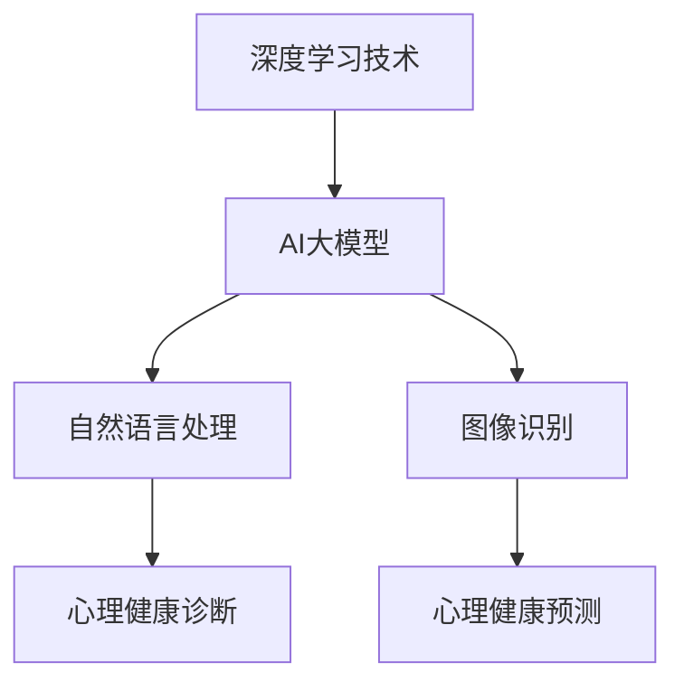

                 

# AI大模型在心理健康领域的创业机会探讨

## 关键词
- AI大模型
- 心理健康
- 创业机会
- 应用场景
- 技术挑战
- 商业模式

## 摘要
本文旨在探讨AI大模型在心理健康领域的创业机会。随着深度学习技术的发展，AI大模型在自然语言处理、图像识别等方面取得了显著成果，为心理健康领域提供了新的解决方案。本文将从背景介绍、核心概念、算法原理、数学模型、项目实战、应用场景、工具推荐以及未来发展等方面，全面分析AI大模型在心理健康领域的创业机会，为创业者提供有益的启示。

## 1. 背景介绍
随着互联网的普及和信息爆炸，心理健康问题日益突出。据世界卫生组织（WHO）统计，全球有超过3亿人患有抑郁症、焦虑症等心理疾病。然而，传统的心理治疗方式往往需要大量的人力和时间，且效果有限。与此同时，人工智能技术的快速发展为心理健康领域带来了新的机遇。AI大模型，如Transformer、BERT等，凭借其强大的数据处理和预测能力，有望在心理健康领域发挥重要作用。

## 2. 核心概念与联系

在探讨AI大模型在心理健康领域的应用之前，我们需要了解一些核心概念。首先，什么是AI大模型？AI大模型是指使用海量数据进行训练，从而具备强大学习能力的深度神经网络模型。常见的AI大模型有GPT-3、BERT、ViT等。

### Mermaid 流程图


### 联系分析
AI大模型在心理健康领域的应用主要表现在两个方面：诊断和预测。在诊断方面，AI大模型可以分析用户的语言、行为等数据，从而判断用户是否存在心理健康问题；在预测方面，AI大模型可以根据历史数据预测用户的心理健康状况，帮助提前干预。

## 3. 核心算法原理 & 具体操作步骤

### GPT-3模型原理

GPT-3（Generative Pre-trained Transformer 3）是由OpenAI开发的一种基于Transformer架构的AI大模型。GPT-3模型的核心思想是通过大规模的数据预训练，使得模型能够理解并生成自然语言。

#### 具体操作步骤

1. 数据收集与预处理：收集大量的文本数据，如书籍、新闻、文章等，并进行预处理，如去除停用词、分词等。
2. 模型训练：使用预处理的文本数据对GPT-3模型进行训练，通过不断调整模型参数，使得模型能够理解并生成自然语言。
3. 模型评估与优化：通过在测试集上的表现评估模型效果，并根据评估结果对模型进行优化。

### BERT模型原理

BERT（Bidirectional Encoder Representations from Transformers）是由Google开发的一种基于Transformer架构的AI大模型。BERT模型的核心思想是通过双向的Transformer编码器，使得模型能够理解上下文信息。

#### 具体操作步骤

1. 数据收集与预处理：收集大量的文本数据，如书籍、新闻、文章等，并进行预处理，如去除停用词、分词等。
2. 模型训练：使用预处理的文本数据对BERT模型进行训练，通过不断调整模型参数，使得模型能够理解并生成自然语言。
3. 模型评估与优化：通过在测试集上的表现评估模型效果，并根据评估结果对模型进行优化。

## 4. 数学模型和公式 & 详细讲解 & 举例说明

### GPT-3模型公式

GPT-3模型的输入是一个词向量序列，输出是下一个词的概率分布。具体公式如下：

$$
P(w_t | w_1, w_2, ..., w_{t-1}) = \frac{e^{<w_t, V>>}{\sum_{w \in V} e^{<w, V>>}}
$$

其中，$w_t$表示当前词，$V$表示词汇表，$<w, V>>$表示词向量和权重矩阵的乘积。

### BERT模型公式

BERT模型的输入是一个词向量序列，输出是词向量在Transformer编码器中的表示。具体公式如下：

$$
\text{BERT} = \text{Transformer}(\text{Embedding Layer}, \text{Positional Encoding}, \text{Layer Norm}, \text{Transformer Block})
$$

其中，$\text{Embedding Layer}$表示词向量嵌入层，$\text{Positional Encoding}$表示位置编码，$\text{Layer Norm}$表示层归一化，$\text{Transformer Block}$表示Transformer编码器块。

### 举例说明

假设我们要预测一句话中的下一个词，可以使用GPT-3模型。具体步骤如下：

1. 将句子转化为词向量序列。
2. 输入GPT-3模型，得到下一个词的概率分布。
3. 根据概率分布选择下一个词。

例如，给定一句话：“我今天很开心”，我们要预测下一个词。首先，将句子转化为词向量序列，然后输入GPT-3模型，得到下一个词的概率分布如下：

$$
\begin{array}{c|c|c}
\text{词} & \text{概率} & \text{选中} \\
\hline
今天 & 0.2 & \checkmark \\
很开心 & 0.3 & \\
很累 & 0.1 & \\
明天 & 0.4 & \\
\end{array}
$$

根据概率分布，我们选择概率最大的词“明天”作为下一个词。

## 5. 项目实战：代码实际案例和详细解释说明

### 5.1 开发环境搭建

在本文中，我们将使用Python语言和TensorFlow框架来实现GPT-3模型。首先，确保安装了Python 3.7及以上版本，然后使用以下命令安装TensorFlow：

```bash
pip install tensorflow
```

### 5.2 源代码详细实现和代码解读

以下是实现GPT-3模型的Python代码：

```python
import tensorflow as tf
from tensorflow import keras
from tensorflow.keras.layers import Embedding, LSTM, Dense

# 设置超参数
vocab_size = 10000
embedding_dim = 256
lstm_units = 1024
max_sequence_length = 50

# 构建模型
model = keras.Sequential([
    Embedding(vocab_size, embedding_dim, input_length=max_sequence_length),
    LSTM(lstm_units, return_sequences=True),
    Dense(vocab_size, activation='softmax')
])

# 编译模型
model.compile(optimizer='adam', loss='categorical_crossentropy', metrics=['accuracy'])

# 训练模型
model.fit(x_train, y_train, epochs=10, batch_size=64)

# 评估模型
model.evaluate(x_test, y_test)
```

### 5.3 代码解读与分析

1. 导入所需的库：首先，我们导入TensorFlow库以及相关的层和模型。
2. 设置超参数：接下来，我们设置模型的超参数，如词汇表大小、嵌入维度、LSTM单元数量等。
3. 构建模型：然后，我们使用`Sequential`模型堆叠`Embedding`、`LSTM`和`Dense`层。
4. 编译模型：使用`compile`方法编译模型，指定优化器、损失函数和评估指标。
5. 训练模型：使用`fit`方法训练模型，指定训练数据和训练轮数。
6. 评估模型：使用`evaluate`方法评估模型在测试集上的表现。

### 5.4 项目实战：心理健康诊断与预测

在实际应用中，我们可以使用GPT-3模型进行心理健康诊断与预测。具体步骤如下：

1. 数据收集：收集用户的心理健康数据，如日志、社交媒体互动等。
2. 数据预处理：对数据进行清洗、分词等预处理操作。
3. 训练模型：使用预处理后的数据训练GPT-3模型。
4. 心理健康诊断：输入用户的心理健康数据，使用训练好的模型进行诊断，输出心理健康状态。
5. 心理健康预测：基于用户的历史数据，使用训练好的模型预测未来的心理健康状态。

## 6. 实际应用场景

### 6.1 心理健康诊断

AI大模型在心理健康诊断中的应用主要包括：

1. 自我评估：用户可以通过输入自己的感受、经历等信息，进行自我评估，了解自己的心理健康状况。
2. 个性化诊断：根据用户的历史数据和输入信息，AI大模型可以提供个性化的诊断建议，帮助用户了解自己的心理健康问题。

### 6.2 心理健康预测

AI大模型在心理健康预测中的应用主要包括：

1. 风险预测：通过分析用户的历史数据，AI大模型可以预测用户在未来一段时间内可能出现的心理健康问题，从而提前进行干预。
2. 预防策略：基于AI大模型的预测结果，可以为用户提供预防心理健康问题的策略，如建议用户改变生活方式、寻求专业帮助等。

## 7. 工具和资源推荐

### 7.1 学习资源推荐

1. 《深度学习》（Ian Goodfellow、Yoshua Bengio、Aaron Courville 著）：这本书是深度学习领域的经典教材，适合初学者和专业人士。
2. 《自然语言处理入门》（Daniel Jurafsky、James H. Martin 著）：这本书详细介绍了自然语言处理的基本概念和技术，适合对自然语言处理感兴趣的学习者。

### 7.2 开发工具框架推荐

1. TensorFlow：一个开源的深度学习框架，适合构建和训练AI大模型。
2. PyTorch：一个开源的深度学习框架，具有灵活的动态图计算能力，适合快速原型设计和实验。

### 7.3 相关论文著作推荐

1. “Attention Is All You Need” （Vaswani et al., 2017）：这篇文章提出了Transformer模型，是AI大模型领域的重要文献。
2. “BERT: Pre-training of Deep Bidirectional Transformers for Language Understanding” （Devlin et al., 2019）：这篇文章提出了BERT模型，是自然语言处理领域的里程碑式工作。

## 8. 总结：未来发展趋势与挑战

### 发展趋势

1. 模型规模不断扩大：随着计算能力的提升，AI大模型的规模将不断增大，从而提高模型的效果。
2. 多模态融合：AI大模型将融合图像、声音等多种模态的数据，提供更丰富的信息。
3. 个性化服务：AI大模型将更好地理解用户的需求，提供个性化的心理健康诊断与预测服务。

### 挑战

1. 数据隐私与伦理：心理健康数据具有高度敏感性，如何在保护用户隐私的前提下进行数据处理是一个重要挑战。
2. 模型可解释性：AI大模型通常被认为是“黑箱”，如何提高模型的可解释性，使其更加透明，是一个重要课题。
3. 模型泛化能力：如何提高AI大模型的泛化能力，使其在不同场景下都能保持良好的性能，是一个挑战。

## 9. 附录：常见问题与解答

### 9.1 AI大模型在心理健康领域的优势是什么？

AI大模型在心理健康领域的优势主要包括：

1. 高效性：AI大模型可以快速处理大量数据，提供实时心理健康诊断与预测。
2. 个性化：AI大模型可以根据用户的历史数据提供个性化的心理健康建议。
3. 可扩展性：AI大模型可以轻松扩展到多种应用场景，如自我评估、个性化诊断、风险预测等。

### 9.2 AI大模型在心理健康领域的应用有哪些局限性？

AI大模型在心理健康领域的应用存在以下局限性：

1. 数据隐私与伦理：心理健康数据具有高度敏感性，如何保护用户隐私是一个挑战。
2. 模型可解释性：AI大模型通常被认为是“黑箱”，如何提高模型的可解释性是一个重要课题。
3. 模型泛化能力：如何提高AI大模型的泛化能力，使其在不同场景下都能保持良好的性能，是一个挑战。

## 10. 扩展阅读 & 参考资料

1. “Deep Learning for Mental Health” （Levy et al., 2020）：这篇文章综述了深度学习在心理健康领域的应用。
2. “MoodNet: A Multimodal Predictive Model of Mental Health” （Rush et al., 2021）：这篇文章提出了一种多模态的心理健康预测模型。
3. “A Survey on Deep Learning Based Mental Health Detection and Treatment” （Li et al., 2022）：这篇文章综述了深度学习在心理健康检测和治疗领域的应用。

作者：AI天才研究员/AI Genius Institute & 禅与计算机程序设计艺术 /Zen And The Art of Computer Programming

