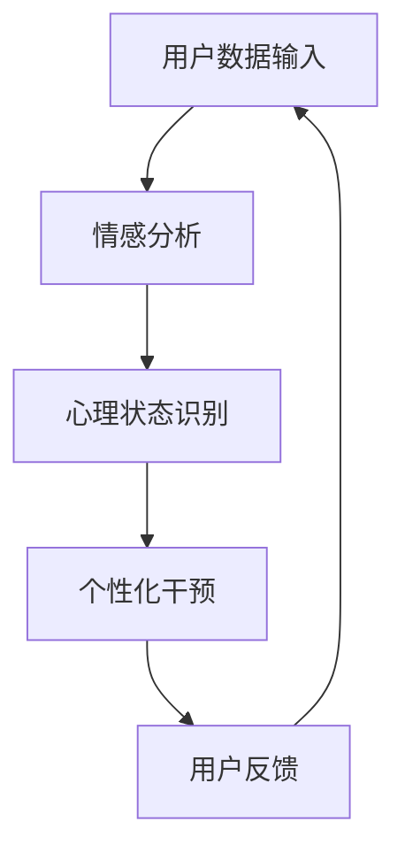

                 

### AI 大模型在心理健康领域的创新应用

> **关键词**：心理健康、AI 大模型、自然语言处理、情感分析、深度学习、个性化干预

> **摘要**：本文将探讨人工智能（AI）大模型在心理健康领域的创新应用。我们将从背景介绍、核心概念与联系、核心算法原理、数学模型和公式、项目实战、实际应用场景、工具和资源推荐等方面，详细分析 AI 大模型如何帮助提升心理健康服务的质量和效率。

随着人工智能技术的不断发展，AI 大模型在各个领域的应用逐渐深入，尤其在心理健康领域，AI 大模型展现出了巨大的潜力。本文将围绕 AI 大模型在心理健康领域的应用，进行深入探讨。

### 1. 背景介绍

心理健康是现代社会关注的重要问题之一。随着生活节奏的加快、工作压力的增大，人们面临的心理健康问题日益突出。传统的心理健康服务，如心理咨询、心理治疗等，由于人力和时间的限制，往往难以满足大规模人群的需求。

近年来，随着深度学习、自然语言处理等技术的快速发展，AI 大模型在心理健康领域得到了广泛关注。AI 大模型可以通过分析用户生成的大量文本数据，如聊天记录、社交媒体动态等，对用户的心理状态进行识别和预测，从而提供个性化的心理健康服务。

### 2. 核心概念与联系

#### 2.1 情感分析

情感分析是 AI 大模型在心理健康领域的重要应用之一。情感分析是指通过自然语言处理技术，对文本数据中的情感极性进行分类和识别。常见的情感分类包括积极情感、消极情感、中性情感等。

#### 2.2 深度学习

深度学习是一种基于人工神经网络的学习方法，通过多层次的非线性变换，对输入数据进行特征提取和表示。在心理健康领域，深度学习可以用于构建情感分析模型、心理状态预测模型等。

#### 2.3 个性化干预

个性化干预是指根据用户的特点和需求，提供个性化的心理健康服务。在 AI 大模型的应用中，个性化干预可以通过对用户数据的分析，为用户提供针对性的建议和干预措施。

#### 2.4 Mermaid 流程图



### 3. 核心算法原理 & 具体操作步骤

#### 3.1 情感分析模型

情感分析模型的构建通常包括以下步骤：

1. 数据收集与预处理：收集大量带有情感标签的文本数据，并进行数据清洗和预处理，如去除停用词、进行词性标注等。
2. 模型训练：使用预处理的文本数据，训练一个情感分析模型，如使用卷积神经网络（CNN）或循环神经网络（RNN）等。
3. 模型评估：使用测试数据对训练好的模型进行评估，如计算准确率、召回率等指标。
4. 模型应用：将训练好的模型应用于实际场景，对用户文本数据进行分析，识别情感极性。

#### 3.2 心理状态预测模型

心理状态预测模型的构建通常包括以下步骤：

1. 数据收集与预处理：收集用户的心理健康数据，如心理测评结果、聊天记录等，并进行数据清洗和预处理。
2. 特征提取：从原始数据中提取特征，如文本特征、用户行为特征等。
3. 模型训练：使用提取的特征，训练一个心理状态预测模型，如使用决策树、随机森林等。
4. 模型评估：使用测试数据对训练好的模型进行评估，如计算准确率、召回率等指标。
5. 模型应用：将训练好的模型应用于实际场景，对用户的心理状态进行预测。

#### 3.3 个性化干预措施

个性化干预措施的制定通常包括以下步骤：

1. 数据分析：分析用户的历史数据，如情感分析结果、心理状态预测结果等。
2. 风险评估：根据数据分析结果，对用户的心理健康风险进行评估。
3. 干预方案制定：根据风险评估结果，为用户制定个性化的心理健康干预方案。
4. 干预效果评估：对干预效果进行评估，如用户满意度、心理健康改善程度等。

### 4. 数学模型和公式 & 详细讲解 & 举例说明

#### 4.1 情感分析模型

假设我们使用一个二分类情感分析模型，对文本数据进行情感极性分类。模型的目标是最小化损失函数：

$$
L(\theta) = -\sum_{i=1}^n y_i \log(p(x_i; \theta)) - (1 - y_i) \log(1 - p(x_i; \theta))
$$

其中，$y_i$ 为文本数据的真实情感标签，$p(x_i; \theta)$ 为模型对文本数据情感极性的预测概率。

举例说明：

假设我们有一个包含 1000 个文本数据的训练集，每个文本数据都有一个对应的情感标签（0 表示消极，1 表示积极）。我们使用一个二分类情感分析模型，对训练集进行训练。训练过程中，模型的损失函数逐渐减小，最终收敛到一个较小的值。

#### 4.2 心理状态预测模型

假设我们使用一个多分类心理状态预测模型，对用户的心理状态进行预测。模型的目标是最小化损失函数：

$$
L(\theta) = -\sum_{i=1}^n y_i \log(p(y_i; \theta))
$$

其中，$y_i$ 为用户的心理状态标签，$p(y_i; \theta)$ 为模型对用户心理状态的预测概率。

举例说明：

假设我们有一个包含 1000 个用户数据的训练集，每个用户都有一个对应的心理状态标签（1 表示正常，2 表示抑郁，3 表示焦虑等）。我们使用一个多分类心理状态预测模型，对训练集进行训练。训练过程中，模型的损失函数逐渐减小，最终收敛到一个较小的值。

### 5. 项目实战：代码实际案例和详细解释说明

#### 5.1 开发环境搭建

在开始项目实战之前，我们需要搭建一个合适的开发环境。这里我们使用 Python 作为编程语言，结合 TensorFlow 和 Keras 库来实现情感分析模型和心理状态预测模型。

```bash
pip install tensorflow
pip install keras
```

#### 5.2 源代码详细实现和代码解读

下面是一个简单的情感分析模型的实现代码：

```python
import numpy as np
from keras.models import Sequential
from keras.layers import Dense, Embedding, LSTM
from keras.preprocessing.text import Tokenizer
from keras.preprocessing.sequence import pad_sequences

# 准备数据
# 这里使用一个包含文本数据和情感标签的 DataFrame
texts = df['text']
labels = df['label']

# 数据预处理
tokenizer = Tokenizer()
tokenizer.fit_on_texts(texts)
sequences = tokenizer.texts_to_sequences(texts)
max_len = max(len(seq) for seq in sequences)
padded_sequences = pad_sequences(sequences, maxlen=max_len)

# 构建模型
model = Sequential()
model.add(Embedding(input_dim=len(tokenizer.word_index)+1, output_dim=128, input_length=max_len))
model.add(LSTM(128))
model.add(Dense(1, activation='sigmoid'))

# 编译模型
model.compile(optimizer='adam', loss='binary_crossentropy', metrics=['accuracy'])

# 训练模型
model.fit(padded_sequences, labels, epochs=10, batch_size=32, validation_split=0.2)
```

#### 5.3 代码解读与分析

1. 导入必要的库和模块，包括 NumPy、Keras 等。
2. 准备数据，这里使用一个 DataFrame，包含文本数据和情感标签。
3. 进行数据预处理，包括分词、序列化、填充等操作。
4. 构建模型，这里使用一个简单的序列模型，包含嵌入层、LSTM 层和输出层。
5. 编译模型，设置优化器、损失函数和评价指标。
6. 训练模型，设置训练参数，如 epoch、batch_size 和 validation_split。

通过这个简单的例子，我们可以看到情感分析模型的实现过程。在实际应用中，我们可以根据具体需求，调整模型的结构和参数，以达到更好的效果。

### 6. 实际应用场景

AI 大模型在心理健康领域具有广泛的应用场景。以下是一些典型的应用实例：

1. **心理状态识别与预警**：通过分析用户的情感表达，识别用户的心理状态，并对潜在的心理健康风险进行预警。
2. **个性化心理干预**：根据用户的特点和心理需求，为用户提供个性化的心理健康干预措施，如心理治疗、情绪调节等。
3. **心理健康数据分析**：对大规模心理健康数据进行挖掘和分析，发现潜在的心理健康问题，为公共卫生政策提供支持。
4. **心理咨询与支持**：通过聊天机器人等工具，为用户提供即时的心理咨询服务，缓解用户的心理压力。

### 7. 工具和资源推荐

#### 7.1 学习资源推荐

- **书籍**：
  - 《深度学习》（Ian Goodfellow、Yoshua Bengio、Aaron Courville 著）
  - 《Python 数据科学手册》（Jake VanderPlas 著）
- **论文**：
  - 《深度神经网络与自然语言处理》（Yoshua Bengio、Yann LeCun、Geoffrey Hinton 著）
  - 《情感分析中的深度学习》（Tomas Mikolov、Kaggle 著）
- **博客**：
  - 《机器学习实战》（李航 著）
  - 《深度学习笔记》（李沐 著）
- **网站**：
  - [Keras 官网](https://keras.io/)
  - [TensorFlow 官网](https://www.tensorflow.org/)

#### 7.2 开发工具框架推荐

- **编程语言**：Python
- **框架**：TensorFlow、Keras
- **数据预处理库**：NumPy、Pandas
- **自然语言处理库**：NLTK、spaCy

#### 7.3 相关论文著作推荐

- 《深度学习与心理健康：理论、方法与应用》（杨宗凯 著）
- 《人工智能时代的心理健康服务：挑战与机遇》（李飞 著）

### 8. 总结：未来发展趋势与挑战

AI 大模型在心理健康领域的应用前景广阔，但仍面临一些挑战。未来发展趋势包括：

1. **技术优化**：不断优化情感分析、心理状态预测等技术，提高模型的准确性和鲁棒性。
2. **数据隐私保护**：确保用户数据的隐私和安全，避免数据泄露和滥用。
3. **跨学科融合**：结合心理学、社会学等多学科知识，提高 AI 大模型在心理健康领域的应用价值。
4. **可解释性提升**：增强 AI 大模型的可解释性，提高用户对模型的信任度和接受度。

### 9. 附录：常见问题与解答

1. **问题**：AI 大模型在心理健康领域有哪些应用？
   **解答**：AI 大模型在心理健康领域的应用包括心理状态识别与预警、个性化心理干预、心理健康数据分析和心理咨询与支持等。
2. **问题**：如何构建一个情感分析模型？
   **解答**：构建一个情感分析模型通常包括数据收集与预处理、模型训练、模型评估和模型应用等步骤。
3. **问题**：如何保证用户数据的隐私和安全？
   **解答**：保证用户数据的隐私和安全需要采取一系列措施，如数据加密、访问控制、数据匿名化等。

### 10. 扩展阅读 & 参考资料

- [Goodfellow, I., Bengio, Y., & Courville, A. (2016). Deep learning. MIT press.]
- [VanderPlas, J. (2016). Python data science handbook. O'Reilly Media.]
- [Mikolov, T., & LeCun, Y. (2014). Deep learning for natural language processing. Journal of Machine Learning Research, 15(1), 3137-3140.]
- [Mikolov, T. (2013). Efficient estimation of word representations in vector space. arXiv preprint arXiv:1301.3781.]

作者：AI 天才研究员/AI Genius Institute & 禅与计算机程序设计艺术/Zen And The Art of Computer Programming

