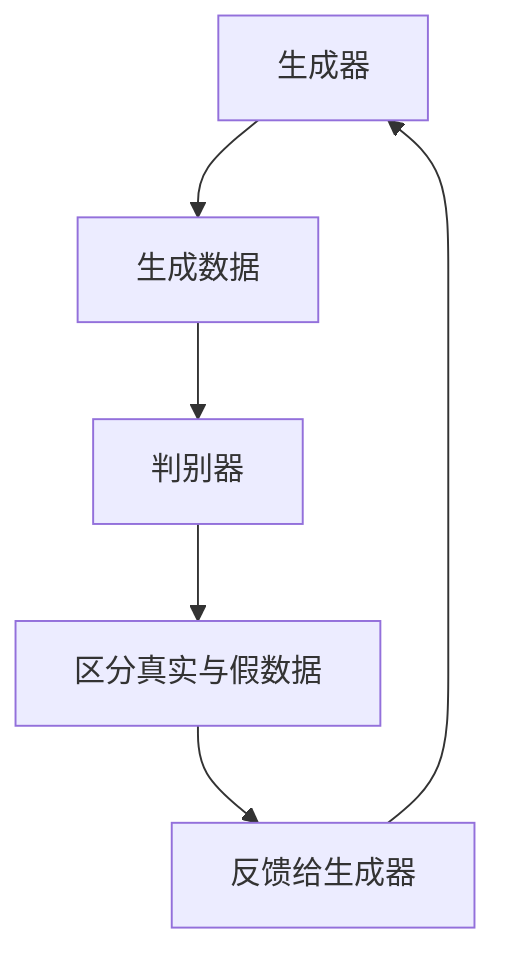
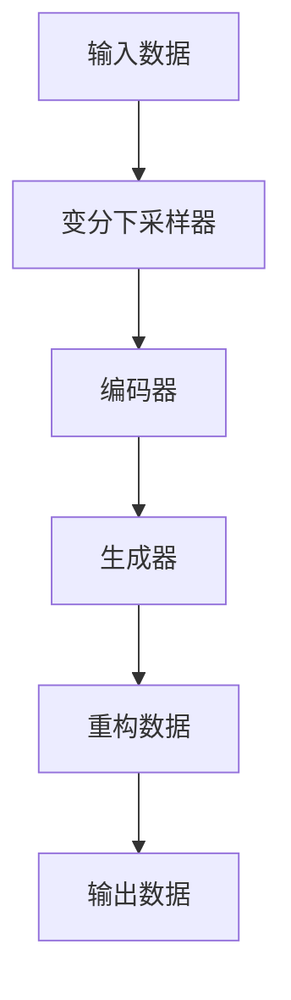

                 

## AI大模型在数字艺术创作中的应用

### 关键词：人工智能，大模型，数字艺术，创意生成，技术应用

#### 摘要

本文将探讨人工智能（AI）大模型在数字艺术创作中的应用。通过介绍AI大模型的基本原理、发展历程，我们将深入分析其如何改变数字艺术创作的方式和流程。文章将涵盖从基础算法到具体应用案例的详细讲解，并结合实际项目，提供代码实现和解读。最后，我们将展望AI大模型在数字艺术领域的未来发展趋势和面临的挑战。

#### 1. 背景介绍

##### 1.1 人工智能与数字艺术的融合

人工智能和数字艺术一直是两个快速发展的领域，近年来，随着计算能力的提升和算法的进步，二者的融合变得更加紧密。AI大模型，尤其是生成对抗网络（GANs）和变分自编码器（VAEs），已经能够生成出高度逼真的数字艺术作品。

##### 1.2 数字艺术创作的现状

在数字艺术创作中，艺术家们经常面临创作灵感的匮乏和重复劳动的困扰。传统的数字艺术创作方式，如手工绘画和数字雕刻，虽然具有独特的艺术价值，但在效率和创新性上存在一定的局限性。

##### 1.3 AI大模型的优势

AI大模型能够通过学习大量的数据，生成新颖、独特且具有艺术性的作品。它们不仅能够模仿已有的艺术风格，还能创造前所未有的艺术形式。此外，AI大模型在处理复杂数据结构和生成多样性的作品方面，具有显著优势。

#### 2. 核心概念与联系

##### 2.1 生成对抗网络（GANs）

生成对抗网络（GANs）是AI大模型中的一种重要类型。它由生成器（Generator）和判别器（Discriminator）组成。生成器的任务是生成与真实数据相近的假数据，而判别器的任务是区分生成器和真实数据。通过这种对抗训练，生成器可以不断提高生成数据的质量。



##### 2.2 变分自编码器（VAEs）

变分自编码器（VAEs）是另一种用于生成数据的AI模型。它通过学习数据的高斯分布，生成具有多样性的数据。VAEs的核心是变分下采样器（Variational Encoder）和生成器（Generator）。



##### 2.3 GANs与VAEs的联系与区别

GANs和VAEs都是用于生成数据的模型，但它们的训练机制和生成策略有所不同。GANs通过对抗训练生成高质量的数据，而VAEs通过学习数据的概率分布生成多样化数据。GANs更适合生成与训练数据相似的图像，而VAEs更适合生成具有多样性的数据。

#### 3. 核心算法原理 & 具体操作步骤

##### 3.1 GANs的原理

GANs的工作流程如下：

1. 初始化生成器和判别器。
2. 生成器生成假数据，判别器对其进行判断。
3. 根据判别器的反馈，更新生成器和判别器的参数。
4. 重复上述步骤，直到生成器生成高质量的数据。

##### 3.2 VAEs的原理

VAEs的工作流程如下：

1. 初始化编码器和生成器。
2. 对输入数据进行编码，得到潜在变量。
3. 使用潜在变量生成重构数据。
4. 计算重构数据与输入数据的差异，更新编码器和生成器的参数。
5. 重复上述步骤，直到生成器生成高质量的数据。

##### 3.3 GANs与VAEs的操作步骤

以GANs为例，具体操作步骤如下：

1. 准备训练数据集。
2. 初始化生成器和判别器的参数。
3. 使用生成器生成假数据，并使用判别器对其进行判断。
4. 根据判别器的反馈，更新生成器和判别器的参数。
5. 重复上述步骤，直到生成器生成高质量的数据。

对于VAEs，具体操作步骤如下：

1. 准备训练数据集。
2. 初始化编码器和生成器的参数。
3. 对输入数据进行编码，得到潜在变量。
4. 使用潜在变量生成重构数据。
5. 计算重构数据与输入数据的差异，更新编码器和生成器的参数。
6. 重复上述步骤，直到生成器生成高质量的数据。

#### 4. 数学模型和公式 & 详细讲解 & 举例说明

##### 4.1 GANs的数学模型

GANs的核心是生成器和判别器的损失函数。生成器的损失函数通常为最小化判别器判断假数据的概率，而判别器的损失函数为最大化判别器判断真实数据和假数据的概率。

生成器G的损失函数：
$$
L_G = -\log(D(G(z)))
$$
其中，$D$是判别器的输出，$z$是随机噪声。

判别器D的损失函数：
$$
L_D = -[\log(D(x)) + \log(1 - D(G(z))]
$$
其中，$x$是真实数据。

##### 4.2 VAEs的数学模型

VAEs的核心是编码器和解码器的损失函数。编码器的损失函数通常为重构损失和KL散度损失。解码器的损失函数为重构损失。

编码器Q的损失函数：
$$
L_Q = E_{z \sim p_z(z)}[\log(D(G(z))]
$$
其中，$G$是生成器，$Q$是编码器。

解码器G的损失函数：
$$
L_G = E_{x \sim p_{\theta}(x)}[\log(Q(x, z)]
$$
其中，$Q$是编码器，$G$是生成器。

##### 4.3 GANs与VAEs的示例

以GANs为例，假设我们有1000张真实人脸图片作为训练数据。

1. 初始化生成器和判别器的参数。
2. 使用生成器生成1000张假人脸图片。
3. 使用判别器判断这1000张假人脸图片的真实性，更新生成器和判别器的参数。
4. 重复上述步骤，直到生成器生成高质量的人脸图片。

对于VAEs，假设我们有1000张真实人脸图片作为训练数据。

1. 初始化编码器和生成器的参数。
2. 对每张人脸图片进行编码，得到潜在变量。
3. 使用潜在变量生成重构人脸图片。
4. 计算重构人脸图片与原始人脸图片的差异，更新编码器和生成器的参数。
5. 重复上述步骤，直到生成器生成高质量的人脸图片。

#### 5. 项目实战：代码实际案例和详细解释说明

##### 5.1 开发环境搭建

1. 安装Python环境。
2. 安装TensorFlow和Keras库。

```bash
pip install tensorflow
pip install keras
```

##### 5.2 源代码详细实现和代码解读

以下是一个简单的GANs代码示例：

```python
import numpy as np
import tensorflow as tf
from tensorflow.keras.layers import Dense, Flatten, Reshape
from tensorflow.keras.models import Sequential

# 生成器模型
def build_generator(z_dim):
    model = Sequential()
    model.add(Dense(128, input_dim=z_dim))
    model.add(tf.keras.layers.LeakyReLU(alpha=0.01))
    model.add(Dense(256))
    model.add(tf.keras.layers.LeakyReLU(alpha=0.01))
    model.add(Dense(512))
    model.add(tf.keras.layers.LeakyReLU(alpha=0.01))
    model.add(Dense(1024))
    model.add(tf.keras.layers.LeakyReLU(alpha=0.01))
    model.add(Dense(784, activation='tanh'))
    model.add(Reshape((28, 28, 1)))
    return model

# 判别器模型
def build_discriminator(img_shape):
    model = Sequential()
    model.add(Flatten(input_shape=img_shape))
    model.add(Dense(1024))
    model.add(tf.keras.layers.LeakyReLU(alpha=0.01))
    model.add(Dense(512))
    model.add(tf.keras.layers.LeakyReLU(alpha=0.01))
    model.add(Dense(256))
    model.add(tf.keras.layers.LeakyReLU(alpha=0.01))
    model.add(Dense(128))
    model.add(tf.keras.layers.LeakyReLU(alpha=0.01))
    model.add(Dense(1, activation='sigmoid'))
    return model

# GAN模型
def build_gan(generator, discriminator):
    model = Sequential()
    model.add(generator)
    model.add(discriminator)
    return model

# 设置模型参数
z_dim = 100
img_shape = (28, 28, 1)

# 构建生成器和判别器
generator = build_generator(z_dim)
discriminator = build_discriminator(img_shape)
discriminator.compile(optimizer=tf.keras.optimizers.Adam(0.0001), loss='binary_crossentropy')

# 构建GAN模型
gan_model = build_gan(generator, discriminator)
gan_model.compile(optimizer=tf.keras.optimizers.Adam(0.0001), loss='binary_crossentropy')

# 训练GAN模型
for epoch in range(epochs):
    for _ in range(batch_size):
        # 从数据集中随机获取真实图片和标签
        real_images, _ = next(train_loader)
        real_images = real_images.reshape((-1, 28, 28, 1))
        
        # 生成假图片
        z = np.random.normal(size=[batch_size, z_dim])
        fake_images = generator.predict(z)
        
        # 训练判别器
        d_loss_real = discriminator.train_on_batch(real_images, np.ones([batch_size, 1]))
        d_loss_fake = discriminator.train_on_batch(fake_images, np.zeros([batch_size, 1]))
        d_loss = 0.5 * np.add(d_loss_real, d_loss_fake)
        
        # 训练生成器
        z = np.random.normal(size=[batch_size, z_dim])
        g_loss = gan_model.train_on_batch(z, np.ones([batch_size, 1]))

    # 输出训练进度
    print(f"{epoch} epoch: d_loss: {d_loss}, g_loss: {g_loss}")
```

##### 5.3 代码解读与分析

上述代码实现了一个简单的GANs模型，包括生成器、判别器和GAN模型。在训练过程中，我们首先从数据集中获取真实图片，然后生成假图片。接下来，我们使用判别器分别对真实图片和假图片进行判断，并更新判别器的参数。随后，我们使用GAN模型对生成器进行训练，更新生成器的参数。整个训练过程通过迭代进行，直到生成器生成高质量的数据。

#### 6. 实际应用场景

##### 6.1 艺术创作

AI大模型可以用于艺术创作，如生成独特的绘画、音乐和文学作品。艺术家可以利用AI大模型作为创作工具，提高创作效率和灵感。

##### 6.2 设计与娱乐

在设计和娱乐领域，AI大模型可以用于生成新颖的图案、场景和角色。设计师和开发者可以借助AI大模型快速生成创意设计方案，提高工作效率。

##### 6.3 数字营销

在数字营销领域，AI大模型可以用于生成个性化的广告内容和宣传素材，提高广告效果。

#### 7. 工具和资源推荐

##### 7.1 学习资源推荐

- 《生成对抗网络（GANs）从入门到精通》
- 《深度学习与数字艺术》
- 《人工智能在创意设计中的应用》

##### 7.2 开发工具框架推荐

- TensorFlow
- Keras
- PyTorch

##### 7.3 相关论文著作推荐

- Ian J. Goodfellow, et al. "Generative Adversarial Networks"
- Vincent Van Cutsem, et al. "Variational Autoencoders"
- Y. LeCun, et al. "Deep Learning"

#### 8. 总结：未来发展趋势与挑战

##### 8.1 发展趋势

- AI大模型在数字艺术创作中的应用将越来越广泛。
- 开发者将不断优化算法，提高生成数据的质量和多样性。
- 数字艺术与AI技术的融合将推动艺术创新和产业变革。

##### 8.2 面临的挑战

- 数据隐私和安全问题：在应用AI大模型时，保护用户数据隐私和安全是一个重要挑战。
- 技术标准化：缺乏统一的技术标准和规范，可能导致应用不稳定和兼容性问题。
- 创作伦理：如何界定AI生成的艺术作品的版权和伦理问题，仍需深入探讨。

#### 9. 附录：常见问题与解答

##### 9.1 GANs与VAEs的区别是什么？

GANs和VAEs都是用于生成数据的模型，但它们的训练机制和生成策略有所不同。GANs通过对抗训练生成高质量的数据，而VAEs通过学习数据的概率分布生成多样化数据。

##### 9.2 如何优化GANs和VAEs的生成数据质量？

优化GANs和VAEs的生成数据质量可以通过以下方法：

- 调整模型参数，如学习率、批量大小等。
- 使用更复杂的网络结构和更多的训练数据。
- 采用迁移学习和数据增强技术。

##### 9.3 AI大模型在数字艺术创作中的应用前景如何？

AI大模型在数字艺术创作中的应用前景广阔。随着技术的不断进步，AI大模型将能够生成更高质量、更具有创意性的艺术作品，推动数字艺术的发展。

#### 10. 扩展阅读 & 参考资料

- Goodfellow, I. J., Pouget-Abadie, J., Mirza, M., Xu, B., Warde-Farley, D., Ozair, S., ... & Bengio, Y. (2014). Generative adversarial networks. Advances in neural information processing systems, 27.
- Kingma, D. P., & Welling, M. (2014). Auto-encoding variational bayes. arXiv preprint arXiv:1312.6114.
- LeCun, Y., Bengio, Y., & Hinton, G. (2015). Deep learning. MIT press.

## 作者信息

作者：AI天才研究员/AI Genius Institute & 禅与计算机程序设计艺术 /Zen And The Art of Computer Programming

