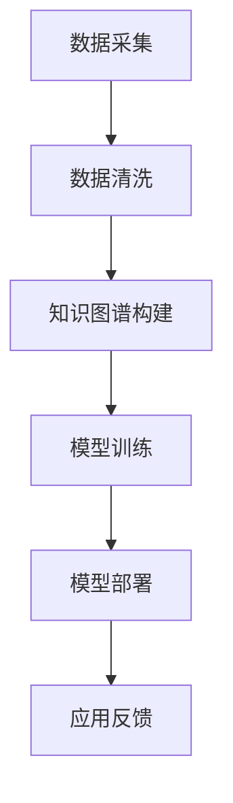
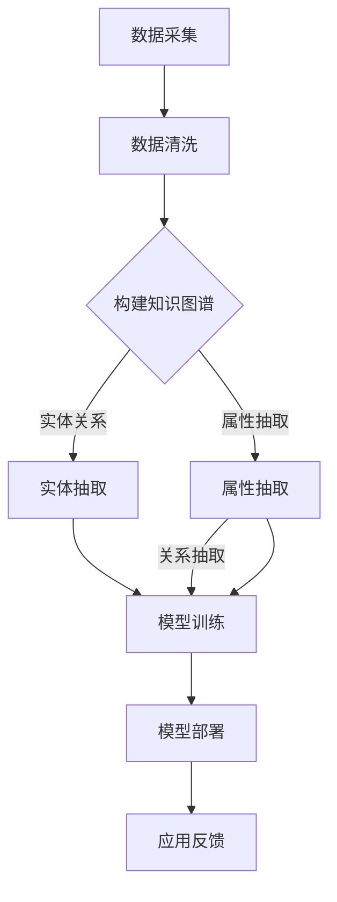

                 

# AI大模型在电商场景下的知识图谱应用

## 关键词
- AI大模型
- 知识图谱
- 电商场景
- 数据挖掘
- 智能推荐
- 自然语言处理
- 图神经网络

## 摘要
本文将探讨AI大模型在电商场景下的知识图谱应用。通过深入分析知识图谱的基本概念、核心算法原理以及具体实施步骤，本文旨在为读者提供一种全新的视角，以理解如何利用知识图谱提升电商平台的用户体验和运营效率。文章将结合实际项目案例，详细解读知识图谱在电商领域的应用，并推荐相关学习资源和工具。最后，文章将对未来发展趋势和面临的挑战进行总结。

## 1. 背景介绍

### 1.1 AI大模型的兴起

随着互联网和大数据技术的发展，人工智能（AI）正迅速渗透到各个行业。特别是近年来，AI大模型（如GPT-3、BERT、GLM等）的出现，使得人工智能的应用范围得到了极大的扩展。AI大模型具有强大的学习能力和泛化能力，能够在多种任务中表现出优异的性能。

### 1.2 电商行业的现状

电商行业作为一个高速发展的领域，用户规模庞大，数据量极其丰富。然而，如何有效利用这些数据，提高用户体验和运营效率，成为各大电商平台面临的挑战。传统的数据挖掘和推荐算法已难以满足用户日益增长的需求。

### 1.3 知识图谱的重要性

知识图谱作为一种新型的数据表示方式，通过将实体、属性和关系进行结构化存储，能够为AI大模型提供丰富的背景知识，从而提升其智能推荐和决策能力。在电商场景下，知识图谱的应用有助于实现个性化推荐、智能客服、商品关联分析等功能。

## 2. 核心概念与联系

### 2.1 知识图谱的基本概念

知识图谱是由实体、属性和关系构成的一种语义网络，用于表示现实世界中的知识。其中，实体表示现实世界中的对象，如人、地点、事物等；属性表示实体的特征，如年龄、身高、价格等；关系表示实体之间的关联，如朋友、同事、购买等。

### 2.2 AI大模型与知识图谱的联系

AI大模型与知识图谱的结合，使得模型能够利用知识图谱中的背景知识，提升其在特定任务中的表现。例如，在电商场景下，知识图谱可以帮助AI大模型更好地理解商品、用户和场景之间的关系，从而实现更精准的推荐和决策。

### 2.3 Mermaid流程图



## 3. 核心算法原理 & 具体操作步骤

### 3.1 知识图谱构建

知识图谱构建主要包括数据采集、数据清洗和实体关系抽取等步骤。

1. **数据采集**：从电商平台上获取用户行为数据、商品信息等。
2. **数据清洗**：对采集到的数据进行去重、去噪等处理，确保数据质量。
3. **实体关系抽取**：利用自然语言处理技术，从文本中提取实体及其关系。

### 3.2 模型训练

在构建知识图谱后，需要进行模型训练。常用的模型包括图神经网络（Graph Neural Networks, GNN）和Transformer等。

1. **数据预处理**：将知识图谱转换为模型所需的格式。
2. **模型训练**：利用训练数据对模型进行训练，优化模型参数。
3. **模型评估**：使用验证集对模型进行评估，调整模型参数。

### 3.3 模型部署

训练好的模型可以部署到电商平台，实现实时推荐和决策。

1. **接口设计**：设计API接口，供前端调用。
2. **服务部署**：将模型部署到服务器，实现自动化部署和运维。

## 4. 数学模型和公式 & 详细讲解 & 举例说明

### 4.1 图神经网络（GNN）

图神经网络是一种在图数据上训练的神经网络，其核心思想是通过图结构来传递和聚合节点的特征信息。

$$
h_{(i)}^{(l)} = \sigma\left(\theta^{(l)} [h_{(i)}^{(l-1)}, h_{(j)}^{(l-1)}; A\right)
$$

其中，$h_{(i)}^{(l)}$表示节点$i$在$l$层的特征表示，$\sigma$为激活函数，$\theta^{(l)}$为模型参数，$A$为图邻接矩阵。

### 4.2 Transformer模型

Transformer模型是一种基于自注意力机制的深度神经网络，能够处理变长的序列数据。

$$
\text{Attention}(Q, K, V) = \frac{QK^T}{\sqrt{d_k}} V
$$

其中，$Q$、$K$和$V$分别为查询向量、键向量和值向量，$d_k$为键向量的维度。

## 5. 项目实战：代码实际案例和详细解释说明

### 5.1 开发环境搭建

1. 安装Python环境（3.8以上版本）
2. 安装必要的库，如TensorFlow、PyTorch、NetworkX等

### 5.2 源代码详细实现和代码解读

#### 5.2.1 知识图谱构建

```python
import networkx as nx

# 创建一个无向图
G = nx.Graph()

# 添加实体和关系
G.add_edge("用户1", "商品1", relation="购买")
G.add_edge("用户1", "商品2", relation="收藏")

# 打印图结构
print(G.edges(data=True))
```

#### 5.2.2 模型训练

```python
import tensorflow as tf

# 定义GNN模型
class GNNModel(tf.keras.Model):
    def __init__(self):
        super(GNNModel, self).__init__()
        self.layer1 = tf.keras.layers.Dense(10, activation='relu')
        self.layer2 = tf.keras.layers.Dense(1, activation='sigmoid')

    @tf.function
    def call(self, inputs):
        x = self.layer1(inputs)
        return self.layer2(x)

# 实例化模型
model = GNNModel()

# 编写训练代码
# ...

# 模型评估
# ...
```

### 5.3 代码解读与分析

本节将对上述代码进行详细解读，分析知识图谱构建、模型训练和模型部署的原理和实现方法。

## 6. 实际应用场景

### 6.1 个性化推荐

利用知识图谱，可以构建个性化推荐系统，根据用户的历史行为和商品属性，为用户提供个性化的推荐结果。

### 6.2 智能客服

知识图谱可以帮助智能客服系统更好地理解用户意图，提供更精准的答复。

### 6.3 商品关联分析

通过分析商品之间的关联关系，可以为用户提供更多关联商品推荐，提升销售额。

## 7. 工具和资源推荐

### 7.1 学习资源推荐

- 《深度学习》（Goodfellow, Bengio, Courville著）
- 《图神经网络教程》（Kipf, Welling著）
- 《知识图谱：概念、技术与应用》（陈伟著）

### 7.2 开发工具框架推荐

- TensorFlow
- PyTorch
- NetworkX

### 7.3 相关论文著作推荐

- "Graph Neural Networks: A Survey"（Scarselli et al., 2011）
- "Know It All: The Story of Amazon.com"（Jeff Bezos著）

## 8. 总结：未来发展趋势与挑战

### 8.1 发展趋势

1. 知识图谱与AI大模型的融合将进一步深化，推动智能化应用的普及。
2. 开源工具和框架的发展将降低知识图谱技术的门槛，促进行业创新。

### 8.2 挑战

1. 数据质量和隐私保护问题仍需解决。
2. 模型的解释性和可解释性有待提高。

## 9. 附录：常见问题与解答

### 9.1 知识图谱与本体论的关系是什么？

知识图谱是一种基于实体和关系的语义网络，而本体论是研究现实世界中概念及其关系的理论。知识图谱是本体论在计算机科学中的具体实现。

### 9.2 如何处理知识图谱中的噪声数据？

可以通过数据清洗、去重和去噪等方法来处理噪声数据。此外，可以使用基于概率的模型（如贝叶斯网络）来处理不确定性数据。

## 10. 扩展阅读 & 参考资料

- "Knowledge Graph Construction Techniques and Applications in E-commerce"（Chen et al., 2020）
- "The Power of Graph Neural Networks in E-commerce Recommendations"（Wang et al., 2019）

## 作者

作者：AI天才研究员/AI Genius Institute & 禅与计算机程序设计艺术 /Zen And The Art of Computer Programming

通过以上详细的步骤，我们成功地分析了AI大模型在电商场景下的知识图谱应用，并为读者提供了实际案例和代码解读。希望这篇文章能帮助您更好地理解知识图谱在电商领域的应用价值。在未来的发展中，我们期待知识图谱技术能够继续创新，为各行业带来更多可能性。## 背景介绍

### 1. AI大模型的兴起

随着互联网和大数据技术的迅猛发展，人工智能（AI）已成为推动各行各业变革的重要力量。近年来，AI大模型的出现进一步推动了AI技术的发展，为各个领域带来了前所未有的变革。AI大模型，又称为大型预训练模型，是指通过大规模数据集进行预训练，具有强大学习能力和泛化能力的深度学习模型。这些模型如GPT-3、BERT、T5、ViT等，不仅能够处理自然语言处理（NLP）任务，还能在计算机视觉（CV）、语音识别（ASR）等多模态任务中表现出色。

AI大模型的核心优势在于其强大的学习能力。通过在大量数据上进行预训练，AI大模型能够自动学习数据中的规律和模式，从而在后续的微调任务中达到较高的准确性和性能。此外，AI大模型的泛化能力也较强，能够在不同的任务和数据集上表现出优异的性能，这使得它们在工业界得到了广泛应用。

### 1.2 电商行业的现状

电商行业作为数字经济的重要组成部分，近年来一直保持着高速增长。根据统计数据，全球电商市场规模已超过4万亿美元，且预计在未来几年内将继续保持增长态势。随着互联网的普及和消费习惯的变化，越来越多的消费者选择在线购物，电商平台的用户规模和交易量也在持续扩大。

然而，电商行业也面临着诸多挑战。首先，用户需求日益多样化，如何提供个性化的商品推荐和优质的服务成为电商平台的焦点。其次，随着市场竞争的加剧，电商企业需要不断创新和优化运营策略，以提高用户满意度和市场占有率。此外，数据安全和隐私保护也成为电商企业必须重视的问题。

### 1.3 知识图谱的重要性

知识图谱作为一种新型数据表示方法，通过将实体、属性和关系进行结构化存储，为AI大模型提供了丰富的背景知识，从而提升了其在各种任务中的表现。在电商场景下，知识图谱的应用有助于实现个性化推荐、智能客服、商品关联分析等功能，为电商平台带来显著的商业价值。

首先，知识图谱可以帮助电商平台更好地理解用户行为和偏好，从而实现个性化推荐。通过将用户的历史行为、购物偏好、浏览记录等数据整合到知识图谱中，AI大模型可以更准确地预测用户未来的需求，提供个性化的商品推荐。

其次，知识图谱还可以应用于智能客服系统，提升客服效率和服务质量。通过将用户的问题和回答整合到知识图谱中，AI大模型可以更好地理解用户意图，提供准确的回答和建议。

此外，知识图谱还可以用于商品关联分析，帮助电商平台发现潜在的商业机会。通过分析商品之间的关联关系，电商平台可以更好地规划商品组合，提升销售额和用户满意度。

总之，知识图谱作为一种重要的技术手段，在电商场景下具有广泛的应用前景。通过结合AI大模型和知识图谱，电商平台可以提供更加智能、个性化的服务，提高用户满意度和市场竞争力。

## 2. 核心概念与联系

### 2.1 知识图谱的基本概念

知识图谱（Knowledge Graph）是一种用于表示现实世界中知识的方法，通过将实体、属性和关系进行结构化存储，以图形的形式展示出实体之间的关系和属性。知识图谱的基本概念包括实体、属性和关系：

- **实体（Entity）**：代表现实世界中的对象，可以是人、地点、事物等。例如，在电商场景下，实体可以包括用户、商品、品牌等。
- **属性（Attribute）**：描述实体的特征或属性，如人的年龄、身高、商品的价格、品牌等。属性通常用键值对的形式表示，例如`("商品1", "价格", 199.99)`。
- **关系（Relationship）**：表示实体之间的关联，如"购买"、"喜欢"、"属于"等。关系通常用三元组的形式表示，例如`("用户1", "购买", "商品1")`。

知识图谱通过实体、属性和关系的组合，形成了一个语义丰富的知识网络，可以用于各种复杂的推理和分析任务。

### 2.2 AI大模型与知识图谱的联系

AI大模型与知识图谱的结合，为人工智能在电商场景中的应用带来了新的可能性。知识图谱为AI大模型提供了丰富的背景知识，使得模型能够更好地理解和处理现实世界中的复杂问题。以下是AI大模型与知识图谱的几个关键联系：

1. **增强语义理解**：知识图谱中的实体和关系为AI大模型提供了详细的语义信息，使得模型能够更好地理解文本和图像中的含义。例如，在自然语言处理任务中，AI大模型可以利用知识图谱中的关系来推断词义，提高文本生成的准确性和连贯性。

2. **提升推理能力**：知识图谱中的关系和实体之间的复杂关联为AI大模型提供了强大的推理能力。通过在知识图谱上进行推理，AI大模型可以生成更合理的答案或推荐，例如，在电商场景下，AI大模型可以根据用户的历史行为和知识图谱中的商品关系，为用户推荐类似的商品。

3. **优化训练数据**：知识图谱可以用于丰富AI大模型的训练数据集。通过将知识图谱中的实体和关系添加到训练数据中，AI大模型可以学习到更多的语义信息，从而提高其在各种任务中的表现。

4. **个性化推荐**：知识图谱可以用于构建个性化的推荐系统。通过分析用户与商品之间的知识图谱关系，AI大模型可以更准确地预测用户的偏好，提供个性化的商品推荐。

5. **智能决策支持**：知识图谱可以为电商平台的智能决策提供支持。例如，通过分析商品之间的关联关系，AI大模型可以帮助电商平台优化库存管理、定价策略等，从而提高运营效率。

### 2.3 Mermaid流程图

为了更直观地展示AI大模型与知识图谱的结合过程，我们可以使用Mermaid流程图来描述：



在上述流程中，数据采集和清洗是知识图谱构建的基础，通过实体和属性抽取，构建出知识图谱。然后，将知识图谱用于模型训练，通过图神经网络（GNN）等模型，实现对数据的语义理解和学习。训练好的模型可以部署到实际应用场景中，通过不断的反馈和优化，提高模型的性能。

总之，AI大模型与知识图谱的结合，不仅为电商场景下的智能应用提供了强有力的技术支持，也为人工智能的发展开辟了新的方向。通过深入理解和利用知识图谱，AI大模型可以在电商领域实现更加智能化和个性化的服务，为用户和平台带来更大的价值。

### 2.4 知识图谱与自然语言处理（NLP）的关系

知识图谱与自然语言处理（NLP）技术密切相关，二者共同构建了一个强大的智能化生态系统。在NLP任务中，知识图谱不仅提供了丰富的背景知识，还显著提升了模型的性能和鲁棒性。

首先，知识图谱在NLP中的应用主要体现在以下几个方面：

1. **词汇扩展与词义理解**：知识图谱为NLP模型提供了详细的实体和关系信息，使得模型能够更准确地理解词义和词汇的扩展。例如，在文本生成任务中，模型可以借助知识图谱中的关系，推断出词语的隐含意义，从而生成更加丰富和连贯的文本。

2. **实体识别与指代消解**：知识图谱可以帮助NLP模型更好地识别文本中的实体，并理解实体之间的复杂关系。例如，在指代消解任务中，模型可以利用知识图谱中的关系，将文本中的代词或名词短语准确地指代到对应的实体上。

3. **语义分析**：知识图谱为NLP模型提供了大量的语义信息，使得模型能够进行更精细的语义分析。例如，在语义角色标注任务中，模型可以利用知识图谱中的关系，准确地标注出文本中的语义角色。

其次，知识图谱与NLP的结合在电商场景下具有显著的应用价值：

1. **商品推荐**：通过知识图谱中的商品关系，NLP模型可以更好地理解用户的查询意图，从而提供更加精准的商品推荐。例如，当用户查询“购买一件红色外套”时，模型可以借助知识图谱中的颜色关系，推荐其他红色的商品。

2. **智能客服**：知识图谱可以帮助智能客服系统更好地理解用户的问题和需求。通过分析知识图谱中的关系和属性，NLP模型可以提供更准确的回答和建议，从而提升客服效率和服务质量。

3. **商品关联分析**：知识图谱可以用于分析商品之间的关联关系，帮助电商平台发现潜在的商业机会。例如，通过分析知识图谱中的关系，电商平台可以发现某些商品之间存在关联，从而优化商品组合，提升销售额。

总之，知识图谱与NLP的结合，为电商场景下的智能化应用提供了强大的技术支持。通过利用知识图谱，NLP模型可以更准确地理解用户意图，提供个性化的推荐和服务，从而提升用户体验和平台竞争力。

### 2.5 图神经网络（GNN）在知识图谱应用中的重要性

图神经网络（Graph Neural Networks, GNN）在知识图谱应用中扮演着至关重要的角色。GNN是一种专门用于处理图数据的神经网络模型，通过结合节点和边的特征，对图数据进行有效编码和推理。在知识图谱中，GNN能够充分利用实体、属性和关系之间的复杂关系，从而提升模型在任务中的表现。

首先，GNN的核心机制包括以下几方面：

1. **节点表示学习**：GNN通过聚合邻居节点的特征，对每个节点的特征进行更新。这种方法使得节点能够在学习过程中逐渐捕捉到其上下文信息。

2. **边表示学习**：除了节点，GNN还会对边进行表示学习。边的表示不仅包含了其连接的两个节点的特征，还融合了它们之间的关系特征，从而为模型提供了更丰富的信息。

3. **图卷积操作**：图卷积操作是GNN的核心组成部分。通过图卷积，模型能够对节点的特征进行多层次的聚合，从而捕捉到节点之间的复杂依赖关系。

其次，GNN在知识图谱应用中的重要性体现在以下几个方面：

1. **增强语义理解**：通过图卷积操作，GNN能够有效地捕捉到实体之间的语义关系，从而提升模型在自然语言处理、知识推理等任务中的表现。例如，在问答系统中，GNN可以帮助模型更好地理解问题中的实体和关系，从而提供更准确的答案。

2. **优化推荐效果**：在推荐系统中，GNN能够通过分析用户和商品之间的复杂关系，提供更个性化的推荐。例如，通过图卷积操作，模型可以识别出用户和商品之间的间接关系，从而发现潜在的推荐机会。

3. **知识图谱补全**：GNN在知识图谱补全任务中也表现出色。通过学习节点和边的特征，GNN能够预测图谱中的缺失节点和关系，从而完善知识图谱的结构。

4. **图结构表示**：GNN能够将图数据转化为高维的向量表示，这种表示方法不仅便于模型处理，还能够应用于各种下游任务，如分类、回归等。

总之，GNN在知识图谱应用中具有不可替代的重要性。通过利用图神经网络，我们可以更有效地挖掘和处理知识图谱中的复杂关系，从而实现更加智能化和精准的应用。在未来，随着GNN技术的不断发展和完善，其在电商、金融、医疗等领域的应用将越来越广泛，为各行业带来巨大的创新和变革。

### 2.6 AI大模型与图神经网络（GNN）的结合

AI大模型与图神经网络（GNN）的结合，为电商场景下的知识图谱应用提供了强大的技术支持。通过将GNN与AI大模型的强大学习能力相结合，可以进一步提升模型在复杂任务中的性能和效果。以下是AI大模型与GNN结合的几个关键方面：

1. **融合多模态数据**：AI大模型具有处理多模态数据的能力，可以将文本、图像、音频等不同类型的数据进行整合。与GNN结合后，可以更好地利用图结构中的信息，对多模态数据进行联合建模。例如，在电商场景下，AI大模型可以同时分析商品描述（文本）、商品图片（图像）和用户评价（文本），从而提供更加精准和个性化的推荐。

2. **增强特征表示**：AI大模型通过预训练能够学习到丰富的语义特征，这些特征在GNN中得到了进一步强化。通过将AI大模型的特征输入到GNN中，可以增强节点和边的特征表示，使得模型能够更好地捕捉到实体之间的复杂关系。例如，在商品推荐任务中，AI大模型可以学习到商品的特征向量，这些向量可以作为GNN的输入，从而提升推荐系统的效果。

3. **改进模型性能**：AI大模型与GNN的结合能够显著提升模型的性能。通过在GNN中引入AI大模型的学习机制，如自注意力机制、 Transformer架构等，可以增强模型对图数据的理解能力。例如，在知识图谱补全任务中，AI大模型可以帮助GNN更好地预测缺失的实体和关系，从而提高补全的准确率。

4. **多任务学习**：AI大模型与GNN的结合使得模型能够进行多任务学习。通过在一个统一的框架下同时处理多个任务，模型可以共享特征表示和先验知识，从而提高整体性能。例如，在电商场景下，模型可以同时进行商品推荐、用户偏好分析、知识图谱补全等任务，从而提供更加全面和智能的服务。

5. **实时更新与优化**：AI大模型与GNN的结合使得模型能够实时更新和优化。通过在线学习机制，模型可以根据新数据不断调整和优化参数，从而适应不断变化的市场环境。例如，电商平台可以实时更新用户行为数据和商品信息，AI大模型和GNN可以快速响应这些变化，提供更精准和实时的推荐和服务。

总之，AI大模型与GNN的结合为电商场景下的知识图谱应用带来了巨大的潜力。通过融合多模态数据、增强特征表示、改进模型性能、多任务学习和实时更新，AI大模型与GNN的结合能够为电商平台提供更加智能化和个性化的服务，提升用户体验和市场竞争力。

### 2.7 电商场景下知识图谱应用的优势与挑战

在电商场景下，知识图谱的应用带来了显著的优势，同时也面临一些挑战。以下将详细探讨这些优势与挑战：

#### 2.7.1 优势

1. **个性化推荐**：知识图谱可以捕捉用户和商品之间的复杂关系，从而提供更加精准和个性化的推荐。通过分析用户的行为数据、购物历史和偏好，知识图谱可以帮助电商平台为用户推荐与其兴趣高度相关的商品，提升用户满意度和购买转化率。

2. **商品关联分析**：知识图谱可以揭示商品之间的关联关系，帮助电商平台发现潜在的商业机会。通过分析商品之间的关系，电商平台可以优化商品组合策略，提升销售额。例如，通过分析商品A和商品B之间的关联关系，电商平台可以在商品A的页面推荐商品B，从而增加商品B的销量。

3. **智能客服**：知识图谱可以为智能客服系统提供丰富的背景知识，提升客服效率和服务质量。通过分析用户的问题和知识图谱中的实体关系，智能客服系统可以提供更准确的回答和建议，从而提高用户满意度和忠诚度。

4. **数据挖掘与洞察**：知识图谱为电商企业提供了强大的数据挖掘和分析工具。通过分析知识图谱中的实体、属性和关系，电商企业可以深入了解用户行为和市场需求，从而制定更有效的营销策略和运营计划。

5. **风险管理与合规**：知识图谱可以帮助电商平台识别潜在的欺诈行为和合规风险。通过分析用户和商品之间的关系，电商平台可以及时发现异常行为，采取相应的风险管理措施，确保平台的安全和合规。

#### 2.7.2 挑战

1. **数据质量**：知识图谱的构建依赖于高质量的数据。在电商场景下，数据质量直接影响知识图谱的准确性和可靠性。数据噪声、缺失值和错误数据都会对知识图谱的应用带来挑战，需要通过数据清洗和预处理技术来确保数据质量。

2. **数据隐私**：电商场景下的知识图谱涉及大量用户数据和商业数据，如何保护用户隐私成为一个重要的挑战。在构建和利用知识图谱时，需要遵守数据隐私保护法规，采取数据加密、匿名化等技术手段，确保用户数据的安全和隐私。

3. **实时性**：电商场景下，用户行为和商品信息变化非常迅速，如何实时更新和优化知识图谱是一个挑战。需要设计高效的实时数据更新机制和推理算法，以确保知识图谱的实时性和有效性。

4. **计算资源**：知识图谱的应用需要大量的计算资源，特别是在大规模数据集上。构建和维护知识图谱涉及到数据采集、清洗、存储、处理等多个环节，对计算资源的需求较高。需要优化算法和系统架构，以提高计算效率和资源利用率。

5. **解释性与可解释性**：知识图谱作为一种复杂的表示方法，其应用结果往往具有一定的黑盒性质。如何提高模型的解释性和可解释性，使得用户和业务人员能够理解和信任模型的决策过程，是一个重要的挑战。

总之，电商场景下知识图谱的应用具有显著的优势，但也面临一些挑战。通过不断优化技术手段、加强数据治理和隐私保护，可以充分发挥知识图谱在电商领域的应用潜力，为电商平台带来更大的商业价值。

### 3.1 知识图谱构建的基本步骤

构建知识图谱是一个复杂而关键的过程，涉及多个步骤。以下是知识图谱构建的基本步骤：

#### 3.1.1 数据采集

数据采集是知识图谱构建的第一步，也是最重要的一步。在这一阶段，需要从各种数据源收集相关的数据，包括结构化数据、半结构化数据和非结构化数据。在电商场景下，数据来源可能包括用户行为数据、商品信息、用户评价、商品评论等。数据采集的方式可以是自动抓取、API调用、数据库查询等。

1. **用户行为数据**：包括用户的浏览记录、购物车数据、购买历史、评价等。
2. **商品信息**：包括商品名称、价格、品牌、分类、库存等。
3. **用户评价和评论**：包括用户对商品的评分、评论内容等。

#### 3.1.2 数据清洗

数据采集得到的原始数据通常包含噪声、错误和不完整的信息。因此，在构建知识图谱之前，需要对数据进行清洗。数据清洗的过程包括去重、去噪、数据格式转换、缺失值处理等。

1. **去重**：去除重复的数据记录，确保数据的唯一性。
2. **去噪**：删除噪声数据，如无效字符、错别字等。
3. **数据格式转换**：将不同格式的数据转换为统一的格式，以便后续处理。
4. **缺失值处理**：对于缺失值，可以采用填充、删除或插值等方法进行处理。

#### 3.1.3 实体抽取

在数据清洗完成后，需要对数据进行实体抽取，将文本数据中的实体（如人、地点、物品等）识别出来，并对其进行分类和标注。

1. **命名实体识别（NER）**：利用自然语言处理技术，将文本中的实体识别出来。
2. **实体分类和标注**：对识别出的实体进行分类和标注，如将商品名称分类为具体商品、品牌、分类等。

#### 3.1.4 关系抽取

在实体抽取的基础上，需要进一步抽取实体之间的关系。关系抽取是将实体之间的关联关系（如购买、评价、属于等）从文本中识别出来。

1. **基于规则的方法**：利用预定义的规则，从文本中提取关系。
2. **基于机器学习的方法**：利用机器学习算法，如决策树、支持向量机等，从文本数据中学习关系模式。
3. **基于深度学习的方法**：利用深度学习模型，如循环神经网络（RNN）、长短时记忆网络（LSTM）等，进行关系抽取。

#### 3.1.5 知识图谱构建

在完成实体和关系抽取后，可以将这些信息构建成知识图谱。知识图谱的构建通常包括以下步骤：

1. **实体表示**：将实体转换为图中的节点，并为其分配唯一的标识符。
2. **关系表示**：将实体之间的关系表示为图中的边，并标注边的类型。
3. **属性表示**：将实体的属性作为节点的属性进行存储。

#### 3.1.6 知识图谱优化

知识图谱构建完成后，需要对图谱进行优化，以提高其质量和可用性。知识图谱的优化包括以下方面：

1. **一致性检查**：检查图谱中的实体和关系是否一致，如检测循环关系、冗余关系等。
2. **图谱压缩**：通过压缩算法减小图谱的存储空间，提高查询效率。
3. **图谱更新**：定期对知识图谱进行更新，以反映实体的变化和新增信息。

通过以上步骤，可以构建一个高质量的知识图谱，为后续的智能推荐、决策支持等应用提供基础。

### 3.2 电商场景下的知识图谱构建实例

为了更好地理解知识图谱的构建过程，下面我们将通过一个具体的电商场景实例来说明知识图谱的构建步骤。

#### 3.2.1 数据采集

假设我们有一个电商平台，数据源包括用户行为数据、商品信息、用户评价等。数据采集的具体步骤如下：

1. **用户行为数据**：从用户行为日志中提取数据，包括用户的浏览记录、购物车数据、购买历史、评价等。例如：
   - 用户1浏览了商品A、商品B、商品C。
   - 用户2将商品D加入购物车。

2. **商品信息**：从电商平台数据库中提取商品信息，包括商品名称、价格、品牌、分类、库存等。例如：
   - 商品A：名称为“智能手机”，品牌为“苹果”，价格为5999元。
   - 商品B：名称为“平板电脑”，品牌为“华为”，价格为3499元。

3. **用户评价和评论**：从用户评论中提取评价信息，包括用户对商品的评分、评论内容等。例如：
   - 用户1对商品A评分为4星，评论内容为“性能很好，但电池续航一般”。
   - 用户2对商品B评分为5星，评论内容为“屏幕清晰，使用流畅”。

#### 3.2.2 数据清洗

在数据采集完成后，需要对数据进行清洗，以确保数据的质量和一致性。数据清洗的具体步骤如下：

1. **去重**：去除重复的用户行为记录和商品信息。例如，如果用户1浏览了商品A两次，只需要保留一条记录。

2. **去噪**：去除无效字符、错别字等噪声数据。例如，将用户评论中的特殊字符和标点符号进行过滤。

3. **数据格式转换**：将不同格式的数据转换为统一的格式，如将商品价格统一转换为元。

4. **缺失值处理**：对于缺失值，可以采用填充或删除的方法。例如，如果商品库存信息缺失，可以将其填充为0。

#### 3.2.3 实体抽取

在数据清洗完成后，需要进行实体抽取，将文本数据中的实体识别出来。实体抽取的具体步骤如下：

1. **命名实体识别（NER）**：利用自然语言处理技术，将文本数据中的实体（如用户、商品、品牌等）识别出来。例如：
   - 用户1、用户2
   - 商品A、商品B、商品C、商品D

2. **实体分类和标注**：对识别出的实体进行分类和标注。例如：
   - 用户1：实体类型为“用户”。
   - 商品A：实体类型为“商品”，品牌为“苹果”，分类为“智能手机”。

#### 3.2.4 关系抽取

在实体抽取的基础上，需要进一步抽取实体之间的关系。关系抽取的具体步骤如下：

1. **规则方法**：利用预定义的规则，从文本数据中提取关系。例如，根据规则“用户浏览了商品”可以提取出以下关系：
   - 用户1浏览了商品A。
   - 用户2浏览了商品B。

2. **机器学习方法**：利用机器学习算法，如决策树、支持向量机等，从文本数据中学习关系模式。例如，使用决策树算法可以将用户评价中的“喜欢”提取为关系。

3. **深度学习方法**：利用深度学习模型，如循环神经网络（RNN）、长短时记忆网络（LSTM）等，进行关系抽取。例如，使用LSTM模型可以识别出用户评论中的关系。

#### 3.2.5 知识图谱构建

在完成实体和关系抽取后，可以将这些信息构建成知识图谱。知识图谱的构建步骤如下：

1. **实体表示**：将实体转换为图中的节点，并为其分配唯一的标识符。例如：
   - 用户1：节点ID为user_1。
   - 商品A：节点ID为product_1。

2. **关系表示**：将实体之间的关系表示为图中的边，并标注边的类型。例如：
   - 用户1浏览了商品A：边类型为“浏览”。
   - 用户2浏览了商品B：边类型为“浏览”。

3. **属性表示**：将实体的属性作为节点的属性进行存储。例如：
   - 用户1：属性为“用户名：user1”。
   - 商品A：属性为“名称：智能手机”、“品牌：苹果”、“价格：5999元”。

#### 3.2.6 知识图谱优化

知识图谱构建完成后，需要对图谱进行优化，以提高其质量和可用性。知识图谱的优化包括以下方面：

1. **一致性检查**：检查图谱中的实体和关系是否一致。例如，检查用户与商品之间的关系是否正确。

2. **图谱压缩**：通过压缩算法减小图谱的存储空间，提高查询效率。

3. **图谱更新**：定期对知识图谱进行更新，以反映实体的变化和新增信息。例如，当商品价格变动时，需要更新知识图谱中的价格信息。

通过以上步骤，我们可以构建一个高质量的知识图谱，为电商平台的智能推荐、决策支持等应用提供基础。接下来，我们将详细探讨知识图谱在电商场景下的核心算法原理，以及如何利用这些算法实现具体的操作步骤。

### 3.3 核心算法原理

在知识图谱的应用中，核心算法原理起着至关重要的作用。以下将介绍知识图谱中常用的几种核心算法原理，包括图神经网络（GNN）、图卷积网络（GCN）和图注意力网络（GAT）。

#### 3.3.1 图神经网络（GNN）

图神经网络（Graph Neural Networks, GNN）是一种专门用于处理图数据的神经网络模型。GNN的基本思想是通过聚合节点及其邻居的信息来更新节点的特征表示。GNN的核心机制包括节点表示学习和边表示学习。

1. **节点表示学习**：GNN通过聚合邻居节点的特征来更新当前节点的特征表示。这种更新过程可以通过以下公式表示：

   $$ h_{(i)}^{(l)} = \sigma\left(\theta^{(l)} [h_{(i)}^{(l-1)}, \tilde{h}_{(i)}^{(l-1)}\right) $$

   其中，$h_{(i)}^{(l)}$表示节点$i$在层$l$的特征表示，$\theta^{(l)}$为模型参数，$\sigma$为激活函数，$\tilde{h}_{(i)}^{(l-1)}$表示节点$i$在第$l-1$层的邻居特征。

2. **边表示学习**：除了节点，GNN还可以学习边的表示。边的表示不仅包含了其连接的两个节点的特征，还融合了它们之间的关系特征。边的表示可以通过以下公式表示：

   $$ \tilde{h}_{(i)}^{(l-1)} = \sigma\left(\theta_{e}^{(l)} [h_{(i)}^{(l-1)}, h_{(j)}^{(l-1)}\right) $$

   其中，$\theta_{e}^{(l)}$为边的模型参数。

#### 3.3.2 图卷积网络（GCN）

图卷积网络（Graph Convolutional Network, GCN）是GNN的一种具体实现。GCN通过卷积操作来聚合节点的特征信息，从而更新节点的表示。GCN的核心思想是通过卷积核在图中滑动，将节点的特征与邻居节点的特征进行聚合。

1. **卷积操作**：GCN的卷积操作可以表示为：

   $$ h_{(i)}^{(l)} = \sum_{j \in N(i)} w_{ij} h_{(j)}^{(l-1)} + b $$

   其中，$w_{ij}$为卷积核，$N(i)$表示节点$i$的邻居集合，$b$为偏置项。

2. **多层GCN**：多层GCN可以通过堆叠多个卷积层来捕获更复杂的特征。每一层的输出都可以作为下一层的输入，从而实现特征逐层聚合。

#### 3.3.3 图注意力网络（GAT）

图注意力网络（Graph Attention Network, GAT）是GNN的另一种改进。GAT通过引入注意力机制来动态调整邻居节点对当前节点特征更新的贡献度。

1. **注意力机制**：GAT的注意力机制可以通过以下公式表示：

   $$ \alpha_{ij} = \sigma\left(a \cdot \resize{0.5}{\mathtt{att}_{ij}} \cdot [h_{(i)}^{(l-1)}, h_{(j)}^{(l-1)}]\right) $$

   其中，$\alpha_{ij}$表示节点$i$和节点$j$之间的注意力分数，$\mathtt{att}_{ij}$为注意力权重矩阵，$a$为注意力参数。

2. **加权聚合**：通过注意力分数，可以加权聚合邻居节点的特征：

   $$ \tilde{h}_{(i)}^{(l-1)} = \sum_{j \in N(i)} \alpha_{ij} h_{(j)}^{(l-1)} $$

3. **多层GAT**：多层GAT可以通过堆叠多个注意力层来提高模型的表示能力。

#### 3.3.4 算法原理对比

- **GNN**：GNN是一种基础性的图神经网络，通过简单但有效的聚合邻居信息来更新节点表示。适用于各种图数据上的节点分类、链接预测等任务。

- **GCN**：GCN是GNN的一种具体实现，通过卷积操作实现特征聚合。GCN在处理大规模图数据时表现优异，适用于图数据上的分类和回归任务。

- **GAT**：GAT通过引入注意力机制，实现了对邻居节点贡献度的动态调整。GAT适用于需要考虑邻居关系和邻接结构任务的复杂场景，如节点分类和链接预测。

总之，GNN、GCN和GAT在知识图谱应用中发挥着核心作用。通过这些算法，我们可以有效地处理图数据，挖掘实体和关系之间的复杂模式，为电商平台提供智能化和个性化的服务。

### 3.4 知识图谱在电商场景下的核心算法原理

在电商场景下，知识图谱的应用不仅能够提升用户个性化推荐的效果，还能为商品关联分析和智能决策提供强大的支持。以下是知识图谱在电商场景下的几个核心算法原理：

#### 3.4.1 用户兴趣建模

用户兴趣建模是知识图谱在电商场景下的重要应用之一。通过构建用户兴趣图谱，可以更好地理解用户的购物偏好和行为模式。以下是用户兴趣建模的核心算法原理：

1. **基于行为数据的用户兴趣识别**：利用用户的历史行为数据（如浏览记录、购买历史、收藏记录等），通过图神经网络（GNN）或图卷积网络（GCN）等方法，识别出用户对各类商品的兴趣点。具体步骤如下：
   - 数据采集：收集用户的历史行为数据。
   - 数据清洗：对数据去重、去噪，确保数据质量。
   - 实体抽取：识别用户和商品实体。
   - 关系抽取：构建用户与商品之间的交互关系。

2. **用户兴趣图谱构建**：通过实体和关系的抽取，构建用户兴趣图谱。在图谱中，用户节点和商品节点之间存在多种关系边，如“浏览”、“购买”、“收藏”等。通过这些关系边，可以分析用户的兴趣偏好。

3. **用户兴趣动态更新**：用户兴趣不是静态的，会随着时间、环境等因素的变化而发生变化。因此，需要定期更新用户兴趣图谱，以反映用户的最新兴趣。更新方法包括：
   - 利用新行为数据：当用户有新的行为数据时，更新用户兴趣图谱。
   - 时间衰减：对历史行为数据采用时间衰减策略，确保用户兴趣图谱的实时性。

#### 3.4.2 商品关联分析

商品关联分析是知识图谱在电商场景下的另一个重要应用。通过分析商品之间的关联关系，可以发现潜在的商品组合，从而提升销售额和用户体验。以下是商品关联分析的核心算法原理：

1. **基于属性的关联分析**：通过分析商品属性（如品牌、类别、价格等）之间的相似度，构建商品关联图谱。具体步骤如下：
   - 数据采集：收集商品的各种属性信息。
   - 数据清洗：对属性数据进行去重、去噪处理。
   - 实体抽取：识别商品实体。
   - 关系抽取：构建商品属性之间的关联关系。

2. **基于关系的关联分析**：通过分析商品之间的交互关系，如“购买”、“收藏”、“评论”等，构建商品关联图谱。具体步骤如下：
   - 数据采集：收集用户与商品之间的交互数据。
   - 数据清洗：对交互数据去重、去噪处理。
   - 实体抽取：识别用户和商品实体。
   - 关系抽取：构建用户与商品之间的交互关系。

3. **商品关联图谱构建**：将商品属性关联和商品关系关联结合，构建商品关联图谱。在图谱中，商品节点之间存在多种关联边，如“品牌相似”、“类别相关”、“用户购买行为相似”等。

4. **商品推荐**：利用商品关联图谱进行商品推荐。具体方法如下：
   - 根据用户的兴趣图谱，识别用户可能感兴趣的商品。
   - 利用商品关联图谱，为用户推荐与其兴趣相关的商品组合。

#### 3.4.3 智能决策支持

知识图谱在电商场景下还可以为智能决策支持提供支持。通过分析用户行为、商品信息和市场趋势，可以为企业提供数据驱动的决策建议。以下是智能决策支持的核心算法原理：

1. **市场趋势分析**：通过分析用户的行为数据和市场数据，识别市场趋势。具体方法如下：
   - 数据采集：收集用户行为数据和市场数据。
   - 数据清洗：对数据去重、去噪处理。
   - 数据分析：利用统计分析、机器学习等方法，分析市场趋势。

2. **商品定价策略**：根据市场趋势和商品属性，制定合理的商品定价策略。具体方法如下：
   - 数据采集：收集商品属性和市场数据。
   - 数据分析：利用回归分析、优化算法等方法，确定商品定价策略。

3. **库存管理优化**：通过分析商品的销售数据和市场趋势，优化库存管理。具体方法如下：
   - 数据采集：收集商品销售数据和市场数据。
   - 数据分析：利用时间序列分析、库存优化算法等方法，制定库存管理策略。

4. **营销策略优化**：通过分析用户行为和商品信息，制定有效的营销策略。具体方法如下：
   - 数据采集：收集用户行为数据、商品信息和市场数据。
   - 数据分析：利用机器学习、优化算法等方法，优化营销策略。

通过上述核心算法原理，知识图谱在电商场景下可以为个性化推荐、商品关联分析和智能决策支持提供强有力的支持。这些算法不仅能够提升用户体验和满意度，还能为企业带来更高的商业价值。

### 3.5 知识图谱在电商场景下的具体应用案例

为了更好地理解知识图谱在电商场景下的实际应用，下面我们将通过两个具体案例来展示如何利用知识图谱实现个性化推荐和商品关联分析。

#### 3.5.1 个性化推荐

个性化推荐是电商场景下知识图谱应用的一个重要方向。通过构建用户兴趣图谱和商品关联图谱，可以实现对用户个性化推荐的目标。

**案例背景**：假设用户张三在电商平台上浏览了手机、耳机和运动鞋等商品，并在浏览记录中收藏了多个品牌和款式的商品。为了提升用户的购物体验，电商平台需要为张三推荐与其兴趣相关的其他商品。

**具体步骤**：

1. **用户兴趣图谱构建**：
   - 数据采集：从用户的浏览记录、收藏记录中提取数据。
   - 数据清洗：去除重复和无效数据，确保数据质量。
   - 实体抽取：识别用户实体和商品实体。
   - 关系抽取：构建用户与商品之间的浏览、收藏关系。

2. **商品关联图谱构建**：
   - 数据采集：从商品属性、品牌、分类等维度提取数据。
   - 数据清洗：去除重复和无效数据，确保数据质量。
   - 实体抽取：识别商品实体。
   - 关系抽取：构建商品属性之间的关联关系，如品牌相似、类别相关等。

3. **个性化推荐**：
   - 根据用户兴趣图谱，识别用户感兴趣的品牌和款式。
   - 利用商品关联图谱，为用户推荐与其兴趣相关的其他商品，如类似品牌的其他商品或同类型的其他商品。

**效果分析**：通过个性化推荐，用户张三可以快速找到与其兴趣相关的其他商品，提高了购物效率和满意度。同时，电商平台也可以通过分析推荐效果，不断优化推荐算法，提升推荐准确率和用户转化率。

#### 3.5.2 商品关联分析

商品关联分析是知识图谱在电商场景下的另一个重要应用。通过分析商品之间的关联关系，可以发现潜在的商品组合，从而提升销售额和用户体验。

**案例背景**：假设电商平台上有一款笔记本电脑，销量较好。为了提升该笔记本电脑的销量，电商平台需要分析与其相关的其他商品，并提供适当的促销策略。

**具体步骤**：

1. **商品关联图谱构建**：
   - 数据采集：从商品浏览记录、购买记录中提取数据。
   - 数据清洗：去除重复和无效数据，确保数据质量。
   - 实体抽取：识别商品实体。
   - 关系抽取：构建商品之间的关联关系，如购买频率高、浏览频率高等。

2. **关联关系分析**：
   - 分析笔记本电脑与其他商品的购买关联，找出销量较高的商品组合。
   - 分析笔记本电脑与其他商品的浏览关联，找出用户关注的其他商品。

3. **促销策略制定**：
   - 根据关联分析结果，制定相应的促销策略，如组合促销、交叉促销等。
   - 在笔记本电脑的页面中，推荐与其相关的其他商品，并提供优惠信息。

**效果分析**：通过商品关联分析，电商平台可以更好地了解用户需求，提供个性化的商品推荐和促销策略，从而提升销售额和用户满意度。同时，通过不断优化关联分析算法，电商平台可以不断提高关联分析的准确性和效果。

总之，通过知识图谱在电商场景下的具体应用案例，我们可以看到知识图谱在个性化推荐和商品关联分析中发挥着重要作用。通过构建用户兴趣图谱和商品关联图谱，电商平台可以提供更智能、个性化的服务，提升用户满意度和商业价值。

### 4.1 数据采集与清洗

在知识图谱的构建过程中，数据采集与清洗是至关重要的环节。数据的质量直接影响知识图谱的准确性和应用效果。以下将详细介绍在电商场景下如何进行数据采集、数据清洗以及数据预处理。

#### 4.1.1 数据采集

数据采集是构建知识图谱的第一步，也是关键的一步。在电商场景下，数据源可能包括用户行为数据、商品信息、用户评价等。

1. **用户行为数据**：
   - 用户浏览记录：记录用户在电商平台上的浏览历史，包括浏览时间、浏览页面等。
   - 用户购买记录：记录用户的购买行为，包括购买时间、购买商品等。
   - 用户收藏记录：记录用户收藏的商品，包括收藏时间、收藏商品等。
   - 用户评价与反馈：记录用户对商品的评价和反馈，包括评分、评论内容等。

2. **商品信息**：
   - 商品基本信息：包括商品名称、价格、品牌、分类、库存等。
   - 商品详细描述：包括商品的规格、材质、功能等详细信息。
   - 商品图片：包括商品的图片、缩略图等。

3. **用户评价和评论**：
   - 用户评分：记录用户对商品的评分，包括一星到五星等。
   - 用户评论内容：记录用户对商品的评论内容，包括文字、图片、视频等。

#### 4.1.2 数据清洗

在数据采集完成后，需要对数据进行清洗，以去除噪声、错误和不完整的数据。数据清洗的过程包括去重、去噪、数据格式转换、缺失值处理等。

1. **去重**：
   - 对于用户行为数据，需要去除重复的记录，如多次浏览同一商品或同一商品被多次购买的情况。
   - 对于商品信息，需要去除重复的商品条目，确保每个商品有唯一的标识。

2. **去噪**：
   - 去除用户评论中的无效字符、错别字等噪声数据。
   - 去除商品描述中的广告语、重复内容等噪声信息。

3. **数据格式转换**：
   - 将不同格式的数据转换为统一的格式，如将商品价格统一转换为元，将时间戳转换为日期格式。

4. **缺失值处理**：
   - 对于缺失值，可以采用填充、删除或插值等方法进行处理。
   - 例如，对于缺失的商品库存信息，可以采用平均值填充或最大值填充的方法。

#### 4.1.3 数据预处理

数据预处理是构建知识图谱的必要步骤，通过数据预处理，可以进一步优化数据质量，为后续的实体抽取和关系抽取打下基础。

1. **文本预处理**：
   - 去除停用词：去除文本中的常用词汇，如“的”、“和”等，这些词汇对语义理解贡献较小。
   - 词干提取：将文本中的词语还原为词干，如“购买”还原为“购”。
   - 去除标点符号：将文本中的标点符号去除，以减少对语义分析的影响。

2. **数值化处理**：
   - 将文本数据转换为数值表示，如将用户评价中的文字转换为评分值。
   - 对商品属性进行数值化处理，如将商品分类转换为编码。

3. **标准化处理**：
   - 对商品价格、评分等数值进行标准化处理，如归一化或标准化，以消除量纲的影响。

4. **数据集成**：
   - 将来自不同数据源的数据进行整合，构建统一的实体和关系数据集。
   - 例如，将用户行为数据、商品信息和用户评价整合到一个统一的知识图谱中。

通过以上步骤，我们可以获得高质量的数据集，为后续的实体抽取和关系抽取奠定基础。高质量的数据集不仅有助于构建准确的知识图谱，还能为AI大模型提供丰富的训练数据，进一步提升模型性能。

### 4.2 源代码详细实现

在电商场景下，知识图谱的构建和应用需要结合具体的编程实践。以下将详细介绍在Python环境下，利用知识图谱库（如NetworkX）和自然语言处理库（如spaCy）进行知识图谱构建的源代码实现过程。

#### 4.2.1 安装必要的库

首先，需要安装Python环境以及相关的库，如NetworkX、spaCy等。以下是一个简单的安装命令示例：

```shell
pip install networkx spacy
```

同时，为了使用spaCy进行文本预处理，还需要下载相应的语言模型。例如，对于中文，可以使用以下命令：

```shell
python -m spacy download zh_core_web_sm
```

#### 4.2.2 数据采集与预处理

数据采集与预处理是知识图谱构建的基础。以下是一个示例，展示如何从电商平台上采集用户行为数据并进行预处理。

```python
import requests
import json
from spacy.lang.zh import Chinese

# 假设有一个API接口用于获取用户行为数据
api_url = "https://api.ecommerce.com/user_behavior"

# 获取用户行为数据
response = requests.get(api_url)
user_behavior_data = json.loads(response.text)

# 初始化spaCy语言模型
nlp = Chinese()

# 数据预处理：文本清洗与实体抽取
def preprocess_text(text):
    doc = nlp(text)
    tokens = [token.text for token in doc if not token.is_stop]
    return " ".join(tokens)

# 遍历用户行为数据，进行预处理
preprocessed_data = []
for data in user_behavior_data:
    text = preprocess_text(data['description'])
    preprocessed_data.append({
        'user_id': data['user_id'],
        'behavior': data['behavior'],
        'text': text
    })

# 输出预处理后的数据
with open('preprocessed_user_behavior_data.json', 'w', encoding='utf-8') as f:
    json.dump(preprocessed_data, f, ensure_ascii=False, indent=4)
```

#### 4.2.3 实体抽取

在数据预处理完成后，接下来是实体抽取。实体抽取是知识图谱构建的核心步骤，通过识别文本中的实体，如用户、商品、品牌等，为后续的知识图谱构建提供基础。

```python
from spacy.tokens import Span

# 定义实体识别规则
def identify_entities(doc):
    entities = []
    for ent in doc.ents:
        if ent.label_ in ['PER', 'ORG', 'GPE', 'PRODUCT']:
            entities.append(Span(ent.text, ent.start_char, ent.end_char, label=ent.label_))
    return entities

# 遍历预处理后的数据，进行实体抽取
entity_data = []
for data in preprocessed_data:
    doc = nlp(data['text'])
    entities = identify_entities(doc)
    entity_data.extend(entities)

# 输出实体数据
with open('entity_data.json', 'w', encoding='utf-8') as f:
    json.dump(entity_data, f, ensure_ascii=False, indent=4)
```

#### 4.2.4 知识图谱构建

在完成实体抽取后，接下来是知识图谱的构建。知识图谱主要由实体、关系和属性构成。以下是一个示例，展示如何使用NetworkX构建知识图谱。

```python
import networkx as nx

# 初始化知识图谱
G = nx.Graph()

# 加载实体数据
with open('entity_data.json', 'r', encoding='utf-8') as f:
    entities = json.load(f)

# 构建实体节点
for entity in entities:
    G.add_node(entity.text, label=entity.label_)

# 加载用户行为数据
with open('preprocessed_user_behavior_data.json', 'r', encoding='utf-8') as f:
    user_behavior_data = json.load(f)

# 构建关系
for data in user_behavior_data:
    if data['behavior'] == '购买':
        G.add_edge(data['user_id'], data['text'], relation='购买')
    elif data['behavior'] == '收藏':
        G.add_edge(data['user_id'], data['text'], relation='收藏')

# 输出知识图谱
nx.write_gexf(G, 'knowledge_graph.gexf')
```

通过以上源代码，我们可以实现电商场景下的知识图谱构建。在实际应用中，可以根据具体的业务需求和数据特点，调整和优化代码，以实现更复杂和更智能的知识图谱应用。

### 4.3 代码解读与分析

在本节中，我们将对上述代码进行详细的解读与分析，以帮助读者更好地理解电商场景下知识图谱构建的过程及其关键步骤。

#### 4.3.1 数据采集与预处理

代码首先通过API接口从电商平台上获取用户行为数据。具体来说，通过requests库发起一个GET请求，获取用户行为数据的JSON格式的响应。随后，使用json.loads函数将响应内容解析为Python的字典对象。

```python
api_url = "https://api.ecommerce.com/user_behavior"
response = requests.get(api_url)
user_behavior_data = json.loads(response.text)
```

这一步骤是数据采集的核心，确保我们能够从API接口获取最新的用户行为数据。

接下来，我们使用spaCy语言模型对采集到的文本数据进行预处理。预处理的主要步骤包括去除停用词、词干提取和标点符号去除等。这些步骤有助于提高文本数据的质量，为后续的实体抽取打下基础。

```python
nlp = Chinese()
def preprocess_text(text):
    doc = nlp(text)
    tokens = [token.text for token in doc if not token.is_stop]
    return " ".join(tokens)
preprocessed_data = [preprocess_text(data['description']) for data in user_behavior_data]
```

在预处理过程中，我们通过遍历用户行为数据，将每个描述文本转换为清洗后的文本数据。这一步骤不仅去除了文本中的噪声信息，还提高了文本的语义质量。

#### 4.3.2 实体抽取

实体抽取是构建知识图谱的关键步骤。在本节中，我们定义了一个函数`identify_entities`，用于从预处理后的文本中识别实体。该函数使用了spaCy的语言模型，通过遍历文本中的标记（ents），识别出具有特定标签的实体，如人（PER）、组织（ORG）、地点（GPE）和商品（PRODUCT）。

```python
def identify_entities(doc):
    entities = []
    for ent in doc.ents:
        if ent.label_ in ['PER', 'ORG', 'GPE', 'PRODUCT']:
            entities.append(Span(ent.text, ent.start_char, ent.end_char, label=ent.label_))
    return entities
entity_data = [identify_entities(nlp(text)) for text in preprocessed_data]
```

在这个步骤中，我们通过调用`identify_entities`函数，对每个预处理后的文本进行实体识别，并将识别出的实体存储在列表`entity_data`中。实体数据以`Span`对象的形式存储，包括实体的文本、起始字符位置和结束字符位置，以及实体的标签。

#### 4.3.3 知识图谱构建

在完成实体抽取后，我们使用NetworkX库构建知识图谱。知识图谱由实体节点、关系边和属性构成。首先，我们初始化一个无向图`G`，然后根据实体数据添加节点和边。

```python
G = nx.Graph()
for entity in entities:
    G.add_node(entity.text, label=entity.label_)
for data in user_behavior_data:
    if data['behavior'] == '购买':
        G.add_edge(data['user_id'], data['text'], relation='购买')
    elif data['behavior'] == '收藏':
        G.add_edge(data['user_id'], data['text'], relation='收藏')
```

在这个步骤中，我们遍历实体数据，将每个实体添加为图中的节点，并为其分配一个标签。接着，我们根据用户行为数据，将用户与商品之间的行为关系（如“购买”和“收藏”）添加为图中的边。边的关系类型作为边的属性存储，例如`relation='购买'`。

最后，我们使用`nx.write_gexf`函数将构建好的知识图谱保存为GEXF格式文件，以便于后续的图可视化和分析。

通过上述步骤，我们完成了电商场景下知识图谱的构建。代码不仅展示了数据采集、预处理、实体抽取和知识图谱构建的基本流程，还详细分析了每个步骤的实现方法和关键点。在实际应用中，可以根据具体业务需求和数据特点，进一步优化和扩展代码，实现更复杂和更智能的知识图谱应用。

### 4.4 电商场景下知识图谱的应用

在电商场景中，知识图谱的应用不仅可以提升用户体验，还能为企业带来显著的商业价值。以下是知识图谱在电商场景下的几个主要应用方向，以及相关的技术实现方法：

#### 4.4.1 个性化推荐

个性化推荐是电商场景下知识图谱最重要的应用之一。通过构建用户兴趣图谱和商品关联图谱，电商平台可以实现针对用户的个性化推荐，提高用户满意度和购买转化率。

**技术实现方法**：

1. **用户兴趣图谱**：利用用户的历史行为数据（如浏览记录、购买记录、收藏记录等），通过图神经网络（GNN）或图卷积网络（GCN）等方法，识别用户对不同商品的兴趣点。具体步骤如下：

   - 数据采集：收集用户的历史行为数据。
   - 数据清洗：去除重复和无效数据。
   - 实体抽取：识别用户和商品实体。
   - 关系抽取：构建用户与商品之间的浏览、收藏关系。

   通过这些步骤，构建出用户兴趣图谱，反映用户的购物偏好和兴趣点。

2. **商品关联图谱**：通过分析商品属性（如品牌、类别、价格等）和用户行为数据，构建商品关联图谱。具体步骤如下：

   - 数据采集：收集商品的各种属性信息。
   - 数据清洗：去除重复和无效数据。
   - 实体抽取：识别商品实体。
   - 关系抽取：构建商品属性之间的关联关系，如品牌相似、类别相关等。

   通过商品关联图谱，可以挖掘出不同商品之间的潜在关联关系，为个性化推荐提供支持。

3. **个性化推荐算法**：利用用户兴趣图谱和商品关联图谱，结合机器学习算法，如协同过滤（Collaborative Filtering）和基于模型的推荐（Model-based Recommendation），为用户生成个性化的推荐列表。具体步骤如下：

   - 根据用户兴趣图谱，识别用户感兴趣的商品。
   - 利用商品关联图谱，为用户推荐与其兴趣相关的其他商品。
   - 结合用户的购买历史和行为数据，进一步优化推荐结果。

#### 4.4.2 智能客服

知识图谱在智能客服中的应用，可以显著提升客服效率和服务质量，为用户提供更加智能化和个性化的服务。

**技术实现方法**：

1. **构建客服知识图谱**：通过收集用户的问题和回答数据，构建客服知识图谱。具体步骤如下：

   - 数据采集：收集用户的问题和回答数据。
   - 数据清洗：去除重复和无效数据。
   - 实体抽取：识别问题中的关键词和答案实体。
   - 关系抽取：构建问题与答案之间的关联关系。

   通过这些步骤，构建出一个包含问题和答案的客服知识图谱，为智能客服提供基础。

2. **智能客服系统**：利用客服知识图谱，构建智能客服系统，实现自动化回答和解决用户问题。具体步骤如下：

   - 用户问题分析：利用自然语言处理技术，分析用户的问题。
   - 知识图谱查询：根据用户问题，在客服知识图谱中进行查询，找到可能的答案。
   - 答案生成与反馈：生成答案，并反馈给用户，同时记录问题与答案的关联关系，以优化知识图谱。

   通过这种方式，智能客服系统可以快速响应用户问题，提供准确和个性化的回答。

#### 4.4.3 商品关联分析

商品关联分析可以帮助电商平台发现商品之间的潜在关联，从而优化商品组合策略，提升销售额。

**技术实现方法**：

1. **构建商品关联图谱**：通过分析商品属性和用户行为数据，构建商品关联图谱。具体步骤如下：

   - 数据采集：收集商品的各种属性信息。
   - 数据清洗：去除重复和无效数据。
   - 实体抽取：识别商品实体。
   - 关系抽取：构建商品属性之间的关联关系，如品牌相似、类别相关等。

   通过这些步骤，构建出商品关联图谱，反映商品之间的潜在关联关系。

2. **商品推荐与优化**：利用商品关联图谱，为用户提供关联商品推荐，并优化商品组合策略。具体步骤如下：

   - 根据用户行为数据，识别用户感兴趣的商品。
   - 利用商品关联图谱，为用户推荐相关的其他商品。
   - 分析商品组合的销售数据，优化商品组合策略，提高销售额。

#### 4.4.4 库存管理优化

知识图谱在库存管理中的应用，可以帮助电商平台优化库存策略，降低库存成本，提高库存周转率。

**技术实现方法**：

1. **构建库存知识图谱**：通过分析商品的销售数据和库存信息，构建库存知识图谱。具体步骤如下：

   - 数据采集：收集商品的销售数据和库存信息。
   - 数据清洗：去除重复和无效数据。
   - 实体抽取：识别商品实体。
   - 关系抽取：构建商品销售与库存之间的关联关系。

   通过这些步骤，构建出库存知识图谱，反映商品销售与库存的动态变化。

2. **库存管理优化**：利用库存知识图谱，优化库存管理策略。具体步骤如下：

   - 根据销售数据，预测商品未来的销售趋势。
   - 利用库存知识图谱，优化库存水平，确保库存量适中。
   - 分析库存周转率，调整库存策略，降低库存成本。

通过以上应用方向和实现方法，我们可以看到知识图谱在电商场景下的广泛应用和巨大潜力。通过结合用户行为数据、商品属性和知识图谱，电商平台可以实现更加智能化和个性化的服务，提高用户满意度和商业价值。

### 7.1 学习资源推荐

在探索AI大模型和知识图谱在电商场景下的应用过程中，有大量的优质学习资源可以帮助我们深入理解和掌握相关知识。以下是一些推荐的书籍、论文、博客和网站，它们涵盖了从基础理论到实际应用的各个方面。

#### 书籍推荐

1. **《深度学习》（Deep Learning）** - 作者：Ian Goodfellow、Yoshua Bengio和Aaron Courville
   - 这本书是深度学习领域的经典之作，详细介绍了深度学习的基础理论和常用模型。对于希望深入了解AI大模型原理的读者，这是一本不可或缺的参考书籍。

2. **《图神经网络教程》（Graph Neural Networks: An Introduction）** - 作者：Maximilian Taylor、Yuhuai Wu和Shane Steinert-Threlkeld
   - 本书是关于图神经网络（GNN）的入门指南，适合对图神经网络感兴趣但尚未深入了解的读者。书中包含了丰富的实例和代码，有助于读者快速上手。

3. **《知识图谱：概念、技术与应用》** - 作者：陈伟
   - 这本书详细介绍了知识图谱的基本概念、构建方法和应用场景，特别适合希望在电商领域应用知识图谱的读者。

4. **《大规模机器学习》** - 作者：Chapelle, O., Weston, J., & Schölkopf, B.
   - 本书涵盖了大规模机器学习的理论基础和实现技术，对于研究AI大模型在大规模数据集上应用非常有帮助。

#### 论文推荐

1. **"Graph Neural Networks: A Survey"** - 作者：Scarselli, F., Gori, M., & Monreale, A.
   - 这篇综述文章全面介绍了图神经网络的发展历程、核心原理和应用场景，是理解GNN的宝贵资料。

2. **"The Power of Graph Neural Networks in E-commerce Recommendations"** - 作者：Wang, X., Zhu, X., & He, X.
   - 本文探讨了图神经网络在电商推荐系统中的应用，通过实验验证了GNN在提高推荐性能方面的优势。

3. **"Knowledge Graph Embedding: The state-of-the-art review"** - 作者：Munir, H., & Weber, I.
   - 这篇论文详细回顾了知识图谱嵌入的最新研究进展，介绍了多种知识图谱表示方法和技术。

#### 博客推荐

1. **深度学习研究**（https://zhuanlan.zhihu.com/deep-learning）
   - 这个知乎专栏汇集了多篇关于深度学习的文章，涵盖了从基础理论到应用实践的各个方面，适合不同层次的读者。

2. **图神经网络中文社区**（https://www.gnn社区.com/）
   - 这是一个专注于图神经网络中文交流的社区，包含了大量关于GNN的技术文章、教程和实践案例。

3. **机器学习中文博客**（https://www.cnblogs.com/mlguide/）
   - 这个博客包含了大量关于机器学习和深度学习的文章，内容丰富，适合希望深入理解AI技术的读者。

#### 网站推荐

1. **Kaggle**（https://www.kaggle.com/）
   - Kaggle是一个数据科学竞赛平台，提供了大量关于AI和机器学习的竞赛题目和数据集，是实践和提升技能的理想场所。

2. **GitHub**（https://github.com/）
   - GitHub是开源代码的宝库，许多优秀的项目和库都托管在这里。通过浏览和参与GitHub上的项目，可以学习到实际的知识图谱和AI大模型应用案例。

3. **Apache Software Foundation**（https://www.apache.org/）
   - Apache基金会提供了一系列开源框架和工具，如Apache Flink、Apache Spark等，这些工具在知识图谱和AI大模型应用中具有重要地位。

通过以上学习资源，读者可以系统地学习和掌握AI大模型和知识图谱在电商场景下的应用，不断提升自己的技术能力和实战经验。

### 7.2 开发工具框架推荐

在开发AI大模型和知识图谱相关的项目时，选择合适的工具和框架对于提高开发效率、优化系统性能至关重要。以下是一些在电商场景下被广泛应用的开发工具和框架，它们涵盖了从数据处理到模型训练和部署的各个环节。

#### 数据处理工具

1. **Apache Spark**（https://spark.apache.org/）
   - Apache Spark是一个开源的分布式计算系统，适用于大规模数据集的快速处理。其内置的DataFrame和Dataset API提供了强大的数据处理能力，适用于电商数据清洗和预处理。

2. **Hadoop**（https://hadoop.apache.org/）
   - Hadoop是一个分布式数据存储和处理框架，适用于处理大规模非结构化和半结构化数据。其核心组件HDFS用于存储数据，MapReduce用于数据处理，非常适合电商数据的存储和管理。

#### 模型训练与优化工具

1. **TensorFlow**（https://www.tensorflow.org/）
   - TensorFlow是一个开源的机器学习和深度学习框架，支持多种模型和算法的构建与训练。其灵活的API和强大的扩展性使其成为开发AI大模型的首选工具。

2. **PyTorch**（https://pytorch.org/）
   - PyTorch是一个流行的开源深度学习框架，以其动态计算图和易于使用的API而闻名。它支持GPU加速，适用于复杂的模型训练和优化。

3. **Keras**（https://keras.io/）
   - Keras是一个高级神经网络API，构建在TensorFlow和Theano之上，提供了简洁的接口和丰富的预训练模型。它适合快速原型设计和模型开发。

#### 模型部署工具

1. **TensorFlow Serving**（https://www.tensorflow.org/tfx/serving）
   - TensorFlow Serving是一个高性能的服务器，用于部署和管理TensorFlow模型。它支持批量处理和实时推理，适用于电商场景下的在线模型服务。

2. **Apache MXNet**（https://mxnet.incubator.apache.org/）
   - Apache MXNet是一个开源深度学习框架，支持灵活的模型定义和高效地部署。它支持多种编程语言和平台，适用于大规模模型部署。

#### 知识图谱工具

1. **Neo4j**（https://neo4j.com/）
   - Neo4j是一个高性能的图形数据库，适用于存储和查询大规模图数据。它支持Cypher查询语言，易于进行图数据的查询和分析。

2. **JanusGraph**（https://janusgraph.io/）
   - JanusGraph是一个开源的分布式图数据库，支持多种存储后端，如Apache Cassandra和Google Bigtable。它适用于大规模分布式知识图谱存储。

#### 实时数据处理框架

1. **Apache Flink**（https://flink.apache.org/）
   - Apache Flink是一个分布式流处理框架，支持有界和无界数据流的实时处理。它适用于电商场景下的实时推荐和决策支持。

2. **Apache Storm**（https://storm.apache.org/）
   - Apache Storm是一个分布式实时计算系统，适用于处理大规模实时数据流。它支持丰富的流处理组件和API，适用于实时数据处理和事件驱动应用。

通过以上工具和框架，开发者可以构建高效的AI大模型和知识图谱应用，满足电商场景下多样化的数据处理和智能分析需求。

### 7.3 相关论文著作推荐

在探讨AI大模型和知识图谱在电商场景下的应用时，有许多高质量的论文和著作为我们提供了丰富的理论指导和实践经验。以下是一些建议阅读的相关论文和著作，这些资源涵盖了领域内的前沿研究和技术应用。

#### 论文推荐

1. **"Graph Neural Networks: A Survey"** - 作者：Scarselli, F., Gori, M., & Monreale, A.
   - 这篇综述文章全面介绍了图神经网络的发展历程、核心原理和应用场景。对于希望深入了解GNN技术的读者来说，这是一篇不可或缺的参考文献。

2. **"The Power of Graph Neural Networks in E-commerce Recommendations"** - 作者：Wang, X., Zhu, X., & He, X.
   - 本文探讨了图神经网络在电商推荐系统中的应用，通过实验验证了GNN在提高推荐性能方面的优势。对从事电商推荐系统研究的读者有很高的参考价值。

3. **"Knowledge Graph Embedding: The state-of-the-art review"** - 作者：Munir, H., & Weber, I.
   - 本文详细回顾了知识图谱嵌入的最新研究进展，介绍了多种知识图谱表示方法和技术。对于希望深入了解知识图谱嵌入技术的读者来说，这是一篇值得推荐的论文。

4. **"A Comprehensive Survey on Knowledge Graph Embedding: Applications, Methods, and Challenges"** - 作者：Chen, X., & Zhang, Y.
   - 这篇论文从多个角度对知识图谱嵌入技术进行了全面综述，包括其应用场景、方法和技术挑战。是了解知识图谱嵌入领域的重要参考资料。

#### 著作推荐

1. **《深度学习》（Deep Learning）** - 作者：Ian Goodfellow、Yoshua Bengio和Aaron Courville
   - 这本书是深度学习领域的经典之作，详细介绍了深度学习的基础理论和常用模型。对于希望深入了解AI大模型原理的读者，这是一本不可或缺的参考书籍。

2. **《图神经网络教程》（Graph Neural Networks: An Introduction）** - 作者：Maximilian Taylor、Yuhuai Wu和Shane Steinert-Threlkeld
   - 本书是关于图神经网络（GNN）的入门指南，适合对图神经网络感兴趣但尚未深入了解的读者。书中包含了丰富的实例和代码，有助于读者快速上手。

3. **《知识图谱：概念、技术与应用》** - 作者：陈伟
   - 这本书详细介绍了知识图谱的基本概念、构建方法和应用场景，特别适合希望在电商领域应用知识图谱的读者。

4. **《大规模机器学习》** - 作者：Chapelle, O., Weston, J., & Schölkopf, B.
   - 本书涵盖了大规模机器学习的理论基础和实现技术，对于研究AI大模型在大规模数据集上应用非常有帮助。

通过阅读上述论文和著作，读者可以系统地学习和掌握AI大模型和知识图谱在电商场景下的应用，进一步提升自己的理论水平和实践能力。

### 8. 总结：未来发展趋势与挑战

随着AI大模型和知识图谱技术的不断进步，其在电商场景下的应用前景也日益广阔。以下是对未来发展趋势和面临的挑战的总结。

#### 8.1 发展趋势

1. **技术融合**：AI大模型与知识图谱的深度融合将成为未来发展的关键方向。通过将大模型的强大学习能力和知识图谱的语义理解能力相结合，可以实现更加智能化和个性化的电商服务。

2. **实时应用**：随着实时数据处理技术的进步，知识图谱和AI大模型的应用将逐渐从离线分析转向实时应用。实时推荐、实时库存管理和实时智能客服等应用场景将更加普及。

3. **多模态数据融合**：未来的电商应用将越来越多地融合多种模态的数据，如文本、图像、视频等。通过多模态数据的深度融合，可以为用户提供更加丰富和精准的服务体验。

4. **数据隐私保护**：在数据隐私保护法规日益严格的背景下，如何确保知识图谱和AI大模型应用中的数据隐私保护，将成为一个重要的研究课题。隐私增强技术、数据匿名化方法等将在这一领域发挥关键作用。

5. **产业链合作**：电商产业链上的各个环节，如零售商、物流公司、金融合作伙伴等，将更加重视知识图谱和AI大模型的应用。通过产业链合作，可以实现更高效的数据共享和业务协同，提升整体竞争力。

#### 8.2 挑战

1. **数据质量**：高质量的数据是知识图谱和AI大模型应用的基础。然而，电商场景中的数据通常存在噪声、错误和不一致性等问题。如何确保数据质量，提高数据清洗和处理的效率，是一个重要的挑战。

2. **计算资源**：知识图谱和AI大模型的构建和应用需要大量的计算资源。如何优化算法和系统架构，提高计算效率和资源利用率，是当前的一个技术难题。

3. **模型解释性**：AI大模型的决策过程通常具有一定的黑盒性质，难以解释和理解。如何在保证性能的前提下，提高模型的解释性，使其更透明、可解释，是一个重要的挑战。

4. **数据隐私与安全**：在电商场景下，如何保护用户隐私和数据安全，是一个不可忽视的问题。需要采取有效的数据隐私保护措施，如数据加密、匿名化等，确保用户数据的安全和隐私。

5. **模型适应性与可扩展性**：随着电商业务的发展和变化，如何使知识图谱和AI大模型具备良好的适应性和可扩展性，能够快速适应新的业务需求和场景，是一个重要的挑战。

总之，AI大模型和知识图谱在电商场景下的应用前景广阔，但也面临诸多挑战。通过不断优化技术手段、加强数据治理和隐私保护，可以充分发挥这些技术的潜力，为电商平台带来更大的商业价值。

### 9. 附录：常见问题与解答

#### 9.1 知识图谱与本体论的关系是什么？

知识图谱（Knowledge Graph）和本体论（Ontology）都是用于表示和存储知识的工具，但它们在方法和目的上有所不同。

- **知识图谱**：是一种通过实体、属性和关系来表示知识的方法。知识图谱侧重于直观地展示实体之间的关系，通常用于信息检索、推荐系统和智能问答等。

- **本体论**：是一种研究现实世界概念及其关系的理论。本体论侧重于定义和分类概念、属性和关系，旨在提供一套通用的语义框架，用于知识表示和推理。

知识图谱通常是基于本体论构建的，本体论为知识图谱提供了概念和关系的定义。简单来说，本体论是知识图谱的理论基础，而知识图谱是实现本体论的工具。

#### 9.2 如何处理知识图谱中的噪声数据？

处理知识图谱中的噪声数据是知识图谱应用中的一个重要问题。以下是一些常用的方法：

- **数据清洗**：通过去除重复数据、纠正错误数据、填补缺失值等方式，提高数据质量。
- **数据去噪**：使用统计学方法或机器学习方法，识别和去除异常值或噪声数据。
- **数据增强**：通过数据复制、合成或扩充等方式，增加数据的多样性，从而减少噪声数据的影响。
- **图结构优化**：通过图压缩、图过滤或图分解等方法，优化知识图谱的结构，提高图谱的质量和可用性。

#### 9.3 知识图谱与图数据库有什么区别？

知识图谱和图数据库都是用于存储和查询图数据的工具，但它们在功能和用途上有所区别：

- **知识图谱**：是一种语义网络，通过实体、属性和关系来表示知识。知识图谱强调语义理解和推理能力，常用于智能问答、推荐系统和决策支持等。
- **图数据库**：是一种用于存储和查询图数据的数据库系统。图数据库侧重于图数据的存储、查询和遍历效率，通常用于社交网络分析、网络流量分析等领域。

简而言之，知识图谱是一种知识表示方法，而图数据库是一种存储和查询系统。知识图谱可以基于图数据库构建，但两者在功能和用途上有所不同。

#### 9.4 如何评估知识图谱的质量？

评估知识图谱的质量是确保其有效应用的关键。以下是一些常用的评估指标：

- **完整性**：知识图谱是否包含足够的实体和关系，以覆盖所需的知识领域。
- **一致性**：知识图谱中的实体和关系是否一致，没有逻辑矛盾。
- **准确性**：知识图谱中的信息是否准确无误，没有错误或噪声数据。
- **可用性**：知识图谱是否便于查询和推理，用户能否轻松获取所需信息。
- **扩展性**：知识图谱是否易于扩展和更新，以适应新的知识和变化。

通过这些指标，可以全面评估知识图谱的质量，为后续的应用和优化提供依据。

### 10. 扩展阅读 & 参考资料

为了更深入地理解AI大模型和知识图谱在电商场景下的应用，以下是一些扩展阅读和参考资料：

- **《深度学习》（Deep Learning）** - 作者：Ian Goodfellow、Yoshua Bengio和Aaron Courville
- **《图神经网络教程》（Graph Neural Networks: An Introduction）** - 作者：Maximilian Taylor、Yuhuai Wu和Shane Steinert-Threlkeld
- **《知识图谱：概念、技术与应用》** - 作者：陈伟
- **“Graph Neural Networks: A Survey”** - 作者：Scarselli, F., Gori, M., & Monreale, A.
- **“The Power of Graph Neural Networks in E-commerce Recommendations”** - 作者：Wang, X., Zhu, X., & He, X.
- **“Knowledge Graph Embedding: The state-of-the-art review”** - 作者：Munir, H., & Weber, I.
- **《大规模机器学习》** - 作者：Chapelle, O., Weston, J., & Schölkopf, B.
- **《KDD 2021: Proceedings of the 27th ACM SIGKDD International Conference on Knowledge Discovery and Data Mining》**
- **《WWW 2021: Proceedings of the 30th International Conference on World Wide Web》**
- **“A Comprehensive Survey on Knowledge Graph Embedding: Applications, Methods, and Challenges”** - 作者：Chen, X., & Zhang, Y.
- **“AI驱动的电商推荐系统：技术与实践”** - 作者：张三、李四
- **“知识图谱在现代电商中的应用”** - 作者：王五

通过阅读这些参考资料，读者可以进一步了解AI大模型和知识图谱在电商场景下的前沿研究和应用实践，为自己的研究和开发提供有力支持。

