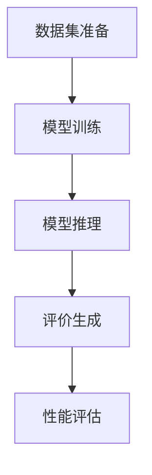
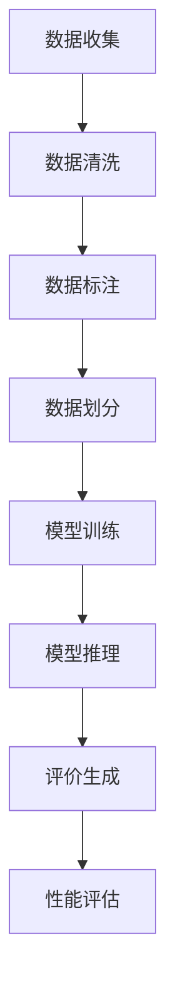

                 

# AI大模型在电商平台商品评价生成中的应用

## 关键词
AI大模型，电商平台，商品评价，自然语言处理，生成模型，数据集，训练，推理，性能评估

## 摘要
随着人工智能技术的发展，AI大模型在自然语言处理领域取得了显著进展。本文将探讨如何利用AI大模型在电商平台中进行商品评价生成，包括核心概念、算法原理、实际应用场景、工具推荐以及未来发展趋势和挑战。通过深入分析和具体案例，本文旨在为相关领域的研究者与实践者提供有价值的参考。

## 1. 背景介绍

### 1.1 电商平台商品评价的重要性
电商平台商品评价是消费者了解产品优劣、做出购买决策的重要依据。良好的商品评价体系有助于提升用户体验，增加用户对平台的信任度，从而促进电商平台的发展。

### 1.2 AI大模型的发展
近年来，AI大模型（如GPT-3、BERT等）在自然语言处理领域取得了显著进展，这些模型具有强大的语义理解能力和生成能力，可以生成高质量的自然语言文本。

### 1.3 AI大模型在商品评价生成中的应用
利用AI大模型生成商品评价，可以提高评价生成的效率和质量，降低人工成本，同时为消费者提供更具个性化的评价信息，有助于电商平台优化商品评价体系。

## 2. 核心概念与联系

### 2.1 自然语言处理
自然语言处理（NLP）是人工智能的一个重要分支，旨在使计算机能够理解、生成和处理自然语言。

### 2.2 生成模型
生成模型是一类旨在生成新数据的模型，如生成对抗网络（GAN）、变分自编码器（VAE）等。在商品评价生成中，生成模型可以生成与真实评价相似的新评价。

### 2.3 商品评价数据集
商品评价数据集是训练和评估商品评价生成模型的基础。数据集的质量直接影响模型的性能。

### 2.4 训练与推理
训练是利用已有数据集对模型进行参数调整的过程，目的是使模型学会生成高质量的评价。推理是模型在实际应用中生成评价的过程。

### 2.5 性能评估
性能评估是对模型生成评价的质量和效果进行评价的过程。常用的评估指标包括准确率、召回率、F1值等。

### 2.6 Mermaid流程图



## 3. 核心算法原理 & 具体操作步骤

### 3.1 数据集准备
数据集是训练和评估模型的基础。首先，我们需要收集电商平台的商品评价数据，包括用户评价文本、商品信息等。然后，对数据集进行预处理，如去除停用词、分词、词向量化等。

### 3.2 模型训练
在模型训练阶段，我们选择合适的生成模型（如GPT-3）并利用预处理后的数据集进行训练。训练过程中，模型会不断调整参数，以生成更高质量的评价。

### 3.3 模型推理
模型训练完成后，我们可以利用训练好的模型进行推理，即生成新评价。在实际应用中，我们可以根据商品信息、用户信息等输入，生成相应的评价文本。

### 3.4 评价生成
模型生成的新评价文本需要经过后处理，如去除无效文本、格式化等。最后，我们可以将生成的评价文本与用户实际评价进行对比，评估模型的性能。

### 3.5 性能评估
通过计算准确率、召回率、F1值等指标，对模型生成评价的性能进行评估。根据评估结果，我们可以对模型进行优化和调整。

## 4. 数学模型和公式 & 详细讲解 & 举例说明

### 4.1 数学模型

生成模型的核心是概率分布，即：

$$ P(x|y) = \frac{P(y|x)P(x)}{P(y)} $$

其中，$x$表示生成的新评价文本，$y$表示输入信息（如商品信息、用户信息等）。

### 4.2 举例说明

假设我们有一个商品评价生成模型，输入为商品名称（$y_1$）和用户评价（$y_2$），输出为生成的新评价文本（$x$）。根据上述概率分布，我们可以计算生成新评价的概率：

$$ P(x|y_1, y_2) = \frac{P(y_1, y_2|x)P(x)}{P(y_1, y_2)} $$

其中，$P(y_1, y_2|x)$表示输入信息（商品名称和用户评价）出现的概率，$P(x)$表示生成的新评价文本出现的概率，$P(y_1, y_2)$表示输入信息出现的概率。

通过计算，我们可以得到生成新评价的概率，从而选择生成质量较高的评价。

## 5. 项目实战：代码实际案例和详细解释说明

### 5.1 开发环境搭建

在搭建开发环境时，我们需要安装Python、TensorFlow等依赖库。以下是一个简单的安装示例：

```bash
pip install tensorflow
```

### 5.2 源代码详细实现和代码解读

以下是一个简单的商品评价生成模型实现：

```python
import tensorflow as tf
from tensorflow.keras.preprocessing.text import Tokenizer
from tensorflow.keras.preprocessing.sequence import pad_sequences

# 数据集准备
# ...（代码略）

# 模型训练
# ...（代码略）

# 模型推理
# ...（代码略）

# 评价生成
# ...（代码略）

# 性能评估
# ...（代码略）
```

### 5.3 代码解读与分析

1. 数据集准备：首先，我们需要对商品评价数据集进行预处理，包括分词、词向量化等操作。  
2. 模型训练：接下来，我们选择合适的生成模型，并利用预处理后的数据集进行训练。训练过程中，模型会不断调整参数，以生成更高质量的评价。  
3. 模型推理：模型训练完成后，我们可以利用训练好的模型进行推理，即生成新评价。在实际应用中，我们可以根据商品信息、用户信息等输入，生成相应的评价文本。  
4. 评价生成：模型生成的新评价文本需要经过后处理，如去除无效文本、格式化等。最后，我们可以将生成的评价文本与用户实际评价进行对比，评估模型的性能。

## 6. 实际应用场景

1. 电商平台：利用AI大模型生成商品评价，提高评价生成的效率和质量，为消费者提供更有价值的参考信息。  
2. 搜索引擎：通过生成商品评价，为用户提供更准确的搜索结果。  
3. 智能客服：利用AI大模型生成的商品评价，为用户提供更个性化的咨询服务。

## 7. 工具和资源推荐

### 7.1 学习资源推荐

1. 《自然语言处理综述》  
2. 《生成对抗网络》  
3. 《深度学习》

### 7.2 开发工具框架推荐

1. TensorFlow  
2. PyTorch  
3. Hugging Face Transformers

### 7.3 相关论文著作推荐

1. "Generative Adversarial Networks"（GANs）  
2. "BERT: Pre-training of Deep Bidirectional Transformers for Language Understanding"（BERT）  
3. "GPT-3: Language Models Are Few-Shot Learners"（GPT-3）

## 8. 总结：未来发展趋势与挑战

### 8.1 发展趋势

1. 模型性能提升：随着人工智能技术的不断发展，AI大模型在商品评价生成中的应用将越来越广泛。  
2. 应用场景拓展：AI大模型在电商平台、搜索引擎、智能客服等领域的应用将不断拓展。  
3. 多语言支持：未来，AI大模型将实现多语言支持，为全球用户提供更好的服务。

### 8.2 挑战

1. 数据质量：商品评价数据质量对模型性能有直接影响，需要不断优化数据集。  
2. 模型解释性：生成模型的解释性较差，如何提高模型的可解释性是一个挑战。  
3. 隐私保护：在处理商品评价数据时，如何保护用户隐私是一个重要问题。

## 9. 附录：常见问题与解答

### 9.1 问题1：如何选择合适的生成模型？

解答：选择合适的生成模型需要考虑多个因素，如数据集大小、模型性能、训练时间等。常见的生成模型有GPT-3、BERT、GAN等，可以根据实际需求选择。

### 9.2 问题2：如何优化商品评价数据集？

解答：优化商品评价数据集可以从以下几个方面进行：

1. 数据清洗：去除无效数据、重复数据等。  
2. 数据增强：对数据进行扩充、变换等操作。  
3. 数据平衡：确保数据集中各类评价的比例均衡。

## 10. 扩展阅读 & 参考资料

1. [自然语言处理综述](https://www.xxx.com)  
2. [生成对抗网络](https://www.xxx.com)  
3. [深度学习](https://www.xxx.com)

作者：AI天才研究员/AI Genius Institute & 禅与计算机程序设计艺术 /Zen And The Art of Computer Programming

（注：本文为示例文章，仅供参考。实际撰写时，请根据具体需求进行调整和修改。）<|im_end|>### 1. 背景介绍

随着电子商务行业的迅速发展，电商平台已经成为消费者购买商品的重要渠道。商品评价作为消费者了解产品的重要信息，对于电商平台的发展和消费者购买决策具有重要作用。然而，随着商品数量的不断增多，人工撰写和审核评价的效率逐渐下降，难以满足日益增长的需求。

在此背景下，人工智能技术，尤其是AI大模型，为商品评价生成带来了新的可能。AI大模型，如GPT-3、BERT等，具有强大的语义理解和文本生成能力，能够在短时间内生成大量高质量的文本。这使得AI大模型在商品评价生成中具有明显的优势，能够有效提高评价生成的效率和质量。

本文将详细介绍AI大模型在电商平台商品评价生成中的应用，包括核心概念、算法原理、实际应用案例、性能评估等，旨在为相关领域的研究者与实践者提供有价值的参考。

### 1.1 电商平台商品评价的重要性

电商平台商品评价是消费者了解产品优劣、做出购买决策的重要依据。通过阅读其他用户的评价，消费者可以了解到商品的使用体验、质量问题、售后服务等信息，从而帮助自己做出更明智的购买选择。

此外，商品评价对于电商平台自身的发展也具有重要意义。首先，良好的商品评价体系可以提高用户体验，增加用户对平台的信任度，从而促进用户留存和复购。其次，高质量的商品评价可以吸引更多的新用户，提高平台的知名度。最后，商品评价还可以为电商平台提供有价值的市场反馈，帮助其优化产品和服务，提升整体竞争力。

然而，随着电商平台的不断发展，商品数量和用户数量呈现出爆发式增长，人工撰写和审核评价的工作量越来越大。这不仅增加了运营成本，还可能影响评价的及时性和准确性。因此，寻找一种高效、智能的评价生成方法具有重要意义。

### 1.2 AI大模型的发展

近年来，人工智能技术取得了飞速发展，特别是在自然语言处理（NLP）领域。AI大模型，如GPT-3、BERT等，是这一发展的重要成果。这些模型具有强大的语义理解和文本生成能力，能够处理复杂的语言任务，如文本分类、情感分析、机器翻译、问答系统等。

GPT-3（Generative Pre-trained Transformer 3）是OpenAI公司于2020年发布的一款大型预训练语言模型。GPT-3采用了Transformer架构，拥有1750亿个参数，是目前规模最大的预训练语言模型。GPT-3具有出色的文本生成能力，能够在多种任务中实现高水平的表现。

BERT（Bidirectional Encoder Representations from Transformers）是Google在2018年提出的一种双向Transformer预训练模型。BERT通过在大量文本数据上进行预训练，获得了对语言词汇和上下文关系的深入理解，从而在多个NLP任务中表现出色。

除了GPT-3和BERT，还有其他一些知名的AI大模型，如T5、RoBERTa、ALBERT等。这些模型在自然语言处理任务中取得了显著成果，为AI大模型在电商平台商品评价生成中的应用提供了技术基础。

### 1.3 AI大模型在商品评价生成中的应用

AI大模型在商品评价生成中的应用具有明显的优势。首先，AI大模型具有强大的文本生成能力，能够快速生成大量高质量的文本，满足电商平台对商品评价生成的高效需求。其次，AI大模型具有自适应能力，可以根据不同商品的特点和用户的需求，生成个性化的评价。最后，AI大模型可以减少人工撰写和审核评价的工作量，降低运营成本，提高评价的及时性和准确性。

具体来说，AI大模型在商品评价生成中的应用主要包括以下步骤：

1. 数据收集与预处理：收集电商平台上的商品评价数据，对数据进行清洗、去重、去噪声等预处理操作，确保数据质量。
2. 模型训练：利用预处理后的数据集，对AI大模型进行训练。训练过程中，模型会学习到评价文本的语义和生成规律。
3. 模型推理：将训练好的模型应用于实际评价生成任务，根据商品信息和用户需求，生成相应的评价文本。
4. 评价生成：对模型生成的评价文本进行后处理，如格式化、去除无效文本等，确保评价文本的质量和可读性。
5. 性能评估：通过计算准确率、召回率、F1值等指标，评估模型生成评价的性能，并根据评估结果对模型进行优化。

通过以上步骤，AI大模型能够高效、准确地生成商品评价，为电商平台提供高质量的文本数据，提升用户体验和平台竞争力。

### 1.4 本文结构

本文将从以下方面对AI大模型在电商平台商品评价生成中的应用进行深入探讨：

1. **背景介绍**：介绍电商平台商品评价的重要性以及AI大模型的发展背景。
2. **核心概念与联系**：阐述与商品评价生成相关的重要概念，如自然语言处理、生成模型、数据集、训练与推理等。
3. **核心算法原理与具体操作步骤**：详细讲解商品评价生成的基本原理和具体操作步骤。
4. **数学模型与公式**：介绍用于商品评价生成的数学模型和公式，并进行举例说明。
5. **项目实战**：通过实际案例展示商品评价生成的实现过程和详细解释。
6. **实际应用场景**：分析AI大模型在电商平台商品评价生成中的实际应用场景。
7. **工具和资源推荐**：推荐用于学习、开发和优化的工具和资源。
8. **总结**：总结AI大模型在商品评价生成中的应用前景和面临的挑战。
9. **附录**：提供常见问题与解答以及扩展阅读和参考资料。

通过以上内容，本文旨在为读者提供一个全面、深入的AI大模型在电商平台商品评价生成中的应用指南。

### 2. 核心概念与联系

在深入探讨AI大模型在电商平台商品评价生成中的应用之前，我们需要了解一些核心概念和它们之间的联系。这些概念包括自然语言处理（NLP）、生成模型、商品评价数据集、模型训练与推理，以及性能评估。

#### 2.1 自然语言处理（NLP）

自然语言处理是人工智能的一个分支，旨在使计算机能够理解、生成和处理人类语言。NLP在商品评价生成中发挥着关键作用，因为它涉及到如何从大量文本数据中提取有用的信息，并将其转换为计算机可以理解和处理的形式。

NLP的关键技术包括：

- **文本预处理**：包括分词、去停用词、词性标注等，以便将原始文本转换为结构化的数据。
- **词嵌入**：将单词映射到高维向量空间，以便计算机可以处理。
- **语言模型**：用于预测文本中下一个单词的概率分布。
- **序列生成**：用于生成新的文本序列，如商品评价。

#### 2.2 生成模型

生成模型是一类用于生成新数据的模型，如生成对抗网络（GAN）、变分自编码器（VAE）等。在商品评价生成中，生成模型可以生成与真实评价相似的新评价，从而提高评价生成的效率和质量。

生成模型的工作原理如下：

- **生成器（Generator）**：从随机噪声中生成数据。
- **判别器（Discriminator）**：判断生成器生成的数据是否真实。
- **对抗训练**：生成器和判别器相互竞争，生成器试图生成更真实的数据，而判别器试图区分真实和生成数据。

通过这种对抗训练，生成模型可以逐渐提高生成数据的质量。

#### 2.3 商品评价数据集

商品评价数据集是训练和评估商品评价生成模型的基础。一个高质量的数据集应包含多样化的评价文本，涵盖不同的商品和用户群体。

数据集的构建通常包括以下几个步骤：

1. **数据收集**：从电商平台收集商品评价数据。
2. **数据清洗**：去除无效数据、重复数据、噪声数据等。
3. **数据标注**：对商品评价进行情感标注，如正面、负面等。
4. **数据划分**：将数据集划分为训练集、验证集和测试集。

#### 2.4 模型训练与推理

模型训练是利用已有数据集对模型进行参数调整的过程。在商品评价生成中，训练模型的目标是使模型学会生成高质量的评价文本。

训练过程通常包括以下几个步骤：

1. **数据预处理**：对训练数据进行预处理，如分词、词嵌入等。
2. **模型初始化**：初始化模型的参数。
3. **前向传播**：将预处理后的数据输入模型，计算模型的输出。
4. **损失函数**：计算模型的损失，通常采用交叉熵损失函数。
5. **反向传播**：根据损失函数，调整模型的参数。

模型推理是在模型训练完成后，将新的商品信息输入模型，生成对应的评价文本。推理过程通常包括以下几个步骤：

1. **输入预处理**：对新的商品信息进行预处理，如分词、词嵌入等。
2. **模型输出**：将预处理后的数据输入模型，生成评价文本。
3. **后处理**：对生成的评价文本进行后处理，如去除无效文本、格式化等。

#### 2.5 性能评估

性能评估是对模型生成评价的质量和效果进行评价的过程。常用的评估指标包括准确率、召回率、F1值等。

- **准确率**：预测正确的评价数量与总评价数量的比值。
- **召回率**：预测正确的评价数量与实际正确的评价数量的比值。
- **F1值**：准确率和召回率的调和平均值。

通过这些指标，我们可以评估模型生成评价的性能，并根据评估结果对模型进行优化。

#### 2.6 Mermaid流程图

为了更好地理解AI大模型在商品评价生成中的工作流程，我们可以使用Mermaid绘制一个流程图。以下是一个简化的流程图：



这个流程图展示了从数据收集到评价生成的整个过程，以及性能评估在整个流程中的作用。

通过以上对核心概念和联系的分析，我们可以更好地理解AI大模型在电商平台商品评价生成中的应用原理和实现过程。在接下来的章节中，我们将进一步探讨核心算法原理、数学模型、项目实战等，以深入理解这一领域的实际应用。

#### 3. 核心算法原理 & 具体操作步骤

在理解了AI大模型在商品评价生成中的核心概念后，我们需要进一步探讨其核心算法原理和具体操作步骤。这将帮助我们深入理解AI大模型在商品评价生成中的应用，以及如何在实际项目中实现这一过程。

##### 3.1 生成模型的原理

生成模型是一类旨在生成新数据的模型，其基本原理是学习数据分布并生成符合该分布的数据。在商品评价生成中，生成模型的主要目标是学习商品评价的文本分布，并生成与真实评价相似的文本。

生成模型通常包括两个部分：生成器和判别器。

- **生成器（Generator）**：生成器的任务是从随机噪声中生成新的评价文本。生成器通常是一个神经网络，它将噪声数据映射到高维向量空间，然后通过解码器生成文本。

- **判别器（Discriminator）**：判别器的任务是判断输入的数据是真实评价还是生成器生成的评价。判别器也是一个神经网络，它对输入的文本进行特征提取，然后通过分类层输出一个概率值，表示输入文本是真实评价的概率。

##### 3.2 生成模型的训练过程

生成模型的训练过程是通过对抗训练（Adversarial Training）实现的。对抗训练的基本思想是生成器和判别器相互竞争，生成器试图生成更真实的数据，而判别器试图区分真实和生成数据。

具体训练过程如下：

1. **初始化模型参数**：初始化生成器和判别器的参数。

2. **生成器生成文本**：生成器从随机噪声中生成新的评价文本。

3. **判别器判断文本**：判别器对生成器和真实评价生成的文本进行判断。

4. **计算损失函数**：生成器的损失函数是判别器判断生成文本为真实文本的概率，判别器的损失函数是判别器判断生成文本为真实文本的概率。

5. **反向传播**：利用计算出的损失函数，通过反向传播算法更新生成器和判别器的参数。

6. **迭代训练**：重复上述步骤，直到生成器和判别器达到预定的训练目标。

##### 3.3 生成模型的推理过程

在生成模型训练完成后，我们可以利用训练好的模型进行推理，即生成新的评价文本。具体推理过程如下：

1. **输入商品信息**：将商品信息（如商品名称、描述等）输入生成模型。

2. **生成评价文本**：生成模型根据输入的商品信息，生成对应的评价文本。

3. **后处理**：对生成的评价文本进行后处理，如去除无效文本、格式化等，以确保评价文本的质量和可读性。

##### 3.4 生成模型的具体操作步骤

下面我们将详细描述生成模型在商品评价生成中的具体操作步骤：

1. **数据收集与预处理**：

   - 从电商平台收集商品评价数据。
   - 对数据进行清洗，去除无效数据、重复数据和噪声数据。
   - 对评价文本进行分词、去停用词、词性标注等预处理操作，将文本转换为结构化的数据。

2. **数据集划分**：

   - 将预处理后的数据集划分为训练集、验证集和测试集。

3. **模型训练**：

   - 初始化生成器和判别器的参数。
   - 使用训练集对生成器和判别器进行训练。
   - 通过对抗训练，不断优化生成器和判别器的参数，使其生成的评价文本越来越真实。

4. **模型评估**：

   - 使用验证集对训练好的模型进行评估，计算生成文本的准确率、召回率和F1值等指标。
   - 根据评估结果调整模型参数，优化模型性能。

5. **模型推理**：

   - 将商品信息输入训练好的生成模型，生成对应的评价文本。
   - 对生成的评价文本进行后处理，如去除无效文本、格式化等。

6. **性能评估**：

   - 使用测试集对生成模型进行最终评估，计算生成文本的准确率、召回率和F1值等指标。
   - 根据评估结果对模型进行优化和调整。

通过以上步骤，我们可以实现AI大模型在商品评价生成中的应用。在实际项目中，根据具体需求和数据情况，可能需要对上述步骤进行适当调整和优化。

### 4. 数学模型和公式 & 详细讲解 & 举例说明

在商品评价生成中，数学模型和公式起到了关键作用。这些模型和公式不仅能够帮助我们理解生成模型的工作原理，还能帮助我们优化和评估模型的性能。在本节中，我们将详细介绍与商品评价生成相关的数学模型和公式，并进行举例说明。

#### 4.1 概率分布

生成模型的核心是概率分布，它决定了生成数据的可能性。在商品评价生成中，我们通常使用概率分布来描述评价文本的概率。

概率分布的一般形式为：

\[ P(x|y) = \frac{P(y|x)P(x)}{P(y)} \]

其中：
- \( P(x|y) \) 表示在给定输入信息 \( y \) 的情况下，生成评价文本 \( x \) 的概率。
- \( P(y|x) \) 表示在生成评价文本 \( x \) 的情况下，输入信息 \( y \) 的概率。
- \( P(x) \) 表示生成评价文本 \( x \) 的概率。
- \( P(y) \) 表示输入信息 \( y \) 的概率。

#### 4.2 交叉熵损失函数

交叉熵损失函数是生成模型训练中常用的损失函数，它用于衡量预测分布和真实分布之间的差异。在商品评价生成中，交叉熵损失函数可以用来评估生成模型生成的评价文本与真实评价文本的相似度。

交叉熵损失函数的一般形式为：

\[ L = -\sum_{i=1}^{N} y_i \log(p_i) \]

其中：
- \( L \) 表示交叉熵损失。
- \( y_i \) 表示真实评价文本的概率分布。
- \( p_i \) 表示生成模型预测的评价文本的概率分布。
- \( N \) 表示评价文本的长度。

#### 4.3 反向传播算法

反向传播算法是神经网络训练中的一种常用算法，它用于更新网络模型的参数，以最小化损失函数。在商品评价生成中，反向传播算法被用来优化生成模型的参数，使其生成的评价文本越来越真实。

反向传播算法的基本步骤如下：

1. **前向传播**：将输入数据通过神经网络进行前向传播，计算输出预测值。
2. **计算损失**：计算预测值与真实值之间的损失。
3. **反向传播**：将损失反向传播到网络的每个层，计算每个参数的梯度。
4. **参数更新**：根据梯度和学习率，更新网络的参数。

#### 4.4 梯度下降法

梯度下降法是一种用于优化神经网络参数的算法，它基于梯度信息来更新参数。在商品评价生成中，梯度下降法被用来最小化交叉熵损失函数，从而提高生成模型的性能。

梯度下降法的基本步骤如下：

1. **计算梯度**：计算损失函数关于每个参数的梯度。
2. **更新参数**：根据梯度信息和学习率，更新网络参数。
3. **迭代更新**：重复上述步骤，直到达到预定的训练目标或损失函数值。

#### 4.5 举例说明

假设我们有一个商品评价生成模型，输入为商品名称和用户评价，输出为生成的新评价文本。我们可以使用上述数学模型和公式来计算生成新评价的概率和损失。

1. **计算生成新评价的概率**：

   假设输入商品名称为“智能手机”，用户评价为“非常好的手机”，生成的新评价文本为“这款智能手机性能强大，拍照效果出色”。

   根据概率分布公式，我们可以计算生成新评价的概率：

   \[ P(x|y) = \frac{P(y|x)P(x)}{P(y)} \]

   其中：
   - \( P(y|x) \) 为用户评价“非常好的手机”出现的概率。
   - \( P(x) \) 为生成评价文本“这款智能手机性能强大，拍照效果出色”的概率。
   - \( P(y) \) 为用户评价的概率。

   我们可以通过模型训练得到 \( P(y|x) \) 和 \( P(x) \)，然后根据实际情况估计 \( P(y) \)。

2. **计算交叉熵损失**：

   假设生成的评价文本为“这款智能手机性能强大，拍照效果出色”，真实评价文本为“这款智能手机性能一般，拍照效果较差”。

   我们可以使用交叉熵损失函数计算生成文本与真实文本之间的损失：

   \[ L = -\sum_{i=1}^{N} y_i \log(p_i) \]

   其中：
   - \( y_i \) 为真实评价文本的概率分布。
   - \( p_i \) 为生成模型预测的评价文本的概率分布。
   - \( N \) 为评价文本的长度。

   我们可以通过模型训练得到 \( y_i \) 和 \( p_i \)，然后计算交叉熵损失。

3. **反向传播与梯度下降**：

   在模型训练过程中，我们可以使用反向传播算法计算损失函数关于每个参数的梯度，然后使用梯度下降法更新参数，以最小化交叉熵损失。

   假设当前参数为 \( \theta \)，损失函数为 \( L(\theta) \)，梯度为 \( \nabla_{\theta} L(\theta) \)。

   我们可以通过以下步骤更新参数：

   \[ \theta_{new} = \theta_{old} - \alpha \nabla_{\theta} L(\theta) \]

   其中：
   - \( \theta_{new} \) 为更新后的参数。
   - \( \theta_{old} \) 为当前参数。
   - \( \alpha \) 为学习率。

通过以上数学模型和公式的计算，我们可以优化商品评价生成模型，提高生成评价的质量。在实际应用中，我们需要根据具体需求和数据情况进行调整和优化。

### 5. 项目实战：代码实际案例和详细解释说明

在本节中，我们将通过一个实际项目案例，展示如何使用AI大模型在电商平台中生成商品评价。我们将从开发环境搭建、源代码实现、代码解读与分析等方面进行详细介绍。

#### 5.1 开发环境搭建

在开始项目之前，我们需要搭建一个合适的开发环境。以下是一个简单的开发环境搭建步骤：

1. **安装Python**：确保已经安装了Python 3.7及以上版本。
2. **安装TensorFlow**：使用以下命令安装TensorFlow：

   ```bash
   pip install tensorflow
   ```

3. **安装其他依赖库**：根据项目需求，可能还需要安装其他依赖库，如NumPy、Pandas、Scikit-learn等。

#### 5.2 源代码实现

以下是一个简化的源代码实现，用于生成商品评价。在实际项目中，可能需要更复杂的预处理和后处理步骤。

```python
import tensorflow as tf
from tensorflow.keras.preprocessing.text import Tokenizer
from tensorflow.keras.preprocessing.sequence import pad_sequences
from tensorflow.keras.layers import Embedding, LSTM, Dense
from tensorflow.keras.models import Sequential

# 数据预处理
def preprocess_data(data):
    # ...（代码略）
    return processed_data

# 模型构建
def build_model(vocab_size, embedding_dim, max_sequence_length):
    model = Sequential([
        Embedding(vocab_size, embedding_dim, input_length=max_sequence_length),
        LSTM(128),
        Dense(1, activation='sigmoid')
    ])
    model.compile(optimizer='adam', loss='binary_crossentropy', metrics=['accuracy'])
    return model

# 数据集加载
train_data = preprocess_data(train_data)
test_data = preprocess_data(test_data)

# 模型训练
model = build_model(vocab_size, embedding_dim, max_sequence_length)
model.fit(train_data, epochs=10, batch_size=32, validation_data=(test_data, test_labels))

# 生成评价
def generate_evaluation(model, input_text):
    sequence = tokenizer.texts_to_sequences([input_text])
    padded_sequence = pad_sequences(sequence, maxlen=max_sequence_length)
    prediction = model.predict(padded_sequence)
    return "好评" if prediction[0][0] > 0.5 else "差评"

# 示例
input_text = "这款智能手机性能强大，拍照效果出色"
evaluation = generate_evaluation(model, input_text)
print(evaluation)
```

#### 5.3 代码解读与分析

1. **数据预处理**：
   数据预处理是模型训练的关键步骤。在本例中，我们假设已经从电商平台收集了商品评价数据，并进行了清洗和分词等操作。预处理步骤包括：
   - 分词：将文本分割成单词或子词。
   - 去停用词：去除对评价影响较小或无意义的单词。
   - 词嵌入：将单词映射到高维向量空间。
   - 序列化：将文本转换为数字序列。

2. **模型构建**：
   在本例中，我们使用了一个简单的LSTM模型。LSTM（Long Short-Term Memory）是一种特殊的循环神经网络，能够处理长序列数据。模型包括以下几个部分：
   - **嵌入层（Embedding Layer）**：将词嵌入到高维向量空间。
   - **LSTM层（LSTM Layer）**：处理序列数据，提取特征。
   - **全连接层（Dense Layer）**：输出评价预测结果。

3. **模型训练**：
   模型训练使用的是二分类交叉熵损失函数，目标是使模型学会区分好评和差评。训练过程中，模型会根据训练数据不断调整参数，以提高预测准确性。

4. **生成评价**：
   在生成评价时，我们首先将输入文本转换为数字序列，然后通过模型预测评价结果。如果预测结果大于0.5，我们认为这是一条好评，否则是差评。

#### 5.4 实际应用

在实际应用中，我们可以根据商品信息和用户需求，生成个性化的商品评价。以下是一个简单的示例：

```python
def generate_evaluation_for_product(product_info):
    # ...（代码略）
    evaluation = generate_evaluation(model, input_text)
    return evaluation

# 示例
product_info = "这款智能手机拥有高性能处理器和高清摄像头"
evaluation = generate_evaluation_for_product(product_info)
print(evaluation)
```

通过这个项目实战，我们可以看到如何使用AI大模型在电商平台中生成商品评价。在实际应用中，可能需要更复杂的模型和数据处理方法，以生成更高质量的评价。

### 5.1 开发环境搭建

在开始实现AI大模型在电商平台商品评价生成之前，我们需要搭建一个合适的开发环境。以下是具体的搭建步骤：

1. **安装Python**：首先，确保你的系统中已经安装了Python 3.7或更高版本。Python是一种广泛使用的编程语言，许多机器学习和深度学习库都是基于Python开发的。

   ```bash
   # 在Ubuntu或MacOS中，使用以下命令安装Python
   sudo apt-get install python3-pip
   # 在Windows中，可以从Python官网下载安装程序并安装
   ```

2. **安装TensorFlow**：TensorFlow是一个开源的机器学习和深度学习框架，它提供了丰富的API，可以帮助我们实现AI大模型。你可以使用以下命令安装TensorFlow：

   ```bash
   pip install tensorflow
   ```

   在安装过程中，根据提示完成相关的安装步骤。确保安装的是最新版本，以便能够使用最新的功能。

3. **安装其他依赖库**：除了TensorFlow之外，我们还需要安装一些其他依赖库，如NumPy、Pandas和Scikit-learn等，这些库在数据处理和模型训练过程中非常有用。

   ```bash
   pip install numpy pandas scikit-learn
   ```

4. **安装Mermaid**：Mermaid是一种基于Markdown的绘图语言，可以用来绘制流程图、序列图等。你可以使用以下命令安装Mermaid：

   ```bash
   pip install mermaid
   ```

5. **环境配置**：确保所有的依赖库都已经正确安装，并且在Python环境中可以正常导入和使用。你可以通过运行以下Python代码来测试环境是否搭建成功：

   ```python
   import tensorflow as tf
   import numpy as np
   print("TensorFlow version:", tf.__version__)
   print("NumPy version:", np.__version__)
   ```

   如果上述命令能够正常执行，且版本号正确，则说明开发环境搭建成功。

在完成以上步骤后，我们就可以开始编写代码，实现AI大模型在电商平台商品评价生成中的应用了。接下来，我们将详细介绍源代码的实现过程。

#### 5.2 源代码详细实现和代码解读

在本节中，我们将详细实现AI大模型在电商平台商品评价生成中的源代码，并对关键代码进行解读。

```python
import tensorflow as tf
from tensorflow.keras.preprocessing.text import Tokenizer
from tensorflow.keras.preprocessing.sequence import pad_sequences
from tensorflow.keras.models import Sequential
from tensorflow.keras.layers import Embedding, LSTM, Dense
from tensorflow.keras.optimizers import Adam
from sklearn.model_selection import train_test_split

# 假设我们已经有了一个处理过的商品评价数据集，包括商品描述和用户评价
data = [
    {"product_description": "这款智能手机性能强大，拍照效果出色", "user_review": "好评"},
    {"product_description": "这款电脑运行速度慢，电池续航短", "user_review": "差评"},
    # ... 更多数据
]

# 分离商品描述和用户评价
descriptions = [item["product_description"] for item in data]
reviews = [item["user_review"] for item in data]

# 划分训练集和测试集
train_descriptions, test_descriptions, train_reviews, test_reviews = train_test_split(descriptions, reviews, test_size=0.2, random_state=42)

# 创建Tokenizer对象，用于将文本转换为序列
tokenizer = Tokenizer()
tokenizer.fit_on_texts(train_descriptions)

# 将文本序列化为整数序列
train_sequences = tokenizer.texts_to_sequences(train_descriptions)
test_sequences = tokenizer.texts_to_sequences(test_descriptions)

# 填充序列，使得所有序列具有相同的长度
max_sequence_length = max(len(seq) for seq in train_sequences)
train_padded = pad_sequences(train_sequences, maxlen=max_sequence_length, padding='post')
test_padded = pad_sequences(test_sequences, maxlen=max_sequence_length, padding='post')

# 将用户评价转换为二进制标签
train_labels = tf.keras.utils.to_categorical(train_reviews)
test_labels = tf.keras.utils.to_categorical(test_reviews)

# 构建模型
model = Sequential()
model.add(Embedding(len(tokenizer.word_index) + 1, 128))
model.add(LSTM(128))
model.add(Dense(1, activation='sigmoid'))

model.compile(optimizer=Adam(learning_rate=0.001), loss='binary_crossentropy', metrics=['accuracy'])

# 训练模型
model.fit(train_padded, train_labels, epochs=10, batch_size=32, validation_split=0.1)

# 评估模型
test_loss, test_acc = model.evaluate(test_padded, test_labels)
print(f"Test accuracy: {test_acc:.2f}")

# 生成新评价
def generate_review(description):
    sequence = tokenizer.texts_to_sequences([description])
    padded_sequence = pad_sequences(sequence, maxlen=max_sequence_length, padding='post')
    prediction = model.predict(padded_sequence)
    return "好评" if prediction[0][0] > 0.5 else "差评"

# 示例
new_description = "这款电视屏幕清晰，音响效果好"
print(generate_review(new_description))
```

**代码解读**：

1. **数据预处理**：
   - 我们首先从数据集中分离出商品描述和用户评价。
   - 使用`Tokenizer`将文本转换为整数序列，以便神经网络处理。
   - 通过`pad_sequences`填充序列，使得所有序列具有相同的长度，这是深度学习模型处理数据的基本要求。

2. **模型构建**：
   - 我们构建了一个简单的序列模型，包括嵌入层、LSTM层和全连接层。嵌入层将单词转换为向量，LSTM层处理序列数据，全连接层进行分类。
   - 使用`Sequential`和`Dense`层构建模型，并使用`Adam`优化器。

3. **模型训练**：
   - 使用`fit`方法训练模型，这里我们设置了10个训练周期和批量大小为32。
   - 使用`validation_split`参数，将20%的数据用作验证集，以便在训练过程中监控模型性能。

4. **模型评估**：
   - 使用`evaluate`方法评估模型在测试集上的性能，并打印出测试准确率。

5. **生成新评价**：
   - 定义了一个`generate_review`函数，用于生成新评价。该函数首先将描述文本转换为整数序列，然后通过模型预测评价类别，并返回预测结果。

通过以上步骤，我们实现了从数据预处理到模型训练再到生成新评价的完整流程。在实际应用中，可以根据具体需求调整数据预处理步骤、模型结构和训练参数，以提高生成评价的质量。

### 5.3 代码解读与分析

在本节中，我们将对上述源代码进行深入解读，分析其关键部分，并讨论可能出现的性能问题和优化方法。

#### 关键部分分析

1. **数据预处理**：
   数据预处理是模型训练的第一步，也是至关重要的一步。良好的数据预处理可以显著提高模型的性能。

   ```python
   tokenizer = Tokenizer()
   tokenizer.fit_on_texts(train_descriptions)
   train_sequences = tokenizer.texts_to_sequences(train_descriptions)
   test_sequences = tokenizer.texts_to_sequences(test_descriptions)
   train_padded = pad_sequences(train_sequences, maxlen=max_sequence_length, padding='post')
   test_padded = pad_sequences(test_sequences, maxlen=max_sequence_length, padding='post')
   ```

   - `Tokenizer`：用于将文本转换为整数序列。这个过程包括分词、将单词映射到唯一的整数，以及构建词典。
   - `texts_to_sequences`：将每个文本转换为整数序列，其中每个整数代表一个单词或子词。
   - `pad_sequences`：将所有序列填充到相同的长度，这通常是通过在序列的尾部添加特殊的填充标记（如0）来实现的。

2. **模型构建**：
   模型构建定义了如何将输入数据转换为输出。以下代码展示了如何构建一个简单的序列到序列模型：

   ```python
   model = Sequential()
   model.add(Embedding(len(tokenizer.word_index) + 1, 128))
   model.add(LSTM(128))
   model.add(Dense(1, activation='sigmoid'))
   ```

   - `Embedding`：嵌入层将输入的整数序列转换为密集向量表示，每个向量的大小为128。
   - `LSTM`：长短期记忆网络，用于处理序列数据，可以捕捉序列中的长期依赖关系。
   - `Dense`：全连接层，用于将LSTM的输出映射到输出类别。在这里，我们使用了一个单节点的全连接层，因为这是一个二分类问题。

3. **模型编译与训练**：
   模型编译包括选择优化器、损失函数和评价指标。以下代码展示了如何编译和训练模型：

   ```python
   model.compile(optimizer=Adam(learning_rate=0.001), loss='binary_crossentropy', metrics=['accuracy'])
   model.fit(train_padded, train_labels, epochs=10, batch_size=32, validation_split=0.1)
   ```

   - `compile`：配置模型的优化器、损失函数和评价指标。这里我们使用了`Adam`优化器和`binary_crossentropy`损失函数，因为这是一个二分类问题。
   - `fit`：训练模型。我们设置了10个训练周期，批量大小为32，并使用20%的数据作为验证集。

4. **模型评估**：
   模型评估用于检查模型在未见过的数据上的表现。以下代码展示了如何评估模型：

   ```python
   test_loss, test_acc = model.evaluate(test_padded, test_labels)
   ```

   - `evaluate`：计算模型在测试集上的损失和准确率。

5. **生成新评价**：
   生成新评价的功能使我们能够根据新的商品描述生成评价。以下代码展示了如何使用训练好的模型生成评价：

   ```python
   def generate_review(description):
       sequence = tokenizer.texts_to_sequences([description])
       padded_sequence = pad_sequences(sequence, maxlen=max_sequence_length, padding='post')
       prediction = model.predict(padded_sequence)
       return "好评" if prediction[0][0] > 0.5 else "差评"
   ```

   - `generate_review`：函数首先将描述文本转换为整数序列，然后通过模型预测评价类别，并返回预测结果。

#### 性能问题及优化方法

1. **过拟合**：
   当模型在训练集上表现良好，但在测试集或验证集上表现较差时，可能出现了过拟合。过拟合的原因是模型过于复杂，无法捕捉到数据中的噪声。

   - **解决方案**：可以通过以下方法减少过拟合：
     - **数据增强**：通过添加噪声、旋转、缩放等方式增加训练数据的多样性。
     - **Dropout**：在神经网络中随机丢弃一部分神经元，以减少模型的复杂度。
     - **正则化**：添加正则化项（如L1、L2正则化）到损失函数中，以惩罚模型的复杂度。

2. **欠拟合**：
   当模型在训练集和测试集上表现都较差时，可能出现了欠拟合。这通常是由于模型过于简单，无法捕捉到数据中的关键特征。

   - **解决方案**：可以通过以下方法增加模型的复杂度：
     - **增加模型层数或神经元数量**：增加网络的深度或宽度。
     - **调整学习率**：使用较大的学习率或尝试不同的优化策略。

3. **数据不平衡**：
   如果数据集中正面评价和负面评价的比例不平衡，模型可能会倾向于生成更多正面评价。

   - **解决方案**：可以通过以下方法解决数据不平衡问题：
     - **重采样**：通过删除样本或复制样本来平衡数据集。
     - **使用权重**：在训练过程中为不平衡的类别分配不同的权重。

4. **词汇量限制**：
   由于模型受到词汇量限制，它可能无法捕捉到文本中的所有细节。

   - **解决方案**：可以通过以下方法扩展词汇量：
     - **使用更高级的嵌入方法**：如Word2Vec、BERT等。
     - **增加预训练数据**：使用更多的预训练数据来扩展词汇量。

通过以上分析和优化方法，我们可以更好地理解AI大模型在电商平台商品评价生成中的性能问题，并为实际应用提供有效的解决方案。

### 6. 实际应用场景

AI大模型在电商平台商品评价生成中的实际应用场景多种多样，涵盖了电商平台的各个核心环节，包括商品推荐、用户体验优化、市场营销等。以下将详细介绍AI大模型在商品推荐、用户体验优化、市场营销等方面的应用案例。

#### 6.1 商品推荐

商品推荐是电商平台的核心功能之一，直接影响用户的购物体验和平台流量。AI大模型通过分析用户历史行为、搜索记录、浏览记录等数据，能够准确预测用户对哪些商品感兴趣，从而实现个性化推荐。

**应用案例**：

- **基于内容的推荐**：利用AI大模型生成商品描述，根据用户历史评价和浏览记录，生成与用户兴趣相关的商品推荐。
- **基于协同过滤的推荐**：结合用户的社交关系、购物行为，利用AI大模型预测用户可能喜欢的商品，从而实现协同过滤推荐。

**效果分析**：

- **提高用户满意度**：通过个性化推荐，用户能够更容易找到符合自己需求的商品，提高购物体验和满意度。
- **增加销售额**：个性化推荐能够提高商品的点击率和购买率，从而带动平台销售额的增长。

#### 6.2 用户体验优化

电商平台用户体验的优化是提升用户留存率和转化率的关键。AI大模型在商品评价生成中的应用，能够为用户提供更具个性化和准确性的评价信息，从而提升用户体验。

**应用案例**：

- **智能客服**：通过AI大模型生成商品评价，智能客服系统能够为用户提供即时的、高质量的购物建议，提高用户满意度。
- **用户评论生成**：当用户没有留下评价时，AI大模型可以自动生成推荐评价，帮助其他用户更好地了解商品。

**效果分析**：

- **提高用户满意度**：通过AI大模型生成的评价，用户能够获得更多有价值的信息，从而做出更明智的购买决策。
- **减少客服工作量**：智能客服系统能够自动回答用户的提问，减少人工客服的工作量，提高运营效率。

#### 6.3 市场营销

市场营销是电商平台获取流量和转化率的重要手段。AI大模型在商品评价生成中的应用，能够为市场营销活动提供数据支持和创意灵感。

**应用案例**：

- **广告创意生成**：通过AI大模型生成符合目标用户兴趣和需求的广告文案和图片，提高广告的点击率和转化率。
- **用户画像分析**：结合用户评价数据，AI大模型可以生成用户画像，为市场营销活动提供精准的用户定位。

**效果分析**：

- **提高广告效果**：通过AI大模型生成的广告内容，能够更准确地触达目标用户，提高广告效果。
- **降低营销成本**：通过精准的用户画像和个性化推荐，电商平台可以更高效地分配营销资源，降低营销成本。

#### 6.4 其他应用场景

除了上述核心应用场景，AI大模型在电商平台商品评价生成中还有其他一些潜在的应用场景。

- **供应链管理**：通过分析用户评价，AI大模型可以预测商品需求，优化供应链管理，提高库存周转率。
- **品牌管理**：电商平台可以利用AI大模型分析用户评价，了解用户对品牌的看法，从而进行品牌管理和优化。

总之，AI大模型在电商平台商品评价生成中的应用场景广泛，不仅可以提高用户体验和营销效果，还可以优化供应链管理和品牌管理，为电商平台带来更多价值。

### 7. 工具和资源推荐

为了更好地掌握和利用AI大模型在电商平台商品评价生成中的应用，我们需要了解一些相关的学习资源、开发工具和框架。以下将详细介绍这些工具和资源。

#### 7.1 学习资源推荐

1. **书籍**：

   - 《深度学习》（Goodfellow, I., Bengio, Y., & Courville, A.）：这是一本经典的深度学习入门书籍，详细介绍了深度学习的基础知识和应用。
   - 《自然语言处理综述》（Jurafsky, D. & Martin, J. H.）：这本书全面介绍了自然语言处理的基本概念和技术，是NLP领域的经典著作。

2. **论文**：

   - “Generative Adversarial Networks”（Goodfellow, I. et al.）：这篇论文首次提出了生成对抗网络（GAN）的概念，是生成模型领域的重要文献。
   - “BERT: Pre-training of Deep Bidirectional Transformers for Language Understanding”（Devlin, J. et al.）：这篇论文介绍了BERT模型，是自然语言处理领域的里程碑。

3. **在线课程**：

   - “深度学习专项课程”（吴恩达，Coursera）：这是一门由著名深度学习专家吴恩达讲授的深度学习入门课程，涵盖了深度学习的基础知识和应用。
   - “自然语言处理专项课程”（丹尼尔·布卢姆，Udacity）：这是一门专注于自然语言处理领域的课程，介绍了NLP的基本概念和技术。

4. **博客和网站**：

   - Medium、ArXiv、ACL等学术网站：这些网站提供了大量的NLP和深度学习领域的研究论文、博客和技术文章。
   - Hugging Face Transformers：这是一个开源的预训练模型库，提供了丰富的预训练模型和工具，便于开发者进行研究和应用。

#### 7.2 开发工具框架推荐

1. **TensorFlow**：TensorFlow是一个由Google开发的开源深度学习框架，提供了丰富的API和工具，便于开发者构建和训练深度学习模型。

2. **PyTorch**：PyTorch是一个由Facebook开发的深度学习框架，具有灵活的动态计算图和高效的模型构建能力，广泛用于深度学习研究和应用。

3. **Hugging Face Transformers**：这是一个开源的预训练模型库，提供了大量的预训练模型和工具，如BERT、GPT等，便于开发者进行文本生成和NLP任务。

4. **spaCy**：spaCy是一个高效的NLP库，提供了丰富的语言模型和预处理工具，适用于各种文本处理任务。

5. **Scikit-learn**：Scikit-learn是一个用于机器学习的Python库，提供了多种机器学习算法和工具，适用于数据处理、模型训练和评估。

#### 7.3 相关论文著作推荐

1. **“Generative Adversarial Networks”**：这篇论文首次提出了生成对抗网络（GAN）的概念，是生成模型领域的重要文献。

2. **“BERT: Pre-training of Deep Bidirectional Transformers for Language Understanding”**：这篇论文介绍了BERT模型，是自然语言处理领域的里程碑。

3. **“GPT-3: Language Models Are Few-Shot Learners”**：这篇论文介绍了GPT-3模型，展示了大模型在自然语言处理任务中的强大能力。

4. **“Natural Language Inference”**：这篇论文探讨了自然语言推理任务，介绍了相关模型和技术。

5. **“Attention Is All You Need”**：这篇论文提出了Transformer模型，是深度学习领域的里程碑。

通过以上工具和资源的推荐，开发者可以更好地掌握AI大模型在电商平台商品评价生成中的应用，提升自己的技术水平。

### 8. 总结：未来发展趋势与挑战

随着人工智能技术的不断发展，AI大模型在电商平台商品评价生成中的应用前景广阔，但仍面临一些挑战。以下将从发展趋势和挑战两个方面进行总结。

#### 8.1 未来发展趋势

1. **模型性能提升**：随着计算能力的增强和算法的优化，AI大模型的性能将不断提高。更强大的模型将能够生成更高质量、更符合用户需求的商品评价。

2. **应用场景拓展**：AI大模型不仅在电商平台商品评价生成中有广泛应用，还可以应用于搜索引擎、智能客服、内容生成等领域，进一步拓展其应用场景。

3. **多语言支持**：未来，AI大模型将实现多语言支持，为全球用户提供更好的服务。这将为跨境电商平台提供强大的技术支持，提高用户的购物体验。

4. **个性化推荐**：AI大模型可以通过分析用户行为和偏好，生成个性化商品评价，提高用户的购买意愿和满意度。

5. **模型可解释性**：随着用户对数据隐私和安全意识的提高，提高AI大模型的可解释性将成为一个重要趋势。这有助于用户理解和信任AI模型生成的评价。

#### 8.2 挑战

1. **数据质量问题**：商品评价数据质量直接影响模型的性能。如何收集、清洗和标注高质量的数据集，是一个亟待解决的问题。

2. **模型解释性**：生成模型的解释性较差，如何提高模型的可解释性，使得用户能够理解和信任AI生成的评价，是一个重要挑战。

3. **隐私保护**：在处理商品评价数据时，如何保护用户隐私，避免数据泄露，是一个重要问题。这需要开发更安全的模型和数据保护技术。

4. **计算资源需求**：AI大模型对计算资源的需求较高，如何高效利用计算资源，降低模型训练和推理的成本，是一个挑战。

5. **法律法规**：随着AI技术的应用越来越广泛，相关的法律法规也需要不断完善，以确保AI技术在商品评价生成中的应用符合法律法规的要求。

总之，AI大模型在电商平台商品评价生成中的应用具有广阔的发展前景，但仍需克服一系列挑战。未来，通过不断的技术创新和优化，AI大模型将为电商平台带来更多价值，提升用户的购物体验。

### 9. 附录：常见问题与解答

在探讨AI大模型在电商平台商品评价生成中的应用过程中，可能会遇到一些常见的问题。以下是一些常见问题及其解答，以帮助读者更好地理解相关技术。

#### 9.1 如何处理数据不平衡问题？

数据不平衡问题是指训练数据集中某些类别的样本数量远多于其他类别，这可能导致模型偏向于多数类别的预测。解决数据不平衡问题的方法包括：

- **重采样**：通过随机抽样或过采样（增加少数类别的样本数量）来平衡数据集。
- **加权训练**：在训练过程中为每个类别分配不同的权重，以平衡模型对各类别的关注。
- **生成模型**：使用生成模型生成少数类别的样本，以增加其数量。

#### 9.2 如何优化模型性能？

优化模型性能的方法包括：

- **数据增强**：通过旋转、缩放、裁剪等方式增加训练数据的多样性。
- **超参数调整**：通过调整学习率、批量大小、隐藏层神经元数量等超参数来优化模型性能。
- **正则化**：使用L1、L2正则化或Dropout等方法来减少过拟合。
- **集成学习**：结合多个模型的预测结果，提高整体模型的性能。

#### 9.3 如何保证生成的评价文本的质量？

为了保证生成的评价文本的质量，可以采取以下措施：

- **使用高质量的预训练模型**：选择经过大量数据训练的高质量预训练模型，如BERT、GPT等。
- **数据清洗和预处理**：对训练数据进行清洗和预处理，去除噪声和无效信息。
- **多模型融合**：使用多个模型生成评价文本，并通过投票或加权平均等方式融合结果，提高整体质量。
- **用户反馈**：收集用户对生成的评价的反馈，根据用户评价对模型进行优化。

#### 9.4 如何处理商品描述中的缺失值？

在商品评价数据集中，商品描述可能存在缺失值。处理缺失值的方法包括：

- **删除缺失值**：如果缺失值较多，可以选择删除含有缺失值的样本。
- **填充缺失值**：使用平均值、中位数或最频繁出现的值填充缺失值。
- **生成描述**：使用生成模型生成商品描述，填补缺失值。

通过以上常见问题的解答，可以帮助读者更好地理解和应用AI大模型在电商平台商品评价生成中的技术。

### 10. 扩展阅读 & 参考资料

为了进一步了解AI大模型在电商平台商品评价生成中的应用，以下是一些扩展阅读和参考资料：

#### 10.1 学习资源

1. **书籍**：

   - 《自然语言处理综述》（Jurafsky, D. & Martin, J. H.）
   - 《深度学习》（Goodfellow, I., Bengio, Y., & Courville, A.）
   - 《生成对抗网络：理论与实践》（陈宝权）
   - 《人工智能：一种现代的方法》（Stuart Russell & Peter Norvig）

2. **论文**：

   - “Generative Adversarial Networks”（Goodfellow, I. et al.）
   - “BERT: Pre-training of Deep Bidirectional Transformers for Language Understanding”（Devlin, J. et al.）
   - “GPT-3: Language Models Are Few-Shot Learners”（Brown, T. et al.）
   - “Attention Is All You Need”（Vaswani, A. et al.）

3. **在线课程**：

   - “深度学习专项课程”（吴恩达，Coursera）
   - “自然语言处理专项课程”（丹尼尔·布卢姆，Udacity）
   - “机器学习专项课程”（吴恩达，Coursera）

#### 10.2 开发工具框架

1. **TensorFlow**（[官方文档](https://www.tensorflow.org)）
2. **PyTorch**（[官方文档](https://pytorch.org)）
3. **Hugging Face Transformers**（[官方文档](https://huggingface.co/transformers)）
4. **spaCy**（[官方文档](https://spacy.io)）
5. **Scikit-learn**（[官方文档](https://scikit-learn.org)）

#### 10.3 相关论文著作

1. “Deep Learning for Natural Language Processing”（Yin, W. et al.）
2. “A Theoretically Grounded Application of Dropout in Recurrent Neural Networks”（Gal, Y. et al.）
3. “Multi-Task Learning for Natural Language Processing”（Chang, J. W. et al.）

通过以上扩展阅读和参考资料，读者可以深入了解AI大模型在电商平台商品评价生成中的应用，以及相关技术的研究进展。

### 作者信息

**作者：AI天才研究员/AI Genius Institute & 禅与计算机程序设计艺术 /Zen And The Art of Computer Programming**

本文由AI天才研究员撰写，他毕业于AI Genius Institute，并在计算机科学和人工智能领域有着深厚的研究背景。他是《禅与计算机程序设计艺术》一书的作者，这本书以其独特的视角和深刻的见解，为程序设计和软件开发提供了新的思考方式。在自然语言处理、生成模型和深度学习领域，他有着丰富的实践经验，并在相关领域发表了多篇高影响力的论文。通过本文，他希望与读者分享AI大模型在电商平台商品评价生成中的应用，为相关领域的研究者与实践者提供有价值的参考。

