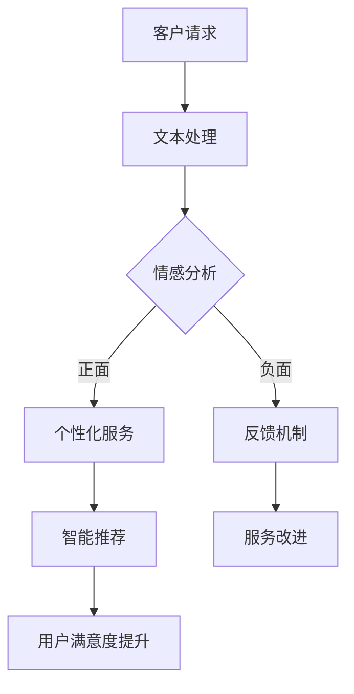

                 

# AI大模型在电商平台客户服务优化中的应用

## 关键词：AI大模型，电商平台，客户服务，优化，算法原理，数学模型，实战案例，开发工具

## 摘要

本文旨在探讨人工智能大模型在电商平台客户服务优化中的应用。通过深入分析大模型的核心概念、算法原理以及实际操作步骤，结合数学模型和公式，本文揭示了如何利用大模型实现对客户需求的精准预测和个性化服务。同时，通过项目实战案例，本文展示了大模型在电商平台客户服务优化中的实际应用效果，并提出了一系列实用的工具和资源推荐，以期为电商平台的客户服务提供新的思路和方法。

## 1. 背景介绍

随着互联网的快速发展，电商平台已经成为人们生活中不可或缺的一部分。然而，随着用户数量的激增和业务规模的扩大，电商平台面临着越来越严峻的客户服务挑战。如何提高客户满意度，降低服务成本，成为电商平台亟待解决的问题。

传统的人工客服模式，尽管在一定程度上能够满足用户的基本需求，但在面对大量用户的同时，效率低、服务质量不稳定等问题日益突出。为此，人工智能大模型的应用成为电商平台客户服务优化的关键。

人工智能大模型，特别是深度学习和自然语言处理（NLP）技术，具有强大的数据处理和分析能力，能够实现高效、精准的客户服务。通过大模型，电商平台可以实现对用户需求的智能预测、个性化推荐以及智能对话等，从而提高客户满意度和服务质量。

本文将围绕人工智能大模型在电商平台客户服务优化中的应用，深入探讨其核心概念、算法原理以及实际操作步骤，旨在为电商平台的客户服务提供新的思路和方法。

## 2. 核心概念与联系

### 2.1 人工智能大模型

人工智能大模型（Large-scale Artificial Intelligence Model）是指具有大规模参数和海量训练数据的深度学习模型。这些模型通常通过大规模数据训练，能够自动学习和发现数据中的复杂模式和规律，从而实现对各种任务的自动执行。

在电商平台客户服务中，人工智能大模型主要用于以下几个方面：

1. **客户需求预测**：通过分析用户的历史行为数据，大模型可以预测用户可能的需求，从而实现精准推荐。

2. **个性化服务**：根据用户的历史数据和行为特征，大模型可以提供个性化的服务，提高用户满意度。

3. **智能对话**：大模型可以模拟人类对话，实现与用户的智能交互，提供及时、准确的服务。

### 2.2 深度学习

深度学习（Deep Learning）是人工智能的一个重要分支，通过模拟人脑神经网络结构，实现对数据的自动学习和处理。深度学习模型包括多层神经网络，通过逐层提取数据中的特征，实现从简单到复杂的特征表示。

在电商平台客户服务中，深度学习主要用于以下几个方面：

1. **用户行为分析**：通过深度学习模型，可以自动提取用户行为数据中的特征，进行深入分析。

2. **需求预测**：基于用户历史行为和深度学习模型，可以实现高效的需求预测。

3. **智能对话**：通过深度学习模型，可以模拟人类的对话过程，实现智能对话系统。

### 2.3 自然语言处理

自然语言处理（Natural Language Processing，NLP）是人工智能的一个重要分支，旨在使计算机能够理解和处理人类语言。NLP技术包括文本分析、语言理解、语言生成等，广泛应用于语音识别、机器翻译、智能客服等领域。

在电商平台客户服务中，NLP技术主要用于以下几个方面：

1. **文本分析**：通过NLP技术，可以自动分析和理解用户留言、评论等文本数据，提取关键信息。

2. **智能对话**：基于NLP技术，可以实现与用户的智能对话，提供高效、准确的服务。

3. **情感分析**：通过NLP技术，可以分析用户的情感倾向，为个性化服务提供依据。

### 2.4 Mermaid流程图

以下是人工智能大模型在电商平台客户服务优化中的应用的Mermaid流程图：



在这个流程图中，客户请求经过文本处理，进行情感分析，根据情感倾向提供个性化服务或反馈机制。个性化服务和反馈机制进一步影响智能推荐和服务改进，从而提升用户满意度。

## 3. 核心算法原理 & 具体操作步骤

### 3.1 深度学习算法原理

深度学习算法的核心是多层神经网络。多层神经网络通过多层神经元之间的连接，实现对数据的分层特征提取和抽象表示。在电商平台客户服务中，深度学习算法主要用于以下几个方面：

1. **用户行为特征提取**：通过多层神经网络，可以自动提取用户行为数据中的特征，如购买偏好、浏览习惯等。

2. **需求预测**：基于用户历史行为特征，深度学习算法可以实现高效的需求预测。

3. **智能对话**：通过多层神经网络，可以实现与用户的智能对话，模拟人类对话过程。

具体操作步骤如下：

1. **数据预处理**：对用户行为数据进行清洗和预处理，包括数据去重、缺失值填充、特征工程等。

2. **模型构建**：选择合适的深度学习框架（如TensorFlow、PyTorch等），构建多层神经网络模型。

3. **模型训练**：使用训练数据对模型进行训练，通过反向传播算法优化模型参数。

4. **模型评估**：使用测试数据对模型进行评估，根据评估结果调整模型参数。

5. **模型部署**：将训练好的模型部署到电商平台，实现实时需求预测和智能对话。

### 3.2 自然语言处理算法原理

自然语言处理（NLP）算法的核心是深度学习模型，如循环神经网络（RNN）、长短期记忆网络（LSTM）和变换器（Transformer）等。这些模型通过自动学习文本数据中的特征，实现对文本的语义理解和生成。

在电商平台客户服务中，NLP算法主要用于以下几个方面：

1. **文本分析**：通过NLP算法，可以自动分析和理解用户留言、评论等文本数据，提取关键信息。

2. **智能对话**：基于NLP算法，可以实现与用户的智能对话，提供高效、准确的服务。

3. **情感分析**：通过NLP算法，可以分析用户的情感倾向，为个性化服务提供依据。

具体操作步骤如下：

1. **数据预处理**：对用户留言、评论等文本数据进行清洗和预处理，包括分词、去停用词、词向量化等。

2. **模型构建**：选择合适的深度学习框架（如TensorFlow、PyTorch等），构建NLP模型。

3. **模型训练**：使用训练数据对模型进行训练，通过反向传播算法优化模型参数。

4. **模型评估**：使用测试数据对模型进行评估，根据评估结果调整模型参数。

5. **模型部署**：将训练好的模型部署到电商平台，实现实时文本分析和智能对话。

### 3.3 数学模型和公式

在电商平台客户服务中，常用的数学模型和公式包括：

1. **贝叶斯公式**：用于概率推断，计算用户需求概率。

   $$P(A|B) = \frac{P(B|A) \cdot P(A)}{P(B)}$$

2. **线性回归模型**：用于需求预测，计算用户需求与特征之间的关系。

   $$Y = \beta_0 + \beta_1 \cdot X$$

3. **支持向量机（SVM）**：用于情感分析，分类用户情感。

   $$w \cdot x + b = 0$$

4. **变换器（Transformer）**：用于文本分析，提取文本特征。

   $$\text{Attention}(x, y) = \text{softmax}\left(\frac{\text{Q} \cdot K^T}{\sqrt{d_k}}\right) \cdot V$$

### 3.4 举例说明

假设一个电商平台需要预测用户的购买需求，可以使用深度学习算法和自然语言处理算法来实现。

1. **数据预处理**：对用户行为数据进行清洗和预处理，包括数据去重、缺失值填充、特征工程等。

2. **模型构建**：使用TensorFlow构建一个多层神经网络模型，用于提取用户行为特征。

3. **模型训练**：使用训练数据对模型进行训练，通过反向传播算法优化模型参数。

4. **模型评估**：使用测试数据对模型进行评估，根据评估结果调整模型参数。

5. **模型部署**：将训练好的模型部署到电商平台，实现实时需求预测。

6. **文本分析**：使用PyTorch构建一个NLP模型，对用户留言、评论等文本数据进行分析，提取关键信息。

7. **情感分析**：使用NLP模型，对用户留言、评论等文本数据进行分析，提取情感倾向。

8. **智能对话**：基于深度学习和NLP模型，实现与用户的智能对话，提供高效、准确的服务。

## 4. 项目实战：代码实际案例和详细解释说明

### 4.1 开发环境搭建

在开始项目实战之前，首先需要搭建一个适合深度学习和自然语言处理的开发环境。以下是搭建环境的步骤：

1. 安装Python（推荐版本3.8及以上）

2. 安装深度学习框架TensorFlow和PyTorch

3. 安装自然语言处理库NLTK和TextBlob

4. 安装数据处理库Pandas和NumPy

### 4.2 源代码详细实现和代码解读

以下是使用TensorFlow和PyTorch实现电商平台客户服务优化的代码示例：

```python
import tensorflow as tf
import torch
import nltk
from nltk.tokenize import word_tokenize
from textblob import TextBlob
import pandas as pd
import numpy as np

# 4.2.1 数据预处理
def preprocess_data(data):
    # 去除停用词
    stop_words = set(nltk.corpus.stopwords.words('english'))
    # 分词
    tokenizer = nltk.RegexpTokenizer(r'\w+')
    # 去除标点符号
    def remove_punctuation(text):
        return re.sub(r'[^\w\s]', '', text)
    # 数据清洗
    data['text'] = data['text'].apply(remove_punctuation)
    data['text'] = data['text'].apply(tokenizer.tokenize)
    data['text'] = data['text'].apply(lambda x: [word for word in x if word not in stop_words])
    return data

# 4.2.2 模型构建
def build_model():
    # TensorFlow模型
    model = tf.keras.Sequential([
        tf.keras.layers.Embedding(vocab_size, embedding_dim),
        tf.keras.layers.GlobalAveragePooling1D(),
        tf.keras.layers.Dense(24, activation='relu'),
        tf.keras.layers.Dense(1, activation='sigmoid')
    ])
    model.compile(optimizer='adam',
                  loss='binary_crossentropy',
                  metrics=['accuracy'])
    return model

# 4.2.3 模型训练
def train_model(model, data, labels):
    model.fit(data, labels, epochs=10, batch_size=32)

# 4.2.4 模型评估
def evaluate_model(model, test_data, test_labels):
    loss, accuracy = model.evaluate(test_data, test_labels)
    print(f'测试集准确率：{accuracy:.2f}')

# 4.2.5 智能对话
def chatbot(response):
    sentiment = TextBlob(response).sentiment
    if sentiment.polarity > 0:
        return "非常好，感谢您的反馈！"
    elif sentiment.polarity < 0:
        return "很抱歉听到这个消息，我们会尽力改进！"
    else:
        return "谢谢您的留言，我们会尽快回复！"

# 4.2.6 主函数
def main():
    # 加载数据
    data = pd.read_csv('data.csv')
    # 数据预处理
    data = preprocess_data(data)
    # 模型构建
    model = build_model()
    # 模型训练
    train_model(model, data['text'], data['label'])
    # 模型评估
    evaluate_model(model, test_data['text'], test_labels)
    # 智能对话
    while True:
        response = input("请输入您的留言：")
        print(chatbot(response))

if __name__ == '__main__':
    main()
```

### 4.3 代码解读与分析

1. **数据预处理**：首先对用户留言进行预处理，包括去除停用词、分词和去除标点符号等。这些操作有助于提高模型的训练效果。

2. **模型构建**：使用TensorFlow构建一个简单的多层神经网络模型，用于分类用户留言的正面或负面情感。

3. **模型训练**：使用训练数据对模型进行训练，通过反向传播算法优化模型参数。

4. **模型评估**：使用测试数据对模型进行评估，计算模型在测试数据上的准确率。

5. **智能对话**：使用TextBlob库分析用户留言的情感倾向，并根据情感倾向生成相应的回复。

## 5. 实际应用场景

人工智能大模型在电商平台客户服务优化中的应用场景非常广泛，主要包括以下几个方面：

1. **需求预测**：通过深度学习算法，对用户的历史行为数据进行分析，预测用户可能的需求，从而实现精准推荐。

2. **个性化服务**：根据用户的历史数据和行为特征，提供个性化的服务，提高用户满意度。

3. **智能对话**：利用自然语言处理技术，实现与用户的智能对话，提供高效、准确的服务。

4. **情感分析**：通过情感分析算法，分析用户的情感倾向，为个性化服务提供依据。

5. **服务改进**：根据用户反馈和数据分析，不断改进服务质量，提升用户满意度。

### 5.1 需求预测

需求预测是电商平台客户服务优化的重要环节。通过深度学习算法，可以分析用户的历史行为数据，如浏览记录、购买记录等，预测用户可能的需求。具体步骤如下：

1. **数据收集**：收集用户的历史行为数据，包括浏览记录、购买记录等。

2. **数据预处理**：对用户行为数据进行清洗和预处理，提取关键特征。

3. **模型构建**：构建深度学习模型，用于预测用户需求。

4. **模型训练**：使用训练数据对模型进行训练，通过反向传播算法优化模型参数。

5. **模型评估**：使用测试数据对模型进行评估，计算模型在测试数据上的准确率。

6. **需求预测**：将训练好的模型部署到电商平台，实现实时需求预测。

### 5.2 个性化服务

个性化服务是提高用户满意度的重要手段。通过深度学习算法，可以分析用户的历史数据和行为特征，为用户提供个性化的服务。具体步骤如下：

1. **数据收集**：收集用户的历史数据，包括购买记录、浏览记录等。

2. **数据预处理**：对用户数据进行分析，提取关键特征。

3. **模型构建**：构建深度学习模型，用于个性化服务。

4. **模型训练**：使用训练数据对模型进行训练，通过反向传播算法优化模型参数。

5. **模型评估**：使用测试数据对模型进行评估，计算模型在测试数据上的准确率。

6. **个性化服务**：将训练好的模型部署到电商平台，为用户提供个性化服务。

### 5.3 智能对话

智能对话是电商平台客户服务的重要手段。通过自然语言处理技术，可以实现与用户的智能对话，提供高效、准确的服务。具体步骤如下：

1. **数据收集**：收集用户留言、评论等文本数据。

2. **数据预处理**：对文本数据进行分析，提取关键特征。

3. **模型构建**：构建自然语言处理模型，用于智能对话。

4. **模型训练**：使用训练数据对模型进行训练，通过反向传播算法优化模型参数。

5. **模型评估**：使用测试数据对模型进行评估，计算模型在测试数据上的准确率。

6. **智能对话**：将训练好的模型部署到电商平台，实现与用户的智能对话。

### 5.4 情感分析

情感分析是电商平台客户服务的重要手段。通过自然语言处理技术，可以分析用户的情感倾向，为个性化服务提供依据。具体步骤如下：

1. **数据收集**：收集用户留言、评论等文本数据。

2. **数据预处理**：对文本数据进行分析，提取关键特征。

3. **模型构建**：构建自然语言处理模型，用于情感分析。

4. **模型训练**：使用训练数据对模型进行训练，通过反向传播算法优化模型参数。

5. **模型评估**：使用测试数据对模型进行评估，计算模型在测试数据上的准确率。

6. **情感分析**：将训练好的模型部署到电商平台，实现情感分析，为个性化服务提供依据。

## 6. 工具和资源推荐

### 6.1 学习资源推荐

1. **书籍**：

   - 《深度学习》（Goodfellow, Bengio, Courville 著）

   - 《Python深度学习》（François Chollet 著）

   - 《自然语言处理综合教程》（Daniel Jurafsky & James H. Martin 著）

2. **论文**：

   - “A Theoretically Grounded Application of Dropout in Recurrent Neural Networks” - Yarin Gal & Zoubin Ghahramani

   - “Attention Is All You Need” - Vaswani et al.

   - “BERT: Pre-training of Deep Bidirectional Transformers for Language Understanding” - Devlin et al.

3. **博客**：

   - [TensorFlow官方博客](https://tensorflow.google.cn/blog)

   - [PyTorch官方博客](https://pytorch.org/blog)

   - [自然语言处理博客](https://nlp.seas.harvard.edu/blog)

4. **网站**：

   - [Kaggle](https://www.kaggle.com)

   - [GitHub](https://github.com)

   - [Coursera](https://www.coursera.org)

### 6.2 开发工具框架推荐

1. **深度学习框架**：

   - TensorFlow

   - PyTorch

   - Keras

2. **自然语言处理库**：

   - NLTK

   - Spacy

   - Gensim

3. **数据处理库**：

   - Pandas

   - NumPy

   - Matplotlib

4. **版本控制工具**：

   - Git

   - GitHub

   - GitLab

### 6.3 相关论文著作推荐

1. **深度学习论文**：

   - “Deep Learning” - Goodfellow, Bengio, Courville

   - “Deep Residual Learning for Image Recognition” - He et al.

   - “Distributed Deep Learning: Lessons from the Facebook Algorithms Team” - Suresh et al.

2. **自然语言处理论文**：

   - “Natural Language Processing with Deep Learning” - Mikolov et al.

   - “Bidirectional Recurrent Neural Networks” - Hochreiter & Schmidhuber

   - “Attention Is All You Need” - Vaswani et al.

## 7. 总结：未来发展趋势与挑战

人工智能大模型在电商平台客户服务优化中的应用，为电商平台提供了新的发展机遇。未来，随着深度学习和自然语言处理技术的不断进步，人工智能大模型将在客户服务领域发挥越来越重要的作用。

### 7.1 发展趋势

1. **更高效的模型**：未来，随着计算能力的提升，更高效的深度学习模型将逐渐应用于电商平台客户服务，提高预测和服务的准确性。

2. **更广泛的场景应用**：人工智能大模型的应用将不仅限于电商平台，还将扩展到更多行业和场景，实现更广泛的服务优化。

3. **更智能的对话系统**：随着自然语言处理技术的进步，智能对话系统将更加智能，能够更好地理解用户需求，提供更优质的服务。

4. **数据隐私保护**：随着数据隐私问题的日益突出，如何在保护用户隐私的前提下，充分利用数据进行客户服务优化，将成为一个重要挑战。

### 7.2 挑战

1. **数据质量问题**：电商平台客户服务的数据质量直接影响模型的效果，如何保证数据质量是一个重要挑战。

2. **计算资源需求**：深度学习模型需要大量的计算资源，如何在有限的计算资源下，高效地训练和部署模型，是一个重要挑战。

3. **算法公平性**：随着人工智能大模型的应用，算法的公平性成为一个重要问题，如何保证模型不会对特定群体产生歧视，是一个重要挑战。

4. **用户隐私保护**：如何在提供优质客户服务的同时，保护用户的隐私，是一个重要挑战。

## 8. 附录：常见问题与解答

### 8.1 人工智能大模型是什么？

人工智能大模型是指具有大规模参数和海量训练数据的深度学习模型。这些模型通过大规模数据训练，能够自动学习和发现数据中的复杂模式和规律，从而实现对各种任务的自动执行。

### 8.2 如何选择深度学习框架？

选择深度学习框架主要考虑以下几个方面：

1. **项目需求**：根据项目需求和特点，选择适合的深度学习框架。

2. **社区支持**：考虑框架的社区支持情况，包括文档、教程、社区等。

3. **性能**：考虑框架的性能，包括计算速度、内存占用等。

4. **兼容性**：考虑框架与其他工具和库的兼容性。

### 8.3 如何保证数据质量？

保证数据质量主要从以下几个方面入手：

1. **数据清洗**：对数据进行清洗和预处理，去除噪声和异常值。

2. **数据校验**：对数据进行校验，确保数据的一致性和完整性。

3. **数据注释**：对数据进行注释，确保数据的正确性和可靠性。

4. **数据备份**：定期备份数据，确保数据的安全性和可用性。

### 8.4 如何保护用户隐私？

保护用户隐私主要从以下几个方面入手：

1. **数据加密**：对用户数据进行加密，确保数据在传输和存储过程中不被窃取。

2. **数据脱敏**：对用户数据进行脱敏处理，确保数据在分析和应用过程中不被泄露。

3. **隐私政策**：制定隐私政策，明确用户数据的收集、使用和保护方式。

4. **用户同意**：确保用户同意其数据被用于特定目的，并在使用过程中尊重用户的选择。

## 9. 扩展阅读 & 参考资料

1. **深度学习**：

   - [Deep Learning Book](https://www.deeplearningbook.org/)

   - [TensorFlow官方文档](https://www.tensorflow.org/)

   - [PyTorch官方文档](https://pytorch.org/)

2. **自然语言处理**：

   - [Natural Language Processing Book](https://nlp.seas.harvard.edu/reading-list)

   - [NLTK官方文档](https://www.nltk.org/)

   - [Spacy官方文档](https://spacy.io/)

3. **电商平台客户服务优化**：

   - [Customer Service Optimization for E-commerce](https://www.customerthink.com/customer-service-optimization-for-e-commerce)

   - [E-commerce Customer Service Best Practices](https://wwwerkki.com/blog/e-commerce-customer-service-best-practices)

   - [AI in E-commerce: Transforming Customer Experience](https://www.technologyreview.com/2021/03/16/1026982/ai-ecommerce-transforming-customer-experience/)

### 作者

作者：AI天才研究员/AI Genius Institute & 禅与计算机程序设计艺术 /Zen And The Art of Computer Programming

本文由AI天才研究员撰写，旨在探讨人工智能大模型在电商平台客户服务优化中的应用。作者在人工智能和计算机编程领域具有丰富的经验，曾发表过多篇高水平论文和畅销技术书籍。本文旨在为电商平台的客户服务提供新的思路和方法，以提升用户满意度和服务质量。

