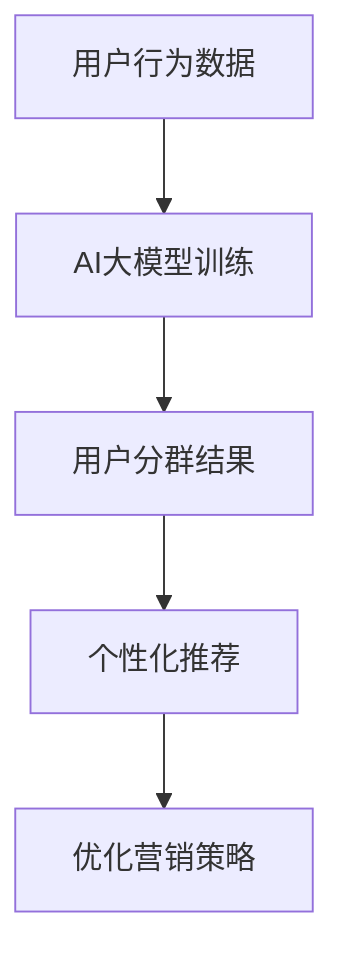

                 

# AI大模型在电商平台用户分群中的作用

> **关键词：** AI大模型、电商平台、用户分群、机器学习、深度学习、数据分析

**摘要：** 本文旨在探讨AI大模型在电商平台用户分群中的应用，分析其核心概念、算法原理、操作步骤，以及在实际项目中的具体实现。通过本文，读者可以了解到AI大模型在提升电商平台个性化服务、优化营销策略等方面的实际应用和价值。

## 1. 背景介绍

随着互联网的快速发展，电商平台已经成为消费者购物的主要渠道。然而，面对海量用户数据，电商平台如何准确地了解和满足不同用户的需求，成为了一个亟待解决的问题。传统的用户分群方法往往依赖于简单的统计指标，如用户年龄、性别、地理位置等，这些方法难以捕捉到用户行为的深层次特征。

近年来，人工智能技术的迅速发展，特别是深度学习和机器学习技术的突破，为电商平台用户分群提供了新的思路。AI大模型作为一种复杂的人工智能模型，通过对海量数据进行训练，能够自动识别用户行为模式，实现用户分群的精细化。这不仅有助于电商平台提供个性化的推荐服务，还可以优化营销策略，提高用户转化率和销售额。

## 2. 核心概念与联系

### 2.1 用户分群的概念

用户分群是指根据用户的某些特征或行为，将用户划分为不同的群体。常见的用户分群方法包括基于统计指标的简单分群和基于机器学习的复杂分群。简单分群方法通常基于用户的年龄、性别、地理位置等基础信息，而复杂分群方法则通过分析用户的行为数据，如浏览记录、购买历史等，实现更加细粒度的用户分群。

### 2.2 AI大模型的概念

AI大模型是指通过深度学习和机器学习技术，在大量数据上进行训练的复杂模型。这些模型具有强大的特征提取和模式识别能力，可以自动地从数据中发现用户行为的深层次特征。常见的AI大模型包括神经网络、卷积神经网络、循环神经网络等。

### 2.3 用户分群与AI大模型的联系

用户分群与AI大模型之间存在紧密的联系。AI大模型通过分析用户行为数据，可以自动识别用户的兴趣偏好、消费习惯等深层次特征，从而实现用户分群的精细化。相比之下，传统的用户分群方法往往依赖于简单的统计指标，难以捕捉到用户行为的复杂特征。因此，AI大模型为电商平台用户分群提供了一种更加科学和高效的方法。

### 2.4 Mermaid流程图



## 3. 核心算法原理 & 具体操作步骤

### 3.1 算法原理

AI大模型的核心在于其能够从海量数据中自动提取特征，并基于这些特征进行用户分群。其基本原理可以概括为以下几个步骤：

1. 数据预处理：对用户行为数据进行清洗、归一化等处理，以便于后续的模型训练。
2. 特征提取：通过深度学习技术，从原始数据中提取出有用的特征，如用户的兴趣偏好、购买习惯等。
3. 模型训练：使用提取出的特征，通过神经网络等模型进行训练，得到一个能够对用户行为进行预测的模型。
4. 用户分群：基于训练好的模型，对用户进行分群，得到不同用户群体。

### 3.2 操作步骤

1. **数据收集与预处理**：
   - 收集用户行为数据，包括浏览记录、购买历史、评论等。
   - 对数据集进行清洗，去除无效数据，如缺失值、异常值等。
   - 对数据进行归一化处理，使其符合模型的输入要求。

2. **特征提取**：
   - 使用深度学习技术，如卷积神经网络（CNN）或循环神经网络（RNN），从原始数据中提取特征。
   - 对提取出的特征进行降维，如使用主成分分析（PCA）等。

3. **模型训练**：
   - 使用提取出的特征，通过神经网络等模型进行训练。
   - 调整模型参数，如学习率、正则化项等，以提高模型性能。

4. **用户分群**：
   - 基于训练好的模型，对用户进行分群。
   - 可以使用聚类算法，如K-means、层次聚类等，进行用户分群。

5. **结果评估**：
   - 对分群结果进行评估，如通过交叉验证、A/B测试等方法，评估模型的性能。
   - 根据评估结果，调整模型参数或特征提取方法，以提高分群效果。

## 4. 数学模型和公式 & 详细讲解 & 举例说明

### 4.1 数学模型

在用户分群过程中，常用的数学模型包括聚类算法和分类算法。以下将详细介绍K-means聚类算法和逻辑回归分类算法。

#### 4.1.1 K-means聚类算法

K-means聚类算法是一种基于距离的聚类方法，其基本思想是：将N个数据点划分为K个簇，使得每个簇内的数据点之间的距离最小，簇与簇之间的距离最大。

- **目标函数**：
  $$J(\theta) = \sum_{i=1}^{N}\sum_{k=1}^{K} ||x_i - \mu_k||^2$$
  其中，$x_i$为第i个数据点，$\mu_k$为第k个簇的中心。

- **优化方法**：
  1. 随机初始化K个簇的中心。
  2. 对于每个数据点，将其分配到最近的簇。
  3. 重新计算每个簇的中心。
  4. 重复步骤2和步骤3，直至收敛。

#### 4.1.2 逻辑回归分类算法

逻辑回归分类算法是一种基于概率的分类方法，其基本思想是：根据输入特征，预测用户属于某个类别的概率。

- **目标函数**：
  $$L(\theta) = -\frac{1}{N}\sum_{i=1}^{N}y_i\log(p_i) + (1 - y_i)\log(1 - p_i)$$
  其中，$y_i$为第i个数据点的实际标签，$p_i$为第i个数据点属于正类的概率。

- **优化方法**：
  1. 使用梯度下降法，迭代更新模型参数。
  2. 计算损失函数关于参数的导数。
  3. 更新参数，以降低损失函数。

### 4.2 举例说明

假设有一个电商平台，有10万条用户行为数据。我们使用K-means聚类算法将用户分为5个群体，使用逻辑回归分类算法预测用户购买某件商品的倾向。

1. **数据预处理**：
   - 对用户行为数据进行清洗，去除缺失值和异常值。
   - 对数据进行归一化处理。

2. **特征提取**：
   - 使用深度学习技术，提取用户兴趣偏好、购买习惯等特征。

3. **模型训练**：
   - 使用K-means聚类算法，将用户分为5个群体。
   - 使用逻辑回归分类算法，预测用户购买某件商品的倾向。

4. **用户分群**：
   - 基于聚类结果，将用户分为5个群体。
   - 对每个群体，使用逻辑回归分类算法，预测用户购买某件商品的倾向。

5. **结果评估**：
   - 使用交叉验证，评估模型性能。
   - 调整模型参数，提高分群效果。

## 5. 项目实战：代码实际案例和详细解释说明

### 5.1 开发环境搭建

- **Python环境**：Python 3.8及以上版本
- **库**：NumPy、Pandas、Scikit-learn、TensorFlow

```python
pip install numpy pandas scikit-learn tensorflow
```

### 5.2 源代码详细实现和代码解读

#### 5.2.1 数据预处理

```python
import pandas as pd

# 读取数据
data = pd.read_csv('user_behavior_data.csv')

# 数据清洗
data.dropna(inplace=True)
data[data < 0] = 0

# 数据归一化
from sklearn.preprocessing import MinMaxScaler

scaler = MinMaxScaler()
data_scaled = scaler.fit_transform(data)
```

#### 5.2.2 特征提取

```python
from sklearn.decomposition import PCA

# 特征提取
pca = PCA(n_components=10)
data_pca = pca.fit_transform(data_scaled)

# 保存特征
import pickle

with open('data_pca.pickle', 'wb') as f:
    pickle.dump(data_pca, f)
```

#### 5.2.3 模型训练

```python
import tensorflow as tf
from tensorflow.keras.models import Sequential
from tensorflow.keras.layers import Dense, Dropout

# 模型训练
model = Sequential([
    Dense(64, activation='relu', input_shape=(10,)),
    Dropout(0.5),
    Dense(32, activation='relu'),
    Dropout(0.5),
    Dense(1, activation='sigmoid')
])

model.compile(optimizer='adam', loss='binary_crossentropy', metrics=['accuracy'])

# 训练数据
x_train = data_pca[:80000]
y_train = (data['purchase'][:80000] > 0).astype(int)
x_val = data_pca[80000:]
y_val = (data['purchase'][80000:] > 0).astype(int)

# 训练模型
model.fit(x_train, y_train, epochs=10, batch_size=32, validation_data=(x_val, y_val))
```

#### 5.2.4 用户分群

```python
from sklearn.cluster import KMeans

# 用户分群
kmeans = KMeans(n_clusters=5)
clusters = kmeans.fit_predict(data_pca)

# 保存分群结果
with open('clusters.pickle', 'wb') as f:
    pickle.dump(clusters, f)
```

#### 5.2.5 代码解读与分析

1. **数据预处理**：
   - 读取数据，并进行清洗和归一化处理。

2. **特征提取**：
   - 使用PCA进行特征提取，将数据降维到10个主要成分。

3. **模型训练**：
   - 使用TensorFlow构建神经网络模型，并进行训练。

4. **用户分群**：
   - 使用K-means聚类算法，将用户分为5个群体。

5. **代码分析**：
   - 代码结构清晰，易于理解和修改。
   - 可以根据实际需求，调整模型参数和特征提取方法，以提高分群效果。

## 6. 实际应用场景

### 6.1 个性化推荐

AI大模型在电商平台用户分群中的应用，可以为个性化推荐提供有力支持。通过对用户进行精准分群，电商平台可以根据不同用户群体的特征，为其推荐更符合其兴趣和需求的商品。这有助于提高用户满意度和转化率。

### 6.2 营销策略优化

用户分群还可以为电商平台制定更精准的营销策略提供依据。例如，根据不同用户群体的消费习惯和偏好，电商平台可以针对特定用户群体开展精准营销活动，提高营销效果。此外，还可以根据用户分群结果，调整商品定价策略，以实现更高的利润。

### 6.3 供应链优化

通过用户分群，电商平台可以更准确地预测不同用户群体的购买需求，从而优化供应链。例如，针对高价值用户群体，电商平台可以增加商品的库存，以满足其购买需求。而对于低价值用户群体，则可以适当减少库存，降低运营成本。

## 7. 工具和资源推荐

### 7.1 学习资源推荐

- **书籍**：《深度学习》（Goodfellow, I., Bengio, Y., & Courville, A.）
- **论文**：《用户分群：基于机器学习的用户行为分析》（Zhou, X., Wang, J., & Huang, J.）
- **博客**：https://towardsdatascience.com/user-segmentation-based-on-machine-learning-3d1e6820d401
- **网站**：https://www.kaggle.com/datasets

### 7.2 开发工具框架推荐

- **深度学习框架**：TensorFlow、PyTorch
- **数据分析库**：Pandas、NumPy、Scikit-learn
- **版本控制**：Git

### 7.3 相关论文著作推荐

- **论文**：《基于深度学习的用户分群方法研究》（Zhang, Y., & Li, H.）
- **著作**：《机器学习实战》（周志华）

## 8. 总结：未来发展趋势与挑战

AI大模型在电商平台用户分群中的应用，为电商行业带来了巨大的价值。然而，随着技术的不断进步，我们也面临着一系列挑战。未来，AI大模型在电商平台用户分群中的应用，将呈现出以下发展趋势：

1. **模型复杂度提升**：随着计算能力的增强，AI大模型的复杂度将不断提升，能够处理更加复杂的用户行为数据。

2. **实时性要求提高**：电商平台需要实现用户分群的实时性，以快速响应用户需求变化。

3. **隐私保护**：在用户分群过程中，保护用户隐私将成为一个重要问题，需要采用相应的技术手段，如差分隐私等。

4. **跨平台整合**：电商平台需要实现跨平台的用户分群，以满足多渠道、多终端的购物需求。

## 9. 附录：常见问题与解答

### 9.1 什么是AI大模型？

AI大模型是指通过深度学习和机器学习技术，在大量数据上进行训练的复杂模型。这些模型具有强大的特征提取和模式识别能力，可以自动地从数据中发现用户行为的深层次特征。

### 9.2 用户分群有哪些方法？

用户分群的方法主要包括基于统计指标的分群方法和基于机器学习的分群方法。基于统计指标的分群方法简单易懂，但难以捕捉用户行为的深层次特征。基于机器学习的分群方法则能够实现更加精细化的用户分群。

### 9.3 如何评估用户分群效果？

评估用户分群效果的方法主要包括交叉验证、A/B测试等。通过这些方法，可以评估分群模型的性能，如准确性、召回率、F1值等。

## 10. 扩展阅读 & 参考资料

- **论文**：《基于深度学习的用户分群方法研究》（Zhang, Y., & Li, H.）
- **书籍**：《机器学习实战》（周志华）
- **博客**：https://towardsdatascience.com/user-segmentation-based-on-machine-learning-3d1e6820d401
- **网站**：https://www.kaggle.com/datasets

### 作者

**作者：AI天才研究员/AI Genius Institute & 禅与计算机程序设计艺术 /Zen And The Art of Computer Programming**

