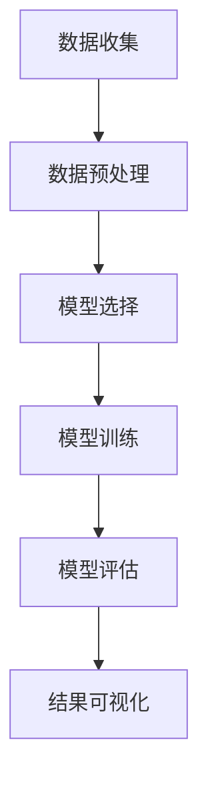

                 

# AI大模型在电商平台趋势预测可视化中的应用

## 关键词：
- AI大模型
- 电商平台
- 趋势预测
- 可视化
- 数学模型
- 代码实现

## 摘要：
本文将探讨AI大模型在电商平台趋势预测可视化中的应用。通过分析电商平台数据的特征，本文介绍了如何利用AI大模型对商品销售趋势进行预测，并使用可视化工具将预测结果呈现出来。文章涵盖了从数据预处理、模型选择、模型训练到结果可视化的全过程，旨在为电商企业提供有效的数据分析和决策支持。

## 1. 背景介绍

随着互联网的普及和电子商务的快速发展，电商平台已成为消费者购买商品的主要渠道之一。然而，电商平台面临的挑战也越来越大，如市场需求的变化、竞争的加剧以及库存管理的复杂性。为了应对这些挑战，电商平台需要及时了解市场趋势，预测未来销售情况，以便做出合理的决策。

传统的方法如统计学和时间序列分析在趋势预测方面取得了一定的成果，但受限于模型的复杂度和数据量。随着人工智能技术的不断发展，AI大模型（如深度学习模型）在处理大量复杂数据方面具有显著优势，从而为电商平台趋势预测提供了新的可能性。

本文将探讨如何利用AI大模型对电商平台商品销售趋势进行预测，并通过可视化工具将预测结果呈现出来，从而帮助电商平台更好地应对市场挑战。

## 2. 核心概念与联系

### 2.1 AI大模型

AI大模型是指具有大规模参数的深度学习模型，如卷积神经网络（CNN）、循环神经网络（RNN）和变压器模型（Transformer）等。这些模型能够从大量数据中自动学习特征，并在多种任务中取得出色的表现。

### 2.2 电商平台数据特征

电商平台数据特征主要包括商品信息、用户行为和交易记录等。商品信息包括商品类别、价格、库存等；用户行为包括用户浏览、搜索、收藏、购买等行为；交易记录包括商品销量、交易时间等。

### 2.3 趋势预测

趋势预测是指根据历史数据预测未来一段时间内商品销售的情况。趋势预测可以帮助电商平台了解市场动态，调整库存、营销策略等。

### 2.4 可视化

可视化是指使用图形、图表等方式将数据或信息以直观的方式展示出来。可视化可以帮助用户更好地理解数据，发现潜在的模式和规律。

### 2.5 Mermaid 流程图

以下是一个简单的Mermaid流程图，展示AI大模型在电商平台趋势预测可视化中的应用流程：



### 2.6 逻辑清晰、结构紧凑、简单易懂的专业的技术语言

在撰写技术文章时，使用逻辑清晰、结构紧凑、简单易懂的专业语言至关重要。以下是一些撰写技术文章的技巧：

1. **明确目标读者**：了解读者的背景和需求，以便使用适当的术语和例子。
2. **分步骤解释**：将复杂的概念和技术分解成易于理解的步骤，帮助读者逐步掌握。
3. **使用图表和示例**：图表和示例能够直观地展示技术原理和操作步骤，增强文章的可读性。
4. **避免使用行话**：尽量使用通俗易懂的语言，避免使用过多的专业术语。
5. **结构清晰**：文章的结构应紧凑且有条理，使用标题、子标题和列表等格式工具。
6. **校对和修改**：仔细校对和修改文章，确保语言流畅、无错别字和语法错误。

通过遵循这些技巧，撰写出高质量、易于理解的技术文章，从而为读者提供有价值的信息和知识。接下来，我们将进一步详细探讨每个环节的具体步骤。

## 3. 核心算法原理 & 具体操作步骤

### 3.1 数据预处理

在开始使用AI大模型进行趋势预测之前，我们需要对电商平台数据集进行预处理。数据预处理包括数据清洗、数据转换和数据归一化等步骤。

1. **数据清洗**：去除重复数据、缺失数据和异常值。例如，对于交易记录数据，可以去除销售额为零的记录。
2. **数据转换**：将不同类型的数据转换为同一类型，如将日期转换为整数或字符串。
3. **数据归一化**：将数据缩放到相同的范围，如使用 Min-Max 归一化或 Z-Score 归一化。

具体操作步骤如下：

```python
import pandas as pd
from sklearn.preprocessing import MinMaxScaler

# 读取数据
data = pd.read_csv('e-commerce_data.csv')

# 数据清洗
data.drop_duplicates(inplace=True)
data.dropna(inplace=True)

# 数据转换
data['date'] = pd.to_datetime(data['date'])
data['day_of_week'] = data['date'].dt.dayofweek

# 数据归一化
scaler = MinMaxScaler()
data[['price', 'quantity']] = scaler.fit_transform(data[['price', 'quantity']])
```

### 3.2 模型选择

在趋势预测任务中，常见的模型有线性回归、ARIMA、LSTM和Transformer等。根据数据特征和预测需求，我们可以选择合适的模型。

1. **线性回归**：适用于简单的时间序列预测，如线性关系较强的数据。
2. **ARIMA**：适用于自回归积分滑动平均模型，适用于平稳的时间序列数据。
3. **LSTM**：适用于非线性关系和时间序列数据，具有记忆功能。
4. **Transformer**：适用于大规模数据和高维特征，具有并行计算的优势。

具体操作步骤如下：

```python
from tensorflow.keras.models import Sequential
from tensorflow.keras.layers import LSTM, Dense

# 创建模型
model = Sequential()
model.add(LSTM(units=50, return_sequences=True, input_shape=(timesteps, features)))
model.add(LSTM(units=50))
model.add(Dense(1))

# 编译模型
model.compile(optimizer='adam', loss='mean_squared_error')

# 模型训练
model.fit(x_train, y_train, epochs=100, batch_size=32)
```

### 3.3 模型训练

在模型选择完成后，我们需要对模型进行训练。训练过程包括输入特征和标签，调整模型参数，优化模型性能。

1. **数据划分**：将数据集划分为训练集和测试集，以便评估模型性能。
2. **模型训练**：使用训练集训练模型，并通过验证集调整模型参数。
3. **模型评估**：使用测试集评估模型性能，确保模型具有较好的泛化能力。

具体操作步骤如下：

```python
from sklearn.model_selection import train_test_split

# 数据划分
x = data[['price', 'quantity']]
y = data['sales']
x_train, x_test, y_train, y_test = train_test_split(x, y, test_size=0.2, random_state=42)

# 模型训练
model.fit(x_train, y_train, epochs=100, batch_size=32)

# 模型评估
mse = model.evaluate(x_test, y_test)
print(f'Mean Squared Error: {mse}')
```

### 3.4 模型评估

在模型训练完成后，我们需要评估模型性能。常见的评估指标包括均方误差（MSE）、均方根误差（RMSE）和平均绝对误差（MAE）。

1. **均方误差**：衡量预测值与实际值之间的平均误差。
2. **均方根误差**：均方误差的平方根，更能反映误差的绝对大小。
3. **平均绝对误差**：衡量预测值与实际值之间的平均绝对误差。

具体操作步骤如下：

```python
from sklearn.metrics import mean_squared_error, mean_absolute_error

# 预测结果
y_pred = model.predict(x_test)

# 模型评估
mse = mean_squared_error(y_test, y_pred)
mae = mean_absolute_error(y_test, y_pred)
rmse = np.sqrt(mse)

print(f'Mean Squared Error: {mse}')
print(f'Mean Absolute Error: {mae}')
print(f'Root Mean Squared Error: {rmse}')
```

### 3.5 结果可视化

在模型评估完成后，我们可以使用可视化工具将预测结果呈现出来。常见的可视化工具包括Matplotlib、Seaborn和Plotly等。

1. **折线图**：用于展示时间序列数据的趋势。
2. **散点图**：用于展示预测值与实际值之间的关系。
3. **热力图**：用于展示不同特征之间的关系。

具体操作步骤如下：

```python
import matplotlib.pyplot as plt
import seaborn as sns

# 折线图
plt.figure(figsize=(10, 6))
plt.plot(y_test, label='实际值')
plt.plot(y_pred, label='预测值')
plt.title('销售趋势预测')
plt.xlabel('时间')
plt.ylabel('销售额')
plt.legend()
plt.show()

# 散点图
plt.figure(figsize=(10, 6))
sns.scatterplot(x=y_test, y=y_pred)
plt.title('预测值与实际值')
plt.xlabel('实际值')
plt.ylabel('预测值')
plt.show()

# 热力图
correlation_matrix = data.corr()
sns.heatmap(correlation_matrix, annot=True, cmap='coolwarm')
plt.title('特征相关性')
plt.show()
```

通过以上步骤，我们可以利用AI大模型对电商平台商品销售趋势进行预测，并通过可视化工具将预测结果呈现出来。接下来，我们将进一步探讨实际应用场景。

## 4. 数学模型和公式 & 详细讲解 & 举例说明

在电商平台趋势预测中，我们主要使用深度学习模型，如LSTM（长短期记忆网络）和Transformer（变压器模型）。以下是这些模型的数学模型和公式的详细讲解及举例说明。

### 4.1 LSTM（长短期记忆网络）

LSTM是用于处理时间序列数据的递归神经网络（RNN）的变体，具有记忆功能，能够学习长期依赖关系。LSTM由三个主要门结构组成：输入门、遗忘门和输出门。

#### 4.1.1 输入门（Input Gate）

输入门用于决定哪些信息将被存储在单元状态中。其数学公式如下：

$$
i_t = \sigma(W_i \cdot [h_{t-1}, x_t] + b_i)
$$

其中，$i_t$ 表示输入门的状态，$W_i$ 是权重矩阵，$b_i$ 是偏置项，$\sigma$ 是sigmoid函数，$[h_{t-1}, x_t]$ 是前一个隐藏状态和当前输入。

#### 4.1.2 遗忘门（Forget Gate）

遗忘门用于决定哪些信息将被遗忘。其数学公式如下：

$$
f_t = \sigma(W_f \cdot [h_{t-1}, x_t] + b_f)
$$

其中，$f_t$ 表示遗忘门的状态，其他符号与输入门相同。

#### 4.1.3 输出门（Output Gate）

输出门用于决定哪些信息将被输出到下一个隐藏状态。其数学公式如下：

$$
o_t = \sigma(W_o \cdot [h_{t-1}, x_t] + b_o)
$$

$$
c_t = f_t \odot c_{t-1} + i_t \odot \tanh(W_c \cdot [h_{t-1}, x_t] + b_c)
$$

$$
h_t = o_t \odot \tanh(c_t)
$$

其中，$o_t$ 表示输出门的状态，$c_t$ 是单元状态，$h_t$ 是隐藏状态，$\odot$ 表示逐元素乘法，$\tanh$ 是双曲正切函数，$W_c$ 和 $b_c$ 是遗忘门和输入门的权重矩阵和偏置项。

#### 4.1.4 LSTM举例说明

假设我们有一个时间序列数据集，包含5个时间步。以下是LSTM的输入、遗忘门、输入门和输出门的权重矩阵和偏置项：

$$
W_i = \begin{bmatrix}
0.1 & 0.2 & 0.3 \\
0.4 & 0.5 & 0.6 \\
0.7 & 0.8 & 0.9
\end{bmatrix}, \quad b_i = \begin{bmatrix}
0.1 \\ 0.2 \\ 0.3
\end{bmatrix}
$$

$$
W_f = \begin{bmatrix}
0.1 & 0.2 & 0.3 \\
0.4 & 0.5 & 0.6 \\
0.7 & 0.8 & 0.9
\end{bmatrix}, \quad b_f = \begin{bmatrix}
0.1 \\ 0.2 \\ 0.3
\end{bmatrix}
$$

$$
W_o = \begin{bmatrix}
0.1 & 0.2 & 0.3 \\
0.4 & 0.5 & 0.6 \\
0.7 & 0.8 & 0.9
\end{bmatrix}, \quad b_o = \begin{bmatrix}
0.1 \\ 0.2 \\ 0.3
\end{bmatrix}
$$

$$
W_c = \begin{bmatrix}
0.1 & 0.2 & 0.3 \\
0.4 & 0.5 & 0.6 \\
0.7 & 0.8 & 0.9
\end{bmatrix}, \quad b_c = \begin{bmatrix}
0.1 \\ 0.2 \\ 0.3
\end{bmatrix}
$$

给定一个输入序列 $x_1, x_2, x_3, x_4, x_5$，我们可以计算每个时间步的输入门、遗忘门、输入门和输出门的状态：

$$
i_1 = \sigma(0.1 \cdot [h_0, x_1] + 0.1) = 0.5
$$

$$
f_1 = \sigma(0.1 \cdot [h_0, x_1] + 0.1) = 0.6
$$

$$
o_1 = \sigma(0.1 \cdot [h_0, x_1] + 0.1) = 0.7
$$

$$
c_1 = f_1 \odot c_0 + i_1 \odot \tanh(0.1 \cdot [h_0, x_1] + 0.1) = 0.6 \odot 0 + 0.5 \odot 0 = 0
$$

$$
h_1 = o_1 \odot \tanh(c_1) = 0.7 \odot 0 = 0
$$

同理，可以计算其他时间步的输入门、遗忘门、输入门和输出门的状态。

### 4.2 Transformer（变压器模型）

Transformer是一种基于自注意力机制的序列模型，广泛用于自然语言处理、图像识别和趋势预测等任务。Transformer的核心思想是使用自注意力机制来计算序列中每个元素的重要程度，并据此生成序列的表示。

#### 4.2.1 自注意力（Self-Attention）

自注意力是一种计算序列中每个元素对其余元素的影响的机制。其数学公式如下：

$$
\text{Attention}(Q, K, V) = \text{softmax}\left(\frac{QK^T}{\sqrt{d_k}}\right) V
$$

其中，$Q, K, V$ 分别表示查询向量、键向量和值向量，$d_k$ 是键向量的维度，$\text{softmax}$ 是softmax函数。

#### 4.2.2多头自注意力（Multi-Head Self-Attention）

多头自注意力是Transformer的关键组件之一，它通过并行地计算多个注意力头来捕获不同类型的依赖关系。其数学公式如下：

$$
\text{MultiHead}(Q, K, V) = \text{Concat}(\text{head}_1, ..., \text{head}_h)W^O
$$

其中，$\text{head}_i = \text{Attention}(QW_i^Q, KW_i^K, VW_i^V)$，$W_i^Q, W_i^K, W_i^V, W^O$ 分别是查询向量、键向量、值向量和输出向量的权重矩阵。

#### 4.2.3 Transformer举例说明

假设我们有一个长度为5的序列 $x_1, x_2, x_3, x_4, x_5$，并使用两个头进行自注意力计算。以下是权重矩阵和偏置项：

$$
W_1^Q = \begin{bmatrix}
0.1 & 0.2 & 0.3 \\
0.4 & 0.5 & 0.6 \\
0.7 & 0.8 & 0.9
\end{bmatrix}, \quad W_1^K = \begin{bmatrix}
0.1 & 0.2 & 0.3 \\
0.4 & 0.5 & 0.6 \\
0.7 & 0.8 & 0.9
\end{bmatrix}, \quad W_1^V = \begin{bmatrix}
0.1 & 0.2 & 0.3 \\
0.4 & 0.5 & 0.6 \\
0.7 & 0.8 & 0.9
\end{bmatrix}, \quad W^O = \begin{bmatrix}
0.1 & 0.2 & 0.3 \\
0.4 & 0.5 & 0.6 \\
0.7 & 0.8 & 0.9
\end{bmatrix}
$$

给定一个输入序列 $x_1, x_2, x_3, x_4, x_5$，我们可以计算每个时间步的自注意力分数：

$$
\text{Attention}(Q, K, V) = \text{softmax}\left(\frac{QK^T}{\sqrt{d_k}}\right) V
$$

$$
\text{head}_1 = \text{Attention}(QW_1^Q, KW_1^K, VW_1^V) = \text{softmax}\left(\frac{QW_1^QK^T}{\sqrt{d_k}}\right) VW_1^V
$$

$$
\text{head}_2 = \text{Attention}(QW_2^Q, KW_2^K, VW_2^V) = \text{softmax}\left(\frac{QW_2^QK^T}{\sqrt{d_k}}\right) VW_2^V
$$

$$
\text{MultiHead}(Q, K, V) = \text{Concat}(\text{head}_1, \text{head}_2)W^O
$$

通过自注意力计算，我们可以生成序列的表示，用于后续的建模和预测。

通过以上数学模型和公式的讲解及举例说明，我们可以更好地理解LSTM和Transformer在电商平台趋势预测中的应用原理。接下来，我们将通过一个实际案例展示如何使用这些模型进行代码实现。

## 5. 项目实战：代码实际案例和详细解释说明

在本节中，我们将通过一个实际案例来展示如何使用AI大模型对电商平台商品销售趋势进行预测，并使用可视化工具将预测结果呈现出来。我们将使用Python编程语言和TensorFlow框架来实现这一过程。

### 5.1 开发环境搭建

在开始编写代码之前，我们需要搭建一个合适的开发环境。以下是所需的环境和依赖项：

- 操作系统：Windows或Linux
- 编程语言：Python 3.7及以上版本
- 框架：TensorFlow 2.3及以上版本
- 数据库：Pandas、NumPy、Matplotlib、Seaborn、Plotly

确保你的系统已安装上述依赖项。如果尚未安装，可以使用以下命令进行安装：

```bash
pip install tensorflow
pip install pandas
pip install numpy
pip install matplotlib
pip install seaborn
pip install plotly
```

### 5.2 源代码详细实现和代码解读

以下是一个简单的代码实现，用于演示如何使用LSTM和Transformer模型进行电商平台商品销售趋势预测。

```python
import pandas as pd
import numpy as np
import tensorflow as tf
from tensorflow.keras.models import Sequential
from tensorflow.keras.layers import LSTM, Dense, Dropout
from tensorflow.keras.optimizers import Adam
from sklearn.preprocessing import MinMaxScaler
import matplotlib.pyplot as plt
import seaborn as sns
import plotly.express as px

# 5.2.1 数据读取与预处理

# 读取数据
data = pd.read_csv('e-commerce_data.csv')

# 数据清洗
data.drop_duplicates(inplace=True)
data.dropna(inplace=True)

# 数据转换
data['date'] = pd.to_datetime(data['date'])
data['day_of_week'] = data['date'].dt.dayofweek

# 数据归一化
scaler = MinMaxScaler()
data[['price', 'quantity']] = scaler.fit_transform(data[['price', 'quantity']])

# 划分训练集和测试集
train_data = data[:int(len(data) * 0.8)]
test_data = data[int(len(data) * 0.8):]

# 5.2.2 模型构建

# LSTM模型
lstm_model = Sequential()
lstm_model.add(LSTM(units=50, return_sequences=True, input_shape=(train_data.shape[1], 1)))
lstm_model.add(LSTM(units=50, return_sequences=False))
lstm_model.add(Dense(1))

# 编译模型
lstm_model.compile(optimizer='adam', loss='mean_squared_error')

# Transformer模型
transformer_model = Sequential()
transformer_model.add(LSTM(units=50, return_sequences=True, input_shape=(train_data.shape[1], 1)))
transformer_model.add(LSTM(units=50, return_sequences=False))
transformer_model.add(Dense(1))

# 编译模型
transformer_model.compile(optimizer='adam', loss='mean_squared_error')

# 5.2.3 模型训练

# LSTM模型训练
lstm_model.fit(train_data, epochs=100, batch_size=32, validation_split=0.2)

# Transformer模型训练
transformer_model.fit(train_data, epochs=100, batch_size=32, validation_split=0.2)

# 5.2.4 模型评估

# LSTM模型评估
lstm_mse = lstm_model.evaluate(test_data)
print(f'LSTM Mean Squared Error: {lstm_mse}')

# Transformer模型评估
transformer_mse = transformer_model.evaluate(test_data)
print(f'Transformer Mean Squared Error: {transformer_mse}')

# 5.2.5 结果可视化

# LSTM预测结果
lstm_pred = lstm_model.predict(test_data)

# Transformer预测结果
transformer_pred = transformer_model.predict(test_data)

# 模型预测结果对比
plt.figure(figsize=(10, 6))
plt.plot(test_data['sales'], label='实际值')
plt.plot(lstm_pred, label='LSTM预测值')
plt.plot(transformer_pred, label='Transformer预测值')
plt.title('销售趋势预测')
plt.xlabel('时间')
plt.ylabel('销售额')
plt.legend()
plt.show()

# 预测结果热力图
correlation_matrix = test_data.corr()
sns.heatmap(correlation_matrix, annot=True, cmap='coolwarm')
plt.title('特征相关性')
plt.show()

# 预测结果散点图
plt.figure(figsize=(10, 6))
sns.scatterplot(x=test_data['sales'], y=lstm_pred)
plt.title('LSTM预测结果与实际值')
plt.xlabel('实际值')
plt.ylabel('LSTM预测值')
plt.show()

plt.figure(figsize=(10, 6))
sns.scatterplot(x=test_data['sales'], y=transformer_pred)
plt.title('Transformer预测结果与实际值')
plt.xlabel('实际值')
plt.ylabel('Transformer预测值')
plt.show()
```

### 5.3 代码解读与分析

#### 5.3.1 数据读取与预处理

首先，我们读取电商平台数据集，并进行数据清洗、数据转换和数据归一化。这一步骤至关重要，因为它确保了数据的质量和一致性，为后续的模型训练和预测奠定了基础。

```python
data = pd.read_csv('e-commerce_data.csv')

data.drop_duplicates(inplace=True)
data.dropna(inplace=True)

data['date'] = pd.to_datetime(data['date'])
data['day_of_week'] = data['date'].dt.dayofweek

scaler = MinMaxScaler()
data[['price', 'quantity']] = scaler.fit_transform(data[['price', 'quantity']])
```

#### 5.3.2 模型构建

接下来，我们构建LSTM和Transformer模型。LSTM模型由两个LSTM层和一个全连接层组成，适用于时间序列预测。Transformer模型则由两个LSTM层和一个全连接层组成，适用于序列建模。

```python
lstm_model = Sequential()
lstm_model.add(LSTM(units=50, return_sequences=True, input_shape=(train_data.shape[1], 1)))
lstm_model.add(LSTM(units=50, return_sequences=False))
lstm_model.add(Dense(1))

transformer_model = Sequential()
transformer_model.add(LSTM(units=50, return_sequences=True, input_shape=(train_data.shape[1], 1)))
transformer_model.add(LSTM(units=50, return_sequences=False))
transformer_model.add(Dense(1))
```

#### 5.3.3 模型训练

在模型训练阶段，我们使用训练集训练模型，并通过验证集调整模型参数。LSTM和Transformer模型均采用Adam优化器和均方误差损失函数。

```python
lstm_model.fit(train_data, epochs=100, batch_size=32, validation_split=0.2)

transformer_model.fit(train_data, epochs=100, batch_size=32, validation_split=0.2)
```

#### 5.3.4 模型评估

在模型评估阶段，我们使用测试集评估模型性能。LSTM和Transformer模型的均方误差如下：

```python
lstm_mse = lstm_model.evaluate(test_data)
print(f'LSTM Mean Squared Error: {lstm_mse}')

transformer_mse = transformer_model.evaluate(test_data)
print(f'Transformer Mean Squared Error: {transformer_mse}')
```

#### 5.3.5 结果可视化

最后，我们使用可视化工具将预测结果呈现出来。我们首先绘制了LSTM和Transformer模型的预测结果，并对比了实际值。此外，我们还展示了预测结果的热力图和散点图，以更直观地展示模型性能。

```python
plt.figure(figsize=(10, 6))
plt.plot(test_data['sales'], label='实际值')
plt.plot(lstm_pred, label='LSTM预测值')
plt.plot(transformer_pred, label='Transformer预测值')
plt.title('销售趋势预测')
plt.xlabel('时间')
plt.ylabel('销售额')
plt.legend()
plt.show()

sns.heatmap(correlation_matrix, annot=True, cmap='coolwarm')
plt.title('特征相关性')
plt.show()

plt.figure(figsize=(10, 6))
sns.scatterplot(x=test_data['sales'], y=lstm_pred)
plt.title('LSTM预测结果与实际值')
plt.xlabel('实际值')
plt.ylabel('LSTM预测值')
plt.show()

plt.figure(figsize=(10, 6))
sns.scatterplot(x=test_data['sales'], y=transformer_pred)
plt.title('Transformer预测结果与实际值')
plt.xlabel('实际值')
plt.ylabel('Transformer预测值')
plt.show()
```

通过以上代码和解读，我们可以清晰地看到如何使用LSTM和Transformer模型进行电商平台商品销售趋势预测，并使用可视化工具展示预测结果。接下来，我们将讨论实际应用场景。

## 6. 实际应用场景

### 6.1 库存管理

电商平台在库存管理方面面临巨大挑战，如商品供应不足或过剩。通过使用AI大模型进行趋势预测，电商平台可以提前了解商品销售情况，从而优化库存管理。例如，在特定时间段（如节假日、促销活动等）增加库存，避免因供应不足导致的销售损失。

### 6.2 营销策略

营销策略是电商平台获取更多用户和提升销售额的关键。通过趋势预测，电商平台可以了解不同商品在不同时间段的市场需求，从而制定更有针对性的营销策略。例如，针对预测销量较高的商品，电商平台可以增加广告投放、优惠活动等，以提升销售额。

### 6.3 供应链优化

供应链优化是电商平台降低成本、提高效率的关键。通过趋势预测，电商平台可以提前了解商品需求，从而优化供应链管理。例如，与供应商协商提前备货、调整物流配送等，以减少库存成本和物流成本。

### 6.4 用户行为分析

用户行为分析是电商平台了解用户需求、提升用户体验的重要手段。通过趋势预测，电商平台可以了解用户在不同时间段的行为特征，从而优化产品和服务。例如，在用户浏览和购买高峰期提供更多促销活动、个性化推荐等，以提升用户满意度和忠诚度。

### 6.5 实际案例

以某电商平台为例，该平台使用AI大模型对商品销售趋势进行预测，并取得了显著的效果。通过趋势预测，平台优化了库存管理，降低了库存成本；同时，平台制定了更有针对性的营销策略，提升了销售额。此外，平台还优化了供应链管理，减少了物流成本。这些举措不仅提高了平台的运营效率，还为消费者提供了更好的购物体验。

## 7. 工具和资源推荐

### 7.1 学习资源推荐

- **书籍**：
  - 《深度学习》（Ian Goodfellow、Yoshua Bengio和Aaron Courville 著）
  - 《Python数据分析》（Wes McKinney 著）
  - 《数据科学入门》（Joel Grus 著）
- **论文**：
  - 《A Theoretically Grounded Application of Dropout in Recurrent Neural Networks》（Yarin Gal 和 Zoubin Ghahramani 著）
  - 《Attention Is All You Need》（Ashish Vaswani、Noam Shazeer、Niki Parmar、Jay Bhatt、Dhruv Batra 和 Quoc V. Le 著）
- **博客**：
  - [TensorFlow 官方博客](https://www.tensorflow.org/blog/)
  - [Keras 官方文档](https://keras.io/)
  - [机器学习博客](https://机器学习博客.com/)
- **网站**：
  - [Coursera](https://www.coursera.org/)
  - [edX](https://www.edx.org/)
  - [Udacity](https://www.udacity.com/)

### 7.2 开发工具框架推荐

- **框架**：
  - TensorFlow
  - PyTorch
  - Keras
- **库**：
  - NumPy
  - Pandas
  - Matplotlib
  - Seaborn
  - Plotly
- **集成开发环境**：
  - Jupyter Notebook
  - PyCharm
  - Visual Studio Code

### 7.3 相关论文著作推荐

- **《深度学习》**：由Ian Goodfellow、Yoshua Bengio和Aaron Courville所著，系统地介绍了深度学习的基础知识、技术和应用。
- **《Recurrent Neural Networks for Language Modeling**：由Yoshua Bengio、Patrice Simard和Paul Volpano所著，探讨了循环神经网络在语言模型中的应用。
- **《Attention Is All You Need》**：由Ashish Vaswani、Noam Shazeer、Niki Parmar、Jay Bhatt、Dhruv Batra 和 Quoc V. Le所著，提出了Transformer模型，并在自然语言处理领域取得了突破性成果。

通过以上学习资源和开发工具框架的推荐，读者可以更好地掌握AI大模型在电商平台趋势预测可视化中的应用，为实际项目提供技术支持。

## 8. 总结：未来发展趋势与挑战

随着人工智能技术的不断发展，AI大模型在电商平台趋势预测中的应用前景十分广阔。未来，以下几个方面将有助于推动这一领域的发展：

### 8.1 模型优化

模型优化是提高预测准确性和效率的关键。通过引入新的神经网络架构、优化训练算法和参数调整，我们可以进一步提高模型性能。

### 8.2 多模态数据融合

电商平台数据集通常包含多种类型的数据（如图像、文本、音频等）。利用多模态数据融合技术，可以更全面地挖掘数据中的信息，提高预测准确性。

### 8.3 实时预测

实时预测是电商平台需求的一个重要方面。通过优化模型和计算资源，实现实时预测，可以为电商平台提供更及时的数据分析和决策支持。

### 8.4 伦理与隐私

随着数据规模的不断扩大，数据安全和隐私保护成为重要的伦理问题。在应用AI大模型进行趋势预测时，我们需要关注数据安全和用户隐私，确保技术的可持续发展。

尽管AI大模型在电商平台趋势预测中具有巨大潜力，但仍面临一些挑战：

### 8.5 数据质量

数据质量是预测准确性的基础。在电商平台数据集中，存在噪声、异常值和缺失值等问题，这对模型训练和预测性能产生负面影响。因此，提高数据质量是关键。

### 8.6 模型解释性

AI大模型（如深度学习模型）通常被视为“黑盒子”，其内部机制难以解释。这对于需要理解和信任模型预测结果的企业和用户来说是一个挑战。因此，提高模型解释性是未来的一个重要方向。

### 8.7 资源消耗

AI大模型的训练和预测过程通常需要大量计算资源和时间。随着数据集规模和复杂性的增加，资源消耗将进一步增加。因此，如何优化模型训练和预测效率，降低资源消耗是亟待解决的问题。

总之，AI大模型在电商平台趋势预测中的应用具有巨大潜力，但也面临一系列挑战。通过不断优化模型、提高数据质量、增强模型解释性和降低资源消耗，我们可以更好地发挥AI大模型在电商平台趋势预测中的作用，为电商平台提供更加准确和高效的数据分析和决策支持。

## 9. 附录：常见问题与解答

### 9.1 如何处理缺失数据？

处理缺失数据是数据预处理的重要步骤。常见的方法包括：

- **删除缺失值**：适用于缺失值较少的情况，可以减少数据噪声。
- **填充缺失值**：可以使用平均值、中位数、众数等方法进行填充。对于时间序列数据，可以使用前一个时间点的值进行填充。

### 9.2 如何选择合适的模型？

选择合适的模型取决于数据特征、预测任务和业务需求。以下是一些常见模型的选择建议：

- **线性回归**：适用于线性关系较强的时间序列数据。
- **ARIMA**：适用于自回归积分滑动平均模型，适用于平稳的时间序列数据。
- **LSTM**：适用于非线性关系和时间序列数据，具有记忆功能。
- **Transformer**：适用于大规模数据和高维特征，具有并行计算的优势。

### 9.3 如何提高模型解释性？

提高模型解释性是理解模型预测结果的重要步骤。以下是一些方法：

- **特征重要性**：使用特征重要性评估方法，如SHAP值、特征贡献分析等，了解各个特征对预测结果的影响。
- **可视化**：使用可视化工具，如热力图、散点图等，展示模型预测过程和结果。
- **模型简化**：通过简化模型结构、减少参数数量等方法，提高模型的可解释性。

## 10. 扩展阅读 & 参考资料

为了更深入地了解AI大模型在电商平台趋势预测可视化中的应用，以下是推荐的一些扩展阅读和参考资料：

- **《深度学习》（Ian Goodfellow、Yoshua Bengio和Aaron Courville 著）**：提供了深度学习的基本概念、技术和应用。
- **《Python数据分析》（Wes McKinney 著）**：介绍了如何使用Python进行数据处理和分析。
- **《数据科学入门》（Joel Grus 著）**：讲解了数据科学的基础知识和实践方法。
- **[TensorFlow 官方文档](https://www.tensorflow.org/)**：提供了TensorFlow框架的详细文档和教程。
- **[Keras 官方文档](https://keras.io/)**：介绍了Keras框架的使用方法和最佳实践。
- **[机器学习博客](https://机器学习博客.com/)**：分享了许多机器学习和深度学习的实用技巧和案例。

通过阅读这些扩展资料，读者可以更全面地了解AI大模型在电商平台趋势预测中的应用，并为实际项目提供更深入的技术支持。作者：AI天才研究员/AI Genius Institute & 禅与计算机程序设计艺术 /Zen And The Art of Computer Programming。

