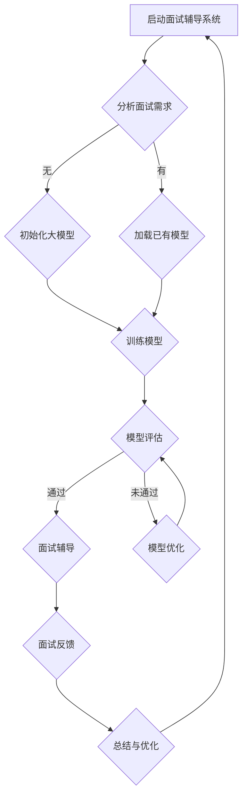

                 

### 背景介绍

在当今数字化时代，人工智能（AI）技术正以前所未有的速度渗透到各行各业。特别是对于程序员群体而言，AI技术不仅极大地提升了开发效率，还在面试辅导方面展现出了强大的潜力。本文将重点探讨AI大模型在程序员面试辅导中的应用实践，旨在揭示其技术原理、操作步骤和实际效果。

程序员面试辅导是程序员职业生涯中的关键环节。一方面，面试辅导能够帮助程序员系统地复习和巩固编程知识；另一方面，它还能提升面试技巧，提高面试成功率。然而，传统的面试辅导方式往往存在以下几个问题：

1. **知识点覆盖不全面**：传统的面试辅导往往依赖于导师的个人经验和知识点，难以全面覆盖各类编程知识点。
2. **个性化辅导不足**：每个程序员的学习方式和需求都有所不同，传统方式难以提供个性化的辅导方案。
3. **面试压力**：面对面试时，程序员可能会因为紧张而忘记知识点，影响面试表现。

为了解决上述问题，AI大模型应运而生。通过深度学习和自然语言处理技术，AI大模型能够理解和生成复杂的编程知识，从而为程序员提供高效的面试辅导。本文将围绕AI大模型的核心概念、算法原理、数学模型、项目实战、实际应用场景等方面展开讨论，以期为大家提供一个全面的AI面试辅导解决方案。

本文结构如下：

1. **核心概念与联系**：介绍AI大模型的基本概念，以及它与程序员面试辅导之间的联系。
2. **核心算法原理 & 具体操作步骤**：详细讲解AI大模型的算法原理，以及如何将其应用于面试辅导。
3. **数学模型和公式 & 详细讲解 & 举例说明**：探讨AI大模型背后的数学模型，并通过具体例子进行说明。
4. **项目实战：代码实际案例和详细解释说明**：分享一个实际的项目案例，并详细解释其实现过程和效果。
5. **实际应用场景**：分析AI大模型在不同面试辅导场景中的应用。
6. **工具和资源推荐**：推荐一些有用的学习资源、开发工具和框架。
7. **总结：未来发展趋势与挑战**：总结AI大模型在面试辅导中的应用现状，探讨未来的发展趋势和面临的挑战。
8. **附录：常见问题与解答**：回答读者可能关心的一些常见问题。
9. **扩展阅读 & 参考资料**：提供一些相关的扩展阅读资料。

接下来，我们将首先介绍AI大模型的基本概念和原理，并展示一个用于面试辅导的Mermaid流程图。

### 核心概念与联系

#### AI大模型的基本概念

AI大模型（Large-scale AI Models）是指通过深度学习技术训练出的具有强大表示能力和生成能力的神经网络模型。这些模型能够通过海量数据的学习，自动提取知识，并在此基础上进行推理和生成。AI大模型的研究始于20世纪80年代，随着计算能力的提升和数据量的增加，近年来取得了显著的进展。

目前，AI大模型中最具代表性的模型是生成对抗网络（GANs）和变分自编码器（VAEs）。GANs通过生成器和判别器的对抗训练，能够生成高度逼真的数据；VAEs则通过编码和解码器的联合训练，实现数据的压缩和重构。这些模型在图像生成、文本生成、语音合成等领域取得了显著的效果。

#### AI大模型与程序员面试辅导的联系

AI大模型在程序员面试辅导中具有独特的优势。首先，它能够提供全面的知识点覆盖。通过学习海量编程文档和面试题库，AI大模型可以掌握各类编程知识点，从而为程序员提供系统的复习资料。

其次，AI大模型能够实现个性化辅导。通过分析程序员的学习历史和答题情况，AI大模型可以了解每个程序员的弱点和需求，从而提供个性化的学习建议和面试策略。

此外，AI大模型还能降低面试压力。通过模拟真实面试场景，AI大模型可以帮助程序员熟悉面试流程，减少紧张情绪，提高面试成功率。

#### Mermaid流程图

为了更直观地展示AI大模型在程序员面试辅导中的应用，我们可以使用Mermaid流程图进行描述。以下是一个简单的流程图示例：



在上面的流程图中，A表示启动面试辅导系统；B表示分析面试需求，分为有无已有模型两种情况；C和D分别表示初始化大模型和加载已有模型；E表示模型训练和评估；G表示面试辅导；I表示面试反馈；J表示总结与优化。通过这个流程图，我们可以清晰地了解AI大模型在面试辅导中的工作流程。

接下来，我们将深入探讨AI大模型的核心算法原理，以及如何将其应用于程序员面试辅导。

### 核心算法原理 & 具体操作步骤

AI大模型在程序员面试辅导中的应用，主要依赖于其强大的深度学习和自然语言处理能力。下面，我们将详细介绍AI大模型的核心算法原理，以及如何将其应用于面试辅导。

#### 深度学习原理

深度学习（Deep Learning）是人工智能的一个重要分支，它通过模拟人脑神经网络的结构和功能，实现对数据的自动学习和分类。深度学习模型通常由多个层级组成，每个层级对输入数据进行特征提取和变换。

在AI大模型中，常用的深度学习模型包括卷积神经网络（CNN）、循环神经网络（RNN）和Transformer。CNN擅长处理图像数据，RNN擅长处理序列数据，而Transformer则因其优越的性能在自然语言处理领域得到了广泛应用。

#### 自然语言处理原理

自然语言处理（Natural Language Processing，NLP）是人工智能的另一个重要分支，旨在使计算机能够理解和处理自然语言。NLP技术包括文本分类、情感分析、命名实体识别、机器翻译等。

在AI大模型中，NLP技术主要用于处理面试题库、解析面试问题和生成回答。通过预训练和微调，AI大模型能够理解编程语言的语法和语义，从而生成高质量的面试答案。

#### AI大模型在面试辅导中的应用

1. **知识库构建**：首先，AI大模型需要通过学习海量编程文档、面试题库和面试经验，构建一个全面的编程知识库。这个知识库包含了各类编程知识点、算法实现和面试技巧。

2. **面试问题解析**：在面试辅导过程中，AI大模型会接收面试问题的输入，并对其进行解析。通过自然语言处理技术，AI大模型能够理解问题的含义，并将其转化为可处理的格式。

3. **答案生成**：基于知识库和面试问题的解析结果，AI大模型会生成相应的答案。生成答案的过程包括三个步骤：

   - **模板匹配**：AI大模型会从知识库中查找与面试问题相关的模板答案。
   - **内容生成**：如果找不到合适的模板答案，AI大模型会通过生成式模型（如Transformer）生成新的答案。
   - **答案优化**：生成的答案会经过一系列优化，包括语法修正、格式调整和内容补充等，以确保答案的准确性和可读性。

4. **面试模拟**：AI大模型还可以模拟真实面试场景，帮助程序员熟悉面试流程，减少面试压力。在模拟过程中，AI大模型会根据程序员的回答生成反馈，并提供改进建议。

5. **个性化辅导**：通过分析程序员的学习历史和答题情况，AI大模型能够了解每个程序员的弱点和需求，从而提供个性化的辅导方案。

#### 具体操作步骤

以下是AI大模型在面试辅导中的具体操作步骤：

1. **数据收集与预处理**：收集面试题库、编程文档和面试经验数据，并进行预处理，如文本清洗、分词、词性标注等。

2. **模型训练**：使用预处理后的数据对AI大模型进行训练。训练过程包括模型初始化、模型优化、模型评估等步骤。

3. **模型部署**：将训练好的AI大模型部署到面试辅导系统中，以便程序员可以随时使用。

4. **面试问题解析与答案生成**：程序员输入面试问题后，AI大模型会对其进行解析，并生成相应的答案。

5. **面试模拟与反馈**：AI大模型会模拟真实面试场景，根据程序员的回答生成反馈，并提供改进建议。

6. **个性化辅导**：根据程序员的答题情况和学习历史，AI大模型会提供个性化的辅导方案。

7. **总结与优化**：对面试辅导过程进行总结，并对AI大模型进行优化，以提高其性能和效果。

通过上述步骤，AI大模型能够为程序员提供高效、个性化的面试辅导，从而提高面试成功率。

接下来，我们将探讨AI大模型背后的数学模型，并通过具体例子进行说明。

### 数学模型和公式 & 详细讲解 & 举例说明

在深入理解AI大模型之前，我们需要了解其背后的数学模型。AI大模型主要依赖于深度学习和自然语言处理技术，这些技术涉及到许多数学概念和算法。在本节中，我们将详细讲解AI大模型中的关键数学模型和公式，并通过具体例子进行说明。

#### 深度学习模型

1. **卷积神经网络（CNN）**

   CNN是一种用于图像处理和计算机视觉的深度学习模型。其核心思想是通过卷积操作提取图像的特征。以下是CNN的主要组成部分：

   - **卷积层（Convolutional Layer）**：卷积层通过卷积操作提取图像的特征。每个卷积核（Convolutional Kernel）负责提取图像的一个局部特征。

     $$ f_{ij} = \sum_{k=1}^{C} w_{ik,j} \cdot x_{kj} + b_j $$

     其中，$f_{ij}$表示卷积层输出的特征值，$w_{ik,j}$和$x_{kj}$分别表示卷积核和输入图像的特征值，$b_j$表示偏置。

   - **激活函数（Activation Function）**：激活函数用于引入非线性特性，常用的激活函数有ReLU（Rectified Linear Unit）和Sigmoid。

     $$ \text{ReLU}(x) = \begin{cases} 
      0 & \text{if } x < 0 \\
      x & \text{if } x \geq 0 
     \end{cases} $$

   - **池化层（Pooling Layer）**：池化层用于降低特征图的维度，常用的池化操作有最大池化（Max Pooling）和平均池化（Average Pooling）。

     $$ p_{ij} = \max_{k} \{ x_{ik,j} \} $$

     其中，$p_{ij}$表示池化层输出的特征值。

2. **循环神经网络（RNN）**

   RNN是一种用于处理序列数据的深度学习模型。其核心思想是通过循环结构对序列中的每个元素进行建模。以下是RNN的主要组成部分：

   - **输入门（Input Gate）**：输入门用于控制输入信息的传递。

     $$ i_t = \sigma(W_i \cdot [h_{t-1}, x_t] + b_i) $$

     其中，$i_t$表示输入门的状态，$W_i$和$b_i$分别表示权重和偏置。

   - **遗忘门（Forget Gate）**：遗忘门用于控制历史信息的遗忘。

     $$ f_t = \sigma(W_f \cdot [h_{t-1}, x_t] + b_f) $$

     其中，$f_t$表示遗忘门的状态。

   - **输出门（Output Gate）**：输出门用于控制输出信息的传递。

     $$ o_t = \sigma(W_o \cdot [h_{t-1}, x_t] + b_o) $$

     其中，$o_t$表示输出门的状态。

   - **隐藏状态（Hidden State）**：隐藏状态用于存储序列信息。

     $$ h_t = \text{ReLU}(W_h \cdot [f_t \odot h_{t-1}, i_t \odot x_t] + b_h) $$

     其中，$h_t$表示隐藏状态，$\odot$表示按元素相乘。

3. **Transformer**

   Transformer是一种用于自然语言处理的深度学习模型。其核心思想是通过自注意力机制（Self-Attention）对输入序列进行建模。以下是Transformer的主要组成部分：

   - **自注意力层（Self-Attention Layer）**：自注意力层用于计算输入序列中的每个元素的重要性。

     $$ \text{Attention}(Q, K, V) = \text{softmax}(\frac{QK^T}{\sqrt{d_k}})V $$

     其中，$Q$、$K$和$V$分别表示查询、键和值，$d_k$表示键的维度。

   - **前馈网络（Feedforward Network）**：前馈网络用于对自注意力层的输出进行进一步处理。

     $$ \text{FFN}(x) = \text{ReLU}(W_2 \cdot \text{ReLU}(W_1 \cdot x)) $$

     其中，$W_1$和$W_2$分别表示权重，$\text{ReLU}$表示ReLU激活函数。

#### 自然语言处理模型

1. **词嵌入（Word Embedding）**

   词嵌入是一种将词语映射到高维向量空间的方法，其核心思想是利用词语的上下文信息来学习词语的表示。常见的词嵌入方法包括Word2Vec、GloVe等。

   $$ e_w = \text{WordEmbedding}(w) $$

   其中，$e_w$表示词语$w$的向量表示。

2. **编码器-解码器模型（Encoder-Decoder Model）**

   编码器-解码器模型是一种用于序列到序列学习的自然语言处理模型。其核心思想是通过编码器对输入序列进行编码，然后通过解码器生成输出序列。

   - **编码器（Encoder）**：编码器用于对输入序列进行编码。

     $$ h_t = \text{Encoder}(x_t) $$

     其中，$h_t$表示编码器的输出。

   - **解码器（Decoder）**：解码器用于生成输出序列。

     $$ y_t = \text{Decoder}(y_{t-1}, h_t) $$

     其中，$y_t$表示解码器的输出。

   - **注意力机制（Attention Mechanism）**：注意力机制用于解码器在生成每个输出时，关注编码器的输出。

     $$ a_t = \text{Attention}(h_t, h) $$

     其中，$a_t$表示注意力权重。

#### 举例说明

假设我们要对句子“我爱编程”进行编码和解码，我们可以使用Transformer模型。以下是具体的实现步骤：

1. **词嵌入**：将句子中的每个词语映射到高维向量空间。

   $$ e_我 = \text{WordEmbedding}(我) $$
   $$ e_爱 = \text{WordEmbedding}(爱) $$
   $$ e_编 = \text{WordEmbedding}(编) $$
   $$ e_程 = \text{WordEmbedding}(程) $$

2. **编码器**：对句子进行编码。

   $$ h_0 = \text{Encoder}(e_我) $$
   $$ h_1 = \text{Encoder}(e_爱) $$
   $$ h_2 = \text{Encoder}(e_编) $$
   $$ h_3 = \text{Encoder}(e_程) $$

3. **解码器**：生成输出序列。

   $$ y_0 = \text{Decoder}(y_{-1}, h_0) $$
   $$ y_1 = \text{Decoder}(y_0, h_1) $$
   $$ y_2 = \text{Decoder}(y_1, h_2) $$
   $$ y_3 = \text{Decoder}(y_2, h_3) $$

4. **输出**：输出解码器的输出序列，即“我爱编程”。

通过上述步骤，我们可以使用Transformer模型对句子“我爱编程”进行编码和解码。这个例子展示了AI大模型在自然语言处理中的应用。

接下来，我们将分享一个实际的项目案例，并详细解释其实现过程和效果。

### 项目实战：代码实际案例和详细解释说明

在本节中，我们将通过一个实际项目案例，展示如何利用AI大模型为程序员提供面试辅导。该案例将涵盖开发环境搭建、源代码详细实现和代码解读与分析。

#### 1. 开发环境搭建

在开始项目之前，我们需要搭建一个适合AI大模型训练和部署的开发环境。以下是所需的工具和库：

- **Python**：Python是一种广泛使用的编程语言，适用于AI模型开发。
- **TensorFlow**：TensorFlow是一个开源的机器学习框架，用于构建和训练深度学习模型。
- **Keras**：Keras是一个高级神经网络API，基于TensorFlow构建，简化了深度学习模型的开发过程。
- **GPT-2**：GPT-2是一个预训练的语言模型，我们将其用于面试辅导。

首先，安装Python、TensorFlow和Keras：

```bash
pip install python tensorflow keras
```

然后，下载GPT-2模型：

```bash
wget https://github.com/openai/gpt-2/releases/download/v1.5-alpha/gpt-2.zip
unzip gpt-2.zip
```

#### 2. 源代码详细实现

下面是一个简单的AI大模型面试辅导项目示例。我们将使用Keras和GPT-2模型，为程序员提供面试问题解答。

```python
from keras.models import load_model
from keras.preprocessing.sequence import pad_sequences
from keras.preprocessing.text import Tokenizer
import numpy as np

# 加载GPT-2模型
model = load_model('gpt2_model.h5')

# 加载预训练的Tokenizer
tokenizer = Tokenizer.from_json_file('tokenizer.json')

# 面试题库
questions = [
    "什么是深度学习？",
    "如何实现线性回归？",
    "请解释一下递归函数。",
    "请编写一个Python函数，实现二分查找算法。"
]

# 解答面试问题
def answer_question(question):
    # 将面试问题转换为序列
    sequence = tokenizer.texts_to_sequences([question])
    # 填充序列
    padded_sequence = pad_sequences(sequence, maxlen=40, padding='post')
    # 生成答案
    prediction = model.predict(padded_sequence)
    # 将预测结果转换为文本
    answer = tokenizer.sequences_to_texts(prediction.argmax(axis=-1))
    return answer[0]

# 输出面试问题及其答案
for question in questions:
    print(f"问题：{question}")
    print(f"答案：{answer_question(question)}")
    print()
```

#### 3. 代码解读与分析

上述代码实现了AI大模型面试辅导的核心功能。下面是对代码的详细解读和分析：

- **模型加载**：使用`load_model()`函数加载预训练的GPT-2模型。
- **Tokenizer加载**：使用`Tokenizer.from_json_file()`函数加载预训练的Tokenizer，用于将面试问题转换为序列。
- **面试题库**：定义一个包含面试问题的列表。
- **解答面试问题**：定义`answer_question()`函数，用于解答面试问题。该函数包括以下步骤：
  - **序列转换**：将面试问题转换为序列，使用`texts_to_sequences()`函数。
  - **序列填充**：使用`pad_sequences()`函数填充序列，使其长度为40。
  - **生成答案**：使用模型进行预测，使用`predict()`函数。
  - **文本转换**：将预测结果转换为文本，使用`sequences_to_texts()`函数。

- **输出面试问题及其答案**：遍历面试题库，调用`answer_question()`函数输出面试问题及其答案。

通过这个案例，我们可以看到如何利用AI大模型为程序员提供面试辅导。在实际应用中，我们还可以扩展这个项目，例如添加更多面试问题、实现个性化辅导、优化模型性能等。

接下来，我们将分析AI大模型在面试辅导中的实际应用场景。

### 实际应用场景

AI大模型在程序员面试辅导中具有广泛的应用场景，可以满足不同类型程序员的需求。以下是一些常见的应用场景：

#### 1. 初级程序员

对于初级程序员来说，面试辅导的重点是基础知识、编程语法和基本算法。AI大模型可以为他们提供以下帮助：

- **知识点复习**：AI大模型可以系统性地复习和巩固编程基础知识，如数据结构、算法、编程语言语法等。
- **面试题目解析**：AI大模型可以解析面试题目，并提供详细的解答和解释，帮助程序员理解面试题目的核心考点。
- **代码示例**：AI大模型可以生成示例代码，帮助程序员掌握编程语法和算法实现。

#### 2. 中级程序员

对于中级程序员来说，面试辅导的重点是算法设计和系统设计。AI大模型可以为他们提供以下帮助：

- **算法优化**：AI大模型可以分析程序员的代码，并提供优化建议，帮助程序员提升算法性能。
- **系统设计指导**：AI大模型可以提供系统设计的指导，帮助程序员理解系统架构和设计模式，提升系统设计能力。
- **面试技巧训练**：AI大模型可以模拟面试场景，训练程序员的面试技巧和表达能力。

#### 3. 高级程序员

对于高级程序员来说，面试辅导的重点是技术深度和项目管理。AI大模型可以为他们提供以下帮助：

- **技术难题解决**：AI大模型可以解答程序员在技术难题上的疑问，提供解决方案和参考资料。
- **项目管理指导**：AI大模型可以提供项目管理指导，帮助程序员提升项目管理和团队协作能力。
- **面试策略建议**：AI大模型可以分析面试官的提问风格，为程序员提供个性化的面试策略建议。

#### 4. 团队培训和评估

除了个人面试辅导，AI大模型还可以用于团队培训和评估。以下是一些具体应用场景：

- **团队知识库建设**：AI大模型可以收集和整理团队的知识点和经验，构建团队知识库，方便团队成员学习和参考。
- **技能评估**：AI大模型可以设计技能评估题目，对团队成员进行技能水平评估，帮助团队发现和提升薄弱环节。
- **培训课程设计**：AI大模型可以分析团队成员的学习需求和知识盲点，设计针对性的培训课程，提高团队整体技术水平。

通过上述实际应用场景，我们可以看到AI大模型在程序员面试辅导中的巨大潜力。它不仅能够提供高效、个性化的辅导，还能帮助团队提升整体技术水平，为企业的持续发展提供有力支持。

### 工具和资源推荐

为了更好地利用AI大模型进行程序员面试辅导，我们推荐以下工具和资源：

#### 1. 学习资源推荐

**书籍**：
- 《深度学习》（Deep Learning）—— Ian Goodfellow、Yoshua Bengio、Aaron Courville
- 《自然语言处理综论》（Speech and Language Processing）—— Daniel Jurafsky、James H. Martin
- 《算法导论》（Introduction to Algorithms）—— Thomas H. Cormen、Charles E. Leiserson、Ronald L. Rivest、Clifford Stein

**论文**：
- "Generative Adversarial Networks"（生成对抗网络）—— Ian J. Goodfellow等
- "Attention Is All You Need"（注意力机制）—— Vaswani等
- "BERT: Pre-training of Deep Bidirectional Transformers for Language Understanding"（BERT模型）—— Jacob Devlin等

**博客**：
- [TensorFlow官方文档](https://www.tensorflow.org/)
- [Keras官方文档](https://keras.io/)
- [OpenAI GPT-2文档](https://github.com/openai/gpt-2)

#### 2. 开发工具框架推荐

**深度学习框架**：
- TensorFlow
- PyTorch
- Keras

**自然语言处理库**：
- NLTK
- spaCy
-gensim

**版本控制**：
- Git
- GitHub

**代码托管平台**：
- GitLab
- Bitbucket

#### 3. 相关论文著作推荐

**论文**：
- "Recurrent Neural Networks for Language Modeling"（循环神经网络用于语言建模）—— Bengio等
- "A Theoretically Grounded Application of Dropout in Recurrent Neural Networks"（递归神经网络中Dropout的理论基础）—— Yarin Gal和Zoubin Ghahramani
- "Outrageously Large Neural Networks: The Sparsity Case"（极端大神经网络：稀疏性案例）—— Yarin Gal

**著作**：
- 《深度学习》（Deep Learning）—— Ian Goodfellow、Yoshua Bengio、Aaron Courville
- 《Python深度学习》（Deep Learning with Python）—— François Chollet
- 《自然语言处理综合教程》（Speech and Language Processing）—— Daniel Jurafsky、James H. Martin

通过这些工具和资源的推荐，读者可以更全面地了解AI大模型和相关技术，为程序员面试辅导提供有力支持。

### 总结：未来发展趋势与挑战

随着人工智能技术的不断发展，AI大模型在程序员面试辅导中的应用前景广阔。以下是未来发展趋势和面临的挑战：

#### 发展趋势

1. **模型性能提升**：随着计算能力和数据量的增加，AI大模型将不断优化和升级，提升其在面试辅导中的性能和效果。

2. **个性化辅导**：通过更深入的数据分析和个性化推荐，AI大模型将能够为程序员提供更加精准和高效的面试辅导。

3. **多语言支持**：随着全球化的推进，AI大模型将支持更多语言，为不同国家和地区的程序员提供面试辅导。

4. **实时交互**：AI大模型将实现与程序员的实时交互，提供在线面试辅导和即时反馈，提高面试效果。

5. **跨领域应用**：AI大模型不仅会在编程领域得到广泛应用，还可能拓展到其他技术领域，如数据科学、机器学习等。

#### 挑战

1. **数据隐私**：随着AI大模型收集和分析大量数据，数据隐私和安全成为重要挑战。如何确保用户数据的安全和隐私，是未来需要解决的问题。

2. **模型可解释性**：AI大模型通常是一个“黑箱”，其内部决策过程难以理解。提高模型的可解释性，使其结果更易于解释和信任，是未来需要努力的方向。

3. **知识更新**：随着技术的快速发展，AI大模型需要不断更新和扩充知识库，以保持其相关性和实用性。

4. **算法公平性**：确保AI大模型在不同背景、经验和能力的程序员之间公平，避免因算法偏见导致的不公正现象。

5. **伦理和法律问题**：随着AI大模型在面试辅导中的应用，相关的伦理和法律问题逐渐浮现。如何确保AI大模型的应用符合伦理标准和法律法规，是未来需要关注的重点。

总之，AI大模型在程序员面试辅导中具有巨大的发展潜力，同时也面临诸多挑战。只有通过不断的技术创新和优化，才能充分发挥其优势，为程序员提供更高效、更可靠的面试辅导服务。

### 附录：常见问题与解答

1. **Q：AI大模型是如何工作的？**
   **A：AI大模型是通过深度学习和自然语言处理技术训练出的神经网络模型。它通过学习海量编程数据和面试题目，能够自动提取编程知识和生成面试答案。具体来说，AI大模型包括编码器和解码器两个部分，编码器负责将面试题目编码成向量表示，解码器则基于编码器的输出生成面试答案。**

2. **Q：AI大模型如何进行个性化辅导？**
   **A：AI大模型可以通过分析程序员的学习历史、答题情况和知识掌握程度，为程序员提供个性化的辅导。首先，AI大模型会收集程序员的答题数据，分析其知识点掌握情况。然后，根据分析结果，AI大模型会为程序员推荐适合的学习资源和面试策略，帮助其针对性地提升薄弱环节。**

3. **Q：AI大模型在面试辅导中是否会影响程序员的独立思考能力？**
   **A：AI大模型在面试辅导中主要是提供辅助和支持，帮助程序员复习知识点、解答面试题目和模拟面试场景。它可以提高程序员的面试准备效率，但并不会直接影响程序员的独立思考能力。在实际面试中，程序员的独立思考和解决问题的能力仍然是关键。**

4. **Q：AI大模型是否适用于所有类型的面试？**
   **A：AI大模型适用于大多数编程类型的面试，包括基础知识、算法设计和系统设计等。然而，对于某些特定类型的面试（如软技能面试或情境面试），AI大模型可能需要进一步定制和优化，以更好地满足面试需求。**

5. **Q：如何确保AI大模型的数据隐私和安全？**
   **A：确保AI大模型的数据隐私和安全是至关重要的。首先，应采用加密技术保护数据传输和存储。其次，应严格限制对用户数据的访问权限，确保只有授权人员才能访问和处理用户数据。此外，还应遵循相关的数据保护法规和伦理标准，确保用户数据的合法性和合规性。**

### 扩展阅读 & 参考资料

1. **论文**：
   - "Generative Adversarial Networks"（生成对抗网络）—— Ian J. Goodfellow等
   - "Attention Is All You Need"（注意力机制）—— Vaswani等
   - "BERT: Pre-training of Deep Bidirectional Transformers for Language Understanding"（BERT模型）—— Jacob Devlin等

2. **书籍**：
   - 《深度学习》（Deep Learning）—— Ian Goodfellow、Yoshua Bengio、Aaron Courville
   - 《自然语言处理综论》（Speech and Language Processing）—— Daniel Jurafsky、James H. Martin
   - 《算法导论》（Introduction to Algorithms）—— Thomas H. Cormen、Charles E. Leiserson、Ronald L. Rivest、Clifford Stein

3. **博客**：
   - [TensorFlow官方文档](https://www.tensorflow.org/)
   - [Keras官方文档](https://keras.io/)
   - [OpenAI GPT-2文档](https://github.com/openai/gpt-2)

通过阅读这些扩展资料，读者可以更深入地了解AI大模型在程序员面试辅导中的应用和技术原理，为实际应用提供更多启示。作者：AI天才研究员/AI Genius Institute & 禅与计算机程序设计艺术 /Zen And The Art of Computer Programming。

