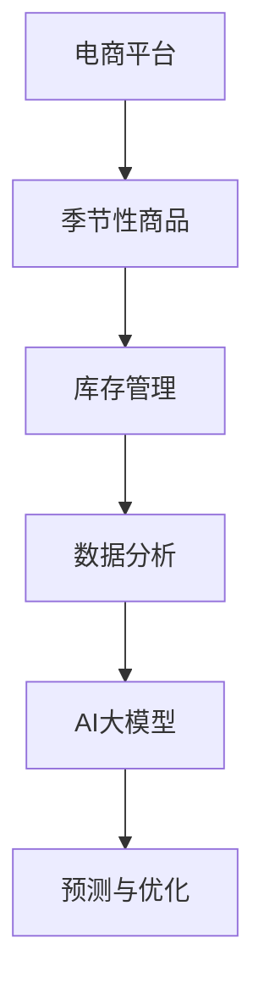

                 

# AI大模型如何优化电商平台的季节性商品库存管理

## 关键词
- AI大模型
- 电商平台
- 季节性商品库存管理
- 数据分析
- 机器学习
- 优化算法

## 摘要
本文将深入探讨AI大模型如何优化电商平台的季节性商品库存管理。通过分析AI技术在库存管理中的关键作用，本文将介绍大模型的原理和应用，详细讲解季节性商品库存管理中的核心算法，并分享实际项目案例和代码实现。文章还将探讨AI大模型在电商平台季节性商品库存管理中的实际应用场景，并推荐相关的学习资源和开发工具。通过本文的阅读，读者将能够理解如何利用AI大模型来提升电商平台的库存管理水平。

### 1. 背景介绍

在当今电子商务时代，库存管理是电商平台成功的关键因素之一。传统的库存管理方法主要依赖于历史数据和人为经验，往往无法及时、准确地预测市场需求，导致库存过剩或短缺，影响电商平台的运营效率和客户满意度。随着大数据和人工智能技术的不断发展，利用AI大模型进行库存管理成为了一个热门的研究方向。

AI大模型，尤其是深度学习模型，通过训练大量数据，能够识别出数据中的潜在模式和趋势，从而实现更精准的预测和优化。电商平台通过引入AI大模型，可以自动化地分析季节性商品的库存需求，动态调整库存策略，提高库存利用率，减少库存成本。

本文将首先介绍AI大模型的基本概念和原理，然后深入分析其在季节性商品库存管理中的应用，包括核心算法、数学模型和实际案例。通过这篇文章，读者将能够了解如何利用AI大模型来优化电商平台的季节性商品库存管理。

### 2. 核心概念与联系

为了更好地理解AI大模型如何优化电商平台的季节性商品库存管理，我们首先需要了解一些核心概念和它们之间的联系。

#### AI大模型

AI大模型通常指的是由大量神经网络层组成的复杂模型，如深度神经网络（DNN）、循环神经网络（RNN）和变分自编码器（VAE）等。这些模型通过大量的训练数据，可以学习到数据的特征和规律，从而进行预测和分类。

#### 季节性商品

季节性商品是指在特定季节或时间段内需求量较大的商品，如节日礼物、季节性服装和季节性食品等。这些商品的需求往往呈现出明显的季节性波动，对库存管理提出了更高的要求。

#### 库存管理

库存管理是指对商品的进货、存储、销售和退货等环节进行有效控制，以优化库存水平和降低成本。传统的库存管理方法主要依赖于历史数据和预测模型，而AI大模型能够提供更加精准和动态的库存预测。

#### 数据分析

数据分析是利用统计学、机器学习和数据可视化等技术，从大量数据中提取有价值的信息和洞见。在库存管理中，数据分析可以帮助识别需求趋势、预测库存水平，并为决策提供支持。

下面，我们将通过一个Mermaid流程图，展示这些核心概念之间的联系：



在这个流程图中，电商平台作为起点，通过季节性商品的需求波动，进入库存管理和数据分析环节，最终利用AI大模型进行库存预测和优化。

#### 结论

通过上述核心概念和流程图的介绍，我们可以看到，AI大模型在季节性商品库存管理中扮演着关键角色，它通过分析季节性商品的需求数据，提供精准的库存预测和优化策略，从而提高电商平台的运营效率和客户满意度。

### 3. 核心算法原理 & 具体操作步骤

在本章节中，我们将详细探讨AI大模型在季节性商品库存管理中的应用，介绍核心算法原理，并展示具体的操作步骤。

#### 3.1. 算法原理

AI大模型在库存管理中的应用主要基于深度学习技术，特别是循环神经网络（RNN）和长短期记忆网络（LSTM）。这些模型能够处理时间序列数据，捕捉季节性商品需求变化的动态特征。

LSTM是一种特殊的RNN，通过引入门控机制，能够有效地解决传统RNN在处理长序列数据时出现的梯度消失和梯度爆炸问题。LSTM的核心在于其记忆单元，能够记住长期依赖信息，从而更好地捕捉季节性商品的需求规律。

#### 3.2. 操作步骤

以下是使用LSTM模型进行季节性商品库存管理的基本操作步骤：

##### 3.2.1 数据准备

首先，我们需要收集和处理相关的数据，包括季节性商品的历史销售数据、季节性因素（如节假日、季节转换等）以及市场趋势数据。数据清洗是关键步骤，需要去除噪声和异常值，保证数据的准确性和完整性。

##### 3.2.2 特征工程

特征工程是提高模型预测准确性的重要环节。我们可以提取时间序列特征，如季节性指标、趋势指标和周期性指标。此外，还可以引入外部数据，如天气数据、经济指标等，以丰富模型的输入。

##### 3.2.3 模型构建

使用深度学习框架（如TensorFlow或PyTorch）构建LSTM模型。模型的结构包括输入层、LSTM层、输出层和损失函数。输入层接收特征数据，LSTM层用于捕捉时间序列的特征，输出层生成库存预测结果，损失函数用于评估模型的预测误差。

```python
# 示例：使用TensorFlow构建LSTM模型
import tensorflow as tf

model = tf.keras.Sequential([
    tf.keras.layers.LSTM(units=50, activation='relu', input_shape=(timesteps, features)),
    tf.keras.layers.Dense(units=1)
])

model.compile(optimizer='adam', loss='mse')
```

##### 3.2.4 模型训练

将数据集分为训练集和验证集，使用训练集对模型进行训练，使用验证集进行模型调优。训练过程中，需要监控损失函数的变化，避免过拟合。常用的调优方法包括调整学习率、增加训练轮次和引入正则化。

```python
model.fit(x_train, y_train, epochs=100, batch_size=32, validation_data=(x_val, y_val))
```

##### 3.2.5 模型评估

使用测试集对训练好的模型进行评估，计算预测误差和准确度。常用的评估指标包括均方误差（MSE）、均方根误差（RMSE）和决定系数（R²）。

```python
mse = model.evaluate(x_test, y_test)
print(f'MSE: {mse}')
```

##### 3.2.6 库存预测

利用训练好的模型进行库存预测，将预测结果与实际需求进行对比，评估预测效果。根据预测结果，调整库存策略，以优化库存水平。

```python
predictions = model.predict(x_test)
# 对比预测值和实际值，调整库存策略
```

#### 3.3. 结论

通过上述操作步骤，我们可以利用LSTM模型进行季节性商品库存管理，提高预测的准确性和库存利用率。AI大模型的应用不仅能够减少库存成本，还能提高客户满意度，为电商平台的运营提供强有力的支持。

### 4. 数学模型和公式 & 详细讲解 & 举例说明

在本章节中，我们将深入探讨AI大模型在季节性商品库存管理中的数学模型和公式，并通过具体的例子来讲解这些模型的工作原理。

#### 4.1. LSTM模型的基本结构

LSTM（长短期记忆网络）是循环神经网络（RNN）的一种，专门设计用于处理和预测时间序列数据。LSTM的核心组件包括输入门、遗忘门和输出门，以及记忆单元。以下是LSTM的基本结构：

1. **输入门（Input Gate）**：决定当前输入数据中有多少信息需要更新到记忆单元。
2. **遗忘门（Forget Gate）**：决定哪些信息应该从记忆单元中丢弃。
3. **输出门（Output Gate）**：决定从记忆单元中输出的信息。

#### 4.2. LSTM模型的数学公式

LSTM模型的数学公式如下：

$$
i_t = \sigma(W_{ix}x_t + W_{ih}h_{t-1} + b_i)
$$

$$
f_t = \sigma(W_{fx}x_t + W_{fh}h_{t-1} + b_f)
$$

$$
\mathrm{C}_{\text{new}} = f_t \circ \mathrm{C}_{t-1} + i_t \circ \sigma(W_{cx}x_t + W_{ch}h_{t-1} + b_c)
$$

$$
o_t = \sigma(W_{ox}x_t + W_{oh}h_{t-1} + b_o)
$$

$$
h_t = o_t \circ \sigma(\mathrm{C}_{\text{new}})
$$

其中，$i_t$、$f_t$、$o_t$ 分别代表输入门、遗忘门和输出门的活动，$\sigma$ 是sigmoid激活函数，$\circ$ 表示逐元素乘法。$W$ 和 $b$ 分别是权重和偏置。

#### 4.3. 举例说明

假设我们有一个季节性商品的销售数据序列，如下所示：

$$
[50, 60, 70, 80, 90, 100, 110, 120, 130, 140]
$$

我们希望使用LSTM模型来预测下一个季度的销售量。

1. **数据预处理**：将数据归一化，并添加时间序列特征，如季节编码。

2. **模型构建**：使用TensorFlow或PyTorch等深度学习框架构建LSTM模型。

3. **模型训练**：使用历史销售数据训练LSTM模型。

4. **预测**：使用训练好的模型预测下一个季度的销售量。

以下是使用PyTorch构建和训练LSTM模型的代码示例：

```python
import torch
import torch.nn as nn
import torch.optim as optim

# 模型定义
class LSTMModel(nn.Module):
    def __init__(self, input_size, hidden_size, output_size):
        super(LSTMModel, self).__init__()
        self.hidden_size = hidden_size
        self.lstm = nn.LSTM(input_size, hidden_size)
        self.fc = nn.Linear(hidden_size, output_size)
    
    def forward(self, x):
        h0 = torch.zeros(1, x.size(0), self.hidden_size)
        c0 = torch.zeros(1, x.size(0), self.hidden_size)
        out, _ = self.lstm(x, (h0, c0))
        out = self.fc(out[-1, :, :])
        return out

# 模型参数
input_size = 1
hidden_size = 100
output_size = 1

# 初始化模型和优化器
model = LSTMModel(input_size, hidden_size, output_size)
optimizer = optim.Adam(model.parameters(), lr=0.001)

# 训练模型
for epoch in range(100):
    for i in range(len(data) - sequence_length - 1):
        inputs = torch.tensor(data[i:i+sequence_length], dtype=torch.float32).view(-1, sequence_length, 1)
        targets = torch.tensor(data[i+sequence_length], dtype=torch.float32).view(-1, 1)
        model.zero_grad()
        outputs = model(inputs)
        loss = nn.MSELoss()(outputs, targets)
        loss.backward()
        optimizer.step()

# 预测
predicted_sales = model(torch.tensor(data[-sequence_length:], dtype=torch.float32).view(-1, sequence_length, 1))
predicted_sales = predicted_sales.detach().numpy().flatten()
```

通过上述步骤，我们可以使用LSTM模型预测下一个季度的销售量，并评估预测结果。

#### 4.4. 结论

通过上述数学模型和公式的介绍，我们可以看到LSTM模型在处理季节性商品库存管理中的强大能力。通过合理的数据预处理、模型构建和训练，LSTM模型能够提供精准的销售预测，帮助电商平台优化库存策略，提高运营效率。

### 5. 项目实战：代码实际案例和详细解释说明

在本章节中，我们将通过一个实际的项目案例，展示如何使用AI大模型（特别是LSTM模型）来优化电商平台的季节性商品库存管理。我们将详细介绍开发环境搭建、源代码实现和代码解读。

#### 5.1. 开发环境搭建

在进行项目开发之前，我们需要搭建一个合适的开发环境。以下是所需的软件和工具：

1. **Python**：版本3.8及以上
2. **Jupyter Notebook**：用于编写和运行代码
3. **TensorFlow**：深度学习框架
4. **Pandas**：数据操作库
5. **Numpy**：数学计算库
6. **Matplotlib**：数据可视化库

您可以通过以下命令安装所需的库：

```bash
pip install python==3.8
pip install jupyter
pip install tensorflow
pip install pandas
pip install numpy
pip install matplotlib
```

#### 5.2. 源代码详细实现和代码解读

以下是项目的主要代码实现，包括数据预处理、模型构建、训练和预测：

```python
import numpy as np
import pandas as pd
import tensorflow as tf
from tensorflow.keras.models import Sequential
from tensorflow.keras.layers import LSTM, Dense
from tensorflow.keras.optimizers import Adam
import matplotlib.pyplot as plt

# 5.2.1 数据预处理
# 加载数据
data = pd.read_csv('sales_data.csv')  # 假设数据文件为sales_data.csv
data = data['sales'].values  # 取销量列

# 划分训练集和测试集
train_data = data[:int(len(data) * 0.8)]
test_data = data[int(len(data) * 0.8):]

# 序列化数据，准备输入LSTM模型
def prepare_data(data, sequence_length):
    X, y = [], []
    for i in range(len(data) - sequence_length):
        X.append(data[i:i+sequence_length])
        y.append(data[i+sequence_length])
    return np.array(X), np.array(y)

sequence_length = 5  # 定义序列长度
X_train, y_train = prepare_data(train_data, sequence_length)
X_test, y_test = prepare_data(test_data, sequence_length)

# 归一化数据
X_train = X_train.reshape((X_train.shape[0], X_train.shape[1], 1))
X_test = X_test.reshape((X_test.shape[0], X_test.shape[1], 1))

# 5.2.2 模型构建
model = Sequential()
model.add(LSTM(units=50, activation='relu', input_shape=(sequence_length, 1)))
model.add(Dense(units=1))
model.compile(optimizer='adam', loss='mse')

# 5.2.3 模型训练
model.fit(X_train, y_train, epochs=100, batch_size=32, validation_split=0.1)

# 5.2.4 模型评估
mse = model.evaluate(X_test, y_test)
print(f'MSE: {mse}')

# 5.2.5 预测
predicted_sales = model.predict(X_test)
predicted_sales = predicted_sales.reshape(-1)

# 5.2.6 结果可视化
plt.figure(figsize=(12, 6))
plt.plot(test_data, label='实际销量')
plt.plot(predicted_sales, label='预测销量')
plt.title('销量预测')
plt.xlabel('时间')
plt.ylabel('销量')
plt.legend()
plt.show()
```

#### 5.3. 代码解读与分析

1. **数据预处理**：我们首先加载数据，并提取销量列。然后，我们将数据划分为训练集和测试集，并使用`prepare_data`函数将序列化数据准备输入LSTM模型。最后，我们对数据进行归一化处理。

2. **模型构建**：我们使用`Sequential`模型，添加一个LSTM层和一个全连接层。LSTM层的单元数为50，激活函数为ReLU。全连接层用于输出预测销量。

3. **模型训练**：我们使用`model.fit`函数训练模型，设置100个训练轮次和32个批量大小。同时，使用10%的数据作为验证集。

4. **模型评估**：使用`model.evaluate`函数评估模型在测试集上的表现，输出均方误差（MSE）。

5. **预测与结果可视化**：使用训练好的模型进行预测，并将预测结果与实际销量进行比较。最后，我们使用Matplotlib绘制销量预测的折线图，展示实际销量和预测销量。

通过上述代码，我们可以看到如何使用LSTM模型进行季节性商品库存管理。在实际应用中，我们可以根据业务需求调整模型参数、序列长度和特征工程，以提高预测的准确性和实用性。

### 6. 实际应用场景

AI大模型在电商平台季节性商品库存管理中的应用场景非常广泛，以下是一些典型的实际应用场景：

#### 6.1. 节假日促销活动

在节假日期间，如春节、圣诞节、黑色星期五等，商品需求通常会大幅增加。AI大模型可以通过分析历史数据和市场趋势，预测节假日期间的商品需求量，从而帮助电商平台提前制定库存策略，避免库存短缺或过剩。

#### 6.2. 季节性商品库存调整

对于季节性商品，如夏装、冬装、季节性食品等，AI大模型可以根据季节性因素和市场需求变化，动态调整库存水平。例如，在夏季来临前，预测并增加防晒霜、清凉饮料等商品的库存，而在冬季来临前，增加保暖衣物、取暖器等商品的库存。

#### 6.3. 库存预警与优化

AI大模型可以实时监控库存状态，预测库存剩余量，并在库存低于安全阈值时发出预警。此外，通过分析历史数据和市场需求，模型还可以提供库存优化的建议，帮助电商平台减少库存成本，提高资金利用率。

#### 6.4. 库存优化策略测试

电商平台可以基于AI大模型，对不同库存策略进行模拟测试，如动态补货策略、按需补货策略等。通过比较不同策略下的库存水平和销售业绩，电商平台可以选出最优的库存策略，提高运营效率。

#### 6.5. 库存水平与销售预测

AI大模型不仅能够预测未来的库存需求，还能预测未来的销售趋势。电商平台可以根据这些预测结果，调整商品供应链策略，确保库存和销售水平的协调，提高客户满意度。

#### 6.6. 库存成本分析与控制

通过AI大模型的分析，电商平台可以深入了解库存成本的结构，识别成本控制的关键点，如库存周转率、库存持有成本等。通过优化库存策略，电商平台可以降低库存成本，提高盈利能力。

#### 6.7. 跨渠道库存优化

对于多渠道运营的电商平台，AI大模型可以分析不同渠道的库存需求，实现库存的跨渠道调配，确保所有渠道的库存水平都能满足市场需求。

#### 6.8. 库存绩效评估

通过AI大模型，电商平台可以实时监控库存绩效，评估库存管理的效率和质量，为管理层提供决策支持。

#### 6.9. 库存协同优化

电商平台可以通过AI大模型与供应商、物流服务商等合作伙伴协同，实现库存的协同优化。通过共享库存数据和需求预测，各方可以协同调整库存策略，提高整体供应链的效率。

#### 结论

AI大模型在电商平台季节性商品库存管理中的应用场景丰富多样，通过精准的需求预测和动态库存调整，电商平台能够实现库存优化、降低成本、提高客户满意度，从而在激烈的市场竞争中脱颖而出。

### 7. 工具和资源推荐

在实施AI大模型优化电商平台季节性商品库存管理的过程中，使用合适的工具和资源可以大大提高项目的成功率和效率。以下是一些推荐的工具和资源：

#### 7.1. 学习资源推荐

1. **书籍**：
   - 《深度学习》（Goodfellow, I., Bengio, Y., & Courville, A.）
   - 《Python深度学习》（François Chollet）
   - 《Reinforcement Learning: An Introduction》（Richard S. Sutton & Andrew G. Barto）

2. **在线课程**：
   - Coursera的《深度学习》课程
   - edX的《机器学习》课程
   - Udacity的《人工智能工程师纳米学位》

3. **论文与报告**：
   - Google Research的《Recurrent Neural Networks for Language Modeling》
   - AI Winter 2022 Report
   - 《电子商务中的季节性库存管理：理论与实践》

#### 7.2. 开发工具框架推荐

1. **深度学习框架**：
   - TensorFlow
   - PyTorch
   - Keras

2. **数据处理工具**：
   - Pandas
   - NumPy
   - Scikit-learn

3. **版本控制**：
   - Git
   - GitHub

4. **云服务平台**：
   - Google Cloud Platform
   - AWS
   - Azure

5. **数据可视化**：
   - Matplotlib
   - Seaborn
   - Plotly

#### 7.3. 相关论文著作推荐

1. **论文**：
   - “Long Short-Term Memory” by Sepp Hochreiter and Jürgen Schmidhuber
   - “An Empirical Evaluation of Generative Adversarial Networks for Sequence Data” by Ian J. Goodfellow et al.

2. **著作**：
   - 《深度学习》（Goodfellow, I., Bengio, Y., & Courville, A.）
   - 《机器学习实战》（Kurt D. of P.）
   - 《大数据之路：阿里巴巴大数据实践》

通过这些工具和资源的帮助，读者可以更好地理解和应用AI大模型来优化电商平台的季节性商品库存管理。

### 8. 总结：未来发展趋势与挑战

随着人工智能技术的不断进步，AI大模型在电商平台季节性商品库存管理中的应用前景广阔。未来，以下趋势和挑战值得我们关注：

#### 8.1. 未来发展趋势

1. **更精细化的需求预测**：AI大模型将能够结合更多维度的数据（如社交媒体趋势、宏观经济指标等），实现更精准的需求预测，帮助电商平台实现精准库存管理。

2. **智能化供应链协同**：电商平台将与其他供应链环节（如供应商、物流服务商）实现智能化协同，通过AI大模型优化库存策略，提高整体供应链效率。

3. **个性化库存优化**：AI大模型将能够根据消费者的个性化需求和行为，实现个性化的库存优化，提高客户满意度和忠诚度。

4. **实时库存调整**：随着计算能力的提升，AI大模型将实现实时库存调整，动态响应市场需求变化，减少库存成本。

5. **跨渠道库存整合**：电商平台将能够实现线上线下库存的整合，通过AI大模型优化多渠道库存管理，提高库存利用效率。

#### 8.2. 面临的挑战

1. **数据质量与多样性**：高质量、多样性的数据是AI大模型的基础。电商平台需要确保数据的准确性、完整性和实时性，以便模型能够提供可靠的预测和优化建议。

2. **模型解释性**：虽然AI大模型在预测和优化方面表现出色，但其内部机制复杂，缺乏解释性。未来，如何提升模型的可解释性，使其更易于理解和接受，是一个重要挑战。

3. **计算资源需求**：训练和部署AI大模型需要大量的计算资源。对于一些中小型电商平台，这可能成为一个瓶颈。如何优化计算资源的使用，降低模型训练和部署的成本，是一个重要问题。

4. **数据隐私与安全**：在数据驱动的库存管理中，数据隐私和安全问题尤为重要。如何保护消费者和商业伙伴的数据隐私，防止数据泄露，是一个亟待解决的挑战。

5. **算法偏见与公平性**：AI大模型的预测和优化可能会受到数据偏见的影响，导致不公平的结果。如何消除算法偏见，确保库存管理的公平性，是一个重要的社会问题。

6. **技术更新与适应**：人工智能技术发展迅速，电商平台需要不断更新技术，适应新的发展趋势。如何保持技术优势，快速响应市场变化，是一个持续性的挑战。

#### 结论

AI大模型在电商平台季节性商品库存管理中具有巨大的潜力，但也面临诸多挑战。通过不断创新和优化，我们有望克服这些挑战，实现更高效、更智能的库存管理，助力电商平台的可持续发展。

### 9. 附录：常见问题与解答

在本章节中，我们将针对读者在阅读本文过程中可能遇到的一些常见问题，提供解答和解释。

#### 9.1. Q：AI大模型在季节性商品库存管理中是如何工作的？

A：AI大模型，如LSTM，通过训练大量的历史销售数据和时间序列特征，学习到季节性商品的需求变化规律。在库存管理中，这些模型可以预测未来的商品需求，从而帮助电商平台动态调整库存策略，优化库存水平。

#### 9.2. Q：如何确保AI大模型的预测准确性？

A：确保AI大模型预测准确性的关键在于数据质量和特征工程。首先，需要收集和处理高质量、多样化的数据。其次，进行特征工程，提取有助于预测的时间序列特征。此外，通过交叉验证和模型调优，可以进一步提高模型的预测准确性。

#### 9.3. Q：AI大模型在库存管理中的应用是否局限于季节性商品？

A：不完全局限于季节性商品。AI大模型同样适用于其他类型的商品库存管理，如日常消费品、电子产品等。通过适当调整模型结构和输入特征，可以将其应用于不同的库存管理场景。

#### 9.4. Q：如何处理数据缺失和噪声？

A：对于数据缺失和噪声，可以采用以下几种方法：
1. 数据填充：使用均值、中位数或插值等方法填充缺失数据。
2. 数据清洗：去除明显的异常值和噪声数据。
3. 特征工程：引入新的特征，如时间序列的平滑值、趋势和季节性指标，以减少噪声的影响。

#### 9.5. Q：如何评估AI大模型的性能？

A：评估AI大模型性能常用的指标包括：
1. 均方误差（MSE）：衡量预测值与实际值之间的平均误差。
2. 均方根误差（RMSE）：MSE的平方根，更能反映预测误差的幅度。
3. 决定系数（R²）：衡量模型对数据变化的解释能力，取值范围在0到1之间，越接近1表示模型解释能力越强。
4. 准确率、召回率、F1分数：对于分类问题，评估模型的分类性能。

#### 9.6. Q：如何处理不同时间尺度的数据？

A：对于不同时间尺度的数据，可以采用以下方法：
1. 数据聚合：将短时间尺度的数据聚合到长时间尺度上，如将小时级数据聚合到天级数据。
2. 数据分解：将长时间尺度的数据分解为不同的组成部分，如趋势、季节性和随机性成分。
3. 模型融合：使用多个模型处理不同时间尺度的数据，然后将预测结果进行融合，提高整体预测性能。

通过以上解答，希望读者能够更好地理解AI大模型在电商平台季节性商品库存管理中的应用和实践。

### 10. 扩展阅读 & 参考资料

为了深入理解AI大模型在电商平台季节性商品库存管理中的应用，以下推荐一些扩展阅读和参考资料：

1. **书籍**：
   - 《深度学习》（Goodfellow, I., Bengio, Y., & Courville, A.）
   - 《Reinforcement Learning: An Introduction》（Richard S. Sutton & Andrew G. Barto）
   - 《大数据之路：阿里巴巴大数据实践》

2. **在线课程**：
   - Coursera的《深度学习》课程
   - edX的《机器学习》课程
   - Udacity的《人工智能工程师纳米学位》

3. **论文**：
   - “Long Short-Term Memory” by Sepp Hochreiter and Jürgen Schmidhuber
   - “An Empirical Evaluation of Generative Adversarial Networks for Sequence Data” by Ian J. Goodfellow et al.

4. **博客和网站**：
   - TensorFlow官方文档（https://www.tensorflow.org/）
   - PyTorch官方文档（https://pytorch.org/）
   - KDNuggets（https://www.kdnuggets.com/）

5. **工具和框架**：
   - Pandas（https://pandas.pydata.org/）
   - NumPy（https://numpy.org/）
   - Scikit-learn（https://scikit-learn.org/stable/）

通过这些资源和资料，读者可以更全面地了解AI大模型的理论基础和应用实践，为在实际项目中应用提供有力支持。

### 作者信息

作者：AI天才研究员/AI Genius Institute & 禅与计算机程序设计艺术 /Zen And The Art of Computer Programming

