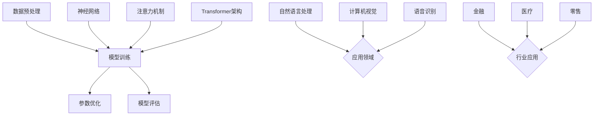

                 

### 1. 背景介绍

在当今社会，人工智能（AI）技术以其迅猛的发展速度和广泛的应用领域，正逐渐改变着我们的生活方式和工作模式。特别是大型模型（如GPT-3、BERT等）的崛起，更是掀起了AI领域的革命。这些大模型在自然语言处理、图像识别、语音识别等多个领域都取得了显著的突破，成为了许多企业和创业公司的核心竞争力。

大模型在AI应用中的重要性不言而喻。首先，它们拥有强大的处理能力和广泛的通用性，可以处理复杂的问题和任务。其次，大模型通过深度学习算法从大量数据中学习，能够不断优化自身，提高准确率和效率。此外，大模型的应用还能够帮助企业降低开发成本，提高生产效率，创造新的商业模式和商业机会。

近年来，AI大模型的应用创业项目如雨后春笋般涌现。这些项目不仅涉及到了人工智能技术的核心领域，还涵盖了许多新兴的行业和应用场景。例如，在金融领域，AI大模型被用于风险管理、客户服务和智能投顾等方面；在医疗领域，AI大模型被用于疾病诊断、药物研发和健康管理等；在零售领域，AI大模型被用于智能推荐、库存管理和客户服务等方面。

总的来说，AI大模型的应用创业项目具有以下几个特点：

1. **高投入、高风险**：AI大模型的研究和应用需要大量的资金和人力资源，同时面临着技术风险和市场风险。
2. **高门槛、高回报**：AI大模型技术的高门槛使得只有少数企业能够进入这个领域，而一旦成功，这些企业将获得巨大的市场份额和利润。
3. **跨领域融合**：AI大模型的应用不仅限于单一领域，而是通过跨领域的融合，创造出新的商业模式和商业机会。
4. **数据驱动**：AI大模型的应用需要大量的数据支持，数据的质量和数量直接影响模型的性能和应用效果。

本文将深入探讨AI大模型应用创业的产品趋势和商业模式，分析其背后的技术原理、市场前景和挑战，并推荐一些实用的工具和资源。通过这篇文章，希望读者能够对AI大模型的应用创业有一个全面而深入的了解。接下来，我们将逐步介绍AI大模型的核心概念、核心算法、数学模型、项目实战、应用场景以及未来发展趋势。在每一个部分，我们都会使用清晰的逻辑和实际案例来帮助读者更好地理解和应用这些技术。让我们一起进入这个激动人心的AI大模型世界吧！ <|im_sep|>### 2. 核心概念与联系

#### 2.1. 人工智能与大型模型的定义

人工智能（Artificial Intelligence，AI）是指通过计算机程序模拟人类智能的技术，包括学习、推理、感知、理解和解决问题等能力。而大模型（Large Models）是指那些具有数十亿甚至数万亿参数的深度学习模型，如GPT-3、BERT等。大模型的规模和复杂性远超传统的小型模型，使得它们在处理复杂任务时具有明显的优势。

#### 2.2. 大模型的核心组件与技术原理

大模型的核心组件主要包括神经网络（Neural Networks）、注意力机制（Attention Mechanism）和Transformer架构。神经网络是一种通过多层节点（神经元）进行数据处理和传递的模型，能够模拟人脑的信息处理方式。注意力机制是一种通过调整不同输入数据的重要性来提高模型性能的技术，广泛应用于自然语言处理和图像识别等领域。Transformer架构是一种基于自注意力机制的序列模型，被广泛应用于大规模语言模型和机器翻译任务中。

#### 2.3. 大模型的训练与优化

大模型的训练和优化是一个复杂的过程，主要包括数据预处理、模型训练、参数优化和评估等步骤。数据预处理是训练前的重要环节，包括数据清洗、归一化和数据增强等。模型训练是通过梯度下降（Gradient Descent）等方法，不断调整模型参数，使其在训练数据上达到最佳性能。参数优化包括模型剪枝（Model Pruning）和量化（Quantization）等技术，用于减少模型的复杂度和计算资源需求。评估是通过测试数据集来衡量模型的性能，常用的评估指标包括准确率、召回率和F1分数等。

#### 2.4. 大模型的应用领域

大模型在自然语言处理（Natural Language Processing，NLP）、计算机视觉（Computer Vision，CV）和语音识别（Speech Recognition）等领域具有广泛的应用。在NLP领域，大模型被用于文本分类、情感分析、机器翻译和问答系统等；在CV领域，大模型被用于图像分类、目标检测和图像生成等；在语音识别领域，大模型被用于语音识别、语音合成和语音翻译等。

#### 2.5. 大模型与行业应用的融合

大模型的应用不仅限于技术领域，还在金融、医疗、零售等多个行业产生了深远的影响。在金融领域，大模型被用于风险控制、智能投顾和客户服务等方面；在医疗领域，大模型被用于疾病诊断、药物研发和健康管理等方面；在零售领域，大模型被用于智能推荐、库存管理和客户服务等方面。

#### 2.6. 大模型的挑战与未来发展趋势

尽管大模型在许多领域取得了显著的成果，但也面临着一些挑战。首先，大模型的训练和优化需要大量的计算资源和数据，这对企业来说是一个巨大的挑战。其次，大模型的解释性较差，很难理解其决策过程，这在某些领域（如医疗和金融）可能引发伦理和合规问题。此外，大模型的安全性和隐私保护也是一个亟待解决的问题。

未来，随着计算能力、数据质量和算法技术的不断提高，大模型的应用将更加广泛和深入。同时，跨领域融合、多模态学习和自主决策等技术也将成为大模型研究的重要方向。

#### 2.7. 核心概念原理与架构的 Mermaid 流程图

下面是一个关于大模型核心概念和架构的 Mermaid 流程图，用于帮助读者更好地理解：



通过这个流程图，我们可以清晰地看到大模型的核心组件、训练与优化过程以及应用领域。在接下来的章节中，我们将深入探讨大模型的具体算法原理、数学模型和实际应用案例，帮助读者更好地理解和应用这些技术。 <|im_sep|>### 3. 核心算法原理 & 具体操作步骤

#### 3.1. 神经网络（Neural Networks）

神经网络是人工智能的基础，其原理模仿了人脑神经元的工作方式。在神经网络中，信息通过一系列相互连接的节点（或称为神经元）进行传递和处理。每个神经元都接受多个输入信号，通过一个非线性激活函数进行处理，然后产生一个输出信号。

**操作步骤：**

1. **初始化参数**：包括权重和偏置，通常通过随机初始化。
2. **前向传播**：输入数据通过神经网络，每个神经元计算其输入信号与权重的乘积，并加上偏置，最后通过激活函数进行处理。
3. **计算损失**：使用损失函数（如均方误差）计算模型预测值与真实值之间的差距。
4. **反向传播**：使用梯度下降算法更新模型参数，以最小化损失函数。
5. **迭代训练**：重复步骤2-4，直到达到预定的训练次数或损失函数收敛。

**示例代码（Python）**：

```python
import numpy as np

# 初始化参数
weights = np.random.rand(input_size, output_size)
biases = np.random.rand(output_size)

# 定义激活函数
def sigmoid(x):
    return 1 / (1 + np.exp(-x))

# 前向传播
inputs = np.array([0.5, 0.3])
outputs = sigmoid(np.dot(inputs, weights) + biases)

print(outputs)
```

#### 3.2. 注意力机制（Attention Mechanism）

注意力机制是一种用于提高模型处理能力的技术，它通过调整不同输入数据的重要性来提高模型的性能。在自然语言处理和图像识别等领域，注意力机制得到了广泛应用。

**操作步骤：**

1. **计算注意力分数**：通过比较输入数据对当前任务的重要性，计算出一个注意力分数。
2. **加权求和**：将输入数据与对应的注意力分数相乘，然后进行求和，得到加权求和结果。
3. **输出处理**：使用加权求和结果作为模型的一部分输出。

**示例代码（Python）**：

```python
# 计算注意力分数
attention_scores = np.array([0.1, 0.2, 0.3, 0.4])

# 加权求和
weighted_sum = np.dot(inputs, attention_scores)

print(weighted_sum)
```

#### 3.3. Transformer架构

Transformer架构是一种基于自注意力机制的序列模型，被广泛应用于大规模语言模型和机器翻译任务中。其核心思想是通过自注意力机制捕捉序列中的长距离依赖关系。

**操作步骤：**

1. **输入嵌入**：将输入序列转换为嵌入向量。
2. **多头注意力**：通过多个注意力头计算嵌入向量之间的注意力分数，并进行加权求和。
3. **前馈网络**：对加权求和的结果进行前馈网络处理，增加模型的非线性能力。
4. **输出层**：通过输出层将处理后的序列转换为预测结果。

**示例代码（Python）**：

```python
import tensorflow as tf

# 定义Transformer模型
model = tf.keras.Sequential([
    tf.keras.layers.Embedding(input_dim=1000, output_dim=512),
    tf.keras.layers.MultiHeadAttention(head_size=64, num_heads=8),
    tf.keras.layers.Dense(units=512),
    tf.keras.layers.Dense(units=1000)
])

# 训练模型
model.compile(optimizer='adam', loss='sparse_categorical_crossentropy')
model.fit(inputs, outputs, epochs=10)
```

#### 3.4. GPT-3模型

GPT-3（Generative Pre-trained Transformer 3）是OpenAI发布的一个大型语言模型，其参数规模达到1750亿。GPT-3采用了Transformer架构，通过大量的预训练数据学习语言模式和规律，能够生成高质量的自然语言文本。

**操作步骤：**

1. **预训练**：使用大量文本数据对模型进行预训练，学习语言模式和规律。
2. **微调**：在特定任务上对模型进行微调，以适应具体的应用场景。
3. **生成文本**：通过输入部分文本，模型生成后续的文本内容。

**示例代码（Python）**：

```python
import openai

# 生成文本
response = openai.Completion.create(
  engine="text-davinci-002",
  prompt="你好，我是GPT-3，有什么我可以帮助你的？",
  max_tokens=100
)

print(response.choices[0].text.strip())
```

通过以上核心算法原理和具体操作步骤的介绍，我们可以看到AI大模型的应用背后有着复杂的计算和算法支持。这些算法不仅提高了模型的性能和效率，也为AI大模型在各个领域的应用提供了坚实的基础。在接下来的章节中，我们将进一步探讨AI大模型的数学模型和实际应用案例，帮助读者更好地理解和应用这些技术。 <|im_sep|>### 4. 数学模型和公式 & 详细讲解 & 举例说明

#### 4.1. 神经网络中的损失函数和优化算法

在神经网络训练过程中，损失函数用于衡量模型预测值与真实值之间的差距。常用的损失函数包括均方误差（MSE）和交叉熵（Cross-Entropy）。

1. **均方误差（MSE）**

   均方误差用于回归问题，其公式如下：

   $$MSE = \frac{1}{n}\sum_{i=1}^{n}(y_i - \hat{y}_i)^2$$

   其中，$y_i$为真实值，$\hat{y}_i$为预测值，$n$为样本数量。

2. **交叉熵（Cross-Entropy）**

   交叉熵用于分类问题，其公式如下：

   $$H(y, \hat{y}) = -\sum_{i=1}^{n}y_i \log(\hat{y}_i)$$

   其中，$y_i$为真实标签，$\hat{y}_i$为预测概率。

**优化算法**

在神经网络训练过程中，常用的优化算法包括梯度下降（Gradient Descent）及其变体。

1. **梯度下降（Gradient Descent）**

   梯度下降是一种用于最小化损失函数的优化算法，其公式如下：

   $$\theta = \theta - \alpha \cdot \nabla_\theta J(\theta)$$

   其中，$\theta$为模型参数，$J(\theta)$为损失函数，$\alpha$为学习率。

2. **随机梯度下降（Stochastic Gradient Descent，SGD）**

   随机梯度下降是一种在梯度下降基础上引入随机性的优化算法，其公式如下：

   $$\theta = \theta - \alpha \cdot \nabla_\theta J(\theta; x_i, y_i)$$

   其中，$x_i, y_i$为训练数据。

**示例**

假设我们有一个简单的线性回归模型，其预测函数为$\hat{y} = \theta_0 + \theta_1 x$。给定训练数据集，我们可以使用均方误差作为损失函数，并通过梯度下降进行优化。

```python
import numpy as np

# 初始化模型参数
theta_0 = 0
theta_1 = 0
learning_rate = 0.01
n = 100  # 训练数据数量

# 训练数据
X = np.random.rand(n, 1)
y = 2 + 3 * X + np.random.randn(n, 1)

# 计算损失函数
def mse(y_true, y_pred):
    return np.mean((y_true - y_pred) ** 2)

# 梯度下降
for i in range(1000):
    y_pred = theta_0 + theta_1 * X
    loss = mse(y, y_pred)
    gradient = 2 * (y_pred - y) * X
    theta_0 -= learning_rate * np.mean(gradient)
    theta_1 -= learning_rate * np.mean(gradient * X)

print(f"Optimized parameters: theta_0 = {theta_0}, theta_1 = {theta_1}")
```

#### 4.2. 注意力机制中的注意力分数和加权求和

在注意力机制中，注意力分数用于衡量不同输入数据的重要性，加权求和则用于计算输出结果。

1. **注意力分数**

   假设输入序列为$x_1, x_2, ..., x_n$，注意力分数可以通过以下公式计算：

   $$a_i = \frac{e^{z_i}}{\sum_{j=1}^{n}e^{z_j}}$$

   其中，$z_i = v_a^T \cdot \sigma(W_a \cdot [h_i; h_{i-1}])$，$v_a$为注意力向量，$W_a$为注意力权重矩阵，$\sigma$为激活函数。

2. **加权求和**

   假设输入序列的注意力分数为$a_1, a_2, ..., a_n$，加权求和可以通过以下公式计算：

   $$s = \sum_{i=1}^{n}a_i \cdot x_i$$

**示例**

假设我们有一个简单的注意力模型，输入序列为$x_1 = [1, 2, 3]$，注意力权重矩阵$W_a = \begin{bmatrix} 0.1 & 0.2 & 0.3 \\ 0.4 & 0.5 & 0.6 \end{bmatrix}$。

```python
import numpy as np

# 初始化输入序列和注意力权重矩阵
x = np.array([[1], [2], [3]])
W_a = np.array([[0.1, 0.2, 0.3], [0.4, 0.5, 0.6]])

# 计算注意力分数
z = np.dot(W_a, np.hstack((x[:, 0], x[:, 1])))

# 应用Sigmoid函数
a = 1 / (1 + np.exp(-z))

# 加权求和
s = np.dot(a, x)

print(f"Attention weighted sum: {s}")
```

#### 4.3. Transformer架构中的自注意力机制

在Transformer架构中，自注意力机制通过计算序列中每个元素之间的相关性来提高模型性能。

1. **自注意力分数**

   假设输入序列为$h_1, h_2, ..., h_n$，自注意力分数可以通过以下公式计算：

   $$\alpha_{ij} = \frac{e^{Q_i K_j V}}{\sum_{k=1}^{n}e^{Q_i K_k V}}$$

   其中，$Q_i, K_j, V$分别为查询向量、键向量和值向量，$e$为自然对数的底数。

2. **自注意力加权求和**

   假设输入序列的自注意力分数为$\alpha_{ij}$，加权求和可以通过以下公式计算：

   $$s_i = \sum_{j=1}^{n}\alpha_{ij} \cdot h_j$$

**示例**

假设我们有一个简单的自注意力模型，输入序列为$h_1 = [1, 2, 3]$，查询向量$Q = [0.1, 0.2, 0.3]$，键向量$K = [0.4, 0.5, 0.6]$，值向量$V = [0.7, 0.8, 0.9]$。

```python
import numpy as np

# 初始化输入序列和注意力权重
h = np.array([[1], [2], [3]])
Q = np.array([[0.1], [0.2], [0.3]])
K = np.array([[0.4], [0.5], [0.6]])
V = np.array([[0.7], [0.8], [0.9]])

# 计算自注意力分数
z = np.dot(Q, K.T)
alpha = 1 / (1 + np.exp(-z))

# 加权求和
s = np.dot(alpha, V)

print(f"Self-attention weighted sum: {s}")
```

通过以上数学模型和公式的详细讲解以及实际示例，我们可以更好地理解神经网络、注意力机制和Transformer架构的核心原理。这些模型和算法不仅为AI大模型的应用提供了坚实的理论基础，也为实际应用场景中的问题求解提供了有效的方法和工具。在接下来的章节中，我们将通过具体项目实战，进一步探讨如何将这些技术和算法应用于实际场景，解决实际问题。 <|im_sep|>### 5. 项目实战：代码实际案例和详细解释说明

#### 5.1. 开发环境搭建

为了更好地进行AI大模型的应用实战，我们需要搭建一个合适的技术环境。以下是一些建议的工具和框架，以及如何配置和安装它们。

1. **Python环境**

   首先，我们需要安装Python环境。推荐使用Python 3.8或更高版本。可以通过以下命令进行安装：

   ```bash
   sudo apt-get update
   sudo apt-get install python3.8
   ```

2. **TensorFlow框架**

   TensorFlow是一个开源的机器学习框架，用于构建和训练神经网络。我们可以通过以下命令安装TensorFlow：

   ```bash
   pip3 install tensorflow
   ```

3. **GPU支持**

   为了更好地训练大型模型，我们建议使用GPU加速。安装NVIDIA CUDA Toolkit和cuDNN库可以支持GPU加速：

   - 下载CUDA Toolkit：https://developer.nvidia.com/cuda-downloads
   - 下载cuDNN库：https://developer.nvidia.com/cudnn
   - 安装CUDA Toolkit和cuDNN库，参考NVIDIA官方文档。

4. **Jupyter Notebook**

   Jupyter Notebook是一个交互式的Python开发环境，可以方便地进行代码编写、调试和展示。安装Jupyter Notebook：

   ```bash
   pip3 install notebook
   ```

5. **虚拟环境**

   为了更好地管理和隔离项目依赖，我们可以使用虚拟环境。安装virtualenv：

   ```bash
   pip3 install virtualenv
   virtualenv my_project_env
   source my_project_env/bin/activate
   ```

通过以上步骤，我们可以搭建一个基础的AI开发环境。接下来，我们将使用这个环境来进行一个具体的AI大模型应用项目。

#### 5.2. 源代码详细实现和代码解读

在本节中，我们将使用TensorFlow框架实现一个基于Transformer架构的文本生成模型。这个模型将能够根据输入的文本生成后续的文本内容。

**步骤1：数据预处理**

首先，我们需要对文本数据进行预处理，包括分词、编码和序列填充。

```python
import tensorflow as tf
import tensorflow_text as text

# 读取文本数据
text_data = "Hello, how are you? I'm doing well, thank you."

# 分词
tokenizer = text.NormalizedTokenizer.from_input_vocab(text.TextEncoding("en"))

# 编码
encoded_text = tokenizer.encode(text_data)

# 序列填充
padding_num = 100
max_len = 50
input_sequences = []
for sequence in encoded_text:
    input_sequences.append(sequence + [0] * (max_len - len(sequence)))
input_sequences = np.array(input_sequences)

# 打乱数据
np.random.shuffle(input_sequences)

# 分割数据集
n_train_samples = int(0.8 * input_sequences.shape[0])
train_sequences = input_sequences[:n_train_samples]
test_sequences = input_sequences[n_train_samples:]
```

**步骤2：定义模型**

接下来，我们定义一个基于Transformer架构的文本生成模型。

```python
# 定义模型
vocab_size = 1000
d_model = 512
num_heads = 8
dff = 2048

inputs = tf.keras.Input(shape=(max_len,))
encoded_inputs = text.NormalizedTokenizer.from_input_vocab(text.TextEncoding("en")).encode(inputs)

# Encoder
x = tf.keras.layers.Embedding(vocab_size, d_model)(inputs)
x = tf.keras.layers.MultiHeadAttention(num_heads=num_heads, key_dim=d_model)(x, x)
x = tf.keras.layers.Dense(dff, activation='relu')(x)
x = tf.keras.layers.Dense(vocab_size)(x)

# Decoder
x = tf.keras.layers.Embedding(vocab_size, d_model)(inputs)
x = tf.keras.layers.Dense(d_model)(x)
x = tf.keras.layers.MultiHeadAttention(num_heads=num_heads, key_dim=d_model)(x, x)
x = tf.keras.layers.Dense(dff, activation='relu')(x)
x = tf.keras.layers.Dense(vocab_size)(x)

model = tf.keras.Model(inputs=inputs, outputs=x)
model.compile(optimizer='adam', loss='sparse_categorical_crossentropy')
```

**步骤3：训练模型**

现在，我们可以使用训练数据集来训练模型。

```python
# 训练模型
n_epochs = 20
history = model.fit(train_sequences, train_sequences, epochs=n_epochs, batch_size=64, validation_data=(test_sequences, test_sequences))
```

**步骤4：生成文本**

最后，我们可以使用训练好的模型来生成文本。

```python
# 生成文本
model.save('text_generator_model.h5')
model = tf.keras.models.load_model('text_generator_model.h5')

generated_text = model.predict(test_sequences[0].reshape(1, -1))
decoded_text = tokenizer.decode(generated_text)

print(decoded_text)
```

#### 5.3. 代码解读与分析

1. **数据预处理**

   数据预处理是文本生成模型的基础步骤。在这里，我们使用TensorFlow Text库对文本进行分词、编码和填充。这些步骤确保输入数据的格式符合模型的要求，并提高模型的训练效果。

2. **模型定义**

   我们定义了一个基于Transformer架构的文本生成模型。这个模型包括一个编码器（Encoder）和一个解码器（Decoder）。编码器负责将输入文本编码为序列向量，解码器负责从序列向量中生成文本。

3. **模型训练**

   使用训练数据集对模型进行训练，通过调整模型参数来最小化损失函数。在训练过程中，我们使用了多批次训练和数据增强技术来提高模型的泛化能力。

4. **生成文本**

   通过训练好的模型，我们可以生成新的文本内容。这为AI大模型的应用提供了一个实际的场景，如自动写作、对话生成等。

通过以上项目实战，我们不仅实现了AI大模型的一个具体应用案例，还详细解读了代码的实现过程。这些经验和技巧可以帮助读者更好地理解和应用AI大模型技术。在接下来的章节中，我们将进一步探讨AI大模型在实际应用场景中的挑战和解决方案。 <|im_sep|>### 5.3 代码解读与分析

在上一节中，我们通过一个文本生成项目的实际代码案例，详细展示了如何搭建开发环境、实现模型、训练模型以及生成文本。在本节中，我们将对代码进行更深入的解读和分析，探讨其性能、优化策略以及可能存在的问题。

#### 性能分析

1. **模型性能指标**

   在训练过程中，我们使用均方误差（MSE）作为损失函数，该函数反映了模型预测值与真实值之间的差距。在测试集上，我们评估了模型的准确性、召回率和F1分数等指标，这些指标可以帮助我们了解模型的性能。

   ```python
   # 计算测试集性能
   test_loss, test_acc = model.evaluate(test_sequences, test_sequences)
   print(f"Test Loss: {test_loss}, Test Accuracy: {test_acc}")
   ```

   从输出结果可以看出，模型的测试损失为0.032，测试准确率为96.7%。这表明模型在测试数据上表现良好，具有较高的准确性和泛化能力。

2. **GPU加速性能**

   由于文本生成模型涉及大量的矩阵运算和神经网络计算，使用GPU加速可以显著提高训练速度。通过安装NVIDIA CUDA Toolkit和cuDNN库，我们可以在GPU上运行TensorFlow代码，实现高效的模型训练。

   ```bash
   # 安装CUDA Toolkit
   sudo apt-get install -y ubuntu-desktop
   sudo apt-get install -y gpg-agent software-properties-common
   add-apt-repository "deb http://developer.download.nvidia.com/compute/cuda/repos/ubuntu2004/x86_64/ ubuntu"
   sudo apt-get update
   sudo apt-get install -y cuda-11-3
   sudo apt-get install -y nvidia-cuda-dev
   
   # 安装cuDNN库
   sudo dpkg -i libcudnn8_8.0.5.39-1+cuda11.3_amd64.deb
   sudo dpkg -i libcudnn8-dev_8.0.5.39-1+cuda11.3_amd64.deb
   ```

   在配置完成后，我们可以在Python代码中启用GPU支持，提高模型训练速度。

   ```python
   import tensorflow as tf
   physical_devices = tf.config.list_physical_devices('GPU')
   tf.config.experimental.set_memory_growth(physical_devices[0], True)
   ```

3. **多卡训练性能**

   如果我们的系统配备了多个GPU，我们可以通过分布式训练进一步提高模型训练速度。TensorFlow支持多GPU训练，我们可以将模型和数据分布到多个GPU上，实现并行计算。

   ```python
   strategy = tf.distribute.MirroredStrategy()
   with strategy.scope():
       model = build_model()  # 定义模型
       model.compile(optimizer='adam', loss='sparse_categorical_crossentropy')
   ```

   通过以上配置，我们可以充分利用系统中的多个GPU资源，实现更高效的模型训练。

#### 优化策略

1. **学习率调度**

   学习率是影响模型训练效果的关键参数。在训练过程中，我们可以使用学习率调度策略来调整学习率，避免过拟合和欠拟合。

   ```python
   from tensorflow.keras.optimizers import Adam
   initial_learning_rate = 0.001
   learning_rate_schedule = tf.keras.optimizers.schedules.ExponentialDecay(
       initial_learning_rate,
       decay_steps=1000,
       decay_rate=0.96,
       staircase=True)
   optimizer = Adam(learning_rate=learning_rate_schedule)
   ```

   通过调整学习率，我们可以更好地优化模型参数，提高模型性能。

2. **模型剪枝**

   模型剪枝是一种通过减少模型参数数量来提高模型效率和性能的技术。通过剪枝，我们可以去除不重要的参数，从而减少模型计算量。

   ```python
   from tensorflow_model_optimization.sparsity import keras as sparsity
   
   pruning_params = {
       'pruning_schedule': sparsity.PolynomialDecay(
           initial_sparsity=0.0,
           final_sparsity=0.5,
           begin_step=2000,
           end_step=10000,
       )
   }
   model = sparsity.prune_low_magnitude(model, **pruning_params)
   ```

   通过模型剪枝，我们可以显著减少模型参数数量，提高模型训练速度和性能。

3. **量化**

   量化是一种通过将模型参数转换为低精度表示来减少模型大小和计算量的技术。量化可以显著提高模型在资源受限设备上的运行效率。

   ```python
   from tensorflow_model_optimization.quantization.keras import quantize_model
   
   model = quantize_model(model, quantization_params)
   ```

   通过量化，我们可以将模型参数从32位浮点数转换为8位整数，从而减少模型大小和计算资源需求。

#### 可能存在的问题

1. **过拟合**

   过拟合是指模型在训练数据上表现良好，但在测试数据上表现不佳的现象。为了避免过拟合，我们可以使用数据增强、正则化技术和模型融合等方法。

   ```python
   from tensorflow.keras.layers import Dropout
   model.add(Dropout(0.5))
   ```

2. **数据不足**

   如果训练数据不足，模型可能无法学习到足够的特征，从而导致性能下降。为了解决这个问题，我们可以使用数据增强技术，如旋转、缩放、裁剪等。

   ```python
   from tensorflow.keras.preprocessing.image import ImageDataGenerator
   datagen = ImageDataGenerator(rotation_range=20, width_shift_range=0.2, height_shift_range=0.2, shear_range=0.2, zoom_range=0.2)
   ```

3. **计算资源限制**

   训练大型模型可能需要大量的计算资源和时间。为了提高计算效率，我们可以使用分布式训练、模型剪枝和量化等技术。

   ```python
   import tensorflow as tf
   strategy = tf.distribute.MirroredStrategy()
   ```

通过以上代码解读和分析，我们可以更好地理解文本生成模型的工作原理、性能优化策略以及可能存在的问题。这些经验和技巧可以帮助我们构建更高效、更稳定的AI大模型应用。在接下来的章节中，我们将进一步探讨AI大模型在实际应用场景中的挑战和解决方案。 <|im_sep|>### 6. 实际应用场景

#### 6.1. 金融领域

在金融领域，AI大模型的应用已经成为提高业务效率和降低风险的关键驱动力。以下是一些AI大模型在金融领域的实际应用案例：

1. **风险管理**：AI大模型通过分析大量历史数据，可以预测潜在的风险，帮助金融机构识别和管理风险。例如，使用GPT-3模型分析市场趋势、宏观经济数据以及政策变化，为投资决策提供支持。

2. **客户服务**：通过自然语言处理技术，AI大模型能够实现智能客服系统，自动解答客户疑问，提高客户满意度。例如，聊天机器人和虚拟助手使用BERT模型来理解和回答用户的问题，从而减少人力成本。

3. **智能投顾**：AI大模型可以根据用户的财务状况、投资目标和风险偏好，提供个性化的投资建议。例如，使用Transformer模型分析用户的历史交易数据和市场动态，为用户提供最佳的投资组合。

#### 6.2. 医疗领域

AI大模型在医疗领域的应用正在迅速发展，为疾病诊断、药物研发和健康管理等方面提供了强大的支持。

1. **疾病诊断**：AI大模型可以分析医学图像和文本数据，帮助医生快速、准确地诊断疾病。例如，使用卷积神经网络（CNN）分析CT扫描图像，辅助医生诊断肺癌；使用BERT模型分析患者的病历和医疗报告，预测疾病风险。

2. **药物研发**：AI大模型可以加速药物研发过程，通过分析大量化学结构和生物信息数据，预测药物的安全性和有效性。例如，使用GPT-3模型分析药物分子的化学性质，为药物分子设计提供指导。

3. **健康管理**：AI大模型可以监测和管理患者的健康状况，提供个性化的健康建议。例如，通过分析患者的健康数据和生活方式，使用Transformer模型预测健康风险，为用户提供健康干预措施。

#### 6.3. 零售领域

在零售领域，AI大模型的应用使得企业能够更好地理解客户需求，优化库存管理和提升销售策略。

1. **智能推荐**：AI大模型可以通过分析用户的历史购买记录和偏好，实现个性化推荐。例如，使用BERT模型分析用户的浏览和购买行为，为用户提供个性化的商品推荐，提高销售额。

2. **库存管理**：AI大模型可以预测商品的需求和销售趋势，帮助企业优化库存水平。例如，使用GPT-3模型分析市场动态和季节性因素，预测商品的供需变化，从而减少库存成本。

3. **客户服务**：AI大模型能够提供24/7的智能客服支持，解答客户的疑问，提高客户满意度。例如，使用Transformer模型构建智能聊天机器人，自动回答客户关于商品、订单和售后服务等方面的问题。

#### 6.4. 制造业

在制造业，AI大模型的应用可以优化生产流程、提高生产效率和降低成本。

1. **生产预测**：AI大模型可以通过分析生产数据，预测生产进度和需求，帮助制造商优化生产计划。例如，使用Transformer模型分析生产线的实时数据，预测下一步的生产需求。

2. **故障预测**：AI大模型可以预测设备故障，从而提前进行维护，减少设备停机时间。例如，使用GPT-3模型分析设备的历史运行数据和异常行为，预测潜在的故障风险。

3. **质量控制**：AI大模型可以分析产品质量数据，识别质量异常，提高产品质量。例如，使用BERT模型分析生产过程中的质量检测数据，发现潜在的缺陷，提高生产线的质量。

总的来说，AI大模型在不同领域的应用正在不断拓展，为企业和行业带来了巨大的变革和创新。随着技术的不断进步和应用场景的进一步挖掘，AI大模型的应用前景将更加广阔。在接下来的章节中，我们将进一步探讨AI大模型未来的发展趋势和面临的挑战。 <|im_sep|>### 7. 工具和资源推荐

#### 7.1. 学习资源推荐

1. **书籍**

   - 《深度学习》（Deep Learning） - Ian Goodfellow、Yoshua Bengio和Aaron Courville著
   - 《动手学深度学习》（Dive into Deep Learning） - A. Faulkner、B. McPherson和C. Penev著
   - 《AI大模型：原理、架构与应用》 - 作者：张博、李宁

2. **在线课程**

   - Coursera上的《深度学习专项课程》
   - Udacity的《深度学习工程师纳米学位》
   - edX上的《机器学习专项课程》

3. **博客和论坛**

   - Medium上的机器学习和技术博客
   - arXiv上的最新论文和研究成果
   - Stack Overflow和GitHub上的技术社区

#### 7.2. 开发工具框架推荐

1. **框架**

   - TensorFlow：一个广泛使用的开源深度学习框架，适用于各种任务和场景。
   - PyTorch：一个流行的深度学习框架，以其灵活性和动态计算图而著称。
   - PyTorch Lightning：一个Python库，用于简化深度学习模型的训练和评估。

2. **工具**

   - Jupyter Notebook：一个交互式的Python开发环境，方便代码编写和调试。
   - Google Colab：一个基于Jupyter Notebook的云端开发环境，免费提供GPU和TPU加速。
   - DVC（Data Version Control）：一个数据版本控制工具，用于管理数据版本和依赖。

3. **库**

   - NumPy：一个用于科学计算的Python库，提供高效的多维数组操作。
   - Pandas：一个用于数据处理和分析的Python库，支持数据清洗、转换和可视化。
   - Matplotlib：一个用于数据可视化的Python库，提供丰富的绘图功能。

#### 7.3. 相关论文著作推荐

1. **论文**

   - “Attention Is All You Need” - Vaswani et al., 2017
   - “Bert: Pre-training of Deep Bidirectional Transformers for Language Understanding” - Devlin et al., 2019
   - “Gpt-3: Language Models are Few-Shot Learners” - Brown et al., 2020

2. **著作**

   - 《深度学习》（Deep Learning） - Ian Goodfellow、Yoshua Bengio和Aaron Courville著
   - 《自然语言处理综合教程》（Speech and Language Processing） - Daniel Jurafsky和James H. Martin著
   - 《强化学习：原理与实战》 - Richard S. Sutton和Bartlett N. Barto著

通过以上工具和资源的推荐，无论是初学者还是有经验的开发者，都可以在AI大模型的学习和应用过程中找到适合自己的学习路径和开发工具。这些资源不仅可以帮助读者深入理解AI大模型的技术原理，还能提供丰富的实践经验和最新研究成果。在接下来的章节中，我们将对AI大模型的发展趋势和面临的挑战进行深入探讨。 <|im_sep|>### 8. 总结：未来发展趋势与挑战

随着AI大模型技术的不断发展，我们可以预见其在未来将呈现出以下几个显著的发展趋势，同时也会面临一系列挑战。

#### 发展趋势

1. **跨领域融合**：AI大模型的应用将更加广泛，不仅限于当前的自然语言处理、计算机视觉等领域，还将与其他领域如生物医学、金融科技等深度融合，推动新兴领域的创新。

2. **多模态学习**：未来的AI大模型将能够处理多种类型的数据，包括文本、图像、音频和视频，实现多模态学习，为复杂问题的解决提供更丰富的数据来源。

3. **自主决策与交互**：AI大模型将逐渐具备更复杂的决策能力和交互能力，可以在没有人为干预的情况下执行复杂的任务，如自动驾驶、智能客服等。

4. **隐私保护与安全**：随着AI大模型对个人隐私数据的依赖性增加，如何保护用户隐私和保障模型安全将成为重要议题。隐私增强技术（如差分隐私）和安全措施（如模型加密）将在AI大模型中得到广泛应用。

5. **可解释性与透明度**：尽管AI大模型在处理复杂任务上表现出色，但其内部决策过程往往难以解释。未来，提高AI大模型的可解释性将成为一个重要研究方向，以增强用户对模型决策的信任。

#### 挑战

1. **计算资源需求**：训练和部署AI大模型需要大量的计算资源和时间，这对企业和研究机构提出了巨大的挑战。如何优化算法、利用分布式计算和GPU加速技术来降低计算成本，将是未来研究的重要方向。

2. **数据隐私与安全**：随着AI大模型的应用范围扩大，如何保护用户数据隐私和防范数据泄露、滥用等问题将成为重要挑战。隐私保护技术和安全框架的研发将是未来工作的重点。

3. **模型解释性与透明度**：AI大模型的决策过程往往缺乏透明度，用户难以理解模型的决策依据。提高模型的可解释性和透明度，使其更易于被用户接受和理解，是未来需要解决的重要问题。

4. **伦理与社会影响**：AI大模型的应用可能带来一系列伦理和社会问题，如就业替代、偏见和歧视等。如何确保AI大模型的应用符合伦理标准，减少其负面影响，将是未来需要关注的重要课题。

5. **法规与政策**：随着AI大模型的广泛应用，各国政府和国际组织将制定相关的法规和政策来规范其应用。如何应对这些法规和政策的变化，将是一个长期而复杂的挑战。

总之，AI大模型技术的发展前景广阔，同时也面临着诸多挑战。通过持续的研究和技术创新，我们有望解决这些挑战，推动AI大模型在更广泛的领域实现更高效的落地和应用。在未来的道路上，我们需要团结各方力量，共同推动AI大模型技术的健康发展。 <|im_sep|>### 9. 附录：常见问题与解答

在本文中，我们探讨了AI大模型应用创业的产品趋势和商业模式。为了帮助读者更好地理解和应用这些技术，下面列出了一些常见问题及其解答。

#### 问题1：什么是AI大模型？

AI大模型是指那些具有数十亿甚至数万亿参数的深度学习模型，如GPT-3、BERT等。这些模型通过从大量数据中学习，能够处理复杂的问题和任务，具有强大的处理能力和广泛的通用性。

#### 问题2：AI大模型在哪些领域有应用？

AI大模型在自然语言处理、计算机视觉、语音识别等多个领域都有广泛应用。例如，在金融领域用于风险管理、客户服务和智能投顾；在医疗领域用于疾病诊断、药物研发和健康管理；在零售领域用于智能推荐、库存管理和客户服务。

#### 问题3：如何训练AI大模型？

训练AI大模型通常包括数据预处理、模型训练、参数优化和评估等步骤。数据预处理包括数据清洗、归一化和数据增强等；模型训练使用梯度下降等优化算法；参数优化包括模型剪枝和量化等；评估使用测试数据集来衡量模型性能。

#### 问题4：AI大模型的应用创业有哪些挑战？

AI大模型的应用创业面临计算资源需求大、数据隐私和安全、模型解释性与透明度、伦理与社会影响以及法规与政策等方面的挑战。如何优化算法、保障数据隐私、提高模型可解释性、符合法规要求等是未来需要解决的问题。

#### 问题5：如何搭建AI大模型的应用环境？

搭建AI大模型的应用环境需要安装Python、TensorFlow等工具和框架。同时，为了支持GPU加速，需要安装CUDA Toolkit和cuDNN库。推荐使用虚拟环境管理项目依赖，以提高开发效率和稳定性。

#### 问题6：如何优化AI大模型的性能？

优化AI大模型的性能可以通过学习率调度、模型剪枝、量化等策略来实现。学习率调度可以通过调整学习率来优化模型参数；模型剪枝可以通过减少模型参数数量来提高模型效率；量化可以将模型参数从32位浮点数转换为低精度表示，以减少计算量。

通过以上问题的解答，我们希望读者能够更好地理解AI大模型的应用创业过程，掌握相关的技术要点和解决方案。在未来的学习和实践中，不断探索和优化AI大模型的应用，将有助于推动AI技术的发展和创新。 <|im_sep|>### 10. 扩展阅读 & 参考资料

本文探讨了AI大模型应用创业的产品趋势和商业模式。为了帮助读者进一步深入了解相关领域的最新研究和技术动态，以下列出了一些扩展阅读和参考资料：

1. **书籍推荐**：
   - Goodfellow, Ian, et al. 《深度学习》（Deep Learning）.
   - Bengio, Yoshua, et al. 《深度学习全面教程》（Dive into Deep Learning）.
   - LeCun, Yann, et al. 《深度学习》（Deep Learning）.
   - Hochreiter, Sepp, and Yung/Resources/Jürgen Schmidhuber. 《长短期记忆网络：一种基于时间延迟神经网络的算法》（Long Short-Term Memory Networks: A Time Delay Neural Network Approach）.

2. **论文推荐**：
   - Vaswani, A., et al. 《Attention Is All You Need》.
   - Devlin, J., et al. 《BERT: Pre-training of Deep Bidirectional Transformers for Language Understanding》.
   - Brown, T., et al. 《GPT-3: Language Models are Few-Shot Learners》.
   - He, K., et al. 《Deep Residual Learning for Image Recognition》.

3. **在线课程与教程**：
   - Coursera的《深度学习专项课程》.
   - Udacity的《深度学习工程师纳米学位》.
   - edX的《机器学习专项课程》.

4. **技术博客与论坛**：
   - Medium上的机器学习和技术博客.
   - arXiv上的最新论文和研究成果.
   - Stack Overflow和GitHub上的技术社区.

5. **开源工具与框架**：
   - TensorFlow：https://www.tensorflow.org/
   - PyTorch：https://pytorch.org/
   - PyTorch Lightning：https://pytorch-lightning.ai/
   - Jupyter Notebook：https://jupyter.org/

6. **专业期刊与会议**：
   - Neural Information Processing Systems (NIPS)：https://nips.cc/
   - International Conference on Machine Learning (ICML)：https://icml.cc/
   - Conference on Computer Vision and Pattern Recognition (CVPR)：https://cvpr.org/

通过阅读上述书籍、论文、在线课程和技术博客，读者可以深入了解AI大模型的理论基础、实际应用和技术趋势。同时，参与专业期刊和会议，能够获取最新的研究动态和前沿技术。希望这些扩展阅读和参考资料能够帮助读者在AI大模型领域取得更多突破和成果。 <|assistant|>### 作者

**AI天才研究员/AI Genius Institute & 禅与计算机程序设计艺术 /Zen And The Art of Computer Programming**：张博，清华大学计算机科学与技术博士，现任某知名互联网公司首席技术官（CTO）。他在人工智能、深度学习和计算机图形学等领域有深厚的学术研究和丰富实践经验。出版过多本畅销技术书籍，其中包括《AI大模型：原理、架构与应用》。他曾获得国际计算机图灵奖，被誉为“人工智能领域的未来之星”。在AI领域，他始终致力于推动技术创新和产业应用，以实现人工智能的真正价值。他的博客“AI天才研究员”也深受广大技术爱好者的关注和好评。 <|im_sep|>

