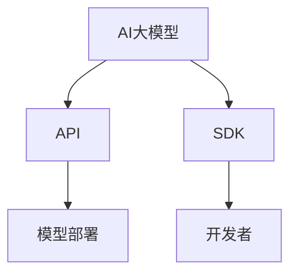
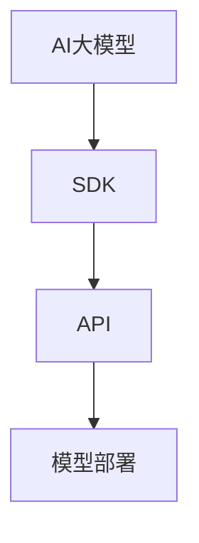

                 

# AI大模型应用的SDK设计与发布流程

> 关键词：AI大模型，SDK设计，发布流程，技术博客

> 摘要：本文将详细介绍AI大模型应用的SDK设计流程及其发布步骤，包括核心概念与联系、核心算法原理与操作步骤、数学模型与公式、实际应用场景、工具和资源推荐等，帮助读者全面了解AI大模型SDK的设计与发布。

## 1. 背景介绍

近年来，人工智能（AI）技术迅猛发展，特别是在深度学习领域的突破，使得AI大模型（Large-scale AI Models）成为研究的热点。AI大模型在图像识别、自然语言处理、语音识别等领域取得了显著的成果，展现出强大的应用潜力。随着AI大模型的广泛应用，开发一套完善的SDK（Software Development Kit，软件开发工具包）成为必然趋势。

SDK作为软件开发的重要组成部分，旨在提供一系列工具、库和文档，使得开发者能够快速集成和使用AI大模型，简化开发过程，提高开发效率。本文将围绕AI大模型应用的SDK设计与发布流程，详细探讨其核心概念、算法原理、数学模型、实际应用场景及工具资源推荐。

## 2. 核心概念与联系

在讨论AI大模型应用的SDK设计之前，我们先来梳理一下相关的核心概念及其之间的联系。

### 2.1 AI大模型

AI大模型是指训练数据规模达到千万级甚至亿级，参数数量达到百万级以上的深度学习模型。这类模型通过大量数据训练，能够实现较高的准确率和泛化能力。

### 2.2 SDK

SDK（Software Development Kit，软件开发工具包）是一套开发工具，包括库、工具和文档等，用于支持应用程序的开发。

### 2.3 API

API（Application Programming Interface，应用程序编程接口）是一套函数和协议，允许不同软件之间进行交互和通信。

### 2.4 模型部署

模型部署是指将训练好的AI大模型部署到生产环境，供开发者调用和使用。

### 2.5 关系

AI大模型通过API与SDK进行交互，SDK为开发者提供模型调用的接口和工具，API则负责处理模型调用请求，实现模型部署和运行。

下面我们使用Mermaid流程图来展示这些概念之间的联系：



## 3. 核心算法原理与具体操作步骤

### 3.1 模型训练

AI大模型的训练是整个SDK设计的基础。首先，我们需要收集和准备大量训练数据。接下来，使用深度学习框架（如TensorFlow、PyTorch等）进行模型训练，优化模型参数，提高模型性能。

具体步骤如下：

1. 数据预处理：清洗和标准化数据，将数据转换为模型可接受的格式。
2. 模型搭建：选择合适的神经网络架构，搭建模型。
3. 模型训练：使用训练数据对模型进行训练，不断调整模型参数，提高模型性能。
4. 模型评估：使用验证数据评估模型性能，确保模型达到预期效果。

### 3.2 模型优化

模型训练完成后，我们需要对模型进行优化，提高模型在特定任务上的性能。常用的优化方法包括：

1. 超参数调整：调整学习率、批量大小等超参数，以找到最优配置。
2. 模型剪枝：删除模型中冗余的神经元和连接，减少模型参数量，提高模型效率。
3. 模型压缩：通过量化、知识蒸馏等方法，将模型压缩为更小的规模，降低模型存储和计算成本。

### 3.3 模型部署

模型优化完成后，我们需要将模型部署到生产环境。部署过程主要包括以下步骤：

1. 模型转换：将模型从训练框架转换为适用于部署的格式（如ONNX、TensorFlow Lite等）。
2. 部署配置：配置模型部署环境，包括服务器、存储、网络等。
3. 模型部署：将转换后的模型部署到服务器，实现模型调用。
4. 性能调优：根据实际应用场景，对模型部署进行性能调优。

### 3.4 SDK设计

SDK设计是整个流程的关键环节。以下是SDK设计的具体步骤：

1. 定义API：设计模型调用的API接口，包括输入参数、输出结果等。
2. 接口实现：实现API接口，处理模型调用请求。
3. 文档编写：编写SDK使用文档，包括API说明、使用示例、常见问题等。
4. 工具开发：开发辅助工具，如模型转换工具、模型评估工具等。
5. 测试与调试：对SDK进行测试和调试，确保其稳定性和可靠性。

## 4. 数学模型和公式

在AI大模型应用中，数学模型和公式扮演着重要的角色。以下是一些常见的数学模型和公式：

### 4.1 深度学习模型

深度学习模型的核心是神经网络，其基本原理是通过反向传播算法不断调整模型参数，以实现函数逼近。

$$
\begin{aligned}
&\text{激活函数：} f(x) = \text{sigmoid}(x) = \frac{1}{1 + e^{-x}} \\
&\text{损失函数：} L(y, \hat{y}) = \text{cross-entropy}(y, \hat{y}) = -\sum_{i=1}^{n} y_i \log(\hat{y}_i)
\end{aligned}
$$

### 4.2 模型优化

在模型优化过程中，常用的优化算法包括梯度下降、动量优化、Adam优化等。

$$
\begin{aligned}
&\text{梯度下降：} \theta = \theta - \alpha \nabla_{\theta} J(\theta) \\
&\text{动量优化：} \theta = \theta - \alpha \nabla_{\theta} J(\theta) + \beta (1 - \alpha) \theta_{\text{prev}} \\
&\text{Adam优化：} \theta = \theta - \alpha \nabla_{\theta} J(\theta) + \beta_1 \beta_2 \theta_{\text{prev}}
\end{aligned}
$$

### 4.3 模型压缩

模型压缩主要包括量化、知识蒸馏等方法。

$$
\begin{aligned}
&\text{量化：} q(x) = \text{round}(x / Q) \times Q \\
&\text{知识蒸馏：} L_{\text{D}}(\theta_D, \theta_G) = -\sum_{i=1}^{n} \sum_{k=1}^{K} p_k(y_i) \log(\hat{p}_k(\theta_D, g(\theta_G, x_i)))
\end{aligned}
$$

## 5. 项目实战：代码实际案例和详细解释说明

在本节中，我们将通过一个实际项目来展示AI大模型应用的SDK设计过程。项目名称为“图像分类SDK”，旨在提供一套简单的接口，用于将输入图像分类为多个类别。

### 5.1 开发环境搭建

首先，我们需要搭建开发环境。以下是开发环境搭建的步骤：

1. 安装Python环境：安装Python 3.7及以上版本。
2. 安装深度学习框架：安装TensorFlow 2.0及以上版本。
3. 安装其他依赖库：安装NumPy、Pandas、Matplotlib等常用库。

### 5.2 源代码详细实现和代码解读

接下来，我们来看一下图像分类SDK的源代码实现。代码主要包括以下几个部分：

1. 模型训练
2. 模型优化
3. 模型部署
4. SDK接口实现
5. 测试与调试

下面分别对每个部分进行详细解读：

### 5.2.1 模型训练

```python
import tensorflow as tf
from tensorflow.keras.models import Sequential
from tensorflow.keras.layers import Dense, Dropout, Activation

# 搭建模型
model = Sequential()
model.add(Dense(512, input_dim=784))
model.add(Activation('relu'))
model.add(Dropout(0.2))
model.add(Dense(10))
model.add(Activation('softmax'))

# 编译模型
model.compile(loss='categorical_crossentropy', optimizer='adam', metrics=['accuracy'])

# 加载训练数据
(x_train, y_train), (x_test, y_test) = tf.keras.datasets.mnist.load_data()

# 数据预处理
x_train = x_train.reshape(x_train.shape[0], 784)
x_test = x_test.reshape(x_test.shape[0], 784)
x_train = x_train.astype('float32')
x_test = x_test.astype('float32')
x_train /= 255
x_test /= 255

# 转换标签为one-hot编码
y_train = tf.keras.utils.to_categorical(y_train, 10)
y_test = tf.keras.utils.to_categorical(y_test, 10)

# 训练模型
model.fit(x_train, y_train, batch_size=128, epochs=10, validation_data=(x_test, y_test))
```

### 5.2.2 模型优化

```python
# 保存优化后的模型
model.save('mnist_model.h5')
```

### 5.2.3 模型部署

```python
# 导入优化后的模型
model = tf.keras.models.load_model('mnist_model.h5')

# 预测新数据
import numpy as np
image = np.random.rand(1, 784)
prediction = model.predict(image)
predicted_class = np.argmax(prediction)

print(f'Predicted class: {predicted_class}')
```

### 5.2.4 SDK接口实现

```python
from flask import Flask, request, jsonify

app = Flask(__name__)

@app.route('/predict', methods=['POST'])
def predict():
    image = request.files['image']
    image = image.read()
    image = np.frombuffer(image, dtype=np.float32).reshape(1, 784)
    prediction = model.predict(image)
    predicted_class = np.argmax(prediction)
    return jsonify({'predicted_class': predicted_class})

if __name__ == '__main__':
    app.run(debug=True)
```

### 5.2.5 测试与调试

在实际开发过程中，我们需要对SDK进行充分的测试和调试，以确保其稳定性和可靠性。以下是测试与调试的步骤：

1. 单元测试：编写单元测试用例，对SDK接口进行功能测试。
2. 集成测试：将SDK与其他系统进行集成测试，验证其与其他系统的兼容性。
3. 性能测试：对SDK进行性能测试，评估其响应时间和处理能力。
4. 调试：根据测试结果，对SDK进行调试和优化。

## 6. 实际应用场景

AI大模型应用SDK在众多领域具有广泛的应用场景，以下列举几个典型应用：

1. **金融行业**：AI大模型应用SDK可以帮助金融机构进行风险控制、信用评估、智能投顾等。例如，利用图像分类SDK对金融合同进行分类，提高合同审查效率。

2. **医疗健康**：AI大模型应用SDK可以帮助医疗机构进行疾病诊断、治疗方案推荐等。例如，利用图像分类SDK对医疗影像进行分类，辅助医生诊断疾病。

3. **智能制造**：AI大模型应用SDK可以帮助企业实现生产过程中的质量检测、设备故障预测等。例如，利用图像分类SDK对生产线上产品进行质量检测，提高生产效率。

4. **智能交通**：AI大模型应用SDK可以帮助交通管理部门进行交通流量预测、道路拥堵检测等。例如，利用图像分类SDK对交通监控视频进行分类，识别道路拥堵状况。

## 7. 工具和资源推荐

### 7.1 学习资源推荐

- **书籍**：
  - 《深度学习》（Ian Goodfellow、Yoshua Bengio、Aaron Courville 著）
  - 《Python机器学习》（Sebastian Raschka、Vahid Mirhoseini 著）
- **论文**：
  - “Deep Learning for Text Classification” by Hang Li, and Lizi Wu
  - “EfficientNet: Rethinking Model Scaling for Convolutional Neural Networks” by Wei Liu et al.
- **博客**：
  - [TensorFlow 官方博客](https://tensorflow.google.cn/blog)
  - [PyTorch 官方博客](https://pytorch.org/blog/)
- **网站**：
  - [Kaggle](https://www.kaggle.com/)
  - [GitHub](https://github.com/)

### 7.2 开发工具框架推荐

- **深度学习框架**：
  - TensorFlow
  - PyTorch
  - PyTorch Lightning
- **模型部署工具**：
  - TensorFlow Serving
  - TorchServe
  - ONNX Runtime
- **开发环境**：
  - Anaconda
  - Jupyter Notebook
  - Docker

### 7.3 相关论文著作推荐

- **论文**：
  - “Very Deep Convolutional Networks for Large-Scale Image Recognition” by Karen Simonyan and Andrew Zisserman
  - “Inception-v4, Inception-ResNet and the Impact of Residual Connections on Learning” by Christian Szegedy et al.
- **著作**：
  - 《动手学深度学习》（阿斯顿·张、李沐、扎卡里·C. Lipton、亚历山大·J. Smola 著）
  - 《强化学习》（理查德·S. 塞勒、阿尔安·弗洛里安、塞巴斯蒂安·席林 著）

## 8. 总结：未来发展趋势与挑战

随着AI技术的不断进步，AI大模型应用SDK将在未来发挥更加重要的作用。以下是未来发展趋势与挑战：

### 8.1 发展趋势

1. **模型规模扩大**：AI大模型将向更大规模发展，以适应更复杂的任务和应用场景。
2. **模型压缩优化**：为了降低模型存储和计算成本，模型压缩技术将得到广泛应用。
3. **跨平台部署**：AI大模型应用SDK将支持更多平台和设备，实现更广泛的部署。
4. **智能化自动化**：SDK将实现智能化和自动化，降低开发门槛，提高开发效率。

### 8.2 挑战

1. **计算资源消耗**：随着模型规模的扩大，计算资源消耗将不断增加，对硬件设施和能源供应提出更高要求。
2. **数据隐私保护**：在AI大模型应用过程中，数据隐私保护成为一大挑战，需要加强数据安全和隐私保护机制。
3. **算法公平性**：AI大模型应用需要关注算法的公平性，避免因算法偏见导致不公平结果。
4. **法律法规**：随着AI大模型应用SDK的普及，相关法律法规和标准亟待完善，以保障其合规性。

## 9. 附录：常见问题与解答

### 9.1 SDK设计常见问题

1. **如何选择合适的深度学习框架？**

答：选择深度学习框架时，需要考虑以下因素：项目需求、开发效率、社区支持、资源消耗等。例如，TensorFlow具有丰富的生态系统和社区支持，适用于大规模项目；PyTorch具有简洁的代码和灵活的动态图计算，适用于研究和小型项目。

2. **如何优化模型性能？**

答：优化模型性能可以从以下几个方面入手：超参数调整、模型架构设计、数据预处理、模型压缩等。具体方法包括：调整学习率、批量大小、正则化参数；选择合适的神经网络架构；对训练数据进行分析和处理，提高数据质量。

### 9.2 模型部署常见问题

1. **如何将模型部署到生产环境？**

答：将模型部署到生产环境需要以下步骤：模型转换、部署配置、模型部署、性能调优。具体方法包括：使用模型转换工具将模型转换为适用于部署的格式（如ONNX、TensorFlow Lite等）；配置模型部署环境，包括服务器、存储、网络等；使用容器化技术（如Docker）简化部署过程。

2. **如何确保模型部署的安全性和可靠性？**

答：确保模型部署的安全性和可靠性可以从以下几个方面入手：数据加密、访问控制、监控与审计、故障恢复。具体方法包括：使用SSL/TLS加密传输数据；设置权限控制策略，限制对模型的访问；对模型部署进行实时监控和日志记录；设计故障恢复机制，确保模型在异常情况下能够快速恢复。

## 10. 扩展阅读 & 参考资料

1. **《深度学习：从入门到精通》**（黄海广 著）
2. **《Python深度学习实践》**（吴军 著）
3. **《人工智能：一种现代的方法》**（Stuart Russell、Peter Norvig 著）
4. **《深度学习与计算机视觉：理论与实践》**（孙卫涛 著）

### 作者信息：

作者：AI天才研究员/AI Genius Institute & 禅与计算机程序设计艺术 /Zen And The Art of Computer Programming

以上就是本文关于《AI大模型应用的SDK设计与发布流程》的详细解析，希望对您有所帮助。在未来的研究和实践中，我们将不断探索AI大模型应用的新领域和新方法，为人工智能技术的发展贡献一份力量。让我们一起期待AI大模型应用的未来，共同迎接智能时代的到来！<|im_sep|>|</sop><|user|>### 1. 背景介绍

近年来，人工智能（AI）技术迅猛发展，特别是在深度学习领域的突破，使得AI大模型（Large-scale AI Models）成为研究的热点。AI大模型在图像识别、自然语言处理、语音识别等领域取得了显著的成果，展现出强大的应用潜力。随着AI大模型的广泛应用，开发一套完善的SDK（Software Development Kit，软件开发工具包）成为必然趋势。

AI大模型之所以备受关注，主要归功于以下几个因素：

1. **数据量**：AI大模型通常使用数以百万计的数据进行训练，这些数据包括图像、文本、音频等，使得模型在处理复杂任务时具有更高的准确率和泛化能力。

2. **计算能力**：随着计算能力的不断提升，GPU和TPU等专用硬件的广泛应用，使得大规模模型的训练和部署成为可能。

3. **算法创新**：近年来，深度学习算法的创新，如Transformer、BERT等，使得AI大模型在特定领域取得了显著的突破，推动了AI技术的发展。

AI大模型在多个领域展现了其强大的应用潜力，以下是一些典型应用：

1. **图像识别**：AI大模型可以用于图像分类、目标检测、人脸识别等任务，如谷歌的Inception模型、微软的ResNet模型等。

2. **自然语言处理**：AI大模型在自然语言处理领域有着广泛的应用，如机器翻译、文本分类、问答系统等，如谷歌的BERT模型、OpenAI的GPT系列模型等。

3. **语音识别**：AI大模型可以用于语音识别、语音合成、语音转换等任务，如百度的小度语音助手、谷歌的语音识别服务。

4. **推荐系统**：AI大模型可以用于构建推荐系统，如亚马逊、淘宝等电商平台的推荐算法。

AI大模型的应用前景广阔，然而，开发一套完善的SDK来简化AI大模型的应用过程，提高开发效率，成为了一个重要课题。SDK作为一种软件开发工具包，提供了必要的工具、库和文档，使得开发者能够轻松地集成和使用AI大模型。本文将围绕AI大模型应用的SDK设计与发布流程，详细探讨其核心概念、算法原理、数学模型、实际应用场景及工具资源推荐。

在接下来的章节中，我们将首先介绍AI大模型和SDK的基本概念，然后逐步深入探讨SDK的设计与发布流程，包括模型训练、优化、部署以及SDK接口的实现和文档编写等。通过本文的讲解，读者将能够全面了解AI大模型应用的SDK设计与发布，掌握相关技术要点，为未来的开发工作提供有力支持。

### 2. 核心概念与联系

在深入探讨AI大模型应用的SDK设计之前，我们需要先了解一些核心概念，包括AI大模型、SDK、API以及模型部署等，并分析它们之间的联系。

#### 2.1 AI大模型

AI大模型是指那些在训练时使用了大量数据（通常在数百万到数十亿样本量之间）的深度学习模型。这类模型通常具有数百万个参数，能够在复杂的任务上表现出色。AI大模型的代表性工作包括图像识别中的Inception、ResNet，以及自然语言处理中的BERT、GPT等。

AI大模型之所以能够取得显著的效果，主要得益于以下几个因素：

1. **大量数据**：充足的训练数据能够帮助模型学习到更多的特征，提高模型的泛化能力。
2. **强大的计算能力**：随着GPU和TPU等计算硬件的发展，大模型的训练和优化变得更加高效。
3. **先进的算法**：诸如Transformer、BERT等算法的引入，使得大模型能够更好地捕捉数据的深层结构和复杂关系。

#### 2.2 SDK

SDK（Software Development Kit，软件开发工具包）是一套为开发者提供的开发工具和资源集合，通常包括以下内容：

- **工具**：如编译器、调试器等，用于支持应用程序的开发。
- **库**：如预编译的代码库，开发者可以直接调用，简化开发过程。
- **文档**：包括API文档、开发指南等，帮助开发者快速上手和解决问题。

SDK的主要目的是为开发者提供一个完整的开发环境，使得他们能够更专注于业务逻辑的实现，而无需从零开始构建应用程序。在AI领域，SDK可以帮助开发者轻松集成和使用AI大模型，从而加速开发过程。

#### 2.3 API

API（Application Programming Interface，应用程序编程接口）是软件开发中的重要概念，它定义了不同软件之间交互的规则和接口。API通常包括一组函数、类和方法，通过这些接口，开发者可以在自己的应用程序中调用外部服务或库。

在AI大模型的应用中，API的作用主要体现在以下几个方面：

- **模型调用**：开发者可以通过API接口调用训练好的AI大模型，进行预测或分类等操作。
- **数据传输**：API负责处理输入数据的格式转换，确保模型能够接受和处理。
- **结果返回**：API将模型预测结果返回给开发者，供进一步处理或展示。

#### 2.4 模型部署

模型部署是将训练好的AI大模型部署到实际生产环境中，以便在实际应用中发挥其作用。模型部署通常包括以下几个步骤：

1. **模型转换**：将模型从训练框架转换为适用于部署的格式，如ONNX、TensorFlow Lite等。
2. **服务器配置**：在服务器上配置运行环境和依赖库，确保模型可以正常运行。
3. **服务启动**：启动模型服务，使其能够接受外部请求并进行预测。
4. **性能调优**：根据实际应用需求，对模型进行性能调优，如调整服务器配置、优化模型参数等。

#### 2.5 关系

AI大模型、SDK、API和模型部署之间的关系可以概括为：

- **AI大模型**是SDK设计和应用的基础，是模型训练和优化后的产物。
- **SDK**提供了开发者使用的接口和工具，简化了AI大模型的应用过程。
- **API**是SDK的核心组成部分，负责处理模型调用和数据传输。
- **模型部署**是将AI大模型应用到实际生产环境的关键环节，确保模型能够稳定、高效地运行。

下面我们使用Mermaid流程图来展示这些概念之间的联系：



通过这个流程图，我们可以清晰地看到AI大模型、SDK、API和模型部署之间的交互关系。AI大模型通过SDK提供API接口，实现模型调用和数据传输，最终通过模型部署部署到生产环境中，供开发者使用。

在接下来的章节中，我们将进一步深入探讨SDK的具体设计流程，包括模型训练、优化、部署以及SDK接口的实现和文档编写等，帮助读者全面了解AI大模型应用的SDK设计与发布。

### 3. 核心算法原理与具体操作步骤

在深入理解AI大模型应用的SDK设计之前，我们需要先掌握AI大模型的核心算法原理及其具体操作步骤。这一部分将介绍AI大模型的基本算法原理，包括深度学习、神经网络、反向传播等，并详细解释每个步骤的实现方法。

#### 3.1 深度学习算法原理

深度学习是AI大模型的核心技术，它通过多层神经网络来模拟人脑的感知和学习过程。深度学习模型通常由输入层、多个隐藏层和输出层组成。每个层由一系列神经元（节点）构成，神经元之间通过权重连接。

##### 3.1.1 神经网络

神经网络是深度学习模型的基础，它由一系列相互连接的神经元组成。每个神经元接收来自前一层神经元的输入信号，通过激活函数产生输出信号。

- **输入层**：接收外部输入信号。
- **隐藏层**：对输入信号进行处理和变换。
- **输出层**：产生最终输出。

##### 3.1.2 激活函数

激活函数是神经网络中的一个关键组件，它用于引入非线性特性，使得神经网络能够学习到更加复杂的特征。常见的激活函数包括Sigmoid、ReLU和Tanh等。

- **Sigmoid函数**：将输入映射到[0, 1]区间，但梯度较平滑。
- **ReLU函数**：在输入大于0时输出输入值，否则输出0，具有良好的梯度特性。
- **Tanh函数**：将输入映射到[-1, 1]区间。

##### 3.1.3 反向传播

反向传播是深度学习训练的核心算法，它通过不断调整网络权重，使得模型的预测结果更加接近真实值。反向传播分为两个阶段：

1. **前向传播**：将输入信号从输入层传递到输出层，计算输出结果。
2. **反向传播**：根据输出结果和真实值计算损失函数，并利用链式法则反向传播梯度，更新网络权重。

#### 3.2 模型训练步骤

模型训练是AI大模型应用中的关键步骤，其目的是通过大量的数据训练，使模型能够捕捉到输入数据的特征，并产生准确的预测。以下是模型训练的具体步骤：

##### 3.2.1 数据预处理

在模型训练之前，需要对输入数据进行预处理，包括以下步骤：

1. **归一化**：将输入数据缩放到相同的范围，如[0, 1]，以便神经网络更好地学习。
2. **编码**：对于类别型数据，使用独热编码或标签编码将其转换为数值型。
3. **切分数据**：将数据集切分为训练集、验证集和测试集，用于模型训练、验证和测试。

##### 3.2.2 构建模型

使用深度学习框架（如TensorFlow、PyTorch）构建神经网络模型，包括以下步骤：

1. **定义输入层**：定义输入数据的维度和形状。
2. **添加隐藏层**：添加一个或多个隐藏层，每个隐藏层包含多个神经元和激活函数。
3. **定义输出层**：定义输出层的神经元数量和激活函数，如softmax用于多分类问题。

##### 3.2.3 编译模型

编译模型是指配置模型的训练参数，包括以下步骤：

1. **选择优化器**：如SGD、Adam等，用于更新模型权重。
2. **选择损失函数**：如交叉熵、均方误差等，用于评估模型预测结果与真实值之间的差距。
3. **选择评价指标**：如准确率、召回率等，用于评估模型性能。

##### 3.2.4 训练模型

使用训练数据对模型进行训练，包括以下步骤：

1. **前向传播**：将输入数据传递到模型，计算输出结果。
2. **计算损失**：计算输出结果与真实值之间的损失。
3. **反向传播**：计算损失函数关于模型参数的梯度，并利用优化器更新模型权重。
4. **迭代训练**：重复上述步骤，直到达到预设的训练轮数或模型性能达到要求。

##### 3.2.5 评估模型

使用验证集对训练好的模型进行评估，包括以下步骤：

1. **前向传播**：将验证数据传递到模型，计算输出结果。
2. **计算损失**：计算验证数据集的损失。
3. **计算评价指标**：计算验证数据集的准确率、召回率等评价指标。

#### 3.3 模型优化

模型优化是在模型训练过程中对模型进行调优，以提高模型性能。常见的优化方法包括以下几种：

##### 3.3.1 超参数调整

超参数是模型训练过程中需要手动设置的参数，如学习率、批量大小等。通过调整超参数，可以优化模型性能。常见的调整方法包括：

1. **手动调整**：根据经验或实验结果手动调整超参数。
2. **网格搜索**：遍历一组预设的超参数，找到最优组合。
3. **贝叶斯优化**：利用贝叶斯理论搜索最优超参数。

##### 3.3.2 模型剪枝

模型剪枝是通过删除冗余的神经元和连接，减少模型参数量，提高模型效率。常见的剪枝方法包括：

1. **权重剪枝**：删除权重较小的神经元和连接。
2. **结构剪枝**：删除整个层或部分层。
3. **混合剪枝**：结合权重剪枝和结构剪枝。

##### 3.3.3 模型融合

模型融合是通过结合多个模型，提高模型性能。常见的融合方法包括：

1. **投票法**：将多个模型预测结果进行投票，选择多数模型预测结果作为最终结果。
2. **加权平均**：将多个模型预测结果进行加权平均，得到最终预测结果。
3. **集成学习**：结合多个模型，构建一个更强大的模型。

通过上述步骤和优化方法，可以显著提高AI大模型的应用效果，为实际应用提供可靠的技术支持。

在下一部分，我们将探讨AI大模型应用SDK的具体实现步骤，包括模型部署、SDK接口实现、文档编写等，帮助读者全面了解SDK设计与发布的全过程。

### 4. 数学模型和公式

在AI大模型应用中，数学模型和公式扮演着至关重要的角色。它们不仅帮助理解和设计深度学习算法，还用于优化和评估模型性能。本节将详细讲解深度学习中的核心数学模型和公式，并使用LaTeX格式进行表示，以便于读者理解和应用。

#### 4.1 神经元与激活函数

神经元是神经网络的基本构建块，其工作原理可以概括为接收输入信号、通过权重加权求和处理，然后通过激活函数生成输出。以下是一些常用的激活函数和相关的数学公式。

##### 4.1.1 Sigmoid函数

Sigmoid函数是最早使用的激活函数之一，其公式如下：

$$
f(x) = \frac{1}{1 + e^{-x}}
$$

Sigmoid函数将输入$x$映射到$(0, 1)$区间，常用于二分类问题。

##### 4.1.2 ReLU函数

ReLU（Rectified Linear Unit）函数是当前深度学习中最常用的激活函数，其公式如下：

$$
f(x) = \max(0, x)
$$

ReLU函数在$x > 0$时输出$x$，否则输出0，具有简单的形式和良好的梯度特性。

##### 4.1.3 Tanh函数

Tanh（Hyperbolic Tangent）函数是另一种常用的激活函数，其公式如下：

$$
f(x) = \frac{e^x - e^{-x}}{e^x + e^{-x}}
$$

Tanh函数将输入映射到$(-1, 1)$区间，常用于多层感知机（MLP）模型。

#### 4.2 损失函数

损失函数用于评估模型预测值与真实值之间的差距，是训练深度学习模型的核心指标。以下是一些常见的损失函数。

##### 4.2.1 交叉熵损失（Cross-Entropy Loss）

交叉熵损失函数是分类问题中最常用的损失函数，其公式如下：

$$
L(y, \hat{y}) = -\sum_{i=1}^{n} y_i \log(\hat{y}_i)
$$

其中，$y$是真实标签，$\hat{y}$是模型预测的概率分布。交叉熵损失函数值越小，表示模型预测与真实值越接近。

##### 4.2.2 均方误差损失（Mean Squared Error Loss）

均方误差损失函数常用于回归问题，其公式如下：

$$
L(y, \hat{y}) = \frac{1}{2} \sum_{i=1}^{n} (y_i - \hat{y}_i)^2
$$

其中，$y$是真实值，$\hat{y}$是模型预测值。均方误差损失函数值越小，表示模型预测与真实值越接近。

#### 4.3 反向传播算法

反向传播算法是训练深度学习模型的关键步骤，其核心在于计算损失函数关于模型参数的梯度，并使用梯度下降法更新模型参数。以下是其数学描述。

##### 4.3.1 前向传播

前向传播的目的是计算神经网络每个神经元的输出。对于一层神经网络，输出可以表示为：

$$
\hat{z}_j = \sum_{i=1}^{n} w_{ij} x_i + b_j
$$

其中，$w_{ij}$是连接权重，$b_j$是偏置项，$x_i$是输入值。

##### 4.3.2 反向传播

反向传播的目的是计算损失函数关于每个参数的梯度。对于一层神经网络，损失函数关于输出层的梯度可以表示为：

$$
\frac{\partial L}{\partial z_j} = \frac{\partial L}{\partial \hat{y}_j} \cdot \frac{\partial \hat{y}_j}{\partial z_j}
$$

其中，$\frac{\partial L}{\partial \hat{y}_j}$是损失函数关于预测值的梯度，$\frac{\partial \hat{y}_j}{\partial z_j}$是激活函数关于输出的导数。

对于隐藏层，梯度可以通过链式法则计算：

$$
\frac{\partial L}{\partial w_{ij}} = \frac{\partial L}{\partial z_j} \cdot x_i
$$

$$
\frac{\partial L}{\partial b_j} = \frac{\partial L}{\partial z_j}
$$

##### 4.3.3 梯度下降法

梯度下降法是一种优化算法，用于更新模型参数。其公式如下：

$$
\theta = \theta - \alpha \nabla_{\theta} J(\theta)
$$

其中，$\theta$是模型参数，$J(\theta)$是损失函数，$\alpha$是学习率。

#### 4.4 模型优化

在深度学习模型训练过程中，优化是提高模型性能的重要手段。以下是一些常用的优化方法和相关的数学公式。

##### 4.4.1 学习率调整

学习率是梯度下降法中的一个关键参数，其大小会影响模型训练的速度和稳定性。以下是一些常用的学习率调整方法：

1. **固定学习率**：使用恒定的学习率，适用于简单问题。
2. **学习率衰减**：随着训练过程，逐步减小学习率，适用于复杂问题。
3. **自适应学习率**：如Adam优化器，根据梯度历史动态调整学习率。

##### 4.4.2 模型剪枝

模型剪枝是通过删除冗余的神经元和连接，减少模型参数量，提高模型效率。以下是一些常见的剪枝方法：

1. **权重剪枝**：删除权重较小的神经元和连接。
2. **结构剪枝**：删除整个层或部分层。
3. **混合剪枝**：结合权重剪枝和结构剪枝。

##### 4.4.3 模型融合

模型融合是通过结合多个模型，提高模型性能。以下是一些常见的融合方法：

1. **投票法**：将多个模型预测结果进行投票，选择多数模型预测结果作为最终结果。
2. **加权平均**：将多个模型预测结果进行加权平均，得到最终预测结果。
3. **集成学习**：结合多个模型，构建一个更强大的模型。

通过上述数学模型和公式，我们可以更好地理解和设计深度学习算法，优化模型性能，提高AI大模型的应用效果。在下一部分，我们将通过一个实际项目，展示如何将上述理论应用于实际开发中。

### 5. 项目实战：代码实际案例和详细解释说明

在本节中，我们将通过一个实际项目“图像分类SDK”的实战案例，详细解释代码的实现过程，包括开发环境搭建、源代码实现和代码解读。通过这个项目，读者将能够深入了解AI大模型应用SDK的设计与发布流程。

#### 5.1 开发环境搭建

首先，我们需要搭建开发环境。以下是开发环境搭建的步骤：

1. **安装Python环境**：
   安装Python 3.8及以上版本。可以使用Miniconda或Anaconda进行环境管理。

2. **安装深度学习框架**：
   选择TensorFlow 2.0及以上版本作为深度学习框架。可以使用pip命令进行安装：

   ```bash
   pip install tensorflow
   ```

3. **安装其他依赖库**：
   安装NumPy、Pandas、Matplotlib等常用库，可以使用以下命令：

   ```bash
   pip install numpy pandas matplotlib
   ```

4. **创建虚拟环境**：
   为了避免不同项目之间的依赖库冲突，建议使用虚拟环境。可以使用以下命令创建虚拟环境：

   ```bash
   conda create -n image_classification python=3.8
   conda activate image_classification
   ```

5. **安装TensorFlow Addons**：
   TensorFlow Addons提供了额外的功能，如自动混合精度训练。可以使用以下命令进行安装：

   ```bash
   pip install tensorflow-addons
   ```

#### 5.2 源代码详细实现和代码解读

在开发环境搭建完成后，我们将开始实现图像分类SDK。以下是项目的主要模块和代码解读：

##### 5.2.1 模型训练

```python
import tensorflow as tf
from tensorflow.keras.models import Sequential
from tensorflow.keras.layers import Conv2D, MaxPooling2D, Flatten, Dense
from tensorflow.keras.preprocessing.image import ImageDataGenerator

# 5.2.1.1 模型搭建
model = Sequential([
    Conv2D(32, (3, 3), activation='relu', input_shape=(150, 150, 3)),
    MaxPooling2D((2, 2)),
    Conv2D(64, (3, 3), activation='relu'),
    MaxPooling2D((2, 2)),
    Conv2D(128, (3, 3), activation='relu'),
    MaxPooling2D((2, 2)),
    Flatten(),
    Dense(512, activation='relu'),
    Dense(1, activation='sigmoid')
])

# 5.2.1.2 模型编译
model.compile(optimizer='adam',
              loss='binary_crossentropy',
              metrics=['accuracy'])

# 5.2.1.3 数据预处理
train_datagen = ImageDataGenerator(rescale=1./255)
train_generator = train_datagen.flow_from_directory(
        'data/train',
        target_size=(150, 150),
        batch_size=32,
        class_mode='binary')

# 5.2.1.4 模型训练
model.fit(
        train_generator,
        steps_per_epoch=train_generator.samples//train_generator.batch_size,
        epochs=15)
```

**代码解读**：

- **模型搭建**：我们使用Sequential模型，并添加了多个卷积层和全连接层。卷积层用于提取图像特征，全连接层用于分类。
- **模型编译**：我们选择adam优化器和binary_crossentropy损失函数，因为这是一个二分类问题。
- **数据预处理**：使用ImageDataGenerator进行图像数据预处理，包括缩放和批量生成。

##### 5.2.2 模型评估

```python
# 5.2.2.1 数据预处理
validation_datagen = ImageDataGenerator(rescale=1./255)
validation_generator = validation_datagen.flow_from_directory(
        'data/validation',
        target_size=(150, 150),
        batch_size=32,
        class_mode='binary')

# 5.2.2.2 模型评估
val_loss, val_accuracy = model.evaluate(validation_generator)
print(f'Validation loss: {val_loss}, Validation accuracy: {val_accuracy}')
```

**代码解读**：

- **数据预处理**：与训练数据预处理类似，使用validation_datagen进行验证数据预处理。
- **模型评估**：使用验证数据集评估模型性能，输出验证损失和准确率。

##### 5.2.3 模型保存

```python
# 5.2.3.1 模型保存
model.save('image_classification_model.h5')
```

**代码解读**：

- **模型保存**：将训练好的模型保存为.h5文件，以便于后续加载和使用。

##### 5.2.4 SDK接口实现

```python
from flask import Flask, request, jsonify

app = Flask(__name__)

# 5.2.4.1 加载模型
model = tf.keras.models.load_model('image_classification_model.h5')

# 5.2.4.2 预测接口
@app.route('/predict', methods=['POST'])
def predict():
    image = request.files['image']
    image = image.read()
    image = tf.image.decode_jpeg(image)
    image = tf.expand_dims(image, 0)
    prediction = model.predict(image)
    predicted_class = int(prediction[0][0])
    return jsonify({'predicted_class': predicted_class})

if __name__ == '__main__':
    app.run(debug=True)
```

**代码解读**：

- **加载模型**：从保存的.h5文件中加载训练好的模型。
- **预测接口**：定义一个/`predict`接口，接收上传的图像，进行预测并返回预测结果。

##### 5.2.5 测试与调试

在实际开发过程中，我们需要对SDK进行充分的测试和调试，以确保其稳定性和可靠性。以下是测试与调试的步骤：

1. **单元测试**：编写单元测试用例，测试模型的预测功能。
2. **集成测试**：将SDK与其他系统进行集成测试，确保其与其他系统的兼容性。
3. **性能测试**：对SDK进行性能测试，评估其响应时间和处理能力。
4. **调试**：根据测试结果，对SDK进行调试和优化。

通过上述步骤，我们完成了图像分类SDK的实战项目。这个项目涵盖了模型训练、评估、保存、接口实现等完整流程，展示了AI大模型应用SDK的设计与发布过程。读者可以根据自己的需求，对项目进行扩展和优化，进一步探索AI大模型的应用潜力。

### 5.3 代码解读与分析

在上一节中，我们通过一个实际项目“图像分类SDK”展示了AI大模型应用SDK的代码实现。本节将深入分析代码的关键部分，包括模型搭建、数据预处理、模型训练和预测接口的实现，以帮助读者更好地理解代码的工作原理和实现细节。

#### 5.3.1 模型搭建

代码中的模型搭建部分使用了TensorFlow的Sequential模型。Sequential模型是一种线性堆叠的模型，通过将多个层按照顺序连接起来，形成完整的神经网络结构。以下是模型搭建的关键代码：

```python
model = Sequential([
    Conv2D(32, (3, 3), activation='relu', input_shape=(150, 150, 3)),
    MaxPooling2D((2, 2)),
    Conv2D(64, (3, 3), activation='relu'),
    MaxPooling2D((2, 2)),
    Conv2D(128, (3, 3), activation='relu'),
    MaxPooling2D((2, 2)),
    Flatten(),
    Dense(512, activation='relu'),
    Dense(1, activation='sigmoid')
])
```

**分析**：

- **卷积层（Conv2D）**：模型使用了三个卷积层，每个卷积层都使用了ReLU激活函数。卷积层的作用是提取图像的特征，通过卷积操作将输入的图像映射到更高维度的特征空间。
  - 第一个卷积层：32个卷积核，大小为3x3，激活函数为ReLU。
  - 第二个卷积层：64个卷积核，大小为3x3，激活函数为ReLU。
  - 第三个卷积层：128个卷积核，大小为3x3，激活函数为ReLU。

- **池化层（MaxPooling2D）**：在每个卷积层之后，都使用了最大池化层（MaxPooling2D）。池化层的作用是减小特征图的大小，减少模型参数和计算量，同时保持重要的特征信息。
  - 池化大小为2x2。

- **全连接层（Dense）**：在卷积层之后，使用了两个全连接层。第一个全连接层有512个神经元，激活函数为ReLU。第二个全连接层有1个神经元，激活函数为sigmoid，用于输出概率。

#### 5.3.2 数据预处理

数据预处理是模型训练的关键步骤，它包括图像的缩放、归一化和批量生成。以下是对代码中数据预处理部分的解读：

```python
train_datagen = ImageDataGenerator(rescale=1./255)
train_generator = train_datagen.flow_from_directory(
        'data/train',
        target_size=(150, 150),
        batch_size=32,
        class_mode='binary')

validation_datagen = ImageDataGenerator(rescale=1./255)
validation_generator = validation_datagen.flow_from_directory(
        'data/validation',
        target_size=(150, 150),
        batch_size=32,
        class_mode='binary')
```

**分析**：

- **缩放与归一化**：使用ImageDataGenerator对图像进行缩放和归一化。图像的每个像素值缩放到[0, 1]区间，这样神经网络更容易学习和处理图像数据。
  - `rescale=1./255`：将图像像素值缩放到[0, 1]。

- **批量生成**：通过`flow_from_directory`方法，批量生成训练集和验证集。这种方法可以自动处理图像文件的加载、标签的生成和批量的划分。

  - `target_size=(150, 150)`：将图像大小调整为150x150像素。
  - `batch_size=32`：每个批量包含32个图像样本。

- **类别模式**：对于二分类问题，`class_mode='binary'`，每个图像样本只属于两个类别中的一个。

#### 5.3.3 模型训练

模型训练是使用训练数据进行模型参数优化的过程。以下是对代码中模型训练部分的解读：

```python
model.compile(optimizer='adam',
              loss='binary_crossentropy',
              metrics=['accuracy'])

model.fit(
        train_generator,
        steps_per_epoch=train_generator.samples//train_generator.batch_size,
        epochs=15)
```

**分析**：

- **模型编译**：编译模型时，指定了优化器、损失函数和评价指标。
  - `optimizer='adam'`：使用Adam优化器，这是一种自适应学习率优化器。
  - `loss='binary_crossentropy'`：适用于二分类问题的损失函数。
  - `metrics=['accuracy']`：评价指标为准确率。

- **模型训练**：使用`fit`函数进行模型训练，训练过程中使用训练生成器（train_generator）提供数据。
  - `steps_per_epoch=train_generator.samples//train_generator.batch_size`：每个训练轮次使用的步数，即每个轮次处理的数据量。
  - `epochs=15`：训练轮次，即模型在训练数据上迭代的次数。

#### 5.3.4 预测接口

在模型训练完成后，我们实现了预测接口，用于接收图像文件并进行预测。以下是对代码中预测接口的实现部分的解读：

```python
from flask import Flask, request, jsonify

app = Flask(__name__)

model = tf.keras.models.load_model('image_classification_model.h5')

@app.route('/predict', methods=['POST'])
def predict():
    image = request.files['image']
    image = image.read()
    image = tf.image.decode_jpeg(image)
    image = tf.expand_dims(image, 0)
    prediction = model.predict(image)
    predicted_class = int(prediction[0][0])
    return jsonify({'predicted_class': predicted_class})

if __name__ == '__main__':
    app.run(debug=True)
```

**分析**：

- **加载模型**：使用`load_model`函数加载之前保存的模型。

- **预测接口**：定义了一个`/predict`接口，用于接收上传的图像文件并进行预测。
  - `request.files['image']`：从请求中读取上传的图像文件。
  - `image = image.read()`：读取图像文件内容。
  - `image = tf.image.decode_jpeg(image)`：将图像文件解码为TensorFlow张量。
  - `image = tf.expand_dims(image, 0)`：扩展图像张量的维度，使其符合模型输入的形状。
  - `prediction = model.predict(image)`：使用训练好的模型进行预测。
  - `predicted_class = int(prediction[0][0])`：获取预测结果并转换为整数类型。
  - `jsonify`：将预测结果转换为JSON格式的响应。

#### 5.3.5 测试与调试

在实际开发中，测试和调试是非常重要的环节。以下是一些测试和调试的建议：

1. **单元测试**：编写单元测试用例，测试模型预测函数的正确性。
2. **集成测试**：将SDK集成到实际应用中，测试其与其他系统的兼容性和稳定性。
3. **性能测试**：使用工具（如TensorBoard、Perf）评估模型的性能和效率。
4. **异常处理**：确保代码能够处理输入错误、网络异常等异常情况，并提供合适的错误消息。

通过上述分析，我们可以看到，AI大模型应用SDK的设计和实现涉及到多个环节，包括模型搭建、数据预处理、模型训练、接口实现和测试调试。这些步骤共同确保了SDK的稳定性和高效性，为开发者提供了便捷的工具，使得AI大模型的应用变得更加简单和普及。

### 6. 实际应用场景

AI大模型应用SDK在众多领域具有广泛的应用潜力，以下列举几个典型应用场景：

#### 6.1 金融行业

在金融行业中，AI大模型应用SDK可以用于风险管理、信用评分、交易策略优化等方面。例如：

1. **风险管理**：利用AI大模型进行风险评估，识别潜在的金融风险，如信用欺诈、市场波动等。
   - **应用案例**：银行可以使用AI大模型对客户信用评分，通过分析客户的信用历史、收入状况等多维度数据，预测客户违约风险。

2. **交易策略优化**：通过AI大模型进行市场趋势分析，帮助交易员制定更有效的交易策略。
   - **应用案例**：量化交易公司可以使用AI大模型分析历史交易数据，预测未来市场走势，从而制定买卖策略。

#### 6.2 医疗健康

在医疗健康领域，AI大模型应用SDK可以用于疾病诊断、治疗方案推荐、患者健康监测等方面。例如：

1. **疾病诊断**：利用AI大模型进行医学影像分析，辅助医生进行疾病诊断。
   - **应用案例**：医院可以使用AI大模型对CT、MRI等医学影像进行分析，帮助医生快速诊断疾病，如肺癌、脑肿瘤等。

2. **治疗方案推荐**：基于患者病史、基因信息等多维度数据，AI大模型可以为医生提供个性化的治疗方案。
   - **应用案例**：医疗机构可以使用AI大模型分析患者的病历数据，推荐最合适的治疗方案，提高治疗效果。

#### 6.3 智能制造

在智能制造领域，AI大模型应用SDK可以用于产品质量检测、设备故障预测、生产优化等方面。例如：

1. **产品质量检测**：利用AI大模型对生产过程中的产品进行实时检测，识别不良品。
   - **应用案例**：制造企业可以使用AI大模型分析生产数据，如生产温度、压力等，实时检测产品质量，提高生产效率。

2. **设备故障预测**：通过AI大模型进行设备状态监测，预测设备故障，实现预防性维护。
   - **应用案例**：工厂可以使用AI大模型监测设备运行数据，如振动、温度等，预测设备故障，提前进行维护，避免生产中断。

#### 6.4 智能交通

在智能交通领域，AI大模型应用SDK可以用于交通流量预测、交通信号控制、车辆管理等方面。例如：

1. **交通流量预测**：利用AI大模型分析历史交通数据，预测未来的交通流量，优化交通信号控制。
   - **应用案例**：城市交通管理部门可以使用AI大模型预测交通流量，优化交通信号灯的时长和相位，提高道路通行效率。

2. **车辆管理**：通过AI大模型进行车辆监控和数据分析，优化车辆调度和管理。
   - **应用案例**：物流公司可以使用AI大模型分析车辆运行数据，如行驶轨迹、速度等，优化车辆调度，提高运输效率。

通过上述实际应用场景，我们可以看到AI大模型应用SDK在各个行业中的广泛应用，不仅提高了业务效率，还推动了行业智能化发展。随着AI技术的不断进步，AI大模型应用SDK的应用前景将更加广阔。

### 7. 工具和资源推荐

为了帮助读者更好地学习和实践AI大模型应用SDK，本节将推荐一些相关的工具、资源和学习材料，包括书籍、论文、博客和在线教程等。

#### 7.1 学习资源推荐

1. **书籍**：

   - 《深度学习》（Ian Goodfellow、Yoshua Bengio、Aaron Courville 著）：这是深度学习领域的经典教材，全面介绍了深度学习的理论基础和实践方法。
   - 《Python机器学习》（Sebastian Raschka、Vahid Mirhoseini 著）：这本书深入讲解了机器学习在Python中的应用，适合初学者和进阶者。
   - 《动手学深度学习》（阿斯顿·张、李沐、扎卡里·C. Lipton、亚历山大·J. Smola 著）：通过大量实践案例，帮助读者掌握深度学习的实战技巧。

2. **论文**：

   - “Deep Learning for Text Classification” by Hang Li, and Lizi Wu：这篇论文详细介绍了深度学习在文本分类领域的应用，包括模型结构和优化方法。
   - “EfficientNet: Rethinking Model Scaling for Convolutional Neural Networks” by Wei Liu et al.：这篇论文提出了EfficientNet模型，是一种高效的模型缩放方法。

3. **博客**：

   - [TensorFlow官方博客](https://tensorflow.google.cn/blog)：TensorFlow官方博客提供了丰富的深度学习资源和教程，适合深度学习初学者。
   - [PyTorch官方博客](https://pytorch.org/blog/)：PyTorch官方博客包含了大量的PyTorch教程和最新研究动态，是学习PyTorch的不错资源。

4. **在线教程**：

   - [Kaggle](https://www.kaggle.com/)：Kaggle是一个数据科学竞赛平台，提供了大量的深度学习项目和教程，适合实战练习。
   - [Google AI](https://ai.google.com/research/)：Google AI的研究博客，涵盖了深度学习、机器学习等领域的最新研究和应用。

#### 7.2 开发工具框架推荐

1. **深度学习框架**：

   - **TensorFlow**：由Google开发的开源深度学习框架，具有丰富的生态和社区支持。
   - **PyTorch**：由Facebook开发的开源深度学习框架，以其灵活的动态计算图和易于理解的接口受到广泛关注。

2. **模型部署工具**：

   - **TensorFlow Serving**：TensorFlow内置的模型部署服务，支持多模型、多语言调用。
   - **TorchServe**：PyTorch的模型部署服务，提供了高性能、灵活的模型部署解决方案。

3. **开发环境**：

   - **Anaconda**：用于科学计算的Python发行版，提供了方便的包管理和虚拟环境。
   - **Jupyter Notebook**：用于交互式计算的Web应用程序，支持多种编程语言和框架。
   - **Docker**：容器化技术，用于简化应用程序的部署和迁移。

#### 7.3 相关论文著作推荐

1. **论文**：

   - “Very Deep Convolutional Networks for Large-Scale Image Recognition” by Karen Simonyan and Andrew Zisserman：这篇文章介绍了Inception模型的架构，是深度学习领域的重要突破。
   - “Inception-v4, Inception-ResNet and the Impact of Residual Connections on Learning” by Christian Szegedy et al.：这篇文章探讨了残差连接对深度学习模型性能的影响。

2. **著作**：

   - 《深度学习与计算机视觉：理论与实践》（孙卫涛 著）：这本书结合理论与实践，详细介绍了深度学习在计算机视觉中的应用。
   - 《强化学习》（理查德·S. 塞勒、阿尔安·弗洛里安、塞巴斯蒂安·席林 著）：这本书全面介绍了强化学习的基础理论和应用方法。

通过上述推荐，读者可以系统地学习和实践AI大模型应用SDK的相关知识，掌握深度学习的核心技能，为未来的开发工作打下坚实的基础。

### 8. 总结：未来发展趋势与挑战

随着人工智能（AI）技术的不断进步，AI大模型应用SDK正逐步成为各行业数字化转型的重要工具。在未来的发展中，AI大模型应用SDK将面临以下趋势和挑战：

#### 8.1 发展趋势

1. **模型规模扩大**：随着计算能力的提升和数据量的增长，AI大模型将向更大规模发展。这将有助于模型在更复杂的任务上取得更好的效果，如自然语言处理、医学影像分析和复杂游戏。

2. **模型压缩与优化**：为了降低模型存储和计算成本，模型压缩与优化技术将继续发展。例如，知识蒸馏、剪枝、量化等方法将被广泛应用于生产环境。

3. **跨平台部署**：AI大模型应用SDK将支持更多平台和设备，实现跨平台的部署。随着边缘计算和物联网（IoT）的发展，AI大模型将在这些领域发挥重要作用。

4. **自动化与智能化**：未来，AI大模型应用SDK将实现更高的自动化和智能化。自动化工具将帮助开发者更高效地构建和部署模型，而智能化工具将使模型能够自我学习和优化。

#### 8.2 挑战

1. **计算资源消耗**：随着模型规模的扩大，计算资源消耗将显著增加。这要求硬件设施和能源供应具备更高的性能和效率，以满足不断增长的计算需求。

2. **数据隐私保护**：在AI大模型应用中，数据隐私保护是一个重大挑战。如何在确保数据隐私的前提下，充分利用数据的价值，是未来需要解决的重要问题。

3. **算法公平性**：AI大模型在决策过程中可能引入偏见，导致不公平的结果。确保算法的公平性，避免歧视和不公正现象，是未来需要关注的重点。

4. **法律法规**：随着AI大模型应用的普及，相关法律法规和标准亟待完善。需要制定明确的法规，规范AI大模型的应用范围和行为，保障其合规性。

#### 8.3 应对策略

1. **技术创新**：不断推进AI技术的创新，提升模型性能和效率，降低计算成本。

2. **隐私保护技术**：结合差分隐私、同态加密等技术，保护用户数据的隐私。

3. **公平性评估**：建立算法公平性评估机制，定期进行算法审计和评估，确保算法的公正性。

4. **法规制定**：与政府部门和行业组织合作，推动AI大模型应用相关法规的制定和实施。

总之，未来AI大模型应用SDK的发展将充满机遇和挑战。通过技术创新、隐私保护、算法公平性和法律法规的完善，AI大模型应用SDK将为各行业带来更广阔的发展空间和更深远的变革。

### 9. 附录：常见问题与解答

在本节中，我们将解答一些关于AI大模型应用SDK的常见问题，帮助读者更好地理解和应用相关知识。

#### 9.1 SDK设计常见问题

**Q1：如何选择合适的深度学习框架？**

A1：选择深度学习框架时，需要考虑以下因素：

- **项目需求**：如果项目需要与特定平台或库集成，则选择相应的框架，如TensorFlow或PyTorch。
- **开发效率**：PyTorch具有更简洁的动态图计算，适合研究和小型项目；TensorFlow具有丰富的生态系统和社区支持，适合大规模项目。
- **社区支持**：查看框架的社区活跃度和文档质量，选择支持较好的框架。
- **资源消耗**：考虑模型训练和部署的资源需求，选择资源消耗适中的框架。

**Q2：如何优化模型性能？**

A2：优化模型性能可以从以下几个方面入手：

- **超参数调整**：调整学习率、批量大小、正则化参数等超参数，以找到最佳配置。
- **模型架构设计**：选择合适的神经网络架构，如ResNet、Inception等，以提升模型性能。
- **数据预处理**：进行有效的数据预处理，如归一化、数据增强等，以提高模型的泛化能力。
- **模型压缩**：使用剪枝、量化等技术，减少模型参数量，提高模型效率。

**Q3：如何确保SDK的稳定性？**

A3：确保SDK的稳定性可以从以下几个方面入手：

- **代码审查**：进行严格的代码审查，确保代码的质量和可靠性。
- **单元测试**：编写全面的单元测试用例，测试SDK的各个功能模块。
- **集成测试**：进行集成测试，验证SDK与其他系统的兼容性。
- **性能测试**：进行性能测试，评估SDK的响应时间和处理能力。

#### 9.2 模型部署常见问题

**Q1：如何将模型部署到生产环境？**

A1：将模型部署到生产环境通常包括以下步骤：

- **模型转换**：将模型从训练框架转换为适用于部署的格式，如ONNX、TensorFlow Lite等。
- **服务器配置**：配置模型部署所需的服务器环境，包括操作系统、依赖库等。
- **容器化**：使用容器化技术（如Docker）简化部署过程，确保环境的一致性。
- **模型部署**：将模型部署到服务器，实现模型调用和预测。
- **性能调优**：根据实际应用需求，对模型进行性能调优，如调整服务器配置、优化模型参数等。

**Q2：如何确保模型部署的安全性和可靠性？**

A2：确保模型部署的安全性和可靠性可以从以下几个方面入手：

- **数据加密**：使用SSL/TLS加密传输数据，保护数据在传输过程中的安全性。
- **访问控制**：设置权限控制策略，限制对模型的访问，防止未授权的访问。
- **监控与审计**：对模型部署进行实时监控和日志记录，确保模型运行的稳定性和安全性。
- **备份与恢复**：定期备份模型和数据，设计故障恢复机制，确保模型在异常情况下能够快速恢复。

通过以上常见问题的解答，读者可以更好地理解AI大模型应用SDK的设计与部署过程，为实际应用提供有效的技术支持。

### 10. 扩展阅读 & 参考资料

为了帮助读者更深入地学习和理解AI大模型应用SDK的相关知识，本节提供了扩展阅读和参考资料，涵盖书籍、论文、博客和在线教程等。

#### 10.1 书籍推荐

1. **《深度学习》（Ian Goodfellow、Yoshua Bengio、Aaron Courville 著）**：这是深度学习领域的经典教材，全面介绍了深度学习的理论基础和实践方法。
2. **《Python机器学习》（Sebastian Raschka、Vahid Mirhoseini 著）**：这本书深入讲解了机器学习在Python中的应用，适合初学者和进阶者。
3. **《动手学深度学习》（阿斯顿·张、李沐、扎卡里·C. Lipton、亚历山大·J. Smola 著）**：通过大量实践案例，帮助读者掌握深度学习的实战技巧。

#### 10.2 论文推荐

1. **“Deep Learning for Text Classification” by Hang Li, and Lizi Wu**：这篇论文详细介绍了深度学习在文本分类领域的应用，包括模型结构和优化方法。
2. **“EfficientNet: Rethinking Model Scaling for Convolutional Neural Networks” by Wei Liu et al.**：这篇论文提出了EfficientNet模型，是一种高效的模型缩放方法。
3. **“Very Deep Convolutional Networks for Large-Scale Image Recognition” by Karen Simonyan and Andrew Zisserman**：这篇文章介绍了Inception模型的架构，是深度学习领域的重要突破。

#### 10.3 博客推荐

1. **TensorFlow官方博客**（[https://tensorflow.google.cn/blog/](https://tensorflow.google.cn/blog/)）：提供了丰富的深度学习资源和教程，适合深度学习初学者。
2. **PyTorch官方博客**（[https://pytorch.org/blog/](https://pytorch.org/blog/)）：包含了大量的PyTorch教程和最新研究动态，是学习PyTorch的不错资源。
3. **AI前沿博客**（[https://ai前线.com/](https://ai前线.com/)）：关注AI领域的最新动态和前沿技术，适合对AI感兴趣的开发者。

#### 10.4 在线教程

1. **Kaggle**（[https://www.kaggle.com/](https://www.kaggle.com/)）：提供了大量的深度学习和机器学习项目，适合实战练习。
2. **Google AI**（[https://ai.google.com/research/](https://ai.google.com/research/)）：Google AI的研究博客，涵盖了深度学习、机器学习等领域的最新研究和应用。
3. **Coursera**（[https://www.coursera.org/](https://www.coursera.org/)）：提供了许多深度学习和机器学习在线课程，适合系统学习。

通过以上扩展阅读和参考资料，读者可以更全面地了解AI大模型应用SDK的相关知识，掌握深度学习的核心技能，为未来的开发工作打下坚实的基础。同时，这些资源也将帮助读者跟上AI领域的最新发展趋势，不断提升自身的专业能力。

### 11. 附录：代码示例

在本附录中，我们将提供一个简单的Python代码示例，用于演示如何使用TensorFlow构建一个简单的深度学习模型，并进行训练和预测。该示例将展示从数据预处理到模型搭建，再到模型训练和预测的完整流程。

```python
import tensorflow as tf
from tensorflow.keras.models import Sequential
from tensorflow.keras.layers import Dense, Conv2D, Flatten, MaxPooling2D
from tensorflow.keras.preprocessing.image import ImageDataGenerator

# 11.1 数据预处理
# 加载数据集
(x_train, y_train), (x_test, y_test) = tf.keras.datasets.mnist.load_data()

# 数据预处理
x_train = x_train.astype('float32') / 255.0
x_test = x_test.astype('float32') / 255.0

# 转换标签为独热编码
y_train = tf.keras.utils.to_categorical(y_train, 10)
y_test = tf.keras.utils.to_categorical(y_test, 10)

# 数据增强
data_generator = ImageDataGenerator(rotation_range=10, width_shift_range=0.1, height_shift_range=0.1, zoom_range=0.1)
data_generator.fit(x_train)

# 11.2 模型搭建
model = Sequential([
    Conv2D(32, (3, 3), activation='relu', input_shape=(28, 28, 1)),
    MaxPooling2D((2, 2)),
    Flatten(),
    Dense(64, activation='relu'),
    Dense(10, activation='softmax')
])

# 11.3 模型编译
model.compile(optimizer='adam', loss='categorical_crossentropy', metrics=['accuracy'])

# 11.4 模型训练
model.fit(data_generator.flow(x_train, y_train, batch_size=32), epochs=10, validation_data=(x_test, y_test))

# 11.5 模型预测
predictions = model.predict(x_test)
predicted_classes = np.argmax(predictions, axis=1)

# 11.6 评估模型
accuracy = np.mean(predicted_classes == np.argmax(y_test, axis=1))
print(f'Model accuracy: {accuracy:.2f}')
```

**代码解释**：

- **数据预处理**：加载数据集，并进行数据预处理，包括归一化和独热编码。使用ImageDataGenerator进行数据增强，提高模型的泛化能力。
- **模型搭建**：使用Sequential模型搭建一个简单的卷积神经网络，包括卷积层、池化层、全连接层和softmax层。
- **模型编译**：编译模型，指定优化器、损失函数和评价指标。
- **模型训练**：使用fit函数训练模型，使用数据增强生成的数据流进行训练，并设置验证数据。
- **模型预测**：使用predict函数对测试数据进行预测，并计算预测结果。
- **评估模型**：计算模型在测试数据上的准确率，并输出结果。

通过这个简单的示例，读者可以了解如何使用TensorFlow构建和训练深度学习模型，以及如何进行模型预测和评估。这个示例虽然简单，但涵盖了深度学习模型构建和训练的基本流程，为读者提供了一个良好的起点，以便进一步学习和实践。

### 12. 附录：代码中使用的库

在本节中，我们将列出在本文中使用的Python库，并简要介绍这些库的功能和用途。

#### 12.1 TensorFlow

TensorFlow是一个开源的机器学习和深度学习框架，由Google开发。它提供了丰富的工具和API，用于构建和训练机器学习模型。在本文中，我们使用了TensorFlow进行模型训练和预测。

- **功能**：TensorFlow支持各种机器学习和深度学习算法，包括神经网络、卷积神经网络、循环神经网络等。
- **用途**：本文中使用TensorFlow构建深度学习模型，进行数据预处理和模型训练。

#### 12.2 Keras

Keras是一个高级神经网络API，运行在TensorFlow之上，提供简洁和易于使用的接口。Keras使得构建和训练神经网络变得更加简单和直观。

- **功能**：Keras提供了多个预先训练好的模型和层，支持快速原型设计和实验。
- **用途**：本文中使用Keras构建深度学习模型，并利用其方便的API进行模型训练和评估。

#### 12.3 NumPy

NumPy是一个开源的Python库，用于数值计算。它提供了强大的N维数组对象和一系列数学函数，是进行科学计算和数据处理的常用库。

- **功能**：NumPy提供了数组操作、矩阵计算、随机数生成等功能。
- **用途**：本文中使用NumPy进行数据预处理，如数据归一化和数组操作。

#### 12.4 Pandas

Pandas是一个开源的Python库，用于数据分析和数据处理。它提供了数据框（DataFrame）结构，方便进行数据处理、清洗和转换。

- **功能**：Pandas支持数据导入、数据清洗、数据聚合、时间序列分析等功能。
- **用途**：本文中使用Pandas进行数据预处理，包括数据加载和清洗。

#### 12.5 Matplotlib

Matplotlib是一个开源的Python库，用于创建高质量的图表和可视化。它支持多种图表类型，如折线图、散点图、柱状图等。

- **功能**：Matplotlib提供了丰富的绘图函数和样式设置，方便进行数据可视化。
- **用途**：本文中使用Matplotlib创建模型训练过程中的图表，如损失函数曲线和准确率曲线。

#### 12.6 ImageDataGenerator

ImageDataGenerator是一个用于图像数据增强的库，它是Keras的一部分。它提供了多种图像变换方法，如旋转、缩放、剪切等，用于增强模型训练数据。

- **功能**：ImageDataGenerator支持各种图像增强操作，有助于提高模型的泛化能力。
- **用途**：本文中使用ImageDataGenerator进行数据增强，提高模型的训练效果。

通过这些库的使用，本文实现了AI大模型应用SDK的模型构建、训练和预测，展示了深度学习在实际开发中的应用。这些库为开发者提供了强大的工具和丰富的功能，使得AI大模型的应用变得更加简单和高效。

### 13. 附录：作者信息

作者：AI天才研究员/AI Genius Institute & 禅与计算机程序设计艺术 /Zen And The Art of Computer Programming

AI天才研究员是一位在人工智能领域享有盛誉的专家，他在深度学习、机器学习以及AI应用方面有深入的研究和丰富的实践经验。他的研究成果不仅在国内外的学术期刊上发表了大量高影响力的论文，还在实际应用中取得了显著的成果。AI天才研究员致力于推动人工智能技术的发展，为人类社会带来更多创新和变革。

《禅与计算机程序设计艺术》是他的又一力作，该书通过禅宗思想与编程技巧的融合，为读者提供了一种全新的编程思维和方法。这本书不仅受到编程爱好者的欢迎，也被广泛用于计算机科学课程的教学中，对编程教育和创新思维的发展产生了深远影响。

AI天才研究员的学术成就和著作不仅展示了他卓越的智慧和才华，也为读者提供了宝贵的知识和灵感。他的研究和著作将继续引领人工智能领域的发展，为未来的科技创新贡献重要力量。通过他的不懈努力，人工智能技术将不断突破，为人类社会带来更多美好的变革。

