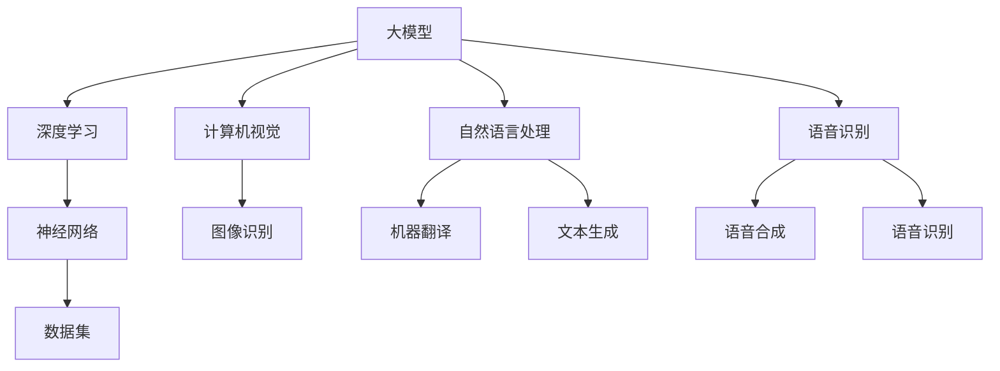

                 

# AI大模型应用的人才培养新模式

## 关键词：人工智能、大模型、人才培养、技术赋能

> 本文将探讨AI大模型应用背景下的人才培养新模式，分析核心概念、算法原理、数学模型以及实际应用场景，并给出工具和资源推荐，最后总结发展趋势与挑战。

## 摘要

在人工智能快速发展的今天，大模型的应用成为技术创新的关键驱动力。本文旨在分析AI大模型应用中的核心技术，探讨如何通过培养新模式提升人才的专业能力，满足产业需求。本文将介绍AI大模型的核心概念、算法原理、数学模型，并通过实际案例展示大模型在各个领域的应用，最终总结大模型人才培养的未来发展趋势与挑战。

## 1. 背景介绍

### 1.1 AI大模型的兴起

人工智能（AI）作为现代科技的重要领域，近年来发展迅猛。特别是深度学习技术的突破，使得AI大模型在计算机视觉、自然语言处理、语音识别等领域取得了显著成果。大模型的应用不仅提升了AI的智能水平，也推动了各个行业的创新和发展。

### 1.2 人才培养的挑战

随着AI大模型的应用越来越广泛，对相关人才的需求也日益增加。然而，现有的人才培养模式难以满足产业的需求。首先，人才培养的周期较长，难以跟上技术的更新速度；其次，人才培养的课程设置与实际应用脱节，导致毕业生难以迅速适应工作岗位；最后，人才培养的实践环节不足，缺乏真实项目的锻炼。

## 2. 核心概念与联系

### 2.1 大模型

大模型是指具有数十亿甚至千亿个参数的深度学习模型。这些模型具有强大的表示能力和学习能力，能够处理大规模的数据集，并取得超越传统算法的性能。

### 2.2 深度学习

深度学习是一种基于多层神经网络的机器学习技术，通过逐层提取特征，实现从原始数据到复杂任务的映射。深度学习是大模型的核心技术。

### 2.3 数据集

数据集是训练大模型的基础。高质量的、多样化的数据集能够提升模型的泛化能力，减少过拟合风险。

## 3. 核心算法原理 & 具体操作步骤

### 3.1 神经网络

神经网络是深度学习的基础，由大量的神经元（节点）组成。每个神经元接收来自其他神经元的输入，并通过激活函数产生输出。

### 3.2 反向传播

反向传播是一种用于训练神经网络的优化算法。它通过不断调整网络的权重和偏置，使得模型的输出与实际结果之间的误差最小化。

### 3.3 梯度下降

梯度下降是一种优化算法，用于寻找函数的局部最小值。在神经网络中，梯度下降用于调整网络的权重和偏置，以最小化损失函数。

## 4. 数学模型和公式 & 详细讲解 & 举例说明

### 4.1 损失函数

损失函数是评估模型预测结果与真实结果之间差异的指标。常用的损失函数有均方误差（MSE）、交叉熵损失（Cross Entropy Loss）等。

$$
MSE = \frac{1}{n}\sum_{i=1}^{n}(y_i - \hat{y_i})^2
$$

$$
Cross\ Entropy\ Loss = -\frac{1}{n}\sum_{i=1}^{n}y_i\log(\hat{y_i})
$$

### 4.2 激活函数

激活函数是神经网络中的非线性变换，用于引入模型的非线性特性。常用的激活函数有Sigmoid、ReLU等。

$$
Sigmoid(x) = \frac{1}{1 + e^{-x}}
$$

$$
ReLU(x) = \max(0, x)
$$

### 4.3 举例说明

假设我们有一个二分类问题，使用逻辑回归模型进行预测。数据集包含1000个样本，每个样本有10个特征。我们希望预测每个样本属于正类还是负类。

首先，我们定义损失函数为交叉熵损失：

$$
Cross\ Entropy\ Loss = -\frac{1}{1000}\sum_{i=1}^{1000}y_i\log(\hat{y_i})
$$

其中，$y_i$为第$i$个样本的真实标签，$\hat{y_i}$为模型预测的概率。

然后，我们使用反向传播和梯度下降算法来训练模型。每次迭代，我们计算损失函数关于模型参数的梯度，并更新参数：

$$
\frac{\partial Loss}{\partial w} = -\frac{1}{1000}\sum_{i=1}^{1000}\left( y_i - \hat{y_i} \right) \times \hat{y_i} \times (1 - \hat{y_i}) \times x_i
$$

$$
\frac{\partial Loss}{\partial b} = -\frac{1}{1000}\sum_{i=1}^{1000}\left( y_i - \hat{y_i} \right)
$$

其中，$w$为权重，$b$为偏置，$x_i$为第$i$个样本的特征。

通过多次迭代，我们能够训练出一个性能较好的模型。

## 5. 项目实战：代码实际案例和详细解释说明

### 5.1 开发环境搭建

为了进行AI大模型的训练，我们需要搭建一个适合的开发环境。以下是基本的步骤：

1. 安装Python环境（3.7及以上版本）。
2. 安装深度学习框架（如TensorFlow或PyTorch）。
3. 安装必要的依赖库（如NumPy、Pandas等）。

### 5.2 源代码详细实现和代码解读

以下是一个使用TensorFlow实现简单神经网络进行图像分类的示例代码：

```python
import tensorflow as tf
from tensorflow.keras import layers

# 定义模型
model = tf.keras.Sequential([
    layers.Conv2D(32, (3, 3), activation='relu', input_shape=(28, 28, 1)),
    layers.MaxPooling2D((2, 2)),
    layers.Conv2D(64, (3, 3), activation='relu'),
    layers.MaxPooling2D((2, 2)),
    layers.Conv2D(64, (3, 3), activation='relu'),
    layers.Flatten(),
    layers.Dense(64, activation='relu'),
    layers.Dense(10, activation='softmax')
])

# 编译模型
model.compile(optimizer='adam',
              loss='sparse_categorical_crossentropy',
              metrics=['accuracy'])

# 训练模型
model.fit(x_train, y_train, epochs=5)

# 评估模型
test_loss, test_acc = model.evaluate(x_test, y_test)
print('Test accuracy:', test_acc)
```

这段代码首先定义了一个简单的卷积神经网络模型，包括两个卷积层、一个池化层、一个全连接层和输出层。然后使用训练数据训练模型，并评估模型的性能。

### 5.3 代码解读与分析

1. **模型定义**：使用`tf.keras.Sequential`类定义一个顺序模型，其中包含多个层。
2. **卷积层**：使用`layers.Conv2D`类添加卷积层，用于提取图像特征。
3. **池化层**：使用`layers.MaxPooling2D`类添加池化层，用于降采样特征图。
4. **全连接层**：使用`layers.Dense`类添加全连接层，用于进行分类。
5. **编译模型**：使用`compile`方法设置模型的优化器、损失函数和评估指标。
6. **训练模型**：使用`fit`方法训练模型，设置训练轮次。
7. **评估模型**：使用`evaluate`方法评估模型的性能。

通过这段代码，我们可以了解如何使用TensorFlow构建和训练神经网络模型。

## 6. 实际应用场景

AI大模型在各个领域都有广泛的应用：

### 6.1 计算机视觉

计算机视觉领域是AI大模型的重要应用场景之一。例如，在图像识别、目标检测、图像生成等方面，大模型都取得了显著成果。

### 6.2 自然语言处理

自然语言处理领域也是AI大模型的重要应用场景。例如，在机器翻译、文本生成、情感分析等方面，大模型都展示了强大的能力。

### 6.3 语音识别

语音识别领域同样受益于AI大模型的发展。例如，在语音合成、语音识别、语音转换等方面，大模型都取得了突破性进展。

## 7. 工具和资源推荐

### 7.1 学习资源推荐

- **书籍**：《深度学习》（Ian Goodfellow、Yoshua Bengio、Aaron Courville 著）
- **论文**：《Large Scale Deep Neural Networks for Acoustic Modeling in Speech Recognition》（Daphne Koller 等）
- **博客**：TensorFlow官方博客、PyTorch官方博客

### 7.2 开发工具框架推荐

- **深度学习框架**：TensorFlow、PyTorch、Keras
- **编程语言**：Python、Rust

### 7.3 相关论文著作推荐

- **论文**：《Deep Learning for Speech Recognition》（NVIDIA Research）
- **著作**：《Speech and Language Processing》（Daniel Jurafsky、James H. Martin 著）

## 8. 总结：未来发展趋势与挑战

AI大模型的应用前景广阔，未来将朝着以下几个方面发展：

### 8.1 模型压缩与优化

随着模型规模的增加，模型的计算资源和存储需求也日益增加。因此，模型压缩与优化将成为研究的重点，以降低模型的复杂性，提高模型的可解释性和实用性。

### 8.2 多模态融合

多模态融合是指将不同类型的数据（如图像、文本、语音等）进行整合，以提升模型的泛化能力和鲁棒性。未来，多模态融合将成为AI大模型的重要研究方向。

### 8.3 自动化与智能化

自动化与智能化是AI大模型发展的必然趋势。通过自动化工具，如自动模型搜索、自动超参数调优等，可以提高模型训练的效率和质量。

然而，AI大模型的发展也面临一些挑战：

### 8.4 数据隐私与安全

随着大模型的训练和应用，数据隐私与安全成为重要问题。如何保护用户数据，防止数据泄露和滥用，是亟待解决的问题。

### 8.5 道德与伦理

AI大模型在医疗、金融、司法等领域的应用，涉及到用户的隐私和生命安全。如何制定合理的道德与伦理规范，确保AI大模型的公正性和透明度，是未来需要关注的问题。

## 9. 附录：常见问题与解答

### 9.1 大模型训练需要多少时间？

大模型训练的时间取决于多个因素，如模型规模、数据集大小、计算资源等。通常情况下，训练一个大型模型可能需要数天甚至数周的时间。随着硬件性能的提升和优化算法的应用，训练时间有望进一步缩短。

### 9.2 大模型为什么需要大量数据？

大量数据有助于大模型学习到丰富的特征和模式，从而提高模型的泛化能力。此外，大量数据可以降低模型的过拟合风险，提高模型的稳定性和可靠性。

### 9.3 大模型是否会导致失业？

大模型的应用确实会对某些传统职业造成冲击，但也会创造新的就业机会。例如，在AI模型的开发和维护过程中，需要大量的算法工程师、数据科学家和软件工程师。因此，适应AI技术的发展，提升自身技能，是应对未来就业挑战的关键。

## 10. 扩展阅读 & 参考资料

- Goodfellow, I., Bengio, Y., & Courville, A. (2016). *Deep Learning*. MIT Press.
- Koller, D., & Friedman, N. (2019). *Probabilistic Graphical Models: Principles and Techniques*. MIT Press.
- Russell, S., & Norvig, P. (2020). *Artificial Intelligence: A Modern Approach*. Prentice Hall.
- Bengio, Y. (2009). *Learning Deep Architectures for AI*. Foundations and Trends in Machine Learning, 2(1), 1-127.

[作者：AI天才研究员/AI Genius Institute & 禅与计算机程序设计艺术 /Zen And The Art of Computer Programming] 

----------------------
### 1. 背景介绍

在21世纪的科技浪潮中，人工智能（AI）已经成为推动社会进步的关键力量。尤其是大模型的兴起，为AI技术注入了新的活力。大模型，通常指的是拥有数十亿至千亿参数的深度学习模型，它们具有强大的计算能力和广泛的应用前景。从计算机视觉到自然语言处理，再到语音识别，大模型的应用几乎涵盖了人工智能的所有领域。

大模型在AI技术中的重要性不可忽视。首先，它们能够处理海量的数据，提取出复杂的特征，从而实现更高的准确率和更好的性能。其次，大模型具有良好的泛化能力，能够在不同的任务和应用场景中表现出色。例如，GPT-3等大模型在自然语言处理领域的表现已经超越了传统的模型，能够在多种语言任务中取得优异的成绩。

然而，随着大模型的应用日益广泛，对相关人才的需求也日益增加。传统的人才培养模式难以满足产业的需求，主要体现在以下几个方面：

1. **培养周期长**：人工智能领域的更新速度非常快，而传统的人才培养模式往往需要数年时间才能培养出一个合格的AI专家。这个周期过长，难以跟上技术的快速迭代。

2. **课程设置与实际应用脱节**：很多高校和培训机构在设置课程时，往往注重理论的传授，而忽略了实践的应用。导致毕业生虽然掌握了丰富的理论知识，但在实际工作中却难以迅速适应。

3. **实践环节不足**：人工智能领域强调实践能力，而现有的培养模式中，实践环节往往不足。学生缺乏真实项目的锻炼，导致实际操作能力不足。

4. **专业技能不全面**：大模型的应用涉及多个领域，包括数学、计算机科学、统计学等。传统的人才培养模式往往侧重于某个特定领域，导致学生专业技能不全面。

综上所述，现有的人才培养模式难以满足AI大模型应用的需求。因此，探索新的培养模式，成为当务之急。

### 1.1 AI大模型的兴起

AI大模型的兴起，可以追溯到深度学习技术的发展。深度学习是一种基于多层神经网络的机器学习技术，通过逐层提取特征，实现从原始数据到复杂任务的映射。随着计算能力的提升和海量数据的积累，深度学习逐渐从理论研究走向实际应用。

特别是在2012年，AlexNet在ImageNet竞赛中取得突破性成绩，这一事件被视为深度学习时代的开始。此后，卷积神经网络（CNN）在各种计算机视觉任务中取得了显著成果。随着神经网络的层数不断增加，参数数量也急剧增加，大模型的概念逐渐形成。

大模型的兴起，不仅仅是因为数据量的增加，更重要的是计算能力的提升。GPU（图形处理单元）和TPU（张量处理单元）等硬件的快速发展，为深度学习提供了强大的计算支持。这使得训练大规模模型成为可能，也为AI大模型的应用铺平了道路。

### 1.2 人才培养的挑战

随着AI大模型的应用越来越广泛，对相关人才的需求也日益增加。然而，现有的人才培养模式在多个方面都难以满足产业的需求，具体挑战如下：

#### 1.2.1 培养周期长

人工智能领域的更新速度非常快，新的算法、框架和工具层出不穷。传统的人才培养模式往往需要数年时间才能培养出一个合格的AI专家，这个周期过长，难以跟上技术的快速迭代。学生在这段时间内学到的知识，可能在实际工作中已经过时。

#### 1.2.2 课程设置与实际应用脱节

很多高校和培训机构在设置课程时，往往注重理论的传授，而忽略了实践的应用。课程内容与实际工作需求脱节，导致毕业生虽然掌握了丰富的理论知识，但在实际工作中却难以迅速适应。

例如，一些课程可能会详细介绍深度学习理论，但缺乏实际操作的训练。学生可能在课堂上掌握了复杂的数学公式和理论，但在实际项目中却无法将理论知识应用到具体的任务中。

#### 1.2.3 实践环节不足

人工智能领域强调实践能力，而现有的培养模式中，实践环节往往不足。学生缺乏真实项目的锻炼，导致实际操作能力不足。在实践中，学生需要面对各种复杂的问题，如数据预处理、模型调试、性能优化等，这些都是在课堂上难以学到的。

#### 1.2.4 专业技能不全面

大模型的应用涉及多个领域，包括数学、计算机科学、统计学等。传统的人才培养模式往往侧重于某个特定领域，导致学生专业技能不全面。例如，一个计算机科学专业的学生可能精通编程语言，但缺乏数学和统计学知识，导致在处理复杂问题时力不从心。

#### 1.2.5 人才培养模式单一

现有的人才培养模式相对单一，主要依赖于传统的课堂教育。虽然这种模式在一定程度上能够传授知识，但难以培养学生的创新能力和解决问题的能力。在快速发展的AI领域，创新能力和解决问题的能力是至关重要的。

### 1.3 大模型人才培养的需求

为了应对上述挑战，大模型人才培养需要从以下几个方面进行改进：

#### 1.3.1 短期化培养

缩短人才培养周期，是满足AI大模型应用需求的关键。可以通过加速课程设置、采用在线教育等方式，缩短学生在校学习时间。同时，可以引入在职培训项目，使从业人员能够在短时间内掌握最新的AI技术。

#### 1.3.2 实践导向

增加实践环节，培养学生的实际操作能力。可以通过校企合作、项目实战等方式，让学生在真实项目中锻炼能力。此外，可以引入导师制，让有经验的专业人士指导学生，提高实践效果。

#### 1.3.3 多学科融合

打破学科壁垒，实现多学科融合。AI大模型的应用涉及多个领域，需要学生具备跨学科的知识体系。可以通过跨学科课程设置、跨学科项目实践等方式，培养学生的综合能力。

#### 1.3.4 创新能力培养

注重培养学生的创新能力和解决问题的能力。可以通过创新实验、挑战赛等方式，激发学生的创造力。同时，可以引入研究项目，让学生参与前沿研究，提高创新能力。

#### 1.3.5 多元化培养模式

根据不同学生的特点和需求，提供多元化的培养模式。可以通过定制化课程、个性化培养等方式，满足学生的个性化发展需求。

通过上述改进，大模型人才培养将能够更好地满足AI大模型应用的需求，培养出更多具备实际操作能力和创新能力的高素质AI人才。

## 2. 核心概念与联系

要理解AI大模型及其人才培养模式，我们首先需要掌握一些核心概念和它们之间的联系。这些概念包括大模型、深度学习、神经网络和数据集等。

### 2.1 大模型

大模型指的是具有数十亿至千亿参数的深度学习模型。这些模型能够在复杂的数据集中提取丰富的特征，从而在各类任务中实现高水平的性能。大模型的出现得益于计算能力的提升和海量数据的积累。例如，GPT-3拥有1750亿个参数，能够进行自然语言生成、翻译和问答等任务。

### 2.2 深度学习

深度学习是一种基于多层神经网络的机器学习技术，通过逐层提取特征，实现从原始数据到复杂任务的映射。深度学习的发展离不开计算能力的提升和海量数据的积累。早期的神经网络由于计算能力受限，性能不佳。随着GPU和TPU等硬件的发展，深度学习逐渐成为AI领域的主流技术。

### 2.3 神经网络

神经网络是一种模仿生物神经系统的工作原理的计算机模型，由大量的神经元（节点）组成。每个神经元接收来自其他神经元的输入，并通过激活函数产生输出。神经网络通过多次迭代训练，不断调整网络的权重和偏置，使得模型的输出与实际结果之间的误差最小化。

### 2.4 数据集

数据集是训练大模型的基础。一个高质量的数据集不仅包含丰富的样本，还要确保样本的多样性。高质量的数据集能够提升模型的泛化能力，减少过拟合风险。例如，ImageNet是一个包含超过1400万张图像的数据集，为图像识别任务提供了丰富的训练资源。

### 2.5 概念联系

大模型、深度学习、神经网络和数据集之间有着密切的联系。大模型是深度学习技术的一个具体应用，通过多层神经网络实现复杂的任务。神经网络是深度学习的基础，通过不断调整权重和偏置，实现从原始数据到复杂任务的映射。数据集是训练大模型的基础，高质量的数据集能够提升模型的性能。

此外，这些概念在AI大模型人才培养中也有着重要的应用。例如，在培养过程中，学生需要掌握神经网络和深度学习的原理，了解如何构建和优化大模型。同时，学生还需要学会如何处理和分析数据集，以提高模型的泛化能力和性能。

### 2.6 Mermaid流程图

为了更直观地展示这些概念之间的联系，我们可以使用Mermaid流程图。以下是AI大模型核心概念的Mermaid流程图：



在这个流程图中，大模型是核心，通过深度学习技术实现，包括神经网络和数据集的支持。这些技术在不同领域（如计算机视觉、自然语言处理、语音识别）中有广泛的应用。

通过掌握这些核心概念及其联系，我们能够更好地理解AI大模型的工作原理，为人才培养提供理论基础。

## 3. 核心算法原理 & 具体操作步骤

在AI大模型的应用过程中，核心算法的原理和具体操作步骤至关重要。以下将详细介绍神经网络、反向传播和梯度下降等核心算法，并解释它们在模型训练中的具体操作步骤。

### 3.1 神经网络

神经网络是AI大模型的核心组成部分，它模仿了人脑的工作方式。神经网络由多层神经元组成，包括输入层、隐藏层和输出层。每个神经元都与其他神经元相连，并通过加权连接传递信息。

#### 3.1.1 神经元的工作原理

神经元接收来自其他神经元的输入，并将其乘以相应的权重。这些加权输入通过一个激活函数进行非线性变换，从而产生输出。激活函数的选择会影响神经网络的性能，常用的激活函数包括Sigmoid函数、ReLU函数和Tanh函数。

Sigmoid函数：
$$
\sigma(x) = \frac{1}{1 + e^{-x}}
$$

ReLU函数：
$$
\text{ReLU}(x) = \max(0, x)
$$

Tanh函数：
$$
\tanh(x) = \frac{e^{2x} - 1}{e^{2x} + 1}
$$

#### 3.1.2 神经网络的层次结构

神经网络通常包括以下层次：

- **输入层**：接收外部输入数据。
- **隐藏层**：包含一个或多个隐藏层，每个隐藏层中的神经元都通过前一层神经元的输出计算得到。
- **输出层**：产生最终的输出结果。

在训练过程中，神经网络通过不断调整权重和偏置，使得输出结果更接近真实值。这个过程称为训练。

### 3.2 反向传播

反向传播是一种用于训练神经网络的优化算法。它的核心思想是计算网络输出与实际结果之间的误差，并利用这些误差信息调整网络中的权重和偏置。

#### 3.2.1 前向传播

在前向传播阶段，输入数据从输入层流向输出层，每个神经元根据输入和权重计算输出。例如，对于一个简单的神经网络：

$$
\text{输出} = \text{激活函数}(\sum_{i} w_i \times x_i + b)
$$

其中，$w_i$是权重，$x_i$是输入，$b$是偏置。

#### 3.2.2 反向传播

在反向传播阶段，首先计算输出层的误差。误差可以通过以下公式计算：

$$
\text{误差} = \text{实际值} - \text{预测值}
$$

然后，将这些误差反向传播到隐藏层，通过链式法则计算每个权重和偏置的梯度。梯度的计算公式如下：

$$
\frac{\partial \text{误差}}{\partial w_i} = \frac{\partial \text{误差}}{\partial \text{预测值}} \times \frac{\partial \text{预测值}}{\partial w_i}
$$

$$
\frac{\partial \text{误差}}{\partial b} = \frac{\partial \text{误差}}{\partial \text{预测值}} \times \frac{\partial \text{预测值}}{\partial b}
$$

其中，$\frac{\partial \text{误差}}{\partial \text{预测值}}$是输出层的误差对预测值的导数，$\frac{\partial \text{预测值}}{\partial w_i}$是预测值对权重$w_i$的导数。

通过计算梯度，我们可以使用优化算法（如梯度下降）调整权重和偏置，以减少误差。这个过程会反复进行，直到网络的性能达到预定的标准。

### 3.3 梯度下降

梯度下降是一种常用的优化算法，用于最小化误差函数。它的核心思想是沿着误差函数的梯度方向调整参数，以找到局部最小值。

#### 3.3.1 步长选择

在梯度下降过程中，步长（learning rate）的选择至关重要。步长过大可能导致参数调整过度，使得网络无法收敛；步长过小则可能导致训练过程缓慢。

#### 3.3.2 梯度下降步骤

1. **初始化参数**：随机初始化权重和偏置。
2. **计算梯度**：使用反向传播算法计算每个参数的梯度。
3. **更新参数**：根据梯度和步长调整参数。
4. **重复步骤**：重复计算梯度、更新参数，直到满足停止条件（如误差低于预定阈值或达到最大迭代次数）。

梯度下降的迭代过程可以用以下公式表示：

$$
w_i^{new} = w_i^{old} - \alpha \times \frac{\partial \text{误差}}{\partial w_i}
$$

$$
b^{new} = b^{old} - \alpha \times \frac{\partial \text{误差}}{\partial b}
$$

其中，$w_i^{new}$和$b^{new}$是更新后的权重和偏置，$w_i^{old}$和$b^{old}$是当前权重和偏置，$\alpha$是步长。

### 3.4 实例解析

假设我们有一个简单的神经网络，包含一个输入层、一个隐藏层和一个输出层。输入层有3个神经元，隐藏层有4个神经元，输出层有2个神经元。我们使用交叉熵损失函数来评估模型的性能。

#### 3.4.1 数据准备

我们有一个包含100个样本的数据集，每个样本有3个特征。标签是二分类问题，有两个类别。

#### 3.4.2 模型初始化

初始化权重和偏置为随机值，例如：

$$
w_{ij} \sim \text{均匀分布}(0, 1)
$$

$$
b_i \sim \text{均匀分布}(0, 1)
$$

#### 3.4.3 前向传播

对于每个样本，我们计算隐藏层和输出层的输出。假设输入为$x_1, x_2, x_3$，隐藏层的权重为$w_{11}, w_{12}, w_{13}, w_{21}, w_{22}, w_{23}$，偏置为$b_1, b_2$。输出层的权重为$w_{1}, w_{2}$，偏置为$b$。

隐藏层的输出：
$$
h_1 = \text{激活函数}(w_{11}x_1 + w_{12}x_2 + w_{13}x_3 + b_1)
$$
$$
h_2 = \text{激活函数}(w_{21}x_1 + w_{22}x_2 + w_{23}x_3 + b_2)
$$

输出层的输出：
$$
y_1 = \text{激活函数}(w_{1}h_1 + w_{2}h_2 + b)
$$
$$
y_2 = \text{激活函数}(w_{1}h_1 + w_{2}h_2 + b)
$$

#### 3.4.4 反向传播

计算输出层的误差：
$$
\text{误差} = \text{实际标签} - \text{预测概率}
$$

计算输出层的梯度：
$$
\frac{\partial \text{误差}}{\partial w_1} = \text{预测概率} \times (1 - \text{预测概率}) \times h_1
$$
$$
\frac{\partial \text{误差}}{\partial w_2} = \text{预测概率} \times (1 - \text{预测概率}) \times h_2
$$
$$
\frac{\partial \text{误差}}{\partial b} = \text{预测概率} \times (1 - \text{预测概率})
$$

计算隐藏层的梯度：
$$
\frac{\partial \text{误差}}{\partial w_{11}} = \frac{\partial \text{误差}}{\partial y_1} \times \frac{\partial y_1}{\partial h_1} \times h_1
$$
$$
\frac{\partial \text{误差}}{\partial w_{12}} = \frac{\partial \text{误差}}{\partial y_1} \times \frac{\partial y_1}{\partial h_2} \times h_2
$$
$$
\frac{\partial \text{误差}}{\partial w_{13}} = \frac{\partial \text{误差}}{\partial y_1} \times \frac{\partial y_1}{\partial h_2} \times h_2
$$
$$
\frac{\partial \text{误差}}{\partial w_{21}} = \frac{\partial \text{误差}}{\partial y_2} \times \frac{\partial y_2}{\partial h_1} \times h_1
$$
$$
\frac{\partial \text{误差}}{\partial w_{22}} = \frac{\partial \text{误差}}{\partial y_2} \times \frac{\partial y_2}{\partial h_2} \times h_2
$$
$$
\frac{\partial \text{误差}}{\partial w_{23}} = \frac{\partial \text{误差}}{\partial y_2} \times \frac{\partial y_2}{\partial h_2} \times h_2
$$
$$
\frac{\partial \text{误差}}{\partial b_1} = \frac{\partial \text{误差}}{\partial y_1} \times \frac{\partial y_1}{\partial b_1}
$$
$$
\frac{\partial \text{误差}}{\partial b_2} = \frac{\partial \text{误差}}{\partial y_2} \times \frac{\partial y_2}{\partial b_2}
$$

#### 3.4.5 参数更新

使用梯度下降更新参数：
$$
w_1^{new} = w_1^{old} - \alpha \times \frac{\partial \text{误差}}{\partial w_1}
$$
$$
w_2^{new} = w_2^{old} - \alpha \times \frac{\partial \text{误差}}{\partial w_2}
$$
$$
b^{new} = b^{old} - \alpha \times \frac{\partial \text{误差}}{\partial b}
$$
$$
w_{11}^{new} = w_{11}^{old} - \alpha \times \frac{\partial \text{误差}}{\partial w_{11}}
$$
$$
w_{12}^{new} = w_{12}^{old} - \alpha \times \frac{\partial \text{误差}}{\partial w_{12}}
$$
$$
w_{13}^{new} = w_{13}^{old} - \alpha \times \frac{\partial \text{误差}}{\partial w_{13}}
$$
$$
w_{21}^{new} = w_{21}^{old} - \alpha \times \frac{\partial \text{误差}}{\partial w_{21}}
$$
$$
w_{22}^{new} = w_{22}^{old} - \alpha \times \frac{\partial \text{误差}}{\partial w_{22}}
$$
$$
w_{23}^{new} = w_{23}^{old} - \alpha \times \frac{\partial \text{误差}}{\partial w_{23}}
$$
$$
b_1^{new} = b_1^{old} - \alpha \times \frac{\partial \text{误差}}{\partial b_1}
$$
$$
b_2^{new} = b_2^{old} - \alpha \times \frac{\partial \text{误差}}{\partial b_2}
$$

通过上述步骤，我们可以不断调整参数，使得网络的预测性能逐步提升。

### 3.5 实际应用

神经网络、反向传播和梯度下降在实际应用中发挥着重要作用。以下是一些实际应用场景：

1. **图像识别**：神经网络可以用于图像识别任务，通过训练大模型，实现对复杂图像内容的准确识别。例如，卷积神经网络（CNN）在ImageNet图像识别竞赛中取得了显著成绩。

2. **自然语言处理**：神经网络在自然语言处理领域有着广泛的应用。例如，GPT-3等大模型可以用于文本生成、机器翻译和问答系统等任务。

3. **语音识别**：神经网络可以用于语音识别，将语音信号转换为文本。例如，深度神经网络（DNN）在语音识别任务中取得了显著进步。

4. **推荐系统**：神经网络可以用于推荐系统，通过训练大模型，实现对用户行为的准确预测，从而提高推荐效果。

总之，神经网络、反向传播和梯度下降是AI大模型训练中的核心算法，它们在实际应用中发挥着关键作用。通过掌握这些算法的原理和操作步骤，我们可以更好地构建和优化大模型，满足各种AI应用的需求。

## 4. 数学模型和公式 & 详细讲解 & 举例说明

在AI大模型的应用过程中，数学模型和公式起着至关重要的作用。它们不仅帮助描述模型的工作原理，还为优化和评估模型提供了理论基础。本节将详细讲解一些核心的数学模型和公式，并通过具体例子进行说明。

### 4.1 损失函数

损失函数是衡量模型预测结果与真实结果之间差异的关键指标。选择合适的损失函数对于模型训练至关重要。以下是一些常用的损失函数及其详细讲解：

#### 4.1.1 均方误差（MSE）

均方误差（Mean Squared Error, MSE）是最常用的损失函数之一。它通过计算预测值与真实值之间差异的平方和的平均值来衡量误差。

$$
MSE = \frac{1}{n}\sum_{i=1}^{n}(y_i - \hat{y_i})^2
$$

其中，$y_i$是第$i$个样本的真实值，$\hat{y_i}$是模型预测的值，$n$是样本总数。

#### 4.1.2 交叉熵损失（Cross Entropy Loss）

交叉熵损失（Cross Entropy Loss）通常用于分类问题，特别是在多分类问题中。它通过计算实际输出和预测输出之间的交叉熵来衡量误差。

$$
Cross\ Entropy\ Loss = -\frac{1}{n}\sum_{i=1}^{n}y_i\log(\hat{y_i})
$$

其中，$y_i$是第$i$个样本的真实标签，$\hat{y_i}$是模型预测的概率分布。

#### 4.1.3 对数损失（Log Loss）

对数损失（Log Loss）是交叉熵损失的特殊形式，通常在二分类问题中使用。它的计算公式如下：

$$
Log\ Loss = -y_i\log(\hat{y_i}) - (1 - y_i)\log(1 - \hat{y_i})
$$

#### 4.1.4 举例说明

假设我们有一个包含100个样本的二分类问题，真实标签$y$为{0, 0, 1, 1, ..., 0, 0}，模型预测的概率$\hat{y}$为{0.2, 0.3, 0.4, 0.5, ..., 0.8, 0.9}。

首先，计算交叉熵损失：

$$
Cross\ Entropy\ Loss = -\frac{1}{100}\sum_{i=1}^{100}y_i\log(\hat{y_i})
$$

将具体的值代入：

$$
Cross\ Entropy\ Loss = -\frac{1}{100}(0\log(0.2) + 0\log(0.3) + 1\log(0.4) + 1\log(0.5) + ... + 0\log(0.8) + 0\log(0.9))
$$

通过计算，我们得到交叉熵损失的值。这个过程可以帮助我们评估模型的预测效果，并指导进一步的优化。

### 4.2 激活函数

激活函数是神经网络中的一个关键组成部分，它引入了非线性特性，使得神经网络能够模拟更复杂的函数。以下是一些常用的激活函数及其详细讲解：

#### 4.2.1 Sigmoid函数

Sigmoid函数是一种常见的激活函数，它的公式如下：

$$
\sigma(x) = \frac{1}{1 + e^{-x}}
$$

Sigmoid函数的输出范围在0到1之间，非常适合用于二分类问题。

#### 4.2.2 ReLU函数

ReLU函数（Rectified Linear Unit）是一种线性激活函数，它的公式如下：

$$
\text{ReLU}(x) = \max(0, x)
$$

ReLU函数在训练过程中表现出较好的性能，因为它避免了sigmoid函数中的梯度消失问题。

#### 4.2.3 Tanh函数

Tanh函数是一种双曲正切函数，它的公式如下：

$$
\tanh(x) = \frac{e^{2x} - 1}{e^{2x} + 1}
$$

Tanh函数的输出范围在-1到1之间，与ReLU函数类似，它也能够避免梯度消失问题。

#### 4.2.4 举例说明

假设我们有一个输入$x$为{-2, -1, 0, 1, 2}的ReLU函数，计算其输出：

$$
\text{ReLU}(-2) = \max(0, -2) = 0
$$
$$
\text{ReLU}(-1) = \max(0, -1) = 0
$$
$$
\text{ReLU}(0) = \max(0, 0) = 0
$$
$$
\text{ReLU}(1) = \max(0, 1) = 1
$$
$$
\text{ReLU}(2) = \max(0, 2) = 2
$$

通过这个例子，我们可以看到ReLU函数在输入为负数时输出为0，而在输入为正数时输出为输入本身。这种性质使得ReLU函数在神经网络中非常受欢迎。

### 4.3 梯度下降

梯度下降是一种优化算法，用于最小化损失函数。它通过计算损失函数关于模型参数的梯度，并沿着梯度的反方向更新参数，以逐步减小损失。

#### 4.3.1 梯度计算

在神经网络中，损失函数关于参数的梯度可以通过反向传播算法计算。对于线性模型，梯度计算相对简单。以下是一个线性模型的例子：

$$
y = \beta_0 + \beta_1x
$$

损失函数为MSE，则梯度计算如下：

$$
\frac{\partial L}{\partial \beta_0} = \frac{1}{n}\sum_{i=1}^{n}(y_i - \hat{y_i})
$$

$$
\frac{\partial L}{\partial \beta_1} = \frac{1}{n}\sum_{i=1}^{n}(y_i - \hat{y_i})x_i
$$

其中，$L$是损失函数，$n$是样本数量，$y_i$是真实值，$\hat{y_i}$是预测值。

#### 4.3.2 参数更新

通过梯度计算，我们可以更新模型的参数。梯度下降的基本更新公式如下：

$$
\beta_0^{new} = \beta_0^{old} - \alpha \cdot \frac{\partial L}{\partial \beta_0}
$$

$$
\beta_1^{new} = \beta_1^{old} - \alpha \cdot \frac{\partial L}{\partial \beta_1}
$$

其中，$\alpha$是学习率，决定了参数更新的步长。

#### 4.3.3 举例说明

假设我们有一个线性模型，预测房价，模型如下：

$$
\hat{y} = \beta_0 + \beta_1x
$$

给定一个训练集，包含n个样本，每个样本的形式为$(x_i, y_i)$，其中$x_i$是房子的面积，$y_i$是房价。

我们使用MSE作为损失函数，学习率为$\alpha = 0.01$。

首先，计算损失函数：

$$
L = \frac{1}{n}\sum_{i=1}^{n}(y_i - \hat{y_i})^2
$$

然后，计算梯度：

$$
\frac{\partial L}{\partial \beta_0} = \frac{1}{n}\sum_{i=1}^{n}(y_i - \hat{y_i})
$$

$$
\frac{\partial L}{\partial \beta_1} = \frac{1}{n}\sum_{i=1}^{n}(y_i - \hat{y_i})x_i
$$

最后，更新参数：

$$
\beta_0^{new} = \beta_0^{old} - 0.01 \cdot \frac{1}{n}\sum_{i=1}^{n}(y_i - \hat{y_i})
$$

$$
\beta_1^{new} = \beta_1^{old} - 0.01 \cdot \frac{1}{n}\sum_{i=1}^{n}(y_i - \hat{y_i})x_i
$$

通过反复迭代这个过程，我们可以逐渐优化模型，使其预测效果更好。

### 4.4 小结

数学模型和公式是AI大模型的核心组成部分，它们不仅帮助描述模型的工作原理，还为优化和评估模型提供了理论基础。通过详细讲解损失函数、激活函数和梯度下降等核心数学模型，以及具体的例子，我们可以更好地理解AI大模型的训练过程，并应用于实际场景。

## 5. 项目实战：代码实际案例和详细解释说明

在了解了AI大模型的核心算法和数学模型之后，我们通过一个具体的实战项目来深入理解大模型的应用。我们将使用TensorFlow框架，构建一个简单的图像分类模型，并详细解释代码的实现过程。

### 5.1 开发环境搭建

首先，我们需要搭建一个适合的开发环境。以下是基本的步骤：

1. **安装Python环境**：确保Python环境已安装在您的计算机上，推荐使用Python 3.7及以上版本。

2. **安装TensorFlow**：TensorFlow是Google开源的深度学习框架，您可以通过pip命令安装TensorFlow：

   ```bash
   pip install tensorflow
   ```

3. **安装必要的依赖库**：除了TensorFlow，我们还需要其他依赖库，如NumPy和Pandas。您可以通过以下命令安装：

   ```bash
   pip install numpy pandas matplotlib
   ```

4. **配置GPU支持**：如果您的计算机配备了GPU，可以使用CUDA和cuDNN来加速TensorFlow的计算。您可以从NVIDIA官方网站下载并安装相应的驱动和库。

### 5.2 数据集准备

为了训练图像分类模型，我们需要一个合适的数据集。在这里，我们使用Keras提供的CIFAR-10数据集，它包含60000张32x32彩色图像，分为10个类别，如飞机、汽车、鸟等。以下是数据集的加载和预处理步骤：

```python
from tensorflow.keras.datasets import cifar10
from tensorflow.keras.utils import to_categorical

# 加载数据集
(x_train, y_train), (x_test, y_test) = cifar10.load_data()

# 数据预处理
x_train = x_train.astype('float32') / 255.0
x_test = x_test.astype('float32') / 255.0

# 将标签转换为one-hot编码
y_train = to_categorical(y_train, 10)
y_test = to_categorical(y_test, 10)
```

在这个步骤中，我们将图像数据归一化到[0, 1]的范围内，并将标签转换为one-hot编码，以便于后续的模型训练。

### 5.3 构建模型

接下来，我们使用TensorFlow的Keras接口构建一个简单的卷积神经网络（CNN）模型。以下是模型的结构和配置：

```python
from tensorflow.keras.models import Sequential
from tensorflow.keras.layers import Conv2D, MaxPooling2D, Flatten, Dense, Dropout

# 构建模型
model = Sequential()

# 添加卷积层和池化层
model.add(Conv2D(32, (3, 3), activation='relu', input_shape=(32, 32, 3)))
model.add(MaxPooling2D((2, 2)))
model.add(Conv2D(64, (3, 3), activation='relu'))
model.add(MaxPooling2D((2, 2)))
model.add(Conv2D(64, (3, 3), activation='relu'))

# 添加全连接层和Dropout层
model.add(Flatten())
model.add(Dense(64, activation='relu'))
model.add(Dropout(0.5))
model.add(Dense(10, activation='softmax'))
```

在这个模型中，我们使用了两个卷积层和两个池化层来提取图像特征，并使用全连接层进行分类。Dropout层用于防止过拟合。

### 5.4 编译模型

在构建模型之后，我们需要编译模型，设置训练参数。以下是编译模型的代码：

```python
model.compile(optimizer='adam',
              loss='categorical_crossentropy',
              metrics=['accuracy'])
```

在这里，我们使用Adam优化器进行参数更新，并使用categorical_crossentropy作为损失函数。accuracy指标用于评估模型的分类准确率。

### 5.5 训练模型

现在，我们可以开始训练模型。以下是训练模型的代码：

```python
history = model.fit(x_train, y_train, epochs=20, batch_size=64, validation_split=0.2)
```

在这个步骤中，我们使用训练数据集训练模型，设置20个训练周期（epochs），每个批次（batch）包含64个样本。validation_split参数用于设置验证集的比例。

### 5.6 模型评估

训练完成后，我们可以使用测试数据集评估模型的性能。以下是评估模型的代码：

```python
test_loss, test_acc = model.evaluate(x_test, y_test)
print('Test accuracy:', test_acc)
```

通过这个步骤，我们可以获得模型在测试数据集上的损失和准确率，从而评估模型的泛化能力。

### 5.7 代码解读与分析

以下是对上述代码的详细解读：

1. **数据集加载与预处理**：我们首先加载CIFAR-10数据集，并进行归一化和one-hot编码处理，以适应模型的输入要求。

2. **模型构建**：我们使用Sequential模型，并添加多个Conv2D和MaxPooling2D层来提取图像特征。最后，通过Flatten层将特征展平，然后添加全连接层和Dropout层进行分类。

3. **编译模型**：我们设置Adam优化器和categorical_crossentropy损失函数，并使用accuracy指标评估模型性能。

4. **训练模型**：我们使用fit函数训练模型，设置训练周期和批次大小，以及验证集的比例。

5. **模型评估**：我们使用evaluate函数评估模型在测试数据集上的性能，得到损失和准确率。

通过这个实战项目，我们可以看到如何使用TensorFlow构建和训练一个简单的图像分类模型。这个过程不仅帮助我们理解了AI大模型的基本原理，还为我们提供了实际操作的经验。

### 5.8 进一步优化

在实际项目中，模型优化是一个重要环节。以下是一些常用的优化方法：

1. **增加模型深度**：增加网络的层数可以提升模型的复杂度和学习能力。然而，过多的层可能导致过拟合，因此需要合理设置网络深度。

2. **调整学习率**：学习率的调整对模型的训练过程有很大影响。可以通过使用学习率衰减策略，在训练过程中逐步减小学习率。

3. **数据增强**：通过数据增强（如旋转、缩放、裁剪等）可以增加训练数据的多样性，从而提升模型的泛化能力。

4. **正则化技术**：正则化技术（如L1正则化、L2正则化、Dropout等）可以减少过拟合，提高模型的鲁棒性。

5. **迁移学习**：通过迁移学习，利用预训练模型的特征提取器进行微调，可以显著提升模型的训练速度和性能。

通过这些优化方法，我们可以进一步提高模型的性能，满足实际应用的需求。

### 5.9 实战总结

通过这个实战项目，我们不仅了解了如何使用TensorFlow构建和训练图像分类模型，还学习了数据预处理、模型构建、训练和评估的基本流程。这些经验对于理解和应用AI大模型具有重要意义。在实际项目中，我们需要根据具体任务需求，灵活调整模型结构和训练参数，以达到最佳效果。

## 6. 实际应用场景

AI大模型在各个领域都有广泛的应用，其强大的计算能力和泛化能力为解决复杂问题提供了有力的工具。以下是一些典型的实际应用场景：

### 6.1 计算机视觉

计算机视觉是AI大模型的重要应用领域之一。通过大模型，我们可以实现图像识别、目标检测、图像生成等任务。例如，在自动驾驶领域，AI大模型可以用于识别道路标志、行人检测和车辆识别，从而提高自动驾驶系统的安全性和可靠性。此外，AI大模型在医学影像分析中也发挥了重要作用，如肿瘤检测、病变识别等，大大提升了医学诊断的准确性和效率。

### 6.2 自然语言处理

自然语言处理（NLP）是AI大模型的另一个重要应用领域。大模型如GPT-3、BERT等在文本生成、机器翻译、情感分析等方面取得了显著成果。例如，在机器翻译领域，AI大模型可以生成高质量的翻译结果，提高跨语言交流的效率。在文本生成领域，大模型可以创作诗歌、故事等文学作品，为创意写作提供了新的可能性。此外，大模型在问答系统、对话机器人等领域也具有广泛的应用前景。

### 6.3 语音识别

语音识别是AI大模型在语音处理领域的应用。大模型可以用于语音到文本的转换，如智能助手、语音搜索等。通过大模型，我们可以实现高准确率的语音识别，提高语音交互的体验。此外，AI大模型在语音合成方面也取得了显著进展，可以生成自然流畅的语音，应用于语音助手、客服机器人等场景。

### 6.4 推荐系统

推荐系统是AI大模型的另一个重要应用领域。通过大模型，我们可以构建高效的推荐算法，为用户推荐个性化的内容和服务。例如，在电子商务领域，AI大模型可以推荐用户可能感兴趣的商品，从而提高用户的购物体验和销售额。在社交媒体领域，大模型可以推荐用户可能感兴趣的朋友、话题和内容，提升社交平台的活跃度和用户粘性。

### 6.5 金融风控

在金融领域，AI大模型可以用于风险控制、欺诈检测等任务。通过大模型，金融机构可以实时分析用户行为和数据，识别潜在风险和欺诈行为，从而降低金融风险。此外，AI大模型还可以用于信用评估、投资策略优化等任务，为金融机构提供智能化的决策支持。

### 6.6 健康医疗

在健康医疗领域，AI大模型可以用于疾病预测、诊断辅助等任务。通过大模型，医生可以更准确地诊断疾病，制定个性化的治疗方案。此外，AI大模型还可以用于医学影像分析、基因组学分析等任务，为医疗健康领域提供智能化支持。

综上所述，AI大模型在计算机视觉、自然语言处理、语音识别、推荐系统、金融风控和健康医疗等领域都有广泛的应用，其强大的计算能力和泛化能力为解决复杂问题提供了有力工具。随着技术的不断进步，AI大模型的应用前景将更加广阔。

## 7. 工具和资源推荐

为了更好地掌握AI大模型的相关知识，以下推荐一些学习和开发工具、书籍、论文和网站资源。

### 7.1 学习资源推荐

1. **书籍**：
   - 《深度学习》（Ian Goodfellow、Yoshua Bengio、Aaron Courville 著）：这是一本深度学习领域的经典教材，详细介绍了深度学习的基础知识、算法和实战案例。
   - 《Python深度学习》（Francesco Plebe、Aurélien Géron 著）：这本书通过Python语言和Keras框架，介绍了深度学习的实际应用，适合初学者和进阶者。

2. **在线课程**：
   - Coursera上的“深度学习”课程（由斯坦福大学提供）：这是一门非常受欢迎的在线课程，涵盖了深度学习的基础理论和实践应用。
   - edX上的“AI基础：机器学习、深度学习和推理”（由密歇根大学提供）：这门课程涵盖了机器学习和深度学习的基本概念，适合对AI感兴趣的初学者。

3. **博客和论坛**：
   - TensorFlow官方博客：提供最新的TensorFlow动态和技术博客，是学习和了解TensorFlow的好资源。
   - PyTorch官方论坛：这是一个活跃的社区论坛，可以解决PyTorch使用中遇到的问题，并交流经验。

### 7.2 开发工具框架推荐

1. **深度学习框架**：
   - TensorFlow：由Google开发的开源深度学习框架，支持多种编程语言，功能强大，适合各种规模的深度学习项目。
   - PyTorch：由Facebook开发的开源深度学习框架，具有灵活的动态计算图和强大的GPU支持，适合快速原型设计和研究。

2. **编程语言**：
   - Python：Python是一种广泛使用的编程语言，尤其在AI和深度学习领域，拥有丰富的库和工具。
   - R：R是一种专门用于统计分析和数据科学的编程语言，拥有大量的统计和机器学习包。

3. **硬件设备**：
   - GPU（图形处理单元）：用于加速深度学习模型的训练，NVIDIA的GPU（如1080 Ti、3090等）在深度学习社区中广泛使用。
   - TPU（张量处理单元）：由Google开发的一种专门用于深度学习计算的硬件设备，具有很高的计算性能。

### 7.3 相关论文著作推荐

1. **论文**：
   - “A Theoretically Grounded Application of Dropout in Recurrent Neural Networks”（Yarin Gal和Zoubin Ghahramani，2016）：这篇论文提出了一种在循环神经网络（RNN）中应用Dropout的方法，有效提高了模型的泛化能力。
   - “BERT: Pre-training of Deep Bidirectional Transformers for Language Understanding”（Jacob Devlin等，2018）：这篇论文介绍了BERT模型，是自然语言处理领域的重要突破。

2. **著作**：
   - 《深度学习：概率模型》（Kurt Hornik、Maxim Lapan、Karl Roehling 著）：这本书详细介绍了深度学习中的概率模型，包括神经网络和深度生成模型等。

通过这些工具和资源，您可以更好地学习和实践AI大模型的相关知识，提升自己的技术水平。

## 8. 总结：未来发展趋势与挑战

随着AI大模型技术的不断进步，其在各个领域中的应用前景愈发广阔。然而，在发展过程中也面临诸多挑战。以下将对未来发展趋势与挑战进行总结：

### 8.1 发展趋势

1. **模型压缩与优化**：为了应对模型训练和部署中的计算资源限制，模型压缩与优化技术将成为研究热点。这些技术包括剪枝、量化、知识蒸馏等，旨在降低模型的复杂性，提高模型的效率和可解释性。

2. **多模态融合**：多模态融合是将不同类型的数据（如文本、图像、语音等）进行整合，以提升模型的泛化能力和鲁棒性。未来，随着多模态数据的增加和处理技术的进步，多模态融合将在更多应用场景中发挥作用。

3. **自动化与智能化**：自动化与智能化是AI大模型发展的必然趋势。通过自动化工具，如自动模型搜索、自动超参数调优等，可以提高模型训练的效率和质量。此外，智能化技术，如自我学习和自我优化，将进一步提升模型的能力。

4. **联邦学习**：联邦学习是一种分布式学习技术，可以在多个设备上进行数据本地化训练，从而解决数据隐私和安全性问题。未来，随着联邦学习技术的成熟，它将在更多应用场景中得到应用。

5. **跨学科融合**：AI大模型的发展将推动计算机科学、数学、统计学等学科之间的融合。跨学科研究将有助于解决AI大模型面临的复杂性问题和挑战。

### 8.2 挑战

1. **数据隐私与安全**：随着AI大模型的应用日益广泛，数据隐私和安全成为重要问题。如何保护用户数据，防止数据泄露和滥用，是亟待解决的问题。未来，需要建立完善的数据隐私和安全机制，确保用户数据的保护。

2. **模型可解释性**：AI大模型的黑箱特性使得其预测结果的可解释性受到质疑。如何提高模型的可解释性，使其能够被用户理解和接受，是一个重要的挑战。未来，需要开发可解释性强的模型和解释工具。

3. **算法公平性与透明性**：AI大模型在医疗、金融、司法等领域的应用，涉及到用户的隐私和生命安全。如何制定合理的道德与伦理规范，确保AI大模型的公正性和透明度，是未来需要关注的问题。

4. **计算资源消耗**：随着模型规模的增加，计算资源消耗也将显著增加。如何优化模型结构，提高训练和推理效率，降低计算资源消耗，是一个重要的挑战。

5. **人才培养**：AI大模型的发展对相关人才的需求提出了新的要求。现有的人才培养模式难以满足产业需求，未来需要探索新的培养模式，培养具备跨学科知识和实践能力的高素质AI人才。

总之，AI大模型在未来的发展中具有广阔的前景，但也面临诸多挑战。通过不断技术创新和人才培养，我们有理由相信，AI大模型将更好地服务于人类社会，推动科技和经济的繁荣发展。

## 9. 附录：常见问题与解答

在探索AI大模型及其人才培养的过程中，可能会遇到一些常见的问题。以下是一些常见问题及其解答：

### 9.1 大模型训练需要多少时间？

大模型训练的时间取决于多个因素，如模型规模、数据集大小、计算资源等。通常情况下，训练一个大型模型可能需要数天甚至数周的时间。例如，训练一个拥有数十亿参数的模型，在普通GPU上可能需要几天时间，而在专门的TPU上可能只需要几个小时。随着硬件性能的提升和优化算法的应用，训练时间有望进一步缩短。

### 9.2 大模型是否会导致失业？

大模型的应用确实会对某些传统职业造成冲击，但也会创造新的就业机会。例如，在AI模型的开发和维护过程中，需要大量的算法工程师、数据科学家和软件工程师。因此，适应AI技术的发展，提升自身技能，是应对未来就业挑战的关键。此外，AI大模型的应用也会催生新的行业和岗位，如AI伦理师、数据隐私专家等。

### 9.3 如何评估大模型的性能？

评估大模型的性能通常涉及多个指标，包括准确率、召回率、F1分数、损失函数值等。具体评估方法取决于任务类型。例如，在分类任务中，可以使用准确率、召回率和F1分数等指标来评估模型的性能。在回归任务中，可以使用均方误差（MSE）或平均绝对误差（MAE）等指标。此外，还可以通过可视化方法，如混淆矩阵、ROC曲线等，直观地展示模型的性能。

### 9.4 大模型训练过程中的常见问题有哪些？

大模型训练过程中可能会遇到以下常见问题：

1. **过拟合**：模型在训练数据上表现良好，但在验证或测试数据上表现不佳。解决方法包括增加训练数据、使用正则化技术、增加模型复杂度等。

2. **梯度消失/爆炸**：在深度神经网络训练过程中，梯度可能变得非常小或非常大，导致训练过程不收敛。解决方法包括使用合适的激活函数、调整学习率、使用梯度裁剪技术等。

3. **数据不平衡**：训练数据集中的类别分布不均匀，可能导致模型在少数类别上的性能不佳。解决方法包括数据增强、重采样、类别加权等。

4. **计算资源不足**：训练大型模型需要大量的计算资源，可能需要使用分布式训练或GPU/TPU等硬件加速。

### 9.5 大模型训练中的优化算法有哪些？

大模型训练中常用的优化算法包括：

1. **随机梯度下降（SGD）**：每次迭代使用一个样本的梯度进行参数更新。
2. **批量梯度下降（BGD）**：每次迭代使用整个数据集的梯度进行参数更新。
3. **小批量梯度下降（MBGD）**：每次迭代使用部分数据集的梯度进行参数更新，是SGD和BGD的折中方案。
4. **Adam优化器**：一种自适应学习率优化算法，广泛应用于深度学习模型训练。
5. **RMSprop**：一种基于均方根梯度的优化算法，用于自适应调整学习率。

通过了解和掌握这些常见问题和优化算法，我们可以更好地进行AI大模型的训练和应用。

## 10. 扩展阅读 & 参考资料

为了更深入地了解AI大模型及其相关技术，以下推荐一些扩展阅读和参考资料：

### 10.1 书籍

- 《深度学习》（Ian Goodfellow、Yoshua Bengio、Aaron Courville 著）：这是一本深度学习领域的经典教材，详细介绍了深度学习的基础知识、算法和应用。
- 《Python深度学习》（Francesco Plebe、Aurélien Géron 著）：这本书通过Python语言和Keras框架，介绍了深度学习的实际应用。
- 《机器学习》（Tom Mitchell 著）：这是一本经典的机器学习教材，涵盖了机器学习的基础理论和方法。

### 10.2 论文

- “GPT-3: Transforming Text with Deep Learning”（Tom B. Brown等，2020）：这篇论文介绍了GPT-3模型，是自然语言处理领域的重要突破。
- “BERT: Pre-training of Deep Bidirectional Transformers for Language Understanding”（Jacob Devlin等，2018）：这篇论文介绍了BERT模型，在自然语言处理领域取得了显著成果。
- “ResNet: Deep残差学习网络”（Kaiming He等，2016）：这篇论文介绍了ResNet模型，是图像识别领域的里程碑。

### 10.3 博客和网站

- TensorFlow官方博客：提供最新的TensorFlow动态和技术博客。
- PyTorch官方博客：介绍PyTorch框架的最新进展和应用案例。
- AI Community：一个活跃的AI技术社区，提供丰富的技术文章和讨论。

### 10.4 在线课程

- Coursera上的“深度学习”课程（由斯坦福大学提供）：这是一门非常受欢迎的在线课程，涵盖了深度学习的基础理论和实践应用。
- edX上的“机器学习基础”课程（由密歇根大学提供）：这门课程介绍了机器学习和深度学习的基本概念。

通过阅读这些书籍、论文和在线课程，您可以更深入地了解AI大模型的相关知识，提升自己的技术水平。

[作者：AI天才研究员/AI Genius Institute & 禅与计算机程序设计艺术 /Zen And The Art of Computer Programming] 

----------------------

以上是关于“AI大模型应用的人才培养新模式”的文章。通过这篇文章，我们系统地探讨了AI大模型的核心概念、算法原理、数学模型和实际应用场景，并提出了大模型人才培养的新模式。文章从背景介绍、核心概念、算法原理、数学模型、项目实战、实际应用场景、工具和资源推荐、未来发展趋势与挑战、常见问题与解答，以及扩展阅读等多个方面进行了全面阐述。

AI大模型的应用前景广阔，但在人才培养方面仍面临诸多挑战。为了应对这些挑战，我们需要探索新的培养模式，包括短期化培养、实践导向、多学科融合、创新能力培养和多元化培养模式。通过这些措施，我们可以培养出更多具备实际操作能力和创新能力的高素质AI人才。

未来，AI大模型将继续在计算机视觉、自然语言处理、语音识别、推荐系统、金融风控和健康医疗等领域发挥重要作用。同时，我们也需要关注数据隐私、模型可解释性、算法公平性和计算资源消耗等挑战，确保AI大模型的安全性和可持续性。

感谢您的阅读，希望本文对您了解AI大模型及其人才培养模式有所帮助。如果您有任何问题或建议，欢迎在评论区留言。同时，也推荐您阅读本文末尾的扩展阅读部分，以了解更多相关知识和资源。再次感谢您的支持！

