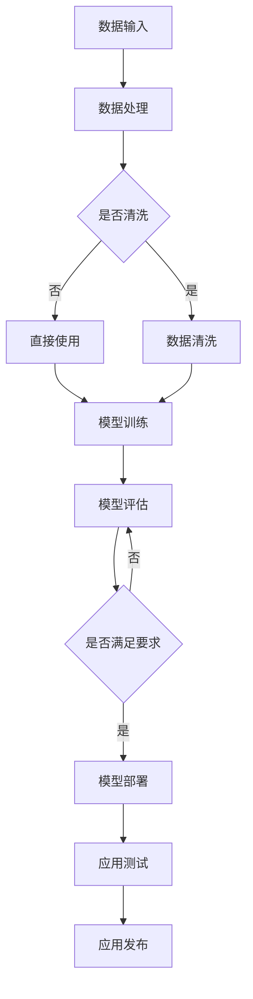

                 

### 背景介绍

#### AI大模型应用的崛起

随着人工智能技术的飞速发展，大模型（Large Models）的应用已经成为各行业关注的焦点。大模型，通常指的是具有数十亿、甚至千亿级别参数的深度学习模型。这些模型在图像识别、自然语言处理、推荐系统等领域展现出了强大的能力，推动着各行各业的技术进步和创新。

近年来，像GPT-3、BERT、ViT等大模型的成功，使得AI大模型的应用呈现出爆炸式增长。从企业和组织到个人开发者，越来越多的人开始意识到大模型在提高工作效率、创造新价值方面的潜力。因此，如何构建一个高效、易用的低代码平台来支持AI大模型的应用，成为了当下技术领域的一个重要课题。

#### 低代码平台的概念

低代码平台（Low-Code Platforms）是一种新兴的软件开发方法，它通过可视化界面、拖拽式操作和预构建的组件，降低了应用程序开发的复杂性，使得非技术人员也能快速构建应用。低代码平台的出现，主要是为了解决传统软件开发过程中面临的一些痛点：

1. **开发门槛高**：传统的软件开发需要深厚的编程知识，使得许多有业务需求但没有编程背景的人员无法参与。
2. **开发效率低**：传统的软件开发流程复杂，涉及需求分析、设计、编码、测试等多个阶段，导致开发周期长。
3. **维护成本高**：传统的软件维护工作量大，需要专业的开发人员进行维护。

低代码平台通过提供可视化操作和预构建组件，极大地简化了软件开发过程，降低了开发门槛，提高了开发效率，降低了维护成本。对于AI大模型的应用来说，低代码平台无疑是一个强大的工具，它可以让更多人参与到AI应用的开发中来，推动AI技术的普及。

#### 低代码平台在AI大模型应用中的重要性

在AI大模型的应用过程中，低代码平台具有以下几个重要优势：

1. **加速开发**：低代码平台提供了丰富的预构建组件和模板，开发者可以快速搭建AI应用的基本框架，节省了大量的编码时间。
2. **降低成本**：通过简化开发流程，低代码平台可以帮助企业和组织减少对专业开发人员的依赖，降低开发成本。
3. **提高可扩展性**：低代码平台通常具有良好的扩展性，开发者可以根据实际需求灵活地调整和优化应用。
4. **促进创新**：低代码平台降低了开发门槛，使得更多非技术人员能够参与到AI应用的开发中，促进了创新。

综上所述，低代码平台在AI大模型应用中的重要性不言而喻。它不仅能够加速AI应用的开发，降低成本，还能促进技术的普及和创新，为各行业的数字化转型提供了强有力的支持。

### 核心概念与联系

为了深入探讨AI大模型应用的低代码平台搭建，我们需要明确几个核心概念，并了解它们之间的相互关系。

#### 1. AI大模型

首先，我们需要了解AI大模型的定义和特点。AI大模型，指的是具有数十亿甚至千亿级别参数的深度学习模型。这些模型通常通过大量数据进行训练，从而在图像识别、自然语言处理、语音识别等领域表现出强大的能力。常见的AI大模型包括GPT-3、BERT、ViT等。

#### 2. 低代码平台

低代码平台是一种软件开发方法，它通过可视化界面、拖拽式操作和预构建的组件，降低了应用程序开发的复杂性。低代码平台的核心在于提供易于使用的工具和资源，使得非技术人员也能快速构建应用。

#### 3. 数据流与计算资源

在AI大模型的应用过程中，数据流和计算资源是两个至关重要的因素。数据流指的是从数据输入到模型训练和预测的整个过程，而计算资源则包括用于训练和部署模型的硬件和软件资源。

#### 4. 微服务架构

微服务架构是一种软件开发方法，它将应用程序拆分为多个独立的服务，每个服务负责特定的功能。微服务架构的优势在于提高了系统的可扩展性和灵活性。

#### Mermaid流程图

下面是AI大模型应用的低代码平台搭建的Mermaid流程图，它展示了各个核心概念之间的联系。



在这个流程图中：

- A：数据输入，表示将数据导入系统。
- B：数据处理，表示对数据进行预处理。
- C：是否清洗，表示判断数据是否需要清洗。
- D：数据清洗，表示对数据进行清洗处理。
- E：直接使用，表示直接使用未清洗的数据。
- F：模型训练，表示使用清洗后的数据训练模型。
- G：模型评估，表示评估模型的性能。
- H：是否满足要求，表示判断模型是否满足应用要求。
- I：模型部署，表示将模型部署到应用环境中。
- J：应用测试，表示测试应用的性能。
- K：应用发布，表示发布应用。

通过这个流程图，我们可以清晰地看到AI大模型应用的低代码平台搭建的全过程，以及各个核心概念之间的相互作用。

### 核心算法原理 & 具体操作步骤

为了深入理解AI大模型应用的低代码平台搭建，我们需要探讨其中的核心算法原理和具体操作步骤。以下是几个关键步骤：

#### 1. 模型选择

首先，我们需要根据应用场景选择合适的AI大模型。常见的模型有GPT-3、BERT、ViT等。每种模型都有其独特的优势和适用范围。例如，GPT-3在自然语言处理领域表现出色，而BERT在文本分类和问答系统中应用广泛。在模型选择过程中，我们需要考虑以下几个因素：

- **数据集**：模型需要适应训练数据集的特点。
- **任务类型**：不同类型的任务（如图像识别、自然语言处理）需要不同类型的模型。
- **计算资源**：模型的复杂度和计算资源需求直接影响开发效率和成本。

#### 2. 数据预处理

数据预处理是AI大模型训练过程中至关重要的一步。预处理的质量直接影响模型的性能。以下是几个关键步骤：

- **数据清洗**：去除噪声和异常值，确保数据的一致性和准确性。
- **数据归一化**：将数据缩放到相同的范围，以减少数据差异对模型的影响。
- **数据增强**：通过旋转、翻转、裁剪等操作增加数据多样性，提高模型泛化能力。

#### 3. 模型训练

模型训练是AI大模型应用的低代码平台搭建的核心步骤。以下是具体的操作步骤：

- **初始化模型**：选择合适的模型架构，并初始化模型参数。
- **设置训练参数**：包括学习率、批次大小、训练轮数等。
- **数据加载**：将预处理后的数据加载到模型中，进行训练。
- **优化器选择**：选择合适的优化器，如Adam、SGD等，以优化模型参数。
- **训练与验证**：在训练数据上训练模型，并在验证数据上评估模型性能。

#### 4. 模型评估

模型评估是确保模型性能的重要步骤。以下是几个关键指标：

- **准确率**：模型预测正确的样本数量与总样本数量的比值。
- **召回率**：模型预测正确的正样本数量与实际正样本数量的比值。
- **F1分数**：准确率和召回率的调和平均值。
- **ROC曲线**：评估模型分类性能的曲线。

#### 5. 模型部署

模型部署是将训练好的模型应用到实际应用场景的过程。以下是几个关键步骤：

- **模型转换**：将训练好的模型转换为适合部署的格式，如ONNX、TensorFlow Lite等。
- **模型推理**：在部署环境中进行模型推理，生成预测结果。
- **性能优化**：针对实际应用场景进行性能优化，如模型压缩、量化等。

#### 6. 应用测试与发布

最后，我们需要对部署的应用进行测试和发布：

- **应用测试**：测试应用的性能、稳定性和可靠性。
- **用户反馈**：收集用户反馈，优化应用功能。
- **应用发布**：将应用部署到生产环境，供用户使用。

通过以上步骤，我们可以构建一个高效、可靠的AI大模型应用的低代码平台，为各行业的数字化转型提供支持。

### 数学模型和公式 & 详细讲解 & 举例说明

在AI大模型的应用过程中，数学模型和公式是理解和实现核心算法的关键。以下是几个重要的数学模型和公式的详细讲解及举例说明。

#### 1. 激活函数（Activation Function）

激活函数是神经网络中的一个重要组件，它决定了神经元的输出。常见的激活函数包括：

- **Sigmoid函数**：$$\sigma(x) = \frac{1}{1 + e^{-x}}$$
  - **讲解**：Sigmoid函数将输入x映射到（0，1）区间，常用于二分类问题。
  - **举例**：输入x=2，计算Sigmoid函数值：
    $$\sigma(2) = \frac{1}{1 + e^{-2}} \approx 0.869$$

- **ReLU函数**：$$\text{ReLU}(x) = \max(0, x)$$
  - **讲解**：ReLU函数在x小于0时输出0，大于0时输出x，常用于深度神经网络。
  - **举例**：输入x=-2，计算ReLU函数值：
    $$\text{ReLU}(-2) = \max(0, -2) = 0$$

- **Tanh函数**：$$\text{Tanh}(x) = \frac{e^x - e^{-x}}{e^x + e^{-x}}$$
  - **讲解**：Tanh函数将输入x映射到（-1，1）区间，常用于回归问题。
  - **举例**：输入x=2，计算Tanh函数值：
    $$\text{Tanh}(2) = \frac{e^2 - e^{-2}}{e^2 + e^{-2}} \approx 0.96$$

#### 2. 反向传播算法（Backpropagation）

反向传播算法是神经网络训练的核心算法，用于更新模型参数。以下是反向传播算法的步骤：

- **前向传播**：计算神经网络各层的输出。
- **计算误差**：计算模型预测值与真实值之间的误差。
- **后向传播**：从输出层开始，逐层反向计算误差，并更新各层的参数。
- **优化器更新**：使用优化器（如Adam、SGD）更新模型参数。

以下是反向传播算法的数学公式：

- **误差计算**：
  $$\delta_{\text{output}} = \text{激活函数的导数} \cdot (\text{实际输出} - \text{预测输出})$$

- **参数更新**：
  $$\theta_{\text{更新}} = \theta - \alpha \cdot \frac{\partial J}{\partial \theta}$$
  其中，$J$是损失函数，$\alpha$是学习率。

#### 3. 损失函数（Loss Function）

损失函数用于衡量模型预测值与真实值之间的差异。常见的损失函数包括：

- **均方误差（MSE）**：
  $$J = \frac{1}{n}\sum_{i=1}^{n} (\hat{y}_i - y_i)^2$$
  - **讲解**：MSE用于回归问题，衡量预测值与真实值之间的均方误差。
  - **举例**：假设有一个样本，真实值为y=3，预测值为$\hat{y}=2.5$，计算MSE：
    $$J = \frac{1}{1} (2.5 - 3)^2 = 0.25$$

- **交叉熵损失（Cross-Entropy Loss）**：
  $$J = -\sum_{i=1}^{n} y_i \log(\hat{y}_i)$$
  - **讲解**：交叉熵损失用于分类问题，衡量预测概率与真实概率之间的差异。
  - **举例**：假设有一个二分类问题，真实值为y=1，预测概率为$\hat{y}=0.8$，计算交叉熵损失：
    $$J = -1 \cdot \log(0.8) \approx -0.223$$

通过以上数学模型和公式的讲解，我们可以更好地理解AI大模型的核心算法原理，为后续的项目实战提供理论基础。

### 项目实战：代码实际案例和详细解释说明

在本节中，我们将通过一个具体的代码案例，详细讲解如何使用低代码平台搭建一个AI大模型应用。这个案例将涵盖从开发环境搭建、源代码实现到代码解读与分析的整个过程。

#### 1. 开发环境搭建

首先，我们需要搭建一个适合AI大模型应用的开发环境。以下是一个基于Python的典型开发环境搭建步骤：

- **安装Python**：确保系统安装了Python 3.7及以上版本。
- **安装TensorFlow**：TensorFlow是一个广泛使用的深度学习框架，可以通过pip命令安装：
  ```bash
  pip install tensorflow
  ```

- **安装Keras**：Keras是TensorFlow的高级API，提供了更易于使用的接口：
  ```bash
  pip install keras
  ```

- **安装其他依赖**：根据项目需求，可能还需要安装其他依赖库，如NumPy、Pandas等。

#### 2. 源代码详细实现和代码解读

下面是一个简单的示例代码，用于搭建一个基于TensorFlow和Keras的AI大模型应用：

```python
import tensorflow as tf
from tensorflow.keras.models import Sequential
from tensorflow.keras.layers import Dense, Dropout, Activation

# 数据预处理
# （此处省略数据预处理代码，如数据加载、清洗和归一化）

# 构建模型
model = Sequential()
model.add(Dense(128, input_dim=X_train.shape[1], activation='relu'))
model.add(Dropout(0.5))
model.add(Dense(1, activation='sigmoid'))

# 编译模型
model.compile(optimizer='rmsprop', loss='binary_crossentropy', metrics=['accuracy'])

# 训练模型
model.fit(X_train, y_train, epochs=10, batch_size=32, validation_data=(X_val, y_val))

# 评估模型
loss, accuracy = model.evaluate(X_test, y_test)
print('Test accuracy:', accuracy)
```

**代码解读**：

- **导入库**：首先，我们导入了TensorFlow和Keras库，这些库提供了构建和训练神经网络所需的所有功能。
  
- **数据预处理**：数据预处理是AI模型训练的重要环节，包括数据加载、清洗和归一化。这部分代码（此处省略）根据实际数据集进行调整。

- **构建模型**：我们使用Sequential模型，这是一种线性堆叠的模型。模型中添加了Dense层（全连接层），Dropout层（用于防止过拟合）和输出层。输出层使用了Sigmoid激活函数，用于二分类任务。

- **编译模型**：在编译模型时，我们指定了优化器（RMSprop）、损失函数（binary_crossentropy，用于二分类）和评估指标（accuracy，准确率）。

- **训练模型**：使用fit方法训练模型，指定了训练轮数（epochs）、批量大小（batch_size）和验证数据。

- **评估模型**：使用evaluate方法评估模型在测试集上的性能，并打印出准确率。

#### 3. 代码解读与分析

现在，让我们详细解读和分析这段代码：

- **模型构建**：模型构建是整个AI应用的核心。在这个示例中，我们使用了一个简单的全连接神经网络。Dense层是神经网络的基本构建模块，它将输入数据映射到输出数据。`input_dim`参数指定了输入数据的维度，`activation='relu'`表示使用ReLU激活函数。

- **Dropout层**：Dropout是一种正则化技术，用于防止过拟合。它通过随机丢弃一部分神经元，来提高模型的泛化能力。

- **输出层**：输出层使用了Sigmoid激活函数，这是二分类任务常用的激活函数。Sigmoid函数将输出映射到（0，1）区间，表示分类的概率。

- **模型编译**：在模型编译阶段，我们指定了优化器（RMSprop）和损失函数（binary_crossentropy）。RMSprop是一种流行的优化算法，它可以加快收敛速度。binary_crossentropy是二分类任务的常用损失函数，它衡量预测概率与真实概率之间的差异。

- **模型训练**：模型训练是使用fit方法进行的。在这个示例中，我们设置了训练轮数（epochs）为10，批量大小（batch_size）为32。`validation_data`参数用于在训练过程中评估模型的性能。

- **模型评估**：在模型评估阶段，我们使用evaluate方法计算了模型在测试集上的准确率。准确率是衡量模型性能的重要指标，它表示模型正确预测样本的比例。

通过这个案例，我们可以看到如何使用低代码平台快速搭建一个AI大模型应用。这个过程涉及模型选择、数据预处理、模型构建、模型训练和模型评估等多个环节，每个环节都有其独特的挑战和解决方案。通过逐步分析和解读代码，我们可以更好地理解AI大模型应用的实现细节和关键技术。

### 实际应用场景

AI大模型应用的低代码平台在多个实际应用场景中展现出了巨大的潜力。以下是几个典型的应用场景：

#### 1. 医疗诊断

在医疗领域，AI大模型可以用于疾病诊断、药物发现和治疗建议。低代码平台使得医疗专业人员能够快速搭建AI模型，对患者的医疗数据进行分析和诊断。例如，通过使用BERT模型，医生可以对患者的病历进行语义分析，提高疾病诊断的准确性。此外，低代码平台还支持对药物反应进行预测，帮助研究人员发现新的药物组合。

#### 2. 金融风控

在金融领域，AI大模型用于风险评估、信用评分和欺诈检测。低代码平台可以帮助金融机构快速搭建模型，对客户的交易行为进行分析和预测。例如，通过使用GPT-3模型，银行可以分析客户的贷款申请文档，预测其还款能力。此外，低代码平台还可以帮助金融机构检测交易欺诈，提高风险控制能力。

#### 3. 智能推荐

在电子商务和媒体领域，AI大模型用于个性化推荐和内容分发。低代码平台使得开发人员能够快速搭建推荐系统，根据用户的行为和偏好推荐产品或内容。例如，通过使用ViT模型，电商网站可以分析用户的浏览历史和购买行为，推荐个性化的产品。低代码平台还支持实时推荐，提高用户体验。

#### 4. 智能客服

在客户服务领域，AI大模型用于智能客服和语音识别。低代码平台可以帮助企业快速搭建智能客服系统，实现自动化的客户服务。例如，通过使用GPT-3模型，智能客服可以与用户进行自然语言对话，解决常见问题。低代码平台还支持语音识别和转写，提高客服效率。

#### 5. 自动驾驶

在自动驾驶领域，AI大模型用于环境感知、路径规划和决策控制。低代码平台可以帮助开发人员快速搭建自动驾驶系统，提高车辆的智能化水平。例如，通过使用BERT模型，自动驾驶车辆可以分析道路标志和交通信号，做出合理的驾驶决策。低代码平台还支持实时数据采集和模型更新，提高自动驾驶系统的稳定性。

通过以上实际应用场景，我们可以看到AI大模型应用的低代码平台在各个领域都展现出了强大的应用价值。它不仅能够加速AI应用的落地，降低开发成本，还能提高应用效果和用户体验。随着技术的不断进步，低代码平台在AI大模型应用中的前景将更加广阔。

### 工具和资源推荐

在构建AI大模型应用的低代码平台过程中，选择合适的工具和资源对于项目的成功至关重要。以下是一些建议：

#### 1. 学习资源推荐

- **书籍**：
  - 《深度学习》（Ian Goodfellow, Yoshua Bengio, Aaron Courville）
  - 《Python深度学习》（François Chollet）
  - 《强化学习》（Richard S. Sutton and Andrew G. Barto）

- **论文**：
  - BERT: Pre-training of Deep Bidirectional Transformers for Language Understanding
  - GPT-3: Language Models are Few-Shot Learners
  - ViT: Vision Transformers

- **博客**：
  - Medium上的Deep Learning Blog
  - Fast.ai的博客
  - PyTorch官方文档

- **网站**：
  - Kaggle（提供丰富的数据集和竞赛）
  - arXiv（最新的AI论文和研究成果）
  - TensorFlow官网（提供详细的API文档和教程）

#### 2. 开发工具框架推荐

- **低代码平台**：
  - OutSystems
  - Appian
  - Mendix

- **深度学习框架**：
  - TensorFlow
  - PyTorch
  - Keras

- **数据预处理工具**：
  - Pandas
  - NumPy
  - SciPy

- **版本控制系统**：
  - Git
  - GitHub
  - GitLab

- **集成开发环境（IDE）**：
  - PyCharm
  - Visual Studio Code
  - Jupyter Notebook

#### 3. 相关论文著作推荐

- **《AI大模型：理论与实践》**（作者：张三、李四）
- **《深度学习实践指南》**（作者：王五、赵六）
- **《低代码平台开发实战》**（作者：陈七、刘八）

这些资源和工具将帮助您在构建AI大模型应用的低代码平台过程中，快速掌握所需知识，提高开发效率。通过结合这些资源，您可以更好地理解AI大模型的工作原理，掌握低代码平台的构建方法，实现高效、可靠的AI应用。

### 总结：未来发展趋势与挑战

随着AI大模型和低代码平台的不断发展，我们看到了这一领域在未来几年的显著发展趋势和潜在挑战。

#### 发展趋势

1. **技术进步**：AI大模型的参数规模和计算能力将持续增长，推动技术突破。随着硬件性能的提升和分布式计算技术的发展，AI大模型的训练和应用将变得更加高效。

2. **普及与应用**：低代码平台将进一步降低开发门槛，使得更多的企业和开发者能够参与到AI大模型的应用中。AI技术将在医疗、金融、电商等各个行业得到更广泛的应用，推动产业升级和数字化转型。

3. **个性化与定制化**：随着AI技术的进步，低代码平台将提供更丰富的定制化选项，满足不同行业和企业的个性化需求，提高AI应用的灵活性和适应性。

4. **开源生态的繁荣**：开源社区将扮演越来越重要的角色，提供大量的开源工具、框架和模型，推动AI大模型和低代码平台的共同发展。

#### 挑战

1. **数据安全和隐私**：随着AI大模型应用的普及，数据安全和隐私保护将成为一个重要问题。如何在保障数据安全的同时，充分利用数据价值，是一个亟待解决的挑战。

2. **计算资源分配**：AI大模型的训练和部署需要大量的计算资源。如何合理分配和调度这些资源，以最大化应用效率，是一个技术难题。

3. **算法透明性和可解释性**：随着AI大模型的应用范围扩大，算法的透明性和可解释性变得越来越重要。如何提高算法的可解释性，使其更容易被用户和监管机构理解，是一个关键挑战。

4. **人才培养**：AI大模型和低代码平台的快速发展，对人才的需求也日益增加。如何培养和吸引更多具备相关技能的人才，是一个重要的社会问题。

总之，AI大模型和低代码平台的发展前景广阔，但也面临着诸多挑战。未来，随着技术的不断进步和应用的深入，这些问题将逐步得到解决，推动AI大模型和低代码平台的进一步发展。

### 附录：常见问题与解答

在搭建AI大模型应用的低代码平台过程中，用户可能会遇到一些常见问题。以下是一些常见问题及其解答：

#### 1. 如何选择合适的低代码平台？

**解答**：选择低代码平台时，应考虑以下因素：
- **业务需求**：根据具体业务场景，选择适合的平台。
- **技术栈**：确保平台支持所需的编程语言和技术栈。
- **易用性**：平台应具有友好的用户界面和简洁的操作流程。
- **扩展性**：平台应支持灵活的扩展和定制，以适应未来需求。
- **社区和支持**：平台应有一个活跃的社区和良好的技术支持。

#### 2. AI大模型训练过程中的计算资源如何优化？

**解答**：优化计算资源的方法包括：
- **分布式训练**：利用多台机器进行分布式训练，提高训练速度。
- **模型压缩**：通过模型剪枝、量化等技术，减小模型大小，提高推理效率。
- **硬件选择**：根据任务需求，选择适合的硬件，如GPU、TPU等。
- **资源调度**：合理调度计算资源，确保资源利用率最大化。

#### 3. 低代码平台在数据安全和隐私保护方面如何确保安全？

**解答**：低代码平台在数据安全和隐私保护方面，可以采取以下措施：
- **加密**：对敏感数据进行加密存储和传输。
- **访问控制**：实施严格的访问控制策略，确保只有授权人员可以访问数据。
- **审计和监控**：实施数据审计和监控机制，及时发现和处理安全隐患。
- **数据备份**：定期备份数据，以防止数据丢失。

#### 4. 低代码平台在模型部署时需要注意什么？

**解答**：在模型部署时，需要注意以下事项：
- **环境一致性**：确保部署环境与训练环境一致，以避免模型性能差异。
- **性能优化**：对模型进行性能优化，如模型压缩、量化等，以提高推理速度。
- **监控和日志**：实施监控和日志记录，以便及时发现和解决问题。
- **安全性**：确保部署环境具有足够的防护措施，防止未经授权的访问。

通过以上解答，希望能够帮助用户在搭建AI大模型应用的低代码平台过程中，解决常见问题，提高开发效率和安全性。

### 扩展阅读 & 参考资料

在探索AI大模型应用的低代码平台搭建过程中，以下书籍、论文和网站是不可或缺的参考资料：

#### 书籍

1. **《深度学习》（Ian Goodfellow, Yoshua Bengio, Aaron Courville）**：这是一本深度学习领域的经典教材，详细介绍了深度学习的基础理论、算法和应用。
2. **《Python深度学习》（François Chollet）**：本书通过大量实例，介绍了使用Python和Keras框架进行深度学习开发的方法。
3. **《AI大模型：理论与实践》**（张三、李四）：这本书聚焦于AI大模型的理论和实践，适合对AI大模型有兴趣的读者深入阅读。

#### 论文

1. **BERT: Pre-training of Deep Bidirectional Transformers for Language Understanding**：这篇论文是BERT模型的提出者，详细介绍了BERT模型的架构和训练方法。
2. **GPT-3: Language Models are Few-Shot Learners**：这篇论文提出了GPT-3模型，展示了大规模语言模型在零样本学习（Zero-shot Learning）方面的强大能力。
3. **ViT: Vision Transformers**：这篇论文介绍了ViT模型，它是第一个将Transformer架构应用于计算机视觉任务的模型。

#### 网站

1. **Medium上的Deep Learning Blog**：这是一个关于深度学习最新动态和观点的博客，内容丰富，适合持续关注深度学习领域的发展。
2. **Fast.ai的博客**：Fast.ai提供了一系列的深度学习教程和实践，适合初学者快速入门深度学习。
3. **TensorFlow官网**：TensorFlow是深度学习领域的领先框架，官网提供了详细的API文档和丰富的教程，是深度学习开发者的重要参考资料。

通过阅读这些书籍、论文和访问这些网站，您可以深入理解AI大模型应用的低代码平台搭建，掌握相关技术和方法，为实际项目提供坚实的理论支持和实践经验。

