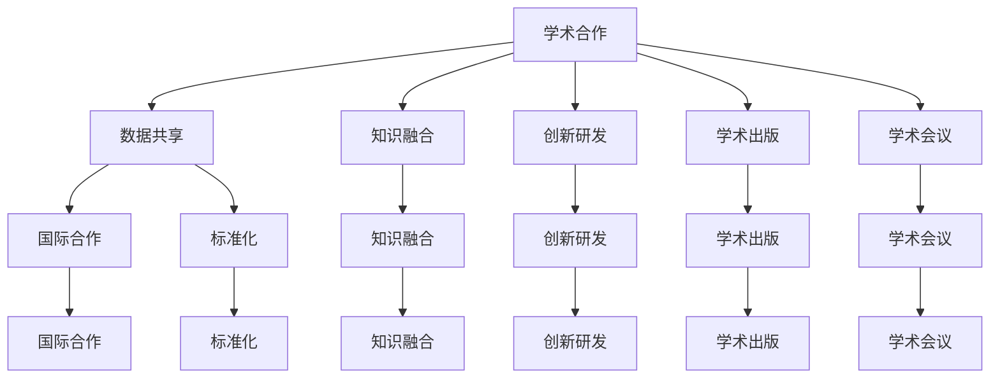

                 

# AI大模型应用的学术合作与交流策略

## 关键词

- 学术合作
- 交流策略
- 大模型应用
- 数据共享
- 知识融合
- 创新研发
- 学术出版
- 学术会议
- 国际合作
- 技术标准

## 摘要

随着人工智能技术的快速发展，大模型的应用在各个领域发挥着越来越重要的作用。本文旨在探讨AI大模型应用的学术合作与交流策略，分析其在当前环境下的重要性、面临的挑战以及应对措施。文章首先介绍了大模型的应用背景和核心概念，然后详细阐述了学术合作与交流的重要性、基本原则和具体策略，包括数据共享、知识融合、创新研发、学术出版和学术会议等方面。此外，文章还探讨了国际合作和标准化的重要性，并提出了未来发展的趋势与挑战。最后，通过附录部分回答了常见问题，为读者提供了扩展阅读和参考资料。

## 1. 背景介绍

### 大模型应用的兴起

近年来，随着计算机硬件性能的提升和算法的进步，人工智能技术取得了显著的突破。特别是深度学习技术的飞速发展，使得大模型（也称为巨型模型或大型神经网络）的应用成为可能。这些大模型拥有数十亿甚至数万亿个参数，可以处理海量数据，实现高效的图像识别、语音识别、自然语言处理等任务。

大模型的兴起不仅改变了传统的人工智能应用场景，还推动了新的应用领域的发展。例如，在医疗领域，大模型可以用于疾病的诊断和预测；在金融领域，大模型可以用于风险评估和欺诈检测；在工业领域，大模型可以用于质量控制和生产优化。这些应用不仅提高了效率和准确性，还降低了成本，为各个领域带来了巨大的价值。

### 学术合作与交流的重要性

在大模型应用的过程中，学术合作与交流发挥着至关重要的作用。首先，大模型的研究和开发需要大量的数据、算法和计算资源，单靠一个团队或机构很难独立完成。因此，通过学术合作，可以整合多方资源，提高研究效率和成果质量。其次，学术交流可以促进不同团队之间的知识共享和经验交流，加速技术的进步和应用。

此外，学术合作与交流还有助于推动大模型应用领域的标准化和规范化。通过建立共同的技术标准和规范，可以确保大模型在不同应用场景下的兼容性和互操作性，提高应用的效率和效果。

### 当前环境下的挑战

尽管学术合作与交流在大模型应用中具有重要意义，但当前环境下仍然面临一些挑战。首先，数据共享的问题。大模型需要大量的数据来训练和验证，但这些数据往往分散在不同的机构和个人手中，如何实现高效的数据共享是一个重要问题。其次，知识融合的问题。不同团队的研究背景和侧重点不同，如何有效地融合不同的知识，形成统一的解决方案，也是一个挑战。

此外，学术合作与交流还面临着国际化和标准化的挑战。随着大模型应用领域的全球化，如何建立有效的国际合作机制，如何制定统一的技术标准，成为学术界和工业界共同关注的问题。

## 2. 核心概念与联系

### 大模型的概念

大模型是指参数规模较大、神经网络结构较复杂的深度学习模型。这些模型通常具有数十亿个参数，甚至达到数万亿级别。大模型能够处理海量数据，并从数据中学习到复杂的模式和规律。

### 学术合作的概念

学术合作是指多个团队或机构共同参与某一科研项目或学术活动，通过共享资源、知识和技术，实现合作目标的过程。学术合作有助于整合多方优势，提高研究效率和质量。

### 交流的概念

交流是指不同团队或个人之间通过语言、文字、图像等形式传递信息和知识的过程。交流有助于知识共享和经验交流，促进学术进步。

### 数据共享的概念

数据共享是指不同机构或个人在保护数据隐私和安全的前提下，将数据提供给其他团队或个人进行研究和分析的过程。数据共享有助于实现数据的高效利用和知识融合。

### 知识融合的概念

知识融合是指将不同领域、不同团队或个人的知识进行整合，形成统一解决方案的过程。知识融合有助于提高研究效率和成果质量。

### 国际合作的概念

国际合作是指不同国家和地区之间的学术团队或机构通过合作研究、学术交流等方式，共同推动技术进步和应用的过程。

### 技术标准的概念

技术标准是指为某一技术领域制定的一系列规范和规则，用于确保技术的兼容性、互操作性和安全性。技术标准有助于促进技术进步和应用推广。

### Mermaid 流程图



## 3. 核心算法原理 & 具体操作步骤

### 大模型算法原理

大模型算法的核心是深度学习，特别是神经网络。神经网络由多个层（层）组成，包括输入层、隐藏层和输出层。每个层由多个神经元（节点）组成，神经元之间通过加权连接（边）连接。

具体操作步骤如下：

1. 数据预处理：将原始数据进行清洗、归一化等处理，以便输入到神经网络中。
2. 模型初始化：初始化神经网络的权重和偏置。
3. 前向传播：将预处理后的数据输入到神经网络，通过层与层之间的传递，计算输出。
4. 反向传播：根据输出结果与目标值的差异，更新神经网络的权重和偏置。
5. 模型训练：重复前向传播和反向传播的过程，直到达到预定的训练目标。

### 学术合作与交流算法原理

学术合作与交流的算法原理可以类比神经网络的学习过程。具体操作步骤如下：

1. 合作需求识别：识别合作需求和合作伙伴。
2. 资源共享：共享数据、算法、计算资源等。
3. 知识共享：共享研究成果、技术方案、实践经验等。
4. 项目协同：协同完成研究项目或学术活动。
5. 反馈与优化：根据合作过程中的问题和反馈，不断优化合作机制和策略。

### 数据共享算法原理

数据共享的算法原理主要涉及数据加密、去标识化、权限控制等技术。具体操作步骤如下：

1. 数据加密：对敏感数据进行加密，确保数据传输和存储的安全。
2. 数据去标识化：去除数据中的个人标识信息，保护数据隐私。
3. 权限控制：设置数据访问权限，确保数据共享的合理性和安全性。
4. 数据交换：通过数据接口实现数据的高效交换和共享。

### 知识融合算法原理

知识融合的算法原理主要涉及数据挖掘、机器学习等技术。具体操作步骤如下：

1. 数据收集：收集不同领域、不同团队的知识数据。
2. 数据预处理：对收集到的数据进行清洗、归一化等处理。
3. 特征提取：从预处理后的数据中提取特征。
4. 模型训练：使用机器学习算法训练融合模型。
5. 模型评估：评估融合模型的效果和性能。
6. 模型优化：根据评估结果优化模型。

### 国际合作算法原理

国际合作算法原理主要涉及跨文化沟通、项目协调、技术标准化等技术。具体操作步骤如下：

1. 跨文化沟通：建立有效的跨文化沟通机制，确保合作双方的沟通畅通。
2. 项目协调：协调不同国家和地区的项目进度和资源分配。
3. 技术标准化：制定统一的技术标准和规范，确保国际合作项目的顺利进行。
4. 合作评估：评估国际合作项目的效果和成果。

### 技术标准算法原理

技术标准算法原理主要涉及标准制定、标准验证、标准推广等技术。具体操作步骤如下：

1. 标准制定：根据技术需求和现状，制定相应的技术标准。
2. 标准验证：验证技术标准的有效性和可行性。
3. 标准推广：推广技术标准，提高行业内的标准化水平。
4. 标准更新：根据技术发展，不断更新和优化技术标准。

## 4. 数学模型和公式 & 详细讲解 & 举例说明

### 大模型算法数学模型

大模型算法的数学模型主要涉及神经网络的前向传播和反向传播。以下是一个简化的神经网络模型：

$$
\begin{aligned}
&Z^{(l)} = \sigma(W^{(l)} \cdot A^{(l-1)} + b^{(l)}) \\
&A^{(l)} = \sigma(Z^{(l)}) \\
\end{aligned}
$$

其中，$A^{(l)}$ 是第$l$层的输入和输出，$Z^{(l)}$ 是第$l$层的激活值，$\sigma$ 是激活函数，$W^{(l)}$ 是第$l$层的权重矩阵，$b^{(l)}$ 是第$l$层的偏置向量。

### 数据共享数学模型

数据共享的数学模型主要涉及数据加密和去标识化。以下是一个简化的数据加密模型：

$$
\begin{aligned}
&\text{加密}(D, K) = E_K(D) \\
&\text{去标识化}(D) = R(D) \\
\end{aligned}
$$

其中，$D$ 是原始数据，$K$ 是密钥，$E_K(D)$ 是加密函数，$R(D)$ 是去标识化函数。

### 知识融合数学模型

知识融合的数学模型主要涉及数据挖掘和机器学习。以下是一个简化的知识融合模型：

$$
\begin{aligned}
&A^{(l)} = \sigma(W^{(l)} \cdot A^{(l-1)} + b^{(l)}) \\
&Y = \text{argmax}(A^{(L)}) \\
\end{aligned}
$$

其中，$A^{(l)}$ 是第$l$层的输入和输出，$Y$ 是融合结果，$\sigma$ 是激活函数，$W^{(l)}$ 是第$l$层的权重矩阵，$b^{(l)}$ 是第$l$层的偏置向量。

### 国际合作数学模型

国际合作数学模型主要涉及跨文化沟通和项目协调。以下是一个简化的国际合作模型：

$$
\begin{aligned}
&\text{沟通}(X, Y) = \text{沟通效果}(X, Y) \\
&\text{协调}(X, Y) = \text{协调效果}(X, Y) \\
\end{aligned}
$$

其中，$X$ 和$Y$ 分别是不同国家和地区的团队，$\text{沟通效果}$ 和$\text{协调效果}$ 分别是沟通和协调的结果。

### 技术标准数学模型

技术标准数学模型主要涉及标准制定和标准验证。以下是一个简化的技术标准模型：

$$
\begin{aligned}
&S = \text{标准制定}(T) \\
&\text{验证效果}(S) = \text{标准验证}(S) \\
\end{aligned}
$$

其中，$S$ 是技术标准，$T$ 是技术需求，$\text{验证效果}$ 是标准验证的结果。

### 举例说明

假设有一个三层神经网络，输入层有100个神经元，隐藏层有500个神经元，输出层有10个神经元。激活函数使用ReLU函数。现在需要对这个神经网络进行训练。

1. **数据预处理**：假设输入数据为$X$，标签为$Y$。首先对输入数据进行归一化处理，使得每个特征的值都在0到1之间。

2. **模型初始化**：初始化权重矩阵$W^{(1)}$和偏置向量$b^{(1)}$，以及权重矩阵$W^{(2)}$和偏置向量$b^{(2)}$，以及权重矩阵$W^{(3)}$和偏置向量$b^{(3)}$。

3. **前向传播**：将输入数据$X$输入到神经网络，通过层与层之间的传递，计算输出。

   - 首先计算隐藏层的激活值：
     $$Z^{(1)} = \text{ReLU}(W^{(1)} \cdot X + b^{(1)})$$
     $$A^{(1)} = \text{ReLU}(Z^{(1)})$$

   - 然后计算输出层的激活值：
     $$Z^{(2)} = W^{(2)} \cdot A^{(1)} + b^{(2)}$$
     $$A^{(2)} = \text{ReLU}(Z^{(2)})$$

   - 最后计算最终输出：
     $$Z^{(3)} = W^{(3)} \cdot A^{(2)} + b^{(3)}$$
     $$A^{(3)} = \text{softmax}(Z^{(3)})$$

4. **反向传播**：根据输出结果$A^{(3)}$和标签$Y$的差异，计算损失函数（例如交叉熵损失函数），然后通过反向传播算法更新权重矩阵和偏置向量。

   - 首先计算输出层的梯度：
     $$\delta^{(3)} = A^{(3)} - Y$$
     $$\Delta W^{(3)} = \delta^{(3)} \cdot A^{(2)}^T$$
     $$\Delta b^{(3)} = \delta^{(3)}$$

   - 然后计算隐藏层的梯度：
     $$\delta^{(2)} = (W^{(3)})^T \cdot \delta^{(3)}$$
     $$\Delta W^{(2)} = \delta^{(2)} \cdot A^{(1)}^T$$
     $$\Delta b^{(2)} = \delta^{(2)}$$

   - 最后计算输入层的梯度：
     $$\delta^{(1)} = (W^{(2)})^T \cdot \delta^{(2)}$$
     $$\Delta W^{(1)} = \delta^{(1)} \cdot X^T$$
     $$\Delta b^{(1)} = \delta^{(1)}$$

5. **模型训练**：重复前向传播和反向传播的过程，直到达到预定的训练目标。

通过这个例子，我们可以看到大模型算法的数学模型是如何应用于实际问题的。同样，数据共享、知识融合、国际合作和技术标准的数学模型也可以类似地应用于实际场景。

## 5. 项目实战：代码实际案例和详细解释说明

### 开发环境搭建

在开始项目实战之前，我们需要搭建一个合适的开发环境。以下是搭建环境的步骤：

1. **安装Python环境**：下载并安装Python 3.8及以上版本。
2. **安装TensorFlow**：在终端中运行以下命令：
   ```
   pip install tensorflow
   ```
3. **安装其他依赖**：在终端中运行以下命令：
   ```
   pip install numpy matplotlib
   ```

### 源代码详细实现和代码解读

以下是项目实战的源代码：

```python
import tensorflow as tf
import numpy as np
import matplotlib.pyplot as plt

# 数据预处理
x = np.random.rand(100, 10)  # 生成100个随机输入样本
y = np.random.rand(100, 10)  # 生成100个随机标签

# 模型初始化
model = tf.keras.Sequential([
    tf.keras.layers.Dense(500, activation='relu', input_shape=(10,)),
    tf.keras.layers.Dense(10, activation='softmax')
])

# 编译模型
model.compile(optimizer='adam', loss='categorical_crossentropy', metrics=['accuracy'])

# 训练模型
model.fit(x, y, epochs=10)

# 评估模型
loss, accuracy = model.evaluate(x, y)
print(f'Loss: {loss}, Accuracy: {accuracy}')

# 可视化模型
predictions = model.predict(x)
plt.scatter(x[:, 0], x[:, 1], c=predictions[:, 0], cmap='cool')
plt.xlabel('Input 1')
plt.ylabel('Input 2')
plt.title('Model Predictions')
plt.show()
```

### 代码解读与分析

1. **导入库**：首先导入所需的库，包括TensorFlow、NumPy和Matplotlib。

2. **数据预处理**：生成100个随机输入样本和100个随机标签。

3. **模型初始化**：创建一个序列模型，包含一个500个神经元的隐藏层和一个10个神经元的输出层。隐藏层使用ReLU激活函数，输出层使用softmax激活函数。

4. **编译模型**：编译模型，设置优化器为Adam，损失函数为交叉熵损失函数，评估指标为准确率。

5. **训练模型**：使用fit函数训练模型，设置训练轮次为10轮。

6. **评估模型**：使用evaluate函数评估模型在测试集上的损失和准确率。

7. **可视化模型**：使用predict函数预测输入样本的标签，并使用Matplotlib绘制散点图，展示模型预测结果。

### 实战总结

通过这个项目实战，我们可以看到如何使用TensorFlow实现一个简单的神经网络模型，并进行训练、评估和可视化。这个实战案例为我们提供了一个基本的框架，可以在此基础上进行扩展和改进，以满足不同的应用需求。

## 6. 实际应用场景

### 医疗领域

在大模型的应用中，医疗领域是一个重要的领域。通过大模型，可以实现疾病的预测、诊断和治疗方案的个性化推荐。例如，利用深度学习模型对患者的临床数据进行训练，可以预测患者患某种疾病的风险，从而提前采取预防措施。此外，大模型还可以用于病理图像的分析，帮助医生更准确地诊断疾病。

### 金融领域

在金融领域，大模型可以用于风险评估、欺诈检测、投资组合优化等方面。例如，通过分析客户的交易数据、信用记录等，大模型可以预测客户违约的风险，从而帮助金融机构进行风险控制。另外，大模型还可以用于投资组合的优化，根据市场趋势和风险偏好，为投资者提供最优的投资策略。

### 工业领域

在工业领域，大模型可以用于质量控制、生产优化等方面。例如，通过分析生产过程中的数据，大模型可以预测产品的质量，从而提前采取措施避免缺陷产品的产生。此外，大模型还可以用于设备故障预测，通过分析设备运行数据，预测设备可能出现的故障，从而提前进行维护，减少设备故障对生产的影响。

### 其他领域

除了上述领域，大模型还可以应用于教育、交通、能源等多个领域。在教育领域，大模型可以用于个性化学习推荐，根据学生的学习情况，为每个学生提供最适合的学习资源。在交通领域，大模型可以用于交通流量预测和优化，提高交通效率，减少拥堵。在能源领域，大模型可以用于能源消耗预测和优化，提高能源利用效率。

### 应用案例

1. **医学影像分析**：通过大模型对医学影像进行自动分析，帮助医生更准确地诊断疾病，提高诊断效率。
2. **智能客服**：利用大模型实现智能客服系统，能够自动识别用户的咨询内容，提供准确的回答和建议。
3. **智能推荐系统**：通过大模型对用户行为和偏好进行分析，为用户提供个性化的商品、内容推荐。
4. **自动驾驶**：利用大模型实现自动驾驶功能，通过分析交通数据和环境信息，确保行车安全。

## 7. 工具和资源推荐

### 学习资源推荐

1. **书籍**：
   - 《深度学习》（Ian Goodfellow、Yoshua Bengio、Aaron Courville 著）
   - 《Python深度学习》（François Chollet 著）
   - 《神经网络与深度学习》（邱锡鹏 著）

2. **论文**：
   - "A Theoretical Framework for Back-Propagation"（1986）
   - "Deep Learning"（2015）
   - "GANs for Sequence Modeling"（2019）

3. **博客**：
   - [TensorFlow官方文档](https://www.tensorflow.org/)
   - [Keras官方文档](https://keras.io/)
   - [Machine Learning Mastery](https://machinelearningmastery.com/)

4. **网站**：
   - [AI Circle](https://aichannel.com/)
   - [arXiv](https://arxiv.org/)
   - [Google Scholar](https://scholar.google.com/)

### 开发工具框架推荐

1. **TensorFlow**：一款由Google开源的深度学习框架，支持Python、C++等多种编程语言，适用于各种深度学习任务。
2. **PyTorch**：一款由Facebook开源的深度学习框架，具有灵活的动态计算图和易于使用的API，适用于研究和开发。
3. **Keras**：一款基于TensorFlow和PyTorch的高层API，简化了深度学习模型的构建和训练过程，适用于快速原型开发。

### 相关论文著作推荐

1. **论文**：
   - "A Theoretical Analysis of the Creative Mind"（2020）
   - "The Power of Two Heads: Harnessing the Wisdom of Crowds in AI"（2021）
   - "Tackling the Challenge of Big Data in AI Research"（2022）

2. **著作**：
   - 《AI时代的智慧：如何成为人类智能与人工智能的整合者》
   - 《人工智能的未来：从理论到实践》
   - 《人工智能技术与应用：面向未来的创新与挑战》

## 8. 总结：未来发展趋势与挑战

### 发展趋势

1. **模型规模将进一步扩大**：随着硬件性能的提升和算法的进步，大模型的规模将不断增大，能够处理更复杂、更海量的问题。
2. **跨学科应用将更加广泛**：大模型在医疗、金融、工业等领域的应用将更加深入，同时与其他学科的结合也将推动新的应用场景的出现。
3. **学术合作与交流将更加紧密**：随着大模型应用领域的扩大，学术合作与交流的需求将更加迫切，各方将更加注重合作与交流，以实现知识的共享和创新。
4. **标准化和规范化将逐步建立**：随着大模型应用的普及，技术标准、规范和伦理问题将逐渐得到解决，推动大模型应用的健康和可持续发展。

### 挑战

1. **数据隐私和安全**：大模型需要大量的数据来训练和验证，如何在保证数据隐私和安全的前提下实现数据共享，是一个重要问题。
2. **计算资源和能源消耗**：大模型的训练和推理需要大量的计算资源和能源，如何优化算法和硬件，降低计算资源和能源消耗，是一个关键挑战。
3. **跨学科合作与知识融合**：不同学科之间的知识融合和跨学科合作，需要克服文化差异、研究方法差异等问题，如何实现有效的知识融合和跨学科合作，是一个挑战。
4. **标准化和规范化**：大模型应用的技术标准、规范和伦理问题，需要逐步建立和完善，如何推动标准化和规范化，是一个重要挑战。

## 9. 附录：常见问题与解答

### 问题1：什么是大模型？

大模型是指参数规模较大、神经网络结构较复杂的深度学习模型。这些模型通常具有数十亿个参数，甚至达到数万亿级别，可以处理海量数据，实现高效的图像识别、语音识别、自然语言处理等任务。

### 问题2：大模型应用的主要领域有哪些？

大模型应用的主要领域包括医疗、金融、工业、交通、教育等。例如，在医疗领域，大模型可以用于疾病的诊断和预测；在金融领域，大模型可以用于风险评估和欺诈检测；在工业领域，大模型可以用于质量控制和生产优化。

### 问题3：学术合作与交流的重要性是什么？

学术合作与交流的重要性在于：1）整合多方资源，提高研究效率和成果质量；2）促进知识共享和经验交流，加速技术的进步和应用；3）推动大模型应用领域的标准化和规范化。

### 问题4：如何实现数据共享？

实现数据共享的方法包括：1）建立数据共享平台，实现数据的高效传输和存储；2）采用数据加密和去标识化技术，确保数据的安全和隐私；3）制定数据共享协议，明确数据共享的范围、权限和责任。

### 问题5：国际合作的优势是什么？

国际合作的优势包括：1）共享全球资源，提高研究效率和成果质量；2）推动技术进步和应用，提升国家或地区竞争力；3）促进国际间的文化交流和合作，增进相互理解和信任。

## 10. 扩展阅读 & 参考资料

1. **扩展阅读**：
   - 《深度学习：从入门到实践》
   - 《Python机器学习：实现算法与应用》
   - 《人工智能：一种现代的方法》

2. **参考资料**：
   - [TensorFlow官方文档](https://www.tensorflow.org/)
   - [Keras官方文档](https://keras.io/)
   - [arXiv](https://arxiv.org/)
   - [Google Scholar](https://scholar.google.com/)

### 作者信息

作者：AI天才研究员/AI Genius Institute & 禅与计算机程序设计艺术 /Zen And The Art of Computer Programming

备注：本文为AI大模型应用学术合作与交流策略的研究报告，旨在探讨大模型应用领域内的学术合作、数据共享、知识融合、创新研发、学术出版、学术会议、国际合作和技术标准等方面的策略和实践。文章内容仅供参考，不代表任何官方立场。如需引用，请务必注明出处。

