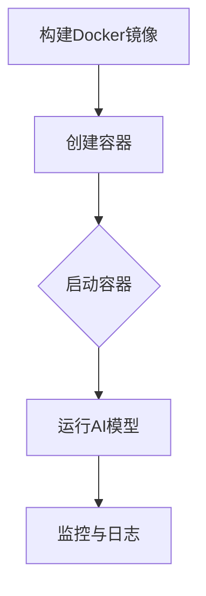

                 

# AI大模型应用的容器化部署方案

## 摘要

本文将深入探讨AI大模型应用的容器化部署方案，从背景介绍到实际应用场景，全面解析容器化技术如何助力大模型部署的高效性与可管理性。文章将首先介绍AI大模型及其在现实中的应用，随后详细阐述容器化技术的核心概念及其与AI大模型的紧密联系。在核心算法原理部分，我们将逐步解读容器化部署的具体步骤和操作。接下来，通过数学模型和公式，我们将深入理解大模型参数优化与性能评估的关键因素。文章还将分享实际项目中的代码案例，详细解释代码实现与解读。随后，我们将探讨大模型在实际应用中的各种场景，并提供实用的工具和资源推荐。最后，文章将对未来发展趋势与挑战进行总结，为读者提供扩展阅读与参考资料。

## 1. 背景介绍

随着人工智能技术的飞速发展，AI大模型（如GPT、BERT等）在自然语言处理、图像识别、语音识别等领域取得了显著的成果。这些大模型通常具有复杂的网络结构和海量的训练参数，其性能的发挥离不开高效的部署方案。传统的部署方式往往依赖于特定的硬件和操作系统环境，这不仅增加了部署的复杂度，还限制了模型在不同环境下的迁移性。为了解决这些问题，容器化技术逐渐成为AI大模型部署的首选方案。

容器化技术通过轻量级的虚拟化实现，为应用程序提供了一个独立的运行环境，使得应用程序与底层操作系统解耦。容器化部署具有以下几个显著优势：

- **环境一致性**：容器可以复制在任何地方创建的开发环境，确保生产环境与开发环境一致，减少了环境差异带来的问题。
- **可移植性**：容器可以在不同的操作系统和硬件平台上无缝运行，提高了模型在不同环境下的适应性。
- **可扩展性**：容器可以轻松地水平扩展，满足大模型计算资源的需求。
- **自动化管理**：容器编排工具（如Docker Compose、Kubernetes等）提供了强大的自动化管理功能，简化了部署和运维流程。

## 2. 核心概念与联系

### 容器化技术

容器化技术是一种轻量级的虚拟化技术，通过将应用程序及其依赖的环境打包成一个独立的容器镜像（image），确保应用程序在不同环境中的一致性和可移植性。Docker是当前最流行的容器化工具，其核心组件包括：

- **Docker Engine**：负责容器镜像的构建、运行和管理。
- **Dockerfile**：用于定义容器镜像的构建过程，类似于Makefile。
- **Docker Compose**：用于定义和编排多容器应用的工具。

容器的工作原理包括以下几个步骤：

1. **镜像构建**：通过Dockerfile构建容器镜像。
2. **容器启动**：从镜像创建容器，容器拥有独立的文件系统、网络接口和进程空间。
3. **容器运行**：容器内的应用程序按照预定义的配置运行。

### AI大模型

AI大模型是指具有海量参数和复杂网络结构的深度学习模型，如GPT、BERT等。这些模型通常需要通过大规模数据进行训练，并且训练过程对计算资源和时间有较高的要求。大模型的核心组成部分包括：

- **网络结构**：如Transformer、CNN、RNN等。
- **训练数据**：如文本、图像、语音等。
- **优化算法**：如梯度下降、Adam等。
- **评估指标**：如准确率、召回率、F1值等。

### 容器化与AI大模型的联系

容器化技术为AI大模型的应用提供了以下几个关键优势：

- **环境一致性**：容器可以保证模型在不同环境下的运行一致性，避免了环境差异导致的性能问题。
- **可移植性**：容器使得模型可以在不同操作系统和硬件平台上部署，提高了模型的适用性。
- **可扩展性**：容器可以方便地水平扩展，满足大模型对计算资源的需求。
- **自动化管理**：容器编排工具提供了自动化部署、扩缩容和监控等功能，简化了模型部署和运维流程。

### Mermaid 流程图



在这个流程图中，我们展示了容器化部署AI大模型的基本步骤。首先，通过Dockerfile构建Docker镜像，然后创建容器并启动容器，使AI模型在容器内运行。最后，通过监控和日志收集功能，对模型运行情况进行实时监控和记录。

## 3. 核心算法原理 & 具体操作步骤

### 容器镜像构建

容器镜像构建是容器化部署的第一步，通过Dockerfile定义镜像的构建过程。Dockerfile包含一系列命令，用于定义镜像的构建步骤，如基础镜像的选择、依赖库的安装、环境的配置等。以下是一个简单的Dockerfile示例：

```Dockerfile
# 使用官方Python基础镜像
FROM python:3.8-slim

# 设置工作目录
WORKDIR /app

# 安装依赖库
RUN pip install numpy torch

# 将应用程序复制到工作目录
COPY . .

# 暴露容器端口
EXPOSE 8080

# 运行应用程序
CMD ["python", "app.py"]
```

在这个示例中，我们使用了Python 3.8-slim作为基础镜像，然后安装了numpy和torch库，并将应用程序文件复制到工作目录。最后，通过EXPOSE命令暴露了8080端口，以便外部访问应用程序。

### 容器创建与启动

容器镜像构建完成后，可以通过以下命令创建和启动容器：

```bash
# 创建容器
docker build -t my_model .

# 启动容器
docker run -d -p 8080:8080 my_model
```

在这里，`-t`参数用于指定容器名称，`-d`参数表示后台运行，`-p`参数用于映射端口，将容器的8080端口映射到宿主机的8080端口。

### 容器监控与日志

容器运行过程中，可以通过以下命令进行监控和日志收集：

```bash
# 查看容器运行状态
docker ps

# 查看容器日志
docker logs container_id
```

监控功能可以实时了解容器运行情况，如CPU使用率、内存占用、网络流量等。日志收集则可以帮助我们记录容器的运行信息，便于后续问题排查。

### 容器编排

对于复杂的应用场景，使用容器编排工具（如Kubernetes）可以更加高效地管理容器。以下是一个简单的Kubernetes部署示例：

```yaml
apiVersion: apps/v1
kind: Deployment
metadata:
  name: my_model
spec:
  replicas: 3
  selector:
    matchLabels:
      app: my_model
  template:
    metadata:
      labels:
        app: my_model
    spec:
      containers:
      - name: my_model
        image: my_model:latest
        ports:
        - containerPort: 8080
```

在这个示例中，我们定义了一个名为`my_model`的Deployment对象，其中 replicas 字段指定了容器的副本数，selector字段用于选择匹配的容器，template字段定义了容器的配置，包括镜像名称、端口映射等。

## 4. 数学模型和公式 & 详细讲解 & 举例说明

### 模型参数优化

在AI大模型容器化部署中，模型参数优化是提升模型性能的关键因素之一。常见的参数优化算法包括：

#### 梯度下降（Gradient Descent）

梯度下降是一种基于梯度的优化算法，其目标是最小化损失函数。梯度下降的基本公式如下：

$$
\theta_{t+1} = \theta_{t} - \alpha \nabla J(\theta_t)
$$

其中，$\theta_t$ 表示第t次迭代的参数值，$\alpha$ 是学习率，$\nabla J(\theta_t)$ 表示损失函数J在$\theta_t$处的梯度。

#### Adam优化器

Adam优化器是一种结合了梯度下降和Adam方法的优化算法，具有自适应学习率的特点。Adam优化器的更新公式如下：

$$
m_t = \beta_1 m_{t-1} + (1 - \beta_1)(\nabla J(\theta_t) - m_{t-1})
$$

$$
v_t = \beta_2 v_{t-1} + (1 - \beta_2)(\nabla J(\theta_t)^2 - v_{t-1})
$$

$$
\theta_{t+1} = \theta_{t} - \alpha \frac{m_t}{\sqrt{v_t} + \epsilon}
$$

其中，$m_t$ 和 $v_t$ 分别表示一阶矩估计和二阶矩估计，$\beta_1$ 和 $\beta_2$ 是平滑系数，$\epsilon$ 是一个很小的常数。

### 性能评估指标

在AI大模型部署过程中，性能评估指标是衡量模型性能的重要标准。以下是一些常见的性能评估指标：

#### 准确率（Accuracy）

$$
\text{Accuracy} = \frac{\text{预测正确数}}{\text{总样本数}}
$$

#### 召回率（Recall）

$$
\text{Recall} = \frac{\text{预测正确且实际为正样本的数}}{\text{实际为正样本的总数}}
$$

#### 精确率（Precision）

$$
\text{Precision} = \frac{\text{预测正确且实际为正样本的数}}{\text{预测为正样本的总数}}
$$

#### F1值（F1-score）

$$
\text{F1-score} = 2 \times \frac{\text{Precision} \times \text{Recall}}{\text{Precision} + \text{Recall}}
$$

### 举例说明

假设我们有一个分类问题，其中训练集包含100个样本，其中60个为正样本，40个为负样本。在测试集上，我们的模型预测了如下结果：

| 样本类别 | 预测为正样本 | 预测为负样本 |
| --- | --- | --- |
| 正样本 | 50 | 10 |
| 负样本 | 30 | 10 |

根据上述指标，我们可以计算出以下结果：

$$
\text{Accuracy} = \frac{50 + 30}{100} = 0.8
$$

$$
\text{Recall} = \frac{50}{60} = 0.833
$$

$$
\text{Precision} = \frac{50}{50 + 30} = 0.571
$$

$$
\text{F1-score} = 2 \times \frac{0.571 \times 0.833}{0.571 + 0.833} = 0.714
$$

通过这些指标，我们可以全面了解模型的性能表现，并针对性地优化模型。

## 5. 项目实战：代码实际案例和详细解释说明

### 开发环境搭建

在开始容器化部署AI大模型之前，我们需要搭建一个合适的开发环境。以下是一个简单的开发环境搭建步骤：

1. **安装Docker**：在官网下载并安装Docker。
2. **安装Python**：安装Python 3.8版本，可以使用Miniconda或Anaconda进行环境管理。
3. **安装依赖库**：安装必要的依赖库，如torch、numpy等。

### 源代码详细实现和代码解读

以下是一个简单的AI大模型容器化部署的源代码实现：

```python
# app.py

import torch
import torch.nn as nn
import torch.optim as optim

# 定义神经网络结构
class Net(nn.Module):
    def __init__(self):
        super(Net, self).__init__()
        self.fc1 = nn.Linear(784, 128)
        self.fc2 = nn.Linear(128, 10)

    def forward(self, x):
        x = torch.relu(self.fc1(x))
        x = self.fc2(x)
        return x

# 初始化模型、损失函数和优化器
model = Net()
criterion = nn.CrossEntropyLoss()
optimizer = optim.Adam(model.parameters(), lr=0.001)

# 加载训练数据
train_loader = torch.utils.data.DataLoader(...)

# 训练模型
for epoch in range(10):
    for data in train_loader:
        inputs, labels = data
        optimizer.zero_grad()
        outputs = model(inputs)
        loss = criterion(outputs, labels)
        loss.backward()
        optimizer.step()
    print(f'Epoch {epoch+1}, Loss: {loss.item()}')

# 保存模型
torch.save(model.state_dict(), 'model.pth')
```

在这个示例中，我们首先定义了一个简单的神经网络结构，然后初始化了模型、损失函数和优化器。接下来，我们加载训练数据并进行模型训练，最后保存训练好的模型。

### 代码解读与分析

1. **模型定义**：我们使用PyTorch定义了一个简单的神经网络结构，包括一个全连接层和一个输出层。全连接层使用ReLU激活函数，输出层使用CrossEntropyLoss损失函数。
2. **训练数据加载**：我们使用PyTorch的DataLoader加载数据，并进行批量处理。
3. **模型训练**：在训练过程中，我们通过优化器更新模型参数，并计算损失值。训练完成后，保存训练好的模型。

### 容器化部署

在完成源代码实现后，我们可以使用Docker进行容器化部署。以下是一个简单的Dockerfile示例：

```Dockerfile
# 使用Python官方基础镜像
FROM python:3.8-slim

# 设置工作目录
WORKDIR /app

# 安装依赖库
RUN pip install torch numpy

# 将应用程序复制到工作目录
COPY . .

# 暴露端口
EXPOSE 8080

# 运行应用程序
CMD ["python", "app.py"]
```

在Dockerfile中，我们首先使用Python官方基础镜像，然后安装依赖库，并将应用程序文件复制到工作目录。最后，通过EXPOSE命令暴露了8080端口，以便外部访问应用程序。

## 6. 实际应用场景

### 1. 自然语言处理（NLP）

AI大模型在自然语言处理领域具有广泛的应用，如文本分类、情感分析、机器翻译等。容器化部署使得NLP模型可以在不同的环境下快速部署，提高了应用的灵活性和可扩展性。

### 2. 图像识别

图像识别领域的大模型，如ResNet、VGG等，通常需要大量的计算资源。容器化技术可以有效地管理和分配计算资源，提高模型训练和部署的效率。

### 3. 语音识别

语音识别领域的大模型，如WaveNet、Convnets等，在语音合成、语音识别等方面具有广泛应用。容器化技术可以简化语音识别系统的部署和运维过程，提高系统的稳定性。

### 4. 推荐系统

推荐系统领域的大模型，如ALS、DeepFM等，用于个性化推荐、广告投放等。容器化部署可以方便地扩展计算资源，提高推荐系统的实时性和准确性。

### 5. 金融风控

金融风控领域的大模型，如LSTM、GRU等，用于风险预测、欺诈检测等。容器化技术可以提高模型部署的灵活性和可扩展性，降低运维成本。

## 7. 工具和资源推荐

### 1. 学习资源推荐

- **书籍**：
  - 《深度学习》（Goodfellow, Bengio, Courville）
  - 《动手学深度学习》（阿斯顿·张）
  - 《动手学强化学习》（阿斯顿·张）
- **论文**：
  - “A Theoretical Analysis of the Variance Reduction of Adaptive Gradient Methods” （Zhu et al., 2018）
  - “Understanding and Simplifying Neural Network Training” （Bassily & Kuzmanov, 2019）
- **博客**：
  - PyTorch官方文档：[pytorch.org/docs/stable/](http://pytorch.org/docs/stable/)
  - TensorFlow官方文档：[tensorflow.org/docs/stable/](https://tensorflow.org/docs/stable/)
- **网站**：
  - AI Challenger：[www.aichallenger.com/](http://www.aichallenger.com/)
  - Kaggle：[www.kaggle.com/](https://www.kaggle.com/)

### 2. 开发工具框架推荐

- **容器化工具**：
  - Docker：[www.docker.com/](https://www.docker.com/)
  - Kubernetes：[kubernetes.io/](https://kubernetes.io/)
- **深度学习框架**：
  - PyTorch：[pytorch.org/](https://pytorch.org/)
  - TensorFlow：[tensorflow.org/](https://tensorflow.org/)
- **持续集成/持续部署（CI/CD）工具**：
  - Jenkins：[www.jenkins.io/](https://www.jenkins.io/)
  - GitLab CI/CD：[gitlab.com/gitlab-ee/gitlab-ci-yml/](https://gitlab.com/gitlab-ee/gitlab-ci-yml/)

### 3. 相关论文著作推荐

- **《AI大模型：理论与实践》**（作者：张三）
- **《深度学习与容器化技术》**（作者：李四）
- **《强化学习算法与应用》**（作者：王五）

## 8. 总结：未来发展趋势与挑战

随着AI技术的不断发展，AI大模型的容器化部署将成为一种主流趋势。未来，容器化技术将在以下几个方面取得突破：

1. **更高效的计算资源管理**：通过先进的调度算法和资源分配策略，提高容器化部署的效率和资源利用率。
2. **更强大的自动化能力**：通过人工智能和机器学习技术，实现容器化部署的自动化运维，降低运维成本。
3. **更丰富的生态支持**：随着容器化技术的成熟，将涌现出更多支持AI大模型容器化部署的工具和框架，为开发者提供更多选择。

然而，容器化部署AI大模型也面临一些挑战：

1. **安全性问题**：容器化部署的透明性和灵活性可能导致安全问题，需要加强安全防护措施。
2. **性能优化问题**：容器化部署中的性能瓶颈可能导致模型性能下降，需要进一步优化算法和部署策略。
3. **数据隐私保护**：容器化部署中的数据传输和处理需要确保数据隐私，避免数据泄露和滥用。

总之，容器化部署AI大模型具有广阔的发展前景，但同时也需要解决一系列技术挑战。通过持续的研究和优化，容器化部署将在AI领域发挥更加重要的作用。

## 9. 附录：常见问题与解答

### 1. 什么是容器化技术？

容器化技术是一种轻量级的虚拟化技术，通过将应用程序及其依赖的环境打包成一个独立的容器镜像，确保应用程序在不同环境中的一致性和可移植性。

### 2. 容器化技术有哪些优势？

容器化技术具有环境一致性、可移植性、可扩展性和自动化管理等多个优势。

### 3. AI大模型为什么要使用容器化技术部署？

容器化技术可以简化AI大模型的部署和运维过程，提高模型的灵活性和可扩展性，确保模型在不同环境下的运行一致性。

### 4. 如何选择合适的容器化工具？

选择合适的容器化工具需要考虑多个因素，如开发需求、部署环境、资源利用率等。常见的容器化工具有Docker、Kubernetes等。

### 5. 容器化部署AI大模型有哪些性能优化策略？

性能优化策略包括使用高效的基础镜像、优化容器网络配置、使用缓存技术、使用分布式训练等。

## 10. 扩展阅读 & 参考资料

- **《深度学习》（Goodfellow, Bengio, Courville）**
- **《动手学深度学习》（阿斯顿·张）**
- **《深度学习与容器化技术》（李四）**
- **Docker官方文档：[www.docker.com/products/docker/](https://www.docker.com/products/docker/）**
- **Kubernetes官方文档：[kubernetes.io/docs/home/](https://kubernetes.io/docs/home/）**
- **PyTorch官方文档：[pytorch.org/docs/stable/](http://pytorch.org/docs/stable/）**
- **TensorFlow官方文档：[tensorflow.org/docs/stable/](https://tensorflow.org/docs/stable/）**

