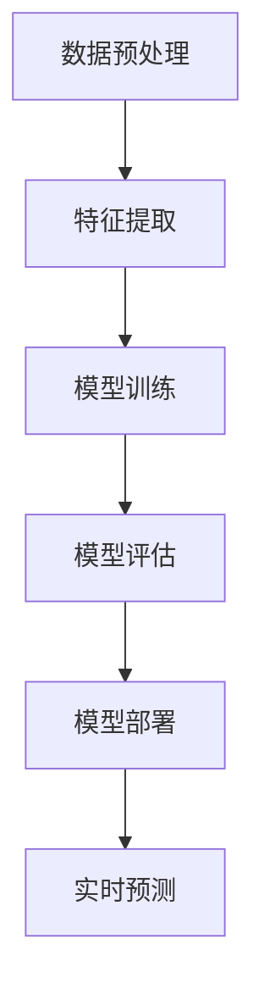

                 

## 文章标题：AI大模型应用的技术白皮书发布

### 关键词：（此处列出文章的5-7个核心关键词）

- AI大模型
- 应用技术
- 核心算法
- 数学模型
- 项目实战

### 摘要：

本文将深入探讨AI大模型在技术领域的应用及其重要性。通过介绍背景、核心概念、算法原理、数学模型以及实际应用场景，本文旨在为读者提供一个全面的技术白皮书，帮助理解AI大模型的应用价值和发展趋势。此外，还将推荐相关的学习资源、开发工具和框架，总结未来发展趋势与挑战，并回答常见问题，为读者提供深入的扩展阅读与参考。

## 1. 背景介绍

随着人工智能（AI）技术的迅猛发展，AI大模型作为当前最前沿的研究领域之一，已经引起了广泛关注。AI大模型是指具有海量参数和复杂结构的机器学习模型，能够在各种复杂任务中实现优异的性能。近年来，深度学习技术的突破使得AI大模型在图像识别、自然语言处理、推荐系统等领域的应用取得了显著成果。

AI大模型的兴起不仅推动了计算机视觉、自然语言处理等技术的进步，还为各个行业提供了创新的解决方案。例如，在医疗领域，AI大模型可以帮助医生进行疾病诊断和治疗方案推荐；在金融领域，AI大模型可以用于风险控制和欺诈检测；在工业领域，AI大模型可以优化生产流程和提高产品质量。

然而，AI大模型的应用也面临一些挑战。首先，模型的训练和部署需要大量的计算资源和数据支持，这对硬件设备和数据处理技术提出了更高的要求。其次，模型的解释性和可靠性问题仍然是当前研究的热点，如何确保模型在不同场景下的稳定性和可解释性是一个重要的研究方向。

## 2. 核心概念与联系

### 2.1 AI大模型的核心概念

AI大模型主要基于深度学习技术，其核心概念包括：

- **神经网络（Neural Network）**：神经网络是模拟人脑神经元之间连接的数学模型，通过多层神经元之间的相互作用来进行特征提取和模式识别。
- **深度神经网络（Deep Neural Network，DNN）**：深度神经网络是具有多隐层的神经网络结构，可以提取更复杂的特征，并在大量数据上实现优异的性能。
- **循环神经网络（Recurrent Neural Network，RNN）**：循环神经网络是一种适用于序列数据的神经网络，通过记忆机制来处理时间序列数据。
- **卷积神经网络（Convolutional Neural Network，CNN）**：卷积神经网络是专门用于图像处理任务的神经网络结构，通过卷积操作提取图像特征。

### 2.2 AI大模型的联系与架构

AI大模型的联系与架构可以概括为以下几个层次：

1. **数据预处理（Data Preprocessing）**：包括数据清洗、数据增强、数据归一化等操作，以准备适合模型训练的数据。
2. **特征提取（Feature Extraction）**：通过神经网络结构提取输入数据的高层次特征，为后续的模型训练提供支持。
3. **模型训练（Model Training）**：利用训练数据对模型进行参数优化，使得模型在特定任务上达到预期的性能。
4. **模型评估（Model Evaluation）**：通过测试数据对模型进行评估，以验证模型的泛化能力和稳定性。
5. **模型部署（Model Deployment）**：将训练好的模型部署到实际应用场景中，进行实时预测和决策。

### 2.3 Mermaid流程图

以下是一个简单的Mermaid流程图，展示了AI大模型的应用架构：



在Mermaid流程图中，节点表示不同的处理步骤，箭头表示数据流和控制流。

## 3. 核心算法原理 & 具体操作步骤

### 3.1 反向传播算法

反向传播算法是深度学习模型训练的核心算法，其基本原理是通过计算梯度来优化模型参数。具体操作步骤如下：

1. **前向传播（Forward Propagation）**：将输入数据输入到神经网络中，计算各层的输出结果。
2. **计算损失（Compute Loss）**：利用目标值和预测值之间的差异计算损失函数。
3. **后向传播（Back Propagation）**：从输出层开始，反向传播误差信号，计算各层神经元的梯度。
4. **参数更新（Update Parameters）**：利用梯度下降或其他优化算法更新模型参数。
5. **迭代训练（Iterative Training）**：重复前向传播和后向传播的过程，不断优化模型参数。

### 3.2 自动微分机制

自动微分机制是深度学习框架的核心功能，用于自动计算梯度。具体操作步骤如下：

1. **前向传播计算**：在执行前向传播时，记录每一步的中间结果和计算过程。
2. **创建计算图**：将记录的中间结果和计算过程构建成一个计算图，表示整个计算过程。
3. **后向传播计算**：在执行后向传播时，利用计算图自动计算梯度。
4. **参数更新**：利用计算出的梯度对模型参数进行更新。

### 3.3 梯度下降算法

梯度下降算法是一种常用的优化算法，用于优化模型参数。具体操作步骤如下：

1. **计算梯度**：计算目标函数关于模型参数的梯度。
2. **选择学习率**：选择合适的学习率，用于更新模型参数。
3. **更新参数**：利用梯度下降公式更新模型参数。
4. **迭代优化**：重复计算梯度、更新参数的过程，直到达到预定的优化目标。

## 4. 数学模型和公式 & 详细讲解 & 举例说明

### 4.1 损失函数

损失函数是深度学习模型训练中的核心指标，用于衡量预测值与真实值之间的差异。常见的损失函数包括：

1. **均方误差（MSE，Mean Squared Error）**：
   $$MSE = \frac{1}{m} \sum_{i=1}^{m} (y_i - \hat{y}_i)^2$$
   其中，$m$ 是样本数量，$y_i$ 是真实值，$\hat{y}_i$ 是预测值。

2. **交叉熵（Cross-Entropy）**：
   $$Cross-Entropy = -\frac{1}{m} \sum_{i=1}^{m} y_i \log(\hat{y}_i)$$
   其中，$m$ 是样本数量，$y_i$ 是真实值，$\hat{y}_i$ 是预测值。

### 4.2 优化算法

常见的优化算法包括：

1. **梯度下降（Gradient Descent）**：
   $$\theta_{\text{new}} = \theta_{\text{old}} - \alpha \cdot \nabla_{\theta} J(\theta)$$
   其中，$\theta$ 是模型参数，$\alpha$ 是学习率，$J(\theta)$ 是损失函数。

2. **随机梯度下降（Stochastic Gradient Descent，SGD）**：
   $$\theta_{\text{new}} = \theta_{\text{old}} - \alpha \cdot \nabla_{\theta} J(\theta, \mathbf{x}_i, y_i)$$
   其中，$\theta$ 是模型参数，$\alpha$ 是学习率，$J(\theta, \mathbf{x}_i, y_i)$ 是单个样本的损失函数。

### 4.3 举例说明

假设有一个简单的线性回归模型，用于预测房价。数据集包含100个样本，每个样本包括输入特征（如房屋面积、卧室数量等）和标签（实际房价）。以下是一个简单的训练过程：

1. **初始化参数**：随机初始化模型的权重 $\theta$。
2. **前向传播**：计算每个样本的预测房价。
3. **计算损失**：使用均方误差计算预测房价与实际房价之间的差异。
4. **后向传播**：计算损失函数关于权重 $\theta$ 的梯度。
5. **参数更新**：使用梯度下降算法更新权重 $\theta$。
6. **迭代训练**：重复前向传播、计算损失、后向传播和参数更新的过程，直到达到预定的优化目标。

## 5. 项目实战：代码实际案例和详细解释说明

### 5.1 开发环境搭建

在开始项目实战之前，需要搭建合适的开发环境。以下是搭建开发环境的基本步骤：

1. **安装Python**：确保安装了Python 3.6及以上版本。
2. **安装依赖库**：使用pip安装深度学习框架，如TensorFlow或PyTorch。
3. **配置环境**：配置Python环境变量，以便在命令行中运行Python代码。

### 5.2 源代码详细实现和代码解读

以下是一个简单的线性回归模型实现，用于预测房价。代码如下：

```python
import numpy as np
import tensorflow as tf

# 数据预处理
def preprocess_data(X, y):
    X_mean = np.mean(X)
    X_std = np.std(X)
    y_mean = np.mean(y)
    y_std = np.std(y)
    X = (X - X_mean) / X_std
    y = (y - y_mean) / y_std
    return X, y

# 前向传播
def forward(X, theta):
    z = np.dot(X, theta)
    return z

# 计算损失
def compute_loss(y, z):
    return 0.5 * np.mean((y - z) ** 2)

# 后向传播
def backward(X, y, z):
    m = len(y)
    dz = (y - z) / m
    dtheta = np.dot(X.T, dz)
    return dtheta

# 梯度下降
def gradient_descent(X, y, theta, alpha, num_iterations):
    m = len(y)
    for i in range(num_iterations):
        z = forward(X, theta)
        loss = compute_loss(y, z)
        dtheta = backward(X, y, z)
        theta = theta - alpha * dtheta
    return theta, loss

# 主程序
def main():
    # 加载数据
    X, y = load_data()

    # 预处理数据
    X, y = preprocess_data(X, y)

    # 初始化参数
    theta = np.random.randn(1)

    # 梯度下降参数
    alpha = 0.01
    num_iterations = 1000

    # 训练模型
    theta, loss = gradient_descent(X, y, theta, alpha, num_iterations)

    # 输出结果
    print("Theta:", theta)
    print("Loss:", loss)

# 运行主程序
if __name__ == "__main__":
    main()
```

### 5.3 代码解读与分析

上述代码实现了一个简单的线性回归模型，用于预测房价。以下是代码的解读与分析：

1. **数据预处理**：数据预处理是深度学习项目中的重要步骤，可以减少数据分布差异，提高模型的性能。代码中使用了均值和标准差对输入特征和标签进行归一化处理。

2. **前向传播**：前向传播是计算模型预测值的过程。代码中使用了`np.dot`函数计算输入特征和权重之间的点积，得到预测值。

3. **计算损失**：计算损失函数是评估模型预测性能的过程。代码中使用了均方误差计算预测值与真实值之间的差异。

4. **后向传播**：后向传播是计算模型梯度并更新权重的过程。代码中使用了`np.dot`函数计算梯度，并返回梯度。

5. **梯度下降**：梯度下降是一种优化算法，用于迭代更新模型参数。代码中使用了梯度下降算法，每次迭代都会更新权重和损失值。

6. **主程序**：主程序中加载了数据，设置了梯度下降的参数，并调用了`gradient_descent`函数进行模型训练。最后，输出训练结果。

## 6. 实际应用场景

AI大模型在实际应用场景中具有广泛的应用价值。以下是一些典型应用场景：

1. **计算机视觉**：AI大模型在图像识别、目标检测、图像生成等领域具有出色的性能。例如，可以使用AI大模型实现自动驾驶车辆的物体检测和路径规划。

2. **自然语言处理**：AI大模型在文本分类、情感分析、机器翻译等领域具有广泛的应用。例如，可以使用AI大模型实现智能客服系统，自动识别用户的问题并进行回答。

3. **推荐系统**：AI大模型在推荐系统领域具有很高的准确性，可以用于个性化推荐、广告投放等场景。例如，可以使用AI大模型实现电商平台的产品推荐功能，提高用户的购物体验。

4. **医疗健康**：AI大模型在医疗健康领域具有广泛的应用，可以用于疾病诊断、基因组分析、药物研发等。例如，可以使用AI大模型实现智能医疗诊断系统，辅助医生进行疾病诊断和治疗方案推荐。

5. **金融行业**：AI大模型在金融行业具有广泛的应用，可以用于风险控制、欺诈检测、量化交易等。例如，可以使用AI大模型实现金融风控系统，实时监控交易行为并识别潜在风险。

## 7. 工具和资源推荐

### 7.1 学习资源推荐

1. **书籍**：
   - 《深度学习》（Deep Learning）by Ian Goodfellow、Yoshua Bengio、Aaron Courville
   - 《Python深度学习》（Python Deep Learning）by Françoise Elisseeff、Abhijit Khanal

2. **论文**：
   - “A Tutorial on Deep Learning” by Aurélien Géron
   - “Distributed Representations of Words and Phrases and Their Compositionality” by Tomas Mikolov、Kyunghyun Cho、Yoshua Bengio

3. **博客**：
   - Medium上的Deep Learning系列文章
   - fast.ai的博客，包括《Practical Deep Learning for Coders》

4. **网站**：
   - TensorFlow官网：[https://www.tensorflow.org/](https://www.tensorflow.org/)
   - PyTorch官网：[https://pytorch.org/](https://pytorch.org/)

### 7.2 开发工具框架推荐

1. **深度学习框架**：
   - TensorFlow
   - PyTorch
   - Keras

2. **编程语言**：
   - Python

3. **开发工具**：
   - Jupyter Notebook
   - PyCharm
   - Google Colab

### 7.3 相关论文著作推荐

1. **论文**：
   - “Google’s AI Practices for Training Large Models” by Google AI
   - “Bert: Pre-training of Deep Bidirectional Transformers for Language Understanding” by Jacob Devlin、MLB et al.

2. **著作**：
   - 《大规模机器学习》（Large-Scale Machine Learning）by John D. K. Paulson、Andrew M. Moore

## 8. 总结：未来发展趋势与挑战

AI大模型在技术领域的发展具有巨大的潜力。未来，随着计算能力的提升、数据量的增加和算法的改进，AI大模型的应用将越来越广泛。然而，这也带来了许多挑战：

1. **计算资源消耗**：AI大模型的训练和部署需要大量的计算资源和存储空间，这对硬件设备和数据处理技术提出了更高的要求。
2. **数据隐私和安全**：在AI大模型的应用过程中，数据隐私和安全问题变得尤为重要，需要采取有效的措施保护用户数据。
3. **模型解释性和可靠性**：AI大模型往往被视为“黑箱”，如何提高模型的解释性和可靠性是一个重要的研究方向。
4. **泛化能力**：AI大模型在特定任务上表现出色，但如何提高其泛化能力，使其在不同场景下都能保持稳定性和性能是一个挑战。

## 9. 附录：常见问题与解答

### 9.1 什么是AI大模型？

AI大模型是指具有海量参数和复杂结构的机器学习模型，通常基于深度学习技术。它们在图像识别、自然语言处理、推荐系统等领域具有出色的性能。

### 9.2 AI大模型有哪些应用场景？

AI大模型在计算机视觉、自然语言处理、推荐系统、医疗健康、金融行业等领域具有广泛的应用。

### 9.3 AI大模型如何训练？

AI大模型的训练通常包括数据预处理、模型训练、模型评估和模型部署等步骤。其中，反向传播算法和自动微分机制是核心训练算法。

### 9.4 AI大模型有哪些挑战？

AI大模型面临的主要挑战包括计算资源消耗、数据隐私和安全、模型解释性和可靠性以及泛化能力。

## 10. 扩展阅读 & 参考资料

1. **论文**：
   - “Training Neural Networks” by Geoffrey H. Duchaineaux、Kurt M. Anstreicher
   - “Deep Learning for Natural Language Processing” by Richard Socher、Chris Manning

2. **书籍**：
   - 《深度学习实战》（Deep Learning Cookbook）by Frédéric Desjardins、Abhishek Thakur
   - 《机器学习实战》（Machine Learning in Action）by Peter Harrington

3. **博客**：
   - Blog.keras.io上的深度学习教程
   - Medium上的机器学习和深度学习系列文章

4. **在线课程**：
   - Coursera上的深度学习课程（Deep Learning Specialization）
   - edX上的机器学习课程（Machine Learning by Andrew Ng）

5. **开源项目**：
   - TensorFlow开源项目：[https://github.com/tensorflow/tensorflow](https://github.com/tensorflow/tensorflow)
   - PyTorch开源项目：[https://github.com/pytorch/pytorch](https://github.com/pytorch/pytorch)

## 作者信息：

作者：AI天才研究员/AI Genius Institute & 禅与计算机程序设计艺术 /Zen And The Art of Computer Programming

