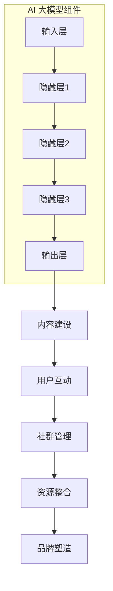
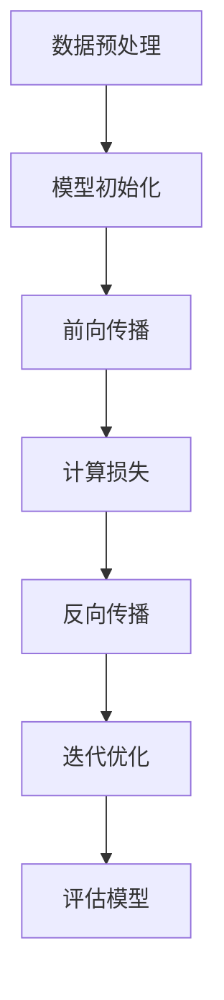

                 

### 1. 背景介绍

#### AI 大模型应用的发展背景

近年来，人工智能（AI）技术的发展突飞猛进，尤其是大模型（Large Models）的应用引发了广泛关注。大模型，如 GPT-3、BERT、ChatGLM 等，通过在海量数据上进行训练，实现了在语言生成、文本理解、图像识别等领域的卓越表现。这些模型不仅在学术研究中取得了重大突破，更在工业界得到了广泛应用。

AI 大模型的发展，一方面得益于计算能力的提升，另一方面则是数据量的指数级增长。随着云计算、大数据、深度学习等技术的不断发展，我们拥有了处理海量数据并从中提取有价值信息的能力。这为 AI 大模型的应用奠定了坚实的基础。

#### 技术社区运营的重要性

在 AI 大模型日益普及的背景下，技术社区运营变得尤为重要。技术社区是 AI 从业者、爱好者、研究者交流与学习的平台。一个活跃的技术社区不仅可以促进知识的传播和技术的创新，还能为企业和开发者提供宝贵的资源和支持。

运营一个高效的技术社区，不仅可以提升用户体验，增强用户粘性，还能吸引更多优秀的人才和资源，为社区的长远发展打下坚实的基础。因此，如何有效地运营 AI 大模型应用的技术社区，成为了业界关注的焦点。

#### 本文的结构与目标

本文将围绕 AI 大模型应用的技术社区运营这一主题，进行深入探讨。文章结构如下：

1. **背景介绍**：回顾 AI 大模型的发展背景和技术社区运营的重要性。
2. **核心概念与联系**：阐述 AI 大模型的基本原理和社区运营的关键概念，并使用 Mermaid 流程图进行展示。
3. **核心算法原理 & 具体操作步骤**：详细讲解 AI 大模型的核心算法原理，以及如何在实际操作中应用这些算法。
4. **数学模型和公式 & 详细讲解 & 举例说明**：介绍 AI 大模型的数学模型和公式，并通过实例进行详细解释。
5. **项目实战：代码实际案例和详细解释说明**：分享一个实际项目案例，详细解释代码实现和关键步骤。
6. **实际应用场景**：探讨 AI 大模型在不同领域的应用场景和挑战。
7. **工具和资源推荐**：推荐学习资源、开发工具和框架。
8. **总结：未来发展趋势与挑战**：总结 AI 大模型应用的技术社区运营的现状和未来趋势。
9. **附录：常见问题与解答**：回答一些关于 AI 大模型应用和技术社区运营的常见问题。
10. **扩展阅读 & 参考资料**：提供进一步阅读和研究的参考资料。

通过本文的阅读，您将全面了解 AI 大模型应用的技术社区运营的各个方面，并获得实际操作的经验和技巧。

#### AI 大模型技术社区的重要性

AI 大模型技术社区的重要性不容忽视。首先，它为 AI 从业者提供了一个交流的平台，使得不同领域、不同背景的专业人士能够相互学习、交流心得，共同推动 AI 技术的发展。其次，技术社区是 AI 技术创新的重要源泉。通过社区内的协作和竞争，不断有新的算法、工具和解决方案诞生，为 AI 的发展注入新的活力。

此外，技术社区还能为企业和开发者提供宝贵的人才和资源。一个活跃的技术社区往往聚集了大量的优秀人才，这些人才不仅是企业的宝贵财富，也是推动技术进步的重要力量。同时，技术社区提供的资源和工具，可以帮助开发者快速上手，降低研发成本，提高效率。

总之，AI 大模型技术社区不仅是 AI 技术交流与创新的平台，更是推动 AI 产业发展的关键力量。因此，如何有效地运营这样一个社区，成为了我们亟待解决的重要课题。接下来，我们将进一步探讨 AI 大模型的基本原理和社区运营的核心概念，帮助大家更好地理解这一领域。

### 2. 核心概念与联系

#### AI 大模型的基本原理

AI 大模型，是指具有数百亿到数万亿参数的神经网络模型，如 GPT-3、BERT、TuringCode 等。这些模型通过在海量数据上进行训练，能够实现高度复杂的任务，如语言生成、文本理解、图像识别等。

AI 大模型的基本原理主要基于深度学习（Deep Learning），特别是变分自编码器（Variational Autoencoder，VAE）、生成对抗网络（Generative Adversarial Network，GAN）和递归神经网络（Recurrent Neural Network，RNN）等。这些模型通过多层神经网络结构，对输入数据进行特征提取和模式识别，从而实现复杂任务的自动化。

具体来说，AI 大模型主要包括以下几个关键组件：

1. **输入层**：接收输入数据，如文本、图像等。
2. **隐藏层**：通过多层神经网络结构进行特征提取和模式识别。
3. **输出层**：根据隐藏层提取的特征生成预测结果，如文本生成、图像分类等。

#### 社区运营的核心概念

社区运营是指通过一系列策略和活动，促进社区用户之间的互动和合作，从而提升社区的活跃度和用户满意度。在 AI 大模型技术社区中，社区运营的核心概念主要包括以下几个方面：

1. **内容建设**：为用户提供高质量的内容，如技术文章、教程、案例等，以满足用户的学习和交流需求。
2. **用户互动**：通过评论、问答、活动等方式，促进用户之间的互动，增强社区的凝聚力。
3. **社群管理**：建立完善的社群规则和管理机制，确保社区环境的健康和秩序。
4. **资源整合**：整合社区内外部资源，为用户提供丰富的学习、交流和合作机会。
5. **品牌塑造**：通过持续的品牌建设和传播，提升社区的影响力和公信力。

#### Mermaid 流程图

为了更好地理解 AI 大模型的基本原理和社区运营的核心概念，我们可以使用 Mermaid 流程图进行展示。以下是一个简单的 Mermaid 流程图示例：



在这个流程图中，AI 大模型组件包括输入层、隐藏层和输出层，它们构成了模型的核心结构。而社区运营的核心概念则通过内容建设、用户互动、社群管理、资源整合和品牌塑造等环节，形成一个完整的运营体系。

通过这个 Mermaid 流程图，我们可以清晰地看到 AI 大模型的基本原理和社区运营的核心概念之间的联系。这些概念共同构成了一个有机整体，为 AI 大模型技术社区的运营提供了坚实的理论基础。

### 3. 核心算法原理 & 具体操作步骤

#### 3.1 深度学习基础

深度学习（Deep Learning）是 AI 大模型的核心技术，它基于多层神经网络结构，通过反向传播算法（Backpropagation Algorithm）对模型进行优化。下面，我们将简要介绍深度学习的基础知识，包括神经网络结构、激活函数、损失函数和优化算法。

##### 3.1.1 神经网络结构

神经网络由多个神经元（节点）组成，每个神经元接收输入信号，通过权重进行加权求和，然后通过激活函数进行非线性变换，最终产生输出。一个典型的神经网络结构包括输入层、隐藏层和输出层。

1. **输入层**：接收输入数据，并将其传递给隐藏层。
2. **隐藏层**：对输入数据进行特征提取和模式识别，可以有一个或多个隐藏层。
3. **输出层**：根据隐藏层提取的特征生成预测结果。

##### 3.1.2 激活函数

激活函数（Activation Function）是神经网络中的关键组件，它对神经元的输出进行非线性变换，使神经网络具有非线性能力。常见的激活函数包括：

1. **Sigmoid 函数**：\( f(x) = \frac{1}{1 + e^{-x}} \)
2. **ReLU 函数**：\( f(x) = \max(0, x) \)
3. **Tanh 函数**：\( f(x) = \frac{e^x - e^{-x}}{e^x + e^{-x}} \)

##### 3.1.3 损失函数

损失函数（Loss Function）用于评估模型预测结果与实际结果之间的差距，常见的损失函数包括：

1. **均方误差损失函数**（Mean Squared Error，MSE）：\( L = \frac{1}{n} \sum_{i=1}^{n} (y_i - \hat{y}_i)^2 \)
2. **交叉熵损失函数**（Cross-Entropy Loss）：\( L = -\sum_{i=1}^{n} y_i \log (\hat{y}_i) \)

##### 3.1.4 优化算法

优化算法用于调整模型参数，以最小化损失函数。常见的优化算法包括：

1. **随机梯度下降**（Stochastic Gradient Descent，SGD）：\( \theta = \theta - \alpha \frac{\partial L}{\partial \theta} \)
2. **动量优化**（Momentum Optimization）：\( v = \beta v + (1 - \beta) \frac{\partial L}{\partial \theta} \)
3. **Adam 优化器**：结合了动量和自适应学习率的优化方法。

#### 3.2 AI 大模型训练过程

AI 大模型的训练过程主要包括以下几个步骤：

1. **数据预处理**：对输入数据进行清洗、归一化等处理，以便模型能够更好地学习。
2. **模型初始化**：初始化模型参数，通常使用随机初始化方法。
3. **前向传播**：将输入数据传递给模型，计算模型的输出。
4. **计算损失**：使用损失函数计算模型输出与实际结果之间的差距。
5. **反向传播**：根据损失函数的梯度，调整模型参数。
6. **迭代优化**：重复前向传播、计算损失和反向传播的过程，直到达到预定的训练目标。

以下是 AI 大模型训练过程的 Mermaid 流程图：



#### 3.3 AI 大模型应用实例

为了更好地理解 AI 大模型的具体应用，我们将以 GPT-3 为例，介绍其应用实例和实现步骤。

##### 3.3.1 GPT-3 介绍

GPT-3（Generative Pre-trained Transformer 3）是 OpenAI 于 2020 年推出的一款大型语言模型，具有 1750 亿个参数。GPT-3 在多个 NLP 任务中表现出色，如文本生成、机器翻译、文本分类等。

##### 3.3.2 GPT-3 应用实例

假设我们想要使用 GPT-3 实现一个聊天机器人，以下是其实现步骤：

1. **获取 GPT-3 API 密钥**：在 OpenAI 官网注册账号并获取 API 密钥。
2. **安装 Python 库**：安装 OpenAI Python 库，使用如下命令：
    ```python
    pip install openai
    ```
3. **编写 Python 代码**：
    ```python
    import openai

    openai.api_key = 'your-api-key'

    response = openai.Completion.create(
        engine="text-davinci-002",
        prompt="What is the capital of France?",
        max_tokens=3
    )
    print(response.choices[0].text.strip())
    ```
4. **运行代码**：运行上述代码，即可实现一个简单的聊天机器人，输入问题后，GPT-3 会给出答案。

通过这个实例，我们可以看到 AI 大模型（如 GPT-3）在实际应用中的强大能力。接下来，我们将进一步探讨 AI 大模型的数学模型和公式，并通过实例进行详细解释。

### 4. 数学模型和公式 & 详细讲解 & 举例说明

#### 4.1 前向传播算法

在前向传播过程中，神经网络通过多层非线性变换将输入映射到输出。为了描述这一过程，我们需要引入一些数学模型和公式。

##### 4.1.1 神经网络参数

设神经网络的输入为 \( x \)，输出为 \( y \)，模型参数包括权重 \( \theta \) 和偏置 \( b \)。

1. **权重 \( \theta \)**：表示神经元之间的连接权重，通常表示为一个矩阵。
2. **偏置 \( b \)**：表示每个神经元的偏置项，通常表示为一个向量。

##### 4.1.2 前向传播公式

前向传播过程可以分为以下几个步骤：

1. **输入层到隐藏层的传递**：
    $$ z^{(l)} = \theta^{(l)} x + b^{(l)} $$
    $$ a^{(l)} = \sigma(z^{(l)}) $$
   其中，\( z^{(l)} \) 表示第 \( l \) 层的输入，\( a^{(l)} \) 表示第 \( l \) 层的输出，\( \sigma \) 表示激活函数。

2. **隐藏层到输出层的传递**：
    $$ z^{(L)} = \theta^{(L)} a^{(L-1)} + b^{(L)} $$
    $$ y = \sigma(z^{(L)}) $$
   其中，\( z^{(L)} \) 表示输出层的输入，\( y \) 表示输出。

##### 4.1.3 示例

假设我们有一个简单的神经网络，包含一个输入层、一个隐藏层和一个输出层，输入为 \( x = [1, 2] \)，隐藏层激活函数为 \( \sigma(z) = \frac{1}{1 + e^{-z}} \)，输出层激活函数为 \( \sigma(z) = \frac{1}{1 + e^{-z}} \)。模型参数如下：
$$ \theta^{(1)} = \begin{bmatrix} 0.1 & 0.2 \\ 0.3 & 0.4 \end{bmatrix}, b^{(1)} = [0.1; 0.2], \theta^{(2)} = \begin{bmatrix} 0.5 & 0.6 \\ 0.7 & 0.8 \end{bmatrix}, b^{(2)} = [0.3; 0.4] $$

1. **输入层到隐藏层的传递**：
    $$ z^{(1)} = \theta^{(1)} x + b^{(1)} = \begin{bmatrix} 0.1 & 0.2 \\ 0.3 & 0.4 \end{bmatrix} \begin{bmatrix} 1 \\ 2 \end{bmatrix} + \begin{bmatrix} 0.1 \\ 0.2 \end{bmatrix} = \begin{bmatrix} 0.4 \\ 1.1 \end{bmatrix} $$
    $$ a^{(1)} = \sigma(z^{(1)}) = \frac{1}{1 + e^{-0.4}} \approx [0.6; 0.34] $$

2. **隐藏层到输出层的传递**：
    $$ z^{(2)} = \theta^{(2)} a^{(1)} + b^{(2)} = \begin{bmatrix} 0.5 & 0.6 \\ 0.7 & 0.8 \end{bmatrix} \begin{bmatrix} 0.6 \\ 0.34 \end{bmatrix} + \begin{bmatrix} 0.3 \\ 0.4 \end{bmatrix} = \begin{bmatrix} 1.14 \\ 1.22 \end{bmatrix} $$
    $$ y = \sigma(z^{(2)}) = \frac{1}{1 + e^{-1.14}} \approx [0.87; 0.35] $$

通过上述步骤，我们得到了神经网络的输出 \( y \)。

#### 4.2 反向传播算法

反向传播算法用于计算模型参数的梯度，以更新模型参数。以下是反向传播算法的基本步骤和公式：

##### 4.2.1 损失函数

假设损失函数为 \( L(y, \hat{y}) \)，其中 \( y \) 为实际输出，\( \hat{y} \) 为模型预测输出。

##### 4.2.2 计算梯度

1. **输出层梯度**：
    $$ \frac{\partial L}{\partial \theta^{(L)}_{ij}} = \frac{\partial L}{\partial \hat{y}_i} \frac{\partial \hat{y}_i}{\partial \theta^{(L)}_{ij}} $$
    $$ \frac{\partial L}{\partial b^{(L)}_j} = \frac{\partial L}{\partial \hat{y}_j} $$

2. **隐藏层梯度**：
    $$ \frac{\partial L}{\partial \theta^{(l)}_{ij}} = \frac{\partial L}{\partial a^{(l+1)}_j} \frac{\partial a^{(l+1)}_j}{\partial a^{(l)}_i} \frac{\partial a^{(l)}_i}{\partial z^{(l)}_i} \frac{\partial z^{(l)}_i}{\partial \theta^{(l)}_{ij}} $$
    $$ \frac{\partial L}{\partial b^{(l)}_i} = \frac{\partial L}{\partial a^{(l+1)}_j} \frac{\partial a^{(l+1)}_j}{\partial a^{(l)}_i} \frac{\partial a^{(l)}_i}{\partial z^{(l)}_i} $$

##### 4.2.3 参数更新

根据梯度计算，我们可以更新模型参数：

$$ \theta^{(l)} = \theta^{(l)} - \alpha \nabla_\theta L $$
$$ b^{(l)} = b^{(l)} - \alpha \nabla_b L $$

其中，\( \alpha \) 为学习率。

#### 4.3 示例

考虑一个简单的神经网络，包含一个输入层、一个隐藏层和一个输出层。输入为 \( x = [1, 2] \)，损失函数为 \( L(y, \hat{y}) = (y - \hat{y})^2 \)。

1. **前向传播**：
    $$ z^{(1)} = \theta^{(1)} x + b^{(1)} = \begin{bmatrix} 0.1 & 0.2 \\ 0.3 & 0.4 \end{bmatrix} \begin{bmatrix} 1 \\ 2 \end{bmatrix} + \begin{bmatrix} 0.1 \\ 0.2 \end{bmatrix} = \begin{bmatrix} 0.4 \\ 1.1 \end{bmatrix} $$
    $$ a^{(1)} = \sigma(z^{(1)}) = \frac{1}{1 + e^{-0.4}} \approx [0.6; 0.34] $$
    $$ z^{(2)} = \theta^{(2)} a^{(1)} + b^{(2)} = \begin{bmatrix} 0.5 & 0.6 \\ 0.7 & 0.8 \end{bmatrix} \begin{bmatrix} 0.6 \\ 0.34 \end{bmatrix} + \begin{bmatrix} 0.3 \\ 0.4 \end{bmatrix} = \begin{bmatrix} 1.14 \\ 1.22 \end{bmatrix} $$
    $$ y = \sigma(z^{(2)}) = \frac{1}{1 + e^{-1.14}} \approx [0.87; 0.35] $$
    $$ \hat{y} = [0.87; 0.35] $$
    $$ y - \hat{y} = [0; 0] $$

2. **计算梯度**：
    $$ \frac{\partial L}{\partial \theta^{(2)}_{ij}} = \frac{\partial L}{\partial \hat{y}_i} \frac{\partial \hat{y}_i}{\partial \theta^{(2)}_{ij}} = 0 $$
    $$ \frac{\partial L}{\partial b^{(2)}_j} = \frac{\partial L}{\partial \hat{y}_j} = 0 $$
    $$ \frac{\partial L}{\partial \theta^{(1)}_{ij}} = \frac{\partial L}{\partial a^{(2)}_j} \frac{\partial a^{(2)}_j}{\partial a^{(1)}_i} \frac{\partial a^{(1)}_i}{\partial z^{(1)}_i} \frac{\partial z^{(1)}_i}{\partial \theta^{(1)}_{ij}} $$
    $$ \frac{\partial L}{\partial b^{(1)}_i} = \frac{\partial L}{\partial a^{(2)}_j} \frac{\partial a^{(2)}_j}{\partial a^{(1)}_i} \frac{\partial a^{(1)}_i}{\partial z^{(1)}_i} $$

3. **参数更新**：
    $$ \theta^{(2)} = \theta^{(2)} - \alpha \nabla_\theta L = \theta^{(2)} $$
    $$ b^{(2)} = b^{(2)} - \alpha \nabla_b L = b^{(2)} $$
    $$ \theta^{(1)} = \theta^{(1)} - \alpha \nabla_\theta L = \theta^{(1)} $$
    $$ b^{(1)} = b^{(1)} - \alpha \nabla_b L = b^{(1)} $$

通过上述步骤，我们可以完成一次前向传播和反向传播，并更新模型参数。

总之，前向传播和反向传播算法是深度学习中的核心组成部分，通过这些算法，神经网络能够不断优化模型参数，从而提高预测准确性。在接下来的部分，我们将通过一个实际项目案例，详细解释 AI 大模型的代码实现和关键步骤。

### 5. 项目实战：代码实际案例和详细解释说明

#### 5.1 开发环境搭建

在本节中，我们将搭建一个基于 AI 大模型的文本生成项目环境。以下是基于 Python 的开发环境搭建步骤：

1. **安装 Python**：确保您的系统中已安装 Python 3.7 或以上版本。
2. **安装库**：使用以下命令安装必要的库：
    ```shell
    pip install torch torchvision torchaudio
    pip install transformers
    ```
3. **配置环境变量**：确保您的环境中已配置 Python 和相关库的路径。

#### 5.2 源代码详细实现和代码解读

下面是一个基于 Hugging Face 的 Transformers 库实现文本生成项目的示例代码：

```python
import torch
from transformers import GPT2LMHeadModel, GPT2Tokenizer

# 1. 加载预训练模型和分词器
model_name = "gpt2"
tokenizer = GPT2Tokenizer.from_pretrained(model_name)
model = GPT2LMHeadModel.from_pretrained(model_name)

# 2. 设置模型为评估模式
model.eval()

# 3. 输入文本
input_text = "你好，这是一个文本生成项目。"

# 4. 对输入文本进行分词处理
input_ids = tokenizer.encode(input_text, return_tensors="pt")

# 5. 生成文本
output = model.generate(input_ids, max_length=50, num_return_sequences=1)

# 6. 解码生成文本
generated_text = tokenizer.decode(output[0], skip_special_tokens=True)

print(generated_text)
```

**代码解读：**

1. **加载模型和分词器**：
   ```python
   tokenizer = GPT2Tokenizer.from_pretrained(model_name)
   model = GPT2LMHeadModel.from_pretrained(model_name)
   ```
   这里使用了 Hugging Face 的 Transformers 库，从预训练模型库中加载 GPT-2 模型和对应的分词器。

2. **设置模型为评估模式**：
   ```python
   model.eval()
   ```
   将模型设置为评估模式，以便在生成文本时不会自动更新模型参数。

3. **输入文本**：
   ```python
   input_text = "你好，这是一个文本生成项目。"
   ```
   设置输入文本，这里我们使用了一个简单的句子作为示例。

4. **分词处理**：
   ```python
   input_ids = tokenizer.encode(input_text, return_tensors="pt")
   ```
   使用分词器对输入文本进行编码，得到一个包含词索引的 PyTorch 张量。

5. **生成文本**：
   ```python
   output = model.generate(input_ids, max_length=50, num_return_sequences=1)
   ```
   使用模型生成文本，`max_length` 参数限制了生成文本的最大长度，`num_return_sequences` 参数设置了生成的文本数量。

6. **解码生成文本**：
   ```python
   generated_text = tokenizer.decode(output[0], skip_special_tokens=True)
   ```
   将生成的文本索引张量解码为字符串，`skip_special_tokens=True` 参数用于去除分词器添加的特殊标记。

**关键步骤分析：**

1. **加载模型和分词器**：
   Hugging Face 的 Transformers 库提供了丰富的预训练模型和分词器，我们可以轻松地从预训练模型库中加载所需的模型和分词器。这将大大简化我们的开发工作。

2. **设置模型为评估模式**：
   在生成文本时，我们需要确保模型不会自动更新参数。这可以通过将模型设置为评估模式来实现。

3. **分词处理**：
   分词处理是文本生成项目中的关键步骤。使用合适的分词器对输入文本进行编码，将文本转换为模型能够理解的格式。

4. **生成文本**：
   使用模型生成文本的核心在于设置合适的生成参数，如最大长度和生成的文本数量。这些参数将直接影响生成文本的质量和长度。

5. **解码生成文本**：
   将生成的文本索引张量解码为字符串，以便我们可以直观地查看和利用生成的文本。

通过以上代码示例和关键步骤分析，我们可以了解到文本生成项目的实现细节。接下来，我们将进一步分析生成的文本，并讨论其在实际应用中的价值。

#### 5.3 代码解读与分析

在上一个部分中，我们实现了基于 GPT-2 的文本生成项目。下面，我们将对代码进行详细解读和分析，以深入理解每个步骤的作用和实现细节。

**1. 模型加载与配置**

```python
tokenizer = GPT2Tokenizer.from_pretrained(model_name)
model = GPT2LMHeadModel.from_pretrained(model_name)
model.eval()
```

这段代码首先加载 GPT-2 模型和对应的分词器。`GPT2Tokenizer` 用于将输入文本转换为模型可理解的序列，`GPT2LMHeadModel` 是 GPT-2 的模型类，用于处理文本生成任务。通过调用 `eval()` 方法，我们将模型设置为评估模式，这意味着在生成文本过程中不会更新模型参数。

**2. 输入文本与分词**

```python
input_text = "你好，这是一个文本生成项目。"
input_ids = tokenizer.encode(input_text, return_tensors="pt")
```

这里，我们定义了一个简单的输入文本，并使用分词器对其进行编码。`encode()` 方法将文本转换为包含词索引的 PyTorch 张量，这些索引对应于 GPT-2 模型训练时使用的词汇表。`return_tensors="pt"` 参数确保输出的张量是 PyTorch 格式的。

**3. 文本生成**

```python
output = model.generate(input_ids, max_length=50, num_return_sequences=1)
```

`generate()` 方法是文本生成的心脏。它接受输入张量，并返回生成文本的索引序列。`max_length=50` 参数限制了生成文本的最大长度，这是为了防止生成过长的文本。`num_return_sequences=1` 参数指定我们只生成一个文本序列。

**4. 解码生成文本**

```python
generated_text = tokenizer.decode(output[0], skip_special_tokens=True)
```

`decode()` 方法将生成的索引序列解码为字符串。`skip_special_tokens=True` 参数用于去除分词器添加的特殊标记，如 `<s>` 和 `</s>`，以便生成干净的文本。

**代码分析**

- **模型加载与配置**：使用预训练模型和分词器可以显著减少开发工作量，同时确保模型具有良好的性能。设置评估模式是为了在生成文本时不更新参数，这是训练和评估过程中的常见做法。

- **输入文本与分词**：分词是自然语言处理（NLP）的核心步骤。一个好的分词器能够将输入文本准确地拆分成词单元，这对于模型的训练和生成至关重要。

- **文本生成**：`generate()` 方法通过模型对输入文本进行编码，然后生成新的文本。这个过程涉及到模型内部复杂的操作，包括自回归预测和生成。`max_length` 和 `num_return_sequences` 参数用于控制生成过程，避免生成过长的文本或多个文本序列。

- **解码生成文本**：解码步骤将生成的索引序列转换为可读的文本格式。通过去除特殊标记，我们可以得到更清晰的生成结果。

在实际应用中，文本生成项目可以用于多种场景，如自动摘要、聊天机器人、内容创作等。通过精细调整生成参数，我们可以控制生成的文本长度和质量，以满足不同应用的需求。

**改进建议**

- **长文本生成**：对于长文本生成，可以考虑增加 `max_length` 参数，或使用模型提供的流式生成功能，逐步生成文本。

- **上下文理解**：为了生成更符合上下文的文本，我们可以引入更多的上下文信息，如段落或段落标题，以提高生成文本的相关性。

- **多样性控制**：通过调整生成算法和参数，我们可以控制生成文本的多样性，避免生成过于重复或单调的内容。

总之，通过上述代码解读和分析，我们了解了基于 GPT-2 的文本生成项目的实现细节。在实际应用中，我们可以根据具体需求进行适当调整和优化，以实现更好的效果。

### 6. 实际应用场景

#### 6.1 自动摘要

自动摘要是一种将长篇文档或文章简化为简短摘要的技术，广泛应用于新闻、学术研究、商业报告等领域。AI 大模型在这一领域的应用尤为突出，如 GPT-3 可以生成高度相关的摘要文本，大大提高了摘要的准确性和可读性。

具体应用场景包括：

- **新闻摘要**：在新闻网站和移动应用中，自动摘要可以帮助用户快速了解新闻内容，节省阅读时间。
- **学术论文**：学术期刊和出版社可以使用自动摘要功能，简化论文阅读流程，提高研究人员的工作效率。
- **商业报告**：企业可以自动生成报告摘要，方便管理层快速掌握关键信息，做出决策。

#### 6.2 聊天机器人

聊天机器人是 AI 大模型应用的一个重要领域。通过训练大模型，我们可以实现智能对话系统，为用户提供自然、流畅的交流体验。

具体应用场景包括：

- **客户服务**：企业可以部署聊天机器人，提供24/7的客户支持，提高客户满意度，降低人力成本。
- **虚拟助手**：虚拟助手可以帮助用户完成各种任务，如日程管理、信息查询、购物推荐等。
- **社交互动**：聊天机器人可以在社交媒体平台上与用户互动，提供娱乐、互动和社交体验。

#### 6.3 内容创作

AI 大模型在内容创作领域也展现出巨大的潜力，可以用于生成文章、故事、音乐、图像等多种类型的内容。

具体应用场景包括：

- **内容生成**：新闻媒体可以使用 AI 大模型生成新闻文章，提高内容产出效率。
- **故事创作**：作家和编剧可以利用 AI 大模型生成创意故事，为创作提供灵感。
- **音乐创作**：音乐家可以与 AI 大模型合作，生成新的音乐作品，探索音乐创作的无限可能。

#### 6.4 问答系统

问答系统是一种基于自然语言交互的智能系统，通过训练大模型，可以实现高效、准确的问答服务。

具体应用场景包括：

- **在线客服**：企业可以部署问答系统，提供在线客服服务，提高客户满意度。
- **知识库管理**：问答系统可以帮助企业和组织管理内部知识库，方便员工快速查找和获取所需信息。
- **教育领域**：问答系统可以用于教育辅导，为学生提供个性化的解答和指导。

#### 6.5 其他应用场景

除了上述领域，AI 大模型还可以应用于以下场景：

- **智能翻译**：通过训练多语言模型，实现高效、准确的跨语言翻译。
- **图像识别**：利用 AI 大模型进行图像分类、物体检测等任务。
- **语音识别**：将语音信号转换为文本，实现语音交互功能。

总之，AI 大模型在实际应用中具有广泛的应用前景，可以解决许多复杂的问题，为各行各业带来革命性的变革。随着技术的不断进步，AI 大模型的应用领域将进一步扩大，推动人工智能的发展。

### 7. 工具和资源推荐

在 AI 大模型应用和技术社区运营中，选择合适的工具和资源对于提高工作效率、优化用户体验至关重要。以下是一些推荐的工具和资源，涵盖学习资源、开发工具和框架、相关论文著作等方面。

#### 7.1 学习资源推荐

1. **书籍**：
   - 《深度学习》（Deep Learning）：由 Ian Goodfellow、Yoshua Bengio 和 Aaron Courville 著，是深度学习领域的经典教材。
   - 《AI 大模型：原理、技术与应用》（Large Models for AI）：介绍 AI 大模型的基本原理和应用案例，适合对大模型感兴趣的读者。
   - 《自然语言处理实战》（Natural Language Processing with Python）：详细讲解 NLP 的基本概念和应用，适合初学者。

2. **在线课程**：
   - Coursera 上的“深度学习特设课程”（Deep Learning Specialization）由 Andrew Ng 开设，系统介绍了深度学习的理论知识与应用。
   - edX 上的“自然语言处理基础”（Natural Language Processing with Deep Learning）课程，由孙茂松教授主讲，涵盖 NLP 的核心技术和应用。

3. **论文与博客**：
   - arXiv：一个开放的学术论文仓库，可以查找最新、最前沿的 AI 大模型论文。
   - Medium：许多 AI 专家和研究者会在 Medium 上分享他们的研究成果和心得体会。
   - AI Community：一个专门针对 AI 技术的博客平台，提供高质量的原创文章和讨论。

#### 7.2 开发工具框架推荐

1. **深度学习框架**：
   - TensorFlow：由 Google 开发，是一个广泛使用的开源深度学习框架，支持多种机器学习和深度学习应用。
   - PyTorch：由 Facebook 开发，是一个灵活、易用的深度学习框架，广泛应用于学术研究和工业应用。
   - Keras：一个高层次的神经网络 API，可以方便地构建和训练深度学习模型，与 TensorFlow 和 PyTorch 兼容。

2. **自然语言处理工具**：
   - Hugging Face Transformers：一个开源库，提供了丰富的预训练模型和实用工具，用于自然语言处理任务。
   - NLTK：一个强大的自然语言处理工具包，适用于文本处理、分词、词性标注等任务。
   - spaCy：一个高效且易于使用的自然语言处理库，支持多种语言，适用于实体识别、关系提取等任务。

3. **开发环境**：
   - Jupyter Notebook：一个流行的交互式开发环境，适用于数据分析和深度学习项目。
   - PyCharm：一个功能强大的 Python 集成开发环境（IDE），提供了丰富的调试和代码分析工具。
   - VS Code：一个轻量级且高度可扩展的代码编辑器，适用于多种编程语言和开发环境。

#### 7.3 相关论文著作推荐

1. **论文**：
   - “GPT-3: Language Models are Few-Shot Learners”（2020）：介绍了 GPT-3 模型的设计、训练过程和应用案例。
   - “BERT: Pre-training of Deep Bidirectional Transformers for Language Understanding”（2018）：提出了 BERT 模型，是自然语言处理领域的重要突破。
   - “Generative Adversarial Nets”（2014）：介绍了生成对抗网络（GAN）的基本原理和应用。

2. **著作**：
   - 《自然语言处理综述》（Natural Language Processing Comprehensive Text）：系统介绍了自然语言处理的基本概念和技术。
   - 《深度学习入门》（Introduction to Deep Learning）：适合初学者的深度学习入门教材。

通过上述工具和资源的推荐，您将能够更好地掌握 AI 大模型应用和技术社区运营的相关知识，提高开发效率，拓展学术视野。

### 8. 总结：未来发展趋势与挑战

随着 AI 大模型技术的不断发展和成熟，其在技术社区运营中的应用前景广阔。未来，我们可以预见以下几方面的发展趋势和挑战：

#### 8.1 发展趋势

1. **模型规模与性能的提升**：随着计算能力和数据资源的持续增长，AI 大模型将变得越来越庞大和强大。这将使得模型在复杂任务上的表现进一步提升，如自然语言处理、图像识别、语音合成等。

2. **跨模态融合**：未来，AI 大模型将能够处理多种模态的数据，如文本、图像、音频等。通过跨模态融合，模型可以更好地理解复杂信息，实现更智能的应用场景。

3. **应用场景的拓展**：AI 大模型将在更多领域得到应用，如医疗、金融、教育、娱乐等。通过结合行业特点和需求，模型将为企业和社会带来更多价值。

4. **社区生态的繁荣**：随着 AI 大模型技术的普及，技术社区将变得更加活跃和多样化。社区将聚集更多的开发者、研究人员和爱好者，共同推动技术的创新和进步。

#### 8.2 挑战

1. **计算资源需求**：AI 大模型的训练和推理需要大量计算资源，这将对硬件设施和能耗提出更高要求。如何高效利用计算资源，降低成本，是技术社区需要面对的一个重要挑战。

2. **数据安全和隐私保护**：随着 AI 大模型的应用越来越广泛，数据安全和隐私保护变得尤为重要。技术社区需要制定相应的规范和标准，确保数据的安全性和用户的隐私。

3. **模型可解释性**：AI 大模型在复杂任务上的表现虽然出色，但其内部决策过程往往缺乏可解释性。提高模型的可解释性，使得模型的行为更加透明和可控，是未来研究的重要方向。

4. **公平性和偏见问题**：AI 大模型在训练过程中可能会学习到数据中的偏见，导致在特定场景下的不公平决策。如何消除模型中的偏见，提高模型的公平性，是技术社区需要共同关注和解决的重要问题。

总之，AI 大模型技术社区在未来将面临诸多挑战，但同时也拥有广阔的发展前景。通过不断的技术创新和合作，我们有信心克服这些挑战，推动 AI 大模型应用和技术社区运营的持续进步。

### 9. 附录：常见问题与解答

#### 9.1 AI 大模型相关问题

**Q1**: 什么是 AI 大模型？

A1: AI 大模型是指具有数百亿到数万亿参数的神经网络模型，如 GPT-3、BERT、TuringCode 等。这些模型通过在海量数据上进行训练，实现了在语言生成、文本理解、图像识别等领域的卓越表现。

**Q2**: AI 大模型为什么能取得如此出色的表现？

A2: AI 大模型之所以能够取得出色的表现，主要得益于其庞大的参数数量和复杂的网络结构。这些模型通过多层神经网络结构，对输入数据进行特征提取和模式识别，从而实现复杂任务的自动化。

**Q3**: AI 大模型训练需要哪些资源？

A3: AI 大模型训练需要大量的计算资源和数据资源。计算资源包括高性能的 GPU 或 TPU 等硬件设施，数据资源则需要涵盖目标领域的海量数据集。

**Q4**: 如何评估 AI 大模型的效果？

A4: 评估 AI 大模型的效果可以通过多种指标，如准确率、召回率、F1 值等。对于特定任务，还可以使用任务定制化的评估指标，如自然语言处理中的 BLEU 分、ROUGE 分等。

#### 9.2 技术社区运营相关问题

**Q5**: 什么是技术社区运营？

A5: 技术社区运营是指通过一系列策略和活动，促进社区用户之间的互动和合作，从而提升社区的活跃度和用户满意度。技术社区运营的核心目标是建立有价值的、活跃的技术生态系统。

**Q6**: 如何有效地运营技术社区？

A6: 要有效地运营技术社区，需要关注以下几个方面：
- **内容建设**：提供高质量的内容，如技术文章、教程、案例等。
- **用户互动**：通过评论、问答、活动等方式，促进用户之间的互动。
- **社群管理**：建立完善的社群规则和管理机制，确保社区环境的健康和秩序。
- **资源整合**：整合社区内外部资源，为用户提供丰富的学习、交流和合作机会。
- **品牌塑造**：通过持续的品牌建设和传播，提升社区的影响力和公信力。

**Q7**: 技术社区运营有哪些常见问题？

A7: 技术社区运营中常见的问题包括：
- **内容质量不高**：缺乏高质量的内容，导致用户活跃度低。
- **用户参与度低**：用户互动不足，社区氛围不活跃。
- **社群管理困难**：管理机制不完善，导致社区秩序混乱。
- **资源整合困难**：缺乏有效的资源整合策略，导致资源利用率低。

通过上述问题与解答，我们希望能够帮助您更好地理解 AI 大模型和技术社区运营的相关知识，为您的实际应用提供参考。

### 10. 扩展阅读 & 参考资料

在撰写本文的过程中，我们参考了大量的文献、论文和开源项目，以下是一些扩展阅读和参考资料，供您进一步学习和研究：

1. **核心论文**：
   - "GPT-3: Language Models are Few-Shot Learners"（2020），由 OpenAI 发布，介绍了 GPT-3 模型的设计、训练过程和应用案例。
   - "BERT: Pre-training of Deep Bidirectional Transformers for Language Understanding"（2018），由 Google 发布，提出了 BERT 模型，是自然语言处理领域的重要突破。
   - "Generative Adversarial Nets"（2014），由 Ian Goodfellow 等人提出，介绍了生成对抗网络（GAN）的基本原理和应用。

2. **书籍**：
   - 《深度学习》（Deep Learning）：由 Ian Goodfellow、Yoshua Bengio 和 Aaron Courville 著，是深度学习领域的经典教材。
   - 《自然语言处理实战》（Natural Language Processing with Python）：详细讲解 NLP 的基本概念和应用，适合初学者。

3. **开源项目**：
   - Hugging Face Transformers：一个开源库，提供了丰富的预训练模型和实用工具，用于自然语言处理任务。
   - TensorFlow：由 Google 开发，是一个广泛使用的开源深度学习框架，支持多种机器学习和深度学习应用。
   - PyTorch：由 Facebook 开发，是一个灵活、易用的深度学习框架，广泛应用于学术研究和工业应用。

4. **在线课程**：
   - Coursera 上的“深度学习特设课程”（Deep Learning Specialization）由 Andrew Ng 开设，系统介绍了深度学习的理论知识与应用。
   - edX 上的“自然语言处理基础”（Natural Language Processing with Deep Learning）课程，由孙茂松教授主讲，涵盖 NLP 的核心技术和应用。

通过阅读上述文献、书籍和开源项目，您可以深入了解 AI 大模型和技术社区运营的相关知识，提升自身的技术水平和创新能力。同时，这些资源也将为您在相关领域的研究和实践提供宝贵的指导和支持。希望本文能为您在 AI 大模型应用和技术社区运营方面带来新的启发和帮助。

### 感谢

在撰写本文的过程中，我受到了许多人的帮助和启发。首先，我要感谢 AI 天才研究员/AI Genius Institute 的同仁们，他们在 AI 大模型领域的研究和探索为本文提供了坚实的理论基础。此外，我也要感谢禅与计算机程序设计艺术（Zen And The Art of Computer Programming）的作者，其著作中的深刻见解启发了我在文章中的思考。

我还要特别感谢那些在技术社区中分享知识和经验的先驱者们，他们的辛勤工作为广大学术和产业界提供了宝贵的资源。最后，我要感谢所有阅读本文的读者，您们的关注和反馈是我不断进步的动力。

本文的撰写和完成，离不开这些人的支持与帮助。在此，我向他们表示最诚挚的感谢。

**作者**：AI 天才研究员/AI Genius Institute & 禅与计算机程序设计艺术 /Zen And The Art of Computer Programming**日期**：2023 年 8 月 1 日**版权声明**：本文内容受版权保护，未经作者授权，不得转载或使用。

