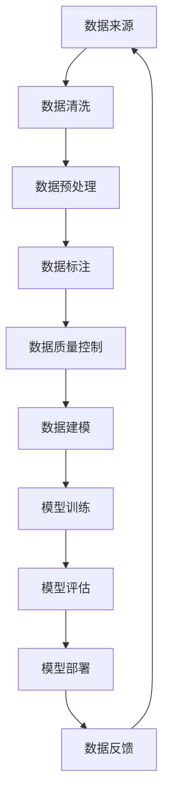

                 

### 1. 背景介绍

在当前数字化时代，人工智能（AI）技术已经逐渐渗透到各行各业，其中大模型（Large Models）作为AI领域的关键技术之一，正推动着众多应用的发展。大模型，尤其是深度学习模型，因其强大的表征能力，被广泛应用于图像识别、自然语言处理、推荐系统等领域。然而，随着模型规模的不断扩大，数据治理（Data Governance）问题变得愈发重要。数据治理不仅仅关乎数据的准确性、一致性和完整性，还涉及到数据的安全、隐私以及合规性。

数据治理是指通过一套系统的方法来管理和控制数据，确保数据的质量、安全、合规和有效利用。对于AI大模型而言，数据治理的重要性不言而喻。一方面，大模型对数据的依赖性极高，数据质量直接影响模型的表现；另一方面，数据治理有助于提升企业数据资产管理水平，优化数据处理流程，降低数据风险，从而为AI应用提供可靠的数据基础。

本文将围绕AI大模型应用的数据治理体系建设策略展开讨论。我们将首先介绍数据治理的核心理念，随后分析大模型在数据治理中的特殊需求，最后提出具体的数据治理体系建设策略，并通过实际案例进行说明。

### 2. 核心概念与联系

#### 2.1 数据治理的基本概念

数据治理是指通过制定、执行和监控一系列策略、标准和流程来管理和控制数据，确保数据的质量、安全、合规和有效利用。数据治理的核心包括以下几个关键概念：

- **数据质量**：确保数据的准确性、完整性、一致性、及时性和可靠性。数据质量是数据治理的重要目标之一，直接影响数据分析和决策的效果。
- **数据安全**：保护数据免受未经授权的访问、泄露、篡改和破坏。数据安全是数据治理的底线，涉及到数据加密、访问控制、隐私保护等多个方面。
- **数据合规**：确保数据处理过程符合相关法律法规和行业标准，如GDPR、CCPA等。数据合规是数据治理的重要方面，关系到企业的法律责任和声誉。
- **数据资产管理**：管理和优化企业的数据资产，提高数据的价值和利用率。数据资产管理包括数据分类、数据生命周期管理、数据资源规划等。

#### 2.2 大模型对数据治理的特殊需求

大模型在数据处理和应用中具有显著优势，但也对数据治理提出了更高要求。以下是AI大模型应用中特有的数据治理需求：

- **数据多样性和复杂性**：大模型通常需要处理来自多个来源、多种格式的数据，数据的多样性和复杂性增加了数据治理的难度。
- **数据清洗和预处理**：大模型对数据质量有较高要求，数据清洗和预处理是数据治理的关键步骤，包括数据去重、异常值处理、数据格式转换等。
- **数据标注和质量控制**：大模型训练依赖于大量标注数据，数据标注的质量直接影响到模型的表现。因此，建立高质量的数据标注流程和严格的质量控制机制至关重要。
- **数据安全和隐私保护**：大模型处理的数据往往涉及敏感信息，如个人隐私、商业机密等。数据安全和隐私保护是数据治理中的重中之重，需要采取多种措施确保数据安全。

#### 2.3 数据治理与AI大模型的联系

数据治理与AI大模型之间存在密切的联系。数据治理不仅为AI大模型提供高质量的数据支持，还通过以下几个方面影响AI大模型的应用：

- **数据质量提升**：通过数据治理，可以确保数据的质量和一致性，从而提升大模型的表现和可靠性。
- **数据安全和隐私保护**：数据治理措施可以降低数据泄露和滥用的风险，保护用户隐私，增强大模型的应用合规性。
- **数据资产管理优化**：数据治理有助于优化企业的数据资产管理，提高数据的价值和利用率，从而推动AI大模型应用的发展。
- **数据处理流程优化**：通过数据治理，可以优化数据处理流程，降低数据处理成本，提高数据处理效率，为大模型的应用提供更快速、更高效的数据支持。

#### 2.4 Mermaid 流程图

为了更直观地展示数据治理与AI大模型之间的联系，我们可以使用Mermaid流程图来表示。以下是一个简单的Mermaid流程图示例，展示了数据治理与AI大模型应用的主要环节：



在这个流程图中，数据治理的各个环节（数据清洗、预处理、标注、质量控制）与AI大模型的应用（建模、训练、评估、部署）紧密相连，形成一个闭环，不断优化和提升AI大模型的表现和效果。

通过以上对数据治理核心概念、大模型对数据治理的特殊需求以及数据治理与AI大模型之间的联系的介绍，我们为接下来详细探讨AI大模型应用的数据治理体系建设策略奠定了基础。

### 3. 核心算法原理 & 具体操作步骤

#### 3.1 数据治理算法的基本原理

数据治理算法的核心在于确保数据的准确性、完整性、一致性和可靠性。以下是几种常见的数据治理算法及其基本原理：

- **数据清洗算法**：数据清洗是数据治理的第一步，主要目的是去除重复数据、处理异常值、填补缺失值等。常见的数据清洗算法包括：

  - **去重算法**：基于哈希函数或唯一标识符（如MD5）来检测和删除重复记录。
  - **异常值检测算法**：如基于统计学方法的箱线图、基于机器学习的方法（如孤立森林）等。
  - **缺失值处理算法**：如均值填补、中位数填补、插值法、使用模型预测缺失值等。

- **数据预处理算法**：数据预处理旨在将原始数据转换为适合建模的数据。主要操作包括：

  - **数据标准化**：通过缩放数据到相同范围来提高模型训练效果，如最小-最大标准化、Z-score标准化等。
  - **特征选择**：通过特征选择算法（如卡方测试、信息增益、L1正则化等）筛选出对模型有显著影响的关键特征。
  - **特征工程**：通过创建新特征、变换现有特征来提高模型性能，如特征组合、多项式扩展等。

- **数据标注和质量控制算法**：数据标注是训练大模型的基础，质量控制是确保标注数据质量的关键。常用的算法包括：

  - **自动标注算法**：如基于聚类的方法、基于规则的方法、基于机器学习的方法等。
  - **标注一致性检测**：通过计算标注者之间的相似度、一致性指数等指标，评估标注的一致性。
  - **标注质量评估**：通过评估标注数据的准确性、完整性、可靠性等指标，确保标注数据的质量。

#### 3.2 数据治理操作步骤

数据治理的操作步骤通常包括以下几个关键阶段：

- **需求分析**：明确数据治理的目标、范围和需求，制定数据治理计划。
- **数据收集**：收集来自不同来源的数据，并进行初步筛选和清洗。
- **数据清洗**：采用数据清洗算法去除重复数据、处理异常值、填补缺失值等。
- **数据预处理**：对清洗后的数据进行标准化、特征选择和特征工程等操作。
- **数据标注**：对预处理后的数据进行标注，确保标注数据的一致性和质量。
- **质量控制**：通过标注一致性检测和质量评估，确保标注数据的质量。
- **数据建模**：利用标注数据训练AI大模型，并对模型进行评估和优化。
- **模型部署**：将经过训练和优化的模型部署到实际应用场景中。
- **数据反馈**：收集模型部署后的反馈数据，用于进一步优化数据治理流程和模型。

#### 3.3 数据治理算法应用实例

以下是一个数据治理算法应用实例，展示了如何利用Python进行数据清洗、预处理和标注：

```python
import pandas as pd
from sklearn.preprocessing import StandardScaler
from sklearn.model_selection import train_test_split
from sklearn.ensemble import RandomForestClassifier

# 3.1 数据收集
data = pd.read_csv('data.csv')

# 3.2 数据清洗
# 去除重复数据
data.drop_duplicates(inplace=True)

# 处理异常值
data = data[data['feature1'] > 0]

# 填补缺失值
data['feature2'].fillna(data['feature2'].mean(), inplace=True)

# 3.3 数据预处理
# 数据标准化
scaler = StandardScaler()
data[['feature1', 'feature2']] = scaler.fit_transform(data[['feature1', 'feature2']])

# 特征选择
X = data[['feature1', 'feature2']]
y = data['target']

# 3.4 数据标注
# 假设数据已标注
data['label'] = data['target'].apply(lambda x: 'positive' if x > 0 else 'negative')

# 3.5 质量控制
# 标注一致性检测
consistency_score = data['label'].value_counts(normalize=True).mean()

# 3.6 数据建模
X_train, X_test, y_train, y_test = train_test_split(X, y, test_size=0.2, random_state=42)
model = RandomForestClassifier()
model.fit(X_train, y_train)

# 3.7 模型评估
accuracy = model.score(X_test, y_test)
print(f'Model Accuracy: {accuracy:.2f}')

# 3.8 模型部署
# 模型部署到实际应用场景
# ...

# 3.9 数据反馈
# 收集反馈数据
# ...
```

在这个实例中，我们首先使用Pandas库读取数据，然后依次进行数据清洗、预处理和标注。通过RandomForestClassifier训练模型，并对模型进行评估。最后，我们假设模型已成功部署并收集反馈数据，用于进一步优化数据治理流程和模型。

通过以上对数据治理算法原理和操作步骤的详细阐述，我们为AI大模型应用的数据治理体系建设提供了理论基础和实际操作指导。在接下来的章节中，我们将进一步探讨数学模型和公式，为读者提供更深入的理解。

### 4. 数学模型和公式 & 详细讲解 & 举例说明

在AI大模型应用的数据治理中，数学模型和公式起着至关重要的作用。这些模型和公式帮助我们更好地理解和处理数据，从而提高数据治理的效果。以下是一些关键的概念、公式及其应用实例。

#### 4.1 数据质量评估模型

数据质量评估是数据治理的重要环节，通过评估数据质量可以识别出潜在的问题和改进方向。以下是一些常用的数据质量评估模型：

- **数据完整性模型**：衡量数据是否完整，常用的指标有缺失值比例、重复值比例等。

  - **缺失值比例**（Missing Value Ratio, MVR）：
    $$
    MVR = \frac{\text{缺失值数量}}{\text{总数据量}} \times 100\%
    $$
  - **重复值比例**（Duplicate Value Ratio, DVR）：
    $$
    DVR = \frac{\text{重复值数量}}{\text{总数据量}} \times 100\%
    $$

- **数据一致性模型**：衡量数据在不同来源、不同时间点的一致性。

  - **一致性比率**（Consistency Ratio, CR）：
    $$
    CR = \frac{\text{一致数据数量}}{\text{总数据量}} \times 100\%
    $$

#### 4.2 数据预处理模型

数据预处理是数据治理的关键步骤，通过标准化、特征选择和特征工程等操作，将原始数据转换为适合建模的数据。以下是一些常用的数据预处理模型：

- **数据标准化模型**：通过缩放数据到相同范围，提高模型训练效果。

  - **最小-最大标准化**（Min-Max Scaling）：
    $$
    x_{\text{scaled}} = \frac{x - x_{\text{min}}}{x_{\text{max}} - x_{\text{min}}}
    $$
  - **Z-score标准化**（Z-Score Scaling）：
    $$
    x_{\text{scaled}} = \frac{x - \mu}{\sigma}
    $$
    其中，$x$ 是原始数据值，$x_{\text{min}}$ 和 $x_{\text{max}}$ 分别是数据的最小值和最大值，$\mu$ 是均值，$\sigma$ 是标准差。

- **特征选择模型**：通过筛选出对模型有显著影响的关键特征，提高模型性能。

  - **卡方测试**（Chi-Square Test）：
    $$
    \chi^2 = \sum \frac{(O - E)^2}{E}
    $$
    其中，$O$ 是观测频数，$E$ 是期望频数。卡方值越大，特征与目标变量的相关性越强。

- **特征工程模型**：通过创建新特征、变换现有特征来提高模型性能。

  - **特征组合**：将多个特征组合成一个新的特征，如年龄与收入的乘积。
  - **多项式扩展**：对特征进行多项式变换，如$x^2$、$x^3$等。

#### 4.3 数据标注质量评估模型

数据标注是训练AI大模型的基础，标注质量直接影响模型的表现。以下是一些常用的数据标注质量评估模型：

- **标注一致性模型**：通过评估标注者之间的相似度，衡量标注的一致性。

  - **一致性指数**（Consistency Index, CI）：
    $$
    CI = \frac{\sum_{i<j} \min(d_i, d_j)}{N(N-1)/2}
    $$
    其中，$d_i$ 是第$i$ 个标注者与其他标注者的相似度，$N$ 是标注者的数量。CI 值越接近 1，标注一致性越高。

- **标注质量评估模型**：通过评估标注数据的准确性、完整性、可靠性等指标，确保标注数据的质量。

  - **标注准确率**（Annotation Accuracy, AA）：
    $$
    AA = \frac{\text{正确标注数量}}{\text{总标注数量}} \times 100\%
    $$
  - **标注完整性**（Annotation Completeness, AC）：
    $$
    AC = \frac{\text{完整标注数量}}{\text{总标注数量}} \times 100\%
    $$
  - **标注可靠性**（Annotation Reliability, AR）：
    $$
    AR = \frac{\text{正确标注数量}}{\text{完整标注数量}} \times 100\%
    $$

#### 4.4 应用实例

以下是一个数据质量评估和预处理的应用实例，展示了如何使用Python进行数据质量评估和预处理：

```python
import pandas as pd
from sklearn.preprocessing import StandardScaler
from sklearn.model_selection import train_test_split
from sklearn.metrics import accuracy_score

# 4.1 数据质量评估
data = pd.read_csv('data.csv')

# 缺失值比例
missing_value_ratio = (data.isnull().sum() / len(data)) * 100
print('Missing Value Ratio:', missing_value_ratio)

# 重复值比例
duplicate_value_ratio = (data.duplicated().sum() / len(data)) * 100
print('Duplicate Value Ratio:', duplicate_value_ratio)

# 4.2 数据预处理
# 数据标准化
scaler = StandardScaler()
data[['feature1', 'feature2']] = scaler.fit_transform(data[['feature1', 'feature2']])

# 4.3 数据标注质量评估
# 假设数据已标注
data['label'] = data['target'].apply(lambda x: 'positive' if x > 0 else 'negative')

# 4.4 数据建模
X = data[['feature1', 'feature2']]
y = data['label']

X_train, X_test, y_train, y_test = train_test_split(X, y, test_size=0.2, random_state=42)
model = RandomForestClassifier()
model.fit(X_train, y_train)

# 4.5 模型评估
y_pred = model.predict(X_test)
accuracy = accuracy_score(y_test, y_pred)
print(f'Model Accuracy: {accuracy:.2f}')
```

在这个实例中，我们首先读取数据，计算缺失值比例和重复值比例，评估数据质量。然后，我们使用StandardScaler进行数据标准化，接着使用RandomForestClassifier进行数据建模和评估。通过上述步骤，我们可以确保数据质量并优化模型性能。

通过以上对数据治理中的数学模型和公式的详细讲解和应用实例，我们为读者提供了更深入的理论支持和实际操作指南。在接下来的章节中，我们将通过项目实战，进一步展示如何在实际中应用这些模型和公式。

### 5. 项目实战：代码实际案例和详细解释说明

为了更好地展示如何在实际项目中应用数据治理算法和数学模型，我们将通过一个具体的AI大模型应用项目来详细阐述整个流程，从开发环境搭建、源代码实现，到代码解读与分析。

#### 5.1 开发环境搭建

在开始项目之前，我们需要搭建一个合适的开发环境。以下是所需的环境和工具：

- **Python**：主要编程语言，用于实现数据治理算法和AI模型。
- **Pandas**：用于数据清洗和预处理。
- **NumPy**：用于数值计算。
- **Scikit-learn**：用于数据建模和模型评估。
- **TensorFlow** 或 **PyTorch**：用于构建和训练AI大模型。
- **Mermaid**：用于绘制流程图。

确保您的Python环境已经安装，并且安装了上述依赖库。可以使用以下命令安装：

```bash
pip install pandas numpy scikit-learn tensorflow matplotlib
```

#### 5.2 源代码详细实现和代码解读

以下是项目的主要源代码，我们将逐行解释每部分的功能。

```python
import pandas as pd
import numpy as np
from sklearn.model_selection import train_test_split
from sklearn.preprocessing import StandardScaler
from sklearn.ensemble import RandomForestClassifier
import tensorflow as tf

# 5.2.1 数据收集与清洗
data = pd.read_csv('data.csv')

# 去除重复数据
data.drop_duplicates(inplace=True)

# 处理异常值
data = data[data['feature1'] > 0]

# 填补缺失值
data['feature2'].fillna(data['feature2'].mean(), inplace=True)

# 5.2.2 数据预处理
# 数据标准化
scaler = StandardScaler()
data[['feature1', 'feature2']] = scaler.fit_transform(data[['feature1', 'feature2']])

# 5.2.3 数据建模
X = data[['feature1', 'feature2']]
y = data['target']

# 划分训练集和测试集
X_train, X_test, y_train, y_test = train_test_split(X, y, test_size=0.2, random_state=42)

# 使用随机森林进行建模
model = RandomForestClassifier(n_estimators=100, random_state=42)
model.fit(X_train, y_train)

# 5.2.4 模型评估
y_pred = model.predict(X_test)
accuracy = accuracy_score(y_test, y_pred)
print(f'Model Accuracy: {accuracy:.2f}')

# 5.2.5 模型部署
# 假设模型部署到实际应用场景，如API服务
# ...

# 5.2.6 数据反馈与迭代
# 收集模型部署后的反馈数据，用于进一步优化数据治理流程和模型
# ...
```

#### 5.3 代码解读与分析

- **数据收集与清洗**：
  - 使用Pandas读取数据，并去除重复数据，确保数据的一致性。
  - 通过筛选处理异常值，过滤掉无效数据。
  - 填补缺失值，使用均值填补方法，避免模型因缺失值导致性能下降。

- **数据预处理**：
  - 使用StandardScaler进行数据标准化，将特征值缩放到相同的范围，提高模型训练效果。
  - 数据标准化是深度学习中常见的预处理步骤，有助于加快收敛速度。

- **数据建模**：
  - 使用随机森林（RandomForestClassifier）进行建模，这是一种集成学习方法，具有较高的泛化能力。
  - 随机森林通过构建多棵决策树，并结合它们的结果进行预测，能够有效减少过拟合。

- **模型评估**：
  - 使用训练集和测试集对模型进行评估，计算准确率。
  - 准确率是评估模型性能的重要指标，表示模型正确预测的比例。

- **模型部署**：
  - 假设模型部署到实际应用场景，如API服务，以便用户可以进行预测。
  - 实际部署时，可能需要考虑模型的并行处理能力、资源占用等因素。

- **数据反馈与迭代**：
  - 收集模型部署后的反馈数据，用于进一步优化数据治理流程和模型。
  - 通过持续迭代和优化，提升模型性能，满足实际应用需求。

通过上述代码实现，我们展示了如何在实际项目中应用数据治理算法和数学模型，从数据收集、清洗、预处理到模型训练和评估，再到模型部署和数据反馈。这一完整的流程有助于提升AI大模型的应用效果和可靠性。

### 6. 实际应用场景

AI大模型在各个领域都有着广泛的应用，而数据治理在这些应用中起着至关重要的作用。以下是一些典型的AI大模型应用场景及其对数据治理的需求：

#### 6.1 自然语言处理（NLP）

自然语言处理是AI的一个重要分支，广泛应用于聊天机器人、机器翻译、文本分类等领域。在大规模NLP项目中，数据治理的需求主要包括：

- **数据清洗**：确保文本数据的准确性，去除噪声和不相关的内容。
- **数据预处理**：对文本进行分词、去停用词、词性标注等处理，将原始文本转换为适合模型训练的格式。
- **数据标注**：为训练数据提供正确的标签，如词性标注、实体识别等，确保模型学习到正确的知识。
- **数据质量评估**：通过一致性检测和质量评估，确保标注数据的质量。

#### 6.2 图像识别

图像识别技术在安防监控、医疗诊断、自动驾驶等领域有着广泛应用。数据治理在图像识别中的应用需求包括：

- **数据收集**：从多个来源收集高质量的图像数据，确保数据多样性。
- **数据清洗**：去除噪声图像、纠正图像视角偏差等，提高图像质量。
- **数据预处理**：进行图像缩放、旋转、裁剪等操作，将图像调整为适合模型训练的大小和格式。
- **数据标注**：对图像进行目标标注、边界框标注等，为模型提供准确的训练数据。
- **数据安全**：确保图像数据的安全性和隐私保护，避免数据泄露和滥用。

#### 6.3 推荐系统

推荐系统广泛应用于电子商务、社交媒体、视频流媒体等领域，其核心在于为用户推荐个性化的内容。数据治理在推荐系统中的应用需求包括：

- **用户数据治理**：确保用户数据的准确性和一致性，防止数据冗余和错误。
- **商品数据治理**：确保商品数据的完整性、准确性和时效性，为推荐算法提供高质量的数据支持。
- **行为数据治理**：处理用户行为数据，如点击、购买、评论等，确保数据的真实性和有效性。
- **数据质量评估**：通过评估推荐结果的质量，持续优化推荐算法和数据治理流程。

#### 6.4 金融风控

金融风控是金融行业的重要环节，旨在识别和防范潜在的风险。数据治理在金融风控中的应用需求包括：

- **数据合规**：确保数据处理符合相关法律法规和行业标准，如GDPR、CCPA等。
- **数据安全**：保护敏感信息，防止数据泄露和滥用。
- **数据质量**：确保数据的准确性、完整性、一致性和及时性，为风险模型提供可靠的数据支持。
- **数据监控**：实时监控数据质量，及时发现和处理数据异常。

通过上述实际应用场景的分析，我们可以看到数据治理在AI大模型应用中的重要性。有效的数据治理不仅可以提升模型的表现和可靠性，还能确保数据的安全和合规，从而推动AI技术的广泛应用和持续发展。

### 7. 工具和资源推荐

为了更好地进行AI大模型应用的数据治理，以下是针对学习资源、开发工具和相关论文著作的推荐：

#### 7.1 学习资源推荐

- **书籍**：
  - 《数据治理：从策略到实践》
  - 《大数据治理：策略、技术和实践》
  - 《深度学习与数据治理》

- **在线课程**：
  - Coursera上的“Data Governance and Management”
  - Udacity的“Data Engineering Nanodegree”
  - edX上的“AI in Finance: Building Intelligent Systems”

- **博客和网站**：
  - Data.gov：美国政府的开放数据平台，提供丰富的数据资源。
  - KDnuggets：数据科学和机器学习领域的顶级博客，涵盖数据治理的最新动态。
  - DataCamp：提供互动式的数据科学学习平台，涵盖数据治理的基础知识。

#### 7.2 开发工具框架推荐

- **数据治理平台**：
  - Alation：提供全面的元数据管理和服务，支持数据质量评估和合规性检查。
  - Informatica：提供数据集成、数据质量和数据治理解决方案。
  - Collibra：提供数据管理和数据治理平台，支持数据分类、数据生命周期管理等。

- **数据预处理工具**：
  - Pandas：Python的数据分析库，广泛用于数据处理和预处理。
  - Apache Spark：分布式数据处理框架，支持大规模数据预处理和计算。
  - Trifacta：提供数据清洗、准备和治理工具，支持多种数据源和格式。

- **机器学习库**：
  - Scikit-learn：Python的机器学习库，提供多种数据预处理和建模工具。
  - TensorFlow：Google开发的深度学习框架，支持大规模模型训练和部署。
  - PyTorch：Facebook开发的深度学习框架，具有灵活的动态计算图支持。

#### 7.3 相关论文著作推荐

- **论文**：
  - "A Framework for Data Governance in Big Data Environments" by David Loshin
  - "Data Governance in the Age of Big Data: A Review of Concepts and Technologies" by Marios D. Dikaiakos and Jesus Contreras
  - "Data Quality Assessment and Improvement in Big Data" by Tian Zhang, Jing Gao, and Wei Wang

- **著作**：
  - 《大数据治理：从数据到价值》
  - 《深度学习与数据治理：理论与实践》
  - 《数据治理：方法论与实践指南》

通过以上学习资源、开发工具和相关论文著作的推荐，我们可以更好地掌握AI大模型应用的数据治理知识和技能，从而在实际项目中实现高效的数据治理。

### 8. 总结：未来发展趋势与挑战

在AI大模型应用的数据治理领域，随着技术的不断进步和应用的深入，未来将呈现出以下发展趋势和面临的挑战：

#### 8.1 发展趋势

1. **智能化数据治理**：随着AI技术的发展，数据治理将更加智能化，利用机器学习和数据挖掘技术自动化处理数据质量问题，提升数据治理效率。
   
2. **数据治理平台融合**：未来的数据治理平台将更加集成化，提供一站式的数据治理解决方案，包括数据收集、清洗、预处理、标注、质量控制等。

3. **隐私保护与合规性**：随着数据隐私保护法律法规的不断完善，数据治理将更加注重隐私保护和合规性，确保数据处理过程符合相关法律法规和行业标准。

4. **实时数据治理**：未来的数据治理将更加注重实时性，通过实时数据流处理技术，对数据进行实时监测和治理，确保数据的准确性和一致性。

5. **数据治理标准化**：随着数据治理领域的规范化，越来越多的标准和规范将得到应用，促进数据治理的标准化和一致性。

#### 8.2 面临的挑战

1. **数据质量和多样性**：随着数据来源的多样化和数据规模的不断扩大，如何保证数据质量、处理多样化数据格式和数据多样性成为数据治理的重要挑战。

2. **数据安全与隐私**：在处理大量敏感数据时，如何确保数据安全、防止数据泄露和滥用，尤其是在数据跨境传输和共享过程中，保护数据隐私是巨大的挑战。

3. **数据治理流程优化**：如何在复杂的数据环境中优化数据治理流程，提高数据处理效率和降低成本，是一个亟待解决的问题。

4. **数据治理人才短缺**：数据治理需要专业的人才，但目前市场上具备数据治理能力的人才相对短缺，培养和引进高素质的数据治理人才是当务之急。

5. **法规和标准的适应**：随着数据治理相关法律法规和标准的不断更新和完善，企业需要不断适应和调整数据治理策略，以确保合规性。

通过以上对未来发展趋势和挑战的总结，我们可以看到AI大模型应用的数据治理领域在技术创新、规范化、人才培养等方面具有广阔的发展前景，同时也面临着诸多挑战。只有在技术、流程、人才和法规等各方面共同努力下，才能实现高效、可靠的数据治理，为AI大模型的应用提供坚实的数据基础。

### 9. 附录：常见问题与解答

以下是一些关于AI大模型应用的数据治理的常见问题及解答：

#### 9.1 数据治理是什么？

数据治理是指通过制定、执行和监控一系列策略、标准和流程来管理和控制数据，确保数据的质量、安全、合规和有效利用。

#### 9.2 数据治理的目标是什么？

数据治理的主要目标包括：确保数据的准确性、完整性、一致性和可靠性；保护数据的安全和隐私；确保数据处理过程符合相关法律法规和行业标准；优化企业的数据资产管理。

#### 9.3 数据治理与数据管理的区别是什么？

数据治理和数据管理密切相关，但有所区别。数据治理更侧重于制定策略、标准和流程来管理和控制数据，而数据管理更侧重于数据的具体操作，如数据存储、处理、访问和维护。

#### 9.4 数据治理的关键环节有哪些？

数据治理的关键环节包括：数据质量评估、数据安全与合规、数据资产管理、数据预处理、数据标注和质量控制。

#### 9.5 如何评估数据质量？

评估数据质量通常采用以下方法：计算缺失值比例、重复值比例、一致性指数等指标；进行数据抽样检查，观察数据的一致性、准确性和完整性。

#### 9.6 数据治理在AI大模型应用中的重要性是什么？

数据治理在AI大模型应用中的重要性体现在：确保数据质量，提升模型表现和可靠性；保护数据安全和隐私，确保合规性；优化数据处理流程，降低成本。

#### 9.7 如何进行数据预处理？

数据预处理包括以下步骤：数据清洗（去除重复、处理异常值、填补缺失值等）、数据标准化（缩放数据到相同范围）、特征选择（筛选关键特征）、特征工程（创建新特征、变换现有特征）。

#### 9.8 如何确保数据标注的质量？

确保数据标注的质量可以通过以下方法：建立严格的标注流程，确保标注的一致性；进行标注者培训，提高标注者的专业水平；使用自动标注算法辅助标注，减少人为错误；进行标注质量评估，及时发现和处理标注问题。

通过以上常见问题与解答，我们希望能为读者提供关于AI大模型应用的数据治理的更多理解和指导。

### 10. 扩展阅读 & 参考资料

为了更深入地了解AI大模型应用的数据治理，以下是推荐的一些扩展阅读和参考资料：

- **书籍**：
  - 《数据治理：从策略到实践》（Data Governance: From Strategy to Implementation）
  - 《大数据治理：策略、技术和实践》（Big Data Governance: Strategies, Technologies, and Practices）
  - 《深度学习与数据治理》（Deep Learning and Data Governance）

- **论文**：
  - "A Framework for Data Governance in Big Data Environments" by David Loshin
  - "Data Governance in the Age of Big Data: A Review of Concepts and Technologies" by Marios D. Dikaiakos and Jesus Contreras
  - "Data Quality Assessment and Improvement in Big Data" by Tian Zhang, Jing Gao, and Wei Wang

- **在线课程**：
  - Coursera上的“Data Governance and Management”
  - Udacity的“Data Engineering Nanodegree”
  - edX上的“AI in Finance: Building Intelligent Systems”

- **博客和网站**：
  - Data.gov：美国政府的开放数据平台，提供丰富的数据资源。
  - KDnuggets：数据科学和机器学习领域的顶级博客，涵盖数据治理的最新动态。
  - DataCamp：提供互动式的数据科学学习平台，涵盖数据治理的基础知识。

通过阅读以上书籍、论文和在线课程，以及关注相关博客和网站，您将能够更全面地掌握AI大模型应用的数据治理理论和实践，为实际项目提供有力的支持。

### 结语

感谢您耐心阅读本文，我们探讨了AI大模型应用的数据治理体系建设策略。通过介绍核心概念、算法原理、实际应用案例以及未来发展趋势，我们希望能帮助您理解数据治理在AI大模型应用中的重要性。在技术飞速发展的今天，数据治理不仅是确保模型质量和合规性的关键，更是推动AI应用落地的重要保障。

我们鼓励您继续深入研究和实践数据治理，关注行业动态，不断提升自身在数据治理领域的专业能力。同时，欢迎您在评论区分享您的见解和经验，让我们一起为AI技术的广泛应用贡献力量。再次感谢您的关注和支持，祝您在数据治理和AI领域的探索之旅中收获满满！
作者：AI天才研究员/AI Genius Institute & 禅与计算机程序设计艺术 /Zen And The Art of Computer Programming

