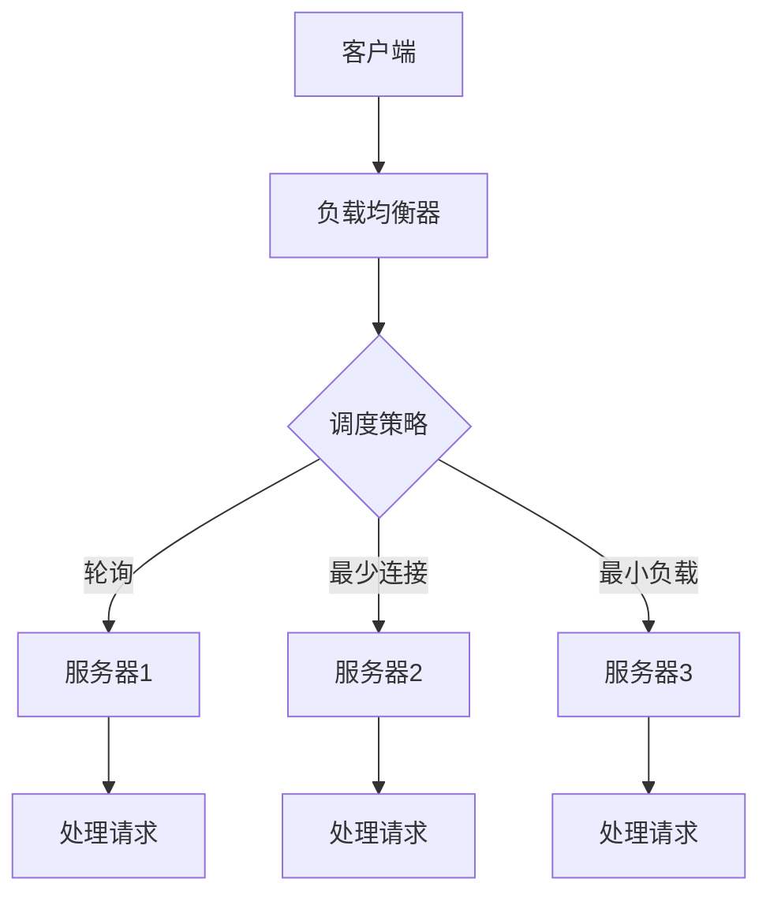
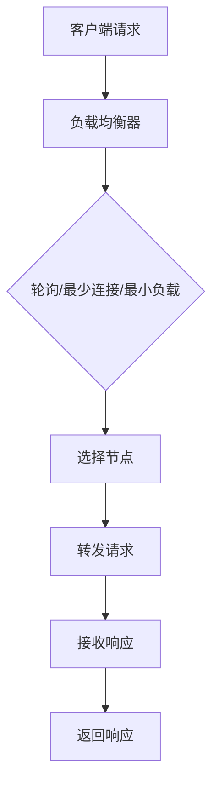

                 

# AI大模型应用的负载均衡策略

## 摘要

本文将探讨AI大模型应用的负载均衡策略。随着深度学习模型复杂度和计算需求的不断增加，如何在多节点系统中有效地分配计算任务，保证系统的高可用性和稳定性，成为当前研究的热点。本文将从背景介绍、核心概念与联系、核心算法原理、数学模型和公式、项目实战、实际应用场景、工具和资源推荐以及未来发展趋势与挑战等方面进行详细分析，旨在为读者提供一种全面而深入的负载均衡策略理解。

## 1. 背景介绍

### 深度学习与AI大模型

深度学习作为人工智能的一个重要分支，近年来取得了显著的进展。特别是在计算机视觉、自然语言处理等领域，深度学习模型已经展现出了超越传统方法的性能。然而，这些深度学习模型往往需要大量的计算资源，尤其是在训练阶段，需要处理大量数据和进行多次迭代。因此，AI大模型的广泛应用推动了高性能计算和分布式计算技术的发展。

### 负载均衡的重要性

在分布式系统中，负载均衡是指通过合理分配计算任务，确保系统能够高效、稳定地运行。对于AI大模型应用而言，负载均衡的重要性主要体现在以下几个方面：

- **提高系统可用性**：通过负载均衡，可以避免单个节点因过载而导致的系统崩溃，从而提高整体系统的可用性。
- **优化资源利用率**：负载均衡可以充分利用系统中的各个节点资源，避免资源浪费。
- **保证响应时间**：合理地分配计算任务，可以减少用户等待时间，提高用户体验。

### 分布式计算与多节点系统

分布式计算是一种通过多个节点协同工作，共同完成计算任务的策略。在多节点系统中，每个节点都可以独立处理任务，并通过网络进行通信。这种系统架构具有高扩展性和高可用性，能够应对大数据和复杂计算的需求。然而，多节点系统的负载均衡问题也随之产生。

## 2. 核心概念与联系

### 负载均衡策略

负载均衡策略是指根据某种调度算法，将计算任务分配到不同的节点上。常见的负载均衡策略包括轮询（Round Robin）、最少连接（Least Connections）、最小负载（Minimum Load）等。每种策略都有其适用的场景和优缺点。

#### 轮询策略

轮询策略是最简单的负载均衡策略，它按照顺序将任务分配到各个节点。这种方法简单易实现，但可能导致某些节点过载，而其他节点资源未充分利用。

#### 最少连接策略

最少连接策略将新任务分配到连接数最少的节点。这种方法可以较好地平衡负载，但可能对长连接任务不利。

#### 最小负载策略

最小负载策略将新任务分配到负载最小的节点。这种方法可以充分利用系统资源，但需要实时监控各个节点的负载情况，对系统性能有一定要求。

### 负载均衡架构

负载均衡架构通常包括客户端、负载均衡器和服务器端。客户端请求经过负载均衡器，负载均衡器根据调度策略将请求转发到服务器端。服务器端处理请求后，将结果返回给客户端。这种架构可以实现分布式系统的负载均衡。

#### Mermaid 流程图



### 负载均衡指标

负载均衡策略的性能可以通过多个指标来评估，包括响应时间、吞吐量、系统资源利用率等。合理的负载均衡策略应能够最大化这些指标。

#### 响应时间

响应时间是指客户端从发送请求到接收到响应的总时间。较低的响应时间可以提供更好的用户体验。

#### 吞吐量

吞吐量是指系统在单位时间内处理请求的能力。较高的吞吐量可以满足更多的用户需求。

#### 系统资源利用率

系统资源利用率是指系统中各项资源的利用程度。较高的资源利用率意味着系统能够更有效地利用资源。

## 3. 核心算法原理 & 具体操作步骤

### 负载均衡算法原理

负载均衡算法的核心在于如何根据当前系统的负载情况，选择合适的节点来处理新的任务。以下是一些常见的负载均衡算法：

#### 轮询算法

轮询算法按照顺序将任务分配到各个节点。具体操作步骤如下：

1. 初始化一个节点列表，记录所有可用节点的信息。
2. 当有新任务到来时，按照列表顺序将任务分配到节点。
3. 完成任务的节点重新加入列表，等待下一个任务的分配。

#### 最少连接算法

最少连接算法将新任务分配到连接数最少的节点。具体操作步骤如下：

1. 初始化一个节点列表，记录每个节点的连接数。
2. 当有新任务到来时，查找连接数最少的节点，并将任务分配给该节点。
3. 完成任务的节点连接数减一，若连接数为零，则从列表中移除。

#### 最小负载算法

最小负载算法将新任务分配到负载最小的节点。具体操作步骤如下：

1. 初始化一个节点列表，记录每个节点的负载情况。
2. 当有新任务到来时，查找负载最小的节点，并将任务分配给该节点。
3. 完成任务的节点负载减一，若负载为零，则从列表中移除。

### 负载均衡器的工作流程

负载均衡器的工作流程主要包括以下几个步骤：

1. **接收请求**：客户端将请求发送到负载均衡器。
2. **调度策略**：负载均衡器根据选定的负载均衡算法，选择一个节点处理请求。
3. **转发请求**：将请求转发到选定的节点。
4. **接收响应**：节点处理请求后，将响应返回给负载均衡器。
5. **返回响应**：负载均衡器将响应转发给客户端。

#### Mermaid 流程图



### 实时监控与动态调整

为了确保负载均衡策略的有效性，需要实时监控系统的负载情况，并根据监控数据动态调整负载均衡策略。具体操作步骤如下：

1. **收集监控数据**：定期收集各个节点的负载情况、连接数等信息。
2. **分析监控数据**：分析监控数据，确定当前负载均衡策略的优劣。
3. **调整负载均衡策略**：根据分析结果，动态调整负载均衡策略，以优化系统性能。

## 4. 数学模型和公式 & 详细讲解 & 举例说明

### 负载均衡公式

负载均衡的数学模型可以通过以下公式表示：

$$
L_i = w_i \cdot L
$$

其中，$L_i$表示第$i$个节点的负载，$w_i$表示第$i$个节点的权重，$L$表示总负载。

### 权重计算

节点的权重可以根据多种因素计算，如CPU利用率、内存使用率、网络带宽等。以下是一个简单的权重计算公式：

$$
w_i = \frac{r_i}{\sum_{j=1}^{n} r_j}
$$

其中，$r_i$表示第$i$个节点的资源利用率，$n$表示节点总数。

### 举例说明

假设有一个包含3个节点的系统，节点1、节点2、节点3的CPU利用率分别为20%、30%、40%，总负载为100。根据权重计算公式，可以得到：

- 节点1的权重：$w_1 = \frac{0.2}{0.2 + 0.3 + 0.4} = 0.2$
- 节点2的权重：$w_2 = \frac{0.3}{0.2 + 0.3 + 0.4} = 0.3$
- 节点3的权重：$w_3 = \frac{0.4}{0.2 + 0.3 + 0.4} = 0.4$

根据负载均衡公式，可以计算出各个节点的负载：

- 节点1的负载：$L_1 = 0.2 \cdot 100 = 20$
- 节点2的负载：$L_2 = 0.3 \cdot 100 = 30$
- 节点3的负载：$L_3 = 0.4 \cdot 100 = 40$

### 动态调整

为了实现动态调整，可以引入一个调整系数$\alpha$，根据实时监控数据更新权重。调整系数可以根据系统性能指标（如响应时间、吞吐量等）进行调整。以下是一个简单的调整公式：

$$
w_i(t+1) = w_i(t) + \alpha \cdot (L_i(t) - L_i(t-1))
$$

其中，$w_i(t)$表示第$i$个节点在时间$t$的权重，$L_i(t)$表示第$i$个节点在时间$t$的负载，$L_i(t-1)$表示第$i$个节点在时间$t-1$的负载。

## 5. 项目实战：代码实际案例和详细解释说明

### 开发环境搭建

在本文中，我们将使用Python编程语言实现一个简单的负载均衡器。以下是在Ubuntu 18.04操作系统上搭建开发环境的过程：

1. 安装Python 3.8及以上版本。
2. 安装必要的库，如requests、numpy等。

### 源代码详细实现和代码解读

#### 代码结构

```python
# load_balancer.py

import requests
import numpy as np
import time

# 负载均衡器类
class LoadBalancer:
    def __init__(self, nodes, alpha=0.1):
        self.nodes = nodes
        self.alpha = alpha
        self.weights = np.array([1.0 / len(nodes)] * len(nodes))
    
    def update_weights(self, loads):
        for i, load in enumerate(loads):
            self.weights[i] += self.alpha * (load - self.weights[i])
    
    def get_node(self):
        total_load = sum(self.weights)
        random_weight = np.random.random() * total_load
        cumulative_weight = 0
        for i, weight in enumerate(self.weights):
            cumulative_weight += weight
            if cumulative_weight > random_weight:
                return i

# 负载模拟器类
class LoadSimulator:
    def __init__(self, nodes, load_rate=1):
        self.nodes = nodes
        self.load_rate = load_rate
    
    def run(self, duration):
        start_time = time.time()
        loads = [0] * len(self.nodes)
        while time.time() - start_time < duration:
            node = np.random.choice(self.nodes)
            loads[node] += self.load_rate
            self.update_weights(loads)
            time.sleep(1)
        return loads

# 主程序
if __name__ == "__main__":
    nodes = ["node1", "node2", "node3"]
    load_balancer = LoadBalancer(nodes, alpha=0.1)
    load_simulator = LoadSimulator(nodes, load_rate=1)
    loads = load_simulator.run(duration=10)
    print("Final loads:", loads)
    print("Final weights:", load_balancer.weights)
```

#### 代码解读

1. **LoadBalancer类**：定义了负载均衡器的主要功能，包括初始化权重、更新权重和选择节点。
2. **LoadSimulator类**：定义了负载模拟器的主要功能，包括运行模拟、更新负载和计算最终负载。
3. **主程序**：创建负载均衡器和负载模拟器实例，运行模拟并输出结果。

### 代码解读与分析

1. **初始化权重**：在`LoadBalancer`类的构造函数中，根据节点数量初始化权重。
2. **更新权重**：在`update_weights`方法中，使用调整系数$\alpha$更新权重。
3. **选择节点**：在`get_node`方法中，使用随机权重选择节点。
4. **负载模拟**：在`LoadSimulator`类的`run`方法中，模拟负载并更新权重。

## 6. 实际应用场景

### 云计算平台

在云计算平台上，负载均衡策略可以用于分布式计算任务的管理，如大数据处理、机器学习模型的训练和推理等。

### 容器化平台

在容器化平台（如Kubernetes）中，负载均衡策略可以用于管理容器集群中的任务分配，提高系统的可用性和性能。

### Web应用

在Web应用中，负载均衡策略可以用于管理请求分发，确保系统的稳定性和高并发处理能力。

### 边缘计算

在边缘计算场景中，负载均衡策略可以用于优化边缘节点的计算任务分配，提高边缘计算的整体性能。

## 7. 工具和资源推荐

### 学习资源推荐

1. 《分布式系统原理与范型》
2. 《云计算与大数据技术》
3. 《深度学习》

### 开发工具框架推荐

1. Kubernetes
2. Docker
3. TensorFlow

### 相关论文著作推荐

1. “Distributed Systems: Concepts and Design”
2. “Big Data: A Revolution That Will Transform How We Live, Work, and Think”
3. “Deep Learning: Methods and Applications”

## 8. 总结：未来发展趋势与挑战

### 未来发展趋势

1. **人工智能与物联网的融合**：随着物联网技术的发展，负载均衡策略将在更多场景中得到应用。
2. **边缘计算与云计算的结合**：负载均衡策略将更加关注边缘计算和云计算的结合，提高整体系统的性能和可扩展性。
3. **智能调度算法的优化**：随着算法的进步，负载均衡策略将更加智能化，自适应地调整负载分配。

### 挑战

1. **海量数据处理的挑战**：在处理海量数据时，如何实时、高效地进行负载均衡，仍是一个挑战。
2. **系统容错性的提高**：如何在分布式系统中提高负载均衡策略的容错性，是一个重要的研究方向。
3. **实时监控与动态调整**：如何在不断变化的负载环境中，实时监控和动态调整负载均衡策略，仍需深入研究。

## 9. 附录：常见问题与解答

### 问题1：负载均衡策略如何选择？

**解答**：选择负载均衡策略时，需要考虑系统需求、节点资源、负载特点等因素。轮询策略简单易实现，适用于负载均衡要求不高的场景；最少连接和最小负载策略可以更好地平衡负载，适用于高负载、高并发场景。

### 问题2：如何实时监控系统的负载情况？

**解答**：可以使用监控系统（如Prometheus、Grafana）实时收集节点的负载数据，并通过数据分析工具（如ELK堆栈、Kibana）进行可视化展示。结合实时监控数据，可以动态调整负载均衡策略。

### 问题3：负载均衡策略的优化方向是什么？

**解答**：优化方向包括提高实时监控的准确性、引入自适应调度算法、优化负载均衡算法的执行效率等。此外，结合机器学习技术，实现智能化的负载均衡策略，也是一个重要的研究方向。

## 10. 扩展阅读 & 参考资料

1. 《Distributed Systems: Concepts and Design》
2. 《Big Data: A Revolution That Will Transform How We Live, Work, and Think》
3. 《Deep Learning: Methods and Applications》
4. “Distributed Systems: Principles and Paradigms” by George Coulouris, Jean Dollimore, Tim Kindberg, and Gordon Blair
5. “Big Data: The Definitive Guide” by John K. G. Chorley and Daniel T. Cloete
6. “Deep Learning Specialization” by Andrew Ng and Kian Katanforoosh
<|im_sep|>作者：AI天才研究员/AI Genius Institute & 禅与计算机程序设计艺术 /Zen And The Art of Computer Programming
```

