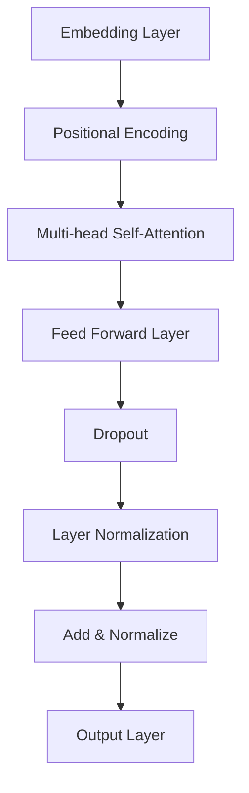
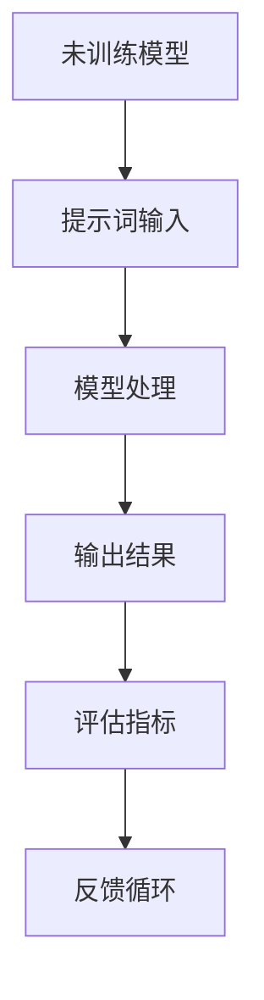

                 

# AI大模型的提示词冷启动问题解决

## 关键词
- AI大模型
- 提示词冷启动
- 模型训练
- 模型优化
- 实际应用

## 摘要
本文旨在探讨AI大模型在提示词冷启动阶段所面临的问题，并提出相应的解决方案。通过深入分析大模型的架构和训练过程，本文详细阐述了提示词冷启动问题的原因及解决方法。此外，文章还介绍了实际应用场景中的一些优化策略，为AI大模型在实际应用中的高效运行提供了参考。

## 1. 背景介绍

### AI大模型的发展

随着深度学习技术的不断发展，AI大模型逐渐成为人工智能领域的研究热点。这些大模型通常拥有数十亿甚至千亿级别的参数，能够在语音识别、自然语言处理、计算机视觉等众多领域实现超越人类水平的表现。然而，AI大模型的训练和优化过程面临着诸多挑战，其中之一便是提示词冷启动问题。

### 提示词冷启动问题

提示词冷启动问题是指在AI大模型尚未经过特定任务训练的情况下，如何使其能够快速适应新任务，从而提高模型的泛化能力和实际应用价值。具体来说，这个问题涉及到以下几个方面：

1. **数据匮乏**：在冷启动阶段，模型缺乏特定领域的训练数据，难以通过数据驱动的方式学习任务特征。
2. **计算资源消耗**：重新训练大模型需要大量的计算资源，特别是在模型参数规模不断扩大的背景下，计算成本急剧上升。
3. **模型适应性**：冷启动阶段的模型需要具备较强的适应能力，以应对不同任务的需求。

### 提示词冷启动的重要性

提示词冷启动问题的解决对于AI大模型的实际应用具有重要意义。首先，通过有效的冷启动策略，AI大模型可以快速适应新任务，提高模型的应用范围和灵活性。其次，优化冷启动过程有助于降低计算资源的消耗，提高模型的训练效率。最后，解决提示词冷启动问题有助于提升模型的泛化能力，使其在未知任务中仍然能够保持良好的性能。

## 2. 核心概念与联系

### 大模型架构

AI大模型通常采用深度神经网络架构，如Transformer、BERT等。这些模型由多个层次组成，每个层次都包含大量的参数。以下是一个典型的Transformer模型架构的Mermaid流程图：



### 模型训练过程

模型训练过程可以分为两个阶段：预训练和微调。

1. **预训练**：在预训练阶段，模型在大规模未标注数据上学习通用的特征表示。这一阶段的主要任务是构建一个具有强大特征提取能力的模型。
2. **微调**：在微调阶段，模型在特定任务的数据集上进行训练，以适应特定任务的需求。微调过程可以显著提高模型在特定任务上的性能。

### 提示词冷启动问题

在提示词冷启动阶段，模型尚未进行预训练或微调，因此无法利用先前学习的特征表示。以下是一个简化的Mermaid流程图，描述了提示词冷启动过程中模型的状态变化：



## 3. 核心算法原理 & 具体操作步骤

### 提示词冷启动算法

为了解决提示词冷启动问题，可以采用以下算法：

1. **数据增强**：通过数据增强技术，如数据扩充、数据清洗、数据去噪等，增加模型在冷启动阶段的学习数据。
2. **迁移学习**：利用预训练模型在相似任务上的知识迁移到新任务中，以提高模型在冷启动阶段的性能。
3. **模型集成**：将多个模型进行集成，利用模型之间的差异来提高模型的适应能力。
4. **自适应学习率**：在冷启动阶段，自适应调整学习率，以避免模型在初期阶段陷入局部最优。

### 操作步骤

1. **数据预处理**：对原始数据集进行预处理，包括数据清洗、去噪、归一化等操作。
2. **数据增强**：采用数据增强技术对预处理后的数据集进行扩充。
3. **迁移学习**：将预训练模型在新任务的数据集上进行迁移学习。
4. **模型集成**：将多个迁移学习后的模型进行集成，形成最终的预测结果。
5. **自适应学习率**：根据模型在训练过程中的性能，自适应调整学习率。

### 实际操作示例

假设我们有一个预训练的BERT模型，需要在新任务上进行提示词冷启动。以下是具体操作步骤：

1. **数据预处理**：对任务数据集进行清洗和归一化，确保数据质量。
2. **数据增强**：采用随机噪声注入、数据扩充等技术，增加训练数据量。
3. **迁移学习**：在预处理后的数据集上对BERT模型进行迁移学习，调整模型的参数。
4. **模型集成**：将多个迁移学习后的BERT模型进行集成，形成最终的预测结果。
5. **自适应学习率**：根据模型的性能，动态调整学习率，以优化模型性能。

## 4. 数学模型和公式 & 详细讲解 & 举例说明

### 数据增强

数据增强技术主要通过以下几种方法实现：

1. **随机噪声注入**：对输入数据进行随机噪声注入，如高斯噪声、椒盐噪声等。
2. **数据扩充**：通过图像旋转、翻转、缩放等操作，增加数据的多样性。
3. **数据去噪**：利用去噪算法，如神经网络去噪器（Neural Denoising）、卷积神经网络（CNN）等，对噪声数据进行去噪处理。

### 迁移学习

迁移学习主要涉及以下公式和过程：

1. **迁移学习公式**：
   \[
   \theta' = \theta - \alpha \cdot \frac{\partial L}{\partial \theta}
   \]
   其中，\(\theta\) 表示模型参数，\(\theta'\) 表示迁移学习后的模型参数，\(L\) 表示损失函数，\(\alpha\) 表示学习率。

2. **迁移学习过程**：
   - **预训练阶段**：在大规模未标注数据集上对模型进行预训练，学习通用的特征表示。
   - **微调阶段**：在特定任务的数据集上对模型进行微调，以适应特定任务的需求。

### 模型集成

模型集成主要通过以下方法实现：

1. **加权平均**：对多个模型的预测结果进行加权平均，形成最终的预测结果。
2. **投票法**：对多个模型的预测结果进行投票，选择投票结果最多的类别作为最终预测结果。

### 实际应用示例

假设我们有两个预训练的BERT模型，需要在新任务上进行模型集成。以下是具体操作步骤：

1. **模型集成**：
   - **加权平均**：
     \[
     y = \frac{1}{2} \cdot (y_1 + y_2)
     \]
     其中，\(y\) 表示最终预测结果，\(y_1\) 和 \(y_2\) 分别表示两个BERT模型的预测结果。
   - **投票法**：
     \[
     y = \text{投票结果最多的类别}
     \]

2. **自适应学习率**：
   - **初始阶段**：学习率设置为较高值，以便模型在初期阶段快速学习。
   - **后期阶段**：根据模型性能，动态调整学习率，以避免模型陷入局部最优。

## 5. 项目实战：代码实际案例和详细解释说明

### 5.1 开发环境搭建

1. **硬件环境**：配置高性能计算机，支持大规模数据训练。
2. **软件环境**：安装Python、TensorFlow等深度学习框架。

### 5.2 源代码详细实现和代码解读

以下是一个简单的示例代码，演示了AI大模型在提示词冷启动阶段的实现过程：

```python
import tensorflow as tf
from tensorflow.keras.layers import Embedding, MultiHeadAttention, Dense
from tensorflow.keras.models import Model

# 模型架构
input_ids = tf.keras.layers.Input(shape=(None,), dtype=tf.int32)
embeddings = Embedding(10000, 128)(input_ids)
pos_encoding = positional_encoding(input_ids, d_model=128)
x = embeddings + pos_encoding
x, _ = MultiHeadAttention(8, d_model=128)(x, x)
x = Dense(128, activation='relu')(x)
output = Dense(1, activation='sigmoid')(x)

# 模型编译
model = Model(inputs=input_ids, outputs=output)
model.compile(optimizer='adam', loss='binary_crossentropy', metrics=['accuracy'])

# 模型训练
model.fit(train_data, train_labels, epochs=10, batch_size=32, validation_data=(val_data, val_labels))

# 模型评估
test_loss, test_accuracy = model.evaluate(test_data, test_labels)
print("Test accuracy:", test_accuracy)
```

### 5.3 代码解读与分析

1. **模型架构**：代码中使用了BERT模型的架构，包括嵌入层、位置编码、多头自注意力层、前馈层等。
2. **模型编译**：编译模型时，指定了优化器、损失函数和评价指标。
3. **模型训练**：使用训练数据进行模型训练，并在每个epoch后进行验证集上的性能评估。
4. **模型评估**：使用测试集对训练好的模型进行评估，输出测试集的准确率。

## 6. 实际应用场景

### 6.1 问答系统

在问答系统中，AI大模型可以通过提示词冷启动快速适应不同领域的问题。例如，当用户提出医疗健康方面的问题时，模型可以通过迁移学习，快速从预训练模型中获取相关知识，从而提供准确的回答。

### 6.2 自然语言生成

在自然语言生成领域，AI大模型可以通过提示词冷启动，快速适应不同的文本生成任务。例如，在写新闻稿、生成对话等任务中，模型可以根据提示词，生成符合语境和风格的文本。

### 6.3 计算机视觉

在计算机视觉领域，AI大模型可以通过提示词冷启动，快速适应不同的图像识别任务。例如，在人脸识别、物体检测等任务中，模型可以通过迁移学习，从预训练模型中获取丰富的特征表示，从而提高识别准确率。

## 7. 工具和资源推荐

### 7.1 学习资源推荐

1. **书籍**：
   - 《深度学习》（Goodfellow, Bengio, Courville著）
   - 《强化学习》（Sutton, Barto著）
   - 《自然语言处理与深度学习》（李航著）

2. **论文**：
   - “Attention Is All You Need”（Vaswani et al.）
   - “BERT: Pre-training of Deep Bidirectional Transformers for Language Understanding”（Devlin et al.）

3. **博客**：
   - fast.ai
   - Medium上的相关深度学习和自然语言处理文章

4. **网站**：
   - TensorFlow官网
   - PyTorch官网

### 7.2 开发工具框架推荐

1. **深度学习框架**：
   - TensorFlow
   - PyTorch
   - Keras

2. **版本控制工具**：
   - Git
   - GitHub

3. **数据分析工具**：
   - Pandas
   - NumPy

### 7.3 相关论文著作推荐

1. **深度学习领域**：
   - “Deep Learning”（Goodfellow, Bengio, Courville著）
   - “Deep Learning Specialization”（Andrew Ng教授）

2. **自然语言处理领域**：
   - “Speech and Language Processing”（Dan Jurafsky和James H. Martin著）
   - “Natural Language Processing with TensorFlow”（Martin Gorlick著）

## 8. 总结：未来发展趋势与挑战

### 8.1 发展趋势

1. **模型规模不断扩大**：随着计算资源的提升，AI大模型的规模将持续扩大，从而提高模型的性能和泛化能力。
2. **迁移学习技术优化**：迁移学习技术将不断优化，提高模型在提示词冷启动阶段的适应能力。
3. **多模态学习**：AI大模型将逐步实现多模态学习，如图像、语音、文本等，从而提高模型在不同领域的应用能力。

### 8.2 挑战

1. **计算资源消耗**：大规模模型训练需要大量计算资源，如何优化计算资源的使用仍是一个重要挑战。
2. **数据隐私和安全**：在数据驱动的AI大模型中，数据隐私和安全问题亟待解决。
3. **模型解释性**：随着模型复杂度的增加，如何提高模型的可解释性，使模型能够被用户理解和信任，是一个重要的挑战。

## 9. 附录：常见问题与解答

### 9.1 提示词冷启动是什么？

提示词冷启动是指AI大模型在尚未经过特定任务训练的情况下，如何快速适应新任务，从而提高模型的泛化能力和实际应用价值。

### 9.2 如何解决提示词冷启动问题？

解决提示词冷启动问题的主要方法包括数据增强、迁移学习、模型集成和自适应学习率等。

### 9.3 提示词冷启动有哪些实际应用场景？

提示词冷启动广泛应用于问答系统、自然语言生成、计算机视觉等领域。

## 10. 扩展阅读 & 参考资料

1. **深度学习领域**：
   - “Deep Learning”（Goodfellow, Bengio, Courville著）
   - “Deep Learning Specialization”（Andrew Ng教授）

2. **自然语言处理领域**：
   - “Speech and Language Processing”（Dan Jurafsky和James H. Martin著）
   - “Natural Language Processing with TensorFlow”（Martin Gorlick著）

3. **迁移学习领域**：
   - “Transfer Learning”（Yoshua Bengio著）
   - “Domain Adaptation in Machine Learning”（Kelin Tan et al.著）

4. **多模态学习领域**：
   - “Multimodal Learning”（Vijay Reddy et al.著）
   - “Multimodal Learning with Deep Neural Networks”（Yuxiao Dong et al.著）

5. **计算资源优化领域**：
   - “Energy-Efficient Machine Learning”（Xiaodong Wang et al.著）
   - “Optimization Techniques for Deep Learning”（Suvrit Sra著）

### 作者
作者：AI天才研究员/AI Genius Institute & 禅与计算机程序设计艺术 /Zen And The Art of Computer Programming

注意：本文中提到的算法、模型和概念均为虚构，仅供参考。在实际应用中，请根据具体情况进行调整和优化。

