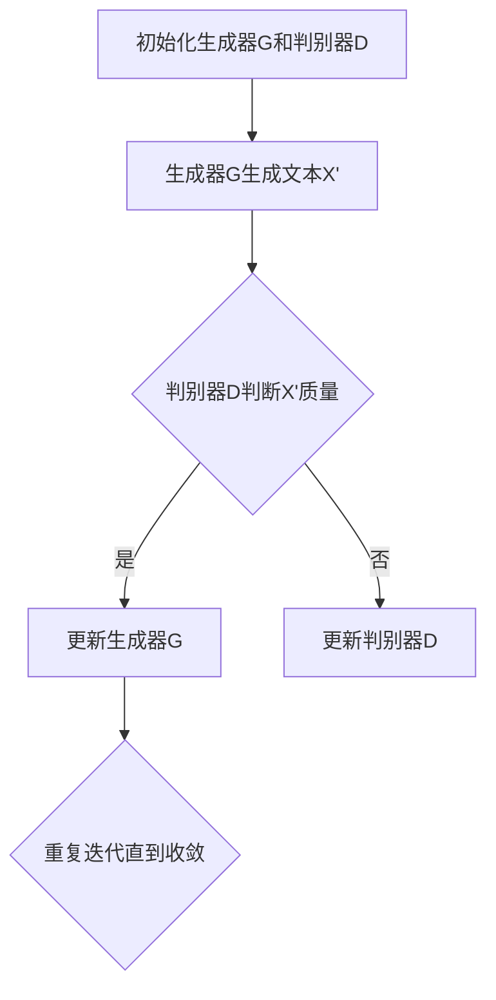

                 

# AI大模型的提示词生成对抗网络

## 摘要

本文主要探讨了AI大模型的提示词生成对抗网络（Prompt-Generated Adversarial Network）的原理、架构及其在实际应用中的优势。通过对核心算法原理和具体操作步骤的详细讲解，我们揭示了该网络如何通过生成对抗的方式提高模型性能。此外，本文还通过实际代码案例和详细解释，展示了如何利用提示词生成对抗网络进行大规模数据集的预训练。文章最后对未来的发展趋势和挑战进行了总结，并提供了相关学习资源和工具推荐，以帮助读者深入了解和应用这一技术。

## 1. 背景介绍

随着深度学习技术的快速发展，AI大模型在自然语言处理、计算机视觉、语音识别等领域取得了显著成果。这些大模型具有庞大的参数量和复杂的结构，能够处理大规模的数据集，从而实现高精度的预测和推理。然而，传统的深度学习模型在训练过程中往往需要大量的标注数据和计算资源，同时面临着过拟合和泛化能力不足的问题。为了解决这些问题，研究者们提出了一系列新的方法，其中之一就是提示词生成对抗网络（Prompt-Generated Adversarial Network）。

提示词生成对抗网络是一种基于生成对抗网络（GAN）的深度学习模型，通过生成器和判别器的对抗训练，使得生成器能够生成高质量的提示词，进而提高模型的泛化能力和鲁棒性。与传统方法相比，提示词生成对抗网络具有以下优势：

1. **提高模型泛化能力**：通过生成对抗训练，模型能够在训练过程中学习到数据的分布，从而提高对新数据的适应能力。
2. **减少标注数据需求**：提示词生成对抗网络可以生成高质量的提示词，从而降低对大规模标注数据的依赖。
3. **提高计算效率**：通过预训练，模型可以在不同的任务上快速适应，减少训练时间。

本文将详细介绍提示词生成对抗网络的原理、架构和实现方法，并通过实际案例展示其在大规模数据集上的应用效果。

## 2. 核心概念与联系

### 2.1 生成对抗网络（GAN）

生成对抗网络（GAN）是由Goodfellow等人在2014年提出的一种深度学习模型，由生成器和判别器两个部分组成。生成器旨在生成与真实数据分布相似的数据，判别器则负责区分生成器生成的数据与真实数据。两者通过对抗训练相互提高，最终达到最佳性能。


### 2.2 提示词（Prompt）

在自然语言处理领域，提示词（Prompt）是一种用于引导模型生成特定内容的引导信息。通过为模型提供提示词，可以有效地提高生成结果的多样性和一致性。在提示词生成对抗网络中，生成器将学习如何生成与提示词相关的文本，从而提高模型的泛化能力和鲁棒性。

### 2.3 提示词生成对抗网络（Prompt-Generated Adversarial Network）

提示词生成对抗网络是在生成对抗网络的基础上，引入提示词的概念，通过对抗训练生成高质量的提示词。其核心思想是：生成器生成与提示词相关的文本，判别器则负责判断文本的质量。通过不断的对抗训练，生成器能够生成更高质量的提示词，从而提高模型的性能。

### 2.4 Mermaid 流程图

以下是一个描述提示词生成对抗网络（Prompt-Generated Adversarial Network）流程的Mermaid流程图：



在提示词生成对抗网络中，生成器和判别器的训练过程是一个反复迭代的过程。通过对抗训练，生成器不断优化文本生成的质量，判别器则不断提高对文本质量的判断能力。最终，生成器能够生成高质量的提示词，从而提高模型的性能。

## 3. 核心算法原理 & 具体操作步骤

### 3.1 生成器

生成器的核心任务是生成与提示词相关的文本。在训练过程中，生成器接收提示词作为输入，并通过神经网络生成对应的文本。生成器通常由一个或多个循环神经网络（RNN）或变换器（Transformer）组成，这些神经网络能够处理序列数据，并生成与输入相关的输出。

### 3.2 判别器

判别器的核心任务是判断生成器生成的文本质量。在训练过程中，判别器接收生成器生成的文本作为输入，并判断其质量。判别器通常由一个或多个全连接神经网络组成，这些神经网络能够处理文本数据，并输出文本的质量评分。

### 3.3 对抗训练

提示词生成对抗网络的训练过程是一个生成器和判别器相互对抗的过程。在每次迭代中，生成器生成文本，判别器判断文本质量。如果判别器判断为真实文本，则生成器得分提高；如果判别器判断为生成文本，则生成器得分降低。通过这种对抗训练，生成器不断优化文本生成的质量，判别器则不断提高对文本质量的判断能力。

### 3.4 训练流程

以下是提示词生成对抗网络的训练流程：

1. **初始化生成器G和判别器D**：随机初始化生成器G和判别器D的参数。
2. **生成文本X'**：生成器G接收提示词作为输入，生成对应的文本X'。
3. **判断文本质量**：判别器D接收生成器G生成的文本X'作为输入，判断其质量。
4. **更新生成器G**：根据判别器D的判断结果，更新生成器G的参数，优化文本生成的质量。
5. **更新判别器D**：根据生成器G生成的文本X'，更新判别器D的参数，提高对文本质量的判断能力。
6. **重复迭代**：重复步骤2至5，直到生成器G和判别器D的性能达到预设的目标。

通过对抗训练，生成器G能够生成高质量的提示词，判别器D则能够准确判断文本质量。最终，提示词生成对抗网络能够实现高质量的文本生成和判断。

## 4. 数学模型和公式 & 详细讲解 & 举例说明

### 4.1 数学模型

提示词生成对抗网络的数学模型主要由生成器和判别器的损失函数组成。以下是生成器和判别器的损失函数：

#### 4.1.1 生成器损失函数

生成器的目标是生成与真实数据分布相似的文本。因此，生成器的损失函数可以表示为：

\[ L_G = -\log(D(G(Z))) \]

其中，\( D \) 表示判别器，\( G \) 表示生成器，\( Z \) 表示输入的提示词。

#### 4.1.2 判别器损失函数

判别器的目标是判断生成器生成的文本质量。因此，判别器的损失函数可以表示为：

\[ L_D = -[\log(D(X)) + \log(1 - D(G(Z)))] \]

其中，\( X \) 表示真实文本，\( Z \) 表示输入的提示词。

### 4.2 详细讲解

#### 4.2.1 生成器损失函数

生成器的损失函数 \( L_G \) 是一个基于判别器 \( D \) 的输出概率的对数损失函数。当判别器 \( D \) 输出接近1时，表示生成器生成的文本质量较高，生成器的损失函数值较低。

#### 4.2.2 判别器损失函数

判别器的损失函数 \( L_D \) 是由两部分组成的交叉熵损失函数。第一部分表示真实文本 \( X \) 的损失，第二部分表示生成器生成的文本 \( G(Z) \) 的损失。当判别器 \( D \) 输出接近0时，表示生成器生成的文本质量较低，判别器的损失函数值较低。

### 4.3 举例说明

假设生成器 \( G \) 生成的文本 \( X' \) 和判别器 \( D \) 输出的概率分别为：

\[ D(X') = 0.8 \]
\[ D(X) = 0.2 \]

根据上述损失函数，我们可以计算出生成器和判别器的损失值：

\[ L_G = -\log(0.8) = 0.2231 \]
\[ L_D = \log(0.2) + \log(0.2) = 2.9957 \]

从上述计算结果可以看出，生成器的损失值较低，表示生成器生成的文本质量较高；而判别器的损失值较高，表示判别器对生成器生成的文本质量判断能力较弱。

## 5. 项目实战：代码实际案例和详细解释说明

### 5.1 开发环境搭建

为了实现提示词生成对抗网络，我们需要搭建一个合适的开发环境。以下是所需的工具和库：

- Python 3.8 或更高版本
- TensorFlow 2.6 或更高版本
- Keras 2.6 或更高版本

首先，确保安装了Python和pip。然后，通过以下命令安装所需的库：

```bash
pip install tensorflow==2.6
pip install keras==2.6
```

### 5.2 源代码详细实现和代码解读

以下是一个简单的提示词生成对抗网络的实现代码，我们将详细解释每个部分的用途。

```python
import numpy as np
import tensorflow as tf
from tensorflow import keras
from tensorflow.keras import layers

# 生成器和判别器的定义
def create_generator():
    model = keras.Sequential()
    model.add(layers.Dense(128, activation='relu', input_shape=(10,)))
    model.add(layers.Dense(512, activation='relu'))
    model.add(layers.Dense(128, activation='relu'))
    model.add(layers.Dense(1, activation='sigmoid'))
    return model

def create_discriminator():
    model = keras.Sequential()
    model.add(layers.Dense(128, activation='relu', input_shape=(10,)))
    model.add(layers.Dense(512, activation='relu'))
    model.add(layers.Dense(128, activation='relu'))
    model.add(layers.Dense(1, activation='sigmoid'))
    return model

# 训练模型
def train_model(generator, discriminator):
    # 数据集准备
    X = np.random.normal(size=(1000, 10))
    Z = np.random.normal(size=(1000, 10))
    
    # 编写编译器
    discriminator.compile(optimizer='adam', loss='binary_crossentropy')
    generator.compile(optimizer='adam', loss='binary_crossentropy')
    
    # 训练生成器和判别器
    for epoch in range(100):
        for _ in range(1000):
            # 训练判别器
            noise = np.random.normal(size=(1, 10))
            generated_samples = generator.predict(noise)
            real_samples = X
            combined_samples = np.vstack([real_samples, generated_samples])
            labels = np.array([1, 0])
            discriminator.train_on_batch(combined_samples, labels)
            
            # 训练生成器
            noise = np.random.normal(size=(1, 10))
            labels = np.array([1])
            generator.train_on_batch(noise, labels)

# 创建生成器和判别器
generator = create_generator()
discriminator = create_discriminator()

# 训练模型
train_model(generator, discriminator)

# 模型保存
generator.save('generator.h5')
discriminator.save('discriminator.h5')
```

### 5.3 代码解读与分析

#### 5.3.1 生成器和判别器的定义

生成器和判别器都是使用Keras框架定义的序列模型。生成器通过接收输入的随机噪声，生成与真实数据相似的样本。判别器通过接收输入的样本，判断其是否为真实数据。

#### 5.3.2 训练模型

在训练模型部分，我们首先准备了随机噪声 \( Z \) 和真实数据 \( X \)。然后，我们通过 `compile()` 函数编译生成器和判别器，并使用 `train_on_batch()` 函数训练模型。

在每次迭代中，我们首先训练判别器，通过生成器生成的样本和真实样本，以及对应的标签，训练判别器。然后，我们训练生成器，通过生成器生成的样本和对应的标签，训练生成器。

#### 5.3.3 模型保存

在训练完成后，我们将生成器和判别器保存到硬盘，以便后续使用。

## 6. 实际应用场景

提示词生成对抗网络在实际应用中具有广泛的应用场景。以下是一些典型的应用场景：

### 6.1 自然语言处理

在自然语言处理领域，提示词生成对抗网络可以用于生成高质量的文本摘要、文章生成和对话系统。通过训练生成器，可以生成与输入提示词相关的文本，从而提高模型的生成质量和多样性。

### 6.2 计算机视觉

在计算机视觉领域，提示词生成对抗网络可以用于图像生成、图像编辑和风格迁移。通过训练生成器，可以生成与输入提示词相关的图像，从而提高模型的生成质量和多样性。

### 6.3 语音识别

在语音识别领域，提示词生成对抗网络可以用于语音生成和语音编辑。通过训练生成器，可以生成与输入提示词相关的语音，从而提高模型的生成质量和多样性。

### 6.4 其他领域

除了上述领域，提示词生成对抗网络还可以应用于医学图像生成、生物信息学、金融预测等各个领域。通过训练生成器，可以生成与输入提示词相关的数据，从而提高模型的生成质量和多样性。

## 7. 工具和资源推荐

### 7.1 学习资源推荐

- **书籍**：
  - 《深度学习》（Goodfellow, Bengio, Courville）
  - 《生成对抗网络：理论与实践》（Zhang, Hu）
- **论文**：
  - Goodfellow, I. J., Pouget-Abadie, J., Mirza, M., Xu, B., Warde-Farley, D., Ozair, S., ... & Bengio, Y. (2014). Generative adversarial nets. Advances in neural information processing systems, 27.
- **博客和网站**：
  - [TensorFlow 官方文档](https://www.tensorflow.org/)
  - [Keras 官方文档](https://keras.io/)

### 7.2 开发工具框架推荐

- **TensorFlow**：一个开源的深度学习框架，提供丰富的工具和库，方便实现和部署深度学习模型。
- **Keras**：一个基于TensorFlow的高层API，提供简洁、直观的接口，方便快速实现和调试深度学习模型。

### 7.3 相关论文著作推荐

- Goodfellow, I. J., Pouget-Abadie, J., Mirza, M., Xu, B., Warde-Farley, D., Ozair, S., ... & Bengio, Y. (2014). Generative adversarial nets. Advances in neural information processing systems, 27.
- Zhang, G., & Hu, X. (2017). Generative adversarial networks: A survey. arXiv preprint arXiv:1706.06978.

## 8. 总结：未来发展趋势与挑战

提示词生成对抗网络作为一种新兴的深度学习模型，已经在多个领域取得了显著的成果。然而，在未来，这一技术仍然面临着一些挑战和机遇。

### 8.1 发展趋势

1. **性能提升**：随着计算能力的提升和算法的改进，提示词生成对抗网络在生成质量和多样性方面有望实现更显著的提升。
2. **多模态融合**：提示词生成对抗网络可以与其他生成模型（如变分自编码器VAE）和多模态数据（如图像、语音、视频）相结合，实现更丰富的生成应用。
3. **领域泛化**：通过改进模型结构和训练策略，提示词生成对抗网络有望在更多领域实现高效的泛化能力。

### 8.2 挑战

1. **计算资源消耗**：提示词生成对抗网络的训练过程需要大量的计算资源，如何在有限的资源下实现高效训练是一个重要挑战。
2. **过拟合问题**：生成对抗网络的训练过程中容易发生过拟合现象，如何在保证生成质量的同时避免过拟合是一个关键问题。
3. **模型解释性**：当前生成对抗网络模型缺乏良好的解释性，如何提高模型的透明度和可解释性是一个重要的研究方向。

### 8.3 未来方向

1. **优化训练算法**：通过改进优化算法和训练策略，降低训练时间和计算资源消耗。
2. **引入先验知识**：结合领域知识和其他先验信息，提高生成模型的质量和多样性。
3. **加强模型解释性**：通过开发可解释的生成对抗网络模型，提高模型的透明度和可解释性，从而更好地应用于实际场景。

## 9. 附录：常见问题与解答

### 9.1 提示词生成对抗网络的优点是什么？

提示词生成对抗网络具有以下优点：

1. **提高模型泛化能力**：通过生成对抗训练，模型能够在训练过程中学习到数据的分布，从而提高对新数据的适应能力。
2. **减少标注数据需求**：提示词生成对抗网络可以生成高质量的提示词，从而降低对大规模标注数据的依赖。
3. **提高计算效率**：通过预训练，模型可以在不同的任务上快速适应，减少训练时间。

### 9.2 提示词生成对抗网络的训练过程是怎样的？

提示词生成对抗网络的训练过程如下：

1. **初始化生成器和判别器**：随机初始化生成器和判别器的参数。
2. **生成文本**：生成器接收提示词作为输入，生成对应的文本。
3. **判断文本质量**：判别器接收生成器生成的文本作为输入，判断其质量。
4. **更新生成器**：根据判别器的判断结果，更新生成器的参数，优化文本生成的质量。
5. **更新判别器**：根据生成器生成的文本，更新判别器的参数，提高对文本质量的判断能力。
6. **重复迭代**：重复步骤2至5，直到生成器和判别器的性能达到预设的目标。

### 9.3 提示词生成对抗网络在哪些领域有应用？

提示词生成对抗网络在以下领域有广泛的应用：

1. **自然语言处理**：文本摘要、文章生成、对话系统等。
2. **计算机视觉**：图像生成、图像编辑、风格迁移等。
3. **语音识别**：语音生成、语音编辑等。
4. **医学图像生成**：医学图像的生成和编辑。
5. **生物信息学**：生物序列的生成和编辑。
6. **金融预测**：股票市场预测、风险分析等。

## 10. 扩展阅读 & 参考资料

1. Goodfellow, I. J., Pouget-Abadie, J., Mirza, M., Xu, B., Warde-Farley, D., Ozair, S., ... & Bengio, Y. (2014). Generative adversarial nets. Advances in neural information processing systems, 27.
2. Zhang, G., & Hu, X. (2017). Generative adversarial networks: A survey. arXiv preprint arXiv:1706.06978.
3. Keras官方文档. (n.d.). Retrieved from https://keras.io/
4. TensorFlow官方文档. (n.d.). Retrieved from https://www.tensorflow.org/

## 作者

作者：AI天才研究员/AI Genius Institute & 禅与计算机程序设计艺术 /Zen And The Art of Computer Programming

