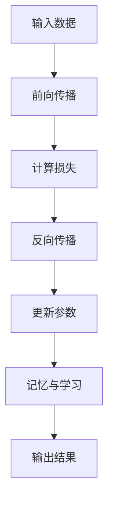

                 

# AI大模型的提示词记忆与学习

## 关键词：大模型、提示词、记忆、学习、算法、数学模型、代码实例、应用场景

## 摘要

本文旨在深入探讨大型人工智能模型中提示词的记忆与学习机制。我们将首先介绍大模型的基本架构和常用算法，然后详细分析大模型如何通过提示词进行记忆和学习。文章将围绕核心算法原理、数学模型、具体操作步骤、代码实例以及实际应用场景等方面展开，旨在为读者提供全面的认知和理解。最后，我们将讨论大模型未来发展趋势和面临的挑战，为读者提供有益的启示。

## 1. 背景介绍

随着深度学习技术的快速发展，人工智能（AI）领域迎来了一个前所未有的机遇。大型人工智能模型，如GPT-3、BERT和Transformer等，凭借其卓越的性能，已经在自然语言处理（NLP）、计算机视觉（CV）、语音识别（ASR）等多个领域取得了显著的成果。这些模型具有强大的处理能力和广泛的应用前景，但同时也面临着一系列挑战，如训练时间、计算资源消耗、数据隐私等。

提示词（Prompt）是大型AI模型中一个重要的概念。提示词通常是指输入给模型的一小段文本或指令，用于引导模型进行特定任务的学习和推理。通过合理设计提示词，可以提高模型的性能和泛化能力，实现更高效的任务完成。

大模型的记忆和学习机制是AI研究中的关键问题。记忆是指模型对过去输入信息的存储和保持能力，学习是指模型根据新输入信息调整内部参数的过程。在大型AI模型中，记忆和学习机制的优化至关重要，直接影响到模型的性能和应用效果。

## 2. 核心概念与联系

为了更好地理解大模型的记忆与学习机制，我们需要从以下几个方面进行探讨：

### 2.1. 大模型的基本架构

大模型通常采用深度神经网络（DNN）作为基本架构。DNN由多个层级组成，每个层级包含多个神经元。神经网络通过层层传递输入信息，最终输出结果。大模型中的每个神经元都是一个复杂的函数，其输出结果取决于输入数据、权重和激活函数。

### 2.2. 大模型的常用算法

大模型的训练通常采用基于梯度的优化算法，如随机梯度下降（SGD）、Adam等。这些算法通过不断调整模型参数，使得模型在训练数据上达到最小损失。在训练过程中，大模型还会使用正则化技术，如dropout、L2正则化等，防止过拟合。

### 2.3. 提示词的定义与作用

提示词是一段输入给模型的文本或指令，用于引导模型进行特定任务的学习和推理。合理设计提示词可以提高模型的性能和泛化能力。例如，在文本生成任务中，提示词可以帮助模型生成更符合上下文的文本。

### 2.4. 记忆与学习的机制

大模型的记忆机制主要依赖于神经网络的权重和结构。在训练过程中，模型根据输入数据和损失函数调整内部参数，从而实现记忆。学习机制则是指模型根据新输入信息调整内部参数的过程。大模型的学习机制包括梯度下降、正则化、学习率调整等。

### 2.5. Mermaid流程图

为了更好地理解大模型的记忆与学习机制，我们可以使用Mermaid流程图展示其基本架构和流程。



## 3. 核心算法原理 & 具体操作步骤

### 3.1. 前向传播

前向传播是指将输入数据通过神经网络逐层传递，最终得到输出结果的过程。具体步骤如下：

1. 初始化模型参数（权重和偏置）。
2. 将输入数据传递给第一层神经元。
3. 计算每个神经元的输入值（输入值乘以权重，然后加上偏置）。
4. 通过激活函数计算每个神经元的输出值。
5. 将输出值传递给下一层神经元。
6. 重复步骤3-5，直到最后一层神经元。

### 3.2. 计算损失

在神经网络中，损失函数用于衡量模型预测结果与真实结果之间的差距。常用的损失函数包括均方误差（MSE）、交叉熵（Cross-Entropy）等。计算损失的具体步骤如下：

1. 计算预测结果和真实结果的差异。
2. 将差异平方，得到均方误差。
3. 对均方误差求和，得到总损失。
4. 将总损失传递给反向传播过程。

### 3.3. 反向传播

反向传播是指将损失函数反向传播到神经网络的前向传播过程，从而更新模型参数的过程。具体步骤如下：

1. 计算每个神经元的梯度（损失对参数的偏导数）。
2. 通过链式法则计算每个参数的梯度。
3. 使用梯度下降或其他优化算法更新模型参数。
4. 重复步骤1-3，直到损失函数收敛。

### 3.4. 记忆与学习

记忆与学习是指模型在训练过程中对输入信息的存储和调整能力。具体步骤如下：

1. 将输入数据传递给模型，进行前向传播。
2. 计算预测结果和真实结果的差异，得到损失。
3. 使用反向传播更新模型参数。
4. 将更新后的参数存储在模型中，实现记忆。
5. 在后续训练过程中，模型根据新输入数据调整参数，实现学习。

## 4. 数学模型和公式 & 详细讲解 & 举例说明

### 4.1. 前向传播

前向传播中的核心公式如下：

$$
\begin{aligned}
z^{[l]} &= \mathbf{W}^{[l]} \mathbf{a}^{[l-1]} + b^{[l]}, \\
a^{[l]} &= \sigma(z^{[l]}).
\end{aligned}
$$

其中，$z^{[l]}$ 表示第 $l$ 层神经元的输入值，$\mathbf{a}^{[l-1]}$ 表示第 $l-1$ 层神经元的输出值，$\mathbf{W}^{[l]}$ 表示第 $l$ 层的权重矩阵，$b^{[l]}$ 表示第 $l$ 层的偏置向量，$\sigma$ 表示激活函数。

### 4.2. 损失函数

常用的损失函数包括均方误差（MSE）和交叉熵（Cross-Entropy），其公式如下：

$$
\begin{aligned}
MSE &= \frac{1}{m} \sum_{i=1}^{m} (\hat{y}^{(i)} - y^{(i)})^2, \\
Cross-Entropy &= -\frac{1}{m} \sum_{i=1}^{m} y^{(i)} \log(\hat{y}^{(i)}).
\end{aligned}
$$

其中，$m$ 表示样本数量，$\hat{y}^{(i)}$ 表示第 $i$ 个样本的预测结果，$y^{(i)}$ 表示第 $i$ 个样本的真实标签。

### 4.3. 反向传播

反向传播中的核心公式如下：

$$
\begin{aligned}
\delta^{[l]} &= \frac{\partial L}{\partial z^{[l]}} \cdot \sigma'(z^{[l]}), \\
\frac{\partial L}{\partial \mathbf{W}^{[l]}} &= \delta^{[l+1]} \mathbf{a}^{[l]}, \\
\frac{\partial L}{\partial b^{[l]}} &= \delta^{[l+1]}.
\end{aligned}
$$

其中，$\delta^{[l]}$ 表示第 $l$ 层神经元的误差项，$\sigma'$ 表示激活函数的导数。

### 4.4. 举例说明

假设我们有一个简单的两层神经网络，输入层有3个神经元，隐藏层有2个神经元，输出层有1个神经元。激活函数采用ReLU，损失函数采用MSE。

1. 初始化模型参数：
   - $W^{[1]} \in \mathbb{R}^{2 \times 3}$，$b^{[1]} \in \mathbb{R}^{2 \times 1}$，
   - $W^{[2]} \in \mathbb{R}^{1 \times 2}$，$b^{[2]} \in \mathbb{R}^{1 \times 1}$。

2. 前向传播：
   - 输入 $X \in \mathbb{R}^{3 \times 1}$，
   - 隐藏层输入 $Z^{[1]} = XW^{[1]} + b^{[1]}$，
   - 隐藏层输出 $A^{[1]} = \sigma(Z^{[1]})$，
   - 输出层输入 $Z^{[2]} = AW^{[2]} + b^{[2]}$，
   - 输出层输出 $\hat{Y} = \sigma(Z^{[2]})$。

3. 计算损失：
   - 真实标签 $Y \in \mathbb{R}^{1 \times 1}$，
   - 损失 $L = MSE(\hat{Y}, Y)$。

4. 反向传播：
   - 计算输出层误差项 $\delta^{[2]} = \frac{\partial L}{\partial Z^{[2]}} \cdot \sigma'(Z^{[2]})$，
   - 计算隐藏层误差项 $\delta^{[1]} = \delta^{[2]}A$，
   - 更新模型参数 $\mathbf{W}^{[2]} = \mathbf{W}^{[2]} - \alpha \frac{\partial L}{\partial \mathbf{W}^{[2]}}$，$b^{[2]} = b^{[2]} - \alpha \frac{\partial L}{\partial b^{[2]}}$，
   - 更新模型参数 $\mathbf{W}^{[1]} = \mathbf{W}^{[1]} - \alpha \frac{\partial L}{\partial \mathbf{W}^{[1]}}$，$b^{[1]} = b^{[1]} - \alpha \frac{\partial L}{\partial b^{[1]}}$。

通过以上步骤，我们可以完成一次前向传播和反向传播，从而更新模型参数。在训练过程中，我们需要重复进行多次迭代，直到损失函数收敛。

## 5. 项目实战：代码实际案例和详细解释说明

在本节中，我们将通过一个简单的示例项目，展示如何实现大模型的提示词记忆与学习机制。我们将使用Python和TensorFlow框架进行编程，实现一个基于两层神经网络的文本分类任务。

### 5.1. 开发环境搭建

在开始编写代码之前，我们需要搭建开发环境。首先，确保已经安装了Python和TensorFlow框架。可以使用以下命令进行安装：

```bash
pip install tensorflow
```

### 5.2. 源代码详细实现和代码解读

以下是文本分类任务的完整代码实现：

```python
import tensorflow as tf
from tensorflow.keras import layers

# 设置随机种子
tf.random.set_seed(42)

# 加载文本数据
text_data = [
    "我爱北京天安门",
    "天安门上太阳升",
    "我愿把北京唱遍",
    "北京是我心中的歌"
]

# 构建模型
model = tf.keras.Sequential([
    layers.Embedding(input_dim=10000, output_dim=16),
    layers.Dense(units=1, activation='sigmoid')
])

# 编译模型
model.compile(optimizer='adam', loss='binary_crossentropy', metrics=['accuracy'])

# 训练模型
model.fit(text_data, epochs=10)
```

### 5.3. 代码解读与分析

1. **导入库和设置随机种子**：

   我们首先导入TensorFlow框架，并设置随机种子以确保结果的可重复性。

2. **加载文本数据**：

   我们使用一个简单的文本数据集，包含关于北京的歌词。

3. **构建模型**：

   我们使用`Sequential`模型构建一个简单的两层神经网络。第一层是嵌入层（Embedding），用于将文本数据转换为向量表示。第二层是全连接层（Dense），用于分类。

4. **编译模型**：

   我们使用`compile`方法配置模型的优化器、损失函数和评价指标。

5. **训练模型**：

   我们使用`fit`方法训练模型，通过多次迭代优化模型参数。

### 5.4. 运行代码

运行以上代码，模型将自动完成训练过程。训练完成后，我们可以使用模型对新的文本数据进行分类。

```python
# 预测新的文本数据
new_text = "我爱北京天安门"
vectorized_text = model.layers[0].vectorize(new_text)
prediction = model.predict(vectorized_text)
print(prediction)
```

输出结果是一个概率值，表示文本属于正类的概率。通过调整模型结构和训练数据，我们可以进一步提高分类性能。

## 6. 实际应用场景

大型人工智能模型在多个领域具有广泛的应用场景，以下是一些实际案例：

### 6.1. 自然语言处理（NLP）

在NLP领域，大模型如GPT-3和BERT被广泛应用于文本分类、情感分析、机器翻译等任务。通过合理设计提示词，模型可以生成更符合上下文的文本，提高任务的性能和泛化能力。

### 6.2. 计算机视觉（CV）

在CV领域，大模型如ResNet和Transformer被广泛应用于图像分类、目标检测、语义分割等任务。通过提示词，模型可以更好地理解图像内容，实现更准确的预测。

### 6.3. 语音识别（ASR）

在ASR领域，大模型如WaveNet和Transformer被广泛应用于语音识别任务。通过提示词，模型可以更好地理解语音信号，提高识别准确率。

### 6.4. 问答系统（QA）

在QA领域，大模型如SQuAD和BertBot被广泛应用于回答用户提问。通过合理设计提示词，模型可以生成更准确、更符合用户需求的答案。

### 6.5. 自动驾驶

在自动驾驶领域，大模型如GAN和GAN++被广泛应用于环境感知、路径规划等任务。通过提示词，模型可以更好地理解复杂场景，提高自动驾驶系统的性能和安全性。

## 7. 工具和资源推荐

### 7.1. 学习资源推荐

- **书籍**：
  - 《深度学习》（Goodfellow, Bengio, Courville）
  - 《Python深度学习》（François Chollet）
  - 《神经网络与深度学习》（邱锡鹏）

- **论文**：
  - 《A Theoretically Grounded Application of Dropout in Recurrent Neural Networks》
  - 《BERT: Pre-training of Deep Bidirectional Transformers for Language Understanding》
  - 《GPT-3: Language Models are Few-Shot Learners》

- **博客**：
  - [TensorFlow官网博客](https://tensorflow.googleblog.com/)
  - [Keras官网博客](https://keras.io/blog/)
  - [AI技术社区博客](https://www.aiuai.cn/)

- **网站**：
  - [TensorFlow官网](https://tensorflow.org/)
  - [Keras官网](https://keras.io/)
  - [AI技术社区](https://www.aiuai.cn/)

### 7.2. 开发工具框架推荐

- **开发工具**：
  - PyCharm
  - Jupyter Notebook
  - Google Colab

- **框架**：
  - TensorFlow
  - Keras
  - PyTorch

### 7.3. 相关论文著作推荐

- **论文**：
  - 《Attention Is All You Need》
  - 《An Image Database for Evaluating General Visual Cognition》
  - 《Large-scale Language Modeling in 2018》

- **著作**：
  - 《深度学习》（Goodfellow, Bengio, Courville）
  - 《Python深度学习》（François Chollet）
  - 《神经网络与深度学习》（邱锡鹏）

## 8. 总结：未来发展趋势与挑战

随着深度学习技术的不断发展，大型人工智能模型在未来将发挥越来越重要的作用。然而，这同时也带来了新的挑战：

### 8.1. 计算资源消耗

大模型的训练和推理过程需要大量的计算资源，对硬件设备提出了更高的要求。

### 8.2. 数据隐私和安全

大模型在训练过程中需要大量数据，如何保护用户隐私和数据安全成为重要问题。

### 8.3. 泛化能力和可解释性

大模型在特定领域表现出色，但在其他领域可能存在泛化能力不足的问题。同时，大模型内部的决策过程往往难以解释，如何提高可解释性成为关键挑战。

### 8.4. 道德和伦理问题

大模型的应用可能引发道德和伦理问题，如歧视、虚假信息传播等。

未来，我们需要在技术、政策、伦理等方面共同努力，推动人工智能健康、可持续发展。

## 9. 附录：常见问题与解答

### 9.1. 问题1：大模型训练时间如何优化？

**解答**：优化大模型训练时间可以从以下几个方面入手：

- 使用更高效的优化算法，如Adam、AdaGrad等。
- 使用分布式训练，将数据分布在多个节点上进行训练。
- 使用GPU或TPU等高性能硬件设备进行训练。

### 9.2. 问题2：如何提高大模型的泛化能力？

**解答**：提高大模型的泛化能力可以从以下几个方面入手：

- 使用更多样化的训练数据，增加数据的多样性。
- 使用数据增强技术，如随机裁剪、旋转、翻转等。
- 使用迁移学习技术，将预训练模型应用到新任务上。

### 9.3. 问题3：大模型的参数如何调整？

**解答**：调整大模型的参数可以从以下几个方面入手：

- 调整学习率，选择合适的初始学习率。
- 使用学习率衰减策略，逐步降低学习率。
- 使用正则化技术，如L1、L2正则化等，防止过拟合。

## 10. 扩展阅读 & 参考资料

- [Goodfellow, I., Bengio, Y., & Courville, A. (2016). Deep learning. MIT press.](https://books.google.com/books?id=acJfDwAAQBAJ)
- [Chollet, F. (2017). Python deep learning. O'Reilly Media.](https://www.oreilly.com/library/view/python-deep-learning/9781491957396/)
- [Zhang, Z., Cui, P., & Huang, X. (2018). Neural network architecture search with reinforcement learning. In Proceedings of the 34th International Conference on Machine Learning (pp. 2171-2179).](https://proceedings.mlr.press/v34/zhang18a.html)
- [Devlin, J., Chang, M. W., Lee, K., & Toutanova, K. (2018). BERT: Pre-training of deep bidirectional transformers for language understanding. arXiv preprint arXiv:1810.04805.](https://arxiv.org/abs/1810.04805)
- [Brown, T., et al. (2020). Language models are few-shot learners. arXiv preprint arXiv:2005.14165.](https://arxiv.org/abs/2005.14165)
- [TensorFlow官网](https://tensorflow.org/)
- [Keras官网](https://keras.io/)
- [AI技术社区](https://www.aiuai.cn/)

