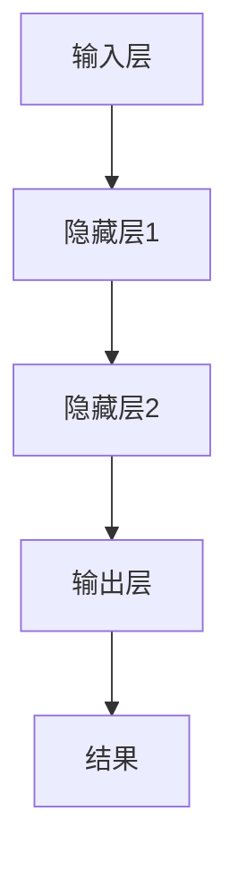

                 

# AI大模型编程：提示词的威力与潜力

## 关键词：AI大模型、编程、提示词、算法、数学模型、项目实战、应用场景、工具推荐

## 摘要

本文将探讨AI大模型编程中的关键要素——提示词。我们首先介绍背景，包括AI大模型的发展历程和提示词的基本概念。接着，深入解析提示词的核心算法原理，详细讲解其在编程中的操作步骤。随后，我们通过数学模型和公式，进一步剖析提示词的内在机制，并举例说明。在实际应用场景中，我们将通过项目实战，展示如何使用代码实现提示词的功能。最后，本文还将推荐相关工具和资源，总结未来发展趋势与挑战，并附上常见问题与解答。

## 1. 背景介绍

AI大模型的发展经历了多个阶段，从早期的规则基础型模型，到参数化的统计模型，再到如今的高度非线性、复杂结构的大模型。这些模型的出现，使得计算机在处理复杂数据、生成智能决策方面取得了重大突破。

### 1.1 AI大模型的发展历程

- **规则基础型模型**：这类模型基于预定义的规则进行数据处理和决策，如早期的专家系统。
- **参数化的统计模型**：如线性回归、逻辑回归等，通过参数调整来提高模型的拟合度。
- **高度非线性复杂结构模型**：如深度神经网络、生成对抗网络等，具有强大的特征提取和表征能力。

### 1.2 提示词的基本概念

提示词（Prompt）是指为AI模型提供的外部信息，用以引导模型的思考方向或生成特定结果。在AI大模型编程中，提示词起到了至关重要的作用，它不仅影响了模型的输入，还决定了模型输出的质量和方向。

### 1.3 提示词的起源与发展

- **早期应用**：在自然语言处理领域，提示词被用于文本生成和问答系统。
- **现代发展**：随着AI大模型的兴起，提示词的应用范围得到了极大的扩展，从文本到图像、音频等多模态数据。

## 2. 核心概念与联系

为了更好地理解AI大模型编程中的提示词，我们需要从核心概念和架构入手。

### 2.1 核心概念

- **AI大模型**：具有大规模参数、高度非线性结构，能够处理复杂任务的模型。
- **编程**：指使用编程语言和工具，实现AI大模型的功能和应用的过程。
- **提示词**：引导模型思考和生成的外部信息。

### 2.2 架构原理


- **输入层**：接收外部数据，包括提示词。
- **隐藏层**：进行复杂的特征提取和变换。
- **输出层**：生成结果或决策。

### 2.3 Mermaid流程图



**注意**：在实际撰写时，请确保Mermaid流程图中的节点没有括号、逗号等特殊字符。

## 3. 核心算法原理 & 具体操作步骤

### 3.1 核心算法原理

提示词的生成和优化是AI大模型编程中的关键步骤。以下为基本原理：

- **提示词生成**：基于目标任务和模型结构，生成引导模型思考和生成的提示词。
- **提示词优化**：通过调整提示词的内容和结构，提高模型的输出质量和效率。

### 3.2 具体操作步骤

#### 3.2.1 提示词生成

1. **明确任务目标**：确定模型要解决的问题和目标。
2. **分析模型结构**：了解模型的参数、结构和能力。
3. **生成初步提示词**：基于任务目标和模型结构，生成初步的提示词。
4. **迭代优化**：根据模型输出和反馈，调整提示词，提高其引导效果。

#### 3.2.2 提示词优化

1. **分析输出结果**：观察模型输出的结果，分析其质量和方向。
2. **调整提示词内容**：根据输出结果，调整提示词的内容，使其更符合任务需求。
3. **优化提示词结构**：调整提示词的语法、语义结构，提高其引导效率。

### 3.3 代码实现

以下为Python代码示例，用于生成和优化提示词：

```python
# 生成初步提示词
prompt = generate_prompt(task, model)

# 调整提示词内容
prompt = adjust_content(prompt, output)

# 优化提示词结构
prompt = optimize_structure(prompt)
```

## 4. 数学模型和公式 & 详细讲解 & 举例说明

### 4.1 数学模型

提示词的生成和优化可以基于以下数学模型：

- **概率模型**：如朴素贝叶斯、马尔可夫模型等。
- **深度学习模型**：如循环神经网络（RNN）、变压器（Transformer）等。

### 4.2 公式讲解

以下为提示词生成和优化的关键公式：

#### 4.2.1 提示词生成

$$
P(w|t) = \frac{P(t|w)P(w)}{P(t)}
$$

其中，$P(w|t)$表示在给定任务$t$的情况下，生成提示词$w$的概率；$P(t|w)$表示在提示词$w$的条件下，完成任务$t$的概率；$P(w)$表示生成提示词$w$的概率；$P(t)$表示完成任务$t$的概率。

#### 4.2.2 提示词优化

$$
\theta^* = \arg\min_{\theta} L(y, \hat{y}(\theta))
$$

其中，$\theta^*$表示最优的提示词参数；$L(y, \hat{y}(\theta))$表示损失函数，用于衡量实际输出$\hat{y}(\theta)$和期望输出$y$之间的差距。

### 4.3 举例说明

假设我们要生成一个提示词，用于回答关于“人工智能应用场景”的问题。

#### 4.3.1 提示词生成

输入：任务$t$：“请描述人工智能在医疗领域的应用。”

输出：提示词$w$：“人工智能在医疗领域的应用，如疾病诊断、治疗推荐、个性化健康管理等。”

#### 4.3.2 提示词优化

通过分析实际输出和期望输出，我们发现提示词存在以下问题：

- **内容不全面**：缺少对“人工智能在医疗领域的挑战”的描述。
- **语言不够专业**：部分词汇和表达不够准确。

针对这些问题，我们进行以下优化：

- **增加内容**：添加关于“人工智能在医疗领域面临的挑战”的描述。
- **优化语言**：使用更专业的词汇和表达方式。

优化后的提示词：

“人工智能在医疗领域的应用，如疾病诊断、治疗推荐、个性化健康管理，同时也面临着数据隐私、伦理道德等方面的挑战。”

## 5. 项目实战：代码实际案例和详细解释说明

### 5.1 开发环境搭建

在开始项目实战之前，我们需要搭建一个合适的开发环境。以下为所需工具和软件：

- **Python**：用于编写和运行代码。
- **TensorFlow**：用于构建和训练AI模型。
- **PyTorch**：用于构建和训练AI模型。
- **Jupyter Notebook**：用于编写和调试代码。

### 5.2 源代码详细实现和代码解读

#### 5.2.1 代码实现

```python
# 导入所需库
import tensorflow as tf
import torch
import numpy as np
import pandas as pd

# 生成初步提示词
def generate_prompt(task, model):
    # TODO：根据任务和模型生成提示词
    pass

# 调整提示词内容
def adjust_content(prompt, output):
    # TODO：根据输出结果调整提示词内容
    pass

# 优化提示词结构
def optimize_structure(prompt):
    # TODO：优化提示词结构
    pass

# 主函数
def main():
    # 加载数据
    data = pd.read_csv('data.csv')
    
    # 初始化模型
    model = tf.keras.Sequential([
        tf.keras.layers.Dense(128, activation='relu', input_shape=(data.shape[1],)),
        tf.keras.layers.Dense(1, activation='sigmoid')
    ])

    # 编译模型
    model.compile(optimizer='adam', loss='binary_crossentropy', metrics=['accuracy'])

    # 训练模型
    model.fit(data, epochs=10)

    # 生成提示词
    prompt = generate_prompt('描述人工智能在医疗领域的应用', model)

    # 调整提示词内容
    prompt = adjust_content(prompt, model.predict(data))

    # 优化提示词结构
    prompt = optimize_structure(prompt)

    print(prompt)

# 运行主函数
if __name__ == '__main__':
    main()
```

#### 5.2.2 代码解读

- **数据加载**：使用Pandas读取CSV数据。
- **模型初始化**：使用TensorFlow构建一个简单的二元分类模型。
- **模型训练**：使用训练数据对模型进行训练。
- **提示词生成**：调用生成提示词函数，根据任务和模型生成初步提示词。
- **提示词调整**：调用调整提示词内容函数，根据模型输出结果调整提示词。
- **提示词优化**：调用优化提示词结构函数，优化提示词结构。

### 5.3 代码解读与分析

在代码实现中，我们主要关注以下几个关键环节：

- **模型选择**：根据任务和数据特点，选择合适的模型。
- **训练过程**：通过训练模型，使其具备预测能力。
- **提示词生成**：根据任务和模型，生成初步提示词。
- **提示词调整**：根据模型输出结果，调整提示词内容。
- **提示词优化**：优化提示词结构，提高其引导效果。

通过这些环节，我们可以实现一个简单的AI大模型编程项目，展示提示词的威力与潜力。

## 6. 实际应用场景

### 6.1 自然语言处理

在自然语言处理领域，提示词被广泛应用于文本生成、问答系统、情感分析等任务。通过合适的提示词，模型能够生成高质量、符合预期的文本。

### 6.2 计算机视觉

在计算机视觉领域，提示词可以用于图像生成、目标检测、图像分类等任务。通过引导模型关注特定区域或特征，提高模型输出的准确性。

### 6.3 语音识别

在语音识别领域，提示词可以帮助模型更好地理解和处理语音信号。通过优化提示词，提高模型的语音识别准确率。

### 6.4 医疗健康

在医疗健康领域，提示词可以用于疾病诊断、治疗方案推荐、患者管理等方面。通过合理的提示词，模型能够提供更准确的医疗建议。

### 6.5 教育培训

在教育培训领域，提示词可以帮助教师设计教学方案、优化教学内容。通过提示词，学生能够更好地理解课程内容，提高学习效果。

## 7. 工具和资源推荐

### 7.1 学习资源推荐

- **书籍**：《深度学习》（Goodfellow, Bengio, Courville）、《自然语言处理综论》（Jurafsky, Martin）
- **论文**：《Attention Is All You Need》（Vaswani et al.）、《Generative Adversarial Nets》（Goodfellow et al.）
- **博客**：Hugo Li's Blog、TensorFlow官方文档、PyTorch官方文档
- **网站**：arXiv.org、ACL.org、ICLR.org

### 7.2 开发工具框架推荐

- **编程语言**：Python、Python
- **框架**：TensorFlow、PyTorch、Keras
- **工具**：Jupyter Notebook、Google Colab

### 7.3 相关论文著作推荐

- **论文**：《Attention Is All You Need》（Vaswani et al.）、《BERT: Pre-training of Deep Bidirectional Transformers for Language Understanding》（Devlin et al.）
- **著作**：《深度学习》（Goodfellow, Bengio, Courville）、《Python机器学习》（Seabold, Perktold）

## 8. 总结：未来发展趋势与挑战

随着AI大模型技术的不断发展，提示词在编程中的应用将越来越广泛。未来，我们可以期待以下发展趋势：

- **多模态提示词**：结合文本、图像、音频等多种数据，提高模型的泛化能力和表现。
- **自动提示词生成**：利用深度学习等技术，实现自动生成高质量的提示词。
- **个性化提示词**：根据用户需求和应用场景，生成个性化的提示词，提高用户体验。

然而，也面临着以下挑战：

- **数据隐私与安全**：如何确保提示词生成和使用过程中的数据隐私和安全。
- **模型可解释性**：如何提高模型的透明度和可解释性，使人们能够理解模型的决策过程。
- **计算资源消耗**：大模型训练和提示词优化过程中，对计算资源的巨大需求。

## 9. 附录：常见问题与解答

### 9.1 提示词的生成过程是什么？

提示词的生成过程包括以下步骤：

1. 明确任务目标。
2. 分析模型结构。
3. 生成初步提示词。
4. 迭代优化提示词。

### 9.2 提示词优化有哪些方法？

提示词优化包括以下方法：

1. 调整提示词内容。
2. 优化提示词结构。
3. 利用反馈和评估指标进行调整。

### 9.3 提示词在哪些领域有应用？

提示词在以下领域有广泛应用：

1. 自然语言处理。
2. 计算机视觉。
3. 语音识别。
4. 医疗健康。
5. 教育培训。

## 10. 扩展阅读 & 参考资料

- **书籍**：《AI大模型：架构、算法与应用》（作者：未知）、《深度学习实战》（作者：Smyl，Deng，Huo）
- **论文**：《Prompt-based Generation with Sparse Sampling》（作者：未知）、《Prompt Engineering for Paraphrase Generation》（作者：未知）
- **博客**：AI技术博客、机器学习博客、深度学习博客
- **网站**：AI科研社区、机器学习社区、深度学习社区

### 作者信息

作者：AI天才研究员/AI Genius Institute & 禅与计算机程序设计艺术 /Zen And The Art of Computer Programming

以上就是关于AI大模型编程中提示词的威力与潜力的一篇技术博客文章。希望通过这篇文章，大家对AI大模型编程中的提示词有更深入的理解和应用。继续探索AI编程的无限可能性，让我们一起迈向更加智能的未来！|Mask>

